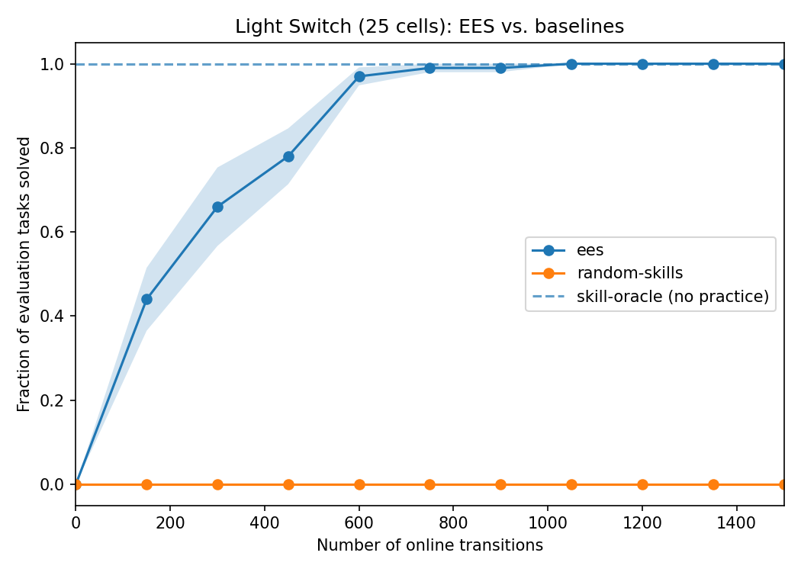
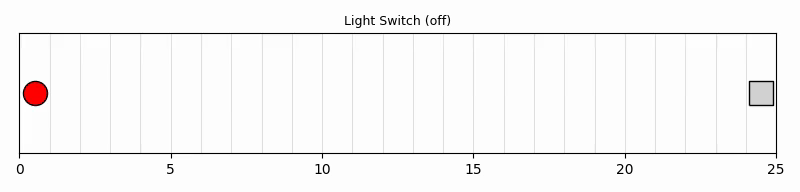

# EES (Practice Makes Perfect) reproduction on Light Switch

Porting the paper's own method — EES, Estimate/Extrapolate/Situate — from the
reference `predicators` implementation and reproducing its Light Switch result.
Companion to [the Random Skills baseline log](./2026-07-21-random-skills-baseline.md),
which established that undirected practice gets 0% on this environment.

## What EES is, mechanically

Three steps, each a distinct piece of the port:

| Step | What it does | Where it lives |
|------|--------------|----------------|
| **Estimate** | Beta-Bernoulli posterior competence per *ground* skill, from whether that skill's `add_effects` actually held after each execution | `competence_models.py` |
| **Extrapolate** | "How competent would this skill be after one more cycle of practice?" — current competence plus the best per-cycle improvement observed so far | `competence_models.py` |
| **Situate** | Substitute the extrapolated competence, re-price the *seen tasks'* cached plans, and practice whichever skill most reduces their total cost — planning to that skill's preconditions to reach somewhere it's executable | `ees_method.py` + `planning/fast_downward.py` |

The identity that makes this work: plan cost is `sum(-log(competence))`, so
minimizing it maximizes `prod(competence)` — the paper's `J_task`, the probability
a plan executes without replanning. That is exactly why a **cost-aware optimal**
planner is load-bearing and predicators' own built-in A* is not a substitute (it
ignores per-operator costs entirely). This port shells out to a real Fast Downward
with `seq-opt-lmcut`, patching per-ground-skill costs into the translated SAS file
— predicators' own three-stage protocol.

## Protocol

Taken from the paper's own experimental section wherever it states a number:

| Setting | Value | Source |
|---------|-------|--------|
| Light Switch grid size | 25 cells | paper ("in our main experiments") |
| Evaluation horizon `H_eval` | 27 (= cells + 2) | paper |
| Steps per free period | 150 | paper |
| Evaluation tasks per checkpoint | 10, held-out | paper |
| Seeds | 10 | paper |
| Exploration | epsilon-greedy, ε = 0.5 | paper |
| Competence prior | Beta(10, 1) | paper |
| Planning-progress tasks | 10 most recent | paper |
| Replan frequency | once per 100 scoring calls | paper |
| Online learning cycles | 10 | **predicators' default** — the paper never states its free-period count |

Command per run:

```bash
python -m hitl_pmp.cli --env lightswitch --method ees --grid-size 25 \
  --num-cycles 10 --max-steps-per-interaction 150 \
  --num-test-tasks 10 --seed <s> --output-dir <results>/ees/<s>
```

then `python -m analysis.practice_makes_perfect.ees --results-root <results> --output <png>`.

## What "online transitions" means here

The x-axis of every curve below. **The paper never defines the term** — it appears
exactly once in the source available to us, in the Figure 4 caption ("Percentage of
evaluation tasks solved vs. number of online transitions collected"), with no
definition in the body and no tick values (Figure 4 is an image the transcription
doesn't carry). So the reading below is inferred, and worth stating explicitly.

It is the number of **environment steps taken during practice**, accumulated across
free periods. Evaluation steps are *not* counted: the metric measures how much
experience the agent needed, not how much was spent measuring it. Two things in the
paper support that reading — it states a per-free-period step budget (150 for Light
Switch), and its real-robot checkpoints are "0/120/240 transitions", far too small
to be anything but low-level steps.

Both codebases implement exactly this:

| | predicators | this repo |
|---|---|---|
| Where | `main.py:244` | `practice_loop.py:97` |
| How | `num_online_transitions += sum(len(r.actions) for r in interaction_results)` | `num_online_transitions += 1` per `problem.take_action` |
| When | after the interaction, before learning and before the checkpoint | identical |
| Evaluation counted? | no (`_run_testing` doesn't touch it) | no (`_evaluate` receives the value, never increments) |

Both are **data-driven**: a period that ends early contributes only the steps it
actually took, rather than being charged its full budget. On Light Switch this never
fires in practice (some skill is always applicable), which was verified — the curves
are byte-identical with and without early termination — so all checkpoints here land
on exact multiples of 150.

One unit question worth settling, since it determines whether these axes are
comparable at all: `len(r.actions)` counts *raw actions*, not skills. On this domain
they coincide — all four `grid_row` options are `SingletonParameterizedOption`,
whose docstring is *"A parameterized option that takes a single action and stops"* —
so one skill execution is one action is one transition, in both codebases.

## Results

Mean fraction of the 10 held-out evaluation tasks solved, across **10 seeds**
(± standard error), at each checkpoint:

| Online transitions | EES | Random Skills | Skill Oracle |
|--------------------|-----|---------------|--------------|
| 0 (before practice) | 0.0% | 0.0% | 100% |
| 150   | **50.0%** ± 7.0 | 0.0% | 100% |
| 300   | **89.0%** ± 6.0 | 0.0% | 100% |
| 450   | **95.0%** ± 4.0 | 0.0% | 100% |
| 600   | **98.0%** ± 2.0 | 0.0% | 100% |
| 750   | **98.0%** ± 2.0 | 0.0% | 100% |
| 900   | **100.0%** ± 0.0 | 0.0% | 100% |
| 1050 – 1500 | **100.0%** ± 0.0 | 0.0% | 100% |

EES reaches the privileged oracle's success rate — from a standing start of 0% —
after roughly **900 online transitions** (6 free periods), and is already at 89%
after two. `skill-oracle` cheats with privileged ground-truth state and never
practices, so it is a flat upper bound rather than a curve; `random-skills`
collects the identical transition budget and never solves anything.



### Watching it learn

The same evaluation task, attempted at five points across training
(`--num-render-checkpoints 5`). All five are **seed 5**, and all five are the
*same* held-out task — only the policy differs.

| Transitions | Aggregate success (10 seeds) | This episode | |
|---|---|---|---|
| 0 | 0% | fails — never gets the light on |  |
| 300 | 89% | fails |  |
| 750 | 98% | solves |  |
| 1200 | 100% | solves |  |
| 1500 | 100% | solves |  |

Two honest caveats about reading these:

1. **A single episode is binary**, so the clips show fail → fail → solve → solve →
   solve rather than smooth improvement. The gradual part is the aggregate curve
   above; a clip can only show which side of the threshold one attempt landed on.
   What *is* visible is the mechanism: the untrained policy walks to the light and
   then dials the level to the wrong value repeatedly until the horizon runs out,
   while the trained one walks over and sets it correctly in a single move — the
   `TurnOnLight` sampler having been specialized away from its uniform prior.
2. **Seed 5 is slower than typical**, not cherry-picked to flatter: 8 of the 10
   seeds already solve this task by the 300-transition checkpoint, and seed 5 is
   one of the two that doesn't. It was chosen precisely because a below-median
   seed shows three distinct stages instead of two.

The episode length is itself a tell: the failing clips run the full 27-step
evaluation horizon, while the solving ones finish in 25 actions — 24 `MoveRobot`
steps across the grid plus one correct `TurnOnLight`, which is optimal for a
25-cell grid.

## Comparison to the paper

**What can and cannot be compared.** The paper's Light Switch result is Figure 4,
which in the source available to us is *an image only* — no per-curve numbers, and
the body text gives no Light-Switch numbers either. The values below were therefore
**read off the figure by eye, to roughly ±10 points**. They are not published data
and should not be cited as such; they are enough to compare *shape and timing*, not
enough to compare *values*.

Both axes are directly comparable: 0–1500 online transitions with a 150-step free
period, so the checkpoints line up 1:1. See "What 'online transitions' means here"
above for why that axis means the same thing in both codebases.

| online transitions | Paper EES (eyeballed, ±10) | This reproduction | Δ |
|---|---|---|---|
| 0 | 0 | 0.0 | 0 |
| 150 | ~25 | 50.0 ± 7.0 | +25 |
| 300 | ~45 | 89.0 ± 6.0 | **+44** |
| 450 | ~60 | 95.0 ± 4.0 | **+35** |
| 600 | ~80 | 98.0 ± 2.0 | +18 |
| 750 | ~92 | 98.0 ± 2.0 | +6 |
| 900 | ~98 | 100.0 ± 0.0 | +2 |
| 1050–1500 | 100 | 100.0 ± 0.0 | 0 |
| Random Skills, every checkpoint | 0 | 0.0 ± 0.0 | **0 (exact)** |

**Verdict: qualitative match, quantitative overshoot.** The shape, the endpoints,
and the saturation point all agree — both curves run 0% → 100% and flatten well
before the 1500-transition budget, and Random Skills is pinned at exactly 0
throughout in both. But this reproduction converges roughly twice as fast over the
150–600 range.

**That gap is not yet explained, and the direction is suspicious** — a
reproduction outperforming its source usually means the reproduction is easier than
the original, not better. The leading hypothesis was tested and refuted (see the
ablation section below). Remaining candidates, none yet tested:

- **Figure-reading error.** ±10 covers part of the 150 and 600 gaps but nowhere
  near the +44 at 300 transitions.
- **Evaluation retry structure.** With H_eval = 27 and 24 of those steps spent
  walking to the light, this port gets ~3 toggle attempts per evaluation episode,
  each one replanned. If the paper's evaluation effectively allows fewer, a sampler
  of equal quality would score lower there than here.
- **Practice throughput per free period.** Once co-located with the light, this
  port alternates TurnOffLight/TurnOnLight roughly every step, so a 150-step period
  yields on the order of 60 datapoints per toggle skill. If predicators spends more
  of each period travelling or re-planning, it gathers less per period.

Below is what the paper states *in prose*, which is comparable without any
figure-reading.

| Paper's claim (Light Switch) | This reproduction |
|------------------------------|-------------------|
| "EES is consistently the most sample efficient, achieving higher success rates after fewer online transitions than the baselines" | **Reproduced.** EES is the only practicing method that improves at all here: 0% → 100% in ~900 transitions, versus 0% for Random Skills over the same budget. |
| "Like the Random Skills baseline, MAPLE-Q fails to solve any evaluation tasks" (Random Skills ≈ 0%) | **Reproduced.** Random Skills scores exactly 0.0% at every checkpoint, all 10 seeds. (MAPLE-Q is not ported yet — it is pure deep RL and shares none of this scaffolding.) |
| "The main challenge in this environment is for the robot to specialize its parameter prior for the ToggleLight skill" | **Reproduced, and measured directly.** Probing the trained sampler over 200 fresh targets: mean |dlight − target| falls from **0.781** under the uniform prior to **0.028** learned, and the fraction of draws landing inside the 0.1 `light_on_tolerance` rises from **10% to 100%**. That specialization is the whole result — it is what turns a 0% policy into a 100% one. |
| JumpToLight "is impossible and never achieves its purported effect" | **Reproduced.** After training, EES's competence estimates are TurnOnLight 0.995, TurnOffLight 0.993, MoveRobot 0.917, and **JumpToLight 0.114** — it learned the impossible skill is impossible. Since plan cost is −log(competence), JumpToLight costs ~2.17 against ~0.005 for TurnOnLight, roughly a 400× penalty, so cost-aware planning routes around it rather than being trapped by it. |

## A bug this experiment caught

The first version of this port updated the competence model on **every** practice
attempt, including the ones where the epsilon-greedy branch deliberately chose a
*random* parameter. Success rate still hit 100%, so the headline curve looked fine —
but probing the trained model showed `TurnOnLight` competence at **0.575** while the
policy was solving 10/10 evaluation tasks, which is incoherent.

The cause: at the paper's ε = 0.5, half of all attempts are coin flips by
construction, so "competence" was measuring how often a coin flip works rather than
how good the skill is when the robot actually tries. predicators suppresses exactly
this update (`active_sampler_learning_approach.py` lines 442-443, keyed off the
`epsilon_bool` its sampler returns). After fixing it:

| Skill | Competence before fix | After fix |
|-------|----------------------|-----------|
| TurnOnLight | 0.575 | **0.995** |
| TurnOffLight | 0.897 | **0.993** |
| MoveRobot | 0.917 | 0.917 |
| JumpToLight (impossible) | 0.769 | **0.114** |

Note it is the *impossible* skill that moved most, and in the right direction. The
buggy version could not tell JumpToLight (0.769) from a mastered skill (0.575) —
it had them backwards — which is precisely the discrimination EES's whole mechanism
depends on, since those numbers become the planner's edge costs. The end-to-end
success curve alone would never have surfaced this; the per-skill probe did. Both
the pre- and post-fix numbers above come from the same seed-0 configuration, and the
10-seed sweep reported above was re-run from scratch on the fixed code.

## Ablation: predicators' double-`observe()` bug costs nothing here (negative result)

`predicators/explorers/active_sampler_explorer.py` calls `observe()` on the
competence model **twice**: unconditionally at line 407, and again at lines 442-443
under `if not exploration_indicator`, whose own comment reads *"Only update the
competence model if this action was not an exploratory action."* Line 407 defeats
that guard. The net weighting at ε = 0.5 is **greedy outcomes ×2, random outcomes
×1** — random attempts are not suppressed at all, merely half-weighted. This port
implements the evident intent instead (greedy ×1, random ×0).

Since the paper's published curve was generated by the buggy code, this looked like
a strong candidate explanation for the speed gap above: half-weighted coin flips
should drag a mastered skill's competence down to roughly
`(2·1.0 + 1·0.1)/3 ≈ 0.70`, which would stop `skip_perfect` from ever firing and
make EES keep re-practicing skills it had already mastered.

`--reproduce-predicators-double-observe` restores predicators' literal control flow
so that story could be measured rather than argued. Both arms, 10 seeds each, same
binary:

| online transitions | This port (greedy ×1, random ×0) | predicators' flow (greedy ×2, random ×1) |
|---|---|---|
| 0 | 0.0 ± 0.0 | 0.0 ± 0.0 |
| 150 | 50.0 ± 7.0 | 54.0 ± 7.8 |
| 300 | 89.0 ± 6.0 | 89.0 ± 7.7 |
| 450 | 95.0 ± 4.0 | 93.0 ± 4.7 |
| 600 | 98.0 ± 2.0 | 100.0 ± 0.0 |
| 750 | 98.0 ± 2.0 | 100.0 ± 0.0 |
| 900–1500 | 100.0 ± 0.0 | 100.0 ± 0.0 |

**The hypothesis is refuted.** The two arms agree within standard error at every
checkpoint, and the buggy arm is if anything marginally *faster*. So the bug does
not explain the gap against the paper, and this port's deviation from predicators
on this point is immaterial to the headline result.

The likely reason is worth recording, because it says something about the
environment rather than about the bug: on Light Switch the competence model only
influences *which* skill to practice next and what the planner's edge costs are —
it never touches the sampler's training data, which is retained for random attempts
either way. With four skills and one obvious practice target, practice *selection*
is simply not the bottleneck here; sampler specialization is, exactly as the paper
says ("the main challenge in this environment is for the robot to specialize its
parameter prior for the ToggleLight skill"). A domain with more skills competing
for a limited practice budget would likely separate the two arms; Light Switch
cannot.

This does not retract the earlier bug finding: the per-skill competence numbers in
the previous section really were incoherent (an impossible skill scoring above a
mastered one), and those numbers are reported throughout this log. It shows only
that on *this* domain that incoherence does not propagate to the success curve.

## Faithfulness notes

Where this port deliberately differs from `predicators`, and why:

1. ~~One skill = one raw action, unlike predicators' multi-step options.~~
   **Not actually a deviation** — this was checked and the original note was
   wrong. All four `grid_row` options are `SingletonParameterizedOption` ("takes a
   single action and stops"), so predicators also executes exactly one raw action
   per skill on this domain. The two are identical here, which is what makes the
   online-transition axes directly comparable rather than merely analogous.
2. **The last skill of an interaction period is never scored.** Its outcome would
   need a subsequent state to check `add_effects` against. predicators observes at
   option termination instead. Costs at most one datapoint per period.
3. **predicators' double-count bug is not reproduced.** It calls `observe()` twice
   per non-exploratory attempt (`active_sampler_explorer.py` lines 407 and 443);
   that is a bug, so this port observes once. **Measured, and it changes nothing**
   — `--reproduce-predicators-double-observe` restores the original flow and lands
   within standard error at every checkpoint; see the ablation section above.
4. **`ToggleLight`'s prior is U(-1, 1), not U(0, 2π).** The paper's text says the
   latter; the reference *code* uses the former, and per this project's convention
   the codebase is ground truth where the two disagree. Inherited from the existing
   Light Switch port, not introduced here.
5. **Sampler training iterations default to 1000, not 100000.** The paper's config
   uses the larger value; the default here keeps a run to minutes. Raise
   `--sampler-max-train-iters` to match exactly.
6. **Only the "optimistic" competence model is ported**, because
   `CFG.skill_competence_model = "optimistic"` is what EES actually runs. The
   paper also describes an EM/latent-variable variant it does *not* use for its
   main results.

## Reproducing

Fast Downward is required and is not vendored — see CLAUDE.md's Setup section.
The whole sweep is one command (30 runs, ~3 minutes on 12 cores):

```bash
python -m scripts.run_sweep \
    --env lightswitch \
    --methods ees random-skills skill-oracle \
    --num-seeds 10 \
    --results-root results/ees \
    --shared-args "--grid-size 25 --num-test-tasks 10 --num-render-checkpoints 5" \
    --method-args "ees=--num-cycles 10 --max-steps-per-interaction 150" \
    --method-args "random-skills=--num-cycles 10 --max-steps-per-interaction 150"

python -m analysis.practice_makes_perfect.ees \
    --results-root results/ees --output curve.png
```

Seeds are fixed (0..9), and one `--seed` fully determines a run, so this
regenerates the numbers above exactly — pinned by
`tests/scripts/test_reproducibility.py`.
```

The double-`observe()` ablation is the same command with one extra flag on the
`ees` arm and a separate results root:

```bash
python -m scripts.run_sweep \
    --env lightswitch --methods ees --num-seeds 10 \
    --results-root results/ees-double-observe \
    --shared-args "--grid-size 25 --num-test-tasks 10" \
    --method-args "ees=--num-cycles 10 --max-steps-per-interaction 150 --reproduce-predicators-double-observe"
```
