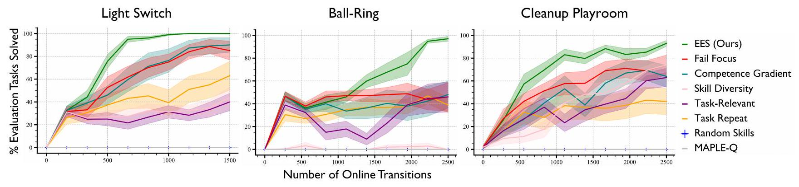

# EES (Practice Makes Perfect) reproduction on Light Switch

Porting the paper's own method — EES, Estimate/Extrapolate/Situate — from the
reference `predicators` implementation and reproducing its Light Switch result.
Companion to [the Random Skills baseline log](./2026-07-21-random-skills-baseline.md),
which established that undirected practice gets 0% on this environment.

## What EES is, mechanically

Three steps, each a distinct piece of the port:

| Step | What it does | Where it lives |
|------|--------------|----------------|
| **Estimate** | Beta-Bernoulli posterior competence per *ground* skill, from whether that skill's `add_effects` actually held after each execution | `competence_models.py` |
| **Extrapolate** | "How competent would this skill be after one more cycle of practice?" — current competence plus the best per-cycle improvement observed so far | `competence_models.py` |
| **Situate** | Substitute the extrapolated competence, re-price the *seen tasks'* cached plans, and practice whichever skill most reduces their total cost — planning to that skill's preconditions to reach somewhere it's executable | `ees_method.py` + `planning/fast_downward.py` |

The identity that makes this work: plan cost is `sum(-log(competence))`, so
minimizing it maximizes `prod(competence)` — the paper's `J_task`, the probability
a plan executes without replanning. That is exactly why a **cost-aware optimal**
planner is load-bearing and predicators' own built-in A* is not a substitute (it
ignores per-operator costs entirely). This port shells out to a real Fast Downward
with `seq-opt-lmcut`, patching per-ground-skill costs into the translated SAS file
— predicators' own three-stage protocol.

## Protocol

Taken from the paper's own experimental section wherever it states a number.

Six settings are **stated differently by the paper's text than by the reference code
that generated the paper's figures**. Since the figures came from the code, this log
follows the code (the project convention), except grid size, where the text's number
is used and the alternative is reported as a separate arm below.

| Setting | Paper text | predicators code | Used here |
|---|---|---|---|
| Light Switch grid size | **25** ("We use a grid size of 25 rooms in our main experiments") | **100** (`settings.py:367`, never overridden by the paper's own yaml) | 25, with a 100-cell arm reported |
| Evaluation horizon `H_eval` | 27 (= cells + 2) | `grid_row_num_cells + 2` | cells + 2 ✓ |
| Competence window `w` | **2** | **5** (`skill_competence_model_optimistic_window_size`) | 5 |
| ToggleLight parameter prior | **U(0, 2π)** | **U(-1, 1)** (`Box(-1.0, 1.0, (1,))`) | U(-1, 1) |
| Sampler training iterations | **10000** (early stop after 5000 no-change) | **100000** (yaml override) | **1000** — see faithfulness note 5 |
| Planning-progress tasks | "the 10 most recently seen tasks" | `sorted(seen_idxs)[:10]`, "Don't randomize: would lead to noisy estimates" | 10 most recent |
| Explore bonus / UCB | **not mentioned at all** | `1e-1`, `use_ucb_bonus=True` | 1e-1 |

Settings where text and code agree, all reproduced exactly:

| Setting | Value | Source |
|---------|-------|--------|
| Steps per free period | 150 | paper + yaml |
| Evaluation tasks per checkpoint | 10, held-out | paper + yaml |
| Seeds | 10 | paper ("we run 10 random seeds of each approach") |
| Exploration | epsilon-greedy, ε = 0.5 | paper + `settings.py` |
| Competence prior | Beta(10, 1) | paper + `settings.py` |
| Replan frequency | once per 100 scoring calls | paper + `settings.py` |
| Sampler candidates | 100, argmax of classifier probability | paper + `settings.py` |
| Planner | Fast Downward, `seq-opt-lmcut`, 10 s timeout | paper + yaml |
| Online learning cycles | 10 | **predicators' default** — the paper never states its free-period count |

Command per run:

```bash
python -m hitl_pmp.cli --env lightswitch --method ees --grid-size 25 \
  --num-cycles 10 --max-steps-per-interaction 150 \
  --num-test-tasks 10 --seed <s> --output-dir <results>/ees/<s>
```

then `python -m analysis.practice_makes_perfect.ees --results-root <results> --output <png>`.

## What "online transitions" means here

The x-axis of every curve below. **The paper never defines the term** — it appears
exactly once in the source available to us, in the Figure 4 caption ("Percentage of
evaluation tasks solved vs. number of online transitions collected"), with no
definition in the body. So the reading below is inferred, and worth stating
explicitly. (Figure 4 itself is reproduced under "Comparison to the paper" below.)

It is the number of **environment steps taken during practice**, accumulated across
free periods. Evaluation steps are *not* counted: the metric measures how much
experience the agent needed, not how much was spent measuring it. Two things in the
paper support that reading — it states a per-free-period step budget (150 for Light
Switch), and its real-robot checkpoints are "0/120/240 transitions", far too small
to be anything but low-level steps.

Both codebases implement exactly this:

| | predicators | this repo |
|---|---|---|
| Where | `main.py:244` | `practice_loop.py:97` |
| How | `num_online_transitions += sum(len(r.actions) for r in interaction_results)` | `num_online_transitions += 1` per `problem.take_action` |
| When | after the interaction, before learning and before the checkpoint | identical |
| Evaluation counted? | no (`_run_testing` doesn't touch it) | no (`_evaluate` receives the value, never increments) |

Both are **data-driven**: a period that ends early contributes only the steps it
actually took, rather than being charged its full budget. On Light Switch this never
fires in practice (some skill is always applicable), which was verified — the curves
are byte-identical with and without early termination — so all checkpoints here land
on exact multiples of 150.

One unit question worth settling, since it determines whether these axes are
comparable at all: `len(r.actions)` counts *raw actions*, not skills. On this domain
they coincide — all four `grid_row` options are `SingletonParameterizedOption`,
whose docstring is *"A parameterized option that takes a single action and stops"* —
so one skill execution is one action is one transition, in both codebases.

## Results

Mean fraction of the 10 held-out evaluation tasks solved, across **10 seeds**
(± standard error), at each checkpoint:

| Online transitions | EES (25 cells) | EES (100 cells) | Random Skills | Skill Oracle |
|---|---|---|---|---|
| 0 (before practice) | 0.0% | 0.0% | 0.0% | 100% |
| 150  | **44.0%** ± 7.5 | 36.0% ± 8.3 | 0.0% | 100% |
| 300  | **66.0%** ± 9.3 | 62.0% ± 10.2 | 0.0% | 100% |
| 450  | **78.0%** ± 6.6 | 79.0% ± 7.8 | 0.0% | 100% |
| 600  | **97.0%** ± 2.1 | 83.0% ± 8.4 | 0.0% | 100% |
| 750  | **99.0%** ± 1.0 | 90.0% ± 3.7 | 0.0% | 100% |
| 900  | **99.0%** ± 1.0 | 92.0% ± 3.6 | 0.0% | 100% |
| 1050 | **100.0%** ± 0.0 | 94.0% ± 4.3 | 0.0% | 100% |
| 1200 | **100.0%** ± 0.0 | 98.0% ± 1.3 | 0.0% | 100% |
| 1350 – 1500 | **100.0%** ± 0.0 | 98.0% ± 2.0 | 0.0% | 100% |

The bolded 25-cell column is the headline arm (the paper text's grid size); the
100-cell column is the reference code's own default, reported because the two
disagree (see Protocol). Both are 10 seeds.

EES reaches the privileged oracle's success rate — from a standing start of 0% —
after roughly **1050 online transitions** (7 free periods), and is already at 66%
after two. `skill-oracle` cheats with privileged ground-truth state and never
practices, so it is a flat upper bound rather than a curve; `random-skills`
collects the identical transition budget and never solves anything, on any seed, at
any checkpoint.

Grid size genuinely matters to these numbers, which is worth stating explicitly
because it did *not* before the harness bug described below was fixed: a larger grid
spends more of each 150-step free period walking to the light and less of it
practicing the toggle, so the 100-cell arm learns more slowly per transition.


### Watching it learn

The same evaluation task, attempted at five points across training
(`--num-render-checkpoints 5`). All five are **seed 5**, and all five are the
*same* held-out task — only the policy differs.

| Transitions | Aggregate success (10 seeds) | This episode | |
|---|---|---|---|
| 0 | 0% | fails — never gets the light on |  |
| 300 | 66% | fails |  |
| 750 | 99% | solves |  |
| 1200 | 100% | solves |  |
| 1500 | 100% | solves |  |

Two honest caveats about reading these:

1. **A single episode is binary**, so the clips show fail → fail → solve → solve →
   solve rather than smooth improvement. The gradual part is the aggregate curve
   above; a clip can only show which side of the threshold one attempt landed on.
   What *is* visible is the mechanism: the untrained policy walks to the light and
   then dials the level to the wrong value repeatedly until the horizon runs out,
   while the trained one walks over and sets it correctly in a single move — the
   `TurnOnLight` sampler having been specialized away from its uniform prior.
2. **Seed 5 is slower than typical**, not cherry-picked to flatter. Per-seed solve
   counts at the 300-transition checkpoint are 10, 6, 7, 6, 3, **2**, 10, 4, 8, 10
   out of 10 — seed 5 is the *worst* of the ten. It was chosen precisely because a
   below-median seed shows three distinct stages instead of two.

The episode length is itself a tell: the failing clips run the full 27-step
evaluation horizon, while the solving ones finish in 25 actions — 24 `MoveRobot`
steps across the grid plus one correct `TurnOnLight`, which is optimal for a
25-cell grid.

## Comparison to the paper

Figure 4 from the paper (Light Switch is the leftmost panel):



> Fig. 4: Simulation results. Percentage of evaluation tasks solved vs. number of
> online transitions collected for all approaches in all simulated environments.
> Solid lines represent means and shading represents standard error across 10 seeds.

**What can and cannot be compared.** Figure 4 is an image; the paper publishes no
per-curve numbers for Light Switch and the body text gives none. The paper column
below is therefore **read off that image by eye, to roughly ±5–10 points**. It is not
published data and should not be cited as such — it is enough to compare *shape and
timing*, not *values*.

The axes are directly comparable: 0–1500 online transitions, 150-step free periods,
10 seeds, standard-error shading on both sides. See "What 'online transitions' means
here" above for why that axis means the same thing in both codebases.

| online transitions | Paper EES (eyeballed, ±5–10) | Ours, 25 cells | Ours, 100 cells |
|---|---|---|---|
| 0 | 0 | 0.0 | 0.0 |
| 150 | ~30 | 44.0 ± 7.5 | 36.0 ± 8.3 |
| 300 | ~42 | 66.0 ± 9.3 | 62.0 ± 10.2 |
| 450 | ~58 | 78.0 ± 6.6 | 79.0 ± 7.8 |
| 600 | ~85 | 97.0 ± 2.1 | **83.0 ± 8.4** |
| 750 | ~96 | 99.0 ± 1.0 | 90.0 ± 3.7 |
| 900 | ~99 | 99.0 ± 1.0 | 92.0 ± 3.6 |
| 1050 | 100 | **100.0 ± 0.0** | 94.0 ± 4.3 |
| 1200–1500 | 100 | **100.0 ± 0.0** | 98.0 ± 2.0 |
| Random Skills, every checkpoint | 0 | **0.0 ± 0.0** | — |

**Verdict: the qualitative result reproduces; the mid-curve is still optimistic.**

What matches:

- **Shape.** Both rise steeply, knee around 450–670, then saturate — not a straight
  line and not a late step change.
- **Saturation point.** The paper's EES reaches 100% at roughly 1000 transitions;
  the 25-cell arm reaches it at 1050.
- **The floor.** Random Skills is exactly 0.0% at every checkpoint on all 10 seeds,
  matching the paper's flat-zero Random Skills (and its flat-zero MAPLE-Q).
- **The claim being tested.** "EES is consistently the most sample efficient" holds:
  it is the only practicing method here that improves at all.

What does not:

- Ours is **~15–25 points high over the 150–450 band** at both grid sizes. Since it
  persists at 25 *and* 100 cells, it is not a grid-size artifact.
- The two grid sizes trade off against each other rather than one being clearly
  right: 100 cells tracks the paper's mid-curve better (83 vs ~85 at 600, where 25
  cells overshoots to 97), but plateaus at 98% instead of reaching a clean 100%.

**Where the remaining gap probably lives.** An audit of every `CFG.*` setting the
reference reads (see Faithfulness notes) leaves three candidates, none yet tested:

1. **`skip_perfect` / UCB denominators.** predicators computes both from
   `_ground_op_hist`, which records *every* execution including epsilon-random ones;
   this port computes them from competence observations, which exclude random
   attempts. Ours therefore reaches a measured success rate of 1.0 sooner, drops a
   mastered skill as a practice target earlier, and moves on — plausibly the single
   largest remaining effect, and in the right direction to explain an early lead.
2. **Epsilon-greedy scope.** predicators uses the exploration sampler only for the
   practice target; every prefix and goal-pursuit skill runs through the greedy test
   sampler. This port explores on all of them.
3. **Sampler training length**, 1000 iterations against the paper config's 100000 —
   this one cuts the other way and should make ours *worse*, so it does not explain
   an overshoot, but it does mean neither arm is a like-for-like comparison.

## Two bugs this experiment caught

### 1. Competence polluted by epsilon-greedy random attempts

The first version of this port updated the competence model on **every** practice
attempt, including the ones where the epsilon-greedy branch deliberately chose a
*random* parameter. Success rate still hit 100%, so the headline curve looked fine —
but probing the trained model showed `TurnOnLight` competence at **0.575** while the
policy was solving 10/10 evaluation tasks, which is incoherent.

The cause: at the paper's ε = 0.5, half of all attempts are coin flips by
construction, so "competence" was measuring how often a coin flip works rather than
how good the skill is when the robot actually tries. predicators suppresses exactly
this update (`active_sampler_learning_approach.py` lines 442-443, keyed off the
`epsilon_bool` its sampler returns). After fixing it:

| Skill | Competence before fix | After fix |
|-------|----------------------|-----------|
| TurnOnLight | 0.575 | **0.995** |
| TurnOffLight | 0.897 | **0.993** |
| MoveRobot | 0.917 | 0.917 |
| JumpToLight (impossible) | 0.769 | **0.114** |

Note it is the *impossible* skill that moved most, and in the right direction. The
buggy version could not tell JumpToLight (0.769) from a mastered skill (0.575) —
it had them backwards — which is precisely the discrimination EES's whole mechanism
depends on, since those numbers become the planner's edge costs. The end-to-end
success curve alone would never have surfaced this; the per-skill probe did. Both
the pre- and post-fix numbers above come from the same seed-0 configuration, and the
10-seed sweep reported above was re-run from scratch on the fixed code.

### 2. The practice period never reset the environment

`PracticeLoop` sampled a train task each cycle and handed it to the `Method`, but
never installed its initial state into the environment — it read
`problem.get_current_state()`, i.e. whatever the preceding *evaluation sweep* left
behind. predicators resets per interaction request (`main.py:301-302`,
`cogman.reset(env_task)`).

An evaluation episode ends with the environment in a **solved** state, so every free
period began having already achieved the goal: on Light Switch, with the robot
already standing at the light. It skipped the entire traversal and spent all 150
steps practicing the toggle.

The tell was that **`--grid-size` had no effect whatsoever** — whole-sweep
`stats.json` files were byte-identical at 25 and 100 cells, which is not a property
this environment should have. Sampler datapoints collected over two 150-step
periods, before → after:

| | before | after |
|---|---|---|
| `--grid-size 25`, TurnOnLight | 226 | 230 |
| `--grid-size 100`, TurnOnLight | 226 | **91** |

Fixed in a separate PR ahead of this one, since it lives in the shared harness and
affects every `Method`, not just EES. **Every number in this log postdates that
fix**; the pre-fix curve was materially more optimistic (89% at 300 transitions
against 66% now).

It survived earlier review because `tests/test_practice_loop.py`'s fake task
generator returned the same initial state for train *and* test tasks, making
"resumed from the evaluation sweep" and "started from the train task"
indistinguishable. The fakes now differ, and a test pins each half of the contract:
state is continuous *within* a free period, and reset *between* periods.

## Ablation: predicators' double-`observe()` bug costs nothing here (negative result)

`predicators/explorers/active_sampler_explorer.py` calls `observe()` on the
competence model **twice**: unconditionally at line 407, and again at lines 442-443
under `if not exploration_indicator`, whose own comment reads *"Only update the
competence model if this action was not an exploratory action."* Line 407 defeats
that guard. The net weighting at ε = 0.5 is **greedy outcomes ×2, random outcomes
×1** — random attempts are not suppressed at all, merely half-weighted. This port
implements the evident intent instead (greedy ×1, random ×0).

Since the paper's published curve was generated by the buggy code, this looked like
a strong candidate explanation for the speed gap above: half-weighted coin flips
should drag a mastered skill's competence down to roughly
`(2·1.0 + 1·0.1)/3 ≈ 0.70`, which would stop `skip_perfect` from ever firing and
make EES keep re-practicing skills it had already mastered.

`--reproduce-predicators-double-observe` restores predicators' literal control flow
so that story could be measured rather than argued. Both arms, 10 seeds each, same
binary:

| online transitions | This port (greedy ×1, random ×0) | predicators' flow (greedy ×2, random ×1) |
|---|---|---|
| 0 | 0.0 ± 0.0 | 0.0 ± 0.0 |
| 150 | 44.0 ± 7.5 | 44.0 ± 9.1 |
| 300 | 66.0 ± 9.3 | 60.0 ± 9.1 |
| 450 | 78.0 ± 6.6 | 73.0 ± 11.3 |
| 600 | 97.0 ± 2.1 | 95.0 ± 4.0 |
| 750 | 99.0 ± 1.0 | 100.0 ± 0.0 |
| 900 | 99.0 ± 1.0 | 100.0 ± 0.0 |
| 1050 | 100.0 ± 0.0 | 100.0 ± 0.0 |
| 1200 | 100.0 ± 0.0 | 99.0 ± 1.0 |
| 1350–1500 | 100.0 ± 0.0 | 100.0 ± 0.0 |

**The hypothesis is refuted.** The two arms agree within standard error at every
checkpoint, with no consistent direction — the buggy arm is slightly behind early
and slightly ahead late. (This ablation was re-run from scratch after the
environment-reset fix above; the conclusion is unchanged from the pre-fix run.) So
the bug does
not explain the gap against the paper, and this port's deviation from predicators
on this point is immaterial to the headline result.

The likely reason is worth recording, because it says something about the
environment rather than about the bug: on Light Switch the competence model only
influences *which* skill to practice next and what the planner's edge costs are —
it never touches the sampler's training data, which is retained for random attempts
either way. With four skills and one obvious practice target, practice *selection*
is simply not the bottleneck here; sampler specialization is, exactly as the paper
says ("the main challenge in this environment is for the robot to specialize its
parameter prior for the ToggleLight skill"). A domain with more skills competing
for a limited practice budget would likely separate the two arms; Light Switch
cannot.

This does not retract the earlier bug finding: the per-skill competence numbers in
the previous section really were incoherent (an impossible skill scoring above a
mastered one), and those numbers are reported throughout this log. It shows only
that on *this* domain that incoherence does not propagate to the success curve.

## Faithfulness notes

Every `CFG.*` setting the reference reads across `active_sampler_explorer.py`,
`active_sampler_learning_approach.py`, `competence_models.py`, `main.py`,
`settings.py`, and the paper's own yaml was audited against this port. The MLP
sampler matches exactly (hidden sizes `[32, 32]`, Adam at `1e-3`, BCE, full-batch,
`n_iter_no_change=5000`, best-loss checkpointing, balancing off, min/max
normalization, 100 test-time candidates, refit from scratch each cycle), as does the
competence math, the UCB bonus, tie-breaking, plan re-pricing, and the Fast Downward
three-stage protocol. What follows is everything that differs.

**Deliberate, and measured to be immaterial:**

1. **predicators' double-count bug is not reproduced.** It calls `observe()` twice
   per non-exploratory attempt (`active_sampler_explorer.py:407` unconditionally,
   then `:442-443` under the guard), so the suppression its own comment describes
   never takes effect. This port observes once.
   `--reproduce-predicators-double-observe` restores the original flow and lands
   within standard error at every checkpoint — see the ablation above.

**Deliberate, untested, and plausibly part of the remaining gap:**

2. **`skip_perfect` and the UCB `num_tries` use exploration-excluding counts.**
   predicators reads `_ground_op_hist`, appended on *every* execution including
   epsilon-random ones (`:400`); this port reads competence observations, which
   exclude them. Ours reaches a measured rate of 1.0 sooner and stops practicing a
   mastered skill earlier. The best current candidate for the mid-curve overshoot.
3. **Epsilon-greedy applies to every skill in a practice episode.** predicators
   uses the exploration sampler only for the practice target itself; prefix and
   goal-pursuit skills run through the greedy *test* sampler and do update
   competence.
4. **Sampler training iterations default to 1000**, against the paper config's
   100000 (and the paper text's 10000). Keeps a run to minutes; raise
   `--sampler-max-train-iters` to match. Cuts *against* our results, not for them.
5. **Test tasks are resampled every sweep** from a continuing RNG stream;
   predicators re-runs one fixed set of test tasks at every checkpoint. Same
   expectation, more sweep-to-sweep variance here.
6. **No horizon cap on the goal-pursuit phase.** predicators cuts over to practice
   after `CFG.horizon` steps; this port pursues the goal until it is achieved or
   planning fails.
7. **Replanning tasks are not implemented.** predicators also scores planning
   progress against a `maxlen=5` deque of fictitious goals generated during
   replanning; this port scores only against seen train tasks.

**Not deviations (corrections to earlier claims in this log):**

8. ~~One skill = one raw action, unlike predicators' multi-step options.~~ **Wrong
   premise.** All four `grid_row` options are `SingletonParameterizedOption` ("takes
   a single action and stops"), so predicators also executes one raw action per
   skill here. That is what makes the online-transition axes directly comparable.
9. ~~`ToggleLight`'s U(-1, 1) prior is a deviation.~~ **It matches the reference
   code exactly** (`Box(-1.0, 1.0, (1,))`). It differs from the paper *text*, which
   says U(0, 2π) — a paper-vs-code discrepancy, not a port-vs-reference one. Same
   for the competence window (text says `w=2`, code uses 5).

**Scope:**

10. **The last skill of an interaction period is never scored**, since checking
    `add_effects` needs a subsequent state. predicators observes at option
    termination. Costs at most one datapoint per period.
11. **Only the "optimistic" competence model is ported**, because
    `CFG.skill_competence_model = "optimistic"` is what EES actually runs. The paper
    also describes an EM/latent-variable variant it does *not* use for main results.
12. **Seven of the paper's eight Figure 4 approaches are not ported.** Fail Focus,
    Competence Gradient, Skill Diversity, Task-Relevant, Task Repeat, and MAPLE-Q
    remain unbuilt; `skill-oracle` is this project's own addition and is not in the
    paper.

## Reproducing

Fast Downward is required and is not vendored — see CLAUDE.md's Setup section.
The whole sweep is one command (30 runs, ~3 minutes on 12 cores):

```bash
python -m scripts.run_sweep \
    --env lightswitch \
    --methods ees random-skills skill-oracle \
    --num-seeds 10 \
    --results-root results/ees \
    --shared-args "--grid-size 25 --num-test-tasks 10 --num-render-checkpoints 5" \
    --method-args "ees=--num-cycles 10 --max-steps-per-interaction 150" \
    --method-args "random-skills=--num-cycles 10 --max-steps-per-interaction 150"

python -m analysis.practice_makes_perfect.ees \
    --results-root results/ees --output curve.png
```

Seeds are fixed (0..9), and one `--seed` fully determines a run, so this
regenerates the numbers above exactly — pinned by
`tests/scripts/test_reproducibility.py`.
```

The double-`observe()` ablation is the same command with one extra flag on the
`ees` arm and a separate results root:

```bash
python -m scripts.run_sweep \
    --env lightswitch --methods ees --num-seeds 10 \
    --results-root results/ees-double-observe \
    --shared-args "--grid-size 25 --num-test-tasks 10" \
    --method-args "ees=--num-cycles 10 --max-steps-per-interaction 150 --reproduce-predicators-double-observe"
```
