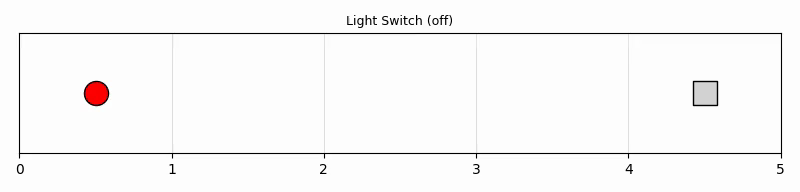
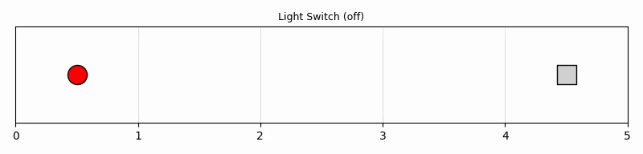
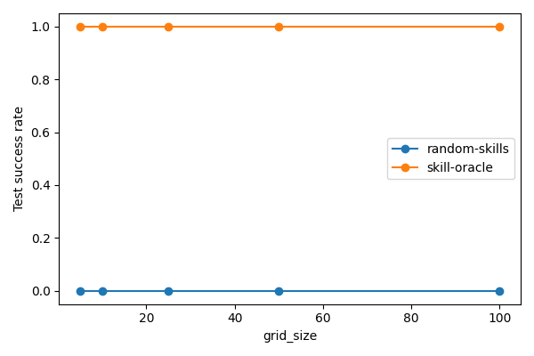
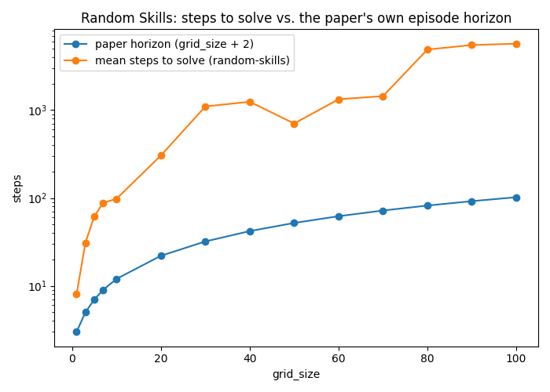

# Random Skills baseline: does it work, and why not?

`RandomSkillsMethod` (PR #18) uniformly samples among the currently-applicable
ground skills each step and executes one — no planning, no competence model, no
sampler learning, matching predicators' own `RandomOptionsApproach` exactly. This
log records how it actually performs against `SkillOracleMethod` (the
privileged-knowledge upper bound), and digs into *why* it performs the way it does.

## Example episodes

`skill-oracle` solves in exactly 2 moves (it cheats with privileged state);
`random-skills` wanders for the full episode without a plan:

## Experiment 1: success rate at the paper's own evaluation protocol

`python -m hitl_pmp.cli --env lightswitch --method <name> --grid-size <n> --seed <s> --num-test-tasks 10 --output-dir <dir>`,
for `<name> ∈ {random-skills, skill-oracle}`, `<n> ∈ {5, 10, 25, 50, 100}`, 3 seeds
each, then `python -m analysis.practice_makes_perfect.random_skills --results-root ... --output ...`
against the resulting `<method>/<grid_size>/<seed>/stats.json` tree:

| method        | grid_size | seeds | mean success | stdev |
|---------------|-----------|-------|--------------|-------|
| random-skills | 5         | 3     | 0.0%         | 0.0%  |
| random-skills | 10        | 3     | 0.0%         | 0.0%  |
| random-skills | 25        | 3     | 0.0%         | 0.0%  |
| random-skills | 50        | 3     | 0.0%         | 0.0%  |
| random-skills | 100       | 3     | 0.0%         | 0.0%  |
| skill-oracle  | 5         | 3     | 100.0%       | 0.0%  |
| skill-oracle  | 10        | 3     | 100.0%       | 0.0%  |
| skill-oracle  | 25        | 3     | 100.0%       | 0.0%  |
| skill-oracle  | 50        | 3     | 100.0%       | 0.0%  |
| skill-oracle  | 100       | 3     | 100.0%       | 0.0%  |

**Random Skills scores 0% at every grid size tested, not just large ones.** The
paper's own per-episode horizon (`grid_size + 2`, i.e. roughly the *optimal* path
length) is calibrated for a near-optimal solver, not random search — Experiment 2
below quantifies the gap.

## Experiment 2: how many steps does random search actually need?

Same setup, but running `RandomSkillsPolicy` directly (not through the CLI/episode
harness) with a step cap `= max(2 · grid_size², 200)` — scaling the budget with
`grid_size` instead of using the paper's fixed horizon, so larger grid sizes get
proportionally more room rather than being unfairly cut off. 3 seeds each.

| grid_size | paper horizon | cap    | mean steps to solve | solved/3 |
|-----------|---------------|--------|----------------------|----------|
| 1         | 3             | 200    | 8                    | 3/3      |
| 3         | 5             | 200    | 31                   | 3/3      |
| 5         | 7             | 200    | 62                   | 3/3      |
| 7         | 9             | 200    | 88                   | 3/3      |
| 10        | 12            | 200    | 98                   | 3/3      |
| 20        | 22            | 800    | 305                  | 2/3      |
| 30        | 32            | 1800   | 1100                 | 3/3      |
| 40        | 42            | 3200   | 1245                 | 3/3      |
| 50        | 52            | 5000   | 704 *(low — only 1/3 solved; see below)* | 1/3 |
| 60        | 62            | 7200   | 1329                 | 2/3      |
| 70        | 72            | 9800   | 1443                 | 2/3      |
| 80        | 82            | 12800  | 4890                 | 2/3      |
| 90        | 92            | 16200  | 5500                 | 2/3      |
| 100       | 102           | 20000  | 5703                 | 2/3      |

Overall, **34/42 seeds (81%) solved within their quadratic-scaled cap** across all
14 grid sizes — the rest are genuine long-tail outliers (see the compounding
argument below), not a sign the cap itself is systematically too small. Note the
apparent "flattening" of the orange line above `grid_size=60` in the plot below is
itself partly a cap artifact (the same survivorship-bias effect discussed for
`grid_size=50`, just less severe) — it is not evidence the true scaling is
sub-quadratic.

An earlier pass at this used a **fixed** cap of 2000 steps regardless of
`grid_size`. That systematically underestimated the true mean at larger sizes: any
seed that didn't finish within 2000 steps was silently dropped from the average, so
the reported "mean" only reflects the lucky/fast seeds. At `grid_size=100` under
the fixed cap, **0/3 seeds solved at all** — the quadratic cap above is the fairer
comparison.

## Why: this is a textbook random-walk hitting-time problem

Away from the light, `MoveRobot` is the only applicable skill, so the robot's
position is exactly a simple symmetric random walk on `{0, ..., grid_size-1}`,
reflecting at 0 (forced to step right from cell0, matching `GridRowEnv`'s own
dynamics in the reference `hitl-practice` repo). For that walk, the expected
hitting time from 0 to reach the far end is **exactly `grid_size²`** — not just
asymptotically. Direct recurrence solve: let `h(x)` = expected steps to reach `L`
from position `x`. Interior: `h(x) = 1 + ½h(x-1) + ½h(x+1)`; reflecting boundary:
`h(0) = 1 + h(1)`. Solving gives `h(0) = L²` exactly (check `L=2`: works out to 4).
This is the discrete analogue of a reflected Brownian motion's hitting time, which
scales the same way under the diffusive scaling limit (Donsker's theorem) — so
quadratic growth is the right theoretical expectation.

The real system is *harder* than this clean formula predicts, for two reasons:

1. **Reaching the light's cell isn't absorbing.** `MoveRobot` stays applicable
   there too, so the walk can leave before getting a useful `TurnOnLight` roll and
   need to return — possibly many times.
2. **The light's level is a second, superimposed random walk.** `dlight` adds to
   the current level rather than resetting it (clipped to `[0, 1]`), and needs to
   land within `±0.1` (`light_on_tolerance`) of the target. This sub-problem
   doesn't depend on `grid_size`, so it doesn't change the asymptotic *order* of
   the scaling — but it multiplies the effective difficulty of every visit to the
   target cell.

Compounding two coupled random-walk hitting times is exactly what produces the
heavy right tail visible in Experiment 2 (e.g. `grid_size=50`: 2 of 3 seeds didn't
finish even with 5000 steps of budget, 2.5× the nominal `2·grid_size²` margin used
everywhere else — the true mean there is materially higher than the 704 shown,
which only reflects the one lucky seed).

A power-law fit restricted to the fully-solved (3/3) points from Experiment 2
(`{3, 5, 7, 10, 30, 40}`, excluding the degenerate `grid_size=1` case) gives
`steps ≈ 5 · grid_size^1.51` (R²=0.97) — sub-quadratic. Given the small sample and
modest sizes involved (and that a couple of the "solved" points, like `40`, are
plausibly still a bit inflated by seeds that got close to their cap), this is more
likely an underestimate of the true exponent from limited data than a genuine
refutation of the `grid_size²` theory above.

## Bottom line

Random Skills is expected, by design, to fail badly at the paper's own evaluation
protocol — exactly demonstrating why the smarter baselines and EES itself are
needed. The gap between the paper's linear horizon and random search's quadratic
hitting time only widens with scale.
