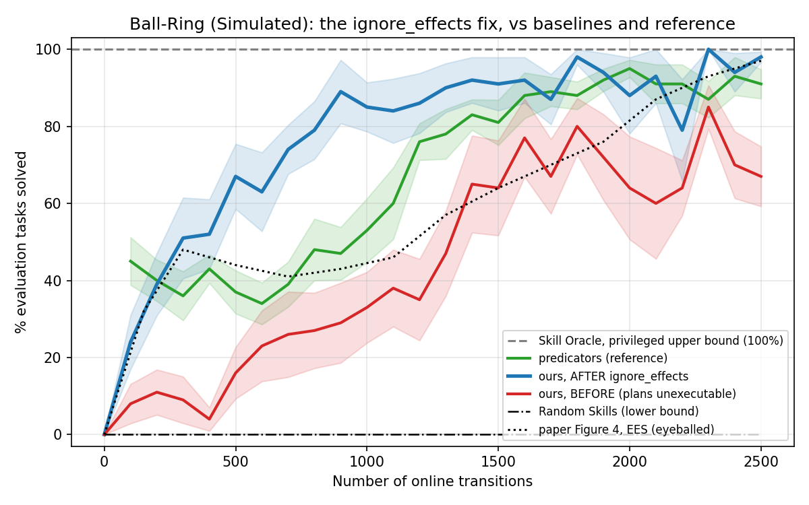

# `ignore_effects`: Ball-Ring evaluation plans were structurally unexecutable

The Ball-Ring reproduction trailed the `predicators` reference by ~25 points with three
times its variance. A long investigation blamed EES hyperparameters, the exploration
policy, and the evaluation protocol in turn. All of those were wrong. The cause was a
missing concept in the operator representation.



## The defect

predicators' three `NavigateTo*` NSRTs declare
`ignore_effects = {ReachableSurface, ReachableBall, ReachableCup}`
(`ground_truth_models/ball_and_cup_sticky_table/nsrts.py:457,514,526`), compiled to PDDL
as a universal delete (`structs.py:782-791`) and applied symbolically at
`utils.py:3233`. Navigating anywhere wipes **every** reachability atom.

This port had no `ignore_effects` field on `Skill` at all, so reachability was
**monotone** — once reachable to something, reachable forever. Asked to plan a real
Ball-Ring task, `EesMethod.plan_to` returned:

```
0 NavigateToTable(robot, normal-table-1)
1 NavigateToTable(robot, sticky-table-0)               <- navigates away
2 PickBallFromTable(robot, ball, cup, normal-table-1)  <- picks off the table it left
3 PlaceBallOnTable(robot, ball, cup, sticky-table-0)
```

Simulated symbolically, that plan is executable under our model and fails at step 2
under predicators'. After the fix the same task plans as `Nav -> Pick -> Nav -> Place`.

## Why it looked like variance

Every ordering of a broken plan uses the same multiset of ground skills, so they are
**exactly cost-tied** under `-log(competence)` pricing. Fast Downward therefore chose
among them by internal tie-breaking, and whether the forced mid-execution replan fitted
the remaining horizon-8 budget was effectively a per-task lottery. That is why the
symptom presented as a wide, jagged band with bimodal seeds rather than a uniform
shortfall — visible in the red curve above — and why every earlier hypothesis that
assumed a *systematic* cause failed to explain it.

## Why an operator audit missed it

A dedicated environment-fidelity audit diffed all 16 Ball-Ring operators'
`preconditions` / `add_effects` / `delete_effects` against the reference and reported
them matching. It was right: a field-by-field diff passes cleanly when an entire *class*
of effect is absent from the representation, because there is no field to disagree
about. Finding it required simulating a returned plan against both models and comparing
executability, not comparing operator definitions.

## Result

10 seeds, Ball-Ring, 10000 sampler iterations, fixed test set, arms run **sequentially**
on one base so the fix is the only difference (Fast Downward's timeout is wall-clock, so
concurrent arms would bias each other):

| arm | final mean % | sd | worst seed | seeds at 0% |
|---|---|---|---|---|
| before | 67 | 24.5 | 30 | 0 |
| **after `ignore_effects`** | **98** | **4.2** | **90** | 0 |
| *predicators (reference)* | *91* | *12.0* | *70* | *0* |
| Skill Oracle (privileged) | 100 | 0 | 100 | 0 |
| Random Skills | 0 | 0 | 0 | 10 |

+31 points, p < 0.001 (Welch). Every seed reached 2500 transitions in both arms, so the
x-axis is comparable. Power analysis: the effect needed 6 seeds at 80% power; 10 were
run. The variance collapse (sd 24.5 -> 4.2) matters as much as the mean — it is the
lottery disappearing.

## Read the >91% with suspicion

The fixed port now **exceeds** the reference at a third of its variance. The obvious
explanation — that our Ball-Ring is easier than predicators' — was tested and
**rejected**: a follow-up branch restoring floor-placement jitter (which takes the
spurious `BallInCup` rate from 100% down to 0.545%, matching the reference's geometry),
fixing a navigation no-op bug, and removing a repeated-object grounding filter measures
**99%, p = 0.55** against this arm. Those are correctness fixes; they do not explain
the gap.

The remaining untested hypothesis is that predicators' own 91% is itself depressed:
its reference runs were executed in parallel, and its planner shells out under a
wall-clock timeout, so some of its evaluation failures may be contention artifacts
rather than policy failures. Testing that means re-running the reference sequentially.

## What this invalidated

Three conclusions recorded earlier in this project were artifacts of this bug (and of a
second one, where a single `explore` flag gated both epsilon-greedy exploration *and*
sampler-data recording, so an ablation silently starved the learner):

- the epsilon-greedy **scope** ablation, reported as "refuted as a standalone cause";
- the **goal-pursuit horizon cap** follow-up, reported as "does not close the gap";
- the claim that target-only exploration **deadlocks Light Switch**.

Re-measured on a working planner and without the data-loss confound, the scope and
horizon-cap changes are null (−2, p = 0.44) and the deadlock claim is withdrawn (the
sampler now fits and the goal is reached: 83 training rows versus 9). The corrections
are recorded in `2026-07-24-ballring-ees.md` and in PR #24's description.

## Reproducing

```bash
# before (main prior to this change) and after, run one at a time
python -m scripts.run_sweep --env ballring --methods ees --num-seeds 10 \
  --results-root results/ignore-effects-after \
  --shared-args "--num-test-tasks 10" \
  --method-args "ees=--num-cycles 25 --max-steps-per-interaction 100 \
    --competence-window-size 2 --competence-recency-size 2 \
    --exploration-epsilon 0.5 --sampler-max-train-iters 10000"

python -m analysis.practice_makes_perfect.ballring_ignore_effects \
  --before-root results/ignore-effects-before --after-root results/ignore-effects-after \
  --baselines-root results/ballring-1k \
  --predicators-json results/predicators-ballring-25cyc.json \
  --output docs/experiment-logs/2026-08-01-ballring-ignore-effects.png
```

The predicators reference is aggregated from its native result pickles
(`results_25cyc/ball_and_cup_sticky_table__active_sampler_learning__<seed>__*__<cycle>.pkl`,
reading `num_solved` / `num_total` / `num_online_transitions` per file) into a
`{seed: {transitions: frac_solved}}` JSON.
