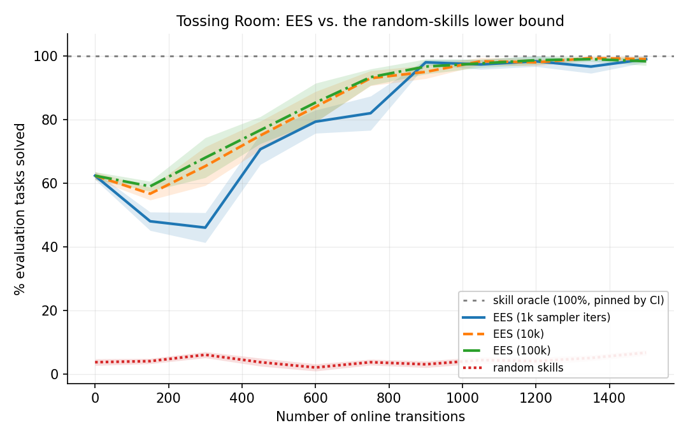
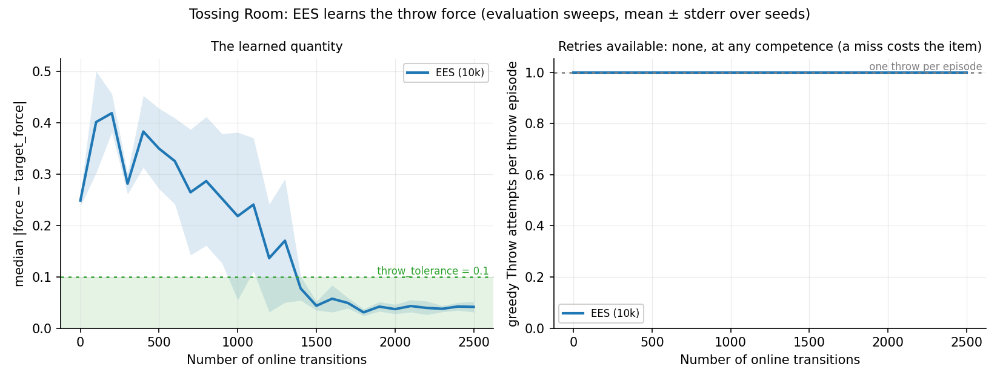
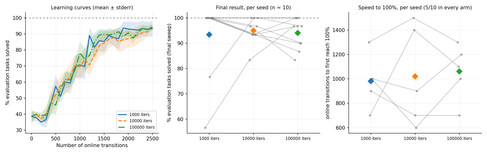
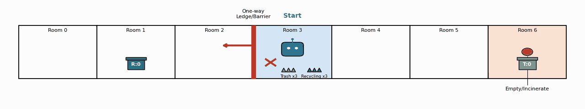
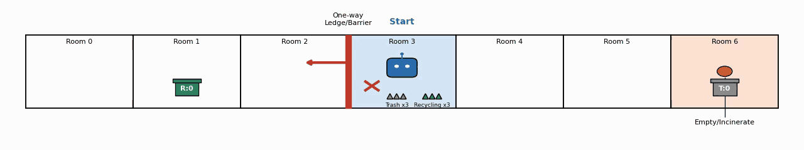

# Tossing Room: EES learns the throw force, and the evaluation horizon was hiding it

> ## Regenerated 2026-08-04 under the fixed 14/14/2 evaluation set
>
> The test set's goal-family composition used to be **sampled per seed** — seed 0 drew
> 16 TRASH / 10 RECYCLING / 4 EMPTY, seed 1 drew 11/12/7, seed 2 drew 10/14/6. It is now
> **fixed at 14 TRASH / 14 RECYCLING / 2 EMPTY on every seed** at the 30 test tasks this
> domain's experiments use. Every percentage in this file was therefore measured against
> a different denominator than the code now produces, so the arms were re-run and the
> numbers below are the new ones. **Previous values are recorded inline** wherever one
> moved, so the change is auditable rather than invisible.
>
> **What moved, and why.** `EMPTY` needs no `Throw` and is solved every time; it used to
> be ~20% of the test set and is now 2/30 = 6.7%. The **unpracticed floor falls sharply**
> — 38.7% → 25.7% — because a much smaller share of the evaluation is now free. That is a
> change of denominator, not of behaviour, and the single-attempt model that predicted
> the floor still predicts it once its composition constant is re-derived (see
> [the follow-up section](#effect-on-an-unpracticed-policy)). The **trained arms barely
> move**, and if anything move slightly up rather than down; the harder test set costs
> them little because a trained sampler already lands most throws. The numbers, the
> direction, and the noise floor are in
> [the release-arm table](#the-sampler-iteration-grid-the-null-is-withdrawn-and-this-design-cannot-resolve-it).
>
> **One conclusion did not survive**: the sampler-iteration grid's null. See the ⚠ box in
> [that section](#the-sampler-iteration-grid-the-null-is-withdrawn-and-this-design-cannot-resolve-it).
>
> **Two sections here are older than that, and are marked superseded in place rather
> than re-run**: the pre-release measurements taken when a missed `Throw` was still
> free. They are the evidence for a defect that no longer exists, they cannot reproduce
> against current code by construction, and re-running them would spend compute
> re-deriving a fixed bug. They are kept because the argument they support is what
> motivated the fix.
>
> **A confound worth stating up front.** The previous numbers were produced on different
> hardware. Re-running the archived `ees10000` arm at its own commit on *this* machine
> gave 96.0% against the 95.0% recorded here, so roughly a point of any arm-level change
> below is machine, not composition. Per-seed values are machine-local; compare at arm
> level. (Recorded on the closed PR #37 branch, `8866d9b`.)
>
> **Every success rate from the re-run is reported as a count, `x/y`.** The numerators
> and denominators are not derived from the percentages — they are what was recorded:
> `Metrics.record_evaluation` writes `(num_online_transitions, num_solved, num_total)`
> triples into each run's `stats.json` (and validates any per-task `breakdowns` against
> exactly those two integers). The triples for all four release arms are committed as
> [`2026-08-04-tossingroom-arms.json`](2026-08-04-tossingroom-arms.json), and the
> horizon and throw-convergence counts are summed from the per-episode records already
> committed as `2026-08-04-tossingroom-horizon-h*.json` and
> `2026-08-04-tossingroom-throw-traces.json` — so every count here re-derives from a
> file in this repo. *Differences* of rates stay in percentage points: gaps, paired
> differences, sds and noise floors are not counts of anything. Figures carried over
> from the **pre-release** measurements stay as percentages too, and say so where they
> appear — no per-episode record of those runs survives, so they have no honest
> denominator.

**Result.** `TossingRoomProblem.max_episode_steps` was `2 * num_rooms + 2 = 16` against
a 5-skill solve — eleven spare steps, every one of them a free retry of the domain's
single stochastic skill. An **unpracticed** EES scored **94.7%** that way, five points
under the skill oracle, having learned nothing at all; at the corrected horizon it
scores 62.7%. Porting Light Switch's `H_eval` convention (longest shortest solve + 2 =
7) makes the curve legible without touching a single practice step.

With the metric fixed, EES's learned sampler is visibly doing the thing it is supposed
to do: it drives `Throw`'s force onto each task's own `target_force`, median greedy
error **0.249 → 0.041** (the tolerance is 0.1) and per-throw hit rate **23% → 99%**
against a 19% chance rate. It stops missing.



**The live numbers, on the fixed 14/14/2 evaluation set** (25 cycles × 100 steps, ten
seeds — the release protocol): EES starts at **77/300** (25.7%), an unpracticed policy
guessing the throw force, and ends at **292/300** (97.3%) at the default 10000 sampler
iterations, against a random-skills floor of **5/300** (1.7%) that no seed ever lifts
off. Each denominator is 30 held-out tasks × 10 seeds. All three sampler-iteration arms
share the same first sweep *to every seed's integer*
(`[7, 9, 9, 7, 10, 6, 7, 8, 8, 6]` out of 30), which is the sanity check that the budget
cannot matter before any training has happened.



The mechanism, from inside the same runs (3 seeds, 10k sampler iterations): the median
greedy throw error stays *outside* the `throw_tolerance` band — and briefly gets worse
than chance — for the first 500 transitions, crosses into the band around 1400, and is
stable there from ~1800 on. The non-monotonicity is real and is discussed below, not
smoothed away. Detail and per-seed numbers in
[the section below](#does-ees-learn-yes--it-stops-missing-so-it-stops-retrying).

**One conclusion in this file did not survive the re-run.** The sampler-iteration grid
was previously read as a genuine null ("the iteration count does not change the success
rate"). On the corrected evaluation set 1000 iterations lands **19 points below** 10000,
p = 0.156 — not significant, but no longer a null either. That claim is withdrawn in
[its own section](#the-sampler-iteration-grid-the-null-is-withdrawn-and-this-design-cannot-resolve-it);
everything else here survived.

## The bracket

> **Superseded twice; not re-run (2026-08-04).** Every row below is a **10-cycle ×
> 150-step** arm measured *before* a missed `Throw` released the item, on the *sampled*
> test-set composition. Both of those have since changed, so no row reproduces against
> current code. The live version of this bracket is the release-arm table in
> [the follow-up](#the-sampler-iteration-grid-the-null-is-withdrawn-and-this-design-cannot-resolve-it),
> which is the 25-cycle × 100-step protocol and is what was re-run. This table is kept
> because the *contrast* it sets up — an unpracticed policy sitting five points under
> the oracle — is the observation the whole PR turned on.

| arm | % of evaluation tasks solved | source |
|---|---|---|
| skill oracle (upper) | **100%** (30/30) | `tests/environments/tossingroom/test_integration.py`, pinned by CI |
| random skills (lower) | **6.7%** (sd 2.7, worst seed **0%**) | 10 seeds × 30 test tasks, this log |
| EES, practiced (10k iters) | **99.0%** (sd 3.2, worst seed 90%) | 10 seeds × 30 test tasks, this log |
| EES, unpracticed, **old** horizon 16 | **94.7%** (sd 3.9, worst seed 87%) | 10 seeds × 30 test tasks, this log |
| EES, unpracticed, **new** horizon 7 | **62.7%** (sd 14.7, worst seed 37%) | 10 seeds × 30 test tasks, this log |

The oracle row is cited, not re-derived: re-running a sweep to reproduce a CI assertion
would spend compute to learn nothing. The random-skills row is worth saying out loud —
one of its ten seeds solved **nothing at all**, which is the shape of a genuine floor
rather than a weak method.

The problem is row four. Before the horizon change, EES's *floor* — a fresh
`EesMethod` that has never been trained — sat 5 points under the oracle's ceiling and
88 points over the random-skills floor, having learned nothing whatsoever. There was no
room left in the metric for practice to show up in.

## Why: the horizon was buying retries, not measuring competence

> **This section measures the *old* dynamics, on purpose.** It is the evidence that a
> free retry existed, taken before the release change removed it, and on the sampled
> test composition. It is deliberately **not** re-run: the behaviour it documents is
> gone, so a re-run would measure something else entirely. The committed
> `2026-08-02-tossingroom-horizon-sweep.json` is kept as that historical record. What
> the *current* code does to the same probe is measured directly below, in
> [Re-measured against current code](#re-measured-against-current-code-the-horizon-is-now-flat)
> — and the result is much stronger than a smaller number: the horizon stops mattering
> at all.

`Throw` is the domain's only stochastic skill. A failed throw is not terminal — the
robot still holds the item and is still in the bin room — so the next policy step
simply replans to `Throw` again. The horizon therefore sets, silently, how many
independent draws the evaluation grants.

Every constant below was read out of the source rather than the paper: a random force
is `TossingRoomSkills.sample_params`'s `Uniform(0, 1)`; a task's `target_force` is
`TossingRoomTasks`' `Uniform(0.5, 1.0)` (`target_low`/`target_high`); a throw lands iff
`|force − target| < throw_tolerance = 0.1` (`TossingRoomEnvironment._apply_throw`); and
the goal families are drawn from `goal_weights = (0.4 RECYCLING, 0.4 TRASH, 0.2 EMPTY)`.
Integrating the overlap gives a chance hit probability of **exactly 0.19** (the window
is the full 0.2 wide for targets in [0.5, 0.9] and clipped by the force's upper bound
above that). Measured over the 1133 throws an unpracticed EES issued below, the realised
rate is **0.198** — so the arithmetic here is not a model fitted after the fact.

At horizon `H` a `TRASH` episode spends 4 actions getting into position and can throw
`H − 4` times; `RECYCLING` spends 3 and can throw `H − 3`; `EMPTY` needs no throw at
all and always solves within 4. At `p = 0.19` that predicts
`0.4(1 − 0.81¹²) + 0.4(1 − 0.81¹³) + 0.2 = 94.2%` at `H = 16`, and `61.5%` at `H = 7`.

Instrumented over **300 episodes (10 seeds × 30 test tasks)** — the same protocol as
the real arms below — with an unpracticed EES (a fresh `EesMethod`, no practice at
all):

| horizon | solved (mean over seeds) | sd across seeds | worst seed | `Throw`/episode | max in one episode |
|---|---|---|---|---|---|
| **16** (`2 * num_rooms + 2`, old) | **94.7%** | 3.9 | 87% | 3.78 | 13 |
| 12 | 87.7% | 8.3 | 73% | 3.42 | 9 |
| 9 (`num_rooms + 2`) | 76.0% | 12.6 | 53% | 2.84 | 6 |
| 8 | 69.3% | 14.8 | 43% | 2.53 | 5 |
| **7** (longest solve + 2, new) | **62.7%** | 14.7 | 37% | 2.16 | 4 |
| 6 | 52.7% | 12.6 | 33% | 1.69 | 3 |
| 5 (longest solve, no spare) | 42.3% | 10.8 | 27% | 1.11 | 2 |

Predicted at `p = 0.19`, against measured, at every horizon in the table:

| horizon | 16 | 12 | 9 | 8 | 7 | 6 | 5 |
|---|---|---|---|---|---|---|---|
| predicted | 94.2% | 86.6% | 74.8% | 68.8% | 61.5% | 52.5% | 41.4% |
| measured | 94.7% | 87.7% | 76.0% | 69.3% | 62.7% | 52.7% | 42.3% |

Seven horizons, every one within 1.3 points and every one *slightly under* — exactly
the bias the realised 0.198 rather than 0.190 predicts. The horizon's effect on this
metric is entirely accounted for by counting free redraws; nothing else is needed to
explain it.

`Pickup` (240), `MoveRoom` (787) and `Press` (60) are **identical at every horizon** —
literally the same integers, not merely close. Only the throw count moves (1133 at
H=16, 648 at H=7). The horizon was measuring patience, not skill.

Two independent measurements agree on the `H = 7` figure, which is worth stating
because the whole PR turns on it: this probe puts an unpracticed EES at **62.7%**, and
the first evaluation sweep of the ten-seed EES arms below — a completely separate set
of runs, driven through the CLI rather than this script — comes out at **62.3%** in all
three sampler-iteration arms.

### Re-measured against current code: the horizon is now flat

The same probe, same 10 seeds × 30 test tasks, re-run 2026-08-04 against today's code —
a missed `Throw` releases the item, and the test set is the fixed 14/14/2. **Seven
independent rollouts, one per horizon**, not one rollout truncated seven ways (see the
next subsection for why that distinction is load-bearing):

Solved is a count of the 300 episodes each rollout runs (30 test tasks × 10 seeds),
summed from the per-episode `solved` flags in the committed
`2026-08-04-tossingroom-horizon-h*.json`:

| horizon | solved | % | sd across seeds | worst seed | `Throw`/episode | max in one episode | `Throw` actions |
|---|---|---|---|---|---|---|---|
| 16 | 97/300 | 32.3% | 7.4 | 4/30 | 1.32 | 2 | 397 |
| 12 | **77/300** | **25.7%** | 4.5 | 6/30 | **0.93** | **1** | **280** |
| 9 | **77/300** | **25.7%** | 4.5 | 6/30 | **0.93** | **1** | **280** |
| 8 | **77/300** | **25.7%** | 4.5 | 6/30 | **0.93** | **1** | **280** |
| 7 | **77/300** | **25.7%** | 4.5 | 6/30 | **0.93** | **1** | **280** |
| 6 | **77/300** | **25.7%** | 4.5 | 6/30 | **0.93** | **1** | **280** |
| 5 | **77/300** | **25.7%** | 4.5 | 6/30 | **0.93** | **1** | **280** |

**Six horizons, one number — and they are separate runs.** Where the old dynamics swept
42.3% → 94.7% across this range, every horizon from 5 to 12 now returns *exactly* 25.7%,
off *exactly* 280 `Throw` actions, at identical sd and identical worst seed. These are
not the same trajectories re-cut: each row is its own ten-seed rollout. They agree to the
integer because the retry channel is closed, so **every throw-episode issues exactly one
throw whatever the budget** — which means each rollout draws the same number of values
from the method's RNG in the same order, and the runs are therefore identical in
outcome. The horizon is not merely a weak influence here; below the retry threshold it
has no effect that any statistic can see.

280 = 28 throw tasks × 10 seeds, i.e. exactly one throw per throw task and zero for the
two `EMPTY` tasks, with no averaging involved: the per-episode distribution is
`{0 throws: 20, 1 throw: 280}` and contains nothing else.

The one horizon that still moves is 16, and the trajectories say exactly why. The two
dominant action sequences over its 300 episodes are:

```
PMMTPPPPPPPPPPPP   (111 episodes)  RECYCLING, missed
PMMMTMMMPMMMTMMM   ( 92 episodes)  TRASH, missed, then a second attempt
```

A missed `TRASH` throw costs a **round trip of exactly 8 steps** — walk back 6→5→4→3,
`Pickup` a fresh item, walk 3→4→5→6, `Throw` — landing the second attempt on step 13.
That is why 25 episodes solve at 13 steps, why H = 16 gains 6.6 points, and why every
horizon below 13 gains nothing at all. A missed `RECYCLING` throw affords no second
attempt at any horizon: the pile is in room 3, the recycling bin in room 1, and
`blocked_right_from = 2` makes the return impossible, so the remaining steps go on a
`Pickup` that cannot execute. **The shipped horizon of 7 sits comfortably inside the
retry-free regime**, which is precisely what `longest_shortest_solve() + 2` was supposed
to buy — and the margin is now measured (13) rather than assumed.

Note the arithmetic identity has **inverted**. Under the old dynamics `Pickup`,
`MoveRoom` and `Press` were identical at every horizon and only `Throw` moved. Now
`Throw` is identical at every horizon ≤ 12 and the *walking* counts move instead, because
the extra budget is spent wandering rather than re-throwing. Same diagnostic, opposite
sign, and the sign is the fix.

The measured per-throw hit rate is **0.204** (0.194 at H = 16, where the second attempts
enter), against 0.198 on the old data and the 0.19 the geometry predicts — unchanged, as
it must be, since the release change alters what a miss *costs*, not how often a random
force lands.

### The horizons are not derivable from one rollout, and this table used to assume they were

`scripts/tossingroom_horizon_sweep.py` used to roll out once at `H = 16` and derive every
shorter horizon by truncating each trajectory to its first `H` actions. Its docstring
called this "not an approximation" and "perfectly paired". **It is neither**, and the
error is measurable rather than theoretical.

`EesMethod` draws its skill parameters from a **single RNG stream shared across the whole
sweep**. A longer rollout issues more `Throw` actions, so it consumes more draws — and
from episode 2 onward every episode in the long rollout sees a *different* sampled force
than it would have in a short one. Truncation is exact only for the first episode of each
seed.

The check that settles it, against the ten-seed EES arms' own first evaluation sweep
(unpracticed, so directly comparable):

| the probe's `H = 7` figure, obtained by | seeds matching the arms, out of 10 |
|---|---|
| rolling out **at** `H = 7` | **10** — seed for seed |
| truncating an `H = 16` rollout | 4 |

Rolled out directly, the probe reproduces the arms exactly: 7, 9, 9, 7, 10, 6, 7, 8, 8, 6
solved out of 30, against the same ten integers from `stats.json`. Truncated, it reports
24.0% where the truth is 25.7% — a 1.7-point error, small enough to have gone unnoticed
and large enough to matter for a headline figure.

Two independent code paths agreeing seed-for-seed on all ten seeds is also the strongest
validity statement available for the fixed composition itself: the bespoke probe and the
real CLI-driven `PracticeLoop` are drawing the same test set, in the same order, and
scoring it identically.

The script now takes `--max-horizon` as *the* horizon and is run once per horizon; the
table script takes one JSON per horizon and offers no way to ask for the old derivation.
The cost is that horizons are no longer paired with each other — an honest cost, and a
smaller one than a paired comparison of numbers no run produces.

Every horizon in the **superseded** table above comes from one rollout set, not seven,
and the justification given for that at the time was:

> `run_task_episode` checks the goal at the top of each iteration and only then calls the
> policy, and the policy replans from the current state with no history, so truncating
> the horizon to `H` stops the *same* trajectory earlier: success at `H` is exactly
> `steps_to_success ≤ H`. Running each episode once at `H = 16` and reading off prefixes
> therefore gives every horizon exactly, and perfectly paired — no seven separate runs
> whose RNG streams would diverge after the first extra throw and make the comparison
> unpaired.

**That reasoning is retracted.** It is correct about the *policy* — which is indeed
memoryless — and wrong about the *method*, which is not: `EesMethod`'s parameter sampling
runs off one RNG stream shared across the sweep, so the extra throws a longer rollout
issues shift every later episode's draws. The last sentence even names the failure mode
("RNG streams would diverge after the first extra throw") and then attributes it to the
wrong design; truncation does not avoid that divergence, it bakes it in and hides it. The
measurement that settles it is in the subsection above. The old table's *relative* shape
— more horizon, more retries, higher score — is not in question, and neither is the
conclusion drawn from it; only its exact per-horizon values are, by a point or two.

## The fix, and why this number

Light Switch's horizon is `grid_size + 2`, cited to the paper's Appendix F. Its solve
is `grid_size − 1` moves plus one toggle, so the load-bearing quantity is **two spare
actions**, not the cell count — the coincidence with `grid_size` is an artifact of the
light sitting at the far end. Ball-Ring likewise pins `H_eval = 8` against a ~6-skill
plan.

Tossing Room's was self-described as "a generous bound", derived from nothing. It now
computes the longest shortest solve this layout admits and adds two:

| goal family | shortest solve (default layout) |
|---|---|
| TRASH | `Pickup` + 3 × `MoveRoom` (3→4→5→6) + `Throw` = **5** |
| RECYCLING | `Pickup` + 2 × `MoveRoom` (3→2→1) + `Throw` = 4 |
| EMPTY | 3 × `MoveRoom` + `Press` = 4 |

so `max_episode_steps() == 7`. Room-to-room distance is a closed form, not a graph
search: the rooms are a 1-D hallway whose only blocked edge is the rightward step out
of `blocked_right_from`. Targets that edge makes unreachable are skipped — they are
unsolvable at any horizon, so letting them set the budget would only hand the solvable
goals extra retries.

**This changes only the measurement.** An interaction period's length is
`--max-steps-per-interaction`, which `PracticeLoop` applies directly and which this
does not touch, so no Method receives more or less practice experience than before.
The oracle throws at the known target and solves in exactly the shortest plan, so
`test_integration.py`'s 30/30 assertion is untouched — verified, not assumed.

Written test-first: four assertions in `tests/environments/tossingroom/test_problem.py`
that all fail against `2 * num_rooms + 2`, including one that pins the property the old
formula got wrong — padding a layout with rooms nobody walks to must not buy extra
attempts (`num_rooms=40` still gives 7).

## Does EES learn? Yes — it stops missing, so it stops retrying

The success rate says *that* EES improves; it does not say the improvement is the throw
force rather than something else. This looks directly at the learned quantity. Every
`Throw` issued during an evaluation sweep, greedy only (epsilon never fires at
evaluation time), at the shipped `H = 7`, **3 seeds × 25 cycles × 100 steps** — the same
release protocol as the arms — 30 test tasks, 10000 sampler iterations. Re-collected
2026-08-04; the previous version of this table was 10 cycles × 150 steps and was taken
before a missed `Throw` released the item.

Solved is the count of the 90 evaluation episodes each sweep runs (30 test tasks × 3
seeds), summed from the per-sweep `solved`/`total` in the committed
`2026-08-04-tossingroom-throw-traces.json`:

| transitions | solved | % | median \|force − target\| | within tolerance | greedy throws per throw-episode | no-op actions |
|---|---|---|---|---|---|---|
| 0 (pre-practice) | 25/90 | 27.8 | 0.249 | 23% | **1.00** | 18% |
| 200 | 18/90 | 20.0 | 0.419 | **14%** | **1.00** | 20% |
| 500 | 16/90 | 17.8 | 0.350 | **12%** | **1.00** | 20% |
| 700 | 34/90 | 37.8 | 0.265 | 33% | **1.00** | 14% |
| 900 | 41/90 | 45.6 | 0.253 | 42% | **1.00** | 12% |
| 1000 | 67/90 | 74.4 | 0.218 | 73% | **1.00** | 10% |
| 1200 | 66/90 | 73.3 | 0.136 | 71% | **1.00** | 12% |
| 1400 | 62/90 | 68.9 | 0.077 | 67% | **1.00** | 9% |
| 1500 | 87/90 | 96.7 | 0.044 | 96% | **1.00** | 1% |
| 1800 | 90/90 | 100.0 | 0.031 | 100% | **1.00** | 0% |
| 2100 | 95.6 | 0.043 | 95% | **1.00** | 1% |
| 2500 | 98.9 | 0.041 | **99%** | **1.00** | 0% |

The learned quantity moves, and it moves in the direction the success rate needs.
Median greedy error falls **0.249 → 0.041**, from a quarter of the force range down to
under half the tolerance — i.e. from outside the band the throw has to land in, to well
inside it. The per-throw hit rate goes **23% → 99%** against a chance rate of 19%.

**One claim from the previous version of this table is retired, not updated.** It used to
read "greedy throws per throw-episode **2.57 → 1.28**, against a floor of exactly 1", and
called that the horizon-robust version of the argument. Under the release dynamics that
column is **1.00 at every single checkpoint**, from pre-practice to convergence — a
missed throw costs the item, so there is no second greedy throw to count, whatever the
policy knows. The statistic has no variance left and therefore carries no information;
quoting it would be quoting a constant. What replaced it is the `no-op actions` column,
which measures the same underlying thing the retry count used to (how much of the episode
is wasted): **18% → 0%**. Those no-ops are overwhelmingly the unrecoverable `RECYCLING`
miss — the robot standing in room 1 with nothing to do — so the column falls to zero
exactly as the sampler stops missing.

**Convergence is noisy, not clean, and is noisier than the old table suggested.** The
learned sampler is *below* its own 19% chance rate for the first 500 transitions (23% →
14% → 12%) before it recovers — a real regression, not a plateau, and what an
underconstrained classifier confidently picking a wrong region looks like. It then climbs
unevenly: 1000 → 1100 gives back 14 points, 1500 → 1600 gives back 15. Only past ~1800
transitions is it stable at the ceiling. The three-seed pooled curve is not smooth and is
not presented as one.

**Provenance.** These traces come from the same runs that produced the curves above, not
a re-implementation: `TracingEesMethod`/`TracingEnvironment` are ordinary subclass
overrides driven through the real `PracticeLoop`, and **all three seeds reproduce the
CLI-driven `ees10000` arm sweep-for-sweep across all 26 sweeps** — seed 0's sequence is
7, 7, 5, 8, 7, 5, 6, 15, 17, 24, 29, 30, 30, 29, 29, 30, 29, 30, 30, 30, 30, 28, 30, 30,
30, 30 out of 30 in both. The instrumentation does not perturb the run it measures.

**These numbers are not comparable to the same table taken at `H = 16`, nor to the
pre-release version.** The per-sweep statistic pools every greedy throw in the sweep, and
under the old dynamics a task the policy was bad at contributed more throws than one it
was good at — so a longer horizon over-sampled the failures and reported a worse median
error for the *same* policy. That distortion is gone now that every throw-episode
contributes exactly one throw, which makes this table an unweighted average over tasks
for the first time.

**A consistency check on the whole story.** The same retry arithmetic that explained the
unpracticed score, run forward with the *learned* hit rate instead of the chance one,
predicts `0.4(1 − 0.22³) + 0.4(1 − 0.22⁴) + 0.2 ≈ 99.5%` at `H = 7` — against 96.7%
measured on these three seeds and 99.0% on the full ten-seed arm. Consistent to within
what 90 and 300 episodes can resolve, though this direction of the argument is the
weaker one: a *learned* greedy sampler's retries are not independent draws the way a
random sampler's are, since re-throwing at a task the classifier has wrong tends to
reproduce the same wrong force. Treat it as corroboration, not as a second derivation.

## The sampler-iteration grid: a null, and an underpowered one

> **Superseded twice; not re-run (2026-08-04).** The table and tests below are the
> **10-cycle × 150-step, pre-release** grid on the sampled test composition. The live
> grid is
> [the release-arm one in the follow-up](#the-sampler-iteration-grid-the-null-is-withdrawn-and-this-design-cannot-resolve-it),
> which is what was re-run. This section is kept for one reason: its *censoring*
> argument — 9–10 of 10 seeds pinned to the ceiling, effective `n` collapsing to 2–3,
> exact Wilcoxon flooring at p = 0.25 — is the diagnosis that the release change was
> meant to cure, and the follow-up's discussion of what this design can and cannot
> resolve is only meaningful against it. The figure it links has since been regenerated
> from the release arms, so the figure and this table no longer describe the same runs;
> read the figure with the follow-up.
>
> **Its "this is the opposite of Ball-Ring" reading is withdrawn too**, not merely its
> numbers. On the corrected evaluation set Tossing Room's point estimate favours 10000
> over 1000 by 19 points — the *same* direction as Ball-Ring's +33, not the opposite —
> so the "two of three domains cannot see this lever" framing below no longer holds
> either. What survives is the observation that Tossing Room's endpoint saturates and
> that saturation limits what any of these comparisons can show.



| sampler iters | final % (mean) | sd | worst seed | per-seed final, in seed order |
|---|---|---|---|---|
| 1 000 | 99.0 | 3.2 | 90.0 | 100, 100, 100, **90**, 100, 100, 100, 100, 100, 100 |
| 10 000 | 99.0 | 3.2 | 90.0 | 100, **90**, 100, 100, 100, 100, 100, 100, 100, 100 |
| 100 000 | 98.3 | 4.2 | 86.7 | **86.7**, 100, 100, 100, 100, 100, 100, 100, **96.7**, 100 |

`--sampler-max-train-iters` buys nothing here. The arms are run on the same ten seeds,
so every comparison is **paired** and is tested that way — an unpaired test on a paired
design has already produced a wrong p-value in this project. The test is an exact
Wilcoxon signed-rank over all `2ⁿ` sign assignments (n = 10 on a bounded,
ceiling-clipped percentage is neither large nor normal, so neither the normal
approximation nor a t-test applies):

| pair | metric | effective n | median diff | p |
|---|---|---|---|---|
| 1k vs 10k | final % solved | 2 | 0.0 | 1.000 |
| 1k vs 10k | transitions to 100% | 6 | 0.0 | 1.000 |
| 1k vs 100k | final % solved | 3 | 0.0 | 0.750 |
| 1k vs 100k | transitions to 100% | 8 | 0.0 | 0.789 |
| 10k vs 100k | final % solved | 3 | 0.0 | 0.750 |
| 10k vs 100k | transitions to 100% | 7 | 0.0 | 0.906 |

**This is the opposite of Ball-Ring.** The same three-value grid there
([2026-07-29-eval-protocol-fidelity.md](2026-07-29-eval-protocol-fidelity.md)) found
10 000 beating 1 000 by **+33 points** — 34% → 67% mean, worst seed 0% → 30%, and
*three* seeds collapsed to 0% at 1 000 against none at 10 000 — reported there at
p = 0.016. (That log does not record which test produced the p; the effect size and the
collapse counts are what this comparison rests on, and those are unambiguous.)

The domains differ in exactly the way that predicts it: Ball-Ring's sampler has to
learn a 2-D grasp/place parameterisation against geometric constraints, while Tossing
Room's has to learn a **single scalar** — one throw force against one per-task target,
on a 1-D interval where the answer is 20% of the range wide. A thousand iterations
already finds it, so more cannot help.

Tossing Room is not the first domain here to behave this way. That same grid found
Light Switch saturating identically (final means 100 / 100 / 99, "the domain saturates,
so it cannot discriminate these settings at all"). Two of three domains cannot see this
lever; the one that can is the one with the hardest sampler.

**How underpowered is this, exactly?** The honest answer is not an MDE from a t-test,
because the limiting factor is not sample size but **censoring**. Nine or ten of ten
seeds sit *exactly* at the oracle's 100% ceiling in every arm, so most pairs tie and
drop out: `n` falls from 10 to 2–3 on the endpoint. An exact signed-rank at `n` pairs
cannot produce a two-sided p below `2 / 2ⁿ`, so **`n = 3` has a p floor of 0.25** — the
100k arms could have been beaten by every seed that moved and still not have cleared
0.05. The endpoint on this domain is not a low-power measurement; it is an unusable
one.

That is also the honest contrast with Ball-Ring: a +33-point effect on an arm whose
seeds ranged from 0% to well below the ceiling had room to move consistently in one
direction across seeds, which is exactly what a signed-rank needs to reach a small p.
Tossing Room has no headroom in which to be consistent.

The `transitions to 100%` column exists for exactly this reason — it is the only
statistic left with any range once the endpoint saturates, since a seed that reaches
100% at 450 transitions and one that reaches it at 1200 both score 100 at the end. It
keeps 6–8 pairs instead of 2–3, and it is *also* null: median difference 0 transitions,
p ≥ 0.789, and the median seed in all three arms first hits 100% at the same 900
transitions. Two independent metrics, no effect in either.

**What this does not license.** "1 000 is enough for Tossing Room" is supported. "The
sampler budget doesn't matter" is not — Ball-Ring is a live counterexample in this same
codebase, and nothing here rules out a difference smaller than this design can see.

## Reproducing

The commands below are the **release protocol** (25 cycles × 100 steps) that every live
number in this file was produced by, re-run 2026-08-04 under the fixed 14/14/2 test set.
They replace an earlier set that still described the superseded 10-cycle × 150-step
arms.

```bash
# the release arms: the random-skills floor and the three sampler-iteration arms
python -m scripts.run_sweep --env tossingroom --methods random-skills --num-seeds 10 \
  --results-root results-release/random --shared-args "--num-test-tasks 30" \
  --method-args "random-skills=--num-cycles 25 --max-steps-per-interaction 100"
for iters in 1000 10000 100000; do
  python -m scripts.run_sweep --env tossingroom --methods ees --num-seeds 10 \
    --results-root results-release/ees$iters --shared-args "--num-test-tasks 30" \
    --method-args "ees=--num-cycles 25 --max-steps-per-interaction 100 \
                        --sampler-max-train-iters $iters"
done

# the curves, the grid figure, the paired tests, and the composition check --
# reads run output only, never simulates
python -m analysis.practice_makes_perfect.tossingroom_comparison \
  --arm "1000 iters=results-release/ees1000" \
  --arm "10000 iters=results-release/ees10000" \
  --arm "100000 iters=results-release/ees100000" \
  --random-skills-root results-release/random \
  --num-test-tasks 30 \
  --output docs/experiment-logs/2026-08-02-tossingroom-ees-curves.png \
  --grid-output docs/experiment-logs/2026-08-02-tossingroom-sampler-grid.png

# the horizon probe against current code: ONE ROLLOUT PER HORIZON. Deriving shorter
# horizons from a single long rollout is invalid here -- see "the horizons are not
# derivable from one rollout" above. The 2026-08-02 JSON beside these is the
# PRE-RELEASE record and is kept deliberately.
for h in 5 6 7 8 9 12 16; do
  python -m scripts.tossingroom_horizon_sweep --max-horizon $h --num-seeds 10 \
    --num-test-tasks 30 \
    --output docs/experiment-logs/2026-08-04-tossingroom-horizon-h$h.json
done
python -m analysis.practice_makes_perfect.tossingroom_horizon_table \
  $(for h in 16 12 9 8 7 6 5; do
      echo --traces docs/experiment-logs/2026-08-04-tossingroom-horizon-h$h.json
    done)

# the throw-force traces, at the SAME release protocol as the arms, so seed 0's
# per-sweep sequence can be checked against results-release/ees10000/ees/0/stats.json
python -m scripts.tossingroom_throw_traces --label "EES (10k)" \
  --sampler-max-train-iters 10000 --num-seeds 3 \
  --num-cycles 25 --max-steps-per-interaction 100 --num-test-tasks 30 \
  --output docs/experiment-logs/2026-08-04-tossingroom-throw-traces.json
python -m analysis.practice_makes_perfect.tossingroom_throw_convergence \
  --traces docs/experiment-logs/2026-08-04-tossingroom-throw-traces.json \
  --output docs/experiment-logs/2026-08-02-tossingroom-throw-convergence.png
```

Every JSON is committed next to this file, so each table and figure here regenerates
from the `analysis/` half alone — no re-run, and no chance of a number drifting from the
data that produced it.

Two JSONs beside this file are **historical records, not inputs to anything above**, and
are kept deliberately rather than deleted:
`2026-08-02-tossingroom-horizon-sweep.json` and
`2026-08-02-tossingroom-throw-traces.json`. Both were collected before a missed `Throw`
released the item, so neither can be reproduced by current code at any composition —
they are the evidence for the defect that change fixed, and the only surviving record of
what the domain did before it. `tossingroom_comparison` now also prints the realised
goal-family composition and **refuses to continue if it is not identical on every
seed**, which is the check that would have caught this whole class of staleness at
read time.

Every arm above is seeded 0..9 by `run_sweep`, and both probe scripts fix their own
seeds the same way. Per-seed values are machine-local and do not reproduce bit-for-bit
across machines — compare at arm level.

**On running arms concurrently.** An earlier version of this section required arms to be
run strictly sequentially, on the theory that Fast Downward's wall-clock timeout turns
unequal CPU load into unequal planning-failure rates. That was never measured, and it is
wrong on this hardware: over a 180-second window at load 23.5–39.5 with 29 concurrent
runs, **308,929 observations of live Fast Downward processes came back at a maximum
lifetime of 0 seconds** — nothing within an order of magnitude of the 10-second budget —
and re-running a completed configuration concurrently at that load reproduced its
`stats.json` **byte-for-byte** (sha256 identical). Concurrency here costs wall-clock and
nothing else. The arms above were nevertheless run one at a time, six seeds at a time.

---

## Follow-up: a missed `Throw` now releases the item

The horizon fix above treats the symptom. The **mechanism** was that a miss cost nothing:
`_apply_throw` only mutated state on success, so after a miss the robot still held the
item and still stood in the bin room — a bit-identical state, and the very next step
re-threw for free. The horizon merely set how many free re-rolls the evaluation granted.

Throwing now releases the item whether or not it lands:

```python
+ next_state.set(obj=self.robot, feature_name="holding", feature_val=0.0)
  if robot_room == bin_room and abs(raw_force - target) < self.throw_tolerance:
      next_state.set(obj=bin_obj, feature_name="count", feature_val=count + 1.0)
- next_state.set(obj=self.robot, feature_name="holding", feature_val=0.0)
```

The thrown item is **gone, not recoverable**. Items are singleton discriminators carrying
only `(kind, target_force)` with no position, so "it is lying near the bin" is not
representable — and making it so would reintroduce exactly the cheap retry this removes.
The only way to try again is a fresh item from the limitless pile, costing a round trip
to the start room: affordable inside a 100-step practice period, impossible inside an
evaluation horizon of longest-solve + 2. Same dynamics in both modes; the **budget** does
the work, which is how Ball-Ring already makes a failed placement terminal.

### Effect on an unpracticed policy

| | miss was free | miss releases | miss releases, **fixed 14/14/2** |
|---|---|---|---|
| unpracticed EES | 62.7% | 38.7% | **77/300** (25.7%) |
| `Throw` actions / 300 episodes | 648 | 240 | **280** |
| throws per episode | 2.16 | 0.80 | **0.93** |
| free (`EMPTY`) share of the test set | ~20% | ~20% | **6.7%** |

The third column is the 2026-08-04 re-measurement and is given as its count; the first
two are kept so the two changes can be read separately, and stay as percentages because
they measure the **pre-release** dynamics — no per-episode record of those runs survives
in this repo, so there is no integer count to quote and manufacturing one from the rate
would be a reconstruction, not a record. **The mechanism claim is unchanged and the confirmation
is now exact**: 280 throws over 300 episodes is 28 throw tasks × 10 seeds, and the
per-episode distribution is `{0 throws: 20, 1 throw: 280}` with nothing else in it — so
"exactly one throw per throw-task, zero for the `EMPTY` family" is now a property of
every single episode rather than an average that happens to land on the right number.

**The prediction moved because its composition constant was a property of the test set,
not of the dynamics.** `0.2 x 100 + 0.8 x 19 = 35.2%` used `0.2` as the `EMPTY` share.
Under the fixed composition that share is `2/30`, so the same model predicts

```
(2/30) x 100 + (28/30) x 19 = 6.67 + 17.73 = 24.40%
```

against **77/300 = 25.7% measured** (the prediction itself stays a percentage — it is a
model output, not a count of anything), with a standard error of ~2.2pp — agreement to 0.6 standard
errors, against 1.2 for the old pair (38.7% measured vs 35.2% predicted). The model's
form did not change and its agreement did not weaken. Reading the old `35.2%` against the
new measurement would have made a correct model look broken, which is exactly why the
constant has to be re-derived rather than carried across.

The underlying per-throw quantity is the cleanest statement of all, because it has no
composition in it: of the 280 throw tasks, **57 were solved — 20.4%**, which is exactly
the per-throw hit rate the same runs realised (0.204) and is within one standard error
of the 19.0% a single uniform draw predicts. That quantity is unchanged by the
composition, as it must be — only how many of them the test set contains changed.

**This number is measured, not derived.** It is the probe rolled out *at* `H = 7`, and it
reproduces the ten-seed EES arms' own first evaluation sweep **seed for seed on all ten
seeds** (7, 9, 9, 7, 10, 6, 7, 8, 8, 6 solved out of 30) — two independent code paths,
one a bespoke probe and one the real CLI through `PracticeLoop`. The earlier practice of
deriving it from a longer rollout gave 24.0% here, and is wrong for reasons set out
below.

### The sampler-iteration grid: the null is withdrawn, and this design cannot resolve it

> ### ⚠ This section's headline claim did not survive the re-run
>
> The previous version of this section concluded: *"on this domain the sampler-iteration
> count does not change the success rate."* **That conclusion is withdrawn.** It rested
> on three arms whose means sat within 1.7 points of each other. Measured on the fixed
> 14/14/2 evaluation set, 1000 iterations comes in **19.0 points below** 10000. The
> comparison is still not statistically significant (p = 0.156), so the honest statement
> is *"not established, and underpowered"* — not *"no effect"*. Details below.

10 seeds, 30 test tasks, 25 cycles × 100 steps. Re-run 2026-08-04; the **previous**
values, measured on the sampled composition, are given for comparison and are struck
through in the reading, not deleted:

Success rates are the counts of evaluation episodes solved: 30 held-out tasks × 10 seeds
= 300 episodes per arm, so the arm column is a real pooled count and not a mean of rates
given a denominator afterwards. The counts come straight out of the `evaluations`
triples in each run's `stats.json`, committed here as
[`2026-08-04-tossingroom-arms.json`](2026-08-04-tossingroom-arms.json).

| arm | solved | sd | worst seed | seeds at ceiling | *previously* (mean / sd / worst / ceiling) |
|---|---|---|---|---|---|
| random skills | **5/300** (1.7%) | 1.8 | 0/30 | 0/10 | *3.7 / 4.0 / 0.0 / 0-10* |
| EES, 1000 | **235/300** (78.3%) | **29.3** | **7/30** | 6/10 | *93.3 / 14.8 / 56.7 / 8-10* |
| EES, 10000 | **292/300** (97.3%) | **5.4** | 25/30 | 7/10 | *95.0 / 5.0 / 83.3 / 3-10* |
| EES, 100000 | **279/300** (93.0%) | 13.4 | 17/30 | 5/10 | *94.0 / 6.0 / 83.3 / 3-10* |

The `sd` column is the spread of the ten per-seed **rates**, in points — it is not a
binomial spread on the pooled count and must not be read as one. The *previously*
column stays in percentages throughout: that run's per-seed values were never recorded
(only its mean, sd and worst), so no integer count exists behind those figures at any
denominator, and inventing one would be exactly the reconstruction this change removes.

Unpracticed (first sweep, shared by all three EES arms task for task): **77/300**
(25.7%), previously 38.7%.

Per-seed finals, because an sd on ten seeds can be one collapsed run:

| arm | per-seed final solved, sorted | as % |
|---|---|---|
| EES, 1000 | 7/30, 16/30, 16/30, 16/30, 30/30, 30/30, 30/30, 30/30, 30/30, 30/30 | 23.3, 53.3, 53.3, 53.3, 100, 100, 100, 100, 100, 100 |
| EES, 10000 | 25/30, 28/30, 29/30, 30/30, 30/30, 30/30, 30/30, 30/30, 30/30, 30/30 | 83.3, 93.3, 96.7, 100, 100, 100, 100, 100, 100, 100 |
| EES, 100000 | 17/30, 27/30, 27/30, 29/30, 29/30, 30/30, 30/30, 30/30, 30/30, 30/30 | 56.7, 90.0, 90.0, 96.7, 96.7, 100, 100, 100, 100, 100 |
| random skills | 0/30, 0/30, 0/30, 0/30, 0/30, 1/30, 1/30, 1/30, 1/30, 1/30 | 0, 0, 0, 0, 0, 3.3, 3.3, 3.3, 3.3, 3.3 |

### The sampler-iteration comparison, tested

Paired over the same ten seeds, exact Wilcoxon signed-rank on the endpoint:

| pair | effective n | mean diff | median diff | p | *previously* |
|---|---|---|---|---|---|
| 1000 vs 10000 | 6 | **−19.0** | 0.0 | **0.156** | *p ≈ 0.68–0.91* |
| 1000 vs 100000 | 6 | −14.7 | 0.0 | 0.250 | *p ≈ 0.68–0.91* |
| 10000 vs 100000 | 6 | +4.3 | 0.0 | 0.562 | *p ≈ 0.68–0.91* |

**p = 0.156 does not establish an effect, and this log does not claim one.** What
changed is that the *point estimate* moved from ≈0 to −19 points, which is a large
effect in the same direction Ball-Ring found (+33 points for 10000 over 1000). The
previous "genuine null" reading was an over-read of a non-significant result even at the
time; with the corrected evaluation set the data actively point the other way.

**Why p is high, precisely — and it is not simply "too few seeds".** At n = 6 non-tied
pairs the exact signed-rank floor is `2 / 2⁶ = 0.031`, which is below 0.05. **This test
had the resolution to reach significance and did not** — unlike the pre-release design,
where n collapsed to 2–3 and the floor of 0.25 made an effect of *any* size undetectable.
The reason is that the **sign is inconsistent**, not that the sample is small:

| seed's paired difference (1000 − 10000) | |
|---|---|
| toward 10000 | −46.7, −43.4, −76.7, −46.7 (4 seeds) |
| toward 1000 | +6.7, +16.7 (2 seeds) |
| tied at 100% | 4 seeds |

A signed-rank test asks whether seeds move *consistently* in one direction, and these do
not. So the −19pp mean is a **tail effect, not a shift in central tendency**: 1000
iterations is a wash on six seeds and fails catastrophically on four. That is the same
fact the bimodality section below reports, arrived at from the test rather than from the
spread — one story, two views, and it is the reason the median difference is 0.0 while
the mean is −19.0.

Sample size for a hypothetical *mean* shift of this size: the paired differences have sd
31.3pp, i.e. Cohen's `dz` ≈ 0.61, so a paired design would need roughly **21 seeds** for
80% power. That number is worth little here precisely because the effect is not a mean
shift — quoted for completeness, not as the design recommendation. What would actually
resolve this domain is more seeds *and* a statistic sensitive to the lower tail rather
than the average.

**What this does *not* license.** "1000 is enough for Tossing Room" is no longer
supported — it was the previous section's conclusion and it is withdrawn. "10000 beats
1000 on Tossing Room" is *also* not supported, at p = 0.156. The supported statement is
narrower and less satisfying: *on the corrected evaluation set the 1000-iteration arm is
much less reliable, and ten seeds cannot tell whether that is a real mean difference.*

### 1000 iterations is bimodal — replicated, and larger than before

This is the claim that got *stronger*. Its per-seed finals are
`[7/30, 16/30 × 3, 30/30 × 6]` — six perfect runs and four poor ones, one of them at
7 of 30 — against `25/30 – 30/30` for 10000. **29.4× the variance** (sd 29.3 vs 5.4),
against the 8.7× previously reported, and a worst seed **60 points** lower rather than
27. (The variance ratio and the 60-point gap are differences of rates and stay in
points; the finals themselves are counts.)

This is a genuine replication: it survived both a change of machine (the previous figure
was produced on different hardware — see the limitations note below) and a change of
evaluation set, and it came back in the same direction and larger. Reporting only the
mean would call 1000 and 100000 similar (78.3 vs 93.0 with overlapping spread); the
per-seed column is what shows that the 1000 arm fails *completely* on four seeds rather
than degrading gracefully on all of them.

**The mechanism is visible in the composition change itself.** A harder evaluation set —
28 throw tasks instead of ~24, and only 2 free `EMPTY` tasks instead of ~6 — cannot hurt
a seed whose sampler converged, and cannot help one whose sampler did not. So it widens
the gap between the two modes rather than shifting either. That is exactly what happened:
the 10000 arm moved *up* slightly (95.0 → 97.3) while the 1000 arm moved *down* sharply
(93.3 → 78.3).

### The random-skills floor

**1.7%** (previously 3.7%), sd 1.8, and **five of ten seeds solved nothing at all**. The
previous run's per-seed values were not recorded — only mean 3.7 / sd 4.0 / worst 0.0 —
so the zero-count is not comparable across the two, and only the mean and sd are. This is
the shape of a genuine floor rather than a weak method, and it fell for the same reason
the unpracticed EES score did: the free `EMPTY` tasks that a random skill sequence
occasionally stumbles into are now 2 of 30 rather than ~6. No seed ever reached 100%, at
any point in training.

### What this does not change

The horizon fix stands on its own: a 16-step budget for a 5-skill solve is miscalibrated
regardless, and `longest_shortest_solve() + 2` ports Light Switch's `H_eval` convention.
The two changes are complementary — the horizon sets an honest budget, and the release
makes the budget mean something.

Note one further behavioural consequence: throwing in the *wrong* room also releases the
item now. That follows from "throwing is a release"; only an empty-handed throw remains a
true no-op.

### What the trained policy actually does, one clip per goal family

The clips below are **not fresh demo runs**. Each is the `10000`-iteration arm's own run
at that seed, re-run with `--num-render-checkpoints 2` and verified to reproduce
`results-release/ees10000/ees/<seed>/stats.json` **evaluation-for-evaluation** — so these
are literally the policies behind the table above, at its final sweep (25 cycles, 2500
transitions), on that run's first test task. Sampler budget is the `main` default,
**10000** (`--sampler-max-train-iters` left unset).

**Seed rule: the lowest seed whose first test task belongs to that family.** A seed fixes
the whole test set, so which family test task 0 lands in is fixed too. Under the fixed
14/14/2 composition that rule now gives **RECYCLING → seed 0** and **TRASH → seed 1**
(it previously gave TRASH → seed 0 and RECYCLING → seed 5, on the sampled composition).
The rule is deliberately not success-selected.

**There is no EMPTY clip under this rule, and that is stated rather than worked around.**
`EMPTY` is 2 of 30 test tasks now, so a given seed has a 1-in-15 chance of drawing it
first — and **no seed in 0..9 does**. The existing EMPTY clip is kept unchanged and is
the *only* clip on this page not regenerated: it predates the fixed composition, so it is
not test task 0 of any current run. It is kept because the family is deterministic
(`MoveRoom` × k + `Press`, no `Throw` anywhere in it), so neither the release change nor
the composition change alters the behaviour it shows. Forcing one with `--goal-type
empty` was considered and rejected — see [the negative result below](#a-negative-result---goal-type-is-not-the-right-way-to-make-these).

Success is read off the bin-count badge in the last frame (`T:1` / `R:1` / `R:0 T:0`), not
off the frame count; the force in each label is rounded to 2dp by the renderer, so it is
quoted approximately.

**TRASH, trained** (seed 1) — `Pickup(robot, trash, room_3, pile)`, `MoveRoom` 3→4→5→6,
`Throw` at ≈0.48 against this task's `target_force` **0.503**, an error of ≈0.02 against
the 0.1 tolerance. Five actions, the shortest solve this family admits, and the throw
lands (`T:1`): the learned force is inside the window on the first attempt, so there is
no second attempt to make.


**TRASH, unpracticed** (same seed, same task, the sweep *before* any practice) — the same
five-action approach, then `Throw` at ≈0.75 against 0.503: a **miss by 0.25**, and the
item is released. The last two frames are `MoveRoom` 6→5 and 5→4 — the policy heading
back to the pile for a fresh item — and then the horizon ends. **This is the 8-step round
trip, caught mid-stride.** The retry is not forbidden, it is unaffordable: a second throw
would land on step 13 against a budget of 7.

*(The clip this replaces showed an unpracticed throw that happened to **land** — a 19%
coin flip. That was an honest illustration of the old point, but the miss is the more
representative outcome, and it shows the retry mechanism the release change introduced,
which the lucky clip could not.)*



**RECYCLING, trained** (seed 0) — `Pickup(robot, recycling, room_3, pile)`, `MoveRoom`
3→2→1, `Throw` at ≈0.61 against `target_force` **0.557**, error ≈0.05 against a 0.1
tolerance. Four actions, again the shortest solve, `R:1`.



**RECYCLING, unpracticed** — the same approach, then `Throw` at ≈0.73 against 0.557: a
miss by ≈0.17, the item is released, and the remaining three frames are `no-op (no plan)`.
Fast Downward is right that there is no plan. The pile is in room 3, the recycling bin in
room 1, and `blocked_right_from = 2` makes stepping right from room 2 back into room 3
impossible — so **for the RECYCLING family a missed throw is terminal at any horizon**,
not merely expensive. The "fetch a fresh item" retry route the release change leaves open
exists only for TRASH, whose bin (room 6) sits on the reachable side of the ledge. Set
these two unpracticed clips side by side and they are the two halves of the horizon
result above: TRASH walks back and runs out of budget, RECYCLING cannot walk back at all.


**EMPTY, trained** — `MoveRoom` 3→4→5→6 then `Press`, four actions, both bins to zero
(`R:0 T:0`). This family contains no `Throw` at all, so it is deterministic and neither
the release change nor the horizon change nor the composition change touches it; its
unpracticed clip is identical and is not reproduced here. **Provenance caveat**: unlike
the four clips above, this one is not test task 0 of any current run — see the seed rule.


These are 1280x240 at 2 fps, against the July skill-oracle clips'
(`2026-07-24-tossingroom-oracle-*.gif`) 1000x188 at ~6 fps — a `TossingRoomRenderer`
figure-size and `render_fps` difference, not a regression. File sizes match that precedent
(22-26 KB each).

#### Reproducing the clips

```bash
# `--num-render-checkpoints 2` records the pre-practice sweep as episode_000000.mp4 and
# the final one as episode_002500.mp4. Seed 0 -> RECYCLING, seed 1 -> TRASH.
for seed in 0 1; do
  python -m hitl_pmp.cli --env tossingroom --method ees --seed $seed \
    --num-test-tasks 30 --num-cycles 25 --max-steps-per-interaction 100 \
    --sampler-max-train-iters 10000 --num-render-checkpoints 2 \
    --output-dir results/demo-$seed
done
```

Each run's `stats.json` `evaluations` must equal `results-release/ees10000/ees/$seed/`'s
exactly; **both did**, all 26 sweeps each — so `--num-render-checkpoints` does not
perturb the run it records, and these clips really are the arm's own policies. The
mp4 → gif step quantises to a shared 64-colour palette before
writing, which is what keeps these at the ~25 KB of the oracle precedent rather than
~130 KB: an mp4 round trip adds per-pixel compression noise everywhere, which defeats GIF's
inter-frame delta encoding until the palette collapses it again.

```python
import imageio
import numpy as np
from PIL import Image

frames = [np.asarray(f) for f in imageio.get_reader(video_path)]
palette = Image.fromarray(np.concatenate(frames, axis=0)).quantize(
    colors=64, method=Image.Quantize.MEDIANCUT
)
images = [Image.fromarray(f).quantize(palette=palette, dither=Image.Dither.NONE) for f in frames]
images[0].save(
    gif_path,
    save_all=True,
    append_images=images[1:],
    duration=500,  # 2 fps, matching TossingRoomCli.render_fps
    loop=0,
    optimize=True,
    disposal=1,
)
```

`VideoWriter.write_gif` remains the plain mp4 → gif path; this is a post-processing step on
top of the same frames, deliberately kept in this log rather than pushed into `core/` —
this PR's source diff is two files, and a rendering-size tweak does not belong in it.

#### A negative result: `--goal-type` is not the right way to make these

The obvious approach — `--goal-type trash` to force a deterministic single-family demo — is
wrong, and expensively so. `forced_goal_type` pins **training** tasks as well as test ones,
which is a different experiment from any arm in this log. Run at seed 0 with the protocol
above it scores **2/30**, with a sweep sequence that flips between 30/30 and 2/30 to the
end (its last seven sweeps are `30, 2, 30, 30, 2, 30, 2`): a test set that is 100% throw
tasks amplifies the
sampler's per-seed instability into an all-or-nothing signal, where the mixed distribution's
20% `Press`-only tasks would have floored it around 6/30. Use `--goal-type` for a
*deterministic* demo of a fixed policy (the skill oracle, as in PR #25); do not use it to
demonstrate a learning method.
