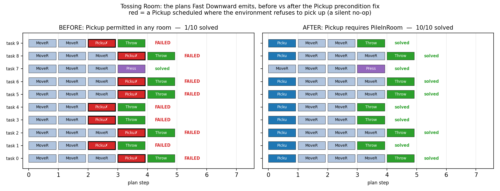

# Tossing Room: three operators permitted what the dynamics deny

> **Environment retired (2026-08-07).** The `--env tossingroom` domain this page was
> measured on has been deleted from the tree. It froze the item `weight` into the task's initial state, which
> `--practice-reset-policy never` then never re-drew -- so a reset-free arm
> practised at a single point of the task distribution. That is a defect, not a
> variant, and `tossingroomsplitpickupweight` (which draws the weight at pickup) is
> the corrected domain. Every number below stands
> exactly as it was published and none has been edited, restated or recomputed;
> what has changed is only that the domain can no longer be instantiated from
> HEAD. **Not re-runnable**, for a reason that predates the retirement and is
> already stated below: the three over-permissive operators it measures were
> fixed in #28 and no longer exist, so the pre-fix column could only be
> recovered by rebuilding them. The claim rests on the structural property,
> not on the numbers.

EES scored **1/10** on Tossing Room. Not because it failed to learn — because Fast
Downward was emitting plans that could not execute. The `Pickup` operator claimed to
work in any room while the environment only picks up in the pile room.



## The defect

```python
PICKUP = Skill(
    parameters=(_robot, _item, _room),
    preconditions={ROBOT_IN_ROOM(robot, room), HAND_EMPTY(robot)},  # any room
)
```
```python
def _apply_pickup(self, *, robot_room, holding, arg, ...):
    if robot_room == self.start_room and holding == 0 and arg in (TRASH, RECYCLING):
        ...   # otherwise: silent no-op
```

The room variable is pinned by the precondition to wherever the robot already is, so
the model believed pickup worked everywhere.

This was **documented, not accidental**. `skills.py` said the lifted models were
"deliberately a touch more permissive than the raw dynamics", justified by "no
predicate marks the pile room, and start_room is per-instance config a module-level
Predicate can't read" and — crucially — "no planner consumes these yet". The oracle
baseline is a hand-coded policy that never plans, so nothing exercised the gap. The
justification expired the moment EES ran here.

## Why the planner actively preferred the broken plan

Pickup-early and pickup-late use the **identical multiset of skills**, so the two
orderings are *exactly cost-tied*. Fast Downward broke the tie arbitrarily, and
routinely chose to walk past the pile and pick up in the bin room:

```
before:  MoveRoom -> MoveRoom -> MoveRoom -> Pickup(bin room) -> Throw
after:   Pickup(pile room) -> MoveRoom -> MoveRoom -> MoveRoom -> Throw
```

The robot *starts* in the pile room, so the correct plan picks up immediately. This is
structurally the same defect as the Ball-Ring `ignore_effects` bug: an over-permissive
symbolic model, cost-tied orderings, and a tie-break deciding whether the plan happens
to be executable.

## Result

Same 10 tasks, same seeds, the only difference being the `PileInRoom` precondition:

| | before | after |
|---|---|---|
| plans containing an unexecutable `Pickup` | **9/10** | **0/10** |
| tasks solved | **1/10** | **10/10** |

The single pre-fix success is task 7 — the `EMPTY` goal, solved by `Press`, the only
goal family needing no pickup at all. Every `RECYCLING`/`TRASH` task failed.

> **Superseded numbers, deliberately not re-run (2026-08-04).** Both columns were
> measured on a test set whose goal-family composition was *sampled per seed*. That
> composition is now fixed (4 TRASH / 4 RECYCLING / 2 EMPTY at the 10 test tasks used
> here, 14/14/2 at 30), so the denominators above no longer describe what the code
> draws, and "task 7" is no longer the `EMPTY` task. The numbers are left in place
> because **the claim does not rest on them**: it rests on the symbolic model
> permitting a `Pickup` the dynamics refuse, which is a structural property of the
> operator, pinned by the property tests this log describes rather than by a success
> rate. Re-running would also require rebuilding the three pre-fix operators in-process
> again, spending compute to re-derive a defect that no longer exists. What *is* worth
> keeping is the shape: near-total failure before, near-total success after.

## The fix

The stated blocker was real: `Predicate.holds` has signature `(state, objects)` and
cannot read `env.start_room`. The fix is to **put the pile in the state**, mirroring
how the button is already modelled:

| step | change |
|---|---|
| 1 | `pile_type = Type(name="pile", feature_names=("room",))` and a `pile` object — the same shape as `button_type`/`button` |
| 2 | `PILE_IN_ROOM` predicate comparing `pile.room` to `room.index` — a direct parallel of `BUTTON_IN_ROOM` |
| 3 | `PICKUP` gains a `_pile` parameter and the `PILE_IN_ROOM(pile, room)` precondition |
| 4 | `PRESS` gains `ignore_effects={ITEM_IN_BIN}` |
| 5 | `THROW` gains `BIN_ACCEPTS_ITEM(item, bin)` |
| 6 | `MOVE_ROOM` uses `CAN_MOVE_ROOM` instead of the symmetric `ADJACENT` |

### The other two divergences

A cross-domain operator-fidelity walk (written independently, against the *pre-fix*
code) found that `Pickup` was one of **three** instances in this domain:

**(b) `Throw` bound `?bin` to any bin in the robot's room**, but `_apply_throw` routes
purely by the **held item's kind** and ignores the bound bin entirely
(`bin_room_for_kind(holding)`). So `Throw(robot, trash, recycling_bin, room_1)` was
applicable and could never succeed at any force. Fixed with a `BinAcceptsItem(item, bin)`
precondition comparing the item's kind to the bin's.

**(c) `MoveRoom`'s only spatial precondition was `Adjacent`, which is symmetric**, but
`_apply_move` refuses the RIGHTWARD step across the one-way ledge. Unlike (a), this
divergence was never acknowledged anywhere. Fixed with `CanMoveRoom(from, to)` —
adjacency minus the blocked direction. The ledge, like the pile, now lives in the state
(a `blocks_right` room feature) precisely so a module-level predicate can read it.

All three are the same defect class, and (b) and (c) would have kept biting even after
(a) was fixed.

Step 4 fixes the second divergence the same docstring admitted: `_apply_press` empties
**both** bins, so every `ItemInBin` becomes false, but `PRESS` declared no delete
effects and takes no item parameter — a universal delete no per-item `delete_effect`
can express. `ignore_effects`, added for Ball-Ring, is exactly the mechanism for it.

## Method note

Written test-first. The property test asserting `Pickup` is not applicable outside the
pile room fails on the pre-fix code and passes after; a complement test asserts it *is*
applicable inside it, so the fix cannot degenerate into "make Pickup never applicable".

The before-trace is generated by reconstructing all three pre-fix operators in-process
(dropping the added preconditions, restoring symmetric `Adjacent`) rather than by
checking out the old code, so both arms run against identical tasks, seeds and
environment.

**Independent confirmation.** The operator-fidelity walk marks Tossing Room
`xfail(strict=True)` with a reason naming all three defects and noting the marker flips
"the moment ALL THREE are fixed, not just the headline Pickup one". Run against this
branch it reports `XPASS(strict)` — it passes, which under a strict xfail fails the
suite to say the marker is stale. That is confirmation from a test written without
sight of this fix.

**A test that passed for the wrong reason.** The first draft of the MoveRoom test used
`is` to compare room objects, but `get_rooms()` rebuilds `Object`s per call with
value-based equality, so the identity check never matched and the test passed
vacuously against the *unfixed* code. Caught by its complement failing when it should
have passed. Worth recording: a green assertion that can never fire is worse than no
assertion.

## A caution about small samples

An initial smoke test — 3 test tasks, 2 practice cycles — reported **3/3 (100%)** and
suggested Tossing Room was fine. The true rate was 10%. With outcomes decided by a
cost-tied tie-break, a 3-task sample is worthless. This is the second time in this
project that a tiny sample produced a confidently wrong reading (the first was a single
Ball-Ring seed scoring 60% where the 10-seed mean was 6%).

## Reproducing

```bash
python -m analysis.practice_makes_perfect.tossingroom_plan_traces \
  --traces docs/experiment-logs/2026-08-02-tossingroom-plan-traces.json \
  --output docs/experiment-logs/2026-08-02-tossingroom-plan-traces.png
```

The traces JSON is committed, so the figure regenerates without re-planning.
