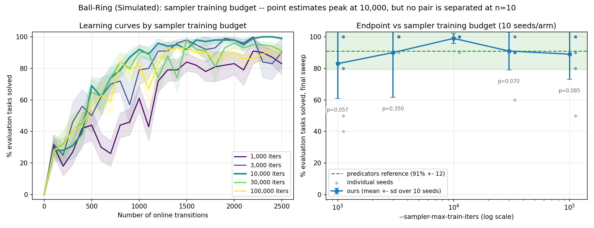

# Sampler training budget on Ball-Ring: retracting "we beat the reference"

Two results, in order of importance.

1. **The "our port beats predicators" result is withdrawn.** It was mostly a
   hyperparameter difference, and it was never statistically established in the first
   place.
2. The sampler-iteration sweep run to investigate it traces a clean inverted U peaking at
   10000, but **that inverted U is not statistically established either**.

The class default `EesMethod.sampler_max_train_iters` still moves from 1000 to 10000 in
this change, for two reasons that need no p-value: 1000 sat below the early-stopping
floor, and 10000 is predicators' own library default. Those are separate claims from
either result above and should not be conflated with them.



## 1. The headline: the gap was a hyperparameter, and was never significant anyway

Our Ball-Ring port scored 98-99% where predicators scores 91%. That gap drove a long
investigation — five mechanistic hypotheses generated and killed looking for the
implementation difference that explained it.

**It was mostly a hyperparameter difference.** predicators ran the paper's launch config
value `sampler_mlp_classifier_max_itr = 100000`; our headline runs used `10000`. Run our
port at the reference's own value and it scores **89.0 ± 16.0 against its 91.0 ± 12.0** —
i.e. the same, and if anything a shade lower. There was no implementation advantage to
find.

**Independently, the gap was never statistically established.** This is the more
important half, and it went unnoticed for a long time. 10 seeds per group, Welch's
two-sample t-test:

| ours | difference | t | df | p | 95% CI on the difference | seeds/group for 80% power |
|---|---|---|---|---|---|---|
| `fix_ignore_effects` 98.0 ± 4.2 | +7.0 | 1.74 | 11.2 | **0.109** | −1.8 to +15.8 | ~27 |
| `iters10k` 99.0 ± 3.2 | +8.0 | 2.04 | 10.2 | **0.068** | −0.7 to +16.7 | ~20 |

Neither reaches significance, so the retraction does not depend on which of the two
98-99% arms you call "ours". Detecting an effect of that size at that variance needs
roughly **20-27 seeds per group**; we ran 10. Turned around: at n=10 per group, with the
observed sds of 4.2 (ours) and 12.0 (predicators), the smallest difference this design
could have detected at 80% power is about **12 points** — larger than the 7-8 point gap
being argued about. The design could not have resolved the claim it was used to make.

> **Correction to the numbers previously circulated for this comparison.** The
> `fix_ignore_effects` row was earlier recorded as *p ≈ 0.081, 95% CI −0.9 to +14.9,
> ~26 seeds*. Those used **normal quantiles**, not Welch's t: 2·(1−Φ(1.744)) = 0.081 and
> 7.0 ± 1.96·4.014 = [−0.87, +14.87]. With the Welch–Satterthwaite df of 11.2 the correct
> values are p = 0.109 and CI [−1.8, +15.8]. The t statistic of 1.74 was right. The
> correction moves the result *further* from significance, so the retraction stands more
> firmly, not less — but at n=10 the difference between t and z quantiles is not
> negligible and the t-test is the right one.

For completeness, the two arms that are not being claimed as a gap: `iters30k` (91.0 ±
12.0) against predicators is t = 0.00, p = 1.000, and `iters100k` (89.0 ± 16.0) is
t = −0.32, p = 0.755. Those are as indistinguishable from the reference as two samples
get.

## 2. The sweep does not establish an optimum either

10 seeds per arm, Ball-Ring, fixed test set, 25 cycles × 100 steps, 10 test tasks,
competence window/recency 2, epsilon 0.5. Arms run **sequentially** on one base (Fast
Downward's timeout is wall-clock, so concurrent arms bias each other). Per-seed per-sweep
data is committed as `2026-08-03-ballring-arms.json`.

Every arm shares the same 10 seeds, so these are **paired** two-sided t-tests. "MDE" is
the smallest difference this design could have detected at 80% power given that pair's
observed sd of differences.

| iters | final mean % | sd | worst seed | paired p vs 10000 | seeds to resolve @80% | MDE at n=10 |
|---|---|---|---|---|---|---|
| 1000 | 83.0 | 22.1 | 40 | 0.057 | ~19 | 23.1 pp |
| 3000 | 90.0 | 28.3 | **10** | 0.350 | ~83 | 28.7 pp |
| **10000** | **99.0** | **3.2** | **90** | — | — | — |
| 30000 | 91.0 | 12.0 | 60 | 0.070 | ~21 | 12.2 pp |
| 100000 | 89.0 | 16.0 | 50 | 0.085 | ~23 | 16.2 pp |

Not one comparison reaches p < 0.05; the Bonferroni threshold for four would be 0.0125.
Every arm's endpoint also lies inside predicators' own ±1sd band (91.0 ± 12.0). The
correct summary is **"the point estimates order this way and nothing is resolved"**, not
"10000 is the optimum". In particular **3000 and 10000 are indistinguishable** (p = 0.350,
and separating them would take ~83 seeds) — they should not be ranked against each other.

**Read the worst-seed column, not just the sd.** The 3000 arm's sd of 28.3 does not mean
it is broadly unreliable: 9 of its 10 seeds finish at 90-100% and a single seed collapses
to 10%. That is bimodality, not spread, and mean ± sd hides it — which is why the figure
scatters individual seeds and why `test_three_thousand_arm_is_bimodal_not_broadly_spread`
pins it. Only the 10000 arm has no seed below 90%.

**`iters10k` and `fix_envfix` are the same run**, identical per seed — both are current
`main` at the new default. The aggregate lists both, but 99.0 appears there once, not
twice.

> **STALENESS NOTE (2026-08-06): the `iters10k` arm's 99.0 does not reproduce at current
> `main`, and the arm above should be read as pinned to the code of 2026-08-03.** A re-run
> at the same protocol and the same fixed seeds 0–9 (PR #126) scored **91/100** against
> this arm's **99/100**. The original numbers above are correct as published and are left
> untouched; what follows is why they are now provisional.
>
> - **The two arms are not the same computation — this part is certain.** A `--seed` fully
>   determines a run, so identical code at the same seed must give an identical curve.
>   Per-seed, per-checkpoint comparison against `2026-08-03-ballring-arms.json` shows they
>   diverge at the **first** post-practice checkpoint (100 transitions) in 7/10 seeds and
>   by the second (200 transitions) in the remaining 3/10. Something in the code or config
>   differs, from the start of training.
> - **That the difference is a *regression* is NOT established.** The endpoint comparison's
>   p = 0.0625 sits exactly at its own floor (5/10 pairs tied), so it describes the design
>   rather than the world. Summing solved tasks over all 26 checkpoints gives an untied,
>   better-powered paired statistic — floor 2 × 2⁻¹⁰ = 0.00195, so it genuinely could have
>   resolved a consistent shift. It does not: the re-run is lower in **6/10** seeds,
>   1947/2600 against 2037/2600 overall, exact paired permutation **p = 0.109**. The
>   honest reading is "the two arms differ as computations; the evidence that one is
>   *worse* is weak."
> - **This arm predates `config_snapshot.json`** (added 2026-08-05), and its raw run
>   directories did not survive a move between machines, so its provenance is documentary
>   only. From `git log`, the tree it ran at is equivalent to **`9f62b58`** for every path
>   Ball-Ring reads. That is inferred, **not verified**.
> - **Leading candidate, not established: PR #85 (`3eb32c5`)**, "Fall back to a uniform
>   draw when the sampler cannot discriminate". It is *after* `9f62b58` and *before* the
>   re-run's tree, and it changes both the number of `Generator` draws inside
>   `LearnedSkillSampler.sample` and the returned candidate's distribution. No Ball-Ring
>   config default changed in between (verified by `git log -S` over
>   `environments/ballring/`); PR #112/`OMP_NUM_THREADS` is excluded, as is PR #119.
> - **Not yet run, and it is what would settle this:** re-run this exact sweep at
>   `9f62b58` and at `3eb32c5^`/`3eb32c5`. See
>   `2026-08-06-ballring-placeballontable.md` for the full argument and the exact commands.

### Reproducing the statistics

scipy is not a project dependency, so the p-values are quoted as constants in
`ballring_sampler_iters.py` rather than recomputed by it. They were produced with:

```bash
pip install scipy  # not a project dependency; ad-hoc for this check only
python - <<'PY'
import json
import statistics

from scipy import stats

d = json.load(open("docs/experiment-logs/2026-08-03-ballring-arms.json"))


def endpoints(arm):
    out = {}
    for seed, rows in d[arm].items():
        last = max(rows, key=lambda row: row[0])
        out[seed] = 100 * last[1] / last[2]
    return out


E = {a: endpoints(a) for a in ("iters1k", "iters3k", "iters10k", "iters30k", "iters100k")}
seeds = sorted(E["iters10k"], key=int)
for arm in E:
    if arm == "iters10k":
        continue
    x = [E["iters10k"][s] for s in seeds]
    y = [E[arm][s] for s in seeds]
    diffs = [u - v for u, v in zip(x, y)]
    dz = statistics.mean(diffs) / statistics.stdev(diffs)
    n = next(
        n
        for n in range(3, 500)
        if stats.nct.sf(stats.t.ppf(0.975, n - 1), n - 1, abs(dz) * n**0.5)
        + stats.nct.cdf(-stats.t.ppf(0.975, n - 1), n - 1, abs(dz) * n**0.5)
        >= 0.8
    )
    print(arm, round(stats.ttest_rel(x, y).pvalue, 3), "n80 =", n)
PY
```

The "seeds to resolve" column uses the exact noncentral-t power function. An earlier
version of this table used the normal approximation and reported ~18/82/20/22; the
noncentral-t values are ~19/83/21/23. The difference is immaterial to the conclusion but
the two methods should not be mixed.

## Why the default moves anyway

Neither result above justifies the default change. Two things that do, and neither is a
score comparison:

1. **1000 was below the early-stopping floor.** `MlpBinaryClassifier` early-stops after
   `n_iter_no_change = 5000` iterations without improvement (predicators'
   `mlp_classifier_n_iter_no_change`, `settings.py` L555). At a default of 1000 that
   branch could **never fire** — not "rarely", never. Every refit ran exactly 1000
   full-batch steps regardless of whether the loss had stopped moving, and a mechanism
   ported from predicators was dead code in the default configuration.
2. **10000 is predicators' own default.** `settings.py` L572 sets
   `sampler_mlp_classifier_max_itr = 10000`. Only the paper's launch configs override it
   to 100000 (`scripts/configs/active_sampler_learning.yaml` L112). This codebase had been
   contrasting its default against 100000 as though that were *the* reference value; the
   library default a caller gets without a config is 10000, so matching the reference
   argues for exactly the value chosen.

`n_iter_no_change` itself stays at 5000, matching `settings.py` L555 — it is the floor
that made 1000 indefensible, not a number to tune. The two `max_train_iters: int = 1000`
defaults inside `wrapped_sampler.py` also stay: `EesMethod._refit_samplers` always passes
`max_train_iters` explicitly, so those defaults are reached only by unit tests, which want
a fixed cheap step count rather than early stopping.

One real consequence for reviewers: at 10000 early stopping *can* fire, so refit cost is
now **data-dependent** rather than a fixed 1000 steps. Wall-clock per cycle will vary
across seeds in a way it previously did not.

## What is separately solid

**More training genuinely overfits the decisive cup-placement classifier.** Train BCE
falls from 5.9e-3 at 10000 to 2.8e-5 at 100000 — it interpolates the training set — while
held-out argmax success falls from 0.988 to 0.930 (paired, t = 5.67, 10/10 seeds). That is
a direct measurement on the classifier from an independent probe, not an inference from
endpoint scores, and it is a real mechanism for why the endpoint curve bends down at the
high end rather than plateauing.

It does *not* rescue the endpoint sweep. A mechanism that predicts an effect is not
evidence that this 10-seed sweep detected one.

## What would settle it

~19-23 seeds per arm resolves 10000 against 1000, 30000, or 100000; 3000 would need ~83
and is probably not worth chasing. Resolving our port against predicators needs ~20-27 per
group. Both are roughly a doubling of what was run. Given that the residual after the
hyperparameter correction is ~2 points and inside noise, this is recorded as an option
rather than a recommendation — there is no longer a gap that needs explaining.

## Reproducing the runs

```bash
# one arm at a time -- check `pgrep -f hitl_pmp.cli` is empty first
python -m scripts.run_sweep --env ballring --methods ees --num-seeds 10 \
  --results-root results/iters-10k \
  --shared-args "--num-test-tasks 10" \
  --method-args "ees=--num-cycles 25 --max-steps-per-interaction 100 \
    --competence-window-size 2 --competence-recency-size 2 \
    --exploration-epsilon 0.5 --sampler-max-train-iters 10000"

python -m analysis.practice_makes_perfect.ballring_sampler_iters \
  --arms-json docs/experiment-logs/2026-08-03-ballring-arms.json \
  --output docs/experiment-logs/2026-08-03-ballring-iters.png
```

The analysis script reads the committed aggregate rather than a sweep directory: the raw
sweep directories for these arms lived outside the repo and did not survive the move
between machines, so the aggregate is the only remaining record.
