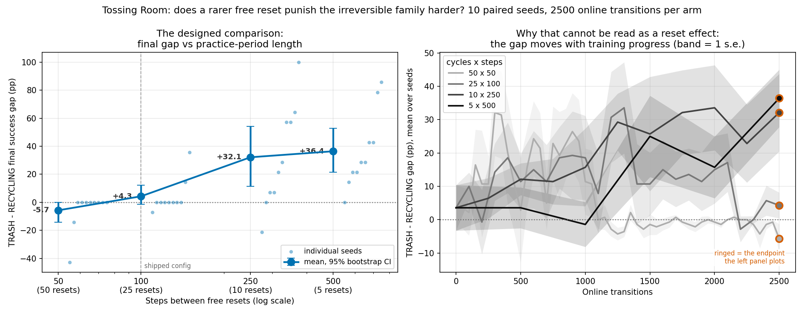
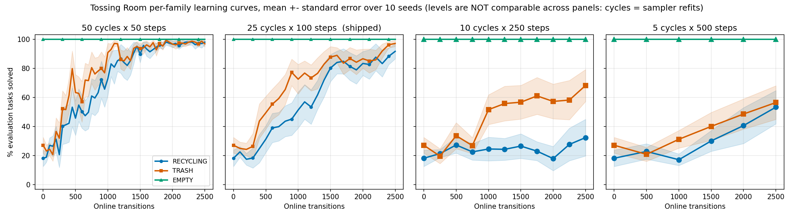

# Trading cycles against steps cannot isolate reset frequency (Tossing Room)

> **Environment retired (2026-08-07).** The `--env tossingroom` domain this page was
> measured on has been deleted from the tree. It froze the item `weight` into the task's initial state, which
> `--practice-reset-policy never` then never re-drew -- so a reset-free arm
> practised at a single point of the task distribution. That is a defect, not a
> variant, and `tossingroomsplitpickupweight` (which draws the weight at pickup) is
> the corrected domain. Every number below stands
> exactly as it was published and none has been edited, restated or recomputed;
> what has changed is only that the domain can no longer be instantiated from
> HEAD. **Re-runnable as a new measurement, not as a reproduction.** The design
> ports, and its methodological conclusion (cycles confound resets with
> sampler refits) is domain-general, but the competence gap it reports is
> this domain's and would move.

> ## Re-run 2026-08-04 on the fixed 14/14/2 evaluation set
>
> Every number originally in this file was measured on the **sampled** test-set
> composition (`goal_weights = (0.4, 0.4, 0.2)`, drawn per seed — seed 0 got 16 TRASH /
> 10 RECYCLING / 4 EMPTY, seed 1 got 11/12/7). PR #41 replaced that with a **fixed 14
> TRASH / 14 RECYCLING / 2 EMPTY** on every seed, so the code no longer produces the
> distribution those numbers were measured against. All four arms were therefore re-run
> — 40 fresh runs, same fixed seeds 0..9, same flags — and the tables below are the new
> numbers. **Previous values are recorded inline** in a *previously* column wherever one
> moved. The superseded aggregate is kept as
> [`2026-08-03-tossingroom-reset-freq.json`](2026-08-03-tossingroom-reset-freq.json);
> the live one is
> [`2026-08-04-tossingroom-reset-freq.json`](2026-08-04-tossingroom-reset-freq.json).
> Precedent and method: PR #52, which did the same for the release arms.
>
> ### ⚠ The "no trend" finding is withdrawn
>
> This log's Result 3 previously read: *the gap is **non-monotone** in practice-period
> length, and the arm with the fewest free resets sits near zero* — `armD − armA` of
> **+4.33pp at p = 0.6875**, a per-seed slope at p = 0.1055, and **no arm** establishing
> that RECYCLING trails TRASH at all.
>
> **On the fixed evaluation set every one of those flips.** The gap is **monotone** in
> period length (−5.7 → +4.3 → +32.1 → +36.4 pp), `armD − armA` is **+42.14pp at
> Wilcoxon p = 0.0039**, the per-seed slope is **+13.83 pp per doubling at p = 0.0020**,
> and **two of four arms** now establish the within-arm gap (C p = 0.0195, D p = 0.0039).
> The single sentence most often quoted from this log — *"if the hypothesis were driving
> this, arm D should show the most collapse; it shows less"* — is now **false**: arm D
> shows by far the most collapse (RECYCLING 24/140 against arm C's 64/140).
>
> ### The headline survives, and the confound got bigger
>
> None of that means the hypothesis is supported, and the title of this file is
> unchanged. `--num-cycles` still sets resets and sampler refits with one number, and
> the cost of that entanglement went **up**: the extreme arms now differ by **−82.9pp on
> RECYCLING** (p = 0.0020) and −40.7pp on TRASH, against −44.7 / −40.4 before. The
> decisive test is the un-confounded one, and it is now run rather than eyeballed: hold
> training progress fixed and the same `armD − armA` contrast is **−5.00pp, p = 0.6875,
> not established** ([Result 5](#result-5-holding-progress-fixed-the-gap-is-flat)). So
> the trend that appeared is what the hump predicts from a 40-to-83-point competence
> difference, and this design still cannot tell that apart from a reset effect.
>
> **What changed is the evidence, not the verdict.** The old log reached "unanswerable"
> partly *because* nothing trended; that argument is gone, and the verdict now rests
> entirely on the confound and the progress-matched test. That is a weaker-looking but
> more honest position, and it is worth stating plainly: **this experiment now looks
> much more like its own hypothesis than it did, and it still cannot support it.**
>
> ### Every rate here is a count
>
> Success rates are reported as `x/y` evaluation episodes solved, read from
> `Metrics.breakdowns`, never reconstructed by multiplying a percentage by n. Each arm
> is 14 tasks × 10 seeds = **140 episodes per throw family** and 2 × 10 = **20 for
> EMPTY**. *Differences* of rates — gaps, paired differences, sds, slopes, the noise
> floor — are not counts of anything and stay in percentage points.

This experiment set out to ask whether a longer practice period (fewer free resets)
makes the irreversible `RECYCLING` family fall further behind the recoverable
`TRASH` family. **It could not answer that question** — the design varies reset
frequency and sampler-refit count with the same flag — but it established four
other things, three of which nobody was looking for.

**What it established:**

1. **[Concurrency does not perturb results on this machine.](#concurrency-does-not-perturb-results-here)**
   13,105 live Fast Downward process observations at a max lifetime of **0s**
   against a 10s wall-clock budget, at loads 9–27 on 24 cores; and `stats.json`
   **byte-identical** between a low-load probe and a 20-way concurrent sweep, on
   both extreme arms. **This retires the standing sequential-arms rule** in the
   Ball-Ring logs.
2. **[At fixed experience, `--num-cycles` sets competence — the transition count does
   not.](#result-1-at-fixed-experience---num-cycles-sets-competence-not-the-transition-count)**
   Arms A and D consumed identical 2500 online transitions (sd 0) and ended tens of
   points apart: armD − armA is **RECYCLING −82.9pp (p = 0.0020), TRASH −40.7pp
   (p = 0.0195)** (paired exact).
3. **[That gap *is* the confound, measured](#result-2-the-design-confounds-resets-with-refits--do-not-re-tread).**
   `--num-cycles` sets the number of free resets *and* the number of `end_cycle()`
   sampler refits with one number, so no sample size could have separated them —
   and the cost of that entanglement is 40–83 points, far larger than any gap
   difference the experiment set out to detect. Filed below as a **do-not-re-tread**
   record.
4. **`EMPTY` remains a flat control** — 20/20 in every arm, sd exactly 0, difference
   exactly 0 — so all movement is confined to the two families that use the
   stochastic `Throw`. It is now a **much weaker** control than it was: PR #41 cut it
   to 2 test tasks per seed, so "100%" means **2/2 per seed** rather than the ~6/6 it
   meant here originally. See [the caveat](#empty-is-still-flat-but-it-is-now-a-2-2-control).

**What must not be claimed.** This experiment says nothing about whether reset
frequency affects the price of an irreversible action. The measured
(TRASH − RECYCLING) gap **does** now trend with practice-period length, monotonically
and significantly — but a design in which the arms differ by 40–83 competence points
cannot tell a real trend apart from a training difference, and the progress-matched
version of the same contrast is a null result (−5.0pp, p = 0.6875). **A significant
trend in a confounded design is not evidence for the hypothesis it happens to
match.** The corrected design is
[below](#result-2-the-design-confounds-resets-with-refits--do-not-re-tread).



## Concurrency does not perturb results here

The Ball-Ring logs run arms **sequentially**, on the stated reasoning that "Fast
Downward's timeout is wall-clock, so concurrent arms bias each other"
(`2026-08-03-ballring-iters.md`, `2026-07-24-ballring-ees.md`). That caution was
reasonable and it is measurable. Measured, it is **unnecessary**, and it has been
costing serial wall-clock on every sweep since it was written.

**Direct evidence — byte-identity.** Seed 0 of both extreme arms was run twice:
once at low load (2 concurrent runs) and once inside the full 20-way concurrent
sweep. `evaluations`, `breakdowns`, and the whole `stats.json` are **identical** in
both arms. This is the strong form of the check: a spurious FD timeout necessarily
changes the plan and therefore the trajectory, so identity across a 10x difference
in machine load proves no timeout perturbation occurred.

**Direct evidence — planner headroom.** 600 samples at 1 Hz over 10 minutes of the
full sweep, **13,105 live Fast Downward process observations**: max process
lifetime **0s** against the 10s budget, and **zero** observations at or above 5s.

| sample | concurrent runs | load avg (24 cores) | max FD lifetime |
|---|---|---|---|
| 09:41 | 22 | 14.0 | 0s |
| 09:46 | 25 | 26.9 | 0s |
| 09:51-10:01 | 13-23 | 9.1-27 | 0s (13,105 observations) |

**There is no planning-failure rate in the logs to report.** `PlanningFailure` is
caught silently at three sites in `ees_method.py` (`refresh_planning_progress_plans`,
the goal-phase plan, and `_practice_plan`) and nothing is printed, so a per-run
failure count cannot be recovered from `log.txt`. Byte-identity is the instrument
that replaces it, and it is a stronger one.

> **A measurement bug worth recording**, because it nearly became a reported number.
> The first FD sampler reported a max process lifetime of **4,123,168,608 seconds**.
> Under load `ps` occasionally emits a partial row whose first field is not an
> elapsed time, and `sort -rn | head -1` takes the max over *all* rows, so a single
> malformed line poisons the maximum for an entire sampling run. Inspecting raw `ps`
> output showed every live FD process at 0s. The rewritten sampler rejects
> non-numeric and implausible (>86400s) values and separately counts observations at
> or past half the budget.

Concurrency was therefore used deliberately: four `run_sweep` processes at once,
weighted toward the long pole (arm A `--max-workers 9`, B 5, C 3, D 3), ~20
concurrent against 24 cores. All 40 runs succeeded; no arm had a failure. The scope
of this claim is *this machine* — 24 cores, this FD build, this domain's planning
problems. It is a measurement, repeatable by the same instruments, not a general
theorem about wall-clock timeouts.

**The 2026-08-04 re-run used the same recipe and adds an independent check on it**:
four concurrent sweeps at 9/5/3/3 workers, ~20 concurrent runs, loads 9–31, all 40
runs exiting 0 with no spawn retries — and arm B reproduced PR #52's separately-run
release arm **seed for seed** (see [What was verified](#what-was-verified)). Two
sweeps run days apart at different concurrency landing on identical per-seed integers
is the same instrument as byte-identity, applied across runs rather than within one.

## The question

`PracticeLoop.run` calls `problem.reset_to_task(task=task)` at the top of every
practice cycle:

```python
for cycle in range(num_cycles):
    task = problem.sample_train_task()
    policy = method.get_practice_policy(task=task)
    state = problem.reset_to_task(task=task)
    for _ in range(max_steps_per_interaction):
        ...
```

So the harness hands the robot a **free environment reset every
`--max-steps-per-interaction` steps**. That is faithful to predicators
(`main.py:301-302` resets per interaction request) and correct for a
reproduction. But it also caps what an irreversible action can cost: the worst
outcome is "you wasted the rest of this practice period", never "you wasted the
rest of the run".

Tossing Room has **two** genuinely terminal failure families, both caused by the same
one-way ledge:

| family | `Throw`? | what goes terminal |
|---|---|---|
| `EMPTY` | no — `MoveRoom`xk + `Press`x2 | **terminal** — an *ordering* trap, not a sampler miss: the recycling button sits behind the ledge, so pressing it before the trash one puts the trash button permanently out of reach |
| `TRASH` | yes | nothing terminal — a missed throw costs a round trip to the pile for a fresh item; expensive, recoverable |
| `RECYCLING` | yes | **terminal** — pile in room 3, recycling bin in room 1, `blocked_right_from = 2` makes room 3 unreachable once the item is gone, so Fast Downward correctly reports no plan |

> **Correction.** This page originally claimed a *single* terminal failure family, and
> called `EMPTY` the deterministic control whose miss "costs nothing".
> That was wrong: `EMPTY`'s press ordering is terminal for the same reason
> `RECYCLING`'s throw is, and `environments/tossingroom/environment.py`'s own module
> docstring said so all along ("the reverse order is unsolvable"). The measured
> signature is `PressRecycling` at **3,576/24,750** practice actions (14.4%) in the
> **standard-budget** split-throw run — 25 cycles × 100 steps × 10 seeds, so 24,750
> practice actions in all — a stranded robot pressing an already-empty button, 22x that
> run's recycling-throw count
> ([`2026-08-05-tossingroomsplit-throw-rates.md`](./2026-08-05-tossingroomsplit-throw-rates.md)).
> PR #103's 10x-budget run has a ~10x larger denominator, so its tallies are not
> comparable to this one and neither contradicts the other.
>
> **Nothing else on this page changes.** The experiment is a within-arm
> (TRASH − RECYCLING) contrast, and `EMPTY` scored **1020/1020**, **520/520**,
> **220/220** and **120/120** across arms A–D — not one miss anywhere in the committed
> aggregate — so the ordering trap never fired at evaluation and every number below
> stands.

At the shipped config (25 cycles x 100 steps, 10 seeds, 30 test tasks) RECYCLING
trails TRASH at every checkpoint but does not stall. Pooled over 10 seeds, so each
throw-family cell is out of 140 evaluation episodes and each `EMPTY` cell is out of
20:

| family | 0 | 300 | 600 | 900 | 1200 | 1500 | 1800 | 2100 | 2500 |
|---|---|---|---|---|---|---|---|---|---|
| `EMPTY` | 20/20 | 20/20 | 20/20 | 20/20 | 20/20 | 20/20 | 20/20 | 20/20 | 20/20 |
| `TRASH` | 31/140 | 43/140 | 70/140 | 65/140 | 117/140 | 134/140 | 139/140 | 136/140 | 139/140 |
| `RECYCLING` | 26/140 | 23/140 | 49/140 | 38/140 | 74/140 | 119/140 | 120/140 | 112/140 | 133/140 |

*Previously, on the sampled test set and as percentages only* — `EMPTY`
`100/100/100/100/100/100/100/100/100`, `TRASH` `28/28/54/78/76/86/86/86/98`,
`RECYCLING` `18/19/39/44/55/81/81/83/92`.

**Hypothesis.** The penalty for irreversibility is bounded by the reset
frequency. Longer practice periods (fewer free resets) mean a stranded robot
wastes more experience, so RECYCLING should fall further behind TRASH. Shorter
periods should shrink the gap.

## Design

Total online transitions are held at 2500 and cycles are traded against steps:

| arm | `--num-cycles` | `--max-steps-per-interaction` | free resets |
|---|---|---|---|
| A | 50 | 50 | 50 |
| B | 25 | 100 | 25 (shipped) |
| C | 10 | 250 | 10 |
| D | 5 | 500 | 5 |

10 seeds each (0..9, fixed by `run_sweep`), `--num-test-tasks 30`,
`--sampler-max-train-iters 10000`, `--env tossingroom --method ees`.

**Primary metric: the within-arm (TRASH - RECYCLING) final success gap, paired by
seed.** Not the absolute rates. `--num-cycles` also sets how many times the
sampler refits (`method.end_cycle()` runs once per cycle) and how many evaluation
sweeps run, so arm D gets 5 refits where arm A gets 50 and **absolute success
rates are not comparable across arms**. Both families inside one arm see the same
refits, so the within-arm gap cancels that confound's effect on the *level*.

**That is only half of what the metric needs, and the missing half is the whole
experiment.** The gap cancels the level, but the gap is *itself* a function of
training progress, and a hump-shaped one: near zero while both families sit at the
floor, largest mid-training when TRASH pulls ahead, near zero again once both
saturate. The shipped-config arm traces exactly that hump — **+3.6pp at transition
0, peaking at +33.6pp at 1300, back to +4.3pp at 2500**. Since `--num-cycles` sets
progress, the arms can sit at different points on that hump and their final gaps can
differ for that reason alone, with no contribution from irreversibility whatsoever.

So a cross-arm difference in the gap is attributable to reset frequency **only if
the arms end at comparable competence**. That is a measurable precondition, not an
assumption, and it is checked before any p-value is read:

- **final TRASH level, paired across arms** -- are the arms equally trained?
- **final EMPTY level, paired across arms** -- the control. No `Throw`, no
  stochastic skill, deterministic `MoveRoom`xk + `Press` plan. If EMPTY moves,
  something other than irreversibility is driving the result.

## Manipulation check

Both halves of the design are assertions about the runs, and neither is taken on
trust — this log's own finding is that a design failed to isolate what it claimed,
and assuming the evaluation composition would be the same mistake one level down.
That assumption is exactly what went stale here.

| what | expected | realised |
|---|---|---|
| test-set composition | 14 TRASH / 14 RECYCLING / 2 EMPTY | **exact, in every arm × seed × evaluation sweep** (`test_the_evaluation_set_really_was_the_fixed_14_14_2_composition`) |
| online transitions | 2500 | **exactly 2500, sd 0, every arm × seed** (`test_every_arm_actually_spent_the_2500_transition_budget`) |
| untrained (sweep-0) rates | identical across arms | **identical**: TRASH 31/140, RECYCLING 26/140, EMPTY 20/20 in all four arms |
| runs completing | 40 | 40, all exit 0, no spawn retries |

The expected composition is read from `TossingRoomTasks.test_goal_type_counts()`
rather than restated in the analysis, so it cannot drift away from the code again.
The sweep-0 row is the tightest available check that every arm evaluated the same
policy on the same test set before any training separated them.

## Result 1: at fixed experience, `--num-cycles` sets competence, not the transition count

Paired across the same 10 seeds, exact tests, arm D (500 steps) minus arm A (50):

| family | mean difference | sd | Wilcoxon p | sign-flip p | n for 80% power | *previously* |
|---|---|---|---|---|---|---|
| `TRASH` | **-40.7pp** | 37.0 | **0.0195** | **0.0156** | 6 | *-40.4pp, p = 0.0156* |
| `RECYCLING` | **-82.9pp** | 14.8 | **0.0020** | **0.0020** | <1 | *-44.7pp, p = 0.0156* |
| `EMPTY` | **+0.0pp** | 0.0 | 1.0000 | 1.0000 | infinite (zero effect) | *+0.0pp, p = 1.0000* |

Every arm reached **exactly 2500 online transitions, sd 0** — the experience budget
is identical by construction, not approximately equal. Yet both throw families move
sharply between the extreme arms, and both are significant. **Transition count
alone does not determine how much this method learns in this harness**; how the same
transitions are divided into cycles does. That was not what the experiment was
looking for, and it is the most portable thing in it.

The re-run makes this *stronger*, not weaker: RECYCLING's separation nearly doubled
(-44.7pp → **-82.9pp**) and its sd fell by more than half (35.9 → 14.8), because the
fixed composition gives every seed the same 14 RECYCLING tasks instead of somewhere
between 10 and 14. Arm D ends at **24/140** RECYCLING against arm A's **140/140**.

It is also the precondition failing, harder than before: the arms are nowhere near
equally trained, so they do not sit at comparable points on the hump, and the
designed cross-arm comparison is confounded at a magnitude far larger than any gap
difference it reports.

### `EMPTY` is still flat, but it is now a 2/2 control

`EMPTY` is 100% in every seed of every arm, sd exactly 0, difference exactly 0 —
same as before. So whatever moves across arms is confined to the two families that
use the stochastic `Throw`; this is not some generic harness artifact.

**Its evidential weight is much lower than it was, and the number looks identical
either way, which is the trap.** PR #41 cut `EMPTY` from ~20% of the test set to
2 of 30 tasks, so per seed "100%" is now **2/2** rather than roughly 6/6, and the
pooled figure is **20/20 per arm** rather than 60/60. A control that would fail to
notice a real 20% regression in 45% of seeds is a weak control. It is kept because
`EMPTY` is deterministic — `MoveRoom`×k + `Press`, no `Throw`, no sampler — so what
is really being checked is "did the plan/execute path break", which a small n
detects adequately, not "did competence move", which it would not. It also cannot
do more than that in principle: `EMPTY` is solved by an untrained policy, so it sits
on the ceiling from sweep 0 and has no room to show movement in either direction.

**What this does *not* license saying.** It is tempting to sharpen Result 1 to
"learning is driven by sampler refits, not by transitions" — same 2500 transitions,
tens of points apart, and refits are the obvious channel. But `--num-cycles` moves
refits and resets *together* in this design, so the difference is attributable to
either, and this experiment cannot separate them. The honest statement is the
heading's: **holding transitions fixed at 2500, final competence depends strongly on
`--num-cycles`, and this design cannot say which of its two effects is responsible.**
Separating them needs an arm that varies refit count at fixed reset frequency, which
is not one of the four run here.

## Result 2: the design confounds resets with refits — do not re-tread

This is a structural failure, not a statistical one: `--num-cycles` sets both
quantities with one number, so **no sample size could have separated them**. Filed
in the form of the handoff's refuted-hypotheses table so the same experiment is not
rebuilt later:

| design | what it was meant to isolate | why it cannot work | corrected design |
|---|---|---|---|
| Hold total transitions at 2500, trade `--num-cycles` against `--max-steps-per-interaction` (50x50, 25x100, 10x250, 5x500) | how often the harness hands out a free reset | `--num-cycles` is simultaneously the reset count **and** the `end_cycle()` refit count. One flag, two treatments, perfectly collinear across arms — measured cost: **40.7pp TRASH / 82.9pp RECYCLING** between the extreme arms at identical experience (p = 0.0195 / 0.0020). The within-arm gap cancels the *level* but not the hump-shaped dependence of the gap on progress, and the fixed-composition data shows what that costs: the final gap trends at p = 0.0039 while the progress-matched gap does not move at all. | Vary a **within-period reset interval** while holding `--num-cycles` (and so refits, and so evaluation sweeps) **fixed**: reset to the current practice task's initial state every k steps *inside* a period, without ending the cycle. `practice_reset_interval` on `josh/experiment/reset-interval` does exactly this; `None` reproduces today's behaviour. |

**The re-run raises the priority of building that corrected design rather than
lowering it.** On the sampled test set this experiment produced nothing that looked
like the hypothesis, so there was little to chase. On the fixed test set it produces
a clean monotone trend at p = 0.002 that is *consistent with* the hypothesis and
*equally consistent with* the confound — which is precisely the situation an
un-confounded arm is needed to resolve.

Two things the corrected design needs to be honest rather than merely implemented,
both already handled on that branch and both worth knowing before anyone rebuilds
it:

- A `Method` must be told the state the environment is about to leave
  (`observe_environment_reset`). EES scores a skill against its `add_effects` on the
  *next* state it sees, so without the hook every skill executed just before a reset
  is judged against a freshly reset environment — where `InBin`-style effects
  essentially never hold — and recorded as a failure into both its competence model
  and its sampler's training data. That mislabelling **scales with reset frequency**,
  which is exactly the quantity being varied.
- The manipulation must be verifiable from the run's own output
  (`Metrics.num_practice_resets`) rather than from an argument about the loop's
  arithmetic.

## Result 3: the measured gap across arms — now monotone, and significant

| arm | period | resets | final TRASH | final RECYCLING | final EMPTY | **gap (T-R)** | *previous gap* |
|---|---|---|---|---|---|---|---|
| A | 50 | 50 | **132/140** (94.3 ± 13.8) | **140/140** (100.0 ± 0.0) | 20/20 | **-5.7 ± 13.8** | *-1.2 ± 6.3* |
| B | 100 | 25 | **139/140** (99.3 ± 2.3) | **133/140** (95.0 ± 11.7) | 20/20 | **+4.3 ± 12.2** | *+5.4 ± 19.0* |
| C | 250 | 10 | **109/140** (77.9 ± 22.7) | **64/140** (45.7 ± 40.0) | 20/20 | **+32.1 ± 36.8** | *+35.8 ± 49.3* |
| D | 500 | 5 | **75/140** (53.6 ± 27.4) | **24/140** (17.1 ± 14.8) | 20/20 | **+36.4 ± 27.2** | *+3.2 ± 23.8* |

Each `±` is the spread of the ten per-seed rates in points, not a binomial spread on
the pooled count, and must not be read as one.

**The gap is monotone in practice-period length** — −5.7, +4.3, +32.1, +36.4 — where
it was previously non-monotone with arm D collapsing back to +3.2. Three tests of
the trend, all paired on the same 10 seeds, all exact:

| test | mean | sd | Wilcoxon p | sign-flip p | n for 80% power | *previously* |
|---|---|---|---|---|---|---|
| gap, armD (500) - armA (50) | **+42.14pp** | 36.80 | **0.0039** | **0.0039** | 6 | *+4.33pp, p = 0.6875* |
| per-seed slope, pp per doubling of period | **+13.83** | 12.06 | **0.0020** | **0.0020** | 6 | *+4.27, p = 0.1055* |
| per-seed Spearman rho of gap vs period | **+0.69** | 0.30 | **0.0020** | **0.0020** | 1 | *+0.05, p = 0.5469* |

The intermediate contrasts order the same way: armC − armA is +37.86pp (p = 0.0195),
armB − armA is +10.00pp (p = 0.1250, not established).

**All three previously said "no trend". All three now say "trend", at p ≤ 0.004.**
That is the single largest change in this file and it is a retraction, not a
refinement: the earlier conclusion was wrong about this data set, and the reason is
that it was measured against a test set the code no longer produces.

**This is still not evidence for the hypothesis, and the reason is Result 1.** Read
the final-TRASH column next to the gap column: the gap is largest exactly where the
arms are least trained. Arm A is saturated (132/140 TRASH, 140/140 RECYCLING — both
families at the ceiling, so the gap is *forced* toward zero), arm B nearly so, arm C
is mid-curve, and arm D has barely trained at all. The hump predicts exactly this
ordering from the competence differences alone, with no reset effect required — and
`--num-cycles` sets both. [Result 5](#result-5-holding-progress-fixed-the-gap-is-flat)
is the test that separates them, and it comes back null.

The trend is tested at n = 10 across *seeds* rather than n = 4 across arm means
because Spearman on four arm means bottoms out at p = 0.083 even for perfect
monotonicity, so it could never reach significance. Both per-seed forms are
reported; the slope is the one to read.

## Result 4: two of four arms now establish the gap

Within-arm (TRASH - RECYCLING) against zero:

| arm | mean gap | Wilcoxon p | sign-flip p | exact-zero seeds | n for 80% power | *previously* |
|---|---|---|---|---|---|---|
| A | -5.7pp | 0.5000 | 0.5000 | 8/10 | 46 | *-1.2pp, p = 1.0000* |
| B | +4.3pp | 0.5000 | 0.5000 | 7/10 | 64 | *+5.4pp, p = 0.6250* |
| C | **+32.1pp** | **0.0195** | **0.0234** | 1/10 | — | *+35.8pp, p = 0.0547* |
| D | **+36.4pp** | **0.0039** | **0.0039** | 1/10 | — | *+3.2pp, p = 0.8438* |

Previously **not one arm** reached p < 0.05 and this section was titled "no arm
establishes the gap at all". Two now do. **The premise — that the irreversible family
trails the recoverable one — is established in arms C and D**, and it remains *not
established* in A and B, where 8/10 and 7/10 seeds tie at exactly zero because both
families are at the ceiling. Those two arms would need 46 and 64 seeds for 80% power
at the effect sizes observed, which is the wrong instrument: a ceiling is not fixed
by more seeds.

Arm A's mean gap is **negative** (−5.7pp): RECYCLING is 140/140 while TRASH is
132/140, driven by two seeds (0 and 9) where TRASH ends at 12/14 and 8/14. That is
not a reversal worth interpreting — p = 0.50 — but it is worth noticing that at 50
refits the *recoverable* family is the one that ends imperfect.

## Result 5: holding progress fixed, the gap is flat

The un-confounded companion, and now the load-bearing result of the whole log. Read
each seed's gap at the first checkpoint where its *own* TRASH rate reaches a level
every seed of every arm attains (**35.7%**, i.e. 5/14 — previously 43.8% on the
sampled set), rather than at a common transition count:

| arm | seeds matched | mean progress-matched gap | sd | *previously* |
|---|---|---|---|---|
| A | 10/10 | +40.0pp | 27.2 | *+30.4pp* |
| B | 10/10 | +17.9pp | 22.4 | *+38.2pp* |
| C | 10/10 | +35.0pp | 17.6 | *+34.4pp* |
| D | 10/10 | +35.0pp | 30.2 | *+22.0pp* |

All ten seeds match in every arm, and only 2/10 match before any practice, so this
comparison has real content rather than being the untrained gap in disguise.

**Tested rather than eyeballed, because the final gap now trends and the earlier
version of this table did not have to carry that weight:**

| test | mean | sd | Wilcoxon p | sign-flip p | n for 80% power |
|---|---|---|---|---|---|
| progress-matched gap, armD - armA | **-5.00pp** | 24.52 | 0.6875 | 0.5938 | ~189 |

**A null result.** Hold training progress fixed and the +42pp final-gap difference
between the extreme arms disappears entirely — it goes slightly *negative* and is
nowhere near significance. p > 0.05 means not established, not "no effect": ~189
paired seeds would be needed for 80% power at an effect this small, so this does not
prove the reset frequency is irrelevant. What it does show is that **the significant
trend in Result 3 does not survive controlling for the thing Result 1 says the arms
differ in**, which is the whole reason Result 3 cannot be read as a reset effect.

(The table also shows the gap is genuinely ~20-40pp mid-training in every arm; the
near-zero final gaps in arms A and B are saturation, not absence.)

This is the closest thing here to a clean cross-arm comparison, and it is still not
a clean one: matching on TRASH competence is a post-hoc alignment on an outcome, not
a randomised control of the treatment. That is what
[the corrected design](#result-2-the-design-confounds-resets-with-refits--do-not-re-tread)
is for.

## How much of the spread is just task sampling?

The evaluation set is now **fixed** at 14 TRASH / 14 RECYCLING / 2 EMPTY on every
seed, so the noise floor is a single number rather than one per seed. The gap is a
difference of two independent binomial proportions, so at the worst case p = 0.5 its
sd from task sampling alone is `100 * sqrt(0.25/14 + 0.25/14)` = **18.9pp**, in every
arm.

> *Previously* the composition was **sampled** — a seed held as few as 10 RECYCLING
> tasks — which put the floor at 20.7pp *and* added a second variance source on top
> of it (which tasks each seed drew varied in count, not just in identity). The fixed
> composition removes that second source at zero extra compute; it is the change this
> whole re-run exists because of.

| arm | observed gap sd | binomial floor | ratio | *previous observed sd (floor 20.7)* |
|---|---|---|---|---|
| A | 13.8pp | 18.9pp | 73% | *6.3pp, 31%* |
| B | 12.2pp | 18.9pp | 65% | *19.0pp, 92%* |
| C | 36.8pp | 18.9pp | 195% | *49.3pp, 239%* |
| D | 27.2pp | 18.9pp | 144% | *23.8pp, 115%* |

This table is what tells a reader what the design could and could not have found.
**Arms A and B sitting *below* the floor is not precision** — it is saturation. 8 and
7 of their 10 seeds tie at exactly zero because both families are at the ceiling,
which produces a small sd for a reason that has nothing to do with measurement
quality; a variable pinned at its maximum has no variance. Arms C and D carry spread
well above the floor, and that is genuine seed heterogeneity rather than measurement
noise.

Per-seed final RECYCLING, out of 14, showing that collapse is concentrated rather
than spread — and that **the direction of this evidence has reversed**:

```text
        s0   s1   s2   s3   s4   s5   s6   s7   s8   s9
armA    14   14   14   14   14   14   14   14   14   14
armB    14   14   14   12   14   14    9   14   14   14
armC     7   13   12    0    2    6    0   11   13    0
armD     1    2    4    6    0    1    0    5    2    3
```

Per-seed final TRASH, out of 14, for the same seeds:

```text
        s0   s1   s2   s3   s4   s5   s6   s7   s8   s9
armA    12   14   14   14   14   14   14   14   14    8
armB    14   14   13   14   14   14   14   14   14   14
armC    10   13    9    4   10   14    9   12   14   14
armD     7    5    6   10    6    4    4    5   14   14
```

Arm C has **3** seeds at 0/14 RECYCLING and arm D has **2** — but the count of zeros
is the wrong summary. Arm D has **6 of 10** seeds at 2/14 or worse against arm C's 4,
and its whole distribution has collapsed (24/140 against 64/140).

> **This retracts a specific sentence from the original log.** It read: *"Four zeros
> in arm C, one in arm D. If the hypothesis were driving this, arm D (fewest resets)
> should show the most collapse. It shows less."* On the fixed evaluation set **arm D
> shows the most collapse**, exactly as the hypothesis predicts. That sentence was one
> of the strongest pieces of evidence the log offered against the hypothesis, and it
> is gone. Everything in Results 1, 2 and 5 about *why the comparison is confounded*
> is untouched by this — but the log no longer gets to say the data points away from
> the hypothesis. It doesn't. It is simply unable to distinguish it from the confound.

## Per-family learning curves



One panel per arm, mean ± standard error over 10 seeds. Levels are **not**
comparable across panels — the number of cycles is the number of sampler refits, so
the panels differ in training as well as in reset frequency. That is the confound of
Result 2, drawn.

## What was verified

- **Arm B reproduces PR #52's independently-run release arm seed for seed.** Both are
  the 25-cycle × 100-step, 10000-sampler-iteration configuration at 10 seeds. Total
  final solved per seed is `[30, 30, 29, 28, 30, 30, 25, 30, 30, 30]` in both,
  **292/300 pooled** — every integer identical, against a sweep run days earlier at
  different concurrency and committed as
  [`2026-08-04-tossingroom-arms.json`](2026-08-04-tossingroom-arms.json). This
  validates the whole pipeline end to end and independently confirms the runs used
  this worktree's code rather than the editable install's (`import hitl_pmp` resolves
  to the main checkout by default; every run was launched through
  `scripts/with_env.sh`, which pins `PYTHONPATH` to the worktree, and the resolution
  was printed and checked before launching).
- All 40 runs (4 arms x 10 seeds) exited 0, with no spawn retries. Every arm reached
  exactly 2500 online transitions, sd 0 — no arm was short-changed on experience.
- The realised evaluation composition is exactly 14/14/2 in **every** arm × seed ×
  evaluation sweep, checked against `TossingRoomTasks.test_goal_type_counts()` rather
  than assumed, and pinned by
  `test_the_evaluation_set_really_was_the_fixed_14_14_2_composition`.
- Every seed drew the same test set in every arm (pinned by
  `test_every_arm_draws_the_same_test_set_so_denominators_match_across_arms`), and all
  four arms report identical sweep-0 results, so the cross-arm pairing is valid.
- The exact tests are computed here, not quoted from scipy, and pinned against
  hand-computable ground truth (an all-positive sample of size n has two-sided
  p = 2/2^n exactly) plus a worked textbook case.
- The superseded 2026-08-03 aggregate is retained and is asserted to *fail* the
  14/14/2 composition check (`test_the_superseded_aggregate_is_kept_and_fails_the_composition_check`)
  — if it ever passed, the two files would be measuring the same evaluation set and
  this re-run would have been unnecessary.

## Limitations

- **The stated question is unanswered and this design cannot answer it.** See
  Result 2 for the do-not-re-tread record and the corrected design. This is now the
  *only* thing standing between the reader and a positive-looking result, which makes
  it more load-bearing than it was, not less.
- **14 tasks per throw family is still few.** The binomial noise floor on the gap is
  18.9pp (down from 20.7pp, and now constant across seeds). Arms C and D clear it;
  arms A and B sit below it only because they are saturated. More seeds do not fix
  the ceiling; a harder or larger evaluation set would.
- **`EMPTY` is a 2/2 control.** It still reads 100% everywhere with sd 0, but at 2
  tasks per seed that number is nearly uninformative about competence — it is a
  plan-and-execute smoke test, not a control that could detect a moderate regression.
  See [the caveat above](#empty-is-still-flat-but-it-is-now-a-2-2-control).
- **Arms A and B are saturated**, so their gaps are compressed against the ceiling
  and their paired tests have an effective n of 2-3 rather than 10.
- **The concurrency result is machine-scoped.** It is a measurement on 24 cores with
  this FD build and this domain's planning problems, not a general claim that
  wall-clock planning timeouts never bite.
- Per-seed results are machine-local and do not reproduce bit-for-bit across
  machines (see `2026-08-03-cross-machine-reproducibility.md`); the committed
  aggregate `2026-08-04-tossingroom-reset-freq.json` is the record that travels,
  and comparisons should be made at arm level. The 2026-08-03 and 2026-08-04 runs
  were produced on the *same* machine, so the differences between them are the
  evaluation set, not hardware.

## Reproducing

Runs (results written outside the repo — `.gitignore` has a bare `results/` that
matches at any depth):

```bash
scripts/with_env.sh python -m scripts.run_sweep \
  --env tossingroom --methods ees --num-seeds 10 \
  --results-root "$SCRATCH/rf/sweep/armA" \
  --shared-args "--num-test-tasks 30 --sampler-max-train-iters 10000" \
  --method-args "ees=--num-cycles 50 --max-steps-per-interaction 50" \
  --max-workers 9
```

and likewise `armB` (25 x 100), `armC` (10 x 250), `armD` (5 x 500).
`scripts/with_env.sh` sets the conda env, `FD_EXEC_PATH`, and the `PYTHONPATH` that
makes a worktree import its own `src/` rather than the editable install's.

Aggregate, then regenerate every figure, table and p-value above from the
aggregate alone:

```bash
scripts/with_env.sh python -m analysis.practice_makes_perfect.tossingroom_reset_frequency \
  --arm armA="$SCRATCH/rf/sweep/armA" --arm armB="$SCRATCH/rf/sweep/armB" \
  --arm armC="$SCRATCH/rf/sweep/armC" --arm armD="$SCRATCH/rf/sweep/armD" \
  --aggregate-output docs/experiment-logs/2026-08-04-tossingroom-reset-freq.json

scripts/with_env.sh python -m analysis.practice_makes_perfect.tossingroom_reset_frequency \
  --arms-json docs/experiment-logs/2026-08-04-tossingroom-reset-freq.json \
  --output docs/experiment-logs/2026-08-03-tossingroom-reset-freq-gap.png \
  --curves-output docs/experiment-logs/2026-08-03-tossingroom-reset-freq-curves.png
```

The figures keep their original `2026-08-03-` filenames so the links in this file
and in PR #39 keep resolving; their previous renderings are in git history at the
commit before this re-run. Pointing `--arms-json` at
`2026-08-03-tossingroom-reset-freq.json` instead regenerates the superseded numbers.
