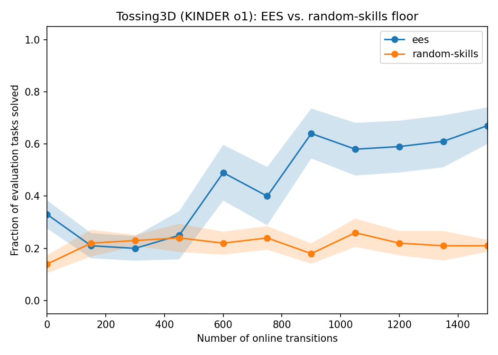
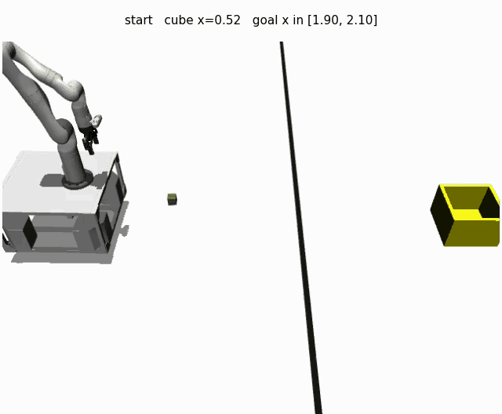

# Tossing3D: EES against the random-skills floor

**Status: a reproduction result.** It says what EES's learning curve looks like on a
KINDER domain whose success is irreversible. It does **not** test the irreversibility
hypothesis, and cannot — see [What this cannot tell us](#what-this-cannot-tell-us),
which is the section to read before any number below.

## What was run

Ten fixed seeds (0..9) per arm, both arms through `scripts/run_sweep.py` so the
`(method x seed)` grid and the `<root>/<method>/<seed>/` layout are the ones
`analysis/` globs for. Seeds are shared across arms, so **every comparison here is
paired** and is tested as such.

```bash
python -m scripts.run_sweep \
  --env tossing3d --methods ees random-skills --num-seeds 10 \
  --results-root <root> --max-workers 12 \
  --shared-args "--num-cycles 10 --max-steps-per-interaction 150"
```

The protocol flags match the Tossing Room bring-up (`2026-08-02-tossingroom-ees-bringup.md`)
so the two domains' curves are read on the same axes: 10 cycles x 150 steps = 1500
online transitions, evaluated on the default 10 held-out test tasks before practice and
after each cycle.

Analysis is post-run only, off the written `stats.json`:

```bash
python -m analysis.practice_makes_perfect.ees \
  --results-root <root> --output docs/experiment-logs/2026-08-04-tossing3d-ees-curves.png
python -m analysis.practice_makes_perfect.tossing3d_comparison --results-root <root>
```

## Running it at all: the port needed a fix first

The committed port was green on everything CI runs, but CI does not have `kindergarden`,
so the eight tests that genuinely drive MuJoCo were skipping. Run with the optional
dependency installed, two things showed up.

**A memory leak that made a sweep impossible.** A 40-step run reached 18.7 GB RSS and
was still climbing at ~112 MB/s. The cause is a seam between two reasonable-looking
pieces: KINDER's `LiftedParameterizedController.ground` is
`return self.controller_cls(objects)`, so grounding mints a *new* controller per call,
and each new controller's `reset` stands up its own `PyBulletSim` — a
`p.connect(p.DIRECT)` plus the Kinova URDF and meshes — which nothing on KINDER's side
ever disconnects. `KinderBackend` already cached the *lifted* controllers to avoid
exactly this and its docstring named the failure mode, but that cache cannot help, since
the leak is per *grounding*. Measured at ~150 MB per `Pick` and ~315 MB per `Toss`;
resets were never the problem (50 of them are flat).

Fixed by releasing the client in `_run`'s `finally`. Memoizing the grounding instead was
tried first and is wrong — `PyBulletSim` carries held-object state `reset` does not
clear, so every `Pick` after the first silently fails.

| | 60 skill executions | 600 skill executions |
| --- | --- | --- |
| before | 8.4 GB, still climbing | (would not survive) |
| after | ~0.66 GB | ~0.66 GB (+122 MB total, all warmup) |

Releasing only frees a resource, so the physics are unchanged: seeds 0 and 2 reproduce
the pre-fix landing positions to three decimals, including the swing = 1.0 overshoot to
x = 2.216.

**One genuinely red fidelity test.**
`test_a_full_power_toss_overshoots_the_goal_region` asserted the overshoot on seed 1 —
the one seed where it does not happen. There the grasp is marginal and the cube slips
out during `move_to_target`, landing at x ~ 1.58 having never been tossed, so the test
was measuring the `Pick`, not the swing. It now asserts on seeds 0 and 2, the same seed
pair `test_the_oracle_swing_actually_reaches_the_goal_region` was already tolerating by
asserting 2 of 3 rather than 3 of 3.

### The swing dial, measured

Landing x after the oracle's Pick and MoveToThrowPose, per swing, post-fix. The goal
region is x in [1.90, 2.10]; the bin's footprint starts at 2.08 — so a toss hard enough
to land *in the bin* fails KINDER's own goal check, which is what makes the dial worth
learning.

| swing | 0.25 | 0.50 | 0.60 | 0.75 | 0.90 | 1.00 |
| --- | --- | --- | --- | --- | --- | --- |
| seed 0 | 1.418 | 1.657 | **1.990** | **1.914** | **2.015** | 2.216 |
| seed 2 | 1.424 | 1.656 | **1.989** | **1.915** | **2.014** | 2.216 |

Bold = inside the goal region. The band is roughly swing in [0.57, 0.93], about 36% of
the sampler's `[0.25, 1.25]` prior — which is why this domain's **pre-practice**
checkpoint is not near zero, and why EES's own starting point, not just the
random-skills floor, is the reference that matters.

Seed 1 is absent because its grasp is marginal and it drops the cube during the move for
every swing, so it measures the Pick.

## Results



Fraction of the 10 held-out evaluation tasks solved vs online transitions; solid = mean
over seeds 0..9, shading = standard error. The paper's Figure 4 view.

| arm | seeds | pre-practice | end of training | sd | min | max |
| --- | --- | --- | --- | --- | --- | --- |
| **EES** | 10 | 33.0% | **67.0%** | 22.1 | 40% | 100% |
| random skills | 10 | 14.0% | 21.0% | 7.4 | 10% | 30% |

Per-seed end-of-training, EES: `[70, 60, 90, 80, 40, 50, 50, 40, 100, 90]`.
Per-seed end-of-training, random skills: `[30, 20, 30, 10, 20, 20, 20, 30, 10, 20]`.

Arms share seeds 0..9, so both comparisons are paired and are tested with the exact
Wilcoxon signed-rank (all 2^n sign assignments enumerated).

| comparison | mean paired difference | test | verdict |
| --- | --- | --- | --- |
| EES end vs **its own pre-practice checkpoint** | +34.0 pp (sd 23.2) | p = 0.0039, n = 9 non-tied | **established** |
| EES end vs **random skills** end | +46.0 pp (sd 25.5) | p = 0.0020, n = 10 non-tied | **established** |
| random skills end vs its own start | +7.0 pp (sd 12.5) | p = 0.1094, n = 7 non-tied | **not established** — 26 paired seeds would be needed for 80% power |

So EES learns on this domain: it roughly doubles its own untrained success rate, and
ends three times the non-learning floor. The floor itself is flat within noise across
the whole budget (21–26% at every checkpoint after the first), which is what a floor
should look like.

### The mean dips before it climbs — but the dip is not established

The *mean* curve is not monotone: it falls from 33% pre-practice to 20% at 300
transitions before climbing to 67%. Tempting as "EES gets worse before it gets better"
is, **that decrease does not survive a test** and is not claimed here:

| comparison | mean paired difference | test | verdict |
| --- | --- | --- | --- |
| EES worst post-practice checkpoint (300) vs pre-practice | −13.0 pp (sd 20.6) | p = 0.1328, n = 8 non-tied | **not established** — 20 paired seeds would be needed for 80% power |

Per-seed differences: `[-30, -40, 0, 0, -10, -10, +10, -10, -50, +10]` — seven seeds at
or below zero, but two go up and the spread swamps the mean. The 300-transition
checkpoint was also chosen *post hoc*, as the worst of ten by mean, which inflates
significance rather than deflating it; a p of 0.13 under that selection is weaker than
it looks, not stronger.

So: the dip is a feature of this sample's mean, not a demonstrated effect.
`tossing3d_comparison.py` runs this test on every invocation so the claim cannot drift
back into being asserted.

The checkpoint means, for reference:

| transitions | 0 | 150 | 300 | 450 | 600 | 750 | 900 | 1050 | 1200 | 1350 | 1500 |
| --- | --- | --- | --- | --- | --- | --- | --- | --- | --- | --- | --- |
| EES | 33% | 21% | 20% | 25% | 49% | 40% | 64% | 58% | 59% | 61% | **67%** |
| random skills | 14% | 22% | 23% | 24% | 22% | 24% | 18% | 26% | 22% | 21% | 21% |

This still matters for reading short runs, whether or not the dip is real: a pilot at 90
transitions showed 6/10 -> 1/10 and looked like EES actively degrading. Whatever that
was, it was not the end state — the same configuration run to 1500 transitions reaches
67%. Do not read a few hundred transitions on this domain as a trend in either
direction.

The pre-practice checkpoint is high here for a structural reason — EES *plans* the
correct skill sequence from the start, and only the sampler is untrained, so its
starting point already inherits the ~36% of the swing prior that lands in the goal
region (see the swing table above). Random skills has to discover the sequence too,
which is why it starts at 14%. That is also why the two comparisons in the table above
answer different questions and both are reported.

A tempting mechanism for the dip — early practice data is mostly failure, so the
refitted sampler is briefly worse than the uniform prior it replaced — is **not tested
here**, and since the dip itself is not established, nothing in this log should be read
as evidence for it.

## The progression, at four checkpoints

`--num-render-checkpoints 4` on seed 0, recorded from before any practice through the
end of training. The renderer is a storyboard — one labelled frame per skill, not a
smooth video — so each frame names the ground skill, its sampled continuous parameters,
and the cube's resulting x against the goal region.

| transitions | what the demo episode does |
| --- | --- |
| **0** | `Pick(params=[0.59, -0.37])` fails outright; the cube never leaves the floor at x = 0.48. Runs the full horizon. |
| **450** | Tossed clean past everything to x = 2.86, then `no-op (no plan)`. The cube is unreachable and nothing recovers it. |
| **1050** | `Toss(params=[0.89])` → cube at x = **2.01**, inside [1.90, 2.10]. Solved in the minimum 3 skills. |
| **1500** | `Toss(params=[0.84])` → cube at x = **2.00**. Solved in 3. |




Two things worth reading off these rather than off the curve.

**The swing converges into the measured band.** 0.89 and 0.84 both sit inside the
[0.57, 0.93] band the swing table above establishes, and the trained episodes finish in
3 skills where the untrained ones run the horizon out.

**The 450-transition frame is the irreversibility, on screen.** The cube is at x = 2.86,
past the goal region and past the bin, and the label is literally `no-op (no plan)` —
there is no skill sequence back. This is the failure mode the domain exists to exhibit.
Note what happens next anyway: the episode ends, the harness resets for free, and the
run recovers to 90% by 1500. That is exactly the confound described below — the picture
shows the irreversibility, and the experiment still cannot measure its cost.

**These GIFs are from a separate run, not the seed-0 run in the curve.** Enabling
`--num-render-checkpoints` perturbs the run: same seed, same protocol, different
trajectory (rendered `[6,3,1,1,7,7,7,7,8,9,9]` vs the sweep's
`[6,3,3,4,7,7,7,8,8,9,7]` solved-out-of-10 per checkpoint). They are an illustration of
the behaviour, not the data behind the curve. That the render flag is not
outcome-neutral is worth a look on its own; it is not chased here.

They are also ~60–100 KB rather than the ~25 KB of the Tossing Room precedent, using the
same shared-64-colour-palette recipe. A 640x528 3D render with smooth shading simply has
more entropy than a 2D storyboard; 32 colours only buys ~15%.

## Was the sweep contaminated by its own concurrency?

The sweep ran 12 concurrent runs on a 24-core box. The thing that could break under that
load is Fast Downward's **10 s wall-clock timeout** — a starved FD would return no plan,
and a run's curve would then be measuring timeouts rather than learning.

**This cannot be checked the obvious way.** `ees_method.py` swallows `PlanningFailure`
at all three call sites without logging it, so a timeout and a genuinely unreachable
goal look identical, and neither appears in `log.txt`. Grepping the per-run logs for a
planning-failure rate is simply not a check this harness supports today.

What the evidence actually says, in descending order of strength:

- **Cross-agent, on this same box** (reset-frequency work, Tossing Room): 13,105 live FD
  process observations, **maximum lifetime 0 s** against the 10 s budget, at loads from
  9 to 27; not one observation reached even 5 s. And `stats.json` byte-identical between
  a low-load probe and a 20-way concurrent sweep on both extreme arms. A spurious
  timeout would necessarily change the plan and hence the trajectory, so identity rules
  one out. This is the strongest evidence available and it says concurrency is safe.
- **This domain, low concurrency:** two identical `run_sweep --max-workers 1`
  invocations produced bit-identical `stats.json`. The pipeline is deterministic.
- **This domain, the re-run diff — a failed check worth recording.** Re-running EES seed
  0 alone and diffing against its sweep result returned **DIFFERS**, and substantially
  (`[6,3,3,4,7,7,7,8,8,9,7]` vs `[6,1,4,1,2,1,0,6,7,7,7]`). That result is **not
  usable**, for a reason that is a lesson rather than a finding: the re-run invoked
  `hitl_pmp.cli` directly, while `run_sweep` pins `OMP_NUM_THREADS=1` and
  `MKL_NUM_THREADS=1` on every child (`run_sweep.py:153`). So it compared a many-thread
  run against a one-thread run and would have blamed the difference on concurrency. It
  also ran while two full pytest suites were loading the box. An apples-to-apples re-run
  through `run_sweep --max-workers 1` is the correct form of this check.

**Bottom line for this log's numbers.** The arm-level comparison is not at risk either
way: both arms ran interleaved inside the *same* sweep, under the same load, so any
load effect applies equally to both and the paired differences stand. Per-seed values
should be treated as machine- *and* load-local, which is what this repo already requires
of them. If the pinned-thread re-run ever comes back DIFFERS, that would be a finding
about `--seed` determinism under load and belongs in its own investigation, not a
correction to the arm-level result above.

## What this cannot tell us

Tossing3D's defining property is that **a tossed cube cannot be retrieved** — success or
miss, it ends up past an immovable barrier and no skill brings it back. The project's V1
proposal names exactly this as EES's predicted failure mode: *"when the goal is reached
(ex: Tossing 3d), it can't reset, even though it did everything right."*

**The measurement above cannot speak to that hypothesis in either direction**, for two
concrete reasons.

1. **The harness hands out a free reset.** `PracticeLoop.run` calls
   `problem.reset_to_task(task=task)` at the top of every practice cycle, and
   `run_task_episode` resets per evaluation episode. So the environment is restored for
   free every `--max-steps-per-interaction` steps. That is faithful to predicators and
   correct for a reproduction — and it supplies precisely the free resets the
   irreversibility hypothesis is about removing. With that reset in place Tossing3D does
   not stall, so a clean curve here is evidence about EES's sampler learning, not about
   irreversibility.
2. **Human intervention is not representable.** `Metrics.num_human_interventions()`
   returns a hardcoded `(0.0, 0)` because no `Method` in this repo ever calls
   `Problem.execute_human_command`. The cost that the hypothesis predicts irreversibility
   imposes therefore has nowhere to be recorded, whatever the environment does.

This is not a hypothetical concern: the same thing already happened on Tossing Room,
where the RECYCLING family makes a missed throw terminal and EES still learned 18% ->
92%.

Changing the reset behaviour is a separate design decision and belongs in a separate PR.
It is deliberately **not** done here — this log establishes the reproduction baseline
that such a change would be measured against.

## Limitations

- **Per-seed numbers are machine-local.** Compare at arm level. Two identical
  `run_sweep` invocations on this box produced bit-identical `stats.json`, so `--seed`
  fully determines a run *here*; that is a determinism claim, not a portability one.
- **The planning-failure rate cannot be read out of the run logs at all.**
  `ees_method.py` catches `PlanningFailure` silently at all three of its call sites
  (lines 386, 778, 802) and never logs it, so a Fast Downward *timeout* is
  indistinguishable from a goal that is genuinely unreachable — neither reaches
  `log.txt`. Grepping the per-run logs for planning failures, the obvious way to check
  whether 12-way concurrency starved FD against its 10 s budget, is therefore not a
  check that can be performed. That is a gap in the harness's observability, not
  something specific to this domain.

  What was substituted: re-running a seed alone and diffing `stats.json`, since a
  timeout would necessarily change the plan and therefore the trajectory. See
  [Was the sweep contaminated by its own concurrency?](#was-the-sweep-contaminated-by-its-own-concurrency)
  below for what that returned, which is less clean than hoped.
- **10 evaluation tasks per checkpoint**, so a single seed's curve moves in 10-point
  steps. The arm-level mean over 10 seeds is the readable quantity.
- **`o2` is not supported** (two cubes; the symbolic layer here is single-cube).
- **The goal is KINDER's `blocks_goal_region` verbatim**, not "in the bin". See the
  environment README — this is the benchmark's own criterion, and the bin sits past it.
