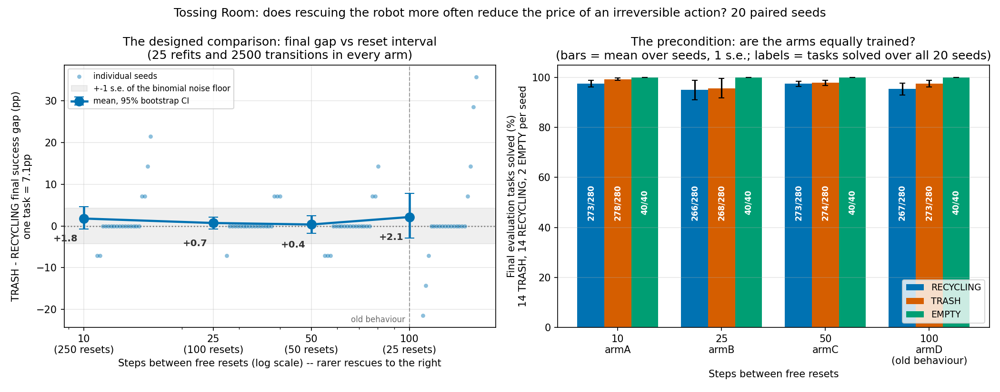
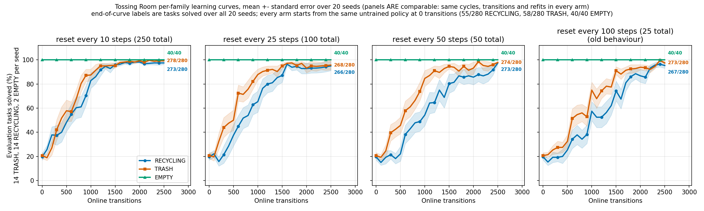

# Rescuing the robot more often, with training held fixed (Tossing Room)

**On the pre-specified metric the answer is no, and this time the design can
actually say so.** With `--num-cycles 25` and `--max-steps-per-interaction 100`
pinned in every arm — 25 sampler refits and exactly 2500 online transitions
everywhere — a 10x change in how often the robot gets a free reset moves the final
(TRASH − RECYCLING) gap by **+0.36pp, exact Wilcoxon p = 0.9531**. The four arm
means are +1.8 / +0.7 / +0.4 / +2.1 pp for reset intervals of 10/25/50/100 steps.
No trend: per-seed slope +0.03pp per doubling, **p = 0.7959**.

**But the null is measured at a ceiling, and that matters.** By 2500 transitions
every arm solves **268–278 of 280** TRASH tasks and **266–273 of 280** RECYCLING
tasks, so the final gap has almost nowhere to move. The tight sds (3.2–12.5pp
against an 18.9pp noise floor) are saturation, not precision — 13–16 of 20 seeds
have a gap of *exactly* zero, and **56 of those 57 zero gaps are both families at
14/14** (the one exception is arm B seed 12, which is 3/14 on both). The design's
minimum detectable effect on the extreme contrast is 9.35pp, so a gap effect that
large is excluded and a smaller one is not.

**Every success rate in this log is a count.** The evaluation set is a fixed 14
TRASH / 14 RECYCLING / 2 EMPTY per seed, so one task is 7.1pp on a throw family and
50pp on `EMPTY`. Written as percentages, `EMPTY 100.0` sits next to `TRASH 99.3` as
though the two carried the same weight; written as counts they are **40/40** and
**278/280**, and the difference is obvious. Counts also make the resolution
visible: a throw family can only score in 7.1pp steps, which `13/14` says and
`92.9%` hides. Every count below is read out of `Metrics.breakdowns` in each run's
own `stats.json` — none is reconstructed by multiplying a percentage by *n*.
Differences of two rates (the T−R gap, slopes, MDEs, the noise floor) stay in
percentage points, which is their correct unit.

**The methodological result is the one worth keeping: the confound that sank PR #39
is gone.** Paired armD − armA, final competence differs by **−1.8pp on TRASH
(p = 0.3750)** and **−2.1pp on RECYCLING (p = 0.5156)** — against #39's −40.4 and
−44.7pp at p = 0.0156. Transitions are 2500 in every seed of every arm, sd 0.
`EMPTY` is 40/40 in every arm, sd 0. The arms differ in reset frequency and
in nothing else that was measured.

**And post-hoc, reset frequency turns out to matter a great deal — just not to the
endpoint.** Resetting every 10 steps instead of every 100 raises the area under
the learning curve by **+18.4pp on RECYCLING (p = 0.0001)** and **+11.1pp on TRASH
(p = 0.0007)**, and by **exactly 0.0pp on the deterministic `EMPTY` control**. In
counts, RECYCLING goes from **4187/7280** tasks solved across the whole curve at
interval 100 to **5528/7280** at interval 10. The harness's reset frequency is a
real driver of sample efficiency on the stochastic families. Whether it is
*specifically* about irreversibility is **not established**: RECYCLING gains 7.3pp
more than TRASH, but p = 0.0623, and ~49 seeds would be needed for 80% power.



## The question, and why it needed new code

Tossing Room has **two** genuinely terminal failures, both caused by the same one-way
ledge:

| family | `Throw`? | what goes terminal |
|---|---|---|
| `EMPTY` | no — `MoveRoom`xk + `Press`x2 | **terminal** — an *ordering* trap, not a sampler miss: the recycling button sits behind the ledge, so pressing it before the trash one puts the trash button permanently out of reach |
| `TRASH` | yes | nothing terminal — a missed throw costs a round trip to the pile for a fresh item; expensive, recoverable |
| `RECYCLING` | yes | **terminal** — pile in room 3, recycling bin in room 1, `blocked_right_from = 2` makes room 3 unreachable once the item is gone, so Fast Downward correctly reports no plan |

> **Correction.** This page originally claimed a *single* terminal failure, and called
> `EMPTY` the deterministic control whose miss "costs nothing". That was
> wrong: `EMPTY`'s press ordering is terminal for the same reason `RECYCLING`'s throw
> is, and `environments/tossingroom/environment.py`'s own module docstring said so all
> along ("the reverse order is unsolvable"). The measured signature is `PressRecycling`
> at **3,576/24,750** practice actions (14.4%) in the **standard-budget** split-throw
> run — 25 cycles × 100 steps × 10 seeds, so 24,750 practice actions in all — a stranded
> robot pressing an already-empty button, 22x that run's recycling-throw count
> ([`2026-08-05-tossingroomsplit-throw-rates.md`](./2026-08-05-tossingroomsplit-throw-rates.md)).
> PR #103's 10x-budget run has a ~10x larger denominator, so its tallies are not
> comparable to this one and neither contradicts the other.
>
> **Nothing else on this page changes.** The experiment is a within-arm
> (TRASH − RECYCLING) contrast, and `EMPTY` scored **1040/1040** in each of the four
> arms — not one miss anywhere in the committed aggregate — so the ordering trap never
> fired at evaluation and every number below stands.

`PracticeLoop.run` used to reset the environment only at the top of each practice
cycle, so the harness handed out a free reset every `--max-steps-per-interaction`
steps. That caps what stranding can cost at "you wasted the rest of this period".

**Hypothesis.** Rescue a stranded robot sooner and it wastes less experience, so
`RECYCLING` suffers less and the (TRASH − RECYCLING) gap shrinks as resets get
more frequent.

PR #39 tried to test this by varying the period length with `--num-cycles`
inverted to hold transitions fixed. It could not: `--num-cycles` sets the number
of free resets **and** the number of sampler refits with one number, so its arms
ended ~40 competence points apart on identical experience, and its measured gap
peaked mid-curve rather than at the fewest-resets end. That is the training
difference asserting itself, not irreversibility.

So this experiment starts with a code change. `PracticeLoop.run` gains
`practice_reset_interval` (CLI: `--practice-reset-interval`), which puts the
environment back to the **current** practice task's initial state every k steps
*inside* a period, without ending the cycle and therefore without firing
`end_cycle()`. Resets are not charged as transitions. `None` — the default — is
exactly the old behaviour.

Two details that had to be right for the manipulation to be clean:

* **`Method.observe_environment_reset`.** EES scores a skill by checking its
  `add_effects` on the *next* state it sees. Without a hook fired immediately
  before each within-period reset, every skill executed just before a reset would
  be judged against a freshly reset environment — where `InBin`/`RobotInRoom`
  effects essentially never hold — and recorded as a **failure** into both its
  competence model and its sampler's training data. That mislabelling scales with
  reset frequency: ~225 false failures in arm A against 0 in arm D, out of 2500
  skill executions. It would have degraded exactly the sampler whose quality
  determines TRASH and RECYCLING success, in the direction that *masks* the
  hypothesis. The hook deliberately does **not** fire at the period boundary,
  where the last skill has always gone unobserved — that asymmetry is what makes
  every arm drop exactly one observation per period.
  `test_the_number_of_observed_outcomes_does_not_depend_on_the_reset_interval`
  runs the real method (EES, Fast Downward in the loop) at four intervals and
  counts observed outcomes: `n − 1` per period of `n` steps at every interval.
* **`Metrics.num_practice_resets`.** Counts resets as they happen and rides into
  `stats.json`, so "the arms differed in reset frequency" is a measurement rather
  than a restatement of the flag.

## Design

| arm | `--practice-reset-interval` | resets/period | total free resets |
|---|---|---|---|
| A | 10 | 10 | 250 |
| B | 25 | 4 | 100 |
| C | 50 | 2 | 50 |
| D | 100 (= period length, the old behaviour) | 1 | 25 |

`--num-cycles 25` and `--max-steps-per-interaction 100` in **every** arm, so all
four get 25 sampler refits over 2500 online transitions. A 10x range in reset
frequency with training pinned. 20 paired seeds (0..19, fixed by `run_sweep`),
`--num-test-tasks 30`, `--sampler-max-train-iters 10000`, `--env tossingroom
--method ees`.

**Primary metric, fixed before the runs: the within-arm (TRASH − RECYCLING) final
success gap, paired by seed.** Prediction if the hypothesis holds: the gap shrinks
from D toward A.

### Baselines: what this compares against, and what it deliberately does not

All four arms are `--method ees`. **No separate baseline method was run**, and
that is the design rather than an omission — but it changes how the numbers below
should be read, so it is stated here rather than left to be inferred.

* **Arm D is the behavioural baseline.** Its interval (100) equals the period
  length, so it reproduces exactly the behaviour that shipped before
  `--practice-reset-interval` existed — verified byte-for-byte against a run with
  the flag omitted entirely, not merely argued. For a question about *reset
  frequency*, "the frequency we already used" is the right control.
* **The comparison is within-arm and paired.** The metric is a difference between
  two task families measured inside the same run, and every arm ran the same fixed
  seeds 0..19, so each contrast is 20 paired differences. Nothing here is compared
  against an external absolute.
* **Each learning curve carries its own floor in-panel.** Checkpoint 0 is the
  evaluation sweep taken *before* any practice step, so all four arms evaluate
  literally the same untrained policy there: **58/280 TRASH**, **55/280
  RECYCLING**, **40/40 EMPTY**, identical in every arm. That is the answer to "is
  95–99% impressive, or are the tasks just easy?" — an untrained EES (real
  planner, untrained samplers) solves about one throw task in five, and the ~278/280
  the arms end at is learned, not given.
* **No random-skills floor was run here**, because the question is the difference
  *between* arms, not absolute competence. That floor is measured elsewhere, twice:
  `docs/experiment-logs/2026-08-02-tossingroom-ees-bringup.md` reports **6.7%**
  (10 seeds) on the pre-#41 sampled test set, and PR #52 re-measures it at **1.7%**
  (sd 1.8, worst seed 0.0) on this experiment's fixed 14/14/2 composition. Both sit
  far below the 19.6–20.7% untrained-EES checkpoint 0 above, which is itself far
  below where every arm ends.

### Not comparable to PR #39

Two things changed at once relative to that experiment, both deliberately:

* the **test-set composition** is now deterministic (14 TRASH / 14 RECYCLING / 2
  EMPTY per seed, from #41) where #39 sampled it from `goal_weights` and got
  16/10/4 at seed 0, 11/12/7 at seed 1;
* **20 seeds** instead of 10.

So absolute numbers here are measured on a different evaluation set from #39's and
must not be read across. Within these four arms everything stays paired and
comparable, which is what the experiment needs.

### The noise floor, and what this design could have found

The gap is a difference of two binomial proportions, so at the worst case p = 0.5
its per-seed sd from task sampling alone is
`100 * sqrt(0.25/14 + 0.25/14)` = **18.9pp**. That is the floor: an observed gap
sd near it means the spread is how few tasks each seed holds, not what the agent
learned.

#39's floor was 20.7pp on a *sampled* composition whose per-family counts also
moved seed to seed. The improvement here is small in the floor and large in the
seed count, which is the right trade: #39's largest-effect arm had sd 49.3 against
that 20.7pp floor, i.e. genuine seed-to-seed heterogeneity that no number of extra
tasks per seed can reduce — only more seeds can.

**Minimum detectable effect at 20 paired seeds**, at the spread actually observed
(`(z_0.975 + z_0.80) * sd / sqrt(n)`):

| quantity | observed sd | MDE |
|---|---|---|
| final gap, armD − armA | 14.9 | **9.35pp** |
| per-seed trend slope | 4.02 | 2.52pp per doubling |
| final TRASH, armD − armA | 6.1 | 3.8pp |
| final RECYCLING, armD − armA | 12.9 | 8.1pp |

So the null below excludes a final-gap effect of ~9pp or larger, and says nothing
about smaller ones.

## Result 0: the manipulation happened, and nothing else moved with it

All three checks below are read *before* any p-value, because each decides whether
the p-values mean anything.

**Free resets that actually happened** (`Metrics.num_practice_resets`, read back
out of each run's own `stats.json`):

| arm | interval | expected | observed (min..max over 20 seeds) |
|---|---|---|---|
| A | 10 | 250 | **250..250** |
| B | 25 | 100 | **100..100** |
| C | 50 | 50 | **50..50** |
| D | 100 | 25 | **25..25** |

**Test-set composition**: 14 TRASH / 14 RECYCLING / 2 EMPTY in every seed of every
arm. **0 violations** across all 80 runs. Asserted rather than assumed, and the
expected split is asked of `TossingRoomTasks.test_goal_type_counts()` rather than
hardcoded in the analysis.

**Experience**: exactly **2500** online transitions in every seed of every arm,
sd 0. This is not automatic — a mid-period reset can revive a robot whose practice
planner had nothing applicable left and would otherwise have raised
`InteractionComplete`, buying the frequently-reset arms extra steps. It did not
happen.

**All 80 runs exited 0** (20/20 in each arm).

## Result 1: the precondition holds — the arms really are equally trained

Paired across the same 20 seeds, exact tests, arm D (100) minus arm A (10):

| family | mean difference | sd | Wilcoxon p | sign-flip p | MDE at n = 20 |
|---|---|---|---|---|---|
| `TRASH` | −1.8pp | 6.1 | 0.3750 | 0.3750 | 3.8pp |
| `RECYCLING` | −2.1pp | 12.9 | 0.5156 | 0.5547 | 8.1pp |
| `EMPTY` | +0.0pp | 0.0 | 1.0000 | 1.0000 | 0.0pp |

Compare PR #39's same table: **−40.4pp and −44.7pp, both p = 0.0156**. That
experiment's arms sat at different points on a gap-versus-progress curve and its
cross-arm gap comparison was confounded at a magnitude far larger than anything it
reported. These arms are level, so a cross-arm gap difference here would be
attributable to reset frequency.

`EMPTY` is again a **perfect control** — **2/2 in every seed of every arm**, so
40/40 per arm, sd exactly 0. Whatever moves is confined to the two families that
use the stochastic `Throw`. The count is also the reason the control cannot do more
work than that: **2 tasks per seed is almost no evidence**, and an untrained policy
already solves both, so it sits on the ceiling from the first checkpoint. As a
percentage `100.0` looks like the strongest number in every table below; as
`40/40` against `278/280` it is visibly the weakest.

## Result 2: the final gap does not move with reset frequency

Success as tasks solved over all 20 seeds (280 per throw family, 40 for `EMPTY`),
with the percentage in brackets as a rendering of it:

| arm | interval | resets | final TRASH | final RECYCLING | final EMPTY | **gap (T−R)** |
|---|---|---|---|---|---|---|
| A | 10 | 250 | **278/280** (99.3%) | **273/280** (97.5%) | 40/40 (100%) | **+1.8 ± 6.5pp** |
| B | 25 | 100 | **268/280** (95.7%) | **266/280** (95.0%) | 40/40 (100%) | **+0.7 ± 3.2pp** |
| C | 50 | 50 | **274/280** (97.9%) | **273/280** (97.5%) | 40/40 (100%) | **+0.4 ± 4.9pp** |
| D | 100 | 25 | **273/280** (97.5%) | **267/280** (95.4%) | 40/40 (100%) | **+2.1 ± 12.5pp** |

The pooled count and the per-seed spread are different quantities and are kept
apart. Per seed, as a mean count out of the 14 / 14 / 2 each seed holds:

| arm | TRASH per seed | RECYCLING per seed | EMPTY per seed |
|---|---|---|---|
| A | 13.90/14 ± 0.31 | 13.65/14 ± 0.81 | 2.00/2 ± 0.00 |
| B | 13.40/14 ± 2.46 | 13.30/14 ± 2.45 | 2.00/2 ± 0.00 |
| C | 13.70/14 ± 0.66 | 13.65/14 ± 0.67 | 2.00/2 ± 0.00 |
| D | 13.65/14 ± 0.81 | 13.35/14 ± 1.46 | 2.00/2 ± 0.00 |

Arm B's sds of ~2.45 tasks are one seed, not a broad spread — seed 12 scores 3/14
on *both* throw families while every other seed is at 13/14 or 14/14. The per-seed
blocks below are there so that is readable rather than inferred.

**Trend tests**, all paired on the same 20 seeds, all exact by enumeration:

| test | mean | sd | Wilcoxon p | sign-flip p | n for 80% power |
|---|---|---|---|---|---|
| gap, armD − armA | +0.36pp | 14.92 | 0.9531 | 1.0000 | ~13,707 |
| per-seed slope, pp per doubling | +0.03 | 4.02 | 0.7959 | 0.9778 | ~135,590 |
| per-seed Spearman rho vs interval | −0.13 | 0.58 | 0.2845 | 0.3263 | ~154 |

Nothing is close to p < 0.05, and the Spearman rho is *negative* — the opposite of
the hypothesis's direction. Tested at n = 20 across seeds rather than n = 4 across
arm means, because Spearman on four points bottoms out at p = 0.083 even for
perfect monotonicity.

**Within-arm gap against zero — is RECYCLING behind TRASH at the end at all?**

| arm | mean gap | Wilcoxon p | exact-zero seeds |
|---|---|---|---|
| A | +1.8pp | 0.3750 | 14/20 |
| B | +0.7pp | 0.6250 | 16/20 |
| C | +0.4pp | 0.9062 | 14/20 |
| D | +2.1pp | 0.5000 | 13/20 |

No arm establishes even the premise at the final checkpoint.

**Noise floor against observed sd.** Every arm is *below* the 18.9pp floor —
6.5 / 3.2 / 4.9 / 12.5, i.e. 34% / 17% / 26% / 66% of it. **That is saturation,
not precision.** A gap of exactly zero is forced whenever both families are at
14/14, and 56 of the 57 zero gaps across the four arms are exactly that (the
remaining one, arm B seed 12, is 3/14 on both — a tie at the floor rather than at
the ceiling). This is the same trap PR #39's log flagged for its own arm A, and it
applies to all four arms here.

**Per-seed final tasks solved, out of 14, because an sd here is often one collapsed
seed** (seeds 0..19 left to right):

```text
RECYCLING, out of 14
armA   14  14  14  14  14  14  14  13  14  14  12  14  14  13  14  11  14  14  14  14
armB   13  14  14  14  14  14  13  14  14  14  13  14   3  14  14  14  14  14  14  14
armC   13  14  14  12  12  14  14  14  14  14  14  13  14  14  14  13  14  14  14  14
armD   14  14  14  12  14  14   9  14  14  14  14  14  10  14  12  14  14  14  14  14

TRASH, out of 14
armA   14  14  14  13  14  14  14  14  14  14  14  14  14  14  13  14  14  14  14  14
armB   14  14  14  14  14  14  14  14  14  14  14  13   3  14  14  14  14  14  14  14
armC   12  14  14  14  13  14  14  14  14  14  14  12  14  14  13  14  14  14  14  14
armD   14  14  13  14  14  14  14  14  14  14  14  14  14  14  13  14  11  14  12  14
```

One seed in arm B collapses to 3/14 — on *both* families, which is what its 2.46
and 2.45 per-seed sds are made of. Arm D has two RECYCLING seeds at 9/14 and 10/14.
Arm A's worst is 11/14. That ordering is directionally consistent with the
hypothesis and far too thin to claim anything from: arm A's entire final-checkpoint
advantage over arm D is **5 TRASH tasks and 6 RECYCLING tasks out of 280 each**.



## Result 3 (POST-HOC): the effect is in the trajectory, not the endpoint

The learning curves above are not saturated, and they plainly differ. Everything in
this section was added **after** seeing that the pre-specified endpoint metric was
measured at a ceiling, and carries correspondingly less evidential weight.

The statistic is the **normalised area under each seed's learning curve** — the
mean success rate over all 26 checkpoints. Chosen over "transitions to reach X%"
because that one is censored: a seed that never reaches the threshold has no value
(arm B seed 12 ends at 3/14 on both throw families), which would silently drop the
worst seeds and flatter whichever arm they fall in. Averaging the curve is defined
for every seed.

An unweighted mean over checkpoints is only comparable across arms if checkpoint
*i* sits at the same transition count in every arm. It does: across all 80 runs
and all three families there is exactly **one** distinct transition grid,
`0, 100, ..., 2500`. Checked rather than inferred from the equal totals — a period
that ended early and was made up later would land on 2500 while sampling the curve
at different x.

As a count, the area under the curve is just *tasks solved summed over every
checkpoint of every seed*: 26 checkpoints × 20 seeds × 14 tasks = **7280** per
throw family, and × 2 = **1040** for `EMPTY`. That is the same quantity as the mean
of the per-seed mean rates only because every checkpoint has the same denominator
— which the composition check establishes — so both renderings are given and the
analysis asserts they agree.

| arm | interval | RECYCLING AUC | TRASH AUC | EMPTY AUC |
|---|---|---|---|---|
| A | 10 | **5528/7280** (75.9% ± 12.2) | **5763/7280** (79.2% ± 9.9) | 1040/1040 (100% ± 0.0) |
| B | 25 | 4967/7280 (68.2% ± 16.8) | 5654/7280 (77.7% ± 11.6) | 1040/1040 (100% ± 0.0) |
| C | 50 | 4423/7280 (60.8% ± 18.2) | 5427/7280 (74.5% ± 12.3) | 1040/1040 (100% ± 0.0) |
| D | 100 | 4187/7280 (57.5% ± 14.9) | 4957/7280 (68.1% ± 9.5) | 1040/1040 (100% ± 0.0) |

(The `±` is the sd across the 20 per-seed means, not a spread on the pooled count.)

**Monotone in reset frequency on both throw families, and flat on the control.**
Paired armA (10) minus armD (100), exact:

| family | mean speed-up | sd | Wilcoxon p | sign-flip p |
|---|---|---|---|---|
| `RECYCLING` | **+18.4pp** | 18.9 | **0.0001** | **0.0001** |
| `TRASH` | **+11.1pp** | 11.8 | **0.0007** | **0.0005** |
| `EMPTY` | +0.0pp | 0.0 | 1.0000 | 1.0000 |

So the harness's reset frequency is a **real and large driver of sample
efficiency** on the stochastic families, worth ~18 points of area-under-curve on
the irreversible one over a 10x range. It is not an artifact of the control
family, which does not move at all.

**Is it about irreversibility, though?** Not established. There is an obvious
non-irreversibility mechanism that predicts exactly this: a reset teleports the
robot back to the pile room, so it spends fewer steps traversing and more steps
throwing, which speeds up *any* throw-dependent family. Irreversibility predicts
something stronger — that the terminal family benefits **more**:

| test | mean | sd | Wilcoxon p | sign-flip p | MDE at n = 20 | n for 80% power |
|---|---|---|---|---|---|---|
| RECYCLING speed-up − TRASH speed-up | +7.3pp | 18.4 | 0.0623 | 0.0912 | 11.5pp | **~49** |

The sign is right and the magnitude is substantial, but **p = 0.0623 is not
significant** and this is a post-hoc test besides. ~49 paired seeds would settle
it, and seeds pool cleanly with these — 20 are already banked.

The same picture from the other direction, the mean (TRASH − RECYCLING) gap across
all checkpoints rather than at the last one:

| arm | interval | mean gap over training | sd | vs zero, Wilcoxon p |
|---|---|---|---|---|
| A | 10 | +3.2pp | 13.3 | 0.5958 |
| B | 25 | +9.4pp | 16.5 | **0.0266** |
| C | 50 | +13.8pp | 16.5 | **0.0003** |
| D | 100 | +10.6pp | 15.7 | **0.0055** |

Mid-training, RECYCLING *is* behind TRASH in three of four arms — the premise the
final checkpoint could not establish. And the arm with the most frequent resets is
the one where that gap is smallest and indistinguishable from zero. But armD − armA
is +7.3pp at **p = 0.0623** (the same contrast as the differential above, as it
must be), and the ordering is non-monotone (C > D). **Not established.**

## Result 4 (POST-HOC, descriptive): the curves are steps, not ramps

Noticed while reading per-checkpoint counts, and reported because it changes how
everything above should be read. A single seed's `RECYCLING` trace — arm A, seed 0,
tasks solved out of 14 at each of the 26 checkpoints:

```text
transitions   0  100  200  300  400  500  600  700  800  900 1000 1100 1200
solved /14    3    3    5    2    1    3    1    0    1    6    3    2    0
transitions 1300 1400 1500 1600 1700 1800 1900 2000 2100 2200 2300 2400 2500
solved /14    14   14   14   13   14   14   14   14   14   14   14   14   14
```

Nothing, then everything, in one 100-transition step. That is not one seed being
unusual:

| | `RECYCLING` | `TRASH` |
|---|---|---|
| checkpoints within one task of 0/14 or 14/14 | **1296/2080** (62.3%) | **1338/2080** (64.3%) |
| runs covering ≥80% of their own range in one 100-transition step | **26/80** | **33/80** |
| runs that reached the ceiling and later fell back to ≤1 task | 4/80 | 2/80 |

**Measured over all 26 checkpoints, the 14 tasks of a family do not behave as 14
independent observations** — they are at an extreme together far more often than
independent draws would be. Two consequences, both of which make the report above
more conservative rather than less:

* the **18.9pp binomial noise floor is a lower bound**, not an estimate — it assumes
  independence within a family, and the observed within-family concentration is
  nothing like independent. The real per-seed noise is larger, so "every arm's sd is
  below the floor" understates how much of the spread is sampling rather than
  learning. (The 62.3% figure is measured across the whole curve; the floor is
  applied at the final checkpoint, where saturation makes the concentration
  stronger still, not weaker.)
* the effective sample size behind an arm's number is therefore much smaller than
  280, which is a further reason not to read a 5-task difference out of 280 as a
  finding.

It also explains the degenerate final gap directly: once both families have flipped
on, both are at 14/14 and the gap is exactly zero by construction.

No claim is made here about *why* the flip happens, or about what within a family
makes its tasks move together; either would need per-skill sampler diagnostics this
aggregate does not carry.

## Result 5 (POST-HOC): the pre-specified metric, re-read before saturation

The final-checkpoint null is measured where the metric has almost no resolution.
Every run already recorded **26 evaluation sweeps with full per-task breakdowns**,
so the same metric can be read at an earlier point on the very same runs — **no new
simulation, zero additional compute**. (That is worth carrying forward: since PR #44
landed `Metrics.breakdowns`, an experiment's committed aggregate can answer
questions that were not asked when it ran.)

**Selection rule, fixed before looking at any outcome.** One checkpoint, applied to
all four arms, chosen purely by *resolution*: a run with both throw families at
14/14 contributes a gap of exactly zero no matter what its policy is like, so the
checkpoint is **the last one before the share of such runs first reaches one half**.
That is **1600 transitions** (41.2% of the 80 runs saturated, against 52.5% at the
next checkpoint). No effect size or p-value enters the rule.

**This choice was made after seeing the final result was saturated. It is
exploratory, and it does not replace the pre-specified result above.**

**Read the progress-match check first — it is why this cannot be promoted.**
Paired, armD minus armA, at 1600 transitions:

| family | mean difference | sd | Wilcoxon p |
|---|---|---|---|
| `RECYCLING` | **−28.9pp** | 34.0 | **0.0004** |
| `TRASH` | −9.6pp | 20.6 | 0.0547 |
| `EMPTY` | +0.0pp | 0.0 | 1.0000 |

At 2500 transitions the arms are level (−2.1 and −1.8pp, both p > 0.3) because the
design pins cycles, steps and refits. **At 1600 they are not**, and they cannot be:
Result 3 established that the arms learn at *different speeds*, so any pre-final
checkpoint necessarily catches them at different points on their own curves. The
gap is a hump-shaped function of training progress, so a cross-arm gap comparison
here is confounded by progress — **the exact confound PR #39 died of**, reintroduced
by the choice of checkpoint rather than by the design.

With that stated, the numbers at 1600 transitions:

| arm | interval | TRASH | RECYCLING | EMPTY | **gap (T−R)** | zero gaps |
|---|---|---|---|---|---|---|
| A | 10 | 274/280 (97.9%) | 270/280 (96.4%) | 40/40 (100%) | +1.4 ± 7.2pp | 12/20 |
| B | 25 | 272/280 (97.1%) | 270/280 (96.4%) | 40/40 (100%) | +0.7 ± 8.6pp | 11/20 |
| C | 50 | 263/280 (93.9%) | 228/280 (81.4%) | 40/40 (100%) | +12.5 ± 31.0pp | 7/20 |
| D | 100 | 247/280 (88.2%) | 189/280 (67.5%) | 40/40 (100%) | +20.7 ± 38.3pp | 4/20 |

Per-seed `RECYCLING` tasks solved out of 14 at 1600 transitions (seeds 0..19):

```text
armA   13  14  14  14  14  14  14  14  14  12  12  14  14  14  12  12  14  13  14  14
armB   12  13  13  14  14  14  13  14  14  14  14  14  14  13  14  14  14  13  14  11
armC    9  14  14  13  14  14   9  14  14  14   6  14  14  13   0  12  14   1  11  14
armD   14  14   2  12  12  14  14  13   4  10   2  14  10  14   6   5  14   3  12   0
```

The gap contrast is `armD − armA = +19.29pp, sd 37.01, exact Wilcoxon p = 0.0401`,
in the hypothesised direction, and the per-seed trend slope is +6.16pp per doubling
(p = 0.0209). **Do not read that as support for the hypothesis**, for three
independent reasons:

1. the arms are not progress-matched at this checkpoint (table above), so the
   contrast is the training difference asserting itself, not reset frequency;
2. the checkpoint was chosen post-hoc, after the pre-specified analysis returned a
   null;
3. the observed effect (19.3pp) is **smaller than the design's own MDE at this
   checkpoint (23.2pp)**. An effect below what the design can reliably detect is not
   a robust result even at p < 0.05.

What the pre-saturation view *does* establish is the fact Result 3 already showed
from the other direction: **the arms are far apart mid-curve and converge by the
end.** At 1600 transitions arm D has solved 189/280 RECYCLING tasks and arm A has
solved 270/280 — an 81-task difference that has shrunk to 6 by 2500. The right
follow-up is a design whose *budget* ends before saturation, so the endpoint and the
progress match coincide; that is a new experiment, not a re-reading of this one.

## Concurrency and reproducibility, measured

All four arms ran concurrently at `--max-workers 5` each, inside
`systemd-run --user --scope -p MemoryMax=16G -p OOMPolicy=continue`, sharing the
box with another agent's sweep. PR #39 validated concurrency at loads 9–27; this
window ran hotter, so it was re-measured rather than assumed:

* **29,925 live Fast Downward process observations** over 900 samples at 1 Hz, at
  loads **22.2–46.4** on 24 cores. Max process lifetime **3s** against the 10s
  wall-clock budget; **8** observations at or above 2s; **zero** at or above 5s.
* **Byte-identity.** Arm A seed 0 completed during the hottest window (load
  50–57) and was re-run afterwards at load 24–40. The two `stats.json` files are
  **identical** (md5 `d6ca15518a46c7280cf3b8a6fef9a03a`). A spurious FD timeout
  necessarily changes the plan and therefore the trajectory, so identity across
  that load difference rules one out.

> One measurement bug is recorded here because it nearly became a reported number.
> The first FD sampler grepped for `downward` in `ps` output and returned a max
> lifetime of 10s with 6 observations past half the budget — which would have been
> alarming. The rows were another agent's `FD_EXEC_PATH=... pytest` bash wrapper,
> whose command line merely *mentions* the FD checkout path. Every real
> `fast-downward.py` process was at 0s. The tightened sampler matches
> `fast-downward.py` and excludes shell wrappers. This is the same class of bug PR
> #39 recorded (a partial `ps` row read as a 4-billion-second lifetime); a loose
> `ps` filter has now produced a false alarm twice on this project.

**Default preserved, verified end to end rather than argued.** Arm D's interval
(100) equals the period length, so it should be exactly the behaviour that shipped
before the flag existed. Seed 0 was run once through the sweep with
`--practice-reset-interval 100` and once with the flag **omitted entirely**, same
seed, same everything else. The two `stats.json` files are **byte-identical**,
including `num_practice_resets` (25 either way — the period-opening reset was
always there and is now simply counted). That is the real method with Fast Downward
in the loop over 25 cycles, not a unit test against a fake.

## Reproducing

```bash
conda activate hitl-pmp
export FD_EXEC_PATH=/path/to/downward

for arm_interval in armA:10 armB:25 armC:50 armD:100; do
  arm=${arm_interval%%:*}; interval=${arm_interval##*:}
  python -m scripts.run_sweep \
    --env tossingroom \
    --methods ees \
    --num-seeds 20 \
    --results-root "$RESULTS/$arm" \
    --shared-args "--num-test-tasks 30 --practice-reset-interval $interval" \
    --method-args "ees=--num-cycles 25 --max-steps-per-interaction 100 --sampler-max-train-iters 10000" \
    --max-workers 5
done

python -m analysis.practice_makes_perfect.tossingroom_reset_interval \
  --arm "armA=$RESULTS/armA" --arm "armB=$RESULTS/armB" \
  --arm "armC=$RESULTS/armC" --arm "armD=$RESULTS/armD" \
  --aggregate-output docs/experiment-logs/2026-08-04-tossingroom-reset-interval.json

python -m analysis.practice_makes_perfect.tossingroom_reset_interval \
  --arms-json docs/experiment-logs/2026-08-04-tossingroom-reset-interval.json \
  --output docs/experiment-logs/2026-08-04-tossingroom-reset-interval-gap.png \
  --curves-output docs/experiment-logs/2026-08-04-tossingroom-reset-interval-curves.png
```

Per-seed results are machine-local (see
`docs/experiment-logs/2026-08-03-cross-machine-reproducibility.md`); the committed
`2026-08-04-tossingroom-reset-interval.json` is the record that travels, and
comparisons should be made at arm level.

## Limitations, stated plainly

* **The pre-specified metric was measured at a ceiling.** At 2500 transitions this
  configuration saturates both throw families in most seeds, so the final gap had
  ~9pp of resolution and roughly nothing to resolve. A future version of this
  experiment should either shorten the budget or harden the domain so the final
  checkpoint is not on the ceiling — the right move is probably to stop the run
  around 1200–1500 transitions, where the curves are still separated. Note that
  simply *reading* the existing runs earlier (Result 5) is not a substitute: it
  breaks the progress match, whereas a shorter budget keeps it.
* **Everything in Results 3, 4 and 5 is post-hoc.** The area-under-curve
  statistics, the curve-shape description and the 1600-transition re-read were all
  chosen after seeing that the endpoint metric was saturated. Result 3 is reported
  because the effect is large and the control is clean; Result 5 is reported
  *despite* reaching p < 0.05, because its progress-match check fails and its effect
  is below the design's MDE there.
* **No baseline method was re-run.** All four arms are `ees`; arm D reproduces the
  pre-flag behaviour and is the control, and the comparison is within-arm and
  paired. Absolute competence is bounded instead by checkpoint 0 of these very runs
  (58/280 TRASH, 55/280 RECYCLING untrained) and by the random-skills floor measured
  in `2026-08-02-tossingroom-ees-bringup.md` and re-measured on the fixed
  composition in PR #52.
* **The 14 tasks inside a family are not independent** (Result 4), so the 18.9pp
  binomial floor is a lower bound and the effective sample size is nearer 20 than
  280.
* **The irreversibility-specific claim is unestablished** (p = 0.0623, ~49 seeds
  needed). A generic "a reset saves wasted traversal, which helps any throw
  family" mechanism explains the headline speed-up just as well, and this design
  cannot separate the two.
* **`EMPTY` cannot do much work as a control.** It is solved by an untrained
  policy, so it sits on the ceiling and could only ever have shown movement
  downward. Its value here is that it shows *no* generic harness artifact, not
  that it bounds the effect.
* **Numbers are not comparable to PR #39's** — different test-set composition and
  different seed count.
* Per-seed results are machine-local; compare at arm level.
