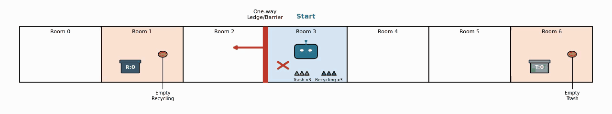
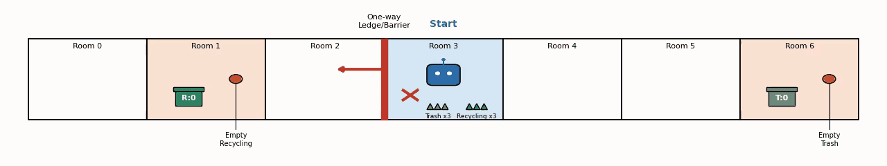
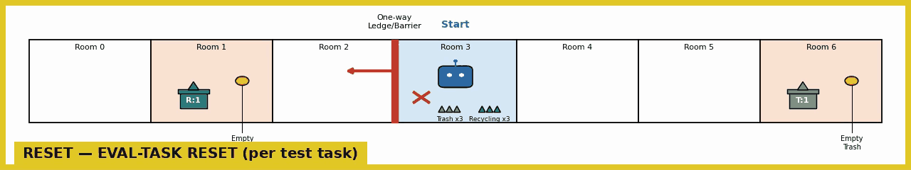

# Tossing Room after capacity-1: EES still learns, RECYCLING is the hard half, and EMPTY stopped being free

**Result.** Re-run against the capacity-1 domain (#74), EES goes from **76/300** evaluation
episodes solved before any practice to **281/300** after 2500 online transitions, against a
random-skills floor of **5/300**. Split by goal family the pooled number turns out to be
hiding two different stories: `TRASH` finishes at **138/140** and is essentially done by 1500
transitions, while `RECYCLING` finishes at **123/140** and is *still climbing steeply* at the
last checkpoint — 94/140 → 109/140 → 123/140 over the final 300 transitions. The run is
truncated for `RECYCLING`, not converged.

`EMPTY` is **20/20 at every one of the 26 evaluation sweeps**, pre-practice included. That is
not the same claim it would have been before #74. `EMPTY` used to be a four-action walk plus a
`Press`; it is now a ten-action **ordering** task, and the random-skills arm scores **0/20** on
it — where the same arm used to stumble into `EMPTY` occasionally, it now never does. So
`EMPTY` is deterministic *for a planner*, not trivial, and its flat line measures the symbolic
model rather than the sampler.


> **These numbers are not comparable to the pre-#74 log**, and nothing here is presented as a
> delta against it. See [the comparison section](#the-pre-74-numbers-are-context-not-a-baseline).

## Question / goal

Does EES still learn on Tossing Room now that #74 gave each bin capacity 1 and its own
emptying button — and if the pooled success rate moves, which goal family is moving it?

## Background

`docs/experiment-logs/2026-08-02-tossingroom-ees-bringup.md` established this domain's
release protocol and its headline result: 10 seeds, 25 cycles × 100 steps per interaction, 30
held-out test tasks at a fixed composition of **14 TRASH / 14 RECYCLING / 2 EMPTY**, with
`--sampler-max-train-iters 10000`. That log measured EES at 77/300 unpracticed and 292/300
trained, against a random-skills floor of 5/300.

#74 then changed the domain underneath all of it:

- **A bin holds one item.** `ItemInBin(item, bin)` classified as `count >= 1`, and it is also
  `Throw`'s add-effect, so a throw into an already-occupied bin scored as a success at *any*
  force. Capacity 1 plus a `BinEmpty(?bin)` precondition makes the count provably 0 at throw
  time, so `ItemInBin` flips false → true exactly once per throw.
- **Each bin gets its own button** — `trash_button` in room 6, `recycling_button` in room 1 —
  which let `Press`'s blanket `ignore_effects={ItemInBin}` go away.
- **`EMPTY` became an ordering task.** It now needs both buttons, and the recycling button
  sits in room 1, behind the one-way ledge (`blocked_right_from = 2`). The trash button must
  therefore be pressed **first**; pressing recycling early strands the robot on the far side
  with no `Throw` involved at all.
- **The evaluation horizon moved 7 → 12**, derived rather than chosen: `EMPTY`'s shortest
  solve became 10 actions (3 moves, `Press`, 5 moves, `Press`), and `max_episode_steps()` is
  `longest_shortest_solve() + 2`.

Every one of those changes moves a denominator, a dynamic, or the symbolic model, so the
previous arms could not simply be re-scored. They had to be re-run.

## Hypothesis

EES would still learn — the throw sampler's job (one scalar force against one per-task
target) is untouched by #74 — but the **pooled** curve would be a poor description of what
happened, because the three families now have structurally different difficulty: `TRASH` can
be retried within a practice period, `RECYCLING` cannot (the ledge severs its bin room from
the item pile), and `EMPTY` contains no `Throw` at all.

## Guidance given

- Reuse the bring-up log's protocol exactly — seeds, cycles, steps per interaction, test-task
  count — so the new numbers are comparable to the old *design*, and say where that deviates.
- Learning curves **per goal family and pooled**, with per-seed spread, not only the mean.
- **Counts as `x/y` everywhere.** "EMPTY 100%" is really 2/2 per seed and must read that way.
- Frame the pre-#74 numbers as **incomparable, not re-scorable**.
- Quote the binomial noise floor `sqrt(0.25/n_a + 0.25/n_b)` and the MDE the design can
  actually detect.
- **No horizon sweep** — the horizon is derived; sanity-check that the runs used it.
- Videos: one end-of-training evaluation clip per family, plus evaluation *and practice* clips
  at several checkpoints, each with a synopsis written from the frames rather than from
  expectation.

## Methods

Two arms, both through `scripts/run_sweep.py` at fixed seeds 0..9, on `066e8b8` plus the
`--record-full-loop` recorder:

```bash
python -m scripts.run_sweep --env tossingroom --methods ees --num-seeds 10 --max-workers 10 \
  --results-root results-cap1/ees10000 --shared-args "--num-test-tasks 30" \
  --method-args "ees=--num-cycles 25 --max-steps-per-interaction 100 \
                     --sampler-max-train-iters 10000"

python -m scripts.run_sweep --env tossingroom --methods random-skills --num-seeds 10 \
  --max-workers 10 --results-root results-cap1/random --shared-args "--num-test-tasks 30" \
  --method-args "random-skills=--num-cycles 25 --max-steps-per-interaction 100"
```

```bash
# The curves, the counts, and the noise floors -- reads run output only, never simulates.
python -m analysis.practice_makes_perfect.tossingroom_goal_family_curves \
  --results-root results-cap1/ees10000 --method ees --label "EES (10k sampler iters)" \
  --floor-root results-cap1/random \
  --output docs/experiment-logs/2026-08-05-tossingroom-cap1-family-curves.png \
  --dump-json docs/experiment-logs/2026-08-05-tossingroom-cap1-arms.json
```

Every count on this page re-derives from
[`2026-08-05-tossingroom-cap1-arms.json`](2026-08-05-tossingroom-cap1-arms.json), which is
`--dump-json`'s output: `[solved, total]` pairs per family, per checkpoint, per seed, for both
arms. No number here is a transcription of a terminal, and none is a percentage inverted back
into a count.

**Family comes from the record, not from a replication.** `Metrics.record_evaluation` writes
per-task `breakdowns` — task index, goal string, solved flag — validated against the same
`num_solved`/`num_total` it records as the primary triple. So the split reads the families off
the very objects that were scored. `tossingroom_comparison.py` predates that field and has to
rebuild a `TossingRoomTasks` to recover the composition; this does not.

### Deviations from the bring-up protocol, and why

1. **One EES arm (10000 sampler iterations), not the 1k/10k/100k grid.** This is a baseline
   re-run, not a re-run of the sampler-budget comparison. That grid's conclusion is already
   marked withdrawn-and-underpowered in the bring-up log, and re-running it here would answer
   a different question at three times the compute.
2. **A random-skills floor arm was added**, at the identical protocol. Not requested, and
   cheap (18.7 s of wall clock). It is here because the bring-up log's reasoning about `EMPTY`
   rested on it being a family "a random skill sequence occasionally stumbles into" — and
   under #74 that had to be re-checked rather than assumed. It flipped; see below.
3. **No horizon sweep**, as instructed. Sanity-checked instead: `longest_shortest_solve()`
   returns **10** and `max_episode_steps()` returns **12** on the default layout, and the
   recorded episodes confirm the runs used it — an unsuccessful evaluation episode renders
   exactly 13 frames, i.e. the initial state plus 12 actions.

Everything else is the bring-up protocol unchanged: seeds 0..9, 25 cycles, 100 steps per
interaction, 30 test tasks, the fixed 14/14/2 composition.

### Compute, measured rather than guessed

A single seed was timed end to end before anything was launched: **2 min 20 s** wall clock
(139.9 s) at **908 MB** peak RSS. That is what set the budget of one core per run and a
concurrency of 10 per arm.

| | wall clock | per-run range |
|---|---|---|
| single-seed calibration (alone) | 2 min 20 s | — |
| EES arm, 10 seeds at 10 workers | **2 min 29 s** | 129.1 s – 148.6 s |
| random-skills arm, 10 seeds at 10 workers | 18.7 s | 13.8 s – 18.7 s |

Both arms ran concurrently, so 20 runs were live at once and the **total sweep wall clock was
2 min 29 s**. The slowest run under 20-way concurrency took 148.6 s against the 139.9 s the
same work took alone — about 6% — so concurrency here costs essentially nothing, consistent
with what the bring-up log measured. 10/10 runs succeeded in each arm; no launch failures and
no retries were printed to stderr.

## Results

### The counts

10 seeds × 30 held-out test tasks = 300 evaluation episodes per checkpoint, per arm. Solved is
a count of episodes, summed across seeds — not a mean of per-seed rates.

| family | EES pre-practice | EES final | random skills final | noise floor | MDE |
|---|---|---|---|---|---|
| TRASH | 28/140 (20.0%) | **138/140** (98.6%) | 1/140 (0.7%) | 5.98p | 16.73p |
| RECYCLING | 28/140 (20.0%) | **123/140** (87.9%) | 4/140 (2.9%) | 5.98p | 16.73p |
| EMPTY | 20/20 (100.0%) | **20/20** (100.0%) | 0/20 (0.0%) | 15.81p | 44.27p |
| **pooled** | **76/300** (25.3%) | **281/300** (93.7%) | **5/300** (1.7%) | 4.08p | 11.43p |

The noise floor is `sqrt(0.25/n_a + 0.25/n_b)` in percentage points, at the worst-case
`p = 0.5`; the MDE is 2.8 of them, the standard-error multiple an 80%-power two-sided 5% test
needs. Both are the **unpaired** quantities, which is the conservative choice here: the
pre-practice and final sweeps score the *same* test tasks on the same seeds, so the real
paired floor is smaller than the number quoted. Where a comparison is genuinely between two
independent arms (EES against random skills) the unpaired floor is the right one.

What that arithmetic licenses, and what it does not:

- **EES beats the floor**, 281/300 against 5/300 — a 92.0-point gap against an 11.4-point MDE,
  eight times over. Established.
- **Practice moves the pooled number**, 76/300 → 281/300, +68.3 points. Established.
- **`TRASH` finishing above `RECYCLING`** — 138/140 against 123/140, +10.7 points — sits
  **below** the 16.7-point MDE for a per-family comparison. The endpoint gap is *not*
  established, and this design cannot establish it. The difference in the *curves* is a much
  stronger signal than the difference in the endpoints, and is discussed below.
- **`EMPTY` is unmoved by practice**, 20/20 → 20/20. This says almost nothing on its own: at
  20 episodes the MDE is **44.3 points**, so anything short of a catastrophic regression would
  be invisible. What 20 episodes *can* resolve is the gap to random skills, 20/20 against
  0/20 — 100 points, against a 44.3-point MDE. That one is established.

### Per-seed, because a mean over ten seeds hides one seed

| arm | per-seed final solved, in seed order | sd | worst |
|---|---|---|---|
| EES (10k) | 30/30, 28/30, 30/30, 29/30, 30/30, 30/30, **18/30**, 27/30, 30/30, 29/30 | 12.3p | 18/30 |
| random skills | 2/30, 0/30, 1/30, 1/30, 0/30, 0/30, 0/30, 1/30, 0/30, 0/30 | 2.4p | 0/30 |

Six of ten EES seeds finish at 30/30. The sd of 12.3 points is almost entirely **seed 6**,
and the family split says exactly where it went: seed 6 scores TRASH 13/14, EMPTY 2/2, and
**RECYCLING 3/14**. Its throw sampler works for one bin and not the other. Reporting the mean
alone would call this arm "93.7% with some variance"; it is better described as nine seeds
that mostly work and one whose recycling sampler never converged.

Six of ten random-skills seeds solve **nothing at all**, which is the shape of a genuine
floor rather than a weak method.

### `RECYCLING` is the hard half, and it has not finished learning

Pooled counts at every checkpoint are in the committed JSON; the shape is what matters:

| transitions | 0 | 300 | 500 | 1000 | 1500 | 2000 | 2200 | 2400 | 2500 |
|---|---|---|---|---|---|---|---|---|---|
| TRASH | 28/140 | 48/140 | 86/140 | 107/140 | 123/140 | 124/140 | 134/140 | 137/140 | **138/140** |
| RECYCLING | 28/140 | 19/140 | 30/140 | 57/140 | 80/140 | 88/140 | 94/140 | 109/140 | **123/140** |

Two things worth stating plainly:

1. **`RECYCLING` regresses below its own unpracticed score before it improves** — 28/140 at
   0 transitions, 20/140 at 100, 19/140 at 200 and 300. The pooled curve dips too (76 → 69 →
   67). That is the same early non-monotonicity the bring-up log recorded and declined to
   smooth away, and it is what an underconstrained sampler confidently picking a wrong region
   looks like. The videos below show it happening on one task.
2. **`RECYCLING` is still climbing at the last checkpoint** — 94/140 → 109/140 → 123/140 over
   the final 300 transitions, the steepest stretch of its whole curve. 25 cycles is where this
   protocol stops, not where this family converges. `TRASH`, by contrast, is flat from ~1500.

The mechanism the recording makes visible is structural, and it is the ledge. Room 6 (trash)
is on the same side of the one-way ledge as the item pile in room 3, so a practice period can
fetch a fresh item and throw again as many times as 100 steps allow. Room 1 (recycling) is on
the far side; once the robot crosses it, it cannot get back to the pile until the next
period reset. So a practice period affords **many** trash throws and at most **one** recycling
throw. That is a hypothesis the video supports rather than a measured count — the obvious next
measurement is to count `Throw` actions per family during practice, which nothing currently
records.

### `EMPTY` stopped being free, which is the clearest single effect of #74

| | EES | random skills |
|---|---|---|
| `EMPTY` pre-practice | 20/20 | 1/20 |
| `EMPTY` final | 20/20 | **0/20** |

Under the old domain `EMPTY` was a four-action walk plus one `Press`, and the bring-up log
reasoned about it as the free share of the test set that a random skill sequence occasionally
stumbles into. It is now ten actions in a forced order, and random skills stumbles into it
**zero times in 20 episodes**. EES gets 20/20 because its symbolic model knows the ordering,
not because the family is easy — which makes that flat green line a statement about the
planner and the `BinEmpty` precondition #74 added, and about nothing the sampler learned.

### The pre-#74 numbers are context, not a baseline

| | pre-#74 (bring-up log) | this re-run |
|---|---|---|
| horizon | 7 | **12** |
| `EMPTY` shortest solve | 4 actions | **10 actions, ordered** |
| bin capacity | unbounded | **1** |
| `Throw` preconditions | — | **`BinEmpty(?bin)`** |
| EES unpracticed | 77/300 | 76/300 |
| EES final | 292/300 | 281/300 |
| random skills final | 5/300 | 5/300 |

**These are incomparable, and the resemblance of the bottom three rows is a coincidence, not a
replication.** The dynamics, the task semantics, the horizon and the symbolic model all
changed; two numbers computed over different dynamics on a different-length episode are not
two measurements of one quantity. No difference is quoted here as a delta, no significance
test is run across the two, and the fact that 76/300 lands one episode away from 77/300 should
be read as arithmetic accident. What *can* be said is the qualitative statement: EES was not
broken by #74, and the domain did not become trivially easy or impossibly hard.

## Videos

Every clip below is the arm's own policy, not a fresh demo run. The two checkpoint-rendered
runs reproduce `results-cap1/ees10000/ees/<seed>/stats.json` **byte-for-byte** (identical
SHA-256), as does the full-loop recording, so rendering did not perturb the runs it recorded.

Seed rule: the lowest seed whose test task 0 belongs to that family — **RECYCLING → seed 0**,
**TRASH → seed 1**. It is deliberately not success-selected. No seed in 0..9 draws `EMPTY`
first, so `--num-render-checkpoints` cannot reach that family at all; the `EMPTY` clip is cut
out of the full-loop recording's final evaluation sweep instead (seed 1, test task 7),
episode boundaries located by the yellow eval-task reset border the recorder draws.

### End of training, one clip per goal family

**TRASH, 2500 transitions** (seed 1) — `Pickup(robot, trash, room_3, pile)`, then `MoveRoom`
3→4→5→6, then `Throw` at **0.54**, and the bin badge flips to `T:1`. Five actions, the
shortest solve this family admits, and the throw lands on the first attempt so there is no
second one. Nothing is wasted and the episode ends 7 steps inside the horizon of 12.



**RECYCLING, 2500 transitions** (seed 0) — `Pickup(robot, recycling, room_3, pile)`,
`MoveRoom` 3→2→1, `Throw` at **0.49**, badge `R:1`. Four actions, again the shortest solve.
Structurally identical to the trash clip minus one room of walking; the interesting difference
between the two families is not visible in a successful episode, only in the failures and in
how long each took to get here.



**EMPTY, 2500 transitions** (seed 1, test task 7) — the ordering task, solved in the correct
order. The robot walks 3→4→5→6, presses the **trash** button (`T:1` → `T:0`), then walks all
the way back 6→5→4→3→2→1 and presses the **recycling** button (`R:1` → `R:0`), and the frame
is captioned `SOLVED`. Exactly 10 actions, the shortest solve, with the trash bin emptied
first — which is the only order that works, because room 1 is behind the one-way ledge and
going there first would strand the robot before it ever reached room 6.



### Evaluation across checkpoints

Both files concatenate the same test task at 0 / 500 / 1000 / 1500 / 2000 / 2500 transitions,
each segment preceded by a title card naming its transition count.

**TRASH** ([`eval-progression-trash.mp4`](2026-08-05-tossingroom-cap1-eval-progression-trash.mp4))
— the approach is identical at every checkpoint; only the thrown force changes, and the whole
progression is legible in that one number: **0.75 → 0.99 → 0.60 → 0.59 → 0.56 → 0.54**. At 0
transitions the robot throws 0.75, misses, and the item is gone; it then walks the full 6→5→4→3
back to the pile, picks up a fresh item, walks 3→4→5→6 again — and the horizon of 12 runs out
one step before it can throw. At 500 it is **worse than untrained**, throwing 0.99, and repeats
the same doomed round trip. From 1000 on it lands the throw on the first attempt every time and
the episode collapses from 13 frames to 6. The final three checkpoints are the same successful
five-action solve with the force creeping 0.60 → 0.54.

**RECYCLING** ([`eval-progression-recycling.mp4`](2026-08-05-tossingroom-cap1-eval-progression-recycling.mp4))
— the same structure and a much worse middle. Forces: **0.73 → 0.02 → 0.02 → 0.00 → 0.01 →
0.49**. Only the last checkpoint succeeds. For four consecutive checkpoints spanning 500 to
2000 transitions the sampler is pinned at essentially **zero force** — a confident, stable,
completely wrong answer, not noise — and every one of those episodes ends the same way: the
throw misses, the item is released, and the robot stands in room 1 emitting **eight
consecutive `no-op (no plan)` frames** until the horizon expires. Fast Downward is right that
there is no plan: the ledge makes room 3 unreachable from room 2, so a missed recycling throw
is terminal at any horizon. Then at 2500 it throws 0.49 and solves in four actions. This one
seed's clip is the per-seed variance in the RECYCLING panel, seen from the inside.

### Practice across checkpoints — the phase nothing else renders

[`practice-progression.mp4`](2026-08-05-tossingroom-cap1-practice-progression.mp4) — the first
40 seconds of the practice period at cycles 1, 9, 17 and 25 of 25, cut from a single
`--record-full-loop` recording of seed 1 (16238 frames). The magenta border is the per-cycle
`PERIOD` reset; the status bar carries phase, cycle, step, transitions, the practised task and
the skill being executed.

- **Cycle 1** — the robot picks up trash, walks to room 6 and throws at **0.99**, which happens
  to land (`T:1`). It then presses the trash button (`T:1` → `T:0`), presses it again on the
  now-empty bin, walks 6→5 and back 5→6, and presses again. Most of the visible period is
  repeated `Press` on a bin that is already empty. The practised task shown in the bar is
  `ItemInBin(trash, trash_bin)`.
- **Cycle 9** — the bar's task is now `BinEmpty(recycling_bin) & BinEmpty(trash_bin)`; EES has
  chosen to practise the emptying skills rather than the throw. Behaviour is still largely
  walking and pressing rather than throwing.
- **Cycle 17** — task `ItemInBin(recycling, recycling_bin)`.
- **Cycle 25** — the period opens by executing the full ten-action `EMPTY` solve cleanly, in
  the correct order: three moves, press trash, five moves, press recycling. Then it strands
  itself. The rest of the period is the robot shuttling between rooms 0, 1 and 2 — all on the
  far side of the ledge — pressing an already-empty recycling button with both bins at `R:0
  T:0`, unable to return to room 3 for another item. It stays there until the next cycle's
  period reset.

That last observation is the one worth flagging beyond this experiment. **A large share of late
practice steps are spent on the wrong side of an irreversible transition**, doing nothing that
can generate a useful `Throw` sample — which is a concrete, watchable argument that the
per-cycle `PERIOD` reset (whose necessity `PracticeLoop`'s own docstring argues both sides of)
is doing real work here, and possibly not often enough.

**One thing that was looked for and not seen.** The `EMPTY` failure mode #74 introduces —
pressing recycling early and stranding the robot with no `Throw` involved — does not appear in
any clip here, because EES never makes that mistake: it is 20/20 on `EMPTY` at every
checkpoint, pre-practice included. The closest thing observed is the cycle-25 practice tail
above, which is the same irreversibility biting during exploration rather than during
evaluation. The random-skills arm scores 0/20 on `EMPTY` and presumably shows it, but no
random-skills run was rendered.

## Recommendation

1. **Run `RECYCLING` past 25 cycles before quoting a converged number for it.** 94/140 →
   109/140 → 123/140 across the final 300 transitions is not a plateau. The current endpoint is
   where the budget ran out. `TRASH` is genuinely converged and can stay at 25.
2. **Report this domain by family, not pooled.** The pooled 281/300 averages a solved family, a
   half-learned one and a planner-solved one, and the composition (14/14/2) weights them in a
   way that has already changed once. The per-family split costs nothing — `breakdowns` is
   already in every `stats.json`.
3. **Count `Throw` actions per family during practice.** The claim that the ledge rations
   recycling practice to roughly one throw per period is the best available explanation for the
   TRASH/RECYCLING gap, and it is currently inference from video. Nothing records it.
4. **Do not compare any of this to the pre-#74 log numerically.** They are recorded side by
   side above only so the change of regime is visible.
5. **The endpoint gap between TRASH and RECYCLING is below this design's MDE** (10.7 points
   against 16.7). If that specific comparison matters, it needs more seeds — not more cycles.
