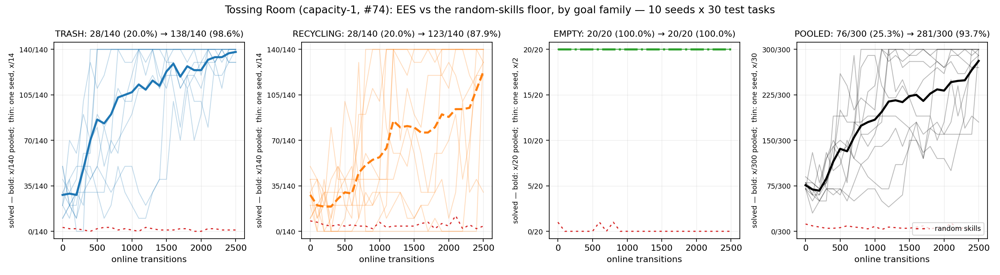

# Tossing Room once the sampler has to learn a function: EES still learns, RECYCLING is still the hard half, and one seed still fails it

> **Environment retired (2026-08-07).** The `--env tossingroom` domain this page was
> measured on has been deleted from the tree. It froze the item `weight` into the task's initial state, which
> `--practice-reset-policy never` then never re-drew -- so a reset-free arm
> practised at a single point of the task distribution. That is a defect, not a
> variant, and `tossingroomsplitpickupweight` (which draws the weight at pickup) is
> the corrected domain. Every number below stands
> exactly as it was published and none has been edited, restated or recomputed;
> what has changed is only that the domain can no longer be instantiated from
> HEAD. **Partially re-runnable.** The post-change cell (EES under the causal throw
> representation) ports to the canonical domain as a new measurement. The
> contrast this page draws against the earlier identity-representation
> numbers does **not**: that representation was removed with
> `tossingroomsplitidentity`, so the comparison cannot be reconstructed from
> HEAD.

**Result.** Re-run against the domain in which `Throw`'s required force is an unobserved
function of a bin's `throw_distance` and an item's `weight` rather than a `target_force`
feature the classifier could read, EES goes from **71/300** evaluation episodes solved
before any practice to **274/300** after 2500 online transitions, against a random-skills
floor of **3/300**. Split by goal family: `TRASH` finishes at **136/140**, `RECYCLING` at
**118/140** and is still climbing at the last checkpoint. `EMPTY` is **20/20 at every one
of the 26 evaluation sweeps**, as before — it contains no `Throw`, so the representation
change cannot touch it.

**The domain did not get easier or break.** The headline numbers land within a few
episodes of the ones the identity representation produced (281/300 pooled, 138/140 TRASH,
123/140 RECYCLING), which is the outcome worth reporting: **the sampler now has to learn a
relation between two observed causes and a dial, and 2500 transitions is still enough.**
What moved is *where* the difficulty sits, and it is visible per seed rather than in the
pooled mean.



> **These numbers are not comparable to anything measured before the throw-representation
> change**, and nothing here is presented as a delta against the previous run of this same
> protocol. `build_task` now draws four uniforms per task instead of two, so the evaluation
> set is a different set of tasks. See
> [the comparison section](#the-previous-numbers-are-context-not-a-baseline).

## Question / goal

Does EES still learn on Tossing Room now that the throw sampler has to learn a **function**
instead of an identity — and if the pooled success rate moves, which goal family moves it?

## Background

This log has been re-run twice, and the reason each time was that the domain changed
underneath it rather than that the measurement was wrong.

`docs/experiment-logs/2026-08-02-tossingroom-ees-bringup.md` established the release
protocol: 10 seeds, 25 cycles × 100 steps per interaction, 30 held-out test tasks at a
fixed composition of **14 TRASH / 14 RECYCLING / 2 EMPTY**, with
`--sampler-max-train-iters 10000`. #74 then gave each bin capacity 1 and its own emptying
button, which made `EMPTY` a ten-action ordering task and moved the evaluation horizon
7 → 12.

**The change this run measures is about the classifier's input row.** `EesMethod` builds
one row per (ground skill, state, params) as
`[1.0] + concat(state[obj] for obj in ground_skill.objects) + params`. For
`Throw(robot, item, bin, room)` that was 11 numbers, and **index 4 was
`item.target_force`** — while the dynamics landed a throw iff
`|force − item.target_force| < 0.1`. The 32×32 MLP was being asked to learn
`|x₁₀ − x₄| < 0.1`, a comparison between two of its own inputs, and measured over 80
applicable groundings only **2 of the 10** state-plus-force columns carried signal:
`target_force` and `force`. Five were affine copies of the `kind` bit the preconditions
force equal, and three were constants.

That is inherited from Light Switch, which predicators ran deliberately without feature
engineering. Ball-Ring is the domain in this repo that does it properly, and the
replacement is Tossing Room's version of that shape:

- a bin gets a per-task **`throw_distance`**, an item a per-task **`weight`**;
- the required force is `reference_force + 0.2·(distance − 2) + 0.4·(weight − 1)`, whose
  five constants live on the environment and never enter a `State`;
- `item.target_force` is deleted.

Signal-carrying columns go **2/10 → 3/11**, and no single column predicts the required
force to within the tolerance any more. Two things were deliberately **held fixed**: the
required force spans exactly `[0.1, 0.9]`, so a uniformly random force still lands with
probability **0.2** on every task, and the best fixed force a state-blind sampler could
choose still lands well under half of throws.

Because task sampling now draws four uniforms instead of two, **every task in this run is a
different task from the same seed's task in the previous run**. That is why this is a
re-run rather than a re-score.

## Hypothesis

EES would still learn — the two causes are observable and each is worth 0.4 of force
against a 0.1 tolerance, so the problem is well posed — but the **first cycles** would be
worse, because an offline probe of the same classifier put argmax success at 16 labelled
throws at 0.37 against the identity's 0.70. A single `Throw` sampler sees roughly 78
attempts per seed over 2500 transitions, which the same probe put at ~0.94 either way, so
the **endpoint** was expected to be close and the **early curve** lower.

## Guidance given

- Re-run the arms the representation change invalidates, reusing this log's own protocol;
  state any deviation.
- Fixed seeds through `scripts/run_sweep.py`, never randomly drawn. **Time one seed and
  report it before launching the full sweep.**
- Results must land outside the agent worktree, in the main checkout's `results/`.
- **Counts as `x/y` everywhere.** Per-seed spread in every figure, not only a mean.
- Quote the binomial noise floor `sqrt(0.25/n_a + 0.25/n_b)` and the MDE the design can
  detect; claim nothing below it.
- Check specifically whether **learning is still a switch** — the previous run's headline
  shape — since a real function might produce a genuine curve instead.
- **Rewrite the Results section rather than appending to it.**

## Methods

Two arms, both through `scripts/run_sweep.py` at fixed seeds 0..9, on the
throw-representation branch:

```bash
python -m scripts.run_sweep --env tossingroom --methods ees --num-seeds 10 --max-workers 10 \
  --results-root results/tossingroom-fn-ees --shared-args "--num-test-tasks 30" \
  --method-args "ees=--num-cycles 25 --max-steps-per-interaction 100 \
                     --sampler-max-train-iters 10000"

python -m scripts.run_sweep --env tossingroom --methods random-skills --num-seeds 10 \
  --max-workers 10 --results-root results/tossingroom-fn-random \
  --shared-args "--num-test-tasks 30" \
  --method-args "random-skills=--num-cycles 25 --max-steps-per-interaction 100"
```

```bash
# The curves, the counts and the noise floors -- reads run output only, never simulates.
python -m analysis.practice_makes_perfect.tossingroom_goal_family_curves \
  --results-root results/tossingroom-fn-ees --method ees --label "EES (10k sampler iters)" \
  --floor-root results/tossingroom-fn-random \
  --output docs/experiment-logs/2026-08-05-tossingroom-cap1-family-curves.png \
  --dump-json docs/experiment-logs/2026-08-05-tossingroom-cap1-arms.json
```

Every count on this page re-derives from
[`2026-08-05-tossingroom-cap1-arms.json`](2026-08-05-tossingroom-cap1-arms.json), which is
`--dump-json`'s output: `[solved, total]` pairs per family, per checkpoint, per seed, for
both arms. No number here is a transcription of a terminal, and none is a percentage
inverted back into a count. Family comes from `Metrics.breakdowns` — the per-task goal
string recorded by the very objects that were scored — not from a replication.

### Deviations from the protocol, and why

1. **One EES arm (10000 sampler iterations), not a 1k/10k/100k grid.** This is a baseline
   re-run, not a re-run of the sampler-budget comparison, whose conclusion is already
   marked withdrawn-and-underpowered in the bring-up log.
2. **No horizon sweep.** The horizon is derived (`longest_shortest_solve() + 2` = 12) and
   the representation change does not touch `EMPTY`'s ten-action shortest solve, so it is
   unchanged.
3. **The videos from the previous run of this log have been removed rather than
   re-recorded.** See [Videos](#videos-withdrawn-not-re-recorded).

Everything else is unchanged: seeds 0..9, 25 cycles, 100 steps per interaction, 30 test
tasks, the fixed 14/14/2 composition.

### Compute, measured rather than guessed

A single seed was timed end to end, alone, before anything was launched: **2 min 20 s**
(140.4 s) at **910 MB** peak RSS.

| | wall clock | per-run mean |
|---|---|---|
| single-seed calibration (alone, 1 worker) | **2 min 20 s** (140.4 s) | — |
| EES arm, 10 seeds at 10 workers | **2 min 26 s** (146.0 s) | 140.5 s |
| random-skills arm, 10 seeds at 10 workers | 18.9 s | 14.5 s |

Both arms ran concurrently, so 20 runs were live at once and the **total sweep wall clock
was 2 min 26 s**. The per-run mean under that load (140.5 s) is within a second of the
140.4 s the same work took alone, so concurrency costs essentially nothing here. 10/10 runs
succeeded in each arm; no launch failures and no retries were printed to stderr.

## Results

### The counts

10 seeds × 30 held-out test tasks = 300 evaluation episodes per checkpoint, per arm.
Solved is a count of episodes summed across seeds, not a mean of per-seed rates.

| family | EES pre-practice | EES final | random skills final | noise floor | MDE |
|---|---|---|---|---|---|
| TRASH | 18/140 (12.9%) | **136/140** (97.1%) | 0/140 (0.0%) | 5.98pp | 16.74pp |
| RECYCLING | 33/140 (23.6%) | **118/140** (84.3%) | 3/140 (2.1%) | 5.98pp | 16.74pp |
| EMPTY | 20/20 (100.0%) | **20/20** (100.0%) | 0/20 (0.0%) | 15.81pp | 44.27pp |
| **pooled** | **71/300** (23.7%) | **274/300** (91.3%) | **3/300** (1.0%) | 4.08pp | 11.44pp |

The noise floor is `sqrt(0.25/n_a + 0.25/n_b)` in percentage points at the worst-case
`p = 0.5`; the MDE is 2.80 of them, the standard-error multiple an 80%-power two-sided 5%
test needs. Both are the **unpaired** quantities, the conservative choice when comparing
pre-practice against final on the same tasks.

What that licenses, and what it does not:

- **EES beats the floor**, 274/300 against 3/300 — a 90.3-point gap against an 11.4-point
  MDE. Established, eight times over.
- **Practice moves the pooled number**, 71/300 → 274/300, +67.7 points. Established.
- **`TRASH` finishing above `RECYCLING`** — 136/140 against 118/140, **+12.86pp** — sits
  **below** the 16.74pp MDE. **The endpoint gap is not established on this domain**, and
  this design cannot establish it. (The *split* domain, which measures the same asymmetry
  with two separate samplers, does resolve it — see that log.)
- **`EMPTY` is unmoved**, 20/20 → 20/20. At 20 episodes the MDE is 44.3 points, so this
  says almost nothing on its own. What 20 episodes *can* resolve is the gap to random
  skills, 20/20 against 0/20 — 100 points against 44.3. Established.

### Per seed, because a mean over ten seeds hides one seed

| arm | per-seed final solved, in seed order | sd | worst |
|---|---|---|---|
| EES (10k) | 29/30, 27/30, 30/30, 30/30, 28/30, 26/30, 30/30, 29/30, **17/30**, 28/30 | 13.0pp | 17/30 |
| random skills | 0/30, 0/30, 1/30, 0/30, 0/30, 0/30, 0/30, 0/30, 0/30, 2/30 | 2.2pp | 0/30 |

Four of ten EES seeds finish at 30/30. The sd of 13.0 points is almost entirely **seed 8**,
and the family split says where it went: seed 8 scores TRASH 13/14, EMPTY 2/2 and
**RECYCLING 2/14**. Its throw sampler works for one bin and not the other.

**This is the same shape the identity representation produced, with a different seed
carrying it** — there, nine seeds mostly worked and seed 6 ended RECYCLING 3/14. The
failure mode is a property of the domain's practice budget, not of the representation.

Eight of ten random-skills seeds solve **nothing at all**, which is the shape of a genuine
floor rather than a weak method.

### Is learning still a switch? Mostly, and now with a real climb underneath it

Scoring every (seed, checkpoint) against 12/14 and 4/14 — the thresholds the split-throw
log uses:

| family | at an extreme (≥12/14 or ≤4/14) | anywhere in between | seed-checkpoints |
|---|---|---|---|
| TRASH | **193/260** | 67/260 | 260 |
| RECYCLING | **199/260** | 61/260 | 260 |
| both families pooled | **392/520** | 128/520 | 520 |

**A caveat on the comparison.** The split-throw log quotes "the Tossing Room baseline
reports 221/260" for this statistic, but that figure does not appear in any committed
version of this log and its denominator convention cannot be reconstructed — 260 is
10 seeds × 26 checkpoints, i.e. *one* family, and this domain has two. The numbers above
are re-measured from the committed JSON with the convention stated, and **the 221/260
cross-reference should be treated as unsourced rather than as a before-value.**

What can be said without a before-value is the shape itself: roughly three quarters of
seed-checkpoints sit at one end or the other, so the pooled curve is still substantially an
average over seeds that have flipped and seeds that have not. It is not a clean switch —
128/520 seed-checkpoints are genuinely in between — but describing `RECYCLING` as "climbing
steadily" would still be a statement about the mean rather than about any seed.

### `RECYCLING` is the hard half, and it has not finished learning

Pooled counts at every checkpoint are in the committed JSON; the shape is what matters:

| transitions | 0 | 300 | 600 | 900 | 1200 | 1500 | 1800 | 2100 | 2400 | 2500 |
|---|---|---|---|---|---|---|---|---|---|---|
| TRASH | 18/140 | 47/140 | 59/140 | 93/140 | 104/140 | 124/140 | 127/140 | 135/140 | 133/140 | **136/140** |
| RECYCLING | 33/140 | 22/140 | 23/140 | 53/140 | 55/140 | 90/140 | 113/140 | 99/140 | 118/140 | **118/140** |

Two things worth stating plainly:

1. **`RECYCLING` regresses below its own unpracticed score before it improves** — 33/140 at
   0 transitions, 16/140 at 200, 14/140 at 400. That early non-monotonicity is the same one
   every previous run of this domain recorded and declined to smooth away, and it is what
   an underconstrained sampler confidently picking a wrong region looks like. It is now
   **deeper and longer** than under the identity representation, which is the expected
   consequence of a harder low-sample regime.
2. **`RECYCLING` is still climbing at the last checkpoint**, and noisily — 99/140 → 118/140
   → 118/140 over the final 400 transitions, after 113/140 at 1800. 25 cycles is where this
   protocol stops, not where this family converges. `TRASH` is flat from ~1500.

The mechanism is structural and unchanged by this experiment: room 6 (trash) is on the same
side of the one-way ledge as the item pile in room 3, so a practice period can fetch a fresh
item and throw again as often as 100 steps allow; room 1 (recycling) is on the far side, so
once the robot crosses it cannot get back to the pile until the next period reset. The
split-throw log measures that budget directly — 893 trash attempts against 142 recycling
across the same protocol — and that is the right place to read it.

### `EMPTY` is the control, and it is untouched

| | EES | random skills |
|---|---|---|
| `EMPTY` pre-practice | 20/20 | 1/20 |
| `EMPTY` final | 20/20 | **0/20** |

`EMPTY` contains no `Throw`, so the representation change cannot reach it, and it did not:
20/20 at all 26 sweeps in both runs. Random skills stumbles into it **zero times in 20
episodes**, so EES's 20/20 is a statement about the symbolic model and the `BinEmpty`
precondition, not about anything the sampler learned. That it is unchanged is the check
that this experiment moved the thing it intended to move and nothing else.

### The previous numbers are context, not a baseline

| | identity representation | this re-run |
|---|---|---|
| force a throw needs | `item.target_force`, in the classifier's own input row | `f(bin.throw_distance, item.weight)`, on the environment |
| signal-carrying columns | 2/10 | **3/11** |
| random-force hit rate | ~0.19 (16/80 measured) | **0.20 on every task** |
| EES unpracticed | 76/300 | 71/300 |
| EES final | 281/300 | **274/300** |
| TRASH final | 138/140 | **136/140** |
| RECYCLING final | 123/140 | **118/140** |
| random skills final | 5/300 | **3/300** |
| worst seed | seed 6, 18/30 | seed 8, 17/30 |

**These are incomparable, and the closeness of the bottom rows is the finding rather than a
replication.** Task sampling draws four uniforms per task instead of two, so the 30
evaluation tasks differ from the same seed's 30 tasks in the previous run; two numbers
computed over different task sets are not two measurements of one quantity. No difference
above is quoted as a delta and no significance test is run across the two.

What *can* be said qualitatively is the thing the change was for: **the throw sampler now
has to learn a relation rather than copy a column, and at this budget it still does.** The
domain did not become trivially easy, and it did not become unlearnable.

## Videos, withdrawn, not re-recorded

The previous version of this page carried five clips — one end-of-training evaluation
episode per goal family, an evaluation progression across six checkpoints for `TRASH` and
`RECYCLING`, and a practice-period progression cut from a `--record-full-loop` recording.
Their analysis was written from the frames, and the thing read off those frames was **the
thrown force against the task's `target_force`** (e.g. "forces 0.73 → 0.02 → 0.02 → 0.00 →
0.01 → 0.49").

There is no `target_force` any more, and the tasks those clips recorded no longer exist, so
every number in that prose is unrecoverable rather than merely stale. The files have been
removed with the sections. Re-recording them against this run is a worthwhile follow-up —
the interesting frame-level question is now whether a *missed* throw's force sits near what
some *other* task required, which is what a sampler that has learned a constant rather than
a relation would look like — but it is a separate piece of work and is not fabricated here.

## Recommendation

1. **Run `RECYCLING` past 25 cycles before quoting a converged number for it.** It ends at
   118/140 having reached 113/140 at 1800 and 99/140 at 2100 — that is noise around a curve
   that is still rising, not a plateau. `TRASH` is genuinely converged at 25.
2. **Report this domain by family, never pooled.** The pooled 274/300 averages a solved
   family, a half-learned one and a planner-solved one, weighted 14/14/2.
3. **Do not use this design to compare TRASH against RECYCLING.** +12.86pp against a
   16.74pp MDE is a null result, and it was a null result under the identity representation
   too. The split domain resolves the same asymmetry because it measures per *attempt*, not
   per test task.
4. **Do not compare any number here to any number measured before the representation
   change.** They are recorded side by side above only so the change of regime is visible.
5. **The relation's five constants are now CLI flags.** If 25 cycles turns out to be the
   wrong budget for `RECYCLING`, `--distance-coefficient`/`--weight-coefficient` move the
   difficulty directly, which is a cheaper knob than more cycles.
