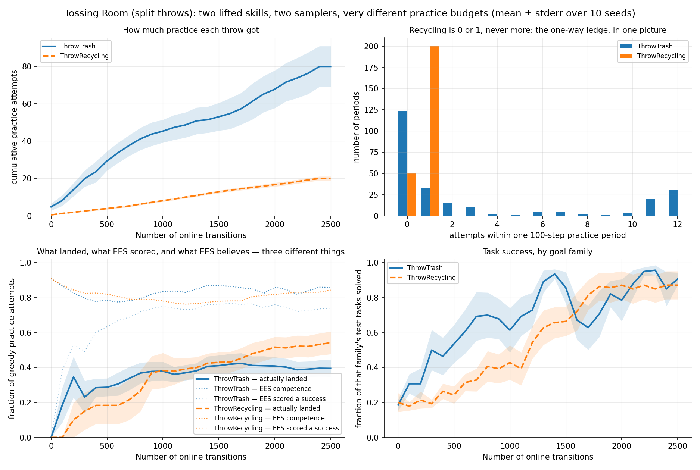

# Two throws, two samplers: recycling learns 4x slower on the clock, and is the better sampler

> ## ⚠ EVERY NUMBER BELOW WAS MEASURED BEFORE THE CAPACITY-1 REDESIGN, AND IS PENDING A RE-RUN
>
> This run was collected against the pre-redesign `tossingroomsplit` domain. The domain
> has since been brought into line with Tossing Room's capacity-1 bins
> ([#74](https://github.com/joshnroy/human-in-the-loop-practice-makes-perfect/pull/74)),
> which changed the **dynamics**, not merely the scoring:
>
> * a bin holds **at most one item**, and a throw at a full one is **refused** — the item
>   stays in hand and nothing happens;
> * each bin has **its own emptying button** beside it, and a press empties only that bin;
> * both throws carry their bin's empty atom as a **precondition and a delete effect**, so
>   a throw at a full bin is not even applicable;
> * `EMPTY` prefills **exactly one item per bin** (replacing the 1–3 sample) and became an
>   **ordering** task — the recycling button is behind the one-way ledge, so it must be
>   pressed last;
> * the evaluation horizon went **7 → 12**, because `EMPTY`'s shortest solve is now 10.
>
> Because those are dynamics changes, the results here are **not re-scorable — they are
> incomparable**, and that includes the figures this log argues are *structural*: the
> **799:200 = 4.0:1** attempt ratio, "recycling is never attempted twice in a period",
> the **91.5%** `MoveRoom` share, and the per-period attempt distributions. All of them
> count executions of operators whose applicability the redesign changed. #74's own
> measurement is that trash gets **12 attempts per 100-step period** under capacity 1,
> which is not the number this log's ratio was computed from.
>
> The one thing that can be said without a re-run is that the **defect this log
> diagnoses is closed**: on the current domain a throw is never issued at a non-empty
> bin, so the `prefilled` and `scored-but-missed` columns are 0 for both skills by
> construction. Nothing else here has been re-measured. **Do not quote any figure below
> as current.**

**The prediction is registered in full below, before any result.** In short: on
`environments/tossingroomsplit`, where `Throw` is split into `ThrowTrash` and
`ThrowRecycling` with a separate `LearnedSkillSampler` each, recycling should learn far
more slowly than trash, at roughly the ratio of practice attempts the layout affords each
— and, with the shared-sampler transfer channel now removed, possibly not at all within a
practice budget.

**Three results, and only the first is the one that was predicted.**

1. **The rate prediction held, and held precisely.** Recycling reaches each early success
   level at **4.0x** the transitions trash needs, against a measured attempt ratio of
   **799:200 = 4.0:1**. The predicted *value* of that ratio (~12:1) was wrong; the
   predicted *relationship* was right to two significant figures at both thresholds.
2. **The "not at all" prediction is refuted, and the endpoint is a null result.**
   Recycling ends at **122/140** against trash's **127/140** — a **+3.57pp** gap against
   a **16.74pp** minimum detectable effect, paired Wilcoxon **p = 0.8125**. Anyone reading
   only final success rates would conclude the split changes nothing.
3. **The unpredicted result, and the one worth keeping: per practice attempt,
   `ThrowRecycling` is the BETTER sampler.** Greedy attempts that actually landed in the
   bin: **51/94 (54.3%) for recycling against 152/433 (35.1%) for trash** — a
   **−19.15pp** gap against a 15.94pp MDE, i.e. detectable and in the opposite direction
   to everything above. Recycling is slower only because it gets four times fewer
   attempts; each attempt teaches it more.

**And there is a reason for (3) that is a defect, not a curiosity.** `ThrowTrash`'s
training labels are largely fabricated: **414/799** of its attempts were thrown into a bin
that was *already* non-empty, and every one of those is scored a success whatever force it
used — so **313 of its 532 "successes" (58.8%) are throws that missed**. `ThrowRecycling`
suffers none of this: **0/200** prefilled, **0 of 65** spurious. The trash sampler is
being trained on ~59% false-positive labels, and the recycling sampler on none.



## Pre-registration

Written before the sweep was launched, and reproduced here unedited.

> **Prediction.** `ThrowTrash` and `ThrowRecycling` are two lifted skills with two
> independent samplers of identical architecture (verified in PR #70). The Tossing Room
> layout affords them wildly different practice budgets:
>
> * **Trash** is a round trip — `PickupTrash` in room 3, three `MoveRoom`s right to room
>   6, `ThrowTrash`, three `MoveRoom`s back for a fresh item. Eight steps per attempt, so
>   a 100-step practice period should buy roughly **12 attempts**.
> * **Recycling** is one-way — `PickupRecycling` in room 3, one `MoveRoom` LEFT across
>   the ledge into room 2, one more into room 1, `ThrowRecycling`. The ledge makes the
>   return to room 3 impossible and the pile is the only source of items, so once that
>   throw is spent there is no second attempt at any horizon: **exactly 1 attempt per
>   practice period, ever**.
>
> Expected attempt ratio therefore **≈ 1:12**. **Recycling should learn far more slowly
> than trash, at roughly that ratio** — and, since splitting the skills removes the
> shared sampler that previously let trash experience transfer to recycling, **possibly
> not at all within a practice budget.**
>
> **This is to be measured, not asserted.** The 1:12 figure is arithmetic on the layout,
> not an observation, and EES chooses what to practise for itself.

## Design, and what it can detect

| | |
|---|---|
| domain | `tossingroomsplit` (PR #70) — Tossing Room's world verbatim, `Throw` split in two |
| method | `ees`, vanilla. **One experiment, no arms** — the comparison is between two skills within the same runs |
| seeds | 10, fixed at 0–9 (`scripts/run_sweep.py`, never randomly drawn) |
| protocol | `--num-cycles 25 --max-steps-per-interaction 100` → exactly **2500 online transitions** in every seed |
| evaluation | `--num-test-tasks 30`, fixed composition **14 TRASH / 14 RECYCLING / 2 EMPTY** per seed, drawn once and reused for the whole run |
| horizon | `longest_shortest_solve() + 2` = 7 |

**Seed count and the noise floor.** The two throw families are compared at 14 tasks per
seed, so 10 seeds give n = 140 per family. The binomial noise floor
`sqrt(0.25/n_a + 0.25/n_b)` is then **5.98pp**, and the effect this design has 80% power
to detect two-sided at α = 0.05 is `2.80 × 5.98 =` **16.74pp**. That is coarse: one task is
7.1pp on a throw family, so the design can only resolve differences of about two and a half
tasks per seed. **This is why the endpoint null below is "cannot tell them apart" and not
"they are the same".**

At the **practice-attempt** level the denominators are what the experiment produced rather
than what it chose — 433 greedy trash attempts against 94 greedy recycling ones — giving a
floor of 5.69pp and an MDE of **15.94pp**. The asymmetry does not help: the floor is driven
by the *smaller* arm, so piling on more trash attempts cannot buy resolution the recycling
side does not have.

**Every rate below is a count.** Differences of two rates (gaps, floors, MDEs) stay in
percentage points, which is their correct unit.

## Methods

Two commands, and they are **the same ten runs measured twice**, not two experiments.

```bash
# 1. The sweep. Writes results/<root>/ees/<seed>/{stats.json,timing.json,config_snapshot.json}.
python -m scripts.run_sweep \
  --env tossingroomsplit --methods ees --num-seeds 10 \
  --results-root results/tossingroomsplit-throws \
  --shared-args "--num-test-tasks 30" \
  --method-args "ees=--num-cycles 25 --max-steps-per-interaction 100" \
  --max-workers 10

# 2. The per-skill traces, one process per seed (they are serial within a process).
python -m scripts.tossingroomsplit_skill_traces \
  --label ees --seeds <k> --num-cycles 25 \
  --max-steps-per-interaction 100 --num-test-tasks 30 \
  --output results/tossingroomsplit-traces/shard-<k>.json

# 3. The analysis. Post-run only; it never drives a simulation.
python -m analysis.practice_makes_perfect.tossingroomsplit_throw_rates \
  --traces results/tossingroomsplit-traces/shard-{0..9}.json \
  --results-root results/tossingroomsplit-throws \
  --output docs/experiment-logs/2026-08-05-tossingroomsplit-throw-rates.png
```

**Why step 2 exists at all.** `stats.json` is the serialized `core.Metrics`: tasks solved,
per sweep, with a per-task goal breakdown. That is the right record of outcomes, and it is
what the sweep produces. But the question here is about the two *skills* — how often each
was practised, how often each succeeded, and whether it actually landed — and none of that
leaves `EesMethod`'s internals. So the collector subclasses the real method to read it out,
exactly as `scripts/tossingroom_throw_traces.py` already does for the throw force, and for
the reason that file gives: there is no CLI surface for a method's internal decisions, and
adding one purely for a diagnostic would put trace plumbing in the shipped `Method`.

**Why that is legitimate, and how it is checked.** A run is fully determined by its
`--seed`; the tracing subclass overrides only recording hooks, consumes no randomness and
changes no control flow. So the traced seed-*k* run reproduces the swept seed-*k* run step
for step. This is not left as an argument:

* `tests/scripts/test_tossingroomsplit_skill_traces.py::test_tracing_does_not_perturb_the_run`
  runs a traced and an untraced run at the same seed and requires the per-sweep
  `(transitions, solved, total)` triples to be **equal**.
* The analysis re-checks it against the real data before reporting anything.
  `check_against_sweep` compares every traced seed against that seed's actual `stats.json`
  and **refuses to print** on any disagreement — and treats a traced seed *missing* from
  the sweep as a disagreement rather than a skip, because a gate that quietly checks zero
  seeds passes.

It reported: `consistency gate: all 10 traced seeds reproduce their swept stats.json
exactly`.

**One further integrity check, which reconciles exactly.** 250 practice periods × 100
steps = 25,000 transitions. EES leaves the last skill of each period unobserved by
construction (its deviation 2), so 250 outcomes are unobservable. Observed practice
attempts across all skills total **24,750** — 25,000 − 250, to the unit.

## Results

### 1. The attempt budget: the structural claim is exactly right, the arithmetic is not

| skill | attempts per period | periods |
|---|---|---|
| `ThrowRecycling` | **0 or 1, and never more** | 200 at 1, 50 at 0 |
| `ThrowTrash` | 0 through **12** | 124 at 0, 33 at 1, … 20 at 11, 30 at 12 |

The recycling half of the prediction is **confirmed exactly**: across 250 practice periods
there is **not one** period with two recycling attempts. The one-way ledge does what the
layout said it would. And the trash ceiling is exactly 12, as predicted — 12 is the largest
value observed, and 50 of the 250 periods sit at 11 or 12.

**But the ratio is 799:200 = 4.0:1, not 12:1**, and the reason is the part the arithmetic
did not model: **EES does not choose to practise trash in most periods.** 124 of 250
periods contain zero trash attempts. Where the prediction implicitly assumed the robot
spends every period doing trash round trips, the actual distribution of practice is:

| skill | observed practice attempts |
|---|---|
| `MoveRoom` | 22,648 |
| `PickupTrash` | 846 |
| `ThrowTrash` | **799** |
| `PickupRecycling` | 202 |
| `ThrowRecycling` | **200** |
| `Press` | 55 |

**91.5% of every practice action is walking.** That is the layout doing to the *agent*
what it was designed to do to the *skill*, and it is the single biggest reason the ratio
came out at a third of the predicted value.

Per seed the ratio ranges from **2.1** (seed 7: 51 vs 24) to **12.0** (seed 1: 156 vs 13),
so the pooled 4.0 is a genuine central value rather than one run's accident — but the
spread is wide, and a single-seed reading of this domain would have been badly misleading
in either direction.

### 2. The learning-rate result: 4.0x slower, matching the attempt ratio

Transitions at which each family first reaches a given share of its own 140 test tasks:

| level | TRASH | RECYCLING | ratio |
|---|---|---|---|
| 25% | 100 | 400 | **4.0x** |
| 50% | 300 | 1200 | **4.0x** |
| 75% | 1300 | 1700 | 1.3x |
| 90% | 1400 | **never** | — |

**This is the predicted finding, and it held.** The slowdown factor is 4.0 at both early
thresholds, against a measured attempt ratio of 4.0. What was wrong was the predicted value
of the ratio itself, not the relationship.

The convergence at 75% is the other half of the story: the gap closes late, so the further
along the curve you measure, the smaller the effect looks.

### 3. A scored success is not a landing, and the difference is wildly asymmetric

This section exists because the obvious per-attempt comparison is wrong, and wrong in a way
that would have flattered exactly the conclusion being tested.

A throw's `add_effects` are `{<Kind>InBin(item, bin), HandEmpty(robot)}`. `<Kind>InBin` is
`count >= 1`, and `HandEmpty` always holds after a throw because a throw always releases the
item. **So a throw made into an already-non-empty bin is scored a success at any force at
all.** The trash bin reaches that state constantly (the robot walks back for another item,
and an `EMPTY`-family train task starts with 1–3 items already in each bin); the recycling
bin, behind the one-way ledge with one throw per period, never does.

| skill | landed / attempts | EES scored / attempts | thrown into a prefilled bin | scored successes that missed |
|---|---|---|---|---|
| `ThrowTrash` | **219/799** | 532/799 | **414/799** | **313/532** |
| `ThrowRecycling` | **65/200** | 65/200 | **0/200** | **0/65** |

**58.8% of `ThrowTrash`'s recorded successes are throws that did not land.**
`ThrowRecycling`'s record is exact. This is inherited from Tossing Room's effect structure
rather than introduced by the split — but its *asymmetry* is created by precisely the layout
asymmetry this experiment is about, so it cannot be waved away as a shared constant.

It is not a footnote to a per-attempt claim; it **reverses** it:

| per greedy (learned-sampler) attempt | `ThrowTrash` | `ThrowRecycling` | gap | MDE |
|---|---|---|---|---|
| EES *scored* a success | 317/433 (73.2%) | 51/94 (54.3%) | **+18.95pp** | 15.94pp |
| actually **landed** | **152/433 (35.1%)** | **51/94 (54.3%)** | **−19.15pp** | 15.94pp |

**On the honest metric, recycling's sampler is the better one, by a detectable margin, on
a quarter of the data.**

The epsilon-random draws are the control that makes this readable: `ThrowTrash` lands
**67/366 (18.3%)** and `ThrowRecycling` **14/106 (13.2%)** on randomly chosen forces, both
close to the ~19% first-principles base rate for a `U(0, 1)` force against a `U(0.5, 1.0)`
target at tolerance 0.1. **The two throws are comparably hard.** The difference is entirely
in what each sampler learned — and the trash sampler is the one being trained on ~59%
false-positive labels.

### 4. The endpoint: a null result, and the wrong place to look

| | final sweep |
|---|---|
| TRASH | **127/140** |
| RECYCLING | **122/140** |
| gap | +3.57pp |
| binomial noise floor | 5.98pp |
| minimum detectable effect (80%) | 16.74pp |
| paired Wilcoxon over seeds | n = 6 after ties, W = 12.0, **p = 0.8125** |

**Reported loudly because it is the result most likely to be misread.** At 2500 transitions
the two families are indistinguishable, and a +3.57pp gap sits far inside a 16.74pp MDE —
this is "not enough data to tell them apart at the endpoint", not "they are the same". Four
of ten seeds tie exactly, dropping the effective n to 6 and the attainable p floor to 0.031.

Across the *whole* curve the picture is different but still not significant at this n:
mean area under the per-family curve is **68.68** for TRASH against **55.74** for
RECYCLING, a **+12.94pp** difference, paired Wilcoxon n = 10, **p = 0.1934**. Resolving that
would need substantially more than 10 seeds.

`EMPTY` is **20/20** in the final sweep of every seed, sd exactly 0 — the deterministic
control behaving as it should.

### 5. Competence is not a usable learning curve here, and it is actively misleading

The bottom-left panel plots three things per skill: what actually landed, what EES scored,
and what EES's competence model believes. All three disagree.

* **Both competence lines sit far above everything else for the whole run.** At the end,
  competence says 0.859 (trash) and 0.844 (recycling); the measured greedy *landing* rates
  are 0.35 and 0.54. `OptimisticSkillCompetenceModel` is a windowed estimate under a
  Beta(10, 1) prior whose mean is 0.909, and a skill with few observations barely moves off
  it.
* **Worse, the ranking inverts — twice over.** From transition 100 through 700, competence
  rates `ThrowRecycling` *above* `ThrowTrash` (0.871/0.844/0.825/0.827/0.820/0.807/0.792
  against 0.867/0.827/0.797/0.779/0.784/0.775/0.783). By the endpoint it has flipped to
  rating trash above recycling (0.859 vs 0.844) — at which point recycling is in fact
  landing 54.3% of its greedy throws against trash's 35.1%. **The estimate ends up ranking
  the two skills backwards.**

**This is not cosmetic.** Competence is what `skill_costs()` turns into `-log(competence)`
plan edge costs, and what `score_ground_skill` extrapolates when choosing what to practise.
Here it is corrupted from both ends: the prior dominates the skill with few observations,
and the add-effect check feeds it fabricated successes for the skill with many.

## Verdict on the prediction

| claim | verdict |
|---|---|
| recycling gets **exactly 1 attempt per practice period, ever** | **held exactly** — 0 or 1 in all 250 periods, never 2 |
| trash gets **~12 attempts** in a 100-step period | **held, conditionally** — 12 is the observed ceiling, reached in 30 periods, but 124 of 250 periods have zero |
| attempt ratio **≈ 1:12** | **refuted** — measured **4.0:1** (799:200); EES spends 91.5% of practice actions walking |
| recycling learns **far slower, at roughly the attempt ratio** | **held, and precisely** — 4.0x slower to both the 25% and 50% levels, against a 4.0:1 attempt ratio |
| **possibly not at all** within a practice budget | **refuted** — recycling reaches 122/140, statistically indistinguishable from trash's 127/140 |
| *(unpredicted)* the two samplers are comparably good per attempt | **refuted, in recycling's favour** — 51/94 vs 152/433 landings, −19.15pp against a 15.94pp MDE |

## Recommendation

1. **Fix the `ItemInBin` success inflation, in Tossing Room as well as here.** This is the
   most actionable finding. A throw into an already-non-empty bin is currently scored a
   success at any force, corrupting both the sampler's training labels and the competence
   estimate, and doing so *asymmetrically* between the two families. 313/532 of one skill's
   successes are fabricated and 0/65 of the other's. Every per-attempt number this project
   has published on Tossing Room's `Throw` is affected. A goal-relative fix (score against
   the bin count *increasing*, not against `count >= 1`) is the obvious direction, and needs
   its own PR and its own evidence.
2. **Do not read this domain at its endpoint.** The pre-specified endpoint comparison is a
   null result and would be reported as "the split changes nothing". Every real effect is in
   the shape of the curve. Any future experiment here should pre-specify a curve statistic
   (transitions-to-threshold, or area under the curve) rather than a final success rate.
3. **The competence-model finding deserves its own investigation.** It is not specific to
   this domain — it is `OptimisticSkillCompetenceModel` under a Beta(10, 1) prior meeting a
   skill with few observations, and it plausibly affects Ball-Ring and Tossing Room wherever
   one skill is much rarer than another. Here it ends up ranking the two skills backwards.
4. **10 seeds is not enough for the AUC comparison** (p = 0.1934 on a +12.94pp difference).
   The transitions-to-threshold result does not need more seeds — it is a structural 4.0x —
   but any claim about the size of the endpoint or AUC gap does.
5. **Nothing here argues for or against the split as a design.** The split is what made the
   question askable; it is not itself under test, and no shared-sampler arm was run. In
   particular, result (3) should not be read as "separate samplers are better" — it is a
   statement about two skills within one run, not a comparison of two architectures.

## Raw data

* [`2026-08-05-tossingroomsplit-throw-rates.json`](./2026-08-05-tossingroomsplit-throw-rates.json)
  — all ten seeds' per-period skill tallies (attempts, successes, landings, prefilled-bin
  attempts, and the epsilon-random split of each), per-cycle competence, and per-sweep
  evaluation records with their goal-family breakdowns. **Every count in this file
  re-derives from it**, and none is reconstructed by multiplying a percentage by *n*.
* [`2026-08-05-tossingroomsplit-throw-rates.png`](./2026-08-05-tossingroomsplit-throw-rates.png)
  — the figure above.
