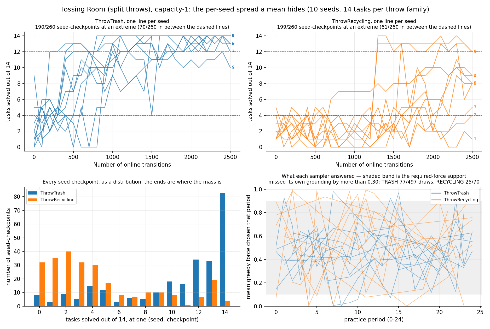

# Two throws, two samplers: once the greedy pool is honest, recycling's learned sampler cannot be told apart from its own coin flip — 11/56 against 11/57

> **Environment retired (2026-08-07).** The `--env tossingroomsplit` domain this page was
> measured on has been deleted from the tree. It froze the item `weight` into the task's initial state, which
> `--practice-reset-policy never` then never re-drew -- so a reset-free arm
> practised at a single point of the task distribution. That is a defect, not a
> variant, and `tossingroomsplitpickupweight` (which draws the weight at pickup) is
> the corrected domain. Every number below stands
> exactly as it was published and none has been edited, restated or recomputed;
> what has changed is only that the domain can no longer be instantiated from
> HEAD. **Re-runnable as a new measurement, not as a reproduction.** The canonical
> domain carries the same split `ThrowTrash`/`ThrowRecycling` skills, so the
> per-skill informed-versus-uniform question is intact. Two caveats: the
> numbers will differ, and the analysis module that produced this page was
> retired with the domain, so it would need reviving first.

**TL;DR.** Re-run of the split-throw experiment against a fixed `LearnedSkillSampler.sample`.
The previous version of this page flagged results (4) and (6) **provisional**, because
`sample` returned `candidates[0]` on a degenerate score vector while reporting a
deliberate greedy choice — so the "learned-sampler" pool mixed trained draws with
arbitrary ones. That is fixed, and the pool is now split explicitly. Vanilla EES, 10
fixed seeds, 2500 online transitions each, 14 TRASH / 14 RECYCLING / 2 EMPTY per seed.

1. **The structural claim survives, unchanged in kind.** Across 250 practice periods
   `ThrowRecycling` was attempted **0 or 1 times and never twice** — 160 periods at 1, 90
   at 0. `ThrowTrash`'s ceiling is again exactly **12**, reached in 35 of 250 periods. The
   attempt ratio is **727:160 = 4.54:1**, against 6.29:1 before.
2. **The endpoint gap is still established.** TRASH finishes **139/140** and RECYCLING
   **70/140** — a **+49.29pp** gap against a **16.74pp** MDE, paired Wilcoxon over seeds
   **n = 9, p = 0.0078** (one seed now ties at 14/14 against 14/14).
3. **The correction, and the reason this re-run exists.** Splitting the greedy pool by
   whether the classifier could actually discriminate: **56/103** of recycling's greedy
   draws were informed, and those land **11/56**. Its own epsilon-random draws land
   **11/57**. A gap of **+0.34pp, Fisher exact p = 1.0000** — a **null result**: at these
   denominators the design can only exclude an effect larger than **26.36pp** (corrected
   from 20.19pp; see the correction note under "What this design can detect"), so what is
   established is that recycling's trained classifier *cannot be distinguished from a coin
   flip*, not that it is worth exactly nothing. `ThrowTrash`'s, on the same architecture
   and the same seeds, lands **208/301** against its own random **61/310** (**+49.43pp,
   p < 0.0001**) — so the contrast between the two skills is real whatever the residual
   uncertainty on recycling.
4. **The previous number hid exactly this.** The pooled greedy rate reported before,
   22/103 here, sits *above* the informed rate of 11/56, because the uniform fallback it
   pooled in lands at the same base rate and inflated the denominator without inflating
   the claim. **A "learned-sampler" statistic that includes draws the classifier did not
   inform is not a statement about learning.**





## Question / goal

`ThrowTrash` and `ThrowRecycling` are two lifted skills with two independent samplers of
identical architecture, given wildly different practice budgets by the layout. **Do they
learn at correspondingly different rates, and what does the difference actually consist
of?** — re-asked now that the greedy/random split can be trusted.

## Background

### What changed under this re-run, and what is comparable to what

The previous version of this page carried a run collected against `main` at `14afeb3`,
before `LearnedSkillSampler.sample` was fixed. Its own Recommendation 2 said: *"Fix
`LearnedSkillSampler.sample` before quoting any greedy-vs-random split from this domain
again. Results (4) and (6) are flagged provisional for that reason."* This is that
re-derivation.

Three defects were diagnosed in `sample`. Two are fixed here:

1. **The uniform-random fallback was guarded on `is_fitted`**, which returns `True` for
   `MlpBinaryClassifier`'s single-class shortcut — the branch that sets
   `_single_class_prediction` and returns *without building a net*. So on all-negative
   data `score_inputs` returned N identical values, `np.argmax` took index 0, and `sample`
   returned `candidates[0]` while reporting `was_random = False`. Measured at unit level:
   `candidates[0]` in **200/200** draws. The guard now tests whether the *scores*
   discriminate.
2. **`np.argmax` broke ties at the lowest index**, i.e. by the caller's draw order, also
   reported as a deliberate choice. **91/275** of one-positive probes were such ties.
   Ties now break uniformly.

The third — the classifier interpolating ≤ 16 rows and emitting a saturated 0/1 box whose
*orientation* one positive cannot pin down (median slope **−0.48** against a truth of
**+1.00**, negative in 29/49 one-positive refits) — is **deliberately not fixed**. No
hyperparameter in the family repairs it. Result (4) below is the cleanest measurement of
its cost yet taken.

**These two runs are directly comparable, and that is checked rather than assumed.** The
sampler fix changes what the robot does, not what it is asked to do, so the seeds, tasks
and protocol are identical — verified by the pre-practice sweep (transitions 0, before any
practice happens) being **identical in 10/10 seeds**, along with the horizon. Unlike the
throw-representation change before it, this re-run's numbers *can* be set beside the
previous ones.

| claim, previous run (unfixed sampler) | what it said | what this re-run measures |
|---|---|---|
| attempt ratio | 893:142 = **6.29:1** | **727:160 = 4.54:1** — survives in kind, moves away from the predicted 12:1 |
| recycling never attempted twice in a period | 142 at 1, 108 at 0 | **160 at 1, 90 at 0** — survives exactly |
| trash's per-period ceiling | **12**, in 45 of 250 periods | **12**, in 35 of 250 periods |
| `MoveRoom` share of practice | 18,913/24,750 | **19,098/24,750** |
| endpoint | TRASH 131/140, RECYCLING 76/140 | **TRASH 139/140, RECYCLING 70/140** |
| endpoint gap | +39.29pp, n = 10, p = 0.0039 | **+49.29pp, n = 9, p = 0.0078** — still established |
| AUC difference | +42.31pp, p = 0.0020 | **+54.51pp, p = 0.0020** — survives |
| per greedy attempt | trash 288/497 vs recycling 22/70 | **trash 232/417 vs recycling 22/103** — and now split further, see (4) |
| learning is a **switch** | 190/260 and 199/260 at an extreme | **212/260 and 199/260** |
| competence | 0.907 trash, 0.742 recycling | **0.894 trash, 0.700 recycling** |

**Total tasks solved across all seeds barely moved — 227/300 → 229/300 — while individual
seeds moved a great deal** (seed 3: 20/30 → 30/30; seed 0: 23/30 → 16/30). That is what
the fix's own analysis predicts. The tie-break is *distribution-preserving*: candidates
are iid and therefore exchangeable, so "the first candidate attaining the maximum" and "a
uniform draw among those attaining it" have the same law. It reshuffles which seed gets
which outcome without moving the aggregate. The fallback branch is **not**
distribution-preserving — it widens the draw from the plateau to the whole candidate set —
but on this domain that change is small in aggregate.

### One statistic that was measured but never committed, and where it belongs

The diagnosis that motivated this fix recorded a number that has lived nowhere since, and
a later reader could not source it. **On the superseded capacity-1 identity-representation
domain (at `58ecd96`), only 9/54 of the recycling draws made by a genuinely *trained*
classifier fell below force 0.4** — against the **24/83** that page reported, which counted
mislabelled arbitrary draws as greedy. The full split of that run's greedy draws by the
classifier state each was made under:

| skill | genuinely unfitted (period 0) | single-class shortcut active | trained net |
|---|---|---|---|
| `ThrowTrash` | 37 draws, 14/37 below 0.4 | 52 draws, 25/52 below 0.4 | 258 draws, 5/258 below 0.4 |
| `ThrowRecycling` | 4 draws, 2/4 below 0.4 | 25 draws, 13/25 below 0.4 | **54 draws, 9/54 below 0.4** |

**Provenance, stated so this is not mistaken for a current number.** It was measured by an
instrumented `EesMethod` against `origin/main` = `58ecd96`, on the **capacity-1
identity-representation** domain, whose tasks no longer exist; that probe reproduced the
committed sweep's `(transitions, solved, total)` triples for 10/10 seeds. The "below 0.4"
statistic is **not measurable on the present domain at all** — the required force now spans
`[0.1, 0.9]`, so every force in the `U(0, 1)` draw range is right for *some* task and the
count is identically 0/N. So 9/54 is recorded here as a **correction to a withdrawn run's
withdrawn statistic**, and must not be compared with anything below it.

### Why the split exists at all

`EesMethod.sampler` keys its `LearnedSkillSampler` dict by `skill_name`, so two names give
two classifiers with independent weights on the same architecture. Each throw learns only
from its own attempts, with no transfer from the other. The layout then decides how many
attempts each gets: trash is a retryable round trip from the pile; recycling sits behind a
one-way ledge, and since a throw always releases the item, reaching the recycling bin ends
that period's chance of another go.

## Hypothesis

Registered before the original sweep and reproduced unedited, because a re-run does not get
to rewrite what was predicted:

> Trash: pickup → walk 3 rooms → throw → walk back = 8 steps, so a 100-step period should
> buy roughly **12 attempts**. Recycling: pickup → step across the ledge → throw, with no
> way back and no second item, so **exactly 1 attempt per practice period, ever**. Expected
> ratio **≈ 1:12**. Recycling should learn far more slowly, **at roughly that ratio** — and,
> with the shared-sampler transfer channel removed, **possibly not at all within a practice
> budget.**

No new hypothesis was registered for this re-run: it is a re-derivation of two flagged
results against a fixed sampler, not a new experiment. What was *expected* is stated
plainly so it can be scored: because the fix is distribution-preserving in its tie-break
branch and the mislabelling it removes affected the *label* rather than the *value*, the
endpoint, AUC and switch counts were expected to move only by seed-level reshuffling, and
results (4) and (6) were expected to change in substance. Both held.

## Guidance given

- Fix the two defects first, in their own PR; **do not** patch the third.
- Re-run only what the fix invalidates — results **(4)** and **(6)**. The endpoint, AUC and
  switch counts do not depend on the greedy/random split.
- Fixed seeds via `scripts/run_sweep.py`, never randomly drawn. **Time one seed first and
  report it before launching the sweep.**
- **Counts as `x/y` everywhere.** **Figures, not just tables**, with **per-seed spread**.
- **Commit the 9/54 figure with its provenance** — it was measured and recorded nowhere.
- Never assert an effect without a p-value; report a null result plainly.

## Methods

| | |
|---|---|
| domain | `tossingroomsplit`, unchanged from the previous run |
| method | `ees`, vanilla. **One experiment, no arms** — the comparison is between two skills inside the same runs |
| seeds | 10, fixed at 0–9 (`scripts/run_sweep.py`, never randomly drawn) |
| protocol | `--num-cycles 25 --max-steps-per-interaction 100` → exactly **2500** online transitions in every seed |
| evaluation | `--num-test-tasks 30`, fixed composition **14 TRASH / 14 RECYCLING / 2 EMPTY** per seed |
| horizon | `longest_shortest_solve() + 2` = **12**, confirmed in every trace |

**Deviations from the previous protocol: none.** Same seeds, same cycles, same steps, same
test-task count and composition, same two-step sweep-then-trace collection. The only change
is the sampler under test.

```bash
# 1. The sweep. Writes results/<root>/ees/<seed>/{stats.json,timing.json,config_snapshot.json}.
python -m scripts.run_sweep \
  --env tossingroomsplit --methods ees --num-seeds 10 \
  --results-root results/tossingroomsplit-tiebreak-throws \
  --shared-args "--num-test-tasks 30" \
  --method-args "ees=--num-cycles 25 --max-steps-per-interaction 100" \
  --max-workers 10

# 2. The per-skill traces, one process per seed (they are serial within a process).
python -m scripts.tossingroomsplit_skill_traces \
  --label ees --seeds <k> --num-cycles 25 \
  --max-steps-per-interaction 100 --num-test-tasks 30 \
  --output results/tossingroomsplit-tiebreak-traces/shard-<k>.json

# 3. The analysis. Post-run only; it never drives a simulation.
python -m analysis.practice_makes_perfect.tossingroomsplit_throw_rates \
  --traces results/tossingroomsplit-tiebreak-traces/shard-{0..9}.json \
  --results-root results/tossingroomsplit-tiebreak-throws \
  --output docs/experiment-logs/2026-08-05-tossingroomsplit-throw-rates.png \
  --per-seed-output docs/experiment-logs/2026-08-05-tossingroomsplit-throw-rates-per-seed.png \
  --informed-output docs/experiment-logs/2026-08-06-tossingroomsplit-informed-split.png
```

Every p-value on this page regenerates from the command above. The pooled
attempt-level comparisons use `TossingRoomComparison.fisher_exact_two_sided` — exact by
enumeration over the hypergeometric null, which stays valid at the small cell counts the
recycling arm always has — and the per-seed paired comparisons use the same module's exact
`wilcoxon_signed_rank`. Both live in one place and are pinned against hand-computed values
in `tests/analysis/practice_makes_perfect/test_tossingroom_comparison.py`.

### What "informed" means, and where it comes from

`sample` now returns a `SamplerChoice` with **two** flags, because the old single flag was
being asked to carry two different facts:

- `was_random` — "the epsilon-greedy branch fired". Unchanged in meaning, and still what
  the competence models key on. It was deliberately **not** repurposed: the fallback keeps
  `was_random = False`, because a skill that has never succeeded has an all-negative
  training set, so its classifier never discriminates, so marking those draws random would
  suppress every competence update it would ever receive and pin it at its Beta(10, 1)
  prior of 0.909 forever.
- `was_informed` — "the classifier's scores actually ranked the candidates". This is the
  analysis signal, recorded through `_SkillAttempt` into the collector's `informed_*`
  tallies, which are a **strict subset** of the `greedy_*` ones.

### Compute, measured rather than guessed

| | wall clock | per-run mean |
|---|---|---|
| single-seed calibration (alone, 1 worker) | **2 min 41 s** (161.1 s) | — |
| sweep, 10 seeds at 10 workers | **3 min 20 s** (199.8 s) | 194.8 s median, 190.9 s mean |
| traces, 10 parallel processes | **~5 min** | — |

10/10 runs succeeded; no launch failures and no retries were printed to stderr. The
single-seed calibration was run and reported before the sweep was launched. The trace
figure is observed wall clock rather than read from a `timing.json` — `run_sweep` writes
those, the trace collector does not.

### Why step 2 exists, and how it is checked

`stats.json` is the serialized `core.Metrics`: tasks solved per sweep with a per-task goal
breakdown. But the question here is about the two *skills*, and none of that leaves
`EesMethod`'s internals — so the collector subclasses the real method to read it out.

That the two are the **same ten runs** is a checked fact, not an argument from determinism:

* `tests/scripts/test_tossingroomsplit_skill_traces.py::test_tracing_does_not_perturb_the_run`
  requires a traced and an untraced run at the same seed to produce **equal** per-sweep
  `(transitions, solved, total)` triples.
* The analysis **refuses to print** unless every traced seed reproduces its real
  `stats.json` exactly. It reported: `consistency gate: all 10 traced seeds reproduce their
  swept stats.json exactly`.

**One further reconciliation, exact.** 250 practice periods × 100 steps = 25,000
transitions; EES leaves the last skill of each period unobserved by construction, so 250
outcomes are unobservable. Observed practice attempts across all skills total **24,750** —
25,000 − 250, to the unit.

### What this design can detect

Every gap below is quoted against the floor `sqrt(0.25/n_a + 0.25/n_b)` and the 80%-power
two-sided MDE, which is 2.80 of them.

| comparison | denominators | noise floor | MDE |
|---|---|---|---|
| goal family, final sweep | 140 vs 140 | 5.98pp | **16.74pp** |
| all practice attempts | 727 vs 160 | 4.37pp | **12.23pp** |
| greedy draws | 417 vs 103 | 5.50pp | **15.41pp** |
| **informed draws** | **301 vs 56** | **7.28pp** | **20.39pp** |
| epsilon-random draws | 310 vs 57 | 7.21pp | **20.19pp** |
| **recycling informed vs its own random** | **56 vs 57** | **9.41pp** | **26.36pp** |
| trash informed vs its own random | 301 vs 310 | 4.05pp | **11.34pp** |

The floor is driven by the **smaller** arm throughout. Splitting the greedy pool costs
resolution — recycling's denominator falls 103 → 56 and the MDE rises 15.41pp → 20.39pp —
and the split is still worth it, because the pooled statistic was measuring the wrong thing.

**Correction (2026-08-06).** The last two rows were missing when this page was published,
and the null result in (3) was quoted against **20.19pp** — the floor for the
*epsilon-random* row, a **310 vs 57** comparison between two different skills. The
comparison actually called null is recycling's informed draws against **its own** random
control, **56 vs 57**, whose floor is `sqrt(0.25/56 + 0.25/57)` = 9.41pp and whose MDE is
**26.36pp**. The published figure understated the **MDE** by 6.17pp (and the floor itself
by 2.20pp, 7.21 → 9.41), making the null result look better resolved than it was; the
conclusion (no detectable learning) is
unchanged, but the bound on what could have been missed is weaker. Every MDE must be
computed from **its own** two sample sizes. The analysis script now prints each row's own
floor and MDE beside it, so the number cannot be borrowed from a neighbouring table again
(`analysis/practice_makes_perfect/tossingroomsplit_throw_rates.py::print_informed_split`,
pinned by `test_each_informed_versus_random_row_carries_its_own_denominators_mde`).

## Results

### 1. The attempt budget: the structural claim survives

| skill | attempts per period | periods |
|---|---|---|
| `ThrowRecycling` | **0 or 1, and never more** | 160 at 1, 90 at 0 |
| `ThrowTrash` | 0 through **12** | 130 at 0, 36 at 1, 14 at 2, 7 at 3, 7 at 4, 1 at 5, 3 at 6, 2 at 7, 2 at 8, 2 at 10, 11 at 11, 35 at 12 |

Across 250 practice periods there is **not one** with two recycling attempts, and trash's
ceiling is again exactly **12**. Both were the parts of the prediction the layout
guarantees, and both hold.

**The ratio is 727:160 = 4.54:1**, against 6.29:1 before and a predicted 12:1 — moving
*away* from the prediction, because recycling now gets slightly more practice (160 against
142) while trash gets less (727 against 893).

| skill | observed practice attempts |
|---|---|
| `MoveRoom` | **19,098/24,750** |
| `PressRecycling` | **3,576/24,750** |
| `PickupTrash` | 751/24,750 |
| `ThrowTrash` | **727/24,750** |
| `PressTrash` | 277/24,750 |
| `PickupRecycling` | 161/24,750 |
| `ThrowRecycling` | **160/24,750** |

`PressRecycling` at 3,576/24,750 is a stranded robot pressing an already-empty recycling
button on the far side of the ledge — 22x the recycling throw count, essentially unchanged
from 3,371 before. That is practice budget spent on a no-op, and this fix does not touch it.

Per seed the ratio ranges from **2.7** (seed 4, 49 vs 18) to **8.8** (seed 1, 123 vs 14), so
the pooled 4.54 is a central value with a factor-of-three spread. A single-seed reading of
this domain would still mislead badly.

### 2. The endpoint gap remains established

| | final sweep |
|---|---|
| TRASH | **139/140** |
| RECYCLING | **70/140** |
| gap | **+49.29pp** |
| binomial noise floor | 5.98pp |
| minimum detectable effect (80%) | **16.74pp** |
| paired Wilcoxon over seeds | **n = 9, W = 44.0, p = 0.0078** (p floor at this n: 0.0039) |

**+49.29pp against a 16.74pp MDE, and a paired test that both fires and rejects.** The
previous run measured +39.29pp at n = 10, p = 0.0039. One seed ties here — seed 3, at 14/14
against 14/14 — dropping the effective n to 9.

| seed | TRASH peak | TRASH final | RECYCLING peak | RECYCLING final |
|---|---|---|---|---|
| 0 | 14/14 | 14/14 | **4/14** | **0/14** |
| 1 | 14/14 | 14/14 | 8/14 | 3/14 |
| 2 | 14/14 | 14/14 | 6/14 | 5/14 |
| 3 | 14/14 | 14/14 | **14/14** | **14/14** |
| 4 | 14/14 | 14/14 | 13/14 | 8/14 |
| 5 | 14/14 | 14/14 | 11/14 | 5/14 |
| 6 | 14/14 | 13/14 | **14/14** | **14/14** |
| 7 | 14/14 | 14/14 | 8/14 | 4/14 |
| 8 | 14/14 | 14/14 | 11/14 | 9/14 |
| 9 | 14/14 | 14/14 | 9/14 | 8/14 |

RECYCLING's spread is wider than before: **two seeds now solve the family completely**
(3 and 6, at 14/14) while **seed 0 finishes at 0/14**. The previous run had no seed above
12/14. This is the reshuffling described in Background, not a family that has started to
learn — the pooled endpoint fell, 76/140 → 70/140.

**Across the whole curve the picture is unchanged and still significant.** Mean area under
the per-family curve is **79.18** for TRASH against **24.67** for RECYCLING, a **+54.51pp**
difference, paired Wilcoxon n = 10, **p = 0.0020** — the same p as the previous run's
+42.31pp.

`EMPTY` is **520/520** across all 260 seed-sweeps, full in **260/260** of them,
pre-practice included. It contains no throw, so neither sampler can touch it; it is the
deterministic control and it did not move.

### 3. The learning-rate result

Transitions at which each family first reaches a given share of its own 140 test tasks:

| level | TRASH | RECYCLING | ratio |
|---|---|---|---|
| 35/140 | 200 | 1400 | **7.0x** |
| 70/140 | 400 | 2500 | **6.2x** |
| 105/140 | 800 | **never** | — |
| 126/140 | 900 | **never** | — |

Against a measured attempt ratio of **4.54:1**. The ratios (7.0x, 6.2x) now sit *above* the
attempt ratio rather than near it, where the previous run had 6.5x and 4.5x against 6.29.
**RECYCLING still never reaches 105/140**, and reaches 70/140 only in the final sweep.

### 4. Per practice attempt — and this is the result the fix changes

The add-effect audit first, because it is what makes the rest readable:

| skill | landed / attempts | EES scored / attempts | thrown into a prefilled bin | scored successes that missed |
|---|---|---|---|---|
| `ThrowTrash` | **293/727** | **293/727** | **0/727** | **0/293** |
| `ThrowRecycling` | **33/160** | **33/160** | **0/160** | **0/33** |

Landed and scored are the same column, and the prefilled-bin channel capacity-1 closed is
measured closed rather than assumed.

Over **all** practice attempts, trash lands 293/727 against recycling's 33/160 —
**+19.68pp against a 12.23pp MDE, Fisher exact p < 0.0001**. Established, and this
comparison never depended on the greedy/random split.

Now the split itself. **The greedy pool is not one thing**, and the previous page's
`greedy` column pooled two:

| skill | greedy draws | of those, the classifier could not discriminate | informed draws | landed / informed |
|---|---|---|---|---|
| `ThrowTrash` | 417 | **116/417** | 301 | **208/301** |
| `ThrowRecycling` | 103 | **47/103** | 56 | **11/56** |

**The informed gap is +49.46pp against a 20.39pp MDE, Fisher exact p < 0.0001, and paired
over seeds n = 10, W = 54.0, p = 0.0039.** Established. Like for like, *this run's own*
contaminated greedy pool gives +34.28pp (232/417 against 22/103, p < 0.0001), so splitting
the pool widens the measured gap by a factor of 1.44 — not by the factor of ~2 a comparison
against the previous run's +26.52pp would suggest, since that number came from a different
run.

**But the decisive comparison is each skill against its own coin flip**, and it is the
reason this re-derivation was worth doing:

| skill | informed draws | its own epsilon-random draws | gap | noise floor | MDE (80%) | Fisher exact |
|---|---|---|---|---|---|---|
| `ThrowTrash` | **208/301** | **61/310** | **+49.43pp** | 4.05pp | **11.34pp** | **p < 0.0001** |
| `ThrowRecycling` | **11/56** | **11/57** | **+0.34pp** | 9.41pp | **26.36pp** | **p = 1.0000** |

(The floor and MDE columns were added by the 2026-08-06 correction above; each is computed
from **that row's own** two denominators.)

**`ThrowRecycling`'s trained classifier lands at exactly its own random rate. That is a
null result, reported as one: on this domain, at this sample budget, the recycling sampler
has learned nothing measurable.** Nor does it beat its own uniform fallback — 11/56 against
11/47, −3.76pp, p = 0.8098, another null result. `ThrowTrash`'s classifier, same
architecture and same seeds, is worth +49.43pp over a coin.

This is what the pooled statistic hid. The old `greedy` column gave recycling **22/103**
— a *higher* rate than its informed **11/56**, because the uniform fallback lands at the
same base rate and simply enlarged the denominator. A reader would have concluded the
recycling sampler was doing something, and no such thing is established. It corroborates
the diagnosis's third defect directly: a wrong-slope saturated classifier "carries no
information at all", measured there as landing 38/170.

The right-hand panel of the third figure is this table drawn: recycling's informed line and
its epsilon-random line are **superimposed**, while trash's sit 50pp apart.

### 5. Learning is a switch

Scoring every (seed, checkpoint) against 12/14 and 4/14:

| skill | at an extreme (≥12/14 or ≤4/14) | anywhere in between | seed-checkpoints |
|---|---|---|---|
| `ThrowTrash` | **212/260** | **48/260** | 260 |
| `ThrowRecycling` | **199/260** | 61/260 | 260 |

Previously 190/260 and 199/260. TRASH's in-between count falls back from 70/260 to 48/260;
RECYCLING is **unchanged to the unit** at 199/260. **Describing RECYCLING as "still
climbing" would still be a statement about the mean rather than about any seed.**

### 6. The mechanism: fifty-six informed recycling draws across ten whole runs

Of the two throws' **520** greedy draws across all ten seeds, recycling gets **103** — and
of those, only **56** were made by a classifier that could discriminate:

| seed | `ThrowTrash` informed/greedy | `ThrowRecycling` informed/greedy |
|---|---|---|
| 0 | 26/39 | 9/15 |
| 1 | 57/69 | 3/7 |
| 2 | 28/33 | 2/10 |
| 3 | 18/34 | 8/12 |
| 4 | 26/32 | 4/8 |
| 5 | 26/50 | 6/8 |
| 6 | 36/48 | 7/11 |
| 7 | 29/41 | 4/10 |
| 8 | 25/29 | 4/11 |
| 9 | 30/42 | 9/11 |
| **total** | **301/417** | **56/103** |

**A whole 2500-transition run gives the recycling classifier between 2 and 9 informed
draws, median 5.** Recycling's 160 attempts break down as **47/160** taken by `sample`'s
uniform fallback — which returns *before* the epsilon branch is consulted, so those draws
never reach the coin flip at all — leaving 113 that do, of which epsilon claimed
**57/113** (50.4%, exactly as configured) and 56 became informed greedy draws. That is the
mechanism in one sentence: *the layout rations recycling to a sample count at which this
classifier cannot represent the relation, and 47/103 of even its "greedy" budget is spent
before it can rank two candidates apart.*

| skill | draws missing their own grounding by more than 0.30 | longest run of consecutive all-missing practice periods, per seed |
|---|---|---|
| `ThrowTrash`, all greedy | **79/417** | 1, 1, 2, 1, 1, 1, 2, 2, 2, 1 |
| `ThrowTrash`, informed only | **25/301** | — |
| `ThrowRecycling`, all greedy | **43/103** | **8, 3, 5, 4, 3, 5, 6, 4, 4, 9** |
| `ThrowRecycling`, informed only | **26/56** | — |

**26/56 of recycling's informed draws miss their own grounding by more than 3x the
tolerance, against 25/301 of trash's — Fisher exact p < 0.0001.**

Restricting to informed draws moves the two skills in opposite directions, and only one of
those movements is established. For trash the split is decisive: its informed draws miss
25/301 against its fallback draws' 54/116, **p < 0.0001** — the fallback was dragging its
number down. For recycling it is **not**: informed 26/56 against fallback 17/47 is
+10.26pp at **p = 0.3216**, a **null result**, so "recycling's fallback draws were propping
its number up" is a shape in the data and not a finding. Trash's worst run of all-missing
periods across ten seeds is 2; recycling reaches 9.

### 7. Competence

| | final competence | measured informed landing rate |
|---|---|---|
| `ThrowTrash` | 0.894 | 208/301 |
| `ThrowRecycling` | 0.700 | 11/56 |

Competence ranks the two skills in the **correct** order. It remains a substantial
**overestimate** of both — and against the informed rate the recycling overestimate is
worse than it looked: **0.700 against 11/56**, where the contaminated greedy rate of 22/103
made it look slightly less bad. `OptimisticSkillCompetenceModel` is a windowed
estimate under a Beta(10, 1) prior whose mean is 0.909, and recycling's estimate barely
leaves it. Competence is what `skill_costs()` turns into `-log(competence)` plan edge costs
and what `score_ground_skill` extrapolates when choosing what to practise, so a skill whose
estimate barely moves is a skill the planner has little reason to prioritise.

## Verdict on the prediction

| claim | verdict |
|---|---|
| recycling gets **exactly 1 attempt per practice period, ever** | **held exactly** — 0 or 1 in all 250 periods, never 2 (160 at 1, 90 at 0) |
| trash gets **~12 attempts** in a 100-step period | **held, conditionally** — 12 is the observed ceiling, reached in 35 of 250 periods, but 130 of 250 have zero |
| attempt ratio **≈ 1:12** | **still refuted, and by more** — measured **4.54:1** (727:160), against 6.29:1 before |
| recycling learns **far slower, at roughly the attempt ratio** | **weakened** — 7.0x and 6.2x against a 4.54:1 ratio, no longer "roughly" |
| **possibly not at all** within a practice budget | **consistent, and now measured directly** — its informed draws land 11/56 against its own random 11/57, p = 1.0000. A null result at an MDE of 26.36pp (corrected from 20.19pp): no learning is *detected*, which is not the same as none occurring |
| learning is a **switch**, not a curve | **held** — 212/260 and 199/260 at an extreme |
| *(previous run)* results (4) and (6) are **provisional** pending the sampler fix | **discharged** — re-derived here, and (4) reverses in interpretation |

## Recommendation

1. **Quote the informed column, never the greedy one, for any claim about learning.** The
   greedy pool contains `sample`'s uniform fallback by construction — 116/417 for trash and
   47/103 for recycling here — and pooling them inverted the sign of the conclusion about
   the recycling sampler. `informed_*` is in the collector and the analysis now; the
   `greedy_*` columns are kept beside it for continuity, not for reporting.
2. **`ThrowRecycling`'s sampler is not merely slow — no learning by it is detectable at
   all.** This is the finding to act on, and it is the third defect's cost measured end to
   end: at this budget the classifier is statistically indistinguishable from a coin flip
   (p = 1.0000, MDE 26.36pp corrected from 20.19pp, so an effect smaller than that would
   not have been seen). The
   diagnosis's proposed experiment — gate the wrapped sampler on having ≥ 2 positives whose
   targets are separated by more than the tolerance, falling back to the base sampler
   otherwise — now has a clean baseline to beat. **Note that a naive gate on positive count
   alone would be a mistake**: at 1 positive the pooled land rate is above uniform, and the
   harm is concentrated in the wrong-slope half.
3. **The endpoint and AUC remain the right statistics to pre-specify.** Both fire and both
   reject (p = 0.0078 and p = 0.0020), and they agree.
4. **Do not read the per-seed endpoint changes as findings.** Total tasks solved moved
   227/300 → 229/300 while individual seeds moved by up to 10/30. The tie-break branch is
   distribution-preserving, so this is reshuffling.
5. **`PressRecycling` at 3,576/24,750 is still worth its own look.** It is 22x the recycling
   throw count and is almost entirely a stranded robot pressing an already-empty button.
6. **Nothing here argues for or against the split as a design.** No shared-sampler arm was
   run. Result (4) compares two skills within one run, not two architectures.

## Raw data

* [`2026-08-05-tossingroomsplit-throw-rates.json`](./2026-08-05-tossingroomsplit-throw-rates.json)
  — all ten seeds' per-period skill tallies (attempts, successes, landings, prefilled-bin
  attempts, the epsilon-random split of each, the **informed** subset of the greedy draws,
  and every greedy force with the force its grounding required), per-cycle competence, and
  per-sweep evaluation records with their goal-family breakdowns. **Every count on this page
  re-derives from it**, and none is reconstructed by multiplying a percentage by *n*.
* [`2026-08-05-tossingroomsplit-throw-rates.png`](./2026-08-05-tossingroomsplit-throw-rates.png)
  — the pooled figure.
* [`2026-08-05-tossingroomsplit-throw-rates-per-seed.png`](./2026-08-05-tossingroomsplit-throw-rates-per-seed.png)
  — the per-seed spread, the seed-checkpoint distribution, and what each sampler answered.
* [`2026-08-06-tossingroomsplit-informed-split.png`](./2026-08-06-tossingroomsplit-informed-split.png)
  — results (4) and (6) per seed: how much of each seed's greedy pool was informed, and the
  informed landing rate against each skill's own epsilon-random control.
