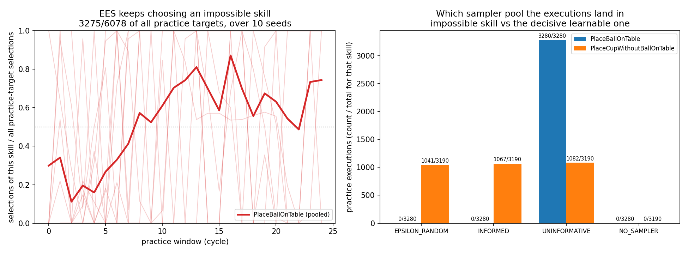
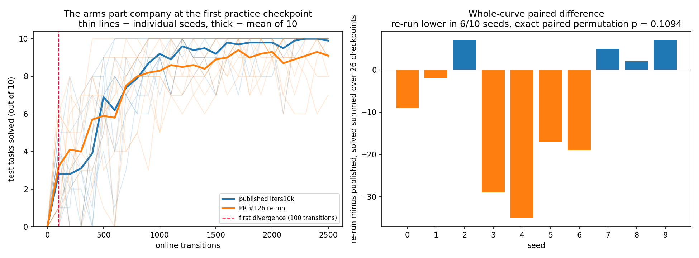

# Ball-Ring's `PlaceBallOnTable` succeeds 0/3280 — and EES practises it more, not less

**Investigation, 2026-08-06.** PR #126's practice-target audit found `PlaceBallOnTable`
at **0 successes in 3280 practice executions, 0 in every one of 10 seeds**, while EES
selected it as a practice target in 10/10 seeds — and explicitly left it uninvestigated.
This is that investigation. It also revisits the second thing #126 could not explain: the
published `iters10k` arm's 99/100 against #126's 91/100.

**Answers up front.**

1. **The skill is impossible by design, not by defect.** `place_ball_fall_prob = 1.0` means
   a bare ball placed on any table always falls, so `BallOnTable` is never achieved by
   this controller. Ball-Ring's analogue of Light Switch's `JumpToLight`.
2. **All 3280 executions land in the `UNINFORMATIVE` pool** — not `NO_SAMPLER`, and, more
   surprisingly, **0/3280 `EPSILON_RANDOM`** despite `--exploration-epsilon 0.5`.
3. **3275/3280 executions are because it was the chosen practice target**, not because it
   sat in another target's prefix.
4. **EES never learns to stop.** Its share of all practice targets *rises* over training,
   from 473/1802 in the first third to 1294/2054 in the last.
5. **The 99/100-vs-91/100 gap is not resolved, but it is narrowed.** The two arms are
   provably different computations; that either is *worse* is not supported.

---

## Question / goal

Distinguish four explanations for a skill at 0/3280 that need four different fixes: (a)
its add-effects are unsatisfiable as written; (b) its controller genuinely cannot achieve
them; (c) its success check disagrees with the dynamics — Tossing3D's `NearBin` defect,
inverted; (d) it is only ever attempted from states where it cannot succeed. Then answer
the parts a "by design" verdict does **not** cover: which sampler pool the executions land
in, whether they are targets or prefix side-effects, and whether EES ever stops.

## Background

`environments/ballring/` ports predicators' `ball_and_cup_sticky_table`. Its 15 lifted
skills include five with `param_dim = 2` — the placements a learning `Method` must tune.
PR #111 gave `stats.json` a per-skill record of practice *executions*; #119 split its
fallback pool so "no sampler exists" reads apart from "a sampler was consulted and could
not discriminate"; #126 added `PracticeTargetTally`, a record of practice *decisions*,
because an execution is not a decision — EES executes a chosen candidate's whole plan
prefix on the way to it.

Those three records together are what makes this question answerable without new runs.
`BallRingSkills`' own docstring already asserts `PlaceBallOnTable` is deliberately
impossible; that assertion had never been checked against the dynamics, the resolved
config of any real run, or EES's behaviour.

## Hypothesis

`PlaceBallOnTable` is impossible by construction (explanation **b**), and the interesting
content is in EES's response to it rather than in the skill.

## Guidance given

Do not assume it is a defect — a skill that legitimately never succeeds in the states EES
reaches is a domain-design fact. Verify or refute the docstring's claim rather than repeat
it. Separate target selection from execution count; say which pool the executions land in;
say whether EES ever stops. Do not change EES's behaviour — this is measurement. Never
edit or recompute a published number.

## Methods

No new runs. The 10 Ball-Ring runs are PR #126's, copied verbatim into
`2026-08-06-ballring-placeballontable/ees/<seed>/` (`SHA256SUMS` records their digests) so
this analysis is self-contained and re-runnable from `main` rather than depending on an
unmerged branch. 2 209 507 bytes / 2.21 MB for 20 files.

Three instruments:

- **A direct dynamics probe** (not committed; it drives the `Environment` directly, which
  an `analysis/` script must never do). `PlaceBallOnTable` executed from states where its
  preconditions genuinely hold — 20 sampled initial states × 5 tables × 50 parameter
  values — at the shipped config and at a `place_ball_fall_prob = 0.0` counterfactual.
- **`analysis/practice_makes_perfect/ballring_impossible_skill.py`** — pools, target
  decisions and selection share over training, from the committed `stats.json`.
- **`analysis/practice_makes_perfect/ballring_published_vs_rerun.py`** — per-checkpoint
  comparison of the published arm against #126's.

```bash
python -m analysis.practice_makes_perfect.ballring_impossible_skill \
  --results-root docs/experiment-logs/2026-08-06-ballring-placeballontable \
  --output docs/experiment-logs/2026-08-06-ballring-placeballontable.png

python -m analysis.practice_makes_perfect.ballring_published_vs_rerun \
  --published-json docs/experiment-logs/2026-08-03-ballring-arms.json \
  --rerun-root docs/experiment-logs/2026-08-06-ballring-placeballontable \
  --output docs/experiment-logs/2026-08-06-ballring-published-vs-rerun.png
```

## Results

### 1. The skill is impossible, and it is explanation (b)

The dynamics path is unconditional. In `BallRingEnvironment._handle_placing`, a place onto
a table sets `fall_prob = place_ball_fall_prob` whenever the held object is the ball; the
sticky-table branch below can only raise it to `1.0`, never lower it. With
`place_ball_fall_prob = 1.0`, `self._noise_rng.uniform() < 1.0` is true for every draw
(`uniform` returns from `[0, 1)`), so the ball always falls to a floor point around the
table. `place_ball_fall_prob = '1.0'` is confirmed in the **resolved** `args` of all 10
committed `config_snapshot.json`.

The probe separates the four explanations cleanly:

| `place_ball_fall_prob` | executions | `BallOnTable` held | `HandEmpty` held | both (= success) |
|---|---|---|---|---|
| **1.0** (shipped) | 5000 | **0/5000** | 5000/5000 | **0/5000** |
| 0.0 (counterfactual) | 5000 | 4567/5000 | 5000/5000 | **4567/5000** |

- **(a) refuted.** The identical add-effect conjunction is satisfiable 4567/5000 under a
  different config, and `BallOnTable` is achieved in the real runs by
  `PlaceBallInCupOnTable` (242/242 successes). The goal is reachable; this skill is not
  the route.
- **(c) refuted.** `HandEmpty` holds 5000/5000 in both arms and `BallOnTable` tracks the
  ball's actual position exactly. The success check *agrees* with the dynamics — the
  opposite of the `NearBin` defect.
- **(d) refuted.** The impossibility is state-independent: there is no state at
  `fall_prob = 1.0` from which it could succeed, so "only attempted from bad states" does
  not arise.
- **(b) confirmed**, and deliberate. `tests/environments/ballring/test_environment.py`'s
  `test_place_bare_ball_on_table_always_falls_to_floor` already pins the single-point case.

**This is a domain-design fact, not a bug, and nothing here recommends changing it.**

### 2. All 3280 executions are `UNINFORMATIVE`, and none are epsilon-random

| pool | `PlaceBallOnTable` | `PlaceCupWithoutBallOnTable` (the decisive learnable one) |
|---|---|---|
| `EPSILON_RANDOM` | **0/3280** | 1041/3190 |
| `INFORMED` | 0/3280 | 1067/3190 |
| `UNINFORMATIVE` | **3280/3280** | 1082/3190 |
| `NO_SAMPLER` | 0/3280 | 0/3190 |
| succeeded | **0/3280** | 2002/3190 |

`UNINFORMATIVE` is the right answer and it had to be **derived**: `SkillPracticeTally`
stores only three of the four pools as fields, computing the fourth as
`attempts − random − informed − unparameterized`. Dropping that last term silently folds
`NO_SAMPLER` in, which is why the arithmetic lives in exactly one place and is pinned by
`test_every_execution_lands_in_the_uninformative_pool`.

**The 0/3280 `EPSILON_RANDOM` is the genuinely surprising number.** With
`--exploration-epsilon 0.5` the naive expectation is that about half the draws are coin
flips. The reason it is zero is structural, in `LearnedSkillSampler.sample`: an all-negative
label set makes the classifier take the single-class shortcut, every candidate scores
identically, `best` therefore spans all 100 candidates, and the
`uninformative_tie_fraction` test returns a uniform draw **before** the epsilon-greedy
branch is ever reached. An impossible skill is a single-class classifier problem, and this
sampler answers it by never consulting epsilon at all.

### 3. Selection, not prefix: 3275 selections against 3280 executions

`num_selected = 3275`, `num_scored = 11894`, `num_declined_perfect = 0`,
`num_unreachable = 0`, against 3280 executions. At most 5/3280 executions could be prefix
side-effects. This is EES deliberately practising the skill, not walking through it —
the opposite of Tossing3D's `MoveToThrowPose`, which recorded 175/175 executions while
being dropped from every candidate list.

**Caveat, stated precisely:** selections and executions are different events, counted by
different records, so "3275/3280 are as target" is an inference from their near-equality
plus `num_unreachable = 0`, not a direct measurement. What would make it direct is one
field: a `was_target: bool` on `EesMethod._SkillAttempt` (which already carries
`consultation`), tallied as `num_target_attempts` on `SkillPracticeTally`. That is a
counter-only addition on the same call path #119 already touches.

### 4. EES never learns to stop — its share of practice targets rises

Over the 25 practice windows, in thirds of 8:

| third of training | `PlaceBallOnTable` selections / all practice-target selections |
|---|---|
| first | 473/1802 |
| middle | 1311/1996 |
| last | **1294/2054** |

Pooled over all windows it is **3275/6078** of every practice target EES chose. The rise
is from roughly a quarter to roughly two thirds; note it **plateaus** after the middle
third rather than climbing monotonically, so the honest statement is "rises and then
stays high", not "grows without bound". It is never once declined
(`num_declined_perfect = 0/10` seeds).

The mechanism is in `EesMethod.score_ground_skill`, and it is not a bug so much as a
missing case:

- `skip_perfect` drops a candidate whose `measured_success_rate` is **exactly 1.0**. There
  is no symmetric rule for a rate of exactly **0.0**.
- Scoring substitutes the *optimistically extrapolated* competence for the candidate being
  scored: `costs[ground_skill] = -log(predict_competence(num_additional_data=1))`. An
  impossible skill's true competence sits at the `1e-12` floor, so its cost is the largest
  of any step, so the counterfactual "if this one skill improved" promises the largest
  plan-cost reduction available.
- Plan cost is `sum(-log(competence))`, and the planner *believes* the symbolic model, in
  which `PlaceBallOnTable` achieves the goal in one step.

Together those make an impossible skill maximally attractive **forever**, and more
attractive the longer it fails. The UCB bonus, which decays in `num_tries`, is the only
thing pushing back and it is outweighed.



**This is a finding about the competence model, not a licence to change EES.** It is also
not obviously harmful here: the runs still reach 91/100, because plan *cost* correctly
routes the actual task through `PlaceBallInCupOnTable` once `PlaceBallOnTable`'s competence
collapses. What is being wasted is practice budget — 3275/6078 of it.

### 5. The published 99/100 versus #126's 91/100

**Certain: the two arms are different computations.** A `--seed` fully determines a run, so
identical code at the same seed must produce an identical curve. It does not: they diverge
at the **first** post-practice checkpoint (100 transitions) in 7/10 seeds and by the second
(200 transitions) in the remaining 3/10. This is not noise accumulating in a converged
tail; something differed from the start of training.

**Not established: that either arm is worse.** The endpoint comparison's p = 0.0625 sits
exactly at its own floor (5/10 pairs tied, 2 × 2⁻⁵), so it describes the design rather than
the world. Summing solved tasks over all 26 checkpoints gives an untied, better-powered
paired statistic — floor 2 × 2⁻¹⁰ = 0.00195, so it genuinely could have resolved a
consistent shift. It does not: the re-run is lower in **6/10** seeds, 1947/2600 against
2037/2600, exact paired permutation **p = 0.109**. The mean curves actually *cross* — the
re-run learns faster to about 700 transitions and finishes lower.



**Provenance, and what is inferred rather than recorded.** The published arm predates
`config_snapshot.json` (added 2026-08-05, PR #66), and its raw run directories did not
survive a move between machines, so **no artifact of that arm's provenance exists** — its
absence is not evidence of anything. From `git log`, the log entry was added by `6ef337f`
(#34), whose only code change is the `sampler_max_train_iters` default that the sweep
command overrides explicitly; so the executed tree is equivalent to its parent **`9f62b58`**
for every path Ball-Ring reads. **That is inferred, not verified.** The re-run's own
snapshots record `git_commit: 77ba55e` with **`git_dirty: true`** — the pre-squash #119
commit plus an unrecorded local diff, and *not* `ebf3d92`.

**Excluded.** PR #112 / `OMP_NUM_THREADS` (`run_sweep.py` already pinned it at `9f62b58`,
so it is a no-op for both swept arms — as #126 already withdrew). PR #119: its
`wrapped_sampler.py` delta is a single pure property and its `ees_method.py` delta stops
gating a record on `explore`; no draw is added or removed. PR #123: touches only
`environments/tossing3d/`, and postdates the re-run's tree. **No Ball-Ring config default
changed** — `git diff 9f62b58 ebf3d92 -- src/hitl_pmp/environments/ballring/` is one hunk,
`noop_action()`, and `git log -S` on every probability field finds nothing after the run.

**Leading candidate, not established: PR #85 (`3eb32c5`)**, "Fall back to a uniform draw
when the sampler cannot discriminate" — after `9f62b58`, before the re-run's tree. It
changes both the number of `Generator` draws in `LearnedSkillSampler.sample` and the
returned candidate's distribution:

| sampler state | before #85 | after #85 |
|---|---|---|
| unfitted | 1 `integers` | 1 `integers` |
| fitted, scores tie over >50% of candidates | 1 `uniform`, +1 `integers` if epsilon fires | **1 `integers`; `uniform` never drawn** |
| fitted, discriminating | 1 `uniform`, +1 `integers` | **+1 extra `integers` tie-break, then as before** |

This is the same branch section 2 shows firing on 3280/3280 `PlaceBallOnTable` executions
and 1082/3190 `PlaceCupWithoutBallOnTable` ones — thousands of calls per run whose draw
count and output distribution both changed. A secondary candidate is `6b90c66` (#102),
which changed Ball-Ring's no-plan placeholder from an action that moved the robot toward
(0, 0) to a true no-op; it consumes no RNG but changes evaluation-path state.

## Recommendation

1. **Change nothing in EES or in Ball-Ring on the strength of this.** Sections 1-4 are
   measurement of a deliberate design fact and of EES behaving as written.
2. **Decide whether "practises a provably impossible skill 3275/6078 of the time" is
   acceptable.** It is the intended stress test — `JumpToLight` exists for the same reason
   — but `skip_perfect` has no floor to match its ceiling. If a floor is wanted, the
   smallest honest version is to drop a candidate whose measured success rate is exactly
   0.0 over some minimum number of attempts. **That is a change to EES's behaviour and a
   deviation from predicators, so it is Josh's call, not this PR's.** It would also need
   its own before/after experiment: it frees ~half the practice budget, so it could plausibly
   move Ball-Ring's score either way.
3. **To settle section 5, run this** — it was deliberately not run tonight (Q2 was the
   designated cut, and the machine goes down at 23:30):

   ```bash
   # arm A: the published arm's inferred tree. Does 99/100 reproduce at all?
   # arm B/C: isolate PR #85 with a one-commit paired difference.
   for ref in 9f62b58 3eb32c5~1 3eb32c5; do
     git archive $ref | tar -x -C /tmp/tree-$ref     # or a throwaway worktree
     /tmp/tree-$ref/scripts/with_env.sh python -m scripts.run_sweep \
       --env ballring --methods ees --num-seeds 10 --results-root results/br-$ref \
       --shared-args "--num-test-tasks 10" \
       --method-args "ees=--num-cycles 25 --max-steps-per-interaction 100 \
         --competence-window-size 2 --competence-recency-size 2 \
         --exploration-epsilon 0.5 --sampler-max-train-iters 10000"
   done
   ```

   Arm A answers "is the published number reproducible"; B-vs-C is a paired 10-seed test of
   #85 alone and is the only one that can *establish* rather than nominate a cause. **Even
   this cannot fully settle it**: the re-run's tree was `git_dirty: true`, so an unrecorded
   diff remains an unquantified term, and if arm A does not reproduce 99/100 then the
   published arm's provenance is simply lost and no further run recovers it.
4. **Add `num_target_attempts`** (section 3) if the target-versus-prefix distinction is
   ever load-bearing again; it is a counter, not a behaviour change.
