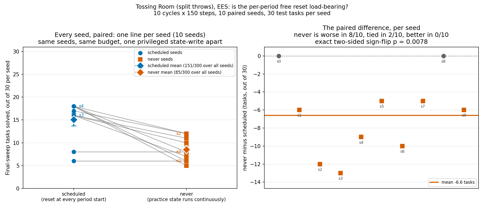
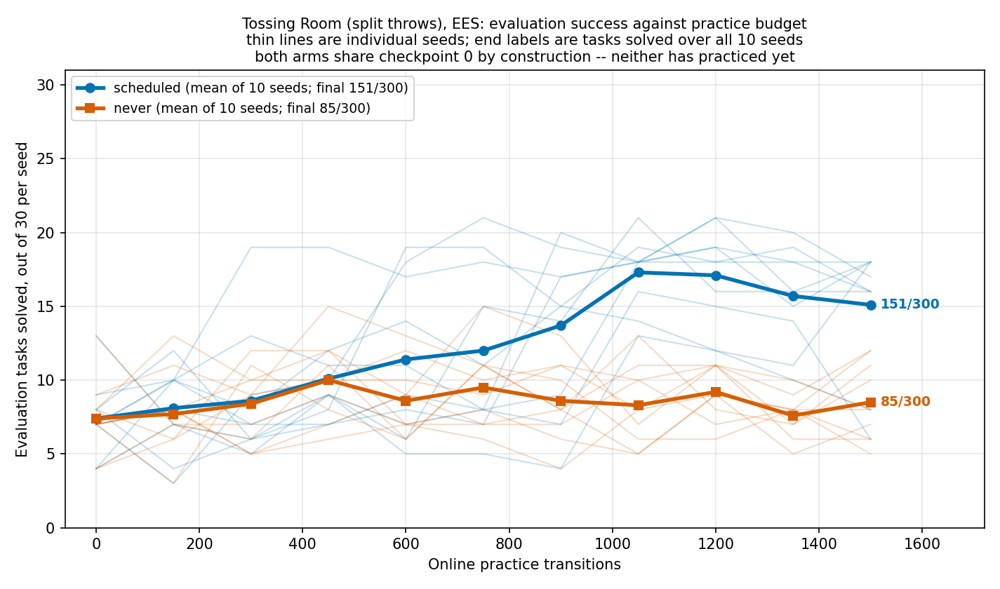
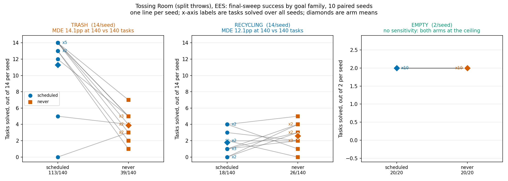
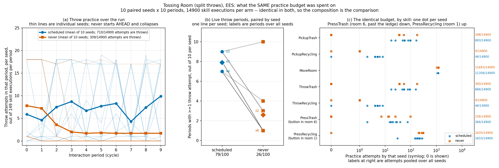
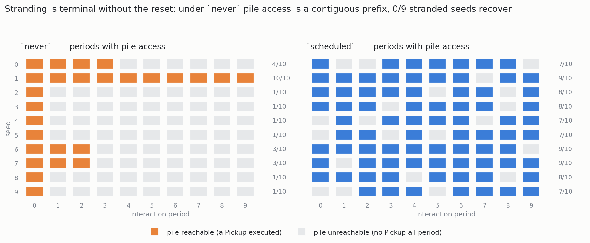

# Reset-free practice on Tossing Room (split throws): `scheduled` vs `never`

Domain `tossingroomsplit`, method `ees`, 10 fixed seeds (0-9), 30 test tasks
(14 TRASH / 14 RECYCLING / 2 EMPTY), 10 cycles x 150 steps per interaction period.
The two arms are invoked with different `--practice-reset-policy` values and no other
flag difference.

> **Correction, found in review after the runs were complete and before this log was
> published.** An earlier draft of this section said the arms "differ in
> `--practice-reset-policy` and nothing else". **That is false**, and the claim is
> retracted. Turning the reset off also *freezes the practice task's continuous
> parameters* for the whole run, which collapses the learned sampler's training
> distribution to a single point. The outcome result below stands as measured; the
> causal attribution does not, and the "Two entangled mechanisms" section replaces it.
> This experiment cannot separate the two, and no single-flag experiment on this
> domain can.

> **Status note: eight commits have landed under this experiment. The outcome numbers are
> re-verified; the practice-side numbers are not.** Read those two categories separately —
> they have different evidential status and this note exists to keep them apart.
>
> The eight, in merge order, are **#103, #100, #102, #104, #106, #101, #111 and #112**. An
> earlier revision of this note said "six" and omitted **#103** and **#112**; that was wrong
> and is corrected here rather than silently rewritten. #103 is the omission that mattered,
> because it is the only one of the eight that touches
> `scripts/tossingroomsplit_skill_traces.py` — the collector every practice-side number in
> this log comes from.
>
> **Outcome numbers: re-verified, and they reproduce exactly.** Three of the eight had a
> plausible route into them. **#102** changed what `EesMethod` emits when it cannot plan,
> from `np.zeros(...)` to `Environment.noop_action()` — and on this domain slot 0 is the
> skill id with `SKILL_PICKUP == 0`, so the old zero vector decoded as a real `Pickup`.
> **#100** changed what `Method.reset_environment` reports when it did not reset, on a stack
> whose whole subject is the reset. **#112** pinned the sampler's torch reductions, which
> had made the ambient intra-op thread count a second unrecorded input to every run. Both
> arms were therefore re-run in full at `24edeb1`, seeds 0-9, same flags. **Every per-seed
> count reproduces exactly: 10/10 seeds in each arm, pooled 151/300 and 85/300 unchanged**,
> with `num_practice_resets` still 10/10 seeds at 10 and 10/10 at 0, and all 20 runs still
> ending at exactly 1500 transitions.
>
> **Practice-side numbers: re-verified too, both arms, and they reproduce exactly.** These
> come from `scripts/tossingroomsplit_skill_traces.py`, which **#103 and #111 both
> modified** — #103 adding three per-draw lists and a `drain_pending()` that drops a pending
> throw at each cycle boundary, #111 reworking what the collector records. #112 compounds
> it: the collector runs as a bare script rather than through `scripts/run_sweep.py`, so it
> never received the `OMP_NUM_THREADS=1` pinning a sweep child gets, and the committed
> shards were produced under exactly the ambient thread count #112 exists to eliminate. All
> three had a plausible route into these counts, so the collector was re-run on this base
> for both arms, all 10 seeds.
>
> | figure | `scheduled` | `never` |
> | --- | --- | --- |
> | pooled practice attempts | 14900/14900 | 14900/14900 |
> | greedy throws | 440 | 194 |
> | distinct greedy targets | 86 | **1** |
>
> Every per-skill count reproduces as well — `scheduled` MoveRoom 11356, PickupTrash 693,
> ThrowTrash 666, PressRecycling 1833, PressTrash 264, PickupRecycling 44, ThrowRecycling
> 44; `never` MoveRoom 11693, PickupTrash 298, ThrowTrash 300, PressRecycling 2435,
> PressTrash 156, PickupRecycling 9, ThrowRecycling 9. **No practice-side figure in this log
> is provisional.**
>
> **How `stats.json` may be compared has also changed.** #106 added per-window planning
> counters and #111 added per-lifted-skill practice outcomes, so the `stats.json` files
> these aggregates were computed from have a smaller field set than one written today. A
> comparison against any pre-#106 run must be **field-wise, not byte-wise** — a byte
> comparison across that boundary fails for schema reasons alone and says nothing about
> behaviour.
>
> **And #111 partly subsumes this log's bespoke collector.** `practice_outcomes_per_cycle`
> records, per lifted skill per window, attempts and successes overall and split into
> epsilon-random and classifier-informed pools — which is where the per-skill practice
> tallies and the greedy-throw counts below could now come from, on any domain, without
> `scripts/tossingroomsplit_skill_traces.py`. What it does **not** capture is the
> *distinct required-force target* count (1 under `never` against 86 under `scheduled`),
> the single most important number in the "Two entangled mechanisms" section: that is a
> property of the task-parameter distribution, not of attempt counts, and nothing in
> `stats.json` records it. The collector is therefore reduced in scope by #111 but not
> replaced by it.
>
> **Finally, and most importantly for how this log is read: a later positive control
> contradicts the irreversibility mechanism argued below.** A follow-up arm that opened the
> one-way ledge removed stranding entirely — 74/100 → 0/100 cycles, 9/10 → 0/10 seeds — and
> yet **doubled** the reset-free penalty, from +6.6 to +13.2 tasks/30, with the interaction
> negative in 10/10 seeds and a sign-flip p = 0.0020. If irreversibility were the mechanism,
> removing it should have shrunk the gap; it widened it. **So the "ledge strands the robot,
> and that is why `never` collapses" account below — including the part of the #101 note
> above that endorses it — is not supported, and the outcome numbers stand on their own
> without it.** The measurements below are unchanged and are not rewritten here; what is
> retracted is the causal story, and the PRs above this one in the stack carry that finding
> and its evidence. Read every mechanism claim below as superseded, and the per-seed and
> per-family counts as still valid.

## Pre-registration

**Written and committed before either sweep was run.** The commit that adds this
section contains no results; the numbers arrive in a later commit on the same branch.

### What is being manipulated

`scheduled` (the default, and the only behaviour that existed before this stack) puts
the environment back to the freshly-sampled train task's initial state at the top of
every interaction period. `never` does not: practice state runs continuously across
period boundaries, and across the train task changing underneath it. Nothing else
differs -- a train task is still drawn per period and still handed to
`get_practice_policy`, so the train-task distribution is identical.

This comparison was not expressible before the two PRs below it in this stack.
`PracticeLoop._evaluate` used to run on the *same* `Problem` as practice, and every
evaluation episode opens with `reset_to_task`, a privileged state-write. A 30-task
sweep is therefore 30 resets handed to the practice environment for free, 11 times
over a 10-cycle run. A `never` arm run against that harness would have been reset 330
times and would have measured nothing.

### Prediction

**Direction: I expect `scheduled` to beat `never`.** `PracticeLoop`'s own docstring
has argued since it was written that the per-period reset is load-bearing rather than
tidiness -- an interaction period that resumes from wherever the last one ended begins
somewhere unearned, and on Light Switch that meant starting beside the light and
spending the whole budget on the toggle. Tossing Room's ledge makes the analogous
failure sharper and one-directional: the ledge is irreversible, so a practice period
that ends past it stays past it forever, and every subsequent period is stuck in the
region where the pile is unreachable and no throw can be practiced at all. Under
`never` I expect practice to strand itself early and stop generating throw experience,
so the learned samplers should be worse.

**Magnitude: large.** The scoping pass predicted 50-70pp against a measured 8.1pp MDE
at n=20. I will treat anything under 10pp as "no meaningful difference" regardless of
what a test says.

**Confidence: moderate, and one observation already points the other way.** A 3-cycle
mechanism probe on seed 0 alone -- run to confirm `num_practice_resets` really goes to
0, not to measure anything -- came out `never` 13/30 vs `scheduled` 8/30. That is a
single seed at a third of the training budget and supports no inference, but it is
disclosed here because it was seen before this prediction was written and it is
evidence against the direction predicted above.

**Per-family prediction.** If the stranding story is right, the damage should land on
RECYCLING first (its bin sits behind the ledge) and TRASH second, with EMPTY least
affected since it is a walk-and-press with no throw. EMPTY's denominator is 2/seed =
20/arm, which is too small to carry an inference on its own.

### Analysis plan, fixed in advance

- **Primary test: paired.** The arms share the seed set, so the 10 seeds are 10 paired
  observations. A paired t-test on the per-seed final-sweep success count, plus a
  Wilcoxon signed-rank test as the distribution-free companion. An unpaired test here
  would throw away the pairing and understate significance.
- **Reported as counts.** `x/y` everywhere, per arm and per family, never a bare
  percentage.
- **MDE, derived per comparison from its own two denominators**, using this repo's
  constant `2.801585` (two-sided alpha = 0.05, 80% power):

  ```text
  MDE = 2.801585 * sqrt( p1(1 - p1)/n1 + p2(1 - p2)/n2 )
  ```

  evaluated at the observed arm rates. Each family gets its own MDE from its own
  `n1`/`n2`; the overall comparison gets its own. The `20.19pp` figure that appears in
  older merged work belongs to a different comparison and is not reused here.
- **A null result will be written as "null result", in full, and reported as such.**

## Results

### Figures









### Reproducing this

The raw sweep directories deliberately live outside the repo, so these commands are the
only route back to them; the committed aggregates regenerate every table and figure
without re-running anything.

```bash
# The two arms (seeds 0-9 are fixed, never drawn).
python -m scripts.run_sweep --env tossingroomsplit --methods ees --num-seeds 10 \
  --results-root results/reset-ab/scheduled \
  --shared-args "--num-test-tasks 30 --practice-reset-policy scheduled" \
  --method-args "ees=--num-cycles 10 --max-steps-per-interaction 150"
python -m scripts.run_sweep --env tossingroomsplit --methods ees --num-seeds 10 \
  --results-root results/reset-ab/never \
  --shared-args "--num-test-tasks 30 --practice-reset-policy never" \
  --method-args "ees=--num-cycles 10 --max-steps-per-interaction 150"

# The practice-side traces (same runs, measured a second way).
python scripts/tossingroomsplit_skill_traces.py --label scheduled --num-seeds 10 \
  --num-cycles 10 --max-steps-per-interaction 150 --num-test-tasks 30 \
  --practice-reset-policy scheduled --output traces-scheduled.json
python scripts/tossingroomsplit_skill_traces.py --label never --num-seeds 10 \
  --num-cycles 10 --max-steps-per-interaction 150 --num-test-tasks 30 \
  --practice-reset-policy never --output traces-never.json

# Condense to the committed aggregates.
python -m analysis.practice_makes_perfect.tossingroomsplit_reset_policy \
  --arm scheduled=results/reset-ab/scheduled --arm never=results/reset-ab/never \
  --aggregate-output docs/experiment-logs/2026-08-06-reset-free-practice-ab.json
python -m analysis.practice_makes_perfect.tossingroomsplit_reset_policy \
  --trace scheduled=traces-scheduled.json --trace never=traces-never.json \
  --practice-aggregate-output docs/experiment-logs/2026-08-06-reset-free-practice-traces.json

# Regenerate every figure and number from the aggregates alone.
python -m analysis.practice_makes_perfect.tossingroomsplit_reset_policy \
  --arms-json docs/experiment-logs/2026-08-06-reset-free-practice-ab.json \
  --output docs/experiment-logs/2026-08-06-reset-free-practice-per-seed.png \
  --curves-output docs/experiment-logs/2026-08-06-reset-free-practice-curves.png \
  --families-output docs/experiment-logs/2026-08-06-reset-free-practice-families.png
python -m analysis.practice_makes_perfect.tossingroomsplit_reset_policy \
  --practice-json docs/experiment-logs/2026-08-06-reset-free-practice-traces.json \
  --practice-output docs/experiment-logs/2026-08-06-reset-free-practice-practice-side.png
```

### Checks, before any inference

**Manipulation.** `num_practice_resets` is 10 in 10/10 `scheduled` runs and 0 in 10/10
`never` runs. Read out of each run's own `stats.json`, not inferred from the flag.

**Matched experience.** Every run of both arms ends at exactly 1500 online transitions,
in 10/10 runs of each arm. No arm bought its result with extra practice, and no period
ended early on `InteractionComplete`.

**Realised test composition.** 14 TRASH / 14 RECYCLING / 2 EMPTY per seed, asserted per
seed across both arms, 0 violations.

### Outcome

`scheduled` **151/300**, `never` **85/300** at the final sweep, pooled over 10 seeds.

> **Status note, added on a later branch: a follow-up has since separated the two
> mechanisms this log's own correction says it cannot separate. Nothing below is
> recomputed, restated or withdrawn.**
>
> `docs/experiment-logs/2026-08-07-pickup-weight-reset-free-ab.md` re-runs this exact
> protocol on a **new domain**, `tossingroomsplitpickupweight`, where the item weight is
> drawn at pickup off a per-task pre-sampled array and the bin distance is fixed — so
> mechanism 2 below ("the collapsed training distribution") is absent by construction and
> cannot be frozen by the missing reset. `scheduled` **183/300** against `never`
> **112/300** there, −23.7pp against its own 11.1pp MDE, paired p = 0.0117.
>
> Two consequences for reading this log, neither of which touches a number in it. First,
> **stranding alone reproduces a gap of similar size**, so the post-hoc correction's
> mechanism 1 is sufficient on its own; that follow-up does **not**, however, decompose
> *this* experiment's 22.0pp, and the two domains' numbers are not comparable
> run-for-run. Second, the stranding account below is now measured directly rather than
> inferred from skill composition: 10/10 `never` seeds there stop reaching the pile, and
> across 85 pooled post-onset periods the only skills that execute are `MoveRoom` and
> `PressRecycling` — 0 pickups, 0 throws, 0 `PressTrash`. The same measurement on **this**
> experiment's own runs is the figure below, added here rather than recomputed:
>
> 

| comparison | `scheduled` | `never` | diff | MDE (own denominators) |
| --- | --- | --- | --- | --- |
| OVERALL | 151/300 (50.3%) | 85/300 (28.3%) | −22.0pp | 10.9pp |
| TRASH | 113/140 (80.7%) | 39/140 (27.9%) | **−52.9pp** | 14.1pp |
| RECYCLING | 18/140 (12.9%) | 26/140 (18.6%) | +5.7pp | 12.1pp |
| EMPTY | 20/20 | 20/20 | 0.0pp | degenerate, see below |

Per-seed final counts out of 30:

| seed | 0 | 1 | 2 | 3 | 4 | 5 | 6 | 7 | 8 | 9 |
| --- | --- | --- | --- | --- | --- | --- | --- | --- | --- | --- |
| `scheduled` | 8 | 16 | 18 | 18 | 16 | 16 | 18 | 17 | 6 | 18 |
| `never` | 8 | 10 | 6 | 5 | 7 | 11 | 8 | 12 | 6 | 12 |

`never` is worse in **8/10** seeds, tied in **2/10**, better in **0/10**. Exact
two-sided sign-flip test on the paired per-seed counts: **p = 2/256 = 0.0078**.

Per-family paired tests: TRASH −7.4 tasks/seed, worse in 9/10 seeds, p = 0.0059.
RECYCLING +0.8 tasks/seed, better in 6/10, p = 0.3555. EMPTY identical in 10/10.

**EMPTY supports no inference.** Both arms are 20/20, so the normal-approximation MDE
degenerates to 0.0pp — an artefact of both rates sitting at 1.0, not a real sensitivity
floor. At 2 tasks per seed (20 per arm) this family could not have detected a moderate
effect in either direction, and it is reported as uninformative rather than as a null.

**RECYCLING is a null result** at this sample size: +5.7pp against its own 12.1pp MDE,
so the sign is unresolved.

> **Status note, added after this log was written.** PR #101 retracted the claim that
> Tossing Room has "exactly one genuinely terminal failure" and established a second:
> `EMPTY` is an *ordering* task, and because the recycling button sits behind the
> one-way ledge, pressing it first puts the trash button permanently out of reach. Two
> consequences for this log, neither of which changes a measured number. First, the
> pre-registered reason for expecting `EMPTY` to be least affected — "a walk-and-press
> with no throw" — is incomplete: `EMPTY` can strand the robot too. The prediction held
> (20/20 in both arms) but not for the reason given, and evaluation episodes each open
> with their own `reset_to_task`, so the ordering trap is escapable there in a way it is
> not during a `never` practice period. Second, #101's mechanism *corroborates* this
> log's post-hoc correction below: both accounts say the ledge damages families by
> removing access to rooms right of it, not by sitting between the robot and one bin.
> The `PressTrash` 264 → 156 fall recorded below is the same signature #101 measures as
> `PressRecycling` 3,576/24,750 in the split-throw run.

Two things the curve shows that the final-sweep number does not. The arms are
**indistinguishable until ~450 transitions** — both start at 74/300 and track each other
for the first three cycles — and only then does `never` flatten while `scheduled`
climbs. And `scheduled` is **not monotone**: it peaks at a mean 17.3/30 at 1050
transitions and gives some back to 15.1/30 by the final sweep, so the pre-registered
final-sweep comparison understates that arm's best point.

### An unexplained observation: the planner finds no plan on most of its calls

Not part of the pre-registered analysis, and **not an input to any conclusion here** —
recorded because it was invisible until #106 added the counters, and it was measured on the
re-verification runs described in the status note above.

| arm | planning calls finding no plan, pooled over 10 seeds |
| --- | --- |
| `scheduled` | 15193/21372 |
| `never` | 14099/20188 |

It is not uniform across seeds. On `scheduled`, seed 1 is **269/887** while seed 2 is
**1967/2585**; on `never`, seed 1 is **121/800** against seed 0's **2209/2892**. Both arms
sit near two-thirds of calls failing, so this is a property of the domain rather than of the
reset policy — the arms are not meaningfully different on it.

EES plans **speculatively** — once per seen task while scoring, once per candidate while
situating — so #106's own docstring says a failure there is routine rather than a defect,
and nothing in this experiment depends on the ratio. **No interpretation is offered.** In
particular this does not establish whether these are the routine speculative failures or a
real gap in the symbolic model, which would need the per-call context the counters do not
carry. It is written down so that the next person to look at EES on this domain starts from
a measured number instead of rediscovering it.

### What practice actually did differently

Both arms recorded exactly **14900** observed practice attempts pooled over 10 seeds —
in fact exactly 1490 per seed and exactly **149 per period**, in every period of every
run of both arms, checked rather than assumed. The budget is identical, so the
*composition* is the comparison.

**`never` does not simply practice less.** It practices *more* early: 78 throw attempts
against `scheduled`'s 59 in cycle 0, and 72 against 46 in cycle 1. It is only behind
from cycle 2 on. So the collapse is not "the reset-free arm was always doing less" — it
is a capability that is present, then lost.

(An earlier draft attributed that early advantage to "not paying for a reset". That is
wrong and is retracted: both arms spend exactly 149 skill executions per period, and the
reset teleports the robot *to* the pile, which helps rather than costs. The likeliest
explanation is mechanism 2 — a frozen, always-identical throw is easier to repeat — but
this experiment does not establish it.)

| lifted skill | `scheduled` | `never` |
| --- | --- | --- |
| PickupTrash | 693/14900 | 298/14900 |
| PickupRecycling | 44/14900 | 9/14900 |
| MoveRoom | 11356/14900 | 11693/14900 |
| ThrowTrash | 666/14900 | 300/14900 |
| ThrowRecycling | 44/14900 | 9/14900 |
| PressTrash | 264/14900 | 156/14900 |
| PressRecycling | 1833/14900 | 2435/14900 |

Throw attempts (both throws) per cycle, pooled over 10 seeds:

| cycle | 0 | 1 | 2 | 3 | 4 | 5 | 6 | 7 | 8 | 9 |
| --- | --- | --- | --- | --- | --- | --- | --- | --- | --- | --- |
| `scheduled` | 59 | 46 | 75 | 87 | 67 | 77 | 83 | 43 | 74 | 99 |
| `never` | 78 | 72 | 36 | 20 | 17 | 18 | 17 | 17 | 17 | 17 |

Cycles (out of 10) containing at least one throw attempt, per seed:

| seed | 0 | 1 | 2 | 3 | 4 | 5 | 6 | 7 | 8 | 9 |
| --- | --- | --- | --- | --- | --- | --- | --- | --- | --- | --- |
| `scheduled` | 7 | 9 | 8 | 8 | 7 | 7 | 9 | 9 | 8 | 7 |
| `never` | 4 | 10 | 1 | 1 | 1 | 1 | 3 | 3 | 1 | 1 |

`never` throws at the same rate as `scheduled` for two cycles, then stops: **6/10 seeds
practice a throw in exactly 1 of their 10 cycles**, against 7-9 of 10 for every
`scheduled` seed. That is the same ~450-transition point at which the evaluation curves
diverge, measured on the practice side.

The apparent floor of ~17 throws per cycle from cycle 4 onward is **not** a residual
spread across seeds — it is **one seed**. Throw attempts in cycles 4-9, per `never` seed:

| seed | 0 | 1 | 2 | 3 | 4 | 5 | 6 | 7 | 8 | 9 |
| --- | --- | --- | --- | --- | --- | --- | --- | --- | --- | --- |
| throws in cycles 4-9 | 0 | **103** | 0 | 0 | 0 | 0 | 0 | 0 | 0 | 0 |

Seed 1 is the only run that never strands: it throws 17-18 times in every one of its 10
periods, exactly like a `scheduled` run. The other **9/10** seeds have stopped throwing
entirely by cycle 3 at the latest.

And "stopped after cycle 0" understates how little those runs practiced. Seeds 2, 3, 4,
5, 8 and 9 — **6/10** — record **exactly one throw attempt in the entire run**: a single
`ThrowRecycling` in cycle 0, then no `PickupTrash`, no `ThrowTrash` and no `PressTrash`
ever again. That is 1/1490 of their practice budget spent on throwing.

Seed 1 also gives the cleanest positional evidence in the dataset: it is the only `never`
seed with `PressRecycling` at 0 for the whole run. The one seed that keeps throwing is
the one seed that never goes left past the ledge.

Seed 1 is also the tie-breaker for reading the outcome table: it still scored 10/30
against its `scheduled` pair's 16/30, so not stranding was necessary but not sufficient
to match the reset arm. And the two seeds that tie overall (0 and 8) are tied low —
`scheduled` scored 8/30 and 6/30 there, its two worst runs.

### Two entangled mechanisms, not one

The reset does two things at once on this domain, and the flag cannot separate them.

**Mechanism 1: the rescue.** Described below — the ledge strands the robot away from
the pile, and the reset is what recovers it.

**Mechanism 2: the frozen training distribution.** `reset_to_task` is the *only* thing
that installs a `Task`'s `initial_state`. Under `never` it is never called, so every
state feature no action writes stays at whatever `hard_reset()` put there for the entire
run. On this domain those features include a bin's `throw_distance` and an item's
`weight` — pinned at `canonical_throw_distance = 2.0` and `canonical_item_weight = 1.0`,
the midpoints of the `Uniform[1, 3)` and `Uniform[0.5, 1.5)` task distributions — and
they are **exactly the learned sampler's input row**. No branch of `take_action` writes
either one; only `build_initial_state` does.

Measured, not inferred, from the greedy throw targets in the traces:

| arm | greedy throws | distinct required-force targets |
| --- | --- | --- |
| `scheduled` | 440 | **86** |
| `never` | 194 | **1** |

The `never` arm practiced every throw of every seed against a single required force of
0.5, then was evaluated on a test set drawn across the full distribution.

**The data separates the two mechanisms enough to show both are real.** Seed 1 is the
one `never` seed that never strands. Mechanism 1 does not apply to it, so under a
stranding-only account it should roughly match its pair. It does not:

| seed 1 | throw practice | final TRASH |
| --- | --- | --- |
| `scheduled` | 73/157 successful | 14/14 |
| `never` | 97/174 successful | 5/14 |

It practiced *more* throws and succeeded at a *higher* rate than its pair, and still
scored 5/14 against 14/14. Pooled, the same signature: `ThrowTrash` practice success is
150/300 under `never` against 240/666 under `scheduled`. Better on the training point,
far worse on the test distribution, is overfitting — and stranding predicts the
opposite (fewer attempts, not a higher success rate).

So the headline −22.0pp is a joint effect of losing the rescue *and* collapsing the
training distribution. **This experiment does not measure the value of the free reset
alone, and this log should not be cited as if it did.**

Separating them needs a third arm that resets the environment's *task parameters* per
period without restoring the robot's position — which the current `Environment` API
cannot express, since `reset_to_task` is all-or-nothing. That is the follow-up.

### The pre-registered mechanism was wrong, and the correction matters

The direction was right; the mechanism was not. I predicted RECYCLING would take the
damage because its bin sits behind the one-way ledge. Instead RECYCLING did not move
measurably and **TRASH collapsed** (113/140 → 39/140) — the *reversible* family, whose
bin at room 6 is freely reachable from the pile in both directions.

The layout explains it. The pile is at room 3, the recycling bin and its button at room
1, the trash bin and its button at room 6, and the ledge blocks a rightward step from
room 2. So walking left toward recycling is irreversible with respect to **the pile**,
not just with respect to recycling: past room 2 the robot can never return to room 3,
`PickupTrash`/`PickupRecycling` become inapplicable forever, and **no throw of either
kind can be practiced again**. Under `scheduled` that costs the rest of one period;
under `never` it costs the rest of the run.

The per-period tallies show this happening, period by period. `never`, seed 0:

| period | skills executed |
| --- | --- |
| 0-2 | `MoveRoom`, `PickupTrash`, `PressTrash`, `ThrowTrash` |
| 3 | `MoveRoom`, `PickupRecycling`, `PressRecycling`, `ThrowRecycling`, `ThrowTrash` |
| 4-9 | `MoveRoom`, `PressRecycling` — **and nothing else** |

Period 3 is the one that walks left for a recycling task. From period 4 to the end of
the run the robot executes only the two skills available in rooms 0-2: it never picks up
and never throws again. That is the capability loss stated directly, not inferred.

The pooled totals carry the same signature positionally: `PressTrash` falls 264 → 156
(its button is at room 6, unreachable once stranded) while `PressRecycling` *rises*
1833 → 2435 (its button is at room 1, where the robot is stuck), and `MoveRoom` absorbs
the freed budget. The robot's room index itself was not instrumented, so the room
attribution is inference from skill applicability rather than a direct read — but the
loss of pickup and throw is directly observed.

TRASH is the family that visibly suffers precisely *because* it was the one the sampler
was successfully learning. RECYCLING sat near the floor in both arms (18/140 and 26/140,
against an untrained baseline of 74/300 overall) and had little left to lose.

## Recommendation

**Keep the per-period reset as the default.** The claim in `PracticeLoop`'s docstring
that it is load-bearing is now measured rather than asserted, and it holds on this domain
with a large effect and a clean paired test.

But the *reason* recorded there — "a period resuming from a solved state gets an unearned
head start" — is not what is doing the work, and neither is any single mechanism. On this
domain the reset is doing **two** jobs: rescuing the robot from an irreversible action,
and re-randomising the task parameters the sampler learns from. Both are real, they are
entangled, and this experiment cannot apportion the effect between them.

That matters for what comes next, because the two imply different remedies. If the
rescue dominates, a reset-free method needs a recovery mechanism — the human-in-the-loop
layer this project is actually about. If the frozen training distribution dominates, it
needs task-parameter variation that does not depend on a privileged state-write, which is
an environment-design problem, not a method problem.

**The next experiment should be the disentangling one**, not another domain: a third arm
that re-randomises task parameters per period *without* restoring the robot's position.
`Environment.reset_to_task` is all-or-nothing today, so that arm needs an API change
first — which is exactly the kind of thing worth knowing before five domains are wired.

Three limits. This is **one domain**. `never` is the extreme end of the axis, not a sweep
over reset frequency (`--practice-reset-interval` exists for the middle of that range and
was deliberately not varied here). And the headline number is a **joint** effect, as
above.
