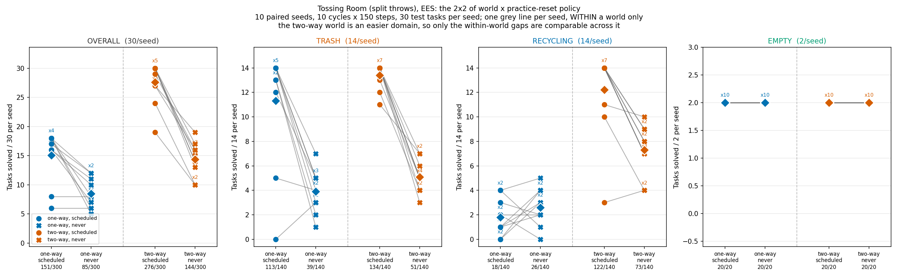
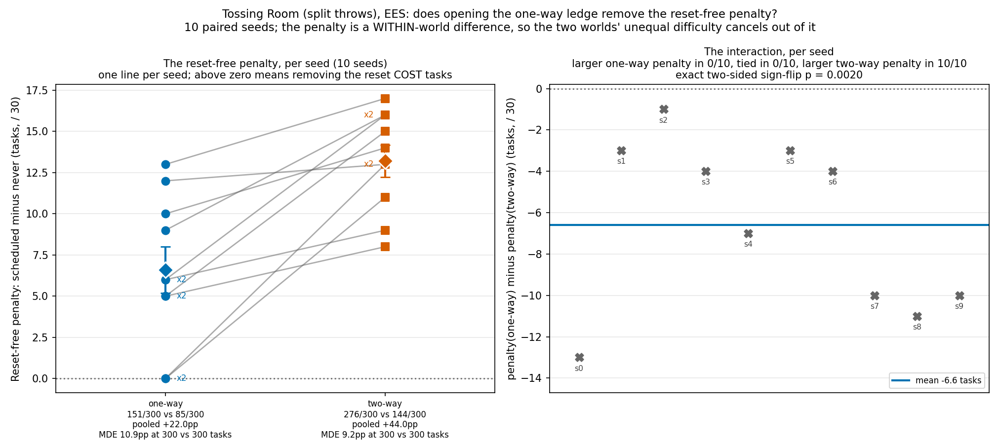
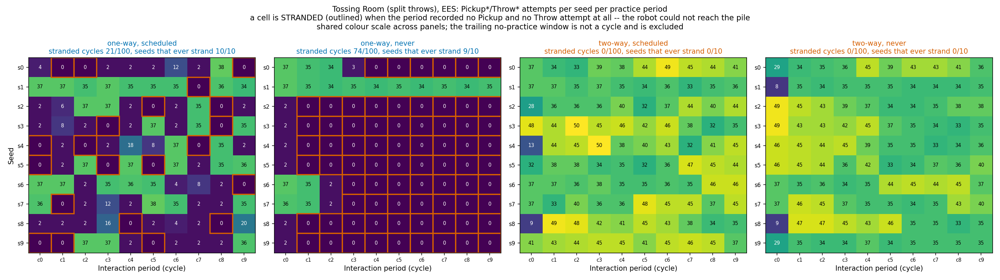

# Reset-free practice with the ledge made two-way: the positive control

**Status: run and analysed.** The pre-registration below is unedited from its own
results-free commit; the Methods, Results and Recommendation sections were added
afterwards.

**The positive control failed.** Making the ledge two-way removed stranding completely —
**0/100** stranded practice cycles against **74/100** in the one-way reset-free arm, and
pooled throw attempts up from **309** to **1886** — and reset-free practice still did not
work. It improved absolutely (85/300 → 144/300) but fell *further* behind scheduled-reset
practice, not closer: the gap went **22.0pp → 44.0pp**, worse in **10/10** seeds, exact
two-sided sign-flip p = 2/1024 = 0.0020. So irreversibility is **not** the mechanism that
breaks reset-free practice here. This contradicts the pre-registered prediction, and it
contradicts the direction Josh expected.

## Question / goal

Reset-free practice is worse than scheduled-reset practice on Tossing Room (split
throws). Is that because practice is reset-free, or because *this domain has an
irreversible action*?

The two are not the same claim, and only the second is a statement about the method. If
removing the irreversibility restores reset-free performance, the finding is "EES cannot
recover from an irreversible mistake, and reset-free practice is what exposes that" — a
claim about irreversibility. If reset-free practice still fails in a world with no
irreversible action, then irreversibility was not the mechanism and the negative result
means something else.

## Background

`environments/tossingroomsplit` is a 7-room hallway. The robot and the item pile start
in room 3; the recycling bin and its button are in room 1, the trash bin and its button
in room 6. A one-way ledge blocks the **rightward** step out of room 2. That single
blocked edge is the only edge from rooms {0,1,2} into {3…6}, and the pile is the only
source of items, so rooms 0–2 are absorbing at any horizon: a robot that walks left once
can never pick up, throw, or press the trash button again.

**PR #115** measured `--practice-reset-policy scheduled` against `never`, 10 paired
seeds, EES, 10 cycles × 150 steps, 30 test tasks. Its published result: **151/300 vs
85/300** at the final sweep, −22.0pp against a 10.9pp MDE, exact two-sided sign-flip
p = 2/256 = 0.0078, `never` worse in 8/10 seeds and better in 0/10. Those numbers are
cited here, not re-derived.

#115's own write-up attributes that to **two entangled mechanisms**, and this experiment
only removes one of them:

1. **Stranding.** The ledge severs rooms 0–2 from the pile, so a practice period that
   ends past it stays past it. A follow-up investigation established this from primary
   run data: 9/10 `never` seeds strand permanently, and across 74 post-onset periods and
   roughly 11,000 skill executions the executed skills are exclusively `MoveRoom` (8,827)
   and `PressRecycling` (2,199) — zero pickups, zero throws, zero `PressTrash`, in 0/9
   recoveries. There is no recovery machinery: all three `Method.reset_environment`
   implementations return `False` without writing, and `TossingRoomSplitProblem` never
   sets `human`, so `execute_human_command` cannot fire.
2. **The training distribution.** `reset_to_task` is the only thing that installs a
   Task's `initial_state`, so under `never` the bins' `throw_distance` and the items'
   `weight` — the throw samplers' own input row — stay frozen at their canonical values.
   #115 measured 194 greedy throws at **1** distinct required-force target under `never`,
   against 86 targets over 440 throws under `scheduled`. Those figures are now fully
   verified rather than provisional: the `never`-arm trace regeneration completed on both
   arms and all 10 seeds, pooled practice attempts 14900/14900 in each, and every
   per-skill count reproduced.

**#115 explicitly leaves the attribution open**, and says so: it names the headline a
*joint* effect of these two and states that separating them needs an arm it could not
run. This experiment is that separation for mechanism 1 — not a correction to #115, whose
measurement stands unchanged and was reproduced exactly here. Its sibling PR #122 does the
same job for mechanism 2 on a domain where the weight is drawn at pickup.

**PR A of this stack** (`--two-way-ledge`) makes that one blocked edge traversable
rightward. It removes mechanism 1 exactly and leaves mechanism 2 completely untouched.
That asymmetry is the reason the prediction below is "partial recovery" rather than
"recovery".

### What `--two-way-ledge` also changes, and why the design has four arms

The two-way world is **easier**, in three ways that are properties of the domain and not
of any method:

* EMPTY stops being an ordering task. Recycling-first costs 9 against trash-first's 10,
  so the longest shortest solve is 9 and the evaluation horizon drops **12 → 11**.
* RECYCLING stops being one-attempt-per-period. The walk back from room 1 to the pile
  exists, so a practice period buys as many recycling attempts as trash ones.
* Rooms 0–2 stop being absorbing — the intended effect.

So a two-way success count is **not comparable to a one-way success count**. What *is*
comparable across the two worlds is the **within-world gap** between the two reset
policies, because both arms of a given world face the same domain difficulty. That is
why this experiment runs a full 2×2 rather than one new arm: without a
`two-way / scheduled` arm there is no control for the world getting easier, and any
improvement in `two-way / never` would be unattributable.

The one-way arms are re-run here at this branch's commit rather than taken from #115's
committed aggregate. `--two-way-ledge` defaults off and a default run was verified
byte-identical to 291da9a (`cmp` on `stats.json`, EES, seed 0, 2 cycles × 30 steps,
6 test tasks, `OMP_NUM_THREADS=1` on both), so the one-way arms are expected to
reproduce #115 exactly. If they do not, that divergence is itself the finding.

## Hypothesis

**Direction.** I expect the reset-free penalty — `scheduled` minus `never`, within a
world — to be substantially **smaller** in the two-way world than in the one-way world.

**Magnitude: partial, not full.** Mechanism 2 above survives the flag untouched, so I do
not expect the penalty to reach zero. My prior is that it shrinks by more than half but
that a real penalty remains.

**Confidence: moderate, and one observation already points the other way.** #115's seed 1
is the single `never` seed that never strands. It practiced *more* successfully than its
scheduled pair (97/174 successful throws against 73/157) and still scored **5/14** TRASH
against that pair's **14/14**. That is mechanism 2 acting alone, with stranding absent —
which is precisely the situation the two-way world creates for every seed. If seed 1 is
representative, the two-way `never` arm will still collapse and this experiment will
return a null result on its primary question.

**A second observation, also disclosed.** A single full-length timing probe
(seed 0, `--two-way-ledge --practice-reset-policy never`) was run before this
pre-registration in order to size the sweep. Its printed practice-side summary recorded
**95 `ThrowRecycling`** and **94 `ThrowTrash`** attempts across the run — i.e. no
stranding, which is the mechanism working as intended. Its evaluation outcomes were not
inspected, and it is a single seed. It is reported here because it was seen, not because
it is evidence.

**Per-family prediction.** TRASH carried nearly all of #115's damage (113/140 → 39/140),
so TRASH is where recovery should show if it shows anywhere. RECYCLING was a null result
in #115 and additionally changes character under the flag (it becomes repeatable), so I
expect it to be uninformative about the mechanism either way. EMPTY has 2 test tasks per
seed — 20 per arm — and was 20/20 in both of #115's arms; I expect it to support no
inference again.

**Null result matters more than success here.** If the two-way `never` arm still fails,
that says irreversibility was not the mechanism, which is a more interesting and more
disruptive finding than confirmation. It will be reported plainly and not softened.

## Guidance given

Josh, verbatim: *"this is sort of intentional — the point is that practice makes perfect
gets stuck when it gets stuck — that's the whole point — showing that it doesn't work in
the reset free setting… and also run a followup (with a flag) that disables the one way,
making it two way. that should work."*

Also given: build the flag as its own PR with the experiment stacked on top; report `x/y`
per goal family with the MDE derived from its own two denominators; report the stranding
rate as a **measured outcome, not an assumption**; commit the raw data per seed, because
an earlier experiment log (#103) committed none and is now unreproducible; and if the
result is null, say so plainly.

## Analysis plan, fixed in advance

**Four arms, seeds 0–9 fixed (never drawn).** All arms: `--env tossingroomsplit --method
ees --num-test-tasks 30 --num-cycles 10 --max-steps-per-interaction 150`.

| arm | `--practice-reset-policy` | `--two-way-ledge` |
| --- | --- | --- |
| `one-way/scheduled` | `scheduled` | no |
| `one-way/never` | `never` | no |
| `two-way/scheduled` | `scheduled` | yes |
| `two-way/never` | `never` | yes |

**Primary quantity: the reset-free penalty**, per seed, per world — that seed's
`scheduled` final-sweep solved count minus its `never` final-sweep solved count, out of
30. The primary question is whether that penalty is smaller in the two-way world.

**Two paired tests, both exact, both on the 10 fixed seeds:**

1. *Within the two-way world.* `scheduled` vs `never`, exact two-sided sign-flip
   permutation test on the mean paired difference — `PairedTests.sign_flip`, the same
   test #115 used — with the exact two-sided Wilcoxon signed-rank test as the
   distribution-free companion.
2. *The interaction, which is the positive control's actual claim.* Per-seed
   `penalty(one-way) − penalty(two-way)`, same exact sign-flip test. A positive,
   significant interaction is the evidence that irreversibility is the mechanism.

**Reported as counts.** `x/y` everywhere — per arm, per family, per seed — never a bare
percentage. A percentage may accompany a count, never replace it.

**MDE, derived per comparison from its own two denominators**, using this repo's
constant `2.801585` (two-sided α = 0.05, 80% power):

```text
MDE = 2.801585 * sqrt( p1(1 - p1)/n1 + p2(1 - p2)/n2 )
```

Where the variance is exactly zero the MDE is reported as **degenerate** and the
comparison is stated to support **no inference** — it is not a null result. EMPTY, at
20 per arm and 20/20 in both of #115's arms, is the likely case.

**Decision rule, fixed now.** As in #115, **anything under 10pp is treated as "no
meaningful difference" regardless of what a test says.** On top of that:

* **The positive control succeeds** if (i) the two-way `scheduled` − `never` difference
  is under 10pp in magnitude, *or* is not significant at exact sign-flip p < 0.05; **and**
  (ii) the measured stranding rate in `two-way/never` is at or near zero.
* **Partial recovery** if the penalty shrinks by more than 10pp but a penalty of 10pp or
  more remains. This is the outcome I expect.
* **Null result on the primary question** if the two-way penalty is within 10pp of the
  one-way penalty — irreversibility was not the mechanism. Written as "null result", in
  full.

**The stranding rate is measured, not assumed.** "The robot no longer gets stuck" is the
mechanism this experiment turns on, so it is reported as an outcome. #111's
`Metrics.practice_outcomes_per_cycle` gives per-cycle, per-lifted-skill attempts and
successes, so a stranded cycle is directly visible as **zero attempts of every
`Pickup*` and `Throw*` skill in that cycle**. Reported as `x/y` stranded cycles over the
10 seeds × 10 cycles = 100 cycles per arm, and as the number of seeds that ever strand.

**Manipulation checks, both required to pass before any outcome is read.**
`num_practice_resets` must be 10 in every `scheduled` run and 0 in every `never` run —
the flag must not have changed what that field counts. Every run must end at exactly
1500 online transitions, and every arm's realised test-set composition must be
14 TRASH / 14 RECYCLING / 2 EMPTY per seed.

**Raw data is committed** — `stats.json`, `config_snapshot.json` and `timing.json` for
all 40 runs — so this experiment stays re-analysable without a re-run.

**One known hazard, stated rather than controlled.** `torch.manual_seed` pins initial
weights but not reduction order, so the ambient intra-op thread count is silently a
second input to every sampler result (draft PR #112, not merged). `scripts/run_sweep.py`
pins `OMP_NUM_THREADS=1` on its children, so all four arms are run through it and no arm
is ever compared against a bare CLI run.

## Methods

Four arms, seeds 0–9 fixed, 40 runs, all through `scripts/run_sweep.py` (which pins
`OMP_NUM_THREADS=1` on its children, so no arm is compared against a bare CLI run). Every
run: EES on `tossingroomsplit`, 10 cycles × 150 steps, 30 test tasks. `--max-workers 12`
on each sweep because the box was shared; concurrency has been measured not to perturb
results. Wall clock 18:23:05 → 18:30:18, all 40 runs exit 0, no spawn retries.

```bash
# One arm; the other three swap the --shared-args tail.
python -m scripts.run_sweep --env tossingroomsplit --methods ees --num-seeds 10 \
  --max-workers 12 --results-root <root>/two-way-never \
  --shared-args "--num-test-tasks 30 --practice-reset-policy never --two-way-ledge" \
  --method-args "ees=--num-cycles 10 --max-steps-per-interaction 150"
```

| arm | `--practice-reset-policy` | `--two-way-ledge` |
| --- | --- | --- |
| `one-way-scheduled` | `scheduled` | no |
| `one-way-never` | `never` | no |
| `two-way-scheduled` | `scheduled` | yes |
| `two-way-never` | `never` | yes |

Raw `stats.json`, `config_snapshot.json` and `timing.json` for all 40 runs are committed
under `docs/experiment-logs/2026-08-06-reset-free-two-way-ledge-runs/<arm>/ees/<seed>/`,
so this is re-analysable without a re-run. Analysis:
`analysis/practice_makes_perfect/tossingroomsplit_two_way_ledge.py`.

**Manipulation checks, all passed before any outcome was read.** `num_practice_resets` is
10 in 20/20 `scheduled` runs and 0 in 20/20 `never` runs — the flag did not change what
that field counts. All 40 runs end at exactly 1500 online transitions. Realised test-set
composition is 14 TRASH / 14 RECYCLING / 2 EMPTY in 40/40 runs.

**Reproduction check.** The two one-way arms were re-run at this branch's commit rather
than taken from #115's aggregate. They reproduce #115 **exactly, per seed, in both arms**:
`scheduled` `[8, 16, 18, 18, 16, 16, 18, 17, 6, 18]` and `never`
`[8, 10, 6, 5, 7, 11, 8, 12, 6, 12]`, pooling to 151/300 and 85/300. So `--two-way-ledge`
is inert when off, as its byte-identity check claimed, and the four arms are one
self-contained experiment at one code version.

**Windowing.** `Metrics.practice_outcomes_per_cycle` carries **11** entries for a 10-cycle
run: windows 0–9 are the real practice periods (149 attempts each, in every arm) and
window 10 is a trailing all-zero bookkeeping window aligned with the final evaluation.
It is dropped before any stranding statistic, or every seed of every arm would be scored
as stranding once and both two-way arms would read 10/110 instead of 0/100.

**Reproducing the analysis.** The condensed aggregate
`docs/experiment-logs/2026-08-06-reset-free-two-way-ledge.json` is committed and is what
`tests/analysis/practice_makes_perfect/test_tossingroomsplit_two_way_ledge.py` asserts the
headline numbers against, so a change that moves them fails CI rather than going unnoticed.

```bash
python -m analysis.practice_makes_perfect.tossingroomsplit_two_way_ledge \
  --arm one-way-scheduled=docs/experiment-logs/2026-08-06-reset-free-two-way-ledge-runs/one-way-scheduled \
  --arm one-way-never=docs/experiment-logs/2026-08-06-reset-free-two-way-ledge-runs/one-way-never \
  --arm two-way-scheduled=docs/experiment-logs/2026-08-06-reset-free-two-way-ledge-runs/two-way-scheduled \
  --arm two-way-never=docs/experiment-logs/2026-08-06-reset-free-two-way-ledge-runs/two-way-never \
  --aggregate-output docs/experiment-logs/2026-08-06-reset-free-two-way-ledge.json

python -m analysis.practice_makes_perfect.tossingroomsplit_two_way_ledge \
  --arms-json docs/experiment-logs/2026-08-06-reset-free-two-way-ledge.json \
  --output docs/experiment-logs/2026-08-06-reset-free-two-way-ledge-outcomes.png \
  --penalty-output docs/experiment-logs/2026-08-06-reset-free-two-way-ledge-penalty.png \
  --stranding-output docs/experiment-logs/2026-08-06-reset-free-two-way-ledge-stranding.png
```

## Results







### The mechanism was removed, and that is measured rather than assumed

A practice cycle is **stranded** when it records zero attempts of every `Pickup*` and
`Throw*` skill — the robot is walking and pressing but can no longer reach an item.

| arm | stranded cycles | seeds ever stranded | pooled `Pickup*`+`Throw*` attempts |
| --- | --- | --- | --- |
| `one-way-scheduled` | 21/100 | 10/10 | 1447 |
| `one-way-never` | **74/100** | **9/10** | **616** |
| `two-way-scheduled` | **0/100** | **0/10** | 3929 |
| `two-way-never` | **0/100** | **0/10** | **3770** |

Throws alone tell the same story: 710 / **309** / 1940 / **1886** pooled attempts.
`one-way-scheduled` stranding at 21/100 rather than 0/100 is a real finding, not a bug —
the per-period reset *bounds* stranding to one period, it does not prevent it.

The one-way `never` row independently reproduces the published follow-up investigation:
74 post-onset periods, and seed 1 alone never stranding. Onsets match too — period 1 for
6/10 seeds, period 3 for 2/10, period 4 for 1/10.

Under the two-way ledge stranding is **gone**: 0/100 cycles in both arms, and reset-free
practice gets **1886** throw attempts where it previously got **309**, a six-fold
increase. Whatever else is true, the intervention did the thing it was built to do.

### And reset-free practice still did not work

Final sweep, pooled over 10 seeds:

| arm | overall | TRASH | RECYCLING | EMPTY |
| --- | --- | --- | --- | --- |
| `one-way-scheduled` | 151/300 (50.3%) | 113/140 | 18/140 | 20/20 |
| `one-way-never` | 85/300 (28.3%) | 39/140 | 26/140 | 20/20 |
| `two-way-scheduled` | 276/300 (92.0%) | 134/140 | 122/140 | 20/20 |
| `two-way-never` | 144/300 (48.0%) | 51/140 | 73/140 | 20/20 |

**Reset-free practice did improve in absolute terms.** 85/300 → 144/300, +19.7pp against
its own 10.9pp MDE, better in 9/10 seeds and worse in 0/10, exact sign-flip
p = 2/512 = 0.0039. That improvement is almost entirely RECYCLING (26/140 → 73/140,
+33.6pp against a 15.0pp MDE), which is what removing the ledge should do — recycling
stops being one-shot. TRASH's +8.6pp (39/140 → 51/140) sits below its own 15.6pp MDE and
is a **null result**.

**But scheduled-reset practice improved much more**, 151/300 → 276/300 (+41.7pp), so the
reset-free penalty grew rather than shrank:

| world | scheduled | never | penalty | MDE | per-seed | exact sign-flip p |
| --- | --- | --- | --- | --- | --- | --- |
| one-way | 151/300 | 85/300 | **22.0pp** | 10.9pp | worse 8/10, tied 2/10 | 2/256 = 0.0078 |
| two-way | 276/300 | 144/300 | **44.0pp** | 9.2pp | worse 10/10, tied 0/10 | 2/1024 = 0.0020 |

**The interaction — the positive control's actual claim — is significant in the wrong
direction.** Per-seed `penalty(one-way) − penalty(two-way)` is
`[-13, -3, -1, -4, -7, -3, -4, -10, -11, -10]`: negative in **10/10** seeds, mean −6.60
tasks/seed, exact two-sided sign-flip p = 2/1024 = 0.0020, Wilcoxon p = 0.0020.

Per family, within the two-way world: TRASH 134/140 vs 51/140 (−59.3pp against a 12.4pp
MDE) and RECYCLING 122/140 vs 73/140 (−35.0pp against a 14.2pp MDE) — so the collapse is
now on *both* throw families, where one-way RECYCLING had been a null result. EMPTY is
20/20 in all four arms; its MDE is degenerate and it **supports no inference**, which is
not the same as a null result.

### The seed that was never stranded is the seed that gained nothing

#115's seed 1 is the one reset-free seed that never strands, and the pre-registration
flagged it as the observation pointing against the prediction. It is also, of the ten,
**the only seed that did not improve when stranding was removed**: 10/30 one-way,
10/30 two-way — the single tie in the otherwise 9/10 improvement. Its throw practice went
*down* slightly, 174 attempts to 159.

That is the decomposition confirming itself out of sample. Removing stranding helps
exactly the seeds that were stranded, by exactly as much as stranding was costing them,
and leaves the residual damage untouched. The residual is the whole story.

### A hypothesis the data supports, which is not the same as established

The direction of the interaction suggests something sharper than "irreversibility was not
the mechanism": **stranding may have been accidentally protective.**

A stranded robot stops practising, so its samplers stop moving and stay near
initialisation. A robot that can always walk back keeps practising — but under `never` it
practises on a **collapsed training distribution**, because `reset_to_task` is the only
thing that installs a Task's `initial_state` and that arm never calls it, so the throw
samplers' entire input row is frozen at its `hard_reset` value for the whole run. On that
reading, removing the ledge does not remove the damage; it removes the brake, and lets the
sampler overfit a single point for 1886 throws instead of 309.

Two independent observations point that way. The first is this experiment's interaction.
The second is older and was measured before anyone ran this: **#115's seed 1 predicted
this result.** It was the one reset-free seed that never stranded — this experiment's
condition in miniature — and it practised *more* successfully than its scheduled pair
(97/174 landed throws against 73/157) while scoring far *worse* on test (5/14 TRASH
against 14/14). More practice, worse test performance, with stranding absent, is the
overfitting signature.

**This is a hypothesis, not a result.** Nothing here measures sampler drift directly. What
would test it: an arm that **re-randomises task parameters without restoring the robot's
position**, which `reset_to_task` cannot express today. Under the protective-stranding
hypothesis that arm recovers most of the gap; under any account where the reset's value is
the position restore, it does not. #115 already named this as the missing arm and could
not run it, and this experiment raises its priority rather than answering it.

### What this means for the wider reset-free question

#115 measured an effect it could not attribute. #122 ruled out the training-distribution
explanation on a domain where the weight is drawn at pickup — and found reset-free practice
still failing, 183/300 vs 112/300, with 10/10 `never` seeds ceasing to reach the pile. This
experiment rules out irreversibility, by removing it entirely and watching the gap widen.

What that leaves is neither of the two candidates on its own. Both interventions succeed
mechanically — stranding really does go to 0/100 here, the weight really does vary at
pickup there — and reset-free practice fails under each. So text anywhere in the stack that
explains the reset-free failure by the robot getting stuck should be narrowed: getting
stuck is a real and large cost, worth about +19.7pp here, but it is not the dominant one,
and removing it makes the gap wider rather than narrower.

The candidate that survives both is the one neither PR manipulated: **what the robot
practises on when nothing re-randomises the task**, and specifically whether continuing to
practise on a degenerate distribution is worse than not practising at all. The protective
stranding hypothesis above is the sharpest form of that, and the arm that tests it is named
there.

### The honest caveat

The one-way penalty is **compressed by its own ceiling**. In the one-way world
`scheduled` itself only reaches 151/300, largely because RECYCLING is one-shot there
(18/140), so a 22.0pp gap is close to all the gap that was arithmetically available. In
the two-way world `scheduled` reaches 276/300, leaving far more room. So "the penalty
grew" is partly mechanical and should not be the headline.

The ceiling-independent statement is the one that matters, and it is unaffected: **the
mechanism was removed, verified at 0/100 stranded cycles and a six-fold rise in practice
throws, and the effect did not go away.** Reset-free practice in a world with no
irreversible action still loses 44.0pp to scheduled-reset practice, on both throw
families, in 10/10 seeds.

### The training curves, across all three variants

The outcome tables above report each arm's final count. The curves report its *shape*,
and they were drawn from the same 60 committed `stats.json` files by
`analysis/practice_makes_perfect/reset_free_training_curves.py` — no new run, and the
per-seed finals reproduce every number already published on this stack.


Two things are visible there that no table in this log states.

**The two-way ledge lifted the `scheduled` arm too, and that is the honest frame for the
headline.** `scheduled` went 151/300 → 276/300 and `never` went 85/300 → 144/300. So
reset-free practice did **not** get worse in absolute terms when stranding was removed —
it improved, and significantly. What grew is the gap, because `scheduled` improved far
more. This is the same ceiling caveat stated just above, but the interaction statistic
cannot show it: an interaction is a difference of differences and is blind to both arms
rising together. The curve makes it a shape rather than an inference.

**`pickup-weight / never` is bimodal, and its mean describes none of its seeds.** Its
per-seed finals are 18, 16, 5, 6, 7, 6, 21, 20, 7, 6 — four seeds tracking the one-way
arm and six collapsed, with nothing between 7 and 15. The arm mean, 11.2/30, falls
squarely in that empty gap. That is #122's stranding split appearing directly in task
outcomes rather than only in the practice tallies, and it is the clearest argument on
this stack for plotting per-seed spread rather than arm means. Pinned by
`test_pickup_weight_never_is_bimodal_rather_than_merely_low`, so a change to the
extraction cannot quietly dissolve it.

One outlier worth naming: `one-way / scheduled` seed 8 finishes **6/30** while the other
nine seeds finish 16-18, and it drags that arm's mean visibly. The same seed is
unremarkable in every other variant, so it is a seed-specific failure in the one-way
world rather than a bad seed.

### Against the pre-registered decision rule

None of the three pre-registered outcomes occurred. "Positive control succeeds" required
the two-way gap to be under 10pp or non-significant; it is 44.0pp at p = 0.0020.
"Partial recovery" required the penalty to shrink by more than 10pp; it grew by 22.0pp.
"Null result" required the two-way penalty to land within 10pp of the one-way penalty; it
is 22.0pp away. The pre-registration did not anticipate this branch, and saying so is
part of the record.

## Recommendation

**Stop attributing the reset-free failure to irreversibility.** #115's write-up named two
entangled mechanisms and this experiment cleanly removes the first one. Stranding is real,
it is large, and it is worth about **+19.7pp** to the reset-free arm — but the arm is
still 44.0pp behind scheduled once it is gone. Any text that reads "reset-free practice
fails because the robot gets stuck" should be corrected to "getting stuck is one cost;
it is not the dominant one".

**The remaining mechanism is the one to test next, and it now has a much stronger prior.**
`reset_to_task` is the only thing that installs a Task's `initial_state`, so under `never`
the bins' `throw_distance` and the items' `weight` — the throw samplers' entire input row
— stay frozen at canonical values for the whole run. This experiment leaves that
completely intact, and it is what survives. The decisive arm is one that **re-randomises
task parameters without restoring the robot's position**, which `reset_to_task` cannot
express today; #115 already identified it as the missing arm and could not run it. That
is now the highest-value next step, and it is a small piece of `Problem` surface, not an
experiment design problem.

**Keep `--two-way-ledge`.** It is cheap, it is off by default, and it turns out to be a
good instrument: it isolates one mechanism completely, and it produces a `scheduled` arm
at 276/300 that is a far better ceiling reference than the one-way arm's 151/300 for
judging how much any future intervention actually recovers.

**One thing not to do**: do not compare a two-way number against a one-way number as if
they measured the same domain. The two-way world has a shorter evaluation horizon
(11 vs 12) and a repeatable recycling family. Only the within-world gap travels, and even
that carries the ceiling caveat above.
