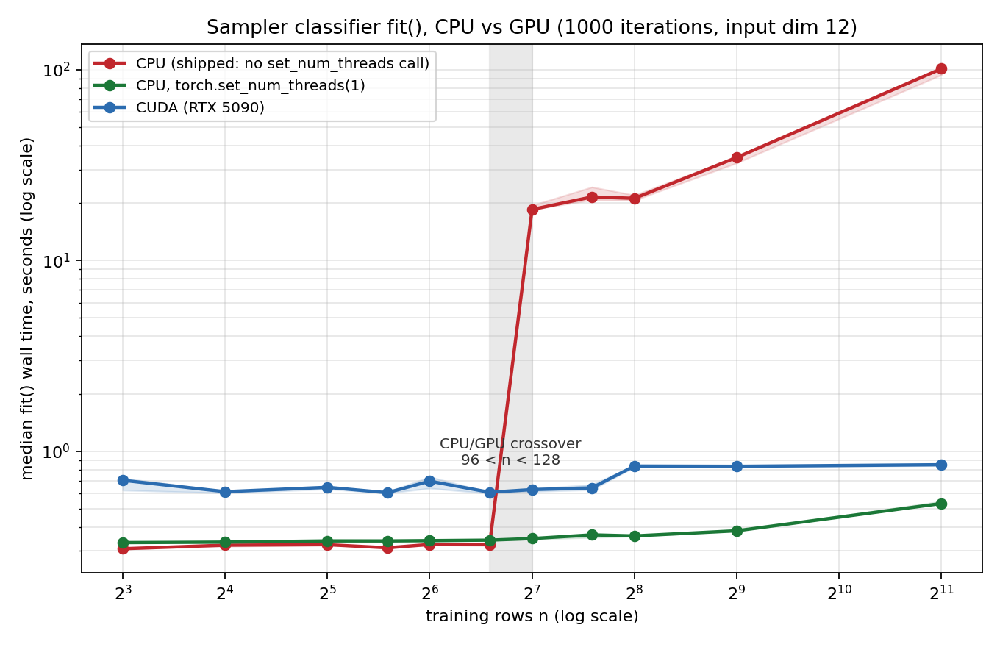
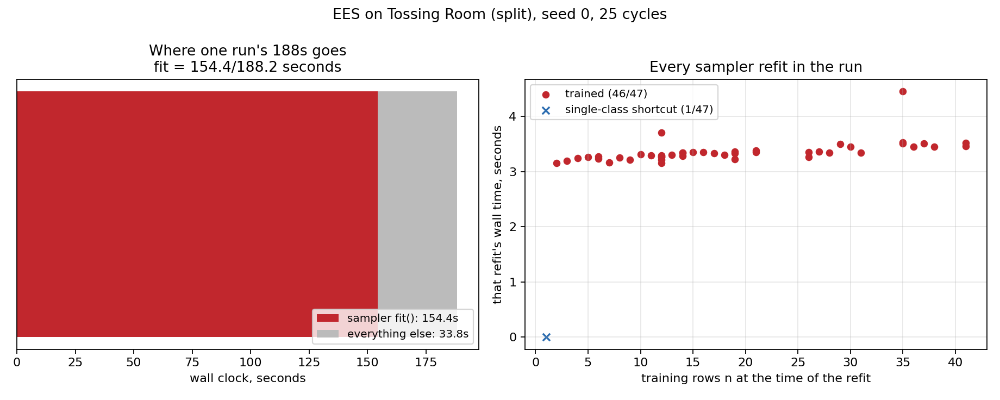

# The sampler classifier should not move to the GPU — but it should stop using 24 CPU threads

**TL;DR.** `fit()` really is where a run's time goes: **154.4/188.2 seconds** of one
25-cycle `tossingroomsplit` EES run, over 47 sampler refits. But the GPU is not the fix.
Against a CPU pinned to one torch thread, the RTX 5090 is **slower at every training-set
size measured, 8 through 2048 rows** — there is no crossover. A crossover *does* appear
against the CPU path as shipped, bracketed between **n = 96 and n = 128**, and it is not
a GPU win: it is the point where torch starts parallelising a 12→32→32→1 net across all
24 cores and the thread-barrier overhead makes the same fit **53x slower** (0.348 s at one
thread against 18.510 s as shipped). CUDA context init, which I expected to be the
decisive per-process tax, is only **~0.14 s** and turned out not to matter.
**Recommendation: do not add a device option. Pin torch to one intra-op thread instead.**





## Question / goal

`MlpBinaryClassifier` is pure CPU — no `.cuda()`, no `.to(device)`, no device handling
anywhere in the sampler stack. The machine has an idle RTX 5090 and a CUDA-enabled torch.
**Is moving the sampler's classifier to the GPU worth doing?** Two sub-questions, in the
order that decides the answer:

1. What fraction of a real run is actually spent inside `fit()`? If it is 2%, nothing
   else matters.
2. If it is large, does the GPU make `fit()` faster, and above what dataset size?

## Background

`methods/practice_makes_perfect/wrapped_sampler.py`'s `MlpBinaryClassifier` is the ported
`MLPBinaryClassifier` stack from predicators: min/max input normalization, a single-class
shortcut, and a 32×32 ReLU net — about 1,100 parameters — trained **full batch** with Adam
on binary cross-entropy. `LearnedSkillSampler.fit` refits it *from scratch* on every
observation ever made, once per skill per learning cycle, which is what
`_ClassifierWrappedSamplerLearner._learn_nsrt_sampler` does. `EesMethod._refit_samplers`
passes `max_train_iters=EesMethod.sampler_max_train_iters`, whose default is predicators'
own `10000`.

Two facts from earlier work bound the design space here:

- **Iteration count is results-affecting**, so it cannot be traded for speed.
  `docs/experiment-logs/2026-08-03-ballring-iters.md` measured that raising it from 10,000
  to 100,000 drops held-out argmax success from 0.988 to 0.930 (paired, t = 5.67, 10/10
  seeds) while train BCE falls 5.9e-3 → 2.8e-5. It is therefore held **fixed** inside
  every comparison below, and only the device varies.
- **`stats.json` byte-stability is how this project verifies a change did not alter
  results** (`tests/scripts/test_reproducibility.py`). Any speed change has to survive
  that, and cuDNN kernels are not bit-identical to CPU ones — which is a strong prior
  against a GPU path before any timing is done.

Nothing in the repo calls `torch.set_num_threads`, so every run takes torch's default:
one intra-op thread per core, 24 on this box. `scripts/run_sweep.py` then launches one
process per seed, each with its own 24-thread pool.

## Hypothesis

Recorded before measuring, and reproduced here unedited:

> 1. The GPU will be SLOWER than CPU at every n in {8..2048} at input dim 11-12 … I
>    predict NO crossover below n = 2048. If a crossover exists at all I expect it above
>    n ~ 10^4-10^5 rows, which no real run reaches. Additional per-process cost: CUDA
>    context init ~0.5-2 s, paid once per process.
> 2. I expect fit() to be a MINORITY but non-trivial share of a tossingroomsplit EES run
>    — my guess is 5-25% of wall clock.
> 3. I predict the answer is "do not implement a device option".

**Two of the three were wrong.** (2) badly — fit is the *majority* of a run, not a
minority. (1) partly — a crossover does exist, and far lower than predicted, though not
for the reason a crossover would normally mean. CUDA init was overestimated by ~10x. Only
(3), the conclusion, survived, and it survived for a different reason than the one that
motivated it.

## Guidance given

Josh's brief, condensed: measure the end-to-end share **first**, because a micro-benchmark
showing a 10x fit speedup that moves total runtime by 1% is academic. Report the crossover
n, not the ratio at one size, since the crossover is the transferable answer. Treat CUDA
context init as its own line item because it is paid per process and `run_sweep` is one
process per seed. Hold iteration count fixed. Warm up, repeat, report medians,
`torch.cuda.synchronize()` before stopping any GPU timer. Implement a device option
**only** if (1) and (2) justify it; a null result is a good outcome and saves carrying an
abstraction for nothing. Cap memory, budget concurrency — three other agents were running.

## Methods

Everything ran on the shared 24-core box with an RTX 5090, torch 2.13.0+cu130, inside
`systemd-run --user --scope -p MemoryMax=8G -p MemorySwapMax=0 -p OOMPolicy=continue`.

**End-to-end share.** `scripts/profile_sampler_fit_share.py` wraps
`MlpBinaryClassifier.fit` and `.predict_proba` in timers and then runs the ordinary CLI —
so the run measured is the run the CLI would otherwise have done. One seed:
`--env tossingroomsplit --method ees --seed 0 --num-cycles 25
--max-steps-per-interaction 100`.

**Micro-benchmark.** `scripts/bench_sampler_device.py`, medians of 3 timed repetitions
after 2 warmup repetitions, input dim 12 (measured, not assumed: every classifier row in
the profiled run was 12 wide), 1000 iterations, n from 8 to 2048. The CPU arm calls the
shipped class unmodified; the GPU arm is `CudaMlpBinaryClassifier`, which overrides
`_train` and `predict_proba` only, and which `tests/scripts/test_bench_sampler_device.py`
pins to agree with the CPU arm on the fitted probabilities to 1e-4. Early stopping is
disabled in both arms (`n_iter_no_change = 10**9`) so both execute exactly 1001
iterations — a device-dependent early stop would confound iteration count with device.
`torch.cuda.synchronize()` brackets every GPU timing.

**Threads.** A third arm re-runs the identical CPU grid with `torch.set_num_threads(1)`.
This is a *separate arm*, never pooled with the default CPU arm.

**CUDA context init.** Measured in a **fresh process per sample**, five samples, since it
is a per-process cost.

**Byte-reproducibility.** Seed 0 re-run through a wrapper that calls
`torch.set_num_threads(1)` before `Cli.main`, with no change to `src/`, and its
`stats.json` compared byte-for-byte against the baseline run's.

## Results

### 1. `fit()` is 154.4/188.2 seconds of a real run

47 refits in one 25-cycle run, of which **46/47 actually trained** (1/47 took the
single-class shortcut, which returns without building a net). Median trained refit: 3.33 s
(min 3.15, max 4.45). Training sets were small and 12 columns wide: **2 to 41 rows**,
median 16. `predict_proba` — 235 calls, scoring 100 candidates each — cost **0.0 s in
total**, so all of the cost is training, none of it scoring.

Two consequences. A `fit()` speedup does move total runtime, so the question was worth
asking. And the real training sets a 25-cycle run reaches (≤41 rows) sit *below* the
threshold where anything interesting happens.

### 2. There is no crossover against a one-thread CPU

Median seconds per `fit()`, input dim 12, 1000 iterations, 3 repetitions:

| n rows | CPU as shipped | CPU, 1 thread | CUDA (RTX 5090) |
| ---: | ---: | ---: | ---: |
| 8 | 0.308 | 0.332 | 0.704 |
| 16 | 0.321 | 0.334 | 0.613 |
| 32 | 0.323 | 0.338 | 0.647 |
| 48 | 0.312 | 0.338 | 0.606 |
| 64 | 0.324 | 0.340 | 0.696 |
| 96 | 0.324 | 0.342 | 0.609 |
| 128 | **18.510** | 0.348 | 0.629 |
| 192 | **21.534** | 0.364 | 0.642 |
| 256 | **21.171** | 0.359 | 0.836 |
| 512 | **34.688** | 0.382 | 0.833 |
| 2048 | **101.259** | 0.532 | 0.849 |

**Against the one-thread CPU arm there is no crossover at any measured n.** CPU grows
smoothly from 0.332 s to 0.532 s across a 256x increase in rows — the work really is
negligible next to the per-iteration Python and autograd overhead — and stays below the
GPU's 0.61–0.83 s throughout. The GPU line is essentially flat in n, which is the
signature of a launch-bound loop: ~30 tiny kernel launches per iteration, plus a forced
device synchronization every iteration from the `loss.item()` the best-loss checkpoint
needs.

**Against the CPU as shipped there is a crossover, bracketed between n = 96 and
n = 128** — and it is a CPU pathology, not a GPU win. At n = 128 the shipped path is
**53x slower than the same fit at one thread** (18.510 s against 0.348 s), and by
n = 2048 it is **190x slower** (101.259 s against 0.532 s). Below the threshold the two
CPU arms are within 6% of each other and I would not claim a difference between them.

The mechanism is threading, established directly: at n = 16, fits at 1, 2, 4, 8 and 16
torch threads all cost 0.32 s, while an explicit `set_num_threads(24)` costs 12.0 s. For a
12→32→32→1 net, the barrier cost of fanning each iteration across every core swamps the
arithmetic. **Caveat on the absolute numbers:** the shipped-CPU arm above the threshold was
measured on a box carrying another agent's run (1-minute load 20–26), so the 18–35 s
figures are contended-machine numbers and would be smaller on an idle box. The one-thread
arm was stable at 0.31–0.38 s across every load I measured, from 11 to 26 — and a shared
box is the condition sweeps actually run under.

### 3. CUDA context init is ~0.14 s per process, not the tax I predicted

Five fresh processes: context creation 0.077–0.088 s, first cuBLAS matmul 0.060–0.063 s.
Real, but an order of magnitude below my 0.5–2 s prior, and it does not change any
conclusion here. Reported because I said I would measure it separately, and because the
prediction was wrong.

### 4. Byte-reproducibility: the thread fix survives it, a GPU path cannot

**The one-thread CPU path is byte-identical.** Seed 0 re-run with
`torch.set_num_threads(1)` produced a `stats.json` with the same md5 as the baseline run's
(`906d3930187d3cb8d3cecb5e9ac57ac1`), so `tests/scripts/test_reproducibility.py`'s
guarantee is untouched by the change recommended below.

**A GPU path could not be.** Fitting the same data with the same seed on both devices and
comparing the resulting scores: **0/10 seeds bit-identical**, worst absolute score
difference 3.577e-05. That is far coarser than byte-identity, and since those scores feed
an argmax over candidates, some of those differences will flip a choice and change the
run. `stats.json` byte-stability is how this project verifies a change did not alter
results, so this is disqualifying on its own, independently of the timings above.

## Recommendation

1. **Do not add a device option to `wrapped_sampler.py`.** The GPU loses to a single CPU
   thread at every dataset size measured, the real datasets are 2–41 rows, and a GPU path
   would have to thread the device through `predict_proba` as well as `_train` — the
   benchmark subclass could not get away with overriding one method, which is the cheapest
   possible evidence of how invasive the real change would be. Set against that, it breaks
   `stats.json` byte-stability outright (0/10 seeds bit-identical) for no speed.
2. **Pin torch to one intra-op thread**, as its own PR. This is the finding worth acting
   on. It is a no-op for a 25-cycle run (≤41 rows, already below the threshold), but a
   250-cycle run reaches several hundred rows per sampler and crosses it, at which point
   every refit costs tens of seconds instead of a third of a second. That PR should carry
   the byte-identical `stats.json` check as its evidence, and should decide deliberately
   between `torch.set_num_threads(1)` in the process entrypoint and an `OMP_NUM_THREADS`
   setting in `run_sweep`; this experiment does not settle which.
3. **Do not chase the GPU again without re-reading result 2.** The one number that looks
   like it argues for a GPU — 18.5 s against 0.63 s at n = 128 — is a threading artifact
   on the CPU side. Fix that and the GPU is behind everywhere.

## Reproducing

```bash
scripts/with_env.sh python scripts/profile_sampler_fit_share.py \
  --profile-out fitshare.json \
  --env tossingroomsplit --method ees --seed 0 \
  --num-cycles 25 --max-steps-per-interaction 100 --output-dir run/

scripts/with_env.sh python scripts/bench_sampler_device.py \
  --out bench_default.json --reps 3 --dims 12 --iters 1000 \
  --ns 8 16 32 48 64 96 128 192 256 512 2048
scripts/with_env.sh python scripts/bench_sampler_device.py \
  --out bench_threads1.json --reps 3 --dims 12 --iters 1000 --devices cpu --threads 1 \
  --ns 8 16 32 48 64 96 128 192 256 512 2048

scripts/with_env.sh python -m analysis.practice_makes_perfect.sampler_device_bench \
  --bench-json bench_default.json bench_threads1.json \
  --out docs/experiment-logs/2026-08-06-sampler-gpu-crossover.png
scripts/with_env.sh python -m analysis.practice_makes_perfect.sampler_fit_share \
  --profile-json fitshare.json \
  --out docs/experiment-logs/2026-08-06-sampler-gpu-fit-share.png
```

The recorded JSON for the run written up here is committed alongside this file as
`2026-08-06-sampler-gpu-bench-default.json`, `2026-08-06-sampler-gpu-bench-threads1.json`
and `2026-08-06-sampler-gpu-fitshare.json`, and both figures are regenerated from exactly
those files.

One honesty note about provenance: the recorded grid was collected with the benchmark
logic before it was tidied into `scripts/bench_sampler_device.py`, so the committed JSON's
top-level metadata keys were renamed to the committed script's schema when it was copied
in. The per-row schema and the timing code are unchanged, and the committed script was
re-run afterwards on two grid points as a check — n = 16 gave 0.308 s CPU / 0.605 s CUDA
against the recorded 0.321 / 0.613, and n = 96 gave 0.323 / 0.620 against 0.324 / 0.609.
