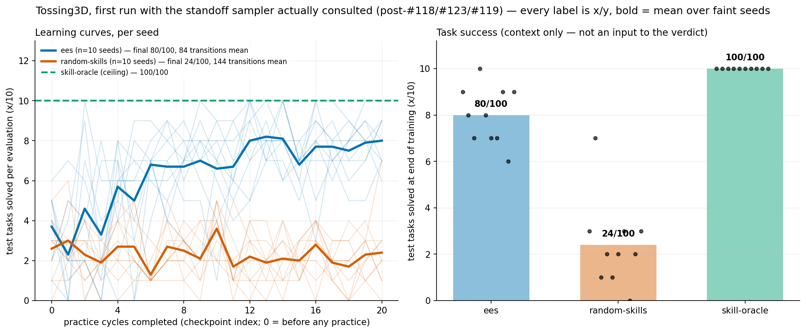
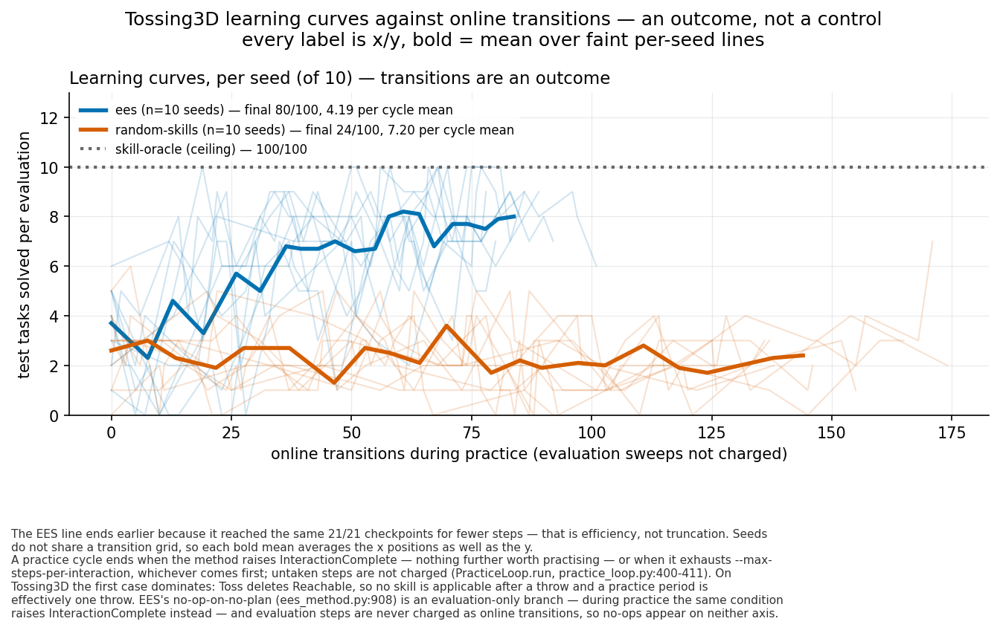
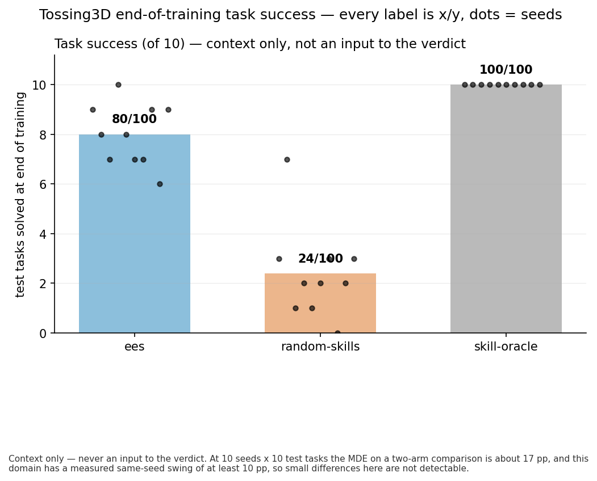
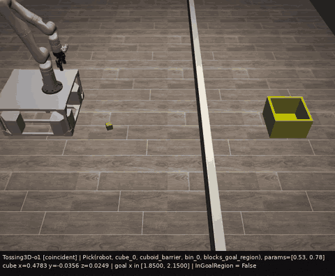
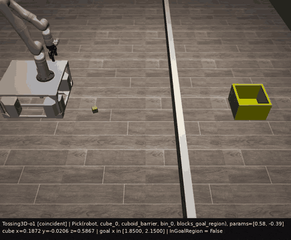

# Tossing3D, EES vs uniform vs oracle: the first run where the sampler is consulted

> **STALENESS NOTE (added 2026-08-10, after the barrier-collision fix to
> `THROW_STANDOFF_BOUNDS`).** Every count and ratio below — `65/142`, `32/65`, `19/60`,
> `18/19`, `48/275`, both task-success rows, and everything else that traces back to
> `MoveToThrowPose`'s practice — was measured with `THROW_STANDOFF_BOUNDS = (0.45, 1.75)`,
> a 1.30 m-wide sampler range. That lower bound turned out to be unsafe: `move_to_target`'s
> base motion planner has collision-checking hardcoded off upstream, and a standoff up to
> 1.00 m (measured, three ways) drives the base through `cuboid_barrier` — a real dynamic
> MuJoCo body — and knocks it over. The bound is now `1.10`, `BARRIER_COLLISION_MARGIN`
> (0.10 m) above that worst measured collision, so the sampler's range is `0.65` m wide,
> roughly half of what it was here, and the derived acceptance band's own share of that
> range roughly doubled (~17% → ~35%). A narrower range with a proportionally larger
> solving band is a different, likely *easier*, sampling problem than the one this file
> measured, so none of the counts below are directly comparable to a future re-run.
>
> **Nothing above or below is edited or recomputed.** This is a correct description of the
> range that was actually in effect when these runs happened.

**Everything in this file up to and including `Method (to be run, not yet run)` was
committed before any run of this experiment existed**, in the manner of the
pre-registrations for PR #103, PR #108 and PR #127. Results are appended below it, and
nothing above them is edited afterwards except this header.

## Question / goal

Does EES learn Tossing3D's throw standoff, now that the standoff sampler is graded on a
label that can actually fail?

## Background

Every previously published Tossing3D number — `24/90`, `33/90` (#99), `19/100`, `21/100`
(#108), the `543/2700` uniform-draw baseline (#105), and both arms of #127 — measured a
domain in which **the relevant sampler was never consulted**. Three defects, in the order
they were found, all now on `main` at `ebf3d92`:

- **#118 / #99** — `skills.py` declared `Variable(name="?robot")` while `PddlWriter` owns
  the `?` sigil, so every emitted PDDL domain carried `??robot` and Fast Downward's
  translator exited 31 while still parsing the domain. `0/6` symbolic states were
  plannable before the fix, `6/6` after. Without it `--method ees` plans nothing here at
  all.
- **#123** — `NearBinClassifier` accepted `low - tol <= dx <= high + tol` with `low`/`high`
  read straight off `THROW_STANDOFF_BOUNDS`, **the identical symbol `skills.py` samples
  the standoff from**. Every draw the sampler could make therefore satisfied the skill's
  own add effect by construction. Measured over 10 seeds in #127: `MoveToThrowPose` scored
  `175/175` labelled success on `0/175` informed draws, its measured success rate pinned
  at exactly `1.0`, so `skip_perfect` scored it `-inf` and `choose_practice_target` never
  selected it at all. The predicate is now `RobotAtSuccessfulThrowPose`, deriving its
  acceptance band per call from the live goal-region bounding box with only
  `THROW_RANGE = 1.275` calibrated; #123 also absorbed #105's widened bounds
  `(0.45, 1.75)`.
- **#119** — the practice tally previously pooled "this skill has no sampler"
  (`param_dim == 0`) together with "a sampler was consulted and could not discriminate".
  `SamplerConsultation` now separates `NO_SAMPLER` / `UNINFORMATIVE` / `INFORMED` /
  `EPSILON_RANDOM`. That undifferentiated pool is how the above stayed invisible across
  three experiments.

So there is no usable baseline in the literature of this repo. `24/90`, `33/90`, `19/100`
and `21/100` are all measurements of uniform sampling, and `543/2700` was measured under
bounds that #123 changed. **Every arm here is re-measured from scratch.**

The mechanism the fix turns on: `MoveToThrowPose`'s add effect can now fail, so its
training set has two classes, so `MlpBinaryClassifier.fit` no longer takes its
`np.all(y_data == 1)` single-class shortcut, so `LearnedSkillSampler.sample` no longer
finds its maximum attained by every candidate and no longer falls through to a uniform
draw with `was_informed = False`. And because the measured success rate is no longer
exactly `1.0`, `skip_perfect` no longer scores the skill `-inf`, so
`choose_practice_target` can select it.

## What a win here would and would not mean

`bin_init_region` is degenerate — the bin does not move between episodes — so **the
correct standoff is a constant**. A positive result here demonstrates **sampler learning
in the sense of finding and memorising a constant**. It does **not** demonstrate
representation learning, which would require the target to be a function of observable
state, and it does not address #99's separate standing concern that there is nothing here
for a state-conditioned sampler to condition *on*. Josh took this trade deliberately
("memorizing sampler is ok"). No result below may be written up as more than this.

## Hypotheses

**H1 (primary, structural).** With the label fixed, `MoveToThrowPose`'s sampler
discriminates: EES's `MoveToThrowPose` succeeds at a higher rate than the same skill under
uniform draws (`random-skills`), by more than the MDE on those two denominators.

**H2 (primary, within-run).** In EES's own runs, informed draws succeed more often than
epsilon-random draws of the same skill — the sampler's stated belief beats the uniform
prior it would otherwise fall back to.

**H3 (secondary, provisional).** EES's end-of-training task success exceeds
`random-skills`'. Marked provisional in advance for two independent reasons given under
"Noise floor" below, and **no conclusion here rests on it**.

**Ceiling check (not a hypothesis).** `skill-oracle` reaches approximately `100/100`,
confirming the domain is solvable at these settings and that any shortfall is the method's
and not the environment's.

## Pre-flight pass condition, checked before the full sweep

#123's own 3-seed / 20-cycle probe measured `MoveToThrowPose` at `54/121` succeeded,
`36/56` informed, and `121` attempts against `Pick`'s `60` — i.e. it went from never being
selected to being the most-practised skill in the domain. That is an unusually strong
prior, and it is cheap to check.

**Gate: a 3-seed, 20-cycle EES probe must show pooled `MoveToThrowPose`
`num_informed_attempts > 0`.** If it does not, something regressed between #123's probe
and the merge, the full sweep would be wasted, and the run stops there and reports the
regression as `x/y`.

Reported alongside the gate, but not gating: whether `MoveToThrowPose`'s attempt count
exceeds `Pick`'s, reproducing "most-practised skill in the domain".

**There is no positive control available in this experiment, and that is a real
limitation.** `Pick` was #127's control, but at `57/60` it now ties and falls back to
`0/0` informed — the same tie-and-fall-back state on a different skill that #123 fixed for
`MoveToThrowPose`. So "the sampler never made an informed draw" and "the instrument cannot
see informed draws in this build" are no longer separable by a within-run control. They
are instead separated by the `random-skills` arm, which exercises the same tally code, and
by the pre-flight gate above. Stated here rather than discovered later.

## Noise floor, and why H3 is provisional in advance

1. **Tossing3D has been measured as not reproducible from `--seed`** — seed 0 run twice
   under identical arguments and identical code gave `3/10` and `2/10`, a same-seed swing
   of at least 10 pp. #127 then observed its own arm A reproduce #108 exactly, per seed
   and in aggregate, which contradicts that. **The contradiction is unresolved and is not
   resolved here.** No claim below may rest on a task-success difference smaller than
   10 pp.
2. **The task-success axis is underpowered at this design** (see MDEs). H1 and H2 read
   counts of skill executions with denominators in the hundreds, which neither the seed
   defect nor the small evaluation set moves.

## Minimum detectable effects

Every MDE is derived from its own two denominators as
`2.801585 · √(p̄(1−p̄)(1/n₁ + 1/n₂))` — the two-sided 5%, 80%-power normal approximation,
where `2.801585 = z₀.₉₇₅ + z₀.₈₀`. Planning values below; **each is recomputed against the
realized denominators when results are in**, and the recomputed value is what is reported.

| comparison | n₁ | n₂ | planning p̄ | MDE |
| --- | --- | --- | --- | --- |
| H3: task success, EES vs `random-skills` (10 seeds × 10 test tasks each) | 100 | 100 | 0.25 | **17.2 pp** |
| H3: task success, EES vs `skill-oracle` | 100 | 100 | 0.60 | **19.4 pp** |
| H1: `MoveToThrowPose` success rate, EES vs `random-skills` (≈400 attempts/arm at #123's probe rate) | 400 | 400 | 0.30 | **9.1 pp** |
| H2: informed vs epsilon-random draws within EES (≈200 each) | 200 | 200 | 0.50 | **14.0 pp** |

The first row is the important one to read before any result is quoted: **at 100 vs 100
evaluation episodes, nothing under about `17/100` is detectable at all.** H3 is therefore
registered as descriptive unless the gap is large, and a non-significant H3 is a statement
about this design's power, not evidence of no effect.

## Amendment 1, made before any result was read

**Registered while the pre-flight probe was still running and before a single number from
it had been looked at.** Recorded here rather than folded silently into the rule above,
so the sequence stays auditable.

`RandomSkillsMethod.practice_outcomes()` is not overridden and therefore returns `{}` —
the concrete default on `Method`, whose docstring is explicit that `{}` means "this Method
does not measure practice at all", as distinct from a present zero-attempt entry. So the
`random-skills` arm records **no `MoveToThrowPose` tally at all**, and `U` as originally
defined — that arm's own `S/A` for the standoff — does not exist and cannot be computed.
This was found by reading `random_skills_method.py`, not by running it.

**`U` is therefore redefined as EES's own non-informed draws of the same skill**:
`num_random_attempts` (the epsilon-greedy coin flip) plus the uninformative fallback,
both of which are uniform draws over `THROW_STANDOFF_BOUNDS` by construction. Three
reasons this is a better reference than the one it replaces, not merely an available one:

1. It is **within-run and within-seed** — same code, same scene seeds, same cycle
   structure — so it removes the cross-arm confound the original rule carried.
2. It is the comparison H2 already registered, so the two primary hypotheses collapse into
   one test rather than one being dropped.
3. It is the same asymmetry #127 used as a signature of the deviation-6 path, so it is
   measured on a quantity this domain is already known to expose.

The rule below is otherwise unchanged: same thresholds, same MDE formula, same Fisher
test, same `undecided` cell. `random-skills` remains an arm and remains the **task-success**
baseline for H3 — that is what it was needed for and it still serves it. What it cannot do
is provide a standoff label rate.

**H1 is restated** as: EES's informed draws of `MoveToThrowPose` succeed at a higher rate
than its own non-informed draws of the same skill, by more than the MDE on those two
denominators. MDE at the anticipated denominators (≈187 informed against ≈217 non-informed,
scaling #123's probe to 10 seeds), planning `p̄ = 0.45`: **13.9 pp**.

## Decision rule

Applied to `MoveToThrowPose` pooled over 10 seeds, from `practice_outcomes_per_cycle`.
Let `A` be attempts, `S` successes, `I` informed attempts, `IS` informed successes, and
let `U` be the `random-skills` arm's own `S/A` for the same skill — the uniform-draw
reference, measured in this experiment rather than quoted from #105.

| conclusion | rule |
| --- | --- |
| **regressed** | `I == 0` — the pre-flight gate failed, or the full sweep contradicts it; report and stop |
| **learns the constant** | `I/A >= 0.20` **and** `S/A − U >= ` its MDE **and** Fisher's exact `p < 0.05` on that 2×2 |
| **consulted but no better than uniform** | `I/A >= 0.20` **and** `S/A − U <` its MDE — the sampler states a belief and the belief is not worth more than the prior |
| **starved** | `0 < I/A < 0.20` — the classifier discriminates only occasionally; report the per-cycle trend and the run that would settle it |
| **undecided** | anything else |

`undecided` is a real outcome and will be reported as one, with the run that would settle
it, rather than rounded to whichever neighbouring cell is nearest. A null or ambiguous
result reported plainly is the deliverable; an overstated one is a retraction later.

Tests: **Fisher's exact** (two-sided) for the unpaired 2×2 count comparisons, since the
counts are small and no normal approximation is wanted; **exact paired Wilcoxon
signed-rank** for per-seed pre-versus-post within an arm, since arms share the seed set
and unpaired treatment there would throw that structure away. Both are exact by
enumeration — scipy is not a dependency of this project, and
`PairedTests.wilcoxon_signed_rank` already exists in `analysis/`.

Pooling `x/y` across seeds and then testing it treats draws as exchangeable across seeds,
which they are not. So **every pooled count is reported beside its per-seed spread**, and
the figure plots per seed. At 2,500 transitions on Tossing Room the ten seeds spanned
`0/14` to `14/14`, and a pooled number there described no seed that was actually run.

## Method (to be run, not yet run)

Three arms, 10 fixed seeds each (`0-9`), every run driven by `scripts/run_sweep.py` —
never a hand-rolled loop, never a bare CLI invocation.

| arm | `--method` | why |
| --- | --- | --- |
| **EES** | `ees` | the arm of interest |
| **uniform** | `random-skills` | a **fresh** uniform baseline. `543/2700` and `155/330` were measured under the pre-#123 bounds and do not transfer |
| **ceiling** | `skill-oracle` | sanity check that the domain is solvable at these settings |

Shared: `--num-test-tasks 10`. EES and `random-skills` additionally get `--num-cycles 20
--max-steps-per-interaction 20`, which is #108's and #127's protocol, so the practice
budget is comparable to theirs. `skill-oracle` takes neither flag (it does not accept
them) and runs as a single evaluation sweep.

Run under the KINDER venv (`../kinder-venv`, never `hitl-pmp`), with `MUJOCO_GL=egl
PYOPENGL_PLATFORM=egl`, `PYTHONPATH` at **this worktree's** `src/`, and every sweep inside
`systemd-run --user --scope -p MemoryMax=16G -p MemorySwapMax=0 -p OOMPolicy=continue` —
a planner grounds a fresh PyBullet sim per sampling attempt, and this box's
`DefaultOOMPolicy=stop` means a kernel OOM takes down the whole session.

`--max-workers` is chosen at launch from the measured machine-wide load, targeting ~22
concurrent runs across every agent on the box, and the value chosen is recorded with its
reason. Concurrency has been separately measured not to perturb results, so yielding cores
costs wall clock only.

All three arms' raw data — `stats.json`, `config_snapshot.json` and `timing.json` for
every run — is committed. #103 committed none of its own and is now unre-analysable, which
cost a 20-minute re-run.

---

# Results

Everything below was produced after the pre-registration and Amendment 1 above were
committed (`15ef33f` and `2bfca24`).

## The pre-flight gate: passed

3 seeds, 20 cycles, `--max-steps-per-interaction 20`, `--num-test-tasks 10`. Raw data in
`2026-08-06-tossing3d-ees-first-real-data/preflight-probe/`.

| lifted skill | `param_dim` | attempts | succeeded | informed draws | informed succeeded | epsilon-random |
| --- | --- | --- | --- | --- | --- | --- |
| **`MoveToThrowPose`** (the standoff) | 1 | **142** | 49/142 | **65/142** | **32/65** | 57/142 |
| `Toss` (adds `InGoalRegion`) | 0 | 47 | 47/47 | 0/47 | — | 0/47 |
| `Pick` | 2 | 60 | 54/60 | 19/60 | 18/19 | 13/60 |

**The gate required `num_informed_attempts > 0` and got `65/142`.** The non-gating check
also reproduced: `MoveToThrowPose` was practised **142 times against `Pick`'s 60**, i.e.
it is the most-practised skill in the domain, exactly as #123's own probe found (`121`
against `60`). Both the counts and the ratio line up with that probe, at a different
number of evaluation episodes.

**One correction to the brief this experiment was commissioned under.** It stated that
`Pick` is no longer usable as a control because it "ties at `57/60` and falls back,
showing `0/0` informed". In these runs `Pick` scores `54/60` and makes **`19/60` informed
draws, of which `18/19` succeeded** — so it has *not* tied here, and a within-run positive
control does exist after all. That is reported as a departure from what was expected
rather than quietly relied upon; the verdict below still does not need it, because
Amendment 1's reference is internal to `MoveToThrowPose` itself. It does, however, mean
"the instrument cannot see informed draws" is independently excluded: two different
skills' samplers report them in the same `stats.json`.

Applying the decision rule to the probe alone — 3 seeds, so this is a preview and not the
result — gives **learns the constant**: informed draws landed `32/65` against the same
arm's uniform draws at `17/77`, a gap of `+27.2` pp against an MDE of `22.4` pp on those
denominators, Fisher exact `p = 0.0008057`.

Task success over the 3 probe seeds moved `10/30` pre-practice to `24/30` at end of
training (per seed `9/10`, `8/10`, `7/10`). Reported as context only; the 10-seed arm
below is what the pre-registration commits to, and the task-success axis is provisional
for the two reasons registered above.

## What was actually run

`scripts/run_sweep.py`, `--env tossing3d --methods ees random-skills skill-oracle
--num-seeds 10`, shared `--num-test-tasks 10`, with `--num-cycles 20
--max-steps-per-interaction 20` given to `ees` and `random-skills` only (`skill-oracle`
rejects both flags). KINDER venv, `MUJOCO_GL=egl`, inside `systemd-run --user --scope
-p MemoryMax=16G -p MemorySwapMax=0 -p OOMPolicy=continue`. **`30/30` runs succeeded.**

`--max-workers 8`, chosen from measured load rather than the default: the box already
carried 15 runs from another agent, and `8 + 15 = 23` sits at the ~22 machine-wide budget.
Recorded by `analysis/run_timing.py`: `2805.4 s` wall for the sweep, median `844.7 s` per
run. Concurrency has been separately measured not to perturb results, so this cost wall
clock only.

**Provenance was verified per run, not assumed from the path.** All 30 `config_snapshot.json`
files were checked to be `env=tossing3d` with the intended `num_cycles`,
`max_steps_per_interaction`, `num_test_tasks` and `task_config=coincident`. That check
earned its keep: the session scratchpad is **shared between agents**, a generic `sweep.sh`
there was overwritten by another agent's script of the same name and executed by mistake,
and the equally generic `probe/` directory turned out to contain a second agent's `never/`
and `scheduled/` arms alongside mine. Nothing foreign entered any number below — the
analysis only ever reads `ees/`, `random-skills/` and `skill-oracle/` — but the near miss
is the reason the check exists.

## The verdict: learns the constant

Pooled over 10 seeds, every cell an `x/y` count of skill executions.

| lifted skill | `param_dim` | attempts | succeeded | informed draws | informed succeeded | epsilon-random | unparameterized |
| --- | --- | --- | --- | --- | --- | --- | --- |
| **`MoveToThrowPose`** (the standoff) | 1 | **481** | 165/481 | **206/481** | **117/206** | 188/481 | 0/481 |
| `Toss` (adds `InGoalRegion`) | 0 | 156 | 150/156 | 0/156 | — | 0/156 | 156/156 |
| `Pick` | 2 | 200 | 180/200 | 29/200 | 27/29 | 27/200 | 0/200 |

Against the amended decision rule:

- `I/A = 206/481 = 0.428 >= 0.20` — the sampler is consulted **and discriminates**, in
  quantity.
- Informed draws land **`117/206`**; the same arm's own uniform draws land **`48/275`**.
  A gap of **`+39.3` pp** against an **MDE of `12.3` pp** on those two realized
  denominators, and **Fisher exact `p = 1.968e-19`**.

That is the **learns the constant** cell, on all three clauses, with no cell adjacent.

**And it is not one seed's doing.** All `10/10` seeds have a higher informed rate than
their own uniform rate — visible in the left panel as ten non-crossing lines:

| seed | informed | uniform (same run) | attempts | pre-practice | end of training | `Toss` landed |
| --- | --- | --- | --- | --- | --- | --- |
| 0 | 10/21 | 6/21 | 42 | 1/10 | 9/10 | 16/16 |
| 1 | 10/18 | 6/26 | 44 | 5/10 | 8/10 | 16/16 |
| 2 | 12/26 | 5/30 | 56 | 4/10 | 7/10 | 15/15 |
| 3 | 12/16 | 4/27 | 43 | 2/10 | 10/10 | 15/15 |
| 4 | 12/18 | 6/30 | 48 | 4/10 | 8/10 | 16/17 |
| 5 | 11/17 | 4/19 | 36 | 2/10 | 7/10 | 13/13 |
| 6 | 13/20 | 4/26 | 46 | 3/10 | 7/10 | 13/14 |
| 7 | 14/25 | 5/25 | 50 | 5/10 | 9/10 | 16/19 |
| 8 | 10/23 | 4/44 | 67 | 5/10 | 6/10 | 13/14 |
| 9 | 13/22 | 4/27 | 49 | 6/10 | 9/10 | 17/17 |

**`MoveToThrowPose` is also now the most-practised skill in the domain** — `481` attempts
against `Pick`'s `200` and `Toss`'s `156`. Before #123 it was scored `-inf` by
`skip_perfect` and `choose_practice_target` never selected it at all. So the fix changed
both halves: the sampler can now learn, and EES now chooses to teach it.

**Learning curves against practice cycles** — the controlled variable, so the arms align and
are compared like with like:

**Learning curves against online transitions** — an outcome, so the EES line ends earlier,
having reached the same `21/21` checkpoints for fewer steps:

**End-of-training task success** — context only, never an input to the verdict:

> **The three pins above are to `68eaf0a`, an unmerged commit on this branch.** It is
> the commit that carries the figures, taken from `git rev-parse` rather than hand-expanded.
> They must be **re-pinned after merge**, since a squash-merge mints a new SHA and the branch
> commit stops being reachable once the branch is deleted.

### Figure revision 2: both axes are drawn, as two separate graphs

The three figures above replace the two-panel figure this log previously carried. **No number
changed**: they are regenerated from the same committed `stats.json`, and the analysis prints
the identical `117/206`, `48/275`, `165/481`, `80/100`, `24/100` and `100/100`.

Revision 1 (below) removed the transitions axis on the grounds that it made the *more*
efficient arm look truncated. That reasoning was sound about the reading, but the fix was too
strong: it deleted a real result instead of labelling it. **Both axes are now drawn, each as
its own graph**, because on this domain they are not two views of the same curve.

**Verified non-proportional, from the committed `stats.json` rather than assumed.** If a cycle
cost a fixed number of transitions, the two axes would be the same curve with relabelled
ticks and only one would be worth drawing. Measured here:

| | `ees` | `random-skills` |
| --- | --- | --- |
| transitions per cycle, per-seed range | `3.45`–`5.05` | `4.60`–`8.70` |
| transitions per cycle, mean over 10 seeds | **`4.19`** | **`7.20`** |
| final transitions, per-seed range | `69`–`101` | `92`–`174` |
| seeds sharing a transition grid | `0/10` — 8 distinct finals | `0/10` — 10 distinct finals |
| within-seed per-cycle step range | `1`–`20` | `1`–`20` |

Every seed sits on its own irregular grid, and the step from one checkpoint to the next varies
by a factor of twenty *within a single seed*. **Contrast Tossing Room**, where every run
charged exactly `150.0` transitions per cycle: there a sibling analysis correctly declined to
draw a cycles graph, because it would have been the transitions graph with different tick
labels. That refusal does not transfer here, and the table above is why.

So the two graphs answer different questions, and both are worth having:

- **Against cycles** the arms align by construction — both ran `--num-cycles 20`, both have
  `21/21` checkpoints — so the comparison is like with like.
- **Against transitions** the EES line ends at about `84` where `random-skills` runs on to
  about `144`. That is EES reaching the same checkpoints for fewer steps, and it is the
  efficiency result, not an artefact. Each graph's legend carries the other's number, so
  neither view loses it.

One drawing consequence, stated on the transitions figure itself: since the seeds share no
transition grid, each bold mean **averages the x positions as well as the y**. Taking one
seed's grid instead would draw the mean at transition counts no seed actually reached.

**Task success is unchanged** beyond moving to its own canvas, and the dropped
"does the sampler's belief beat its own prior?" panel **stays dropped** — its `48/275` uniform
against `117/206` informed comparison remains the headline result in the TL;DR, in the table
above, in `verdict`'s evidence string and in this log.

> **Correction to revision 1's no-op paragraph (below).** That paragraph states that a no-op
> "*does* consume a step and *does* count as a transition", and so lengthens a cycle. **That is
> wrong for the code this experiment ran**, and the claim should not be reused. `_noop_action`
> is called at exactly one site (`EesPolicy.step`, `ees_method.py:908`), and it is reached only
> when `self._practicing` is false — that is, inside an *evaluation* episode. During practice
> the same "no plan" condition raises `InteractionComplete` instead (`ees_method.py:897-903`),
> which **shortens** the period. And evaluation steps are deliberately never charged as online
> transitions at all (`PracticeLoop.run`, `practice_loop.py:150-152`). So a no-op appears on
> **neither** axis, and nothing lengthens a practice cycle beyond `--max-steps-per-interaction`.
> The original paragraph is left in place below rather than rewritten, so what was published
> and why it is wrong both stay visible. Nothing measured in this log depends on it: it was an
> explanatory aside, and the transitions and cycle counts it purported to explain are read
> straight from `stats.json`.

### Figure revision 1: the learning curves are plotted against cycles, not transitions

*(Historical: this describes the two-panel figure revision 1 produced, which revision 2 above
has since replaced with three separate graphs. Kept because it records why the cycles axis was
introduced.)*

The cycles figure above is a revision of the one first committed here. **No number changed** — it
is regenerated from the same `stats.json` files, and the analysis prints the identical
`117/206`, `48/275`, `165/481`, `80/100`, `24/100` and `100/100` reported throughout this
log. Three things about the drawing changed.

**The x-axis was wrong in a way that inverted the reading.** The learning curves were
plotted against online transitions. Both learning arms ran `--num-cycles 20` and so have
**21/21 evaluation checkpoints each**, but they reach them at very different costs: EES
finishes at **69–101** transitions (mean 83.8), `random-skills` at **92–174** (mean 144.0).
Per practice period that is **4.19** transitions for `ees` against **7.20** for
`random-skills` averaged over all 10 seeds (**3.90** against **6.85** on seed 0). On a
transitions axis EES's curve therefore stopped at about half the panel width while the axis
ran on to 175 — it **looked truncated when it was in fact more efficient**. Transitions are
an *outcome* of how well an arm plans, so plotting against them penalises the arm that
wastes fewer. Cycles are the controlled variable and are now the axis; both curves span it
fully, and mean final transitions are kept in the legend, which is where that efficiency
difference belongs as a number rather than as a distortion of the axis.

**Why a cycle costs a variable number of transitions.** A cycle ends when the method raises
`InteractionComplete` — nothing further worth practising — or when it exhausts
`--max-steps-per-interaction`, whichever comes first. Untaken steps are not charged. On
Tossing3D the first case dominates: `Toss` deletes `Reachable`, so no skill is applicable
after a throw and a practice period is effectively one throw. Cycles are therefore equal in
count across arms but not in transitions.

Two mechanisms pull in opposite directions here and are easy to confuse, so both are stated:
`InteractionComplete` **shortens** a cycle — the policy signals it is done, the loop breaks,
and the untaken steps are explicitly not charged, the count being data-driven rather than
budget-driven. A **no-op lengthens** one: when the planner finds no plan EES emits a no-op
action, which *does* consume a step and *does* count as a transition (the path #102
corrected). The early exit here is the method declaring nothing is worth practising — not
the agent getting stuck and not the planner no-opping out.

Cycles are also the only axis the seeds *within* one arm share. All 10 EES seeds sit on 10
distinct transition grids, as do all 10 `random-skills` seeds, so a per-checkpoint mean on
a transitions axis had to average the x positions as well as the y. On the cycle grid the
seeds align by construction.

**The third panel is gone.** It plotted EES's `48/275` uniform standoff draws against its
`117/206` informed ones. That comparison is still this experiment's headline result and is
unchanged above, in `verdict`'s evidence string and in the table — a two-point comparison is
carried better by a sentence than by a chart.

**The format now matches the reset-free curve figure** (#130): all arms on one axes, a bold
mean over faint per-seed lines, the Okabe-Ito palette the siblings in
`analysis/practice_makes_perfect/` already use, `x/y` in every legend entry and axis label,
and both panels on the same `x/10` count scale rather than one of them on a 0–1 rate.

One latent defect was fixed with it: the pooled line was truncated to
`min(len(m.evaluations) for m in runs)`. Every seed has 21 checkpoints here so it never
bit, but it would silently shorten the mean to the shortest seed on any sweep whose seeds
differed. `Tossing3DEesArms.cycle_grid` now raises instead, the same discipline
`reset_free_training_curves.checkpoints` applies to its transition grid.

## The fresh uniform baseline the old numbers cannot supply

`543/2700` and `155/330` were measured under the pre-#123 bounds and do not transfer, so
both are re-measured here:

- **Uniform standoff draws: `48/275`.** From EES's own non-informed draws (Amendment 1),
  because `random-skills` records no practice tally at all. Close to, but not the same
  quantity as, the old `543/2700` — that was a solve rate over `THROW_SOLVING_BAND`, this
  is the `RobotAtSuccessfulThrowPose` label rate over the widened `(0.45, 1.75)`.
- **Uniform task success: `24/100`** at end of training (`26/100` before), from the
  `random-skills` arm. It does not learn, which is what a uniform baseline should do.

## Task success (secondary and provisional, exactly as pre-registered)

| arm | pre-practice | end of training | per-seed change |
| --- | --- | --- | --- |
| **`ees`** | 37/100 | **80/100** | `+8, +3, +3, +8, +4, +5, +4, +4, +1, +3` |
| `random-skills` | 26/100 | 24/100 | `0, +4, -3, +1, -1, -1, +3, -1, -2, -2` |
| `skill-oracle` | 100/100 | 100/100 | one evaluation only — it never practices |

- **EES improves on `10/10` seeds, no seed unchanged or worse.** Exact paired Wilcoxon on
  the per-seed change, `n = 10` non-tied, **`p = 0.0020`**.
- EES `80/100` against `random-skills` `24/100`: `+56.0` pp, MDE `19.8` pp, Fisher exact
  `p = 1.199e-15`.
- EES `80/100` against the `skill-oracle` ceiling `100/100`: `−20.0` pp, MDE `11.9` pp,
  Fisher exact `p = 6.643e-07`. **EES does not reach the ceiling**, and that shortfall is
  itself larger than its MDE, so it is a real remaining gap rather than noise.

The pre-registration marked this axis provisional for two reasons and **both still stand**.
The effect happens to be far larger than the `19.8` pp MDE, so it survives the power
objection — but the same-seed reproducibility defect (a measured swing of at least 10 pp)
is untouched by this experiment, and a `+56` pp gap is not evidence that the defect is
gone. **No conclusion here rests on the task-success axis**; the verdict above reads
practice counts only, and `verdict` cannot read `evaluations` at all.

**The ceiling check passed:** `skill-oracle` is `100/100`, `10/10` per seed. So the domain
is solvable at these settings and EES's shortfall is the method's, not the environment's.

## What this does and does not demonstrate

**It demonstrates sampler learning in the sense of finding and memorising a constant.**
`bin_init_region` is degenerate — the bin does not move between episodes — so the correct
standoff is the same number in every task. A classifier that has learned "about 1.275 m"
and nothing else would produce exactly the numbers above.

**It does not demonstrate representation learning.** That would require the target to be
a function of observable state, and there is nothing here for a state-conditioned sampler
to condition *on*. #99's standing concern is untouched by this result, and a domain where
the bin moves is the experiment that would address it. Josh took this trade deliberately
("memorizing sampler is ok"); it is recorded here so the result is not later read as more
than it is.

Three further limits worth stating:

- **`Toss` still has `param_dim = 0`** and is `156/156` unparameterized. The skill whose
  add effect is the domain's actual success criterion still has no sampler; what improved
  is the standoff that feeds it.
- **The remaining `20/100` gap to the oracle is unexplained.** Nothing here measures where
  it goes.
- **`--num-cycles 20` was not varied.** Whether the curve has plateaued or would keep
  climbing is not answered; the middle panel suggests it flattens after roughly 40
  transitions, but that is a reading of a figure, not a measurement.

## Example episodes: seed 0 at both ends of training

**These clips are a replay for illustration, not a measurement.** `--seed 0` fully
determines a run, so nothing here is new evidence and **no number in this section comes
from the replay** — every count below is read from the committed
`...-data/sweep/ees/0/stats.json`. The replay exists only because the original sweep ran
with `--num-render-checkpoints 1` (which records the final sweep alone) and the
pre-practice clip needs index 0.

**Seed 0 was chosen by rule, not by outcome**: seed 0 is the default, picked before any
episode was watched. Both clips show **test task 0**, because the first test task of a
rendered sweep is the one the renderer records — again a rule, not a selection.

Before any practice:

After 20 practice cycles:

**The end-trained clip shows the learned quantity directly.** Its status bar steps through
`Pick(...)`, then `MoveToThrowPose(robot, cube_0, bin_0, blocks_goal_region), params=[1.2]`
— that single parameter *is* the throw standoff this experiment measures EES learning —
then `Toss(...)`, ending at `InGoalRegion = True`. `1.2` sits in the neighbourhood of the
"about 1.275 m" constant the section above argues the sampler has memorised, and below the
`1.35` oracle default.

**The pre-practice clip is not a throw that misses, and must not be read as one.** The cube
never leaves the floor — its `z` stays at `0.0249` for the whole episode — because `Pick` is
attempted repeatedly, fails, and the episode ends on `no-op (no plan)`. So the pair
contrasts **whole-episode competence** at the two ends of training; it does **not** isolate
the standoff, and only the end-trained clip shows the standoff being used at all.

**How representative the shown episode is**, all from the committed `stats.json`:

| | seed 0 | across the 10 seeds |
| --- | --- | --- |
| task success, pre-practice | `1/10` | `37/100` |
| task success, end-trained | `9/10` | `80/100` |
| **the rendered task (index 0)**, pre-practice | failed | solved in `4/10` seeds |
| **the rendered task (index 0)**, end-trained | solved | solved in `7/10` seeds |

So the end-trained clip shows the majority behaviour (`7/10` seeds solve this task), but a
reader should hold the headline number beside it: EES ends at `80/100`, so roughly one
evaluation task in five still fails, and `3/10` seeds fail this very task.

### Replay fidelity

The replay was run twice against the committed run: once with the original arguments
exactly, and once with `--num-render-checkpoints 2` (the clips). Both were compared to
`...-data/sweep/ees/0/` field by field.

- **`stats.json`: all `7/7` shared fields identical**, including `evaluations` and
  `breakdowns` — so `1/10` pre-practice and `9/10` end-trained both reproduced, as did the
  `78` end-of-training transitions. One field, `practice_target_outcomes_per_cycle`, exists
  only in the replay: it is a counter added to `Metrics` after this sweep ran (#136), not a
  changed result.
- **`config_snapshot.json` args: `24/25` identical** for the exact-argument replay, the one
  difference being `output_dir`. `practice_reset_policy` is likewise new since the sweep and
  defaults to the long-standing behaviour. The clip replay differs additionally and
  deliberately in `num_render_checkpoints` (`1` → `2`).
- **Provenance: `11/12` identical**, including `kindergarden_commit`, `kinder_models_commit`
  and `kinder_models_dirty` — the KINDER trees have not moved. Only `git_commit` differs
  (`473f5e6` → `c590fd1`), this branch having been rebased since.
- **Rendering is a pure observer**, confirmed rather than assumed: the two replays produced
  identical `evaluations` and `breakdowns` despite one rendering an extra checkpoint.

**This is one seed, so it does not settle the "not reproducible from `--seed`" contradiction
registered under "Noise floor" above** — it is one more observation on the reproducing side,
against the earlier `3/10` vs `2/10` same-seed swing. It is recorded as such, not as a
resolution.

> **The two clip pins above are to `68eaf0a`, an unmerged commit on this branch** — the
> commit that carries the GIFs, taken from `git rev-parse`. Like the figure pin further up,
> they must be **re-pinned after merge**: a squash-merge mints a new SHA and these commits
> stop being reachable once the branch is deleted.
