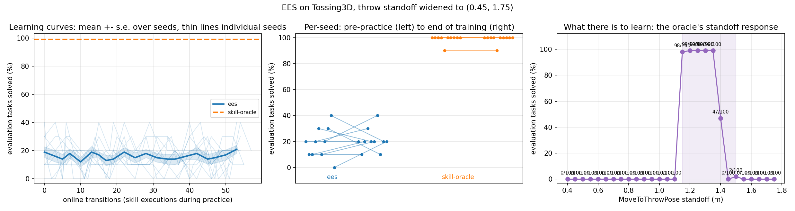

# EES on Tossing3D, with the throw standoff widened to the feasible range

Follows `2026-08-06-tossing3d-ees.md`, which ran EES on this domain under
`THROW_STANDOFF_BOUNDS = (1.20, 1.65)` and got a null result: 24/90 to 33/90 over ~55
online transitions, exact paired Wilcoxon n = 8 non-tied of 9, **p = 0.1328**, against a
99/100 skill-oracle ceiling. That log named the reason structural rather than
methodological — the thing to be learned here is a **constant**, and the old bounds were
barely wider than the band that solves, so a uniform draw was already right about as often
as not (155/330 pooled) and a learned sampler had almost no headroom over its own prior.

The preceding PR widened the bounds to the measured feasible range, `(0.45, 1.75)`. Same
physics, same skills, same state, same success criterion; only the interval the sampler
draws from changed. This log is the re-run.

## Status note: every EES count in this log is provisional

**Added during the rebase onto `main` at `d647749`. No number in this log has been edited,
restated or recomputed — the counts below are exactly what was measured, and this note
records why they should not be quoted as current.**

Two independent reasons, either of which alone is enough.

**1. Tossing3D is not reproducible from `--seed`** — measured here, by accident, and written
up in full below (see "Tossing3D runs are **not** reproducible from `--seed`"). Seed 0 run
twice under identical arguments and identical code ended **3/10 versus 2/10**. Same-seed
run-to-run variation is therefore **at least 1 episode in 10 = 10 pp**, roughly **five times
the +2.0 pp** this experiment set out to interpret. The paired Wilcoxon and the MDEs below
both assume binomial noise only, so they **understate** the true variability and the MDEs are
lower bounds. A separate fix for this is in flight.

**2. #102 changed the no-op path underneath these results.** `_EesEpisode._noop_action`
returned `np.zeros(3)`, and Tossing3D's `pick_id` is `0`, so every `no-op (no plan)` step
dispatched a real `pick_shelf(distance=0.0, rotation=0.0)`. It now returns `noop_id = -1`,
which **no branch of `Tossing3DEnvironment._execute` handles**. That path is reached on
**every failed evaluation episode** — exactly two no-op steps between the last goal check and
the final one. So **19/100, 21/100, every per-seed change and every statistic derived from
them (the Wilcoxon tests, all four MDE rows) were produced by code `main` has since changed.**

**How strong that second claim is, exactly.** What is *established* is that the executed
action sequence differs: the old code dispatched a skill, the new code dispatches nothing.
Whether the **counts** move is **not established** — KINDER's motion planner may have failed
to plan a base motion to distance 0.0 and stepped the simulator zero times, in which case the
old and new no-ops were physically identical and the numbers would be unchanged. That
possibility is untested. **Only a re-run settles it.**

**What is not affected.** The `skill-oracle` ceiling (**99/100**) and the uniform-draw
baseline (**543/2700**) stand as measured: `SkillOraclePolicy` never calls `noop_action`, so
#102 cannot have touched them. Reason 1 still applies to them as run-to-run noise, but no
code changed underneath them.

**Also stale as a description of `main`:** recommendation 1 below describes per-cycle
planning counters as not yet existing. #106 has since shipped them — `stats.json` now carries
`planning_failures_per_cycle` and `planning_attempts_per_cycle`.

## Pre-registration

Written **2026-08-06T19:59:06Z** and committed before any EES run under the widened bounds
had produced a `stats.json` — the single-seed timing run was still in flight. The commit
that adds this section contains no results, which is the point of committing it
separately.

### The design

10 fixed seeds, `--num-test-tasks 10`, `--num-cycles 20`,
`--max-steps-per-interaction 20` — matched to the previous run so the two protocols are
comparable. Arms: EES, and `skill-oracle` as the ceiling. **The comparison that matters is
EES against the newly measured uniform-draw baseline**, not against the previous run's
numbers, which were taken under a different prior and are not comparable.

### What was predicted, and why

1. **Pre-practice EES lands at the uniform baseline.** Before any learning the sampler
   *is* the uniform prior, so the first checkpoint should be indistinguishable from the
   measured uniform-draw rate. If it is not, something other than the sampler is driving
   the score.
2. **End-of-training beats the uniform baseline clearly.** Held with reasonable
   confidence: the baseline is now low enough that almost any localisation of the constant
   shows against it.
3. **But a *smaller* effect than "large and clearly significant", with sample size the
   binding constraint rather than the method.** The previous run measured ~55 online
   transitions per seed, which is **~18 `MoveToThrowPose` executions**;
   `exploration_epsilon = 0.5` (predicators' own default) keeps about half of those
   uniform-random; and the widened prior now hits the solving band only about one time in
   five. That is on the order of **3-4 positive labels per seed** from which to localise a
   constant inside a 1.30 m interval. Point prediction: end-of-training around
   **40-60/100 pooled**, not the ~99/100 ceiling.

   The one mechanism pulling the other way, noted at pre-registration time: at exploitation
   the wrapped sampler draws **100 candidates and takes the argmax** of the learned score,
   so even a poorly-fit classifier can convert into a good action. This is why prediction 2
   is held more confidently than prediction 3.
4. **Paired Wilcoxon over 10 seeds, end vs pre-practice: p < 0.05.** The widening lowers
   the floor enough that per-seed differences should be consistently positive even if
   individually modest — which is exactly what the old bounds denied the previous run (six
   seeds up, two down, one tied).
5. **The oracle ceiling stays ~99/100.** It is unaffected by the sampler, and the upper
   bound was chosen to keep `NearBin` false at the post-`Pick` pose on all 30 measured
   seeds. **If the ceiling drops, that is a defect in the choice of upper bound, not a
   result** — it would mean some seed's post-`Pick` pose is being admitted after all, and
   it should be treated as a bug to fix rather than a finding to report.

### What would make this wrong in the interesting direction

If end-of-training sits at the uniform baseline with a null result, that is the more
interesting outcome: it would mean the sampler cannot localise a constant even when the
signal is strong and the prior is mostly wrong. Two explanations would need separating
before believing it — too few positive labels (a budget problem, fixable with more cycles)
versus the sampler being unable to use them (a method problem). The per-seed count of
solved practice throws is what distinguishes them.

## Methods

Everything ran through `scripts/run_sweep.py` under the KINDER venv, with fixed seeds 0-9.
Every raw count quoted below is in `2026-08-06-tossing3d-ees-widened.json`, committed
beside this file; the figure is `2026-08-06-tossing3d-ees-widened.png`.

**That the pre-registration above predates the results is checkable, not just asserted.**
`git diff <pre-registration commit>..HEAD` on this file removes exactly **two** lines, and
both are the `<!-- filled in after the run -->` placeholders that stood where Methods and
Results now sit. Every line of the pre-registration above is byte-identical to what was
committed before the run, so no prediction was retro-fitted to the outcome. The one number
the pre-registration quotes from the in-flight run is the solo **timing** (2012 s), which
is cost rather than outcome; the rest (155/330, 24/90 to 33/90, p = 0.1328) come from the
*previous* log.

- **EES arm** — `--methods ees --num-seeds 10 --num-test-tasks 10 --num-cycles 20
  --max-steps-per-interaction 20 --max-workers 10`, inside
  `systemd-run --user --scope -p MemoryMax=16G -p OOMPolicy=continue`.
- **Ceiling arm** — the standoff grid's own **1.35 m** point. `ORACLE_THROW_STANDOFF` is
  1.35, so that sweep already *is* a 10-seed x 10-test-task `skill-oracle` run at the
  default standoff; a separate ceiling arm would have recomputed the same thing. **It is
  therefore not independent of the baseline below**: 1.35 is one of the 27 pooled grid
  points, so the ceiling's 99/100 is one of the summands of 543/2700.
- **Uniform-draw baseline** — one `run_sweep` per standoff over `[0.40, 1.75]` at 0.05 m
  resolution, `--methods skill-oracle` with `--oracle-throw-standoff`, 10 seeds x 10 test
  tasks = 100 episodes per grid point. That is 28 grid points; **27 of them lie inside the
  bounds `(0.45, 1.75)`**, and the 0.40 m point is excluded, giving 543/2700 rather than
  543/2800. (It scores 0/100, so only the denominator is affected.) Pooling an evenly
  spaced grid is a Riemann estimate of the uniform-draw success rate, the same instrument
  the previous log used to get 155/330 under the old bounds.

Analysis is `analysis/practice_makes_perfect/tossing3d_comparison.py`, unmodified. Arms
share their seed set, so every arm-vs-arm test is **paired** and uses that module's exact
Wilcoxon signed-rank.

**Deviation from the previous run's protocol: none in the arm configuration.** The only
differences are `THROW_STANDOFF_BOUNDS` itself, 10/10 usable seeds here against 9/10 there
(one was lost to an infrastructure kill), and `--max-workers 10` rather than 6.

**Cost.** A single seed measured alone took 2012 s, in an 8 GiB scope whose cgroup
`memory.max` was read back and whose `memory.peak` was 1.16 GB against a 1.33 GB max RSS.
In the 10-worker sweep, which ran in a 16 GiB scope, runs took **1404-1535 s (median
1467 s)**, ~25 min of wall clock for the arm.

## Results

> **Provisional — see "Status note" at the top of this log.** The EES counts in this section
> were produced by code `main` has since changed (#102's no-op path), and this domain is not
> reproducible from `--seed` (same-seed spread ≥ 10 pp, against the +2.0 pp read off here).
> Nothing below has been edited; a re-run is what would settle it. The `99/100` ceiling and
> the `543/2700` uniform baseline are unaffected.

**Every checkpoint sits within this design's resolution of the uniform prior. This is a
null result.**



| arm | seeds | pre-practice | end of training |
| --- | --- | --- | --- |
| **EES** | 10 | **19/100** | **21/100** |
| skill-oracle (ceiling) | 10 | 99/100 | 99/100 [^oracle] |

[^oracle]: `skill-oracle` does not learn, so it has one measurement per seed, not two;
the same 99/100 is shown in both columns as the flat reference line the figure draws.

The **uniform-draw baseline** is **543/2700**, measured separately over the standoff grid
rather than as an arm of this sweep — it has no pre/post structure, so it does not belong
in the table above.

Per-seed change, seeds 0-9, in episodes solved out of 10:
`0, 0, +1, +1, -1, +1, +2, -2, -2, +2`. Five seeds up, three down, two tied. Online
transitions per seed: 49-57 (mean 53.2), matching the previous run's ~55.

| comparison | counts | mean paired difference | test | verdict |
| --- | --- | --- | --- | --- |
| EES end vs its own pre-practice | 21/100 vs 19/100 | +2.0 pp | exact Wilcoxon, n = 8 non-tied of 10, **p = 0.8281** | **not established** |
| EES end vs the skill-oracle ceiling | 21/100 vs 99/100 | -78.0 pp | exact Wilcoxon, n = 10 non-tied of 10, **p = 0.0020** | **established** |
| EES end vs the uniform baseline | 21/100 vs 543/2700 | +0.9 pp | unpaired; see MDE below | **not established** |
| EES pre-practice vs the uniform baseline | 19/100 vs 543/2700 | -1.1 pp | unpaired; see MDE below | **not established** |

### Minimum detectable effects

Each is derived from its own two denominators, two-sided alpha = 0.05 and power 0.80, so
the constant is `z_0.975 + z_0.80 = 2.801585`:

```text
MDE = 2.801585 * sqrt( p_bar * (1 - p_bar) * (1/n1 + 1/n2) )
```

| comparison | n1 | n2 | p_bar | MDE | observed | |
| --- | --- | --- | --- | --- | --- | --- |
| EES end vs its own pre-practice | 100 | 100 | 0.2000 | 15.8 pp | +2.0 pp | below MDE |
| EES end vs the uniform baseline | 2700 | 100 | 0.2014 | 11.4 pp | +0.9 pp | below MDE |
| EES pre-practice vs the uniform baseline | 2700 | 100 | 0.2007 | 11.4 pp | -1.1 pp | below MDE |
| EES end vs the skill-oracle ceiling | 100 | 100 | 0.6000 | 19.4 pp | -78.0 pp | **detectable** |

**The MDEs do not rescue the result.** They are large — this design could not have
resolved a +10 pp improvement — but the effect being looked for was not small. The
pre-registered point prediction (see above) was 40-60/100 against a 19/100 start, which
clears a 15.8 pp MDE several times over. What is ruled out is a *large* effect, which is
exactly the one that was predicted.

### Against the pre-registration

| # | prediction | outcome |
| --- | --- | --- |
| 1 | pre-practice lands at the uniform baseline | **unrefuted** — 19/100 vs 543/2700, -1.1 pp against an 11.4 pp MDE |
| 2 | end-of-training beats the baseline clearly | **wrong** — 21/100 vs 543/2700, +0.9 pp |
| 3 | end-of-training around 40-60/100 | **wrong** — 21/100 |
| 4 | paired Wilcoxon p < 0.05 | **wrong** — p = 0.8281 |
| 5 | oracle ceiling stays ~99/100 | **correct** — 99/100 on seeds 0-9 |

Prediction 1 is scored **unrefuted** rather than correct on purpose: a control that could
not have failed at 11.4 pp resolution is weak evidence. What it does rule out is a *gross*
mismatch between the pre-practice sampler and the uniform prior, which is enough to say the
pipeline is measuring the sampler rather than something else.

Prediction 5 is a check on the preceding PR — but a **partial** one, and the limit matters.
That PR's upper bound of 1.75 was chosen because scene seed **14** of the 30 measured
leaves the base 1.8592 m from the bin and only 0.0074 m off its axis, inside
`NEAR_BIN_TOLERANCE`, so nothing but the standoff conjunct excludes it. This experiment ran
seeds **0-9**, so seed 14 was never executed. The ceiling holding at 99/100 says the
widened `NearBin` did not misfire on the ten seeds run here; it does **not** exercise the
near-miss seed the bound was chosen for.

### This is not the previous run's silent no-op

The previous log's headline defect was EES planning nothing and scoring 0/5 at *every*
checkpoint. Two independent checks say that is not what is happening here.
`tests/environments/tossing3d/test_skills.py`'s Fast Downward integration test grounds
this domain's real PDDL and asserts the plan is `Pick -> MoveToThrowPose -> Toss`; it
passes at this commit. And the checkpoints are non-zero and varying (0/10 to 4/10 across
seeds and time), which a no-op cannot produce. EES is planning and acting; no learning is
detectable at this resolution.

## What this does and does not establish

**Establishes:** under this budget, on this domain, EES's sampler does not improve on its
own uniform prior for a **constant** target by more than ~11 pp — all this design could
resolve — even though the prior is wrong on roughly 4 draws in 5 and a correct constant
would score 99/100.

**Does not establish:** *why*. Two explanations remain open and this run cannot separate
them.

1. **Too few positive labels.** ~53 online transitions is ~18 `MoveToThrowPose`
   executions per seed; `exploration_epsilon = 0.5` makes about half of those uniform;
   and the prior hits the band about one time in five. That is on the order of 3-4
   positive labels per seed.
2. **The sampler cannot use them.** Concretely, this would mean the fitted classifier's
   score does not concentrate near the band, so the 100-candidate argmax the wrapped
   sampler takes at exploitation time is no better than a uniform draw — the mechanism
   that, in the pre-registration above, was the reason to expect a *good* result. That is
   a genuine method finding, and the more serious one.

**The data needed to tell these apart is not recorded.** `stats.json` carries
`evaluations`, `breakdowns`, `num_practice_resets` and `task_name` — **no practice
outcomes at all** — so the count of successful practice throws, which is exactly the
discriminating quantity, cannot be recovered from this run or from any previous one.
Asserting either explanation as the cause would be unsupported, so neither is asserted
here.

### Tossing3D runs are **not** reproducible from `--seed`, and that was measured here

This was found by accident and is the most consequential incidental result in this log.
Seed 0 was run **twice** under identical arguments: once alone to time it, once inside the
sweep. `config_snapshot.json` shows the two differ only in `output_dir` and in a commit
hash whose sole delta is a markdown file, so **the code that ran was the same**. The
results are not:

| run | pre-practice | end of training | transitions |
| --- | --- | --- | --- |
| seed 0, alone (`--max-workers 1`) | 2/10 | **3/10** | 51 |
| seed 0, in the sweep (`--max-workers 10`) | 2/10 | **2/10** | 51 |

The `evaluations` arrays diverge at several checkpoints, not only the last. So a single
`--seed` does **not** fully determine a run on this domain, contrary to the guarantee
`scripts/run_sweep.py` is documented to provide — and
`tests/scripts/test_reproducibility.py` does not catch it, because it exercises
`--env lightswitch` only. It cannot exercise this one: CI never installs KINDER.

**A likely mechanism, stated as a hypothesis rather than a finding:** that test pins
`OMP_NUM_THREADS` and `MKL_NUM_THREADS`, so thread-count-dependent nondeterminism in BLAS
or torch is already a known hazard here, and the two runs above differed in exactly that
respect (1 worker versus 10 on a 24-core box). MuJoCo/PyBullet are a second candidate.
Which one it is has not been established.

**What this does to the result above.** Same-seed, same-config run-to-run variation is at
least 1 episode in 10 — that is, **10 pp, five times the +2.0 pp mean difference this
experiment set out to interpret**. The null result therefore stands more firmly than the
Wilcoxon alone suggests: the observed change is well inside the noise the harness produces
without changing anything at all. But it cuts the other way for the machinery: the paired
test treats each seed's pre-and-post as a matched pair with only binomial noise, and the
MDEs are computed on that same assumption, so **both understate the true variability**.
The MDEs quoted above should be read as lower bounds on what this design could resolve.

### The practice budget was mostly unspent, and not for the obvious reason

`num_practice_resets` is 20/20 for every seed, so each of the 20 cycles ran a practice
period. But the checkpoint transitions show what those periods actually did — seed 0 went
`0, 3, 4, 7, 8, 11, 14, ..., 51`, i.e. **+3 transitions in most cycles and +1 in a few**.
Across 20 cycles at `--max-steps-per-interaction 20` that is **51 of 400 permitted steps
used**, and the previous log recorded the same thing: the step limit never binds.

The reason is structural rather than a misconfiguration, and it bounds what more compute
can buy. `Toss` deletes `Reachable(cube, barrier)` unconditionally, so after one throw the
cube is past the barrier, no ground skill's preconditions hold, and the practice period
ends. **One practice period is one throw.** The `+1` cycles are periods that ended even
sooner, with no successful grasp.

So the number of informative `MoveToThrowPose` executions is not set by
`--max-steps-per-interaction` at all — it equals the number of cycles. Raising the step
limit would change nothing, and "more attempts per practice period" is not available
without a reset partway through a period, which is exactly what the reset-free work
elsewhere in this repo is about.

## Recommendation

0. **Establish whether Tossing3D can be made reproducible at all**, before any further
   number is taken on it. Two same-seed runs here differed by 1 episode in 10. Until that
   is understood, every count on this domain — including #99's and this log's — carries an
   unquantified run-to-run term, and no paired test over seeds is doing what it claims.
   The cheapest probe is the one this log stumbled into: run one seed twice at the same
   `--max-workers`, then twice at different ones, and see whether thread count is the
   variable. This is listed first because it conditions everything below it.
1. **Record practice outcomes in `Metrics`.** One counter of attempted and successful
   practice skill executions per cycle turns this ambiguous null into a decidable one, and
   it is the same shape as the planning-failure counter the previous log already asked for.
   Until it exists, no experiment on any domain can distinguish "not enough signal" from
   "cannot use the signal".
2. **Then re-run at a larger cycle budget.** Since one practice period is one throw,
   `--num-cycles` is the *only* lever on the number of informative executions —
   `--max-steps-per-interaction` is inert here. One seed at `--num-cycles 60` is ~100 min
   scaling from the solo run's 2012 s (the sweep's 1467 s median assumes ten-way
   parallelism, so it is the wrong base for a single run). Do this *after* (1), not
   instead of it: more cycles without the counter produces another undecidable null.
3. **A reset partway through a practice period would buy the same signal far more
   cheaply**, by getting several throws out of one cycle instead of one. That is the
   reset-free work already in flight, and this experiment is a concrete argument for it.
4. **Do not read this as "EES does not work".** It learns on Light Switch and Tossing Room.
   What is specific here is a one-dimensional constant, a low-hit-rate prior and ~18
   informative executions per seed.
5. **The axis labels in `analysis/practice_makes_perfect/tossing3d_comparison.py` are bare
   percentages** (`evaluation tasks solved (%)`), which the repo convention forbids
   everywhere including axis labels. Not changed here to avoid colliding with concurrent
   work in `analysis/`; worth a one-line fix.
