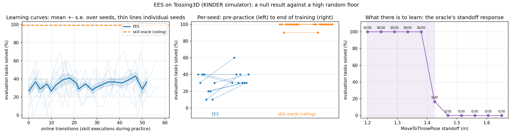

# EES on the KINDER simulator: `--method ees` planned nothing at all, and once it does, the domain is a constant to fit

**TL;DR.** First EES run against a real physics simulator on `main`.

1. **`--env tossing3d --method ees` ran to completion, exited 0, and never took a single
   action.** All five lifted-skill `Variable`s were declared `"?robot"`, but `PddlWriter`
   adds the `?` itself, so every plan call emitted `??robot`, Fast Downward's translator
   exited 31, and `EesMethod` caught the `PlanningFailure` and returned a no-op — 40/40
   evaluation steps in a traced run. Fixed here in five characters, plus a guard that
   raises at write time and a real Fast Downward test on this domain's PDDL.
2. **What there is to learn is a constant, and the random floor is high.** The bin comes
   from a 1 mm-wide region, `Toss` has `param_dim = 0`, and only `MoveToThrowPose`'s
   standoff decides success. Swept over 11 standoffs the privileged oracle solves
   **6/11** points and **155/330** episodes; the solving band is [1.20, 1.425] m with a
   hard edge between 1.380 and 1.425. Nothing here is evidence about learning a
   *function* of state.
3. **EES shows no measurable improvement — a null result.** 9 usable seeds: **24/90**
   pre-practice to **33/90** at ~55 online transitions, +10.0 pp (sd 15.0), exact paired
   Wilcoxon **n = 8 non-tied of 9, p = 0.1328**. ≈18 seeds would be needed for 80% power
   at that effect. The privileged oracle sits at **99/100**, and EES is below it by
   −62.2 pp (p = 0.0039).
4. **Three structural facts, each measured:** `--max-steps-per-interaction` never binds
   (a practice period ends after ~2.6 skills because `Toss` is irreversible);
   `RandomSkillsMethod` **crashes on 10/10 runs** because this is the first domain with a
   dead-end state and it asserts instead of no-oping; and EES's own "no-op" dispatches a
   real `pick_shelf` here, because slot 0 of this action space is a skill id.



## Status note: every EES count in this log is provisional

**Added during the rebase onto `main` at `d647749`. No number in this log has been
edited, restated or recomputed — the counts below are exactly what was measured, and
this note records why they should not be quoted as current.**

Two independent reasons, either of which alone is enough.

**1. Tossing3D is not reproducible from `--seed`.** Discovered later, in the widened-bounds
re-run (`2026-08-06-tossing3d-ees-widened.md`): seed 0 run twice under identical arguments
and identical code ended **3/10 versus 2/10**, with `evaluations` diverging at several
checkpoints. Same-seed run-to-run variation is therefore **at least 1 episode in 10 = 10 pp**.
`tests/scripts/test_reproducibility.py` covers `--env lightswitch` only, so nothing pinned
this domain. Every count in this log is a single draw from a distribution whose width is
comparable to the effects being read off it, and the paired Wilcoxon below assumes binomial
noise only — so it **understates** the true variability. A separate fix for this is in
flight.

**2. #102 changed the no-op path underneath these results.** `_EesEpisode._noop_action`
returned `np.zeros(3)`, and Tossing3D's `pick_id` is `0`, so every `no-op (no plan)` step
dispatched a real `pick_shelf(distance=0.0, rotation=0.0)`. It now returns `noop_id = -1`,
which **no branch of `Tossing3DEnvironment._execute` handles**. That path is reached on
**every failed evaluation episode** — exactly two no-op steps between the last goal check
and the final one. So **24/90, 33/90, every per-seed row and every statistic derived from
them (the Wilcoxon tests, the power estimate) were produced by code `main` has since
changed.**

**How strong that second claim is, exactly.** What is *established* is that the executed
action sequence differs: the old code dispatched a skill, the new code dispatches nothing.
Whether the **counts** move is **not established** — KINDER's motion planner may have failed
to plan a base motion to distance 0.0 and stepped the simulator zero times, in which case the
old and new no-ops were physically identical and the numbers would be unchanged. That
possibility is untested. **Only a re-run settles it.**

**What is not affected.** The `skill-oracle` ceiling (**99/100**) and the pooled standoff
response (**155/330**) stand as measured: `SkillOraclePolicy` never calls `noop_action`, so
#102 cannot have touched them. Reason 1 still applies to them as run-to-run noise, but no
code changed underneath them.

**Also stale as descriptions of `main`, though no number depends on them:** finding 4's
"`RandomSkillsMethod` cannot run on this domain at all" (fixed by #104) and "EES's 'no-op'
is not inert here" (fixed by #102). Recommendations 2(a), 2(b) and 3 have all shipped — as
#104, #102 and #106 respectively.

## Question / goal

Run vanilla PMP (EES) against `--env tossing3d`, KINDER's MuJoCo/PyBullet `Tossing3D-o1`
scene — the first time this project's own method has been driven by a real physics
simulator on `main`. Establish three things: that the CLI path works unmodified, what a
run costs in wall clock and memory, and whether EES improves over the uniform prior on a
domain whose only success-determining parameter is a single scalar.

## Background

### What was already on `main`, and what was not

`environments/tossing3d/` landed on `main` in two PRs — #69 (our coincident task config)
and #77 (`--env tossing3d`) — as a **fresh** integration that reused none of the code from
the earlier seven-PR stack. It ships `predicates.py`, `skills.py`, `tasks.py`,
`problem.py` and a `SkillProvider`, and `tossing3d` is registered in `cli.py`. `EesMethod`
imports *our* `hitl_pmp.planning.fast_downward`, not anything from `kinder-baselines`, so
`--method ees` never depended on the upstream bilevel-planning port. On paper
`python -m hitl_pmp.cli --env tossing3d --method ees ...` should already have worked.

An EES-vs-random-skills experiment **was** run on Tossing3D before, and its numbers are in
`docs/tossing3d-integration-status.md` §5.1 (EES 67/100 against a 21/100 floor). Those are
**not comparable to anything here**: they were taken on the closed stack, whose adapter has
a `swing` dial, an `ORACLE_SWING` constant and upstream's stock scene, none of which exist
on `main`. That file says so itself. On `main`'s integration the only continuous dial on
the throw side is `MoveToThrowPose`'s standoff, and the default scene is the coincident one.

### The scene these numbers were taken on

`reference/kindergarden` sits on a branch carrying the `kg#126` bin fix, which puts the
Tossing3D bin at x = 2.0 — so a cube landing **in** the bin scores a success. On stock
upstream the bin sits 23 cm further out and a cube landing in it is a scored **failure**,
which is the single most misreadable thing about this benchmark
(`docs/kinder-environment-validation.md`). Do not read any count here against a run taken
on stock upstream.

### What there is to learn here, stated plainly

The domain has three continuous parameters: `Pick`'s distance and rotation (upstream's own
`MOVE_TO_TARGET_{DISTANCE,ROT}_BOUNDS`) and `MoveToThrowPose`'s standoff, drawn from
`THROW_STANDOFF_BOUNDS = (1.20, 1.65)`. `Toss` has `param_dim = 0`. The bin is placed from
a **1 mm-wide** `bin_init_region`, so it is in effectively the same place every episode.

**The thing to be learned is therefore a constant, not a function of state**: "stand at
about 1.3 m". A sampler can learn a constant, and whether EES finds it and how fast is a
real question — but this is a degenerate learning problem, and **nothing here is evidence
about learning a function of state**. It is also why the standoff-response sweep is
reported alongside the arms: a uniform draw from the current bounds already succeeds
often, so the floor is high and a method that "reaches 90%" against it would have done
much less than the number suggests.

## Hypothesis

EES improves on its own pre-practice score, but by a much smaller margin than on Light
Switch or Tossing Room, because the uniform prior over a 0.45 m-wide standoff interval
already lands inside the solving band a large fraction of the time — so most of the
achievable headroom is taken before any practice happens.

## Guidance given

- Verify `--env tossing3d --method ees` in the first five minutes with the smallest
  possible run; if it does not work, **that** is the finding, and report it rather than
  building around it.
- Pilot before committing to a sweep; report per-skill wall time and a projection, and
  stop before launching if the projection exceeds ~2 hours.
- Say plainly that the answer is a constant; do not present constant-fitting as evidence
  about function learning.
- Measure the random-standoff baseline and state it, because it is high.
- Cap memory in a `systemd-run --user --scope`, verify the cgroup's `memory.max`, watch
  RSS across the pilot, and keep worker counts low — other agents are running.
- Counts as `x/y`, never a bare percentage; any quantitative result needs a figure with
  per-seed spread.

## Methods

### Two Python environments, one CLI, no code change to bridge them

KINDER lives in its own virtualenv (`../kinder-venv`), not `hitl-pmp`, so
`scripts/with_env.sh` — which activates the conda env — cannot drive this domain. Resolved
by invoking the **KINDER venv's** interpreter with this worktree's `src/` first on
`PYTHONPATH`, plus `FD_EXEC_PATH`, `MUJOCO_GL=egl` and `PYOPENGL_PLATFORM=egl`. That venv
already carries every `hitl_pmp` runtime dependency (pydantic, numpy, torch, gymnasium,
imageio, matplotlib, scipy), so nothing had to be installed and nothing in the package had
to change; `environments/tossing3d/cli.py`'s own docstring already prescribes it ("Run it
under the KINDER venv, not `hitl-pmp`"). `scripts/run_sweep.py` spawns children with
`sys.executable`, so a sweep launched this way keeps the same interpreter throughout.

### Protocol

Everything was driven through `scripts/run_sweep.py` with fixed seeds — never a shell
loop, never a randomly drawn seed.

- **EES arm.** `--methods ees --num-seeds 10` (seeds 0-9), `--num-test-tasks 10`,
  `--num-cycles 20 --max-steps-per-interaction 20`, `--max-workers 6`.
- **Ceiling arm.** `--methods skill-oracle --num-seeds 10 --num-test-tasks 10`, same seed
  set, so the paired comparison is over the same scenes.
- **Standoff response.** One `run_sweep` per standoff over the 11-point grid 1.20 … 1.65 m,
  `--methods skill-oracle --num-seeds 3 --num-test-tasks 10`. The privileged oracle holds
  `Pick` at upstream's own parameters and sweeps only `--oracle-throw-standoff`, so the
  panel isolates the one dial that matters.

`analysis/practice_makes_perfect/tossing3d_comparison.py` reads all of it back — it never
drives a simulation — and reads each run's standoff out of its **own**
`config_snapshot.json` rather than a directory name, so a mislabelled directory cannot move
a point on the plot.

### Why this budget, and not the paper's

**A practice period on this domain ends after two or three skills, whatever
`--max-steps-per-interaction` says.** `Toss` deletes `Reachable(cube, barrier)`
unconditionally, so after one throw `Pick` is inapplicable, no practice candidate is
reachable, and `EesMethod` raises `InteractionComplete`. The 5-cycle pilot's checkpoints
land at 0, 3, 6, 9, 11, 14 transitions — deltas 3, 3, 3, 2, 3 — against a nominal budget of
20 steps per period. So **online transitions are bought by `--num-cycles`, at roughly 3
each**, and the paper's "150 steps per free period" is meaningless here. It also means
every ~3 transitions costs a full evaluation sweep, so evaluation, not practice, is
essentially the entire compute bill.

Pilot: 3 min 27 s of wall clock for 5 cycles × 5 test tasks — about 145 skill executions,
i.e. **~1.4 s per skill execution** on a machine already at load ~40. Projections at
1.5 s/skill, per seed:

| cycles | online transitions | test tasks | skill executions | projected per seed |
| --- | --- | --- | --- | --- |
| 10 | ~30 | 10 | ~490 | ~12 min |
| **20** | **~55** | **10** | **~910** | **~23 min** |
| 50 | ~150 | 10 | ~2200 | ~55 min |

20 cycles × 10 seeds × 2 arms = 20 runs at 6 workers projected to ~92 min, under the ~2 h
gate, so it was launched without stopping to ask. **Realized cost was higher**: a sibling
agent held a 10-way sweep on the same box throughout, load ran 60-150, and an EES run took
**2033-2125 s (median 2081 s, 34.7 min)** against the 23 min projection — a ~1.5x
concurrency tax, recorded in each run's `timing.json`.

### Memory and concurrency

Every run was inside `systemd-run --user --scope -p MemoryMax=… -p MemorySwapMax=0 -p
OOMPolicy=continue`, and the scope's cgroup `memory.max` was read back before trusting it
(8 GiB for pilots, the standoff sweep and the ceiling arm; 16 GiB for the EES arm).

**RSS is flat, not climbing.** Sampling the pilot scope's `memory.current` every 5 s for
its whole life gave 0.85-1.05 GB with a `memory.peak` of 1.18 GB, and `/usr/bin/time -v`
reported a maximum RSS of 1.39 GB. The KINDER PyBullet leak (one client and ~136 MB per
skill execution) is fixed upstream and a sequential run releases as it goes; nothing here
contradicts that. 6 workers were used for the EES arm and 3 for the shorter sweeps, against
a sibling agent's 10, i.e. 9-13 of the ~22-run machine-wide budget.

## Results

### 1. The CLI ran unmodified — and planned nothing at all, silently

`python -m hitl_pmp.cli --env tossing3d --method ees` needed no code change to *start*. It
exited **0**, wrote a complete `stats.json`, `config_snapshot.json` and `episode.mp4`, and
recorded 0/5 solved at every one of four checkpoints. Nothing in the output said anything
was wrong.

Tracing the task policy over 8 evaluation episodes, **40/40 steps were
`no-op (no plan)`** — EES never executed a single skill. Calling `EesMethod.plan_to`
directly gives Fast Downward's translator, verbatim:

```text
Predicate 'holding' of arity 2 used with 4 arguments.
Got: (holding ? ?robot ? ?cube)
translate exit code: 31
```

`PddlWriter._variable_str` owns PDDL's `?` sigil and prepends it, because our
`Variable.name` is plain while predicators' already carries one.
`environments/tossing3d/skills.py` declared all five of its variables **with** the `?`, so
the writer emitted `??robot`, the translator split it into two tokens and aborted,
`FastDownwardPlanner` turned the non-zero exit into `PlanningFailure`, and
`EesMethod._next_plan` caught that and degraded to a no-op — per call, every cycle, for
the whole run. Every other domain in the repo declares plain names; only tossing3d, the
newest, followed the `?robot` example that `Variable`'s own docstring and
`core/README.md` used.

Dropping the five `?`s is the whole fix. On the same 8-task trace the policy then plans
`Pick → MoveToThrowPose → Toss` and solves **4/8**.

### 2. The standoff response is a step function, and the random floor is high

Privileged oracle, `Pick` held at upstream's own parameters, standoff swept over the
11-point grid, 3 seeds × 10 test tasks per point:

| standoff (m) | 1.200 | 1.245 | 1.290 | 1.335 | 1.380 | 1.425 | 1.470 | 1.515 | 1.560 | 1.605 | 1.650 |
| --- | --- | --- | --- | --- | --- | --- | --- | --- | --- | --- | --- |
| solved | 30/30 | 30/30 | 30/30 | 30/30 | 30/30 | 5/30 | 0/30 | 0/30 | 0/30 | 0/30 | 0/30 |

**6/11 standoffs solve at all, and 5/11 solve perfectly.** The edge sits between 1.380 and
1.425 m; 1.425 is the only partial point. Pooled over the whole grid the oracle solves
**155/330**. A uniform draw from `(1.20, 1.65)` therefore lands in the solving band a bit
under half the time — which is exactly what EES's own untrained sampler achieves below.

This is the panel that makes the rest interpretable: **the correct answer is a single
number, the same one every episode**, and guessing it uniformly already works about as
often as not.

### 3. EES does not measurably improve within this budget — a null result

> **Provisional — see "Status note" at the top of this log.** The EES counts in this
> section were produced by code `main` has since changed (#102's no-op path), and this
> domain is not reproducible from `--seed` (same-seed spread ≥ 10 pp). Nothing below has
> been edited; a re-run is what would settle it. The `99/100` oracle ceiling is unaffected.

Ten seeds requested, **9/10 usable**. Seed 9's run was killed mid-flight when the agent
harness reaped the background job that owned it, and the re-issued run was reaped the same
way — an infrastructure loss, not a failure of the run. It is reported as 9 rather than
silently plotted as 10, and nothing below turns on it: the result is a null one that a
tenth seed does not overturn in either direction.

| arm | seeds | pre-practice | end of training |
| --- | --- | --- | --- |
| **EES** | 9 | **24/90** | **33/90** |
| skill oracle (ceiling) | 10 | 99/100 | 99/100 |

Per-seed end-of-training, seeds 0-8:
`3/10, 6/10, 4/10, 3/10, 4/10, 3/10, 3/10, 3/10, 4/10`.
Per-seed pre-practice: `4/10, 3/10, 4/10, 4/10, 1/10, 2/10, 2/10, 1/10, 3/10`.
Per-seed change in percentage points: `-10, +30, 0, -10, +30, +10, +10, +20, +10`.

| comparison | mean paired difference | test | verdict |
| --- | --- | --- | --- |
| EES end vs its own pre-practice | +10.0 pp (sd 15.0) | exact Wilcoxon, n = 8 non-tied of 9, p = 0.1328 | **not established** |
| EES end vs the skill-oracle ceiling | −62.2 pp | exact Wilcoxon, n = 9 non-tied of 9, p = 0.0039 | **established** |

**The improvement is a null result, not a small positive one.** Six seeds move up, two
move down, one ties, and the spread swamps the mean. At the observed effect (+10.0 pp) and
spread (sd 15.0 pp), **≈18 paired seeds** would be needed for 80% power — twice what was
run. What *is* established is only that EES ends far below the privileged oracle.

The mechanism is not mysterious. A run collects ~55 online transitions, of which roughly a
third — **~18 per seed** — are `MoveToThrowPose` executions, and `--exploration-epsilon
0.5` makes about half of those uniform-random rather than sampler-chosen. So the classifier
is asked to localise a constant from on the order of a dozen informative labels, against a
prior that is already right a bit under half the time. There is very little headroom and
very little data with which to take it.

### 4. Structural findings about the domain, each of which cost a measurement

**`--max-steps-per-interaction` never binds here.** `Toss` deletes
`Reachable(cube, barrier)` unconditionally, so one throw ends the period: `Pick` becomes
inapplicable, no practice candidate is reachable, and `EesMethod` raises
`InteractionComplete`. Measured across the sweep, 20 cycles produced **49-59 online
transitions** (~2.6 per cycle) against a nominal budget of 20 steps each. Online
transitions on this domain are bought by `--num-cycles`, and each ~3 of them costs a whole
evaluation sweep.

**`RandomSkillsMethod` cannot run on this domain at all — 10/10 runs crashed.** Every one
died on `AssertionError: No applicable ground skills for state=...`. After a `Toss` the
cube is past the barrier, `Reachable` is false, the hand is empty, and **no ground skill's
preconditions hold**. `EesMethod` handles that state (`no-op (no plan)`);
`RandomSkillsMethod.get_labeled_action` asserts instead. Tossing3D is the first domain in
this repo whose reachable state space contains a genuine dead end, and that baseline was
written assuming one never occurs. This is why the floor reported above is EES's own
pre-practice checkpoint rather than the paper's random-skills arm.

**EES's "no-op" is not a no-op on this domain.** `EesMethod._noop_action()` returns
`np.zeros(self._method.env.action_space.shape)` — `[0, 0, 0]` here — and
`Tossing3DEnvironment.pick_id` is `0`. So every `no-op (no plan)` step dispatches a real
`pick_shelf` controller at distance 0.0 and rotation 0.0: hundreds of MuJoCo ticks and a
base motion, not an inaction. The action is a genuine no-op on Light Switch (a zero delta)
and on Tossing Room (an out-of-context `Pickup` its total `take_action` ignores), so the
defect is specific to an action space whose slot 0 is a skill id. It did not change any
conclusion here — the pre-fix run took 40/40 such steps and still scored 0/5 — but it
wastes simulator time and it perturbs the world during evaluation.

### 5. The raw counts are committed

`docs/experiment-logs/2026-08-06-tossing3d-arms.json` holds every seed of both arms at
every checkpoint, and all 33 standoff runs, as `(num_online_transitions, num_solved,
num_total)` triples copied verbatim out of each run's own `stats.json`. Every number above
is re-derivable from it, and the figure is produced from the same tree by
`analysis/practice_makes_perfect/tossing3d_comparison.py`.

### 6. Cost and memory

An EES run at this protocol took **2033-2125 s (median 2081 s)** wall clock at 6 workers
while a sibling agent held a 10-way sweep on the same box (machine-wide load 60-150),
against a **~23 min projection** from the pilot — a ~1.5x concurrency tax. Per skill
execution the pilot measured **~1.4 s**. Memory was **flat**: cgroup `memory.current`
0.85-1.05 GB across the pilot's whole life, `memory.peak` 1.18 GB, max RSS 1.39 GB. No
growth, consistent with the upstream PyBullet leak fix.

## Recommendation

1. **Do not use Tossing3D to measure sampler learning as it stands.** The bin's 1 mm
   `bin_init_region` makes the target a constant, and the uniform prior already solves a
   bit under half the time. Widening `bin_init_region` so the correct standoff becomes a
   *function* of the bin's position is the change that would make this domain answer the
   question the project actually cares about — and it is cheap, since the standoff-response
   sweep here gives the mapping to learn.
2. **Two follow-up correctness PRs, neither bundled into this one.**
   (a) `RandomSkillsMethod` should emit a no-op when no ground skill applies, as
   `EesMethod` does, rather than asserting — otherwise the paper's own lower-bound
   baseline is unavailable on any domain with a dead end. (b) `EesMethod._noop_action`
   should be an action the environment actually treats as inaction; the cleanest form is
   for `Environment` to expose one rather than for `Method` to assume zeros are inert.
3. **Give `PlanningFailure` a voice.** The defect in (1) survived a full run, a written
   `stats.json` and an exit code of 0. `EesMethod` catches `PlanningFailure` in three
   places and never counts or logs it. A per-cycle planning-failure count in `Metrics`, or
   a warning on the first one, would have turned an hour of silent nonsense into an
   immediate signal — and would catch the whole class, not this instance.
4. **If this experiment is repeated, budget for the evaluation, not the practice.** 21
   evaluation sweeps cost ~40x what 55 practice transitions do here. Fewer, wider-spaced
   checkpoints buy far more seeds for the same wall clock, and seeds are what this
   comparison is short of.
