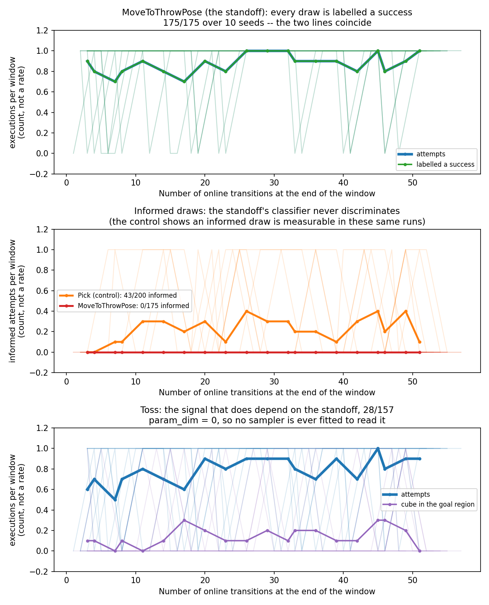
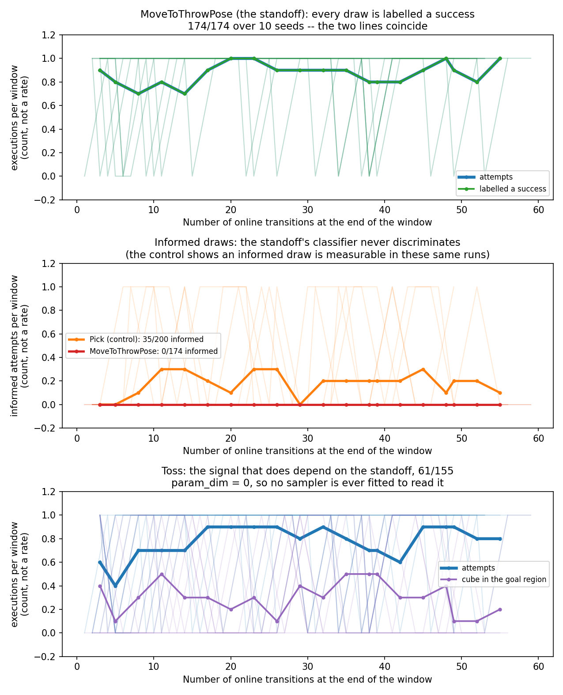

# Tossing3D: why does EES not learn? Neither — it is graded on the wrong label

> **STALENESS NOTE (added 2026-08-16, at the two-skill migration).** Every Tossing3D
> number on this page was measured on the **three-skill** decomposition: `Pick`
> (sampling distance and rotation) -> `MoveToThrowPose` (sampling a standoff) -> `Toss`
> (sampling release speed and gripper release millisecond), over six predicates
> including `RobotAtSuccessfulThrowPose`. That domain no longer exists. Upstream replaced
> it with two skills -- a parameterless `pick_cube` and a composed
> `move_to_toss_location_and_toss` taking four parameters -- and this repo followed, so:
> the pick has **no** continuous parameters and therefore no sampler at all; the standoff
> is now the composed toss's first parameter, drawn from upstream's `(1.25, 1.45)` rather
> than this repo's `(1.10, 1.75)`; release speed is drawn from `(115, 140)` deg/s rather
> than `(60, 140)`; the gripper release millisecond from `(700, 840)` rather than
> `(300, 1400)`; `RobotAtSuccessfulThrowPose` and the whole `THROW_RANGE` calibration are
> deleted; and `OnGround` now accepts a cube resting on any face rather than only the one
> it started on. Two measured grasp fixes (centre grasp, approach settling) also reach the
> pick for the first time.
>
> **Nothing on this page is edited or recomputed.** It is a correct description of the
> domain that was actually in effect when these runs happened. It is simply not evidence
> about the two-skill domain, and no count here is directly comparable to a re-run on it.

**Answer: the pre-registered H3 cell, in both arms.** The standoff sampler is graded on
`NearBin`, which admits every standoff it is able to draw, so **175/175** (widened bounds)
and **174/174** (`main`'s narrow bounds) of its practice attempts are labelled a success,
its classifier is single-class, and it made **0/175** and **0/174** informed draws across
10 seeds and every cycle. The skill whose outcome does depend on the standoff — `Toss` —
has `param_dim = 0` and no sampler at all. "Starved versus unable" was the wrong
dichotomy: there is no amount of practice that changes this, and #105's widening was never
the problem.

> **STALENESS NOTE (added 2026-08-06, after PR #123 merged as `8647550`).** Every number
> in this log was measured against a build in which `MoveToThrowPose`'s add effect was
> `NearBin`, whose acceptance interval was read off `THROW_STANDOFF_BOUNDS` — the identical
> symbol the sampler draws from. That is the defect this log diagnosed, and `main` has
> since fixed it: the predicate is now `RobotAtSuccessfulThrowPose`, deriving its band per
> call from the live goal-region bounding box with only `THROW_RANGE` calibrated.
>
> **Nothing above or below is edited or recomputed**, and the diagnosis itself still
> stands — it is a correct description of the build it was run on, and it is why the fix
> exists. What is now stale is any use of these counts as a *baseline*: `175/175`,
> `174/174`, `0/175`, `0/174`, the `543/2700` uniform-draw reference and both task-success
> rows describe a domain whose standoff sampler was never consulted. `Pick`'s control
> counts (`43/200`, `35/200`) are stale in the other direction — post-fix, `Pick` ties at
> `57/60` and falls back to `0/0` informed, so it is no longer a usable control.
>
> Re-measured post-fix in `2026-08-06-tossing3d-ees-first-real.md`.
>
> **Second staleness layer (added 2026-08-10).** That re-measurement is itself now
> provisional: `THROW_STANDOFF_BOUNDS`'s lower bound has since moved from `0.45` to
> `1.10` to fix a `cuboid_barrier`-collision defect unrelated to the `NearBin` defect this
> log diagnosed. See the staleness note at the top of
> `2026-08-06-tossing3d-ees-first-real.md` for what changed and why.

**Everything through the `Method (to be run, not yet run)` section below is the
pre-registration, committed verbatim in `97ec173` before any `stats.json` carrying
`practice_outcomes_per_cycle` existed for this domain**, in the manner of the
pre-registrations for PR #103 and PR #108. Results follow it, and nothing above them was
edited after the fact except this header.

## Question

PR #108 measured EES on Tossing3D at `19/100` pre-practice and `21/100` at end of
training over ~53 online transitions (exact paired Wilcoxon, n = 8 non-tied of 10,
`p = 0.8281`), against a `99/100` oracle ceiling and a `543/2700` uniform-draw baseline.
It declined to say why, writing that

> too few positive labels and a sampler that cannot use them are both consistent with the
> data, and `stats.json` records no practice outcomes, so the discriminating quantity does
> not exist in any run to date.

That quantity now exists. This asks it: **starvation or inability — or neither?**

## Background

Tossing3D has three lifted skills. `Pick` (`param_dim = 2`) draws from upstream's own
tight bounds; `Toss` has **`param_dim = 0`**; `MoveToThrowPose` (`param_dim = 1`) is the
standoff, and it is the domain's only meaningful learnable parameter. Because
`bin_init_region` is 1 mm wide the correct standoff is a **constant** — the same in every
episode. #105 widened `THROW_STANDOFF_BOUNDS` to the measured feasible `(0.45, 1.75)`, of
which `THROW_SOLVING_BAND = (1.15, 1.375)` reliably scores, so a uniform draw is right
roughly 1 time in 5 — measured through the CLI as `543/2700`.

#99's still-open recommendation is that this constant-target structure is itself the
problem: there is nothing for a state-conditioned sampler to condition *on*, which would
make Tossing3D structurally the identity arm of the representation A/B in PR #97. #105
widened the sampler's search range but left the target a constant, which makes it harder
to find without giving the sampler anything to condition on. If that reading is right,
"starved vs unable" may be the wrong dichotomy, and this pre-registers a third outcome
for exactly that reason.

## Hypothesis

**H3 — neither: the label the standoff sampler is trained on is not the label that
predicts task success.**

Stated as a mechanism, so it is falsifiable rather than a hedge. `MoveToThrowPose`'s
`add_effects` are `{NearBin(robot, bin)}`, and `NearBinClassifier`'s own docstring says
`NearBin` tests a standoff inside `THROW_STANDOFF_BOUNDS` — *the range the sampler draws
from*, not `THROW_SOLVING_BAND` — and that it "says the robot can throw from here, not
that it will score". EES labels a practice attempt by whether the skill's own add effects
held. So **every** standoff the sampler is able to draw should satisfy the label it is
graded on. Meanwhile the skill whose outcome does depend on the standoff — `Toss`, which
adds `InGoalRegion` — has `param_dim = 0` and therefore no sampler at all.

If that is what is happening, the consequence is mechanical rather than statistical.
`MlpBinaryClassifier.fit` takes its single-class shortcut when `np.all(y_data == 1)` and
sets `_single_class_prediction = 1.0`; every candidate then scores exactly 1.0;
`LearnedSkillSampler.sample`'s deviation-6 branch sees a maximum attained by every
candidate and returns a **uniform draw** with `was_informed = False`. Forever, at every
cycle, however much practice is bought. EES's standoff would then be a uniform draw over
the bounds by construction, which forces its evaluation score to the uniform-draw
baseline — `543/2700`, i.e. `20.1/100`, against #108's measured `19/100` and `21/100`.

This is derived from reading the code, and reading is not measurement. The run is what
decides it.

## Decision rule

Pooled over 10 seeds for `MoveToThrowPose`, from `practice_outcomes_per_cycle`: let `A`
be attempts, `S` successes, `I` informed attempts, `IS` informed successes. The reference
rate is the uniform-draw baseline, `543/2700 = 0.201`.

| conclusion | rule |
| --- | --- |
| **never asked** | `A == 0` — the skill was never practiced, and nothing else here applies |
| **starvation** | `S/A < 0.9` **and** `I/A <= 0.05` **and** `I` per window is rising across cycles — the classifier is accumulating labels and has not yet reached the point of expressing a belief |
| **inability** | `I/A >= 0.30` **and** `IS/I` within ±0.10 of `0.201` — the classifier is consulted in quantity, states a belief, and that belief is no better than the prior |
| **H3, neither** | `S/A >= 0.90` **and** `I/A <= 0.05` **and** `I` per window is flat at zero to the final cycle — the sampler's label is almost always positive, so it never has two classes to separate and no amount of practice changes that |
| **undecided** | anything else, including `S/A` in `[0.5, 0.9)` or `I/A` in `(0.05, 0.30)` |

`undecided` is a real outcome and will be reported as one, with the run that would settle
it, rather than rounded to whichever neighbouring cell is closest.

**The noise floor is checked before anything is interpreted.** Another agent has measured
Tossing3D as **not reproducible from `--seed`**: seed 0, run twice under identical
arguments and identical code, gave `3/10` and `2/10`, a same-seed swing of ≥10 pp on the
episode counts. Two consequences, both binding:

1. **No claim here may rest on a difference smaller than 10 pp in task success**, and none
   is designed to. Every cell above is a *categorical* claim about practice counts with a
   denominator in the hundreds — `I/A <= 0.05` against `I/A >= 0.30` is not a margin that
   a 1-episode-in-10 simulator wobble can cross.
2. **This run is not comparable per-seed with #108's.** Its seed *k* is not #108's seed
   *k*. Nothing below will be paired against #108's stored per-seed numbers; #108's
   aggregates are quoted as context only.

If the outcome lands in `undecided`, or if it depends on a task-success difference at all,
the honest report is that the diagnosis waits on the reproducibility fix — and that is
what will be written.

## Method (to be run, not yet run)

Protocol identical to #108's EES arm, so the two are comparable: `scripts/run_sweep.py`,
fixed seeds 0-9, `--num-test-tasks 10 --num-cycles 20 --max-steps-per-interaction 20
--max-workers 10`, KINDER venv, inside
`systemd-run --user --scope -p MemoryMax=16G -p MemorySwapMax=0 -p OOMPolicy=continue`.

Code under test is #108's branch tip (which carries #99's `PddlWriter` sigil fix, without
which `--method ees` plans nothing here, and #105's widened bounds) plus the instrument
from PR #111. Analysis is `analysis/practice_makes_perfect/practice_diagnostics.py`,
unmodified.

One deviation from #108, stated in advance: it ran before #100/#102/#104/#106 merged and
carries a status note saying its EES counts were produced by code `main` has since
changed. This run is at that code, so its task-success numbers are a **fresh measurement**
rather than a reproduction, and are reported as such.

---

# Results

Everything below was produced after the pre-registration above was committed.

## What was actually run

`scripts/run_sweep.py`, `--env tossing3d --methods ees --num-seeds 10`, shared args
`--num-test-tasks 10 --num-cycles 20 --max-steps-per-interaction 20`, under the KINDER
venv inside `systemd-run --user --scope -p MemoryMax=16G -p MemorySwapMax=0
-p OOMPolicy=continue`. `10/10` runs succeeded.

**Two arms, because `main` is not the domain the question was posed on.** #105's widening
has not merged, so `main` still carries `THROW_STANDOFF_BOUNDS = (1.20, 1.65)`.

- **Arm A — the widened bounds `(0.45, 1.75)`**, at `057ece9`: #108's tip `49bf9e2`
  (carrying #105's widened bounds and #99's `PddlWriter` sigil fix) with PR #111's
  instrument cherry-picked on top. This is #108's domain.
- **Arm B — `main`'s narrow bounds `(1.20, 1.65)`**, at this log's own base. Added
  because the H3 mechanism is bounds-**independent** by construction: `NearBin.holds` is
  `low - tol <= dx <= high + tol` over *whatever* `THROW_STANDOFF_BOUNDS` is, identically
  on both trees. So H3 predicts #99's earlier null result at the narrow bounds has the
  same cause. Run rather than asserted.

**Deviation from the pre-registered method:** `--max-workers 5`, not `10`. Another agent
was holding ~10 cores at launch, and this project's concurrency budget is machine-wide
rather than per sweep. Concurrency has been separately measured not to perturb results, so
this costs wall clock only. Recorded: `2061.8 s` wall for the sweep, median `986.3 s` per
run.

**Operationalisation stated before the numbers were read:** the pre-registration's
"rising across cycles" is implemented as *the later half of the run carries strictly more
informed draws than the earlier half* — halves rather than last-versus-first, which on a
series this sparse is decided by whichever single cycle sits at each end. Written into
`Tossing3DPracticeDiagnosis._is_rising` while the sweep was still running.

## The verdict: H3, in both arms

Pooled over 10 seeds per arm, every cell an `x/y` count of skill executions:

| lifted skill | `param_dim` | arm A succeeded | arm A informed | arm B succeeded | arm B informed |
| --- | --- | --- | --- | --- | --- |
| **`MoveToThrowPose`** (the standoff) | 1 | **175/175** | **0/175** | **174/174** | **0/174** |
| `Toss` (adds `InGoalRegion`) | 0 | 28/157 | 0/0 | 61/155 | 0/0 |
| `Pick` (**positive control**) | 2 | 175/200 | 43/200 | 174/200 | 35/200 |

Against the pre-registered rule, in **both** arms: `S/A = 1.00 >= 0.90`, `I/A = 0.00
<= 0.05`, and `I` per window is **flat at zero in all 20 practice windows of all 10
seeds**. That is the **H3** cell, on all three clauses, with no cell adjacent.

The control is what makes `0/175` and `0/174` mean anything: `Pick`'s sampler, in the
*same runs and the same `stats.json`*, made `43/200` and `35/200` informed draws. So an
informed draw is measurable here; `MoveToThrowPose` simply never makes one.

**Arm B is the load-bearing addition.** It says #105's widening was never the problem:
the standoff sampler was equally blind before it, so #99's null result and #108's null
result have one common cause. It also means this log's finding is reproducible from
`main` itself, not only from an unmerged branch.

The `Toss` counts differ between arms exactly as a uniform draw should — `28/157 (17.8%)`
at the widened bounds against `61/155 (39.4%)` at the narrow ones, since the solving band
is a larger fraction of a narrower range. That is the standoff being drawn uniformly, in
two domains, measured from a quantity the decision rule does not read.

Arm A (widened bounds, #108's domain):



Arm B (`main`'s narrow bounds):



Arm A per seed, so the effect is visibly not one seed's doing:

| seed | `MoveToThrowPose` succeeded | its informed draws | `Toss` landed | `Pick` informed | transitions |
| --- | --- | --- | --- | --- | --- |
| 0 | 16/16 | 0 | 4/15 | 7/20 | 51 |
| 1 | 18/18 | 0 | 2/17 | 1/20 | 55 |
| 2 | 20/20 | 0 | 1/17 | 0/20 | 57 |
| 3 | 18/18 | 0 | 7/16 | 2/20 | 54 |
| 4 | 18/18 | 0 | 1/14 | 3/20 | 52 |
| 5 | 18/18 | 0 | 3/16 | 2/20 | 54 |
| 6 | 17/17 | 0 | 3/16 | 4/20 | 53 |
| 7 | 18/18 | 0 | 2/17 | 6/20 | 55 |
| 8 | 15/15 | 0 | 3/14 | 5/20 | 49 |
| 9 | 17/17 | 0 | 2/15 | 13/20 | 52 |

`10/10` seeds show the same thing, and arm B's per-seed `MoveToThrowPose` counts are
`18/18, 18/18, 18/18, 17/17, 18/18, 17/17, 20/20, 16/16, 15/15, 17/17` with `0` informed
draws in every one. There is no per-seed spread to interpret, because the quantity is not
stochastic — it is structural.

## Why this is not a statistical claim, and therefore survives both open defects

Tossing3D's task-success numbers are currently provisional twice over: the domain was
measured as not reproducible from `--seed` (a same-seed swing of ≥10 pp), and #102 changed
the no-op path underneath the existing results. Neither touches anything above. The
verdict reads **counts of skill executions**, with a denominator of 175, and
`Tossing3DPracticeDiagnosis.verdict` does not read `evaluations` at all — pinned by
`test_the_verdict_does_not_read_task_success`, which feeds the same practice record with
`0/10` and with `10/10` task success and requires an identical verdict.

## The mechanism, now measured rather than read

1. `MoveToThrowPose`'s `add_effects` are `{NearBin(robot, bin)}`, and `NearBin` tests a
   standoff inside `THROW_STANDOFF_BOUNDS` widened by `NEAR_BIN_TOLERANCE` — *the range
   the sampler draws from*. `NearBinClassifier`'s own docstring says it "says the robot
   can throw from here, not that it will score". Hence `175/175`.
2. A single-class training set takes `MlpBinaryClassifier.fit`'s shortcut
   (`np.all(y_data == 1)` → `_single_class_prediction = 1.0`), so every candidate scores
   exactly `1.0`.
3. `LearnedSkillSampler.sample` then sees the maximum attained by *every* candidate, takes
   deviation 6's branch, and returns a **uniform draw** — `was_informed = False`. Note it
   returns *before* the epsilon-greedy branch, which is why `MoveToThrowPose` also shows
   `0/0` epsilon-random while `Pick` shows `33/39`. That asymmetry is itself a signature of
   this path and is not otherwise explicable.
4. So the standoff is a uniform draw over the bounds at every cycle, forever. Its
   evaluation score is therefore pinned at the uniform-draw baseline by construction.

Corroboration from a quantity the rule does not read: in arm A, `Toss` landed
`28/157 (17.8%)` against the independently measured uniform-draw rate of
`543/2700 (20.1%)` — which is what a uniformly drawn standoff should produce.

**A second consequence, which follows from `175/175` with certainty rather than by
measurement.** `skip_perfect` defaults to `True` and `reproduce_predicators_practice_target_history`
to `True`, so `measured_success_rate` reads the all-attempts history — which is `1.0`
exactly. `score_ground_skill` therefore returns `-math.inf` and `choose_practice_target`
drops `MoveToThrowPose` from the candidate set **entirely**. EES not only cannot learn the
standoff, it concludes the skill is mastered and never chooses to practice it: its budget
goes to `Pick` and `Toss` instead. Its `~18` executions per seed are plan *prefixes* on the
way to `Toss`, not practice it selected.

## Task success (context only — not an input to the verdict)

| arm | pre-practice | end of training | per-seed change | exact paired Wilcoxon |
| --- | --- | --- | --- | --- |
| A (widened) | 19/100 | 21/100 | `0, 0, +1, +1, -1, +1, +2, -2, -2, +2` | n = 8 non-tied of 10, `p = 0.8281` (#108's own test) |
| B (`main`, narrow) | 26/100 | 36/100 | `-1, +3, 0, -3, +3, +1, +1, +2, +1, +3` | n = 9 non-tied of 10, **`p = 0.1836`** |

Transitions `49-57` (arm A) and `49-59` (arm B).

**Arm B moved `+10/100` and it is still a null result** at `p = 0.1836` — and it is close
to #99's own narrow-bounds numbers (`24/90` → `33/90`, `p = 0.1328`). It is worth saying
plainly what that does and does not mean here: **whatever movement there is cannot come
from the standoff**, because the standoff sampler made `0/174` informed draws. The only
sampler in arm B that made any is `Pick`'s, at `35/200`. Attributing the movement to
`Pick` is a *plausible reading, not a measurement* — this experiment did not test it, and
the task-success axis is exactly the provisional one. Stated as an open question rather
than a finding.

**Arm A's numbers are identical to #108's**, per-seed and in aggregate, including the
transition range. Two things follow, and both are observations rather than claims this
experiment was designed to make:

- It is evidence that **this configuration is reproducible**, which sits oddly beside the
  ≥10 pp same-seed swing measured elsewhere on this domain. I am not resolving that
  contradiction; whoever owns the reproducibility fix should know that a 10-seed EES arm at
  these settings reproduced exactly, so the defect is likely narrower than "Tossing3D".
- It closes #108's own open question. Its status note said the rebase over #102 might have
  moved its counts and that "only a re-run settles it". This is that re-run, and the counts
  did not move — so the spurious `pick_shelf(0.0, 0.0)` evidently stepped the simulator
  zero times, as that note hypothesised.

## What this experiment does **not** establish

- **That fixing the label makes EES learn here.** That is the obvious next experiment and
  it was not run. The standoff target is still a constant (`bin_init_region` is 1 mm
  wide), so #99's separate concern — that there is nothing for a state-conditioned sampler
  to condition *on* — is untouched by this finding and would survive a label fix.
- **What produced arm B's `+10/100`.** The standoff is ruled out (`0/174` informed), and
  `Pick` is the only sampler that learned anything, but nothing here measures the link.
  It is also not significant (`p = 0.1836`) on an axis that is currently provisional.
- **Anything about `Pick`.** Its informed draws are used only as a control that the
  instrument works.

## A gap in the instrument, found by using it

`SkillPracticeTally`'s **fallback pool conflates two different things**: "no sampler was
consulted" (`param_dim = 0`, as for `Toss`) and "a sampler was consulted and its
classifier could not discriminate" (as for `MoveToThrowPose`). Both render as
`0/0 informed, 0/0 random, all fallback`.

The diagnosis above is unaffected, because `MoveToThrowPose` has `param_dim = 1` and
`EesMethod.execute_ground_skill` creates a `_SkillAttempt` for every parameterised skill
during practice — so its fallback attempts are necessarily the deviation-6 branch. But
that is a *code-reading* argument propping up a measurement, which is exactly what the
instrument was built to remove. Splitting the pool is a follow-up, not something this log
leans on silently.

## Reproduction

Arm B runs from this log's own base; arm A needs `057ece9` (#108's tip plus PR #111's
instrument) checked out first.

```bash
systemd-run --user --scope -p MemoryMax=16G -p MemorySwapMax=0 -p OOMPolicy=continue \
  env PYTHONPATH=$(pwd)/src FD_EXEC_PATH=/path/to/downward \
      MUJOCO_GL=egl PYOPENGL_PLATFORM=egl \
  /path/to/kinder-venv/bin/python -m scripts.run_sweep \
    --env tossing3d --methods ees --num-seeds 10 --max-workers 5 \
    --results-root <dir> \
    --shared-args "--num-test-tasks 10 --num-cycles 20 --max-steps-per-interaction 20"

python -m analysis.practice_makes_perfect.tossing3d_practice_diagnosis \
  --results-root <dir> --output <fig.png>
```
