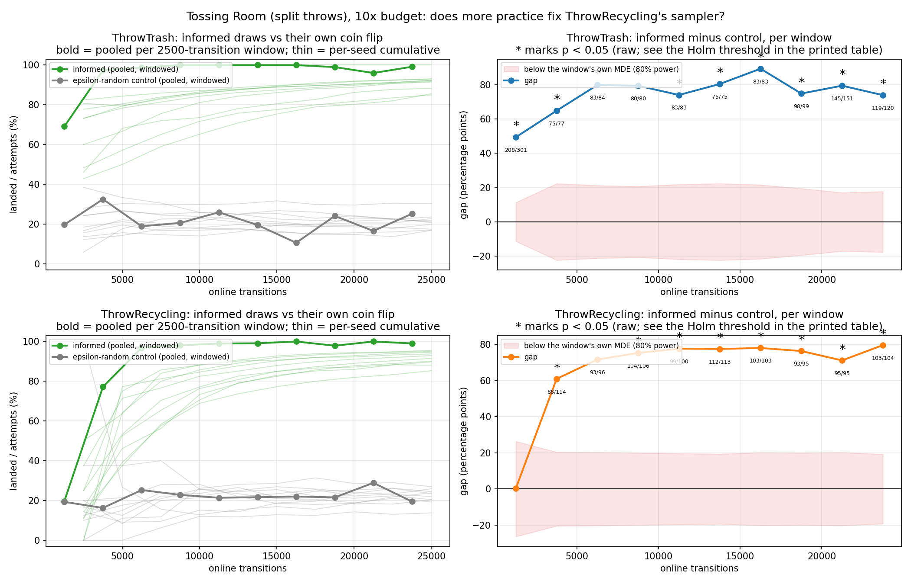
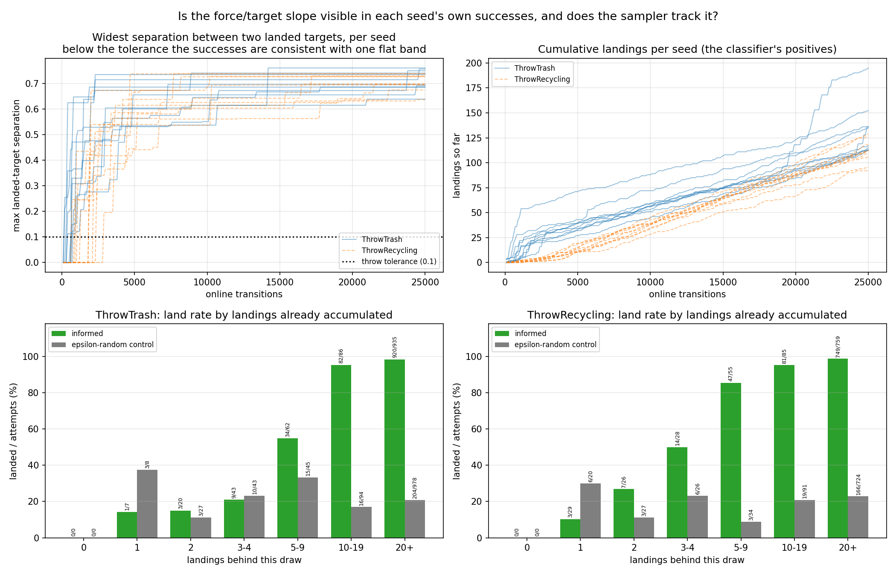

# Ten times the practice budget: `ThrowRecycling`'s sampler was starved, not broken — the null breaks between 2,500 and 5,000 transitions

> **Environment retired (2026-08-07).** The `--env tossingroomsplit` domain this page was
> measured on has been deleted from the tree. It froze the item `weight` into the task's initial state, which
> `--practice-reset-policy never` then never re-drew -- so a reset-free arm
> practised at a single point of the task distribution. That is a defect, not a
> variant, and `tossingroomsplitpickupweight` (which draws the weight at pickup) is
> the corrected domain. Every number below stands
> exactly as it was published and none has been edited, restated or recomputed;
> what has changed is only that the domain can no longer be instantiated from
> HEAD. **Re-runnable as a new measurement, not as a reproduction.** The budget-
> scaling question (is `ThrowRecycling` starved rather than broken?) ports
> directly, and is worth repeating, since the attempt rationing it blames is
> a property of the layout the canonical domain keeps. The curve itself will
> differ, and the analysis module was retired with the domain.

**TL;DR.** Vanilla EES on `tossingroomsplit`, 10 fixed seeds, **250 cycles x 100 steps =
25,000 online transitions**, against the standard run's 2,500. The published null — recycling's
informed draws landing **11/56** against its own epsilon-random control's **11/57** — is
**reproduced exactly in this run's first 2,500-transition window**, and then breaks. In the
second window recycling's informed draws land **88/114** against **13/80**, **+60.94pp,
Fisher exact p < 0.0001**, and every later window sits between **+71pp** and **+80pp** with
p < 0.0001, all surviving Holm-Bonferroni. Over the whole run recycling's sampler is worth
**901/982 against 203/922 (+69.73pp)**, and it is **indistinguishable from `ThrowTrash`'s**
**1049/1153 against 251/1195 (+69.98pp)** — head to head **-0.77pp against a 6.08pp MDE,
p = 0.5380**. **The endpoint gap closes completely: TRASH 140/140 and RECYCLING 140/140,
every seed.** Which axis the crossover really lives on — accumulated successes or elapsed
transitions — **this design cannot cleanly separate**, and result 3 says so rather than
picking the one that was predicted.





## Question / goal

Is `ThrowRecycling`'s learned sampler limited by **how many attempts it gets**, or by
something more attempts cannot fix? A null result at one sample size is compatible with
both, so the answer has to be a **curve**: a starved sampler separates from its control
somewhere along it, a broken one never does. And **where** it separates — at a transition
count, or at a number of accumulated successes — is the part that would transfer to another
domain, since transitions are a property of this layout's budget while accumulated
successes are a property of the classifier.

## Background

`tossingroomsplit` gives the two throws separate lifted skills, so `EesMethod.sampler`
keys a `LearnedSkillSampler` per `skill_name` and each throw learns only from its own
attempts. The layout then rations them very unequally: trash is a retryable round trip
from the pile, while recycling sits behind a **one-way ledge**, and a throw always
releases the item, so reaching the recycling bin ends that period's chance of another go.

At the standard 2,500-transition budget
(`2026-08-05-tossingroomsplit-throw-rates.md`, result 4, shipped in PR #90) recycling
accumulated **160 attempts and 33 landings across all 10 seeds** and its informed draws
landed **11/56** against its own epsilon-random **11/57** — **+0.34pp, p = 1.0000**, a null
result. Trash, same architecture and same seeds, landed **208/301** against **61/310**.

The diagnosis was that the classifier cannot identify the **slope** of the force/target
relation: one landing pins where the good force region sits for one target, and only **two
landings at well-separated targets** make the tilt visible in the data at all. Consistent
with that, **8/10 seeds ended with one or zero informed landings**, so the maximum target
separation among their successes was `0.000`.

Two facts about `LearnedSkillSampler.sample` (PR #85) make the measurement possible.
`was_random` means "the epsilon branch fired"; `was_informed` means "the classifier's
scores actually ranked the candidates". The remainder is `sample`'s **uniform fallback** on
a degenerate score vector, which is neither — pooling it into the informed arm is precisely
the error PR #90 corrected, and it is reported apart, with its own counts, in result 2.

## Hypothesis

Registered before any result existed and committed first, in `3437465`, with the decision
rule added in `efc84a9` while the sweep was still running and no shard existed.

> **The null does not persist.** At 10x, recycling should accumulate ~160 attempts and ~33
> landings per seed against ~16 and ~3.3, and 33 positives is a materially different
> training set from 3.3. I expect separation, **far smaller than trash's +49pp — of order
> +10 to +25pp** at 25,000 transitions.
>
> **Where: between 5,000 and 10,000 transitions.** Target separation should cross the 0.1
> tolerance much earlier (~2,500), so crossing it is predicted **necessary but not
> sufficient** — the classifier needs the tilt visible *and* enough rows to find it.
>
> **Which variable: accumulated landings**, not transitions, since the classifier only ever
> sees positives and the seeds differ several-fold in how fast they accrue them.
>
> **If the null persists at 25,000, that is the more interesting result** — the
> saturated-classifier problem would not be a budget problem at all.

**The decision rule, fixed in advance.** A **crossover** is the earliest window whose
informed rate beats its own control at raw `alpha = 0.05` (Fisher exact, two-sided) **and**
after which every later measured window still has a positive gap; persistence does the
multiplicity work, and the final window can never qualify. The Holm-Bonferroni threshold is
reported per table beside it and never merged into it. Windows are **2,500 transitions**,
one standard run each. The **same rule is applied to the accumulated-landings bands**, so
the transitions-versus-successes claim is settled by one statistic on both axes. Every MDE
is derived from its own two denominators.

## Guidance given

- **Scale the number of practice periods, not their length** — 250 x 100, never 25 x 1000.
  Recycling is capped at one attempt per period by the layout, so longer periods buy
  *trash* more attempts and recycling none; getting this backwards would produce a null
  result for entirely the wrong reason. **Verify the cap rather than assuming it.**
- Fixed seeds 0-9 via `scripts/run_sweep.py`, never drawn. Everything else identical to the
  standard run so the two are comparable.
- **Time one seed first and report it before launching the sweep**; stop if the projection
  exceeded ~2 hours.
- Keep informed draws separate from the uniform fallback; the pooled "greedy" statistic is
  the one that previously misled us.
- **Derive every MDE from its own two sample sizes.** Do **not** inherit the `20.19pp`
  figure from PR #90 — that is the MDE of a 310-vs-57 comparison (whose noise floor is
  7.21pp), while the null being reported is 56-vs-57, whose floor is
  `sqrt(0.25/56 + 0.25/57)` = **9.41pp** and MDE **26.36pp**.
- Counts as `x/y`, never a bare percentage. Pre-register the prediction. Report a null
  result plainly if it persists.
- **Josh's own prediction, given as contrast rather than as an anchor:** separation
  somewhere between **5,000 and 15,000 transitions**, and a crossover aligning better with
  accumulated successes than with transitions; **the null persisting would be the more
  interesting result**, because it would change what M4's proposed gate is worth.

## Methods

| | |
|---|---|
| domain | `tossingroomsplit`, unchanged |
| method | `ees`, vanilla. One experiment, no arms — the comparison is each skill against its own control inside the same runs |
| seeds | 10, fixed at 0-9 |
| protocol | `--num-cycles 250 --max-steps-per-interaction 100` -> exactly **25,000** online transitions per seed |
| evaluation | `--num-test-tasks 30`, fixed **14 TRASH / 14 RECYCLING / 2 EMPTY** |
| horizon | 12, confirmed in every trace |
| epsilon | `--exploration-epsilon 0.5` (the default, so identical to the standard run) |

**Checkpoint density was deliberately left unthinned at 251 evaluation sweeps.** Evaluation
is not charged as online transitions, so it cannot affect the experiment; thinning would
have meant changing `PracticeLoop`, a module two other agents' in-flight runs depend on;
and 251 checkpoints is what locates a crossover in the task-level curves. It is the same
per-cycle cadence as the standard run, which is what makes the two directly comparable.

```bash
python -m scripts.run_sweep --env tossingroomsplit --methods ees --num-seeds 10 \
  --results-root <root> --shared-args "--num-test-tasks 30" \
  --method-args "ees=--num-cycles 250 --max-steps-per-interaction 100 --exploration-epsilon 0.5" \
  --max-workers 10

# One process per seed; OMP_NUM_THREADS=1 MKL_NUM_THREADS=1 -- see the compute note below.
python -m scripts.tossingroomsplit_skill_traces --label ees --seeds <k> --num-cycles 250 \
  --max-steps-per-interaction 100 --num-test-tasks 30 --output <root>/shard-<k>.json

python -m analysis.practice_makes_perfect.tossingroomsplit_scaling \
  --traces <root>/shard-{0..9}.json --results-root <root> \
  --output docs/experiment-logs/2026-08-06-tossingroomsplit-10x-scaling.png \
  --mechanism-output docs/experiment-logs/2026-08-06-tossingroomsplit-10x-mechanism.png
```

**The traced runs are the swept runs, checked rather than assumed.** The analysis refuses
to print unless every traced seed reproduces its `stats.json` exactly, and it reported
`all 10 traced seeds reproduce their swept stats.json exactly`.

**Compute, measured.** Single-seed calibration, alone at 1 worker: **2204.5 s = 36 min
45 s**, exit 0 (`calib-10x/ees/0/timing.json`, 11:11:27 to 11:48:12) — **13.7x** the
standard run's 161.1 s/seed, not 10x. Why it is superlinear was **not measured**, so no
cause is asserted here; note only that the evaluation count rises 26 -> 251, which is
9.65x and therefore cannot by itself account for an excess over 10x. That figure was
reported before the sweep was launched; the projection was ~70-80 minutes and so under the
2-hour stop threshold. The sweep took **5932.7 s wall (98 min 53 s)** at 10 workers.

**Rebased after the run finished, and the numbers are a replay rather than a re-run.**
The runs were collected against `main` at `db2589f`; `main` moved to `1ba2927` (PRs #89,
#92, #93, #94, #95, #97) while they were in flight, so this branch was rebased afterwards
under CLAUDE.md's in-flight-experiment exception. Whether that is safe is a claim to check,
not assume, so it was checked: `git diff --name-only db2589f 1ba2927` over
`src/hitl_pmp/environments/tossingroomsplit/`, `src/hitl_pmp/methods/` and
`practice_loop.py` is **empty** — the dynamics, the sampler and the harness are untouched.
Three files on the run path did change: the trace collector (PR #97 added an `--env` switch
for a second, identity arm, leaving `tossingroomsplit` the default and every pre-existing
caller's behaviour), the throw-rates analysis (PR #93 added per-comparison MDEs), and
`cli.py` (+10 lines registering the new domain). **The whole analysis was re-run on the
rebased code against the same shards and every count on this page is byte-identical**, with
the consistency gate still reporting all 10 traced seeds reproducing their swept
`stats.json` exactly.

**One methodological defect found mid-run, and it was not only a speed problem.**
`run_sweep.py:426` gives every child `OMP_NUM_THREADS=1` and `MKL_NUM_THREADS=1`; the
hand-rolled trace loop (and the standard run's published trace command) does not. Each
unthrottled trace process took ~4 cores and starved the sweep to 0.32 of one. More
importantly, **thread count changes the reduction order of torch's float arithmetic**, so a
multi-threaded trace is not guaranteed to reproduce a single-threaded sweep at all — the
consistency gate the whole page rests on could have failed for that reason alone. The
traces were re-collected single-threaded, and the gate then passed 10/10.

## Results

### 1. The design point holds: recycling really is capped at one attempt per period

| skill | attempts per period | periods |
|---|---|---|
| `ThrowRecycling` | **0 or 1, and never more** | 548 at 0, **1952 at 1**, **0 at 2 or more** |
| `ThrowTrash` | 0 through **12** | 1473 at 0, 549 at 1, 249 at 2, 96 at 3, 35 at 4, 8 at 5, 9 at 6, 6 at 7, 4 at 8, 2 at 9, 2 at 10, 21 at 11, 46 at 12 |

**0/2500 periods contain two recycling attempts.** Of the two designs considered, scaling
periods was therefore the only one that could raise recycling's budget, and it did:
**1952 attempts against the standard run's 160**, a 12.2x increase from a 10x budget,
because 1952/2500 periods now contain one where 160/250 did.

The attempt ratio collapses from **727:160 = 4.54:1** to **2464:1952 = 1.26:1**.

### 2. The headline: the null is reproduced, then broken

`ThrowRecycling`, informed draws against **its own** epsilon-random control:

| window (transitions) | informed | its own random | gap | noise floor | MDE | Fisher exact |
|---|---|---|---|---|---|---|
| 0-2,500 | **11/56** | **11/57** | **+0.34pp** | 9.41pp | **26.36pp** | **1.0000** |
| 2,500-5,000 | **88/114** | **13/80** | **+60.94pp** | 7.29pp | 20.43pp | **< 0.0001** |
| 5,000-7,500 | 93/96 | 24/95 | +71.61pp | 7.24pp | 20.27pp | < 0.0001 |
| 7,500-10,000 | 104/106 | 21/92 | +75.29pp | 7.12pp | 19.96pp | < 0.0001 |
| 10,000-12,500 | 99/100 | 22/103 | +77.64pp | 7.02pp | 19.67pp | < 0.0001 |
| 12,500-15,000 | 112/113 | 21/97 | +77.47pp | 6.92pp | 19.39pp | < 0.0001 |
| 15,000-17,500 | 103/103 | 20/91 | +78.02pp | 7.19pp | 20.15pp | < 0.0001 |
| 17,500-20,000 | 93/95 | 22/102 | +76.33pp | 7.13pp | 19.97pp | < 0.0001 |
| 20,000-22,500 | 95/95 | 28/97 | +71.13pp | 7.22pp | 20.22pp | < 0.0001 |
| 22,500-25,000 | 103/104 | 21/108 | +79.59pp | 6.87pp | 19.24pp | < 0.0001 |

**The first window reproduces the published null to the unit — 11/56 against 11/57 — and
trash's first window likewise reproduces its published 208/301 against 61/310.**

That match is informative rather than tautological, and it is worth being precise about
why. It is *not* implied by "a run is determined by its seed" alone; it needs the further
fact that `num_cycles` enters `PracticeLoop.run` only as the loop bound
(`for cycle in range(num_cycles)`), its one other use being `render_sweep_indices`, which
is inert with no renderer. Granting that, the first 25 cycles of a 250-cycle run *are* the
whole of a 25-cycle run. What makes the check carry information is that **the two runs were
collected at different commits**, five merges apart, so it is a real test that nothing in
between moved the experiment. It passes more broadly than the throw counts: this run's own
sweep at transitions = 2,500 gives TRASH **139/140** and RECYCLING **70/140**, identical to
the standard run's published endpoint.

**The crossover is the 2,500-5,000 window**, by the pre-registered rule, and it persists
through every later window. Holm-Bonferroni over the 10 windows: largest surviving
p < 0.0001.

**Recycling's sampler ends up worth as much as trash's, and that is tested rather than
eyeballed.** Pooled over the whole run:

| skill | informed | its own random | gap | MDE | Fisher exact |
|---|---|---|---|---|---|
| `ThrowTrash` | 1049/1153 | 251/1195 | **+69.98pp** | 5.78pp | < 0.0001 |
| `ThrowRecycling` | 901/982 | 203/922 | **+69.73pp** | 6.42pp | < 0.0001 |

Head to head, the two informed rates are **1049/1153 against 901/982 — -0.77pp against a
6.08pp MDE, Fisher exact p = 0.5380**, a null result: no difference between the two
samplers is detectable, which is the claim, rather than that they are exactly equal.

**At the practice-attempt level recycling is now significantly *ahead*.** Landings are
**1324/2464 for trash against 1115/1952 for recycling** — **-3.39pp, Fisher exact
p = 0.0261**. That gap is smaller than its own 4.24pp MDE, which is a statement about
*power*, not about significance: the 80%-power MDE is 2.80 standard errors while
significance needs about 1.96, so a gap can be real and still sit below the MDE. Recycling
draws easier tasks on average — it throws once per period at whatever that period's task
demands — so this is not evidence that its sampler is better, only that the attempt-level
comparison across skills is confounded and should not be read as one.

**The uniform fallback, reported apart as promised.** Trash's fallback draws land
**24/116** and recycling's **11/48**. Recycling's uninformed share of its greedy pool
collapses from **47/103** in the standard run to **48/1030** here: once the classifier has
data it almost always discriminates, and the fallback branch that dominated the published
measurement has become a rounding error.

**This refutes my own registered prediction of a "+10 to +25pp" effect, and it refutes it
in the direction of the sampler being fine.** The measured effect is +60 to +80pp.

### 3. Which axis the crossover lives on — and why this design cannot settle it

By landings already accumulated when the draw was made (counting **every** landing,
epsilon-random ones included, since `observe_outcome` feeds the classifier all of them):

| landings behind the draw | informed | its own random | gap | MDE | Fisher exact |
|---|---|---|---|---|---|
| 0 | 0/0 | 0/0 | — | — | — |
| 1 | 3/29 | 6/20 | -19.66pp | 40.72pp | 0.1328 |
| 2 | 7/26 | 3/27 | +15.81pp | 38.49pp | 0.1751 |
| 3-4 | 14/28 | 6/26 | +26.92pp | 38.15pp | 0.0521 |
| **5-9** | **47/55** | **3/34** | **+76.63pp** | 30.56pp | **< 0.0001** |
| 10-19 | 81/85 | 19/91 | +74.41pp | 21.13pp | < 0.0001 |
| 20+ | 749/759 | 166/724 | +75.75pp | 7.28pp | < 0.0001 |

**The crossover on this axis is the 5-9 band.** The bands below it are null results at MDEs
of 38-41pp, so they exclude nothing smaller than that and are not evidence of no effect.

**The pre-registered 2x2 does not separate the two factors, and its own cells say so.** Cut
at 2 landings and at the compared draws' median of 13,050 transitions:

| cell | informed | its own random | gap | Fisher exact |
|---|---|---|---|---|
| early, < 2 landings | 3/29 | 6/20 | -19.66pp | 0.1328 |
| early, >= 2 landings | 420/471 | 89/432 | +68.57pp | < 0.0001 |
| late, < 2 landings | **0/0** | **0/0** | — | — |
| late, >= 2 landings | 478/482 | 108/470 | +76.19pp | < 0.0001 |

Two things defeat it. The `late, < 2 landings` cell is **structurally empty** — by the time
a run is late, every seed has 2+ landings — so the design cannot ask whether the clock
matters at fixed evidence. And "early" here means *below 13,050 transitions*, up to 5.2
standard runs, which is far coarser than the 2,500-5,000 window where the crossover
actually happens. **Cutting at the scale that matters reverses the reading**, holding
landings fixed at >= 2:

| skill, >= 2 landings | window | informed | its own random | gap | MDE | Fisher exact |
|---|---|---|---|---|---|---|
| `ThrowRecycling` | 0-2,500 | 9/29 | 5/37 | +17.52pp | 34.74pp | 0.1289 |
| `ThrowRecycling` | 2,500-5,000 | 87/112 | 13/80 | **+61.43pp** | 20.51pp | **< 0.0001** |
| `ThrowTrash` | 0-2,500 | 207/294 | 58/302 | **+51.20pp** | 11.48pp | **< 0.0001** |
| `ThrowTrash` | 2,500-5,000 | 75/77 | 26/80 | +64.90pp | 22.36pp | < 0.0001 |

**Within a fixed landings stratum, recycling's gap is absent in the first window and
decisive in the second** — the signature of an independent transitions effect, not of one
explained away by successes. The honest reading of the recycling row is weaker still: at
0-2,500 it has only 29 informed draws and an MDE of 34.74pp, so its p = 0.1289 is an
underpowered null result that excludes nothing below 34.74pp.

**What does discriminate is the cross-skill contrast, and it favours successes.** At the
*same* clock reading of 0-2,500 transitions, trash — which by then has the landings — is
already at **+51.20pp**, while recycling is not. Same budget, different accumulated
evidence, different outcome. That is suggestive rather than established, because the two
skills differ in more than their landing counts.

**So: recycling's landings accrue at almost exactly one per period, which makes its
landings count very nearly a linear function of its transition count. The two candidate
explanations are confounded by construction for this skill, and no amount of re-slicing
this run separates them.** Both my registered prediction and Josh's named accumulated
successes; the data are consistent with that and do not establish it.

### 4. The mechanism: real for trash, not independently testable for recycling

Splitting every draw by whether that seed's own past landings already spanned more than the
`0.1` throw tolerance — the variable the diagnosis names:

| skill | landings span <= 0.1 | landings span > 0.1 |
|---|---|---|
| `ThrowRecycling` | 3/29 vs 6/20, -19.66pp, p = 0.1328 | 898/953 vs 197/902, +72.39pp, p < 0.0001 |
| `ThrowTrash` | 2/25 vs 6/24, -17.00pp, p = 0.1383 | 1047/1128 vs 245/1171, +71.90pp, p < 0.0001 |

**For `ThrowRecycling` this split carries no information beyond the landings count, and the
table above should not be read as independent evidence.** Of its 49 compared draws with
separation <= 0.1, **0/49 have 2 or more landings** — so "separation <= 0.1" and "fewer than
2 landings" select the *same 49 draws*, and the `3/29 vs 6/20` cell here is literally the
same cell as the "1 landing" band in result 3 and the `early, < 2 landings` cell in the 2x2.
It is one underpowered comparison, not three.

**For `ThrowTrash` the split is genuine**: 34 of its 49 narrow-separation draws do have 2+
landings, so the cut is not a restatement of the count. There, a sampler with several
successes confined to within a tolerance of each other is still worth nothing measurable,
which is the diagnosis's claim tested on the one skill where it can be.

Separation exceeds the tolerance in **10/10 seeds** for both skills — recycling at a median
of **1,600** transitions (range 700-2,900), trash at **550** (range 200-800).

### 5. Continuity with the standard run

| | standard (2,500) | this run (25,000) |
|---|---|---|
| endpoint TRASH | 139/140 | **140/140** |
| endpoint RECYCLING | 70/140 | **140/140** |
| endpoint gap | **+49.29pp**, n = 9, p = 0.0078 | **+0.00pp** — every seed solves both families |
| AUC difference | +54.51pp, p = 0.0020 | **+8.07pp**, n = 10, W = 55.0, **p = 0.0020** |
| attempts, trash : recycling | 727:160 = 4.54:1 | **2464:1952 = 1.26:1** |
| landings | 293/727 vs 33/160 | **1324/2464 vs 1115/1952** |
| at an extreme (learning is a switch) | 212/260 and 199/260 | **2459/2510** and **2373/2510** |

**The endpoint gap closes completely.** All 10 seeds finish at 14/14 on both families,
where the standard run had seed 0 finishing 0/14 on RECYCLING.

**The AUC difference survives and stays significant at the same p** — recycling still gets
there *later*, and that is now the only task-level residue of the asymmetry. Transitions to
first reach a given share of that family's 140 test tasks: **35/140** at 200 vs 1,400
(7.0x), **70/140** at 400 vs 2,500 (6.2x), **105/140** at 800 vs 3,500 (4.4x), **126/140**
at 900 vs 4,000 (4.4x).

`EMPTY` is **5020/5020** across all 2,510 seed-sweeps and full in **2510/2510** of them,
pre-practice included. It contains no throw, so neither sampler can touch it; it is the
deterministic control and it did not move.

## Verdict on the predictions

| claim | whose | verdict |
|---|---|---|
| the null does not persist | mine | **held** — broken from 2,500-5,000 onward, p < 0.0001 |
| separation of order +10 to +25pp | mine | **refuted** — +60 to +80pp, and indistinguishable from trash's (p = 0.5380) |
| crossover between 5,000 and 10,000 transitions | mine | **refuted** — earlier, at 2,500-5,000 |
| crossover between 5,000 and 15,000 transitions | Josh's | **refuted** — earlier, at 2,500-5,000 |
| aligns with accumulated successes rather than transitions | both | **not established** — consistent with the data, but recycling's landings are near-linear in its transitions, the `late, < 2 landings` cell is empty, and within a fixed landings stratum the gap still appears only after 2,500 transitions |
| crossing the tolerance is necessary but not sufficient | mine | **held for `ThrowTrash` only** — for recycling the separation cut selects the same 49 draws as "fewer than 2 landings", so it has no independent content there |
| the null persisting would be the more interesting result | Josh's | **did not arise** |

## Recommendation

1. **Retract "no learning by `ThrowRecycling`'s sampler is detectable at all" as a
   statement about the sampler.** It was a true statement about a 2,500-transition budget
   and is false about the architecture. The same classifier, on the same domain, with the
   same seeds, is worth +69.73pp once it has the data, and is statistically
   indistinguishable from trash's sampler (p = 0.5380). The 2026-08-05 page's
   Recommendation 2 should be read as budget-scoped from now on.
2. **The binding constraint is evidence, not the step budget — but this run does not
   identify which measure of evidence.** The gap is a null result at 1-4 landings and
   decisive from 5-9 onward, so a gate keyed on ~5 positives is what the landings axis
   supports; a gate keyed on 2 is not, despite the 2x2's threshold. Recycling's landings
   and transitions are confounded here, so a design that varies them independently — for
   example a much tighter tolerance, which holds successes down while the clock runs — is
   what would settle it.
3. **M4's proposed gate is a sample-efficiency optimisation, not a correctness fix**, which
   is the opposite of how the standard run's null made it look. The region it would buy is
   roughly the first 2,500 transitions, where recycling's informed draws land **11/56**
   against **11/57** — and more practice reaches the same place unaided. Note also that on
   this domain the "2+ positives separated by more than the tolerance" clause is
   **vacuous for recycling**: 0/49 of its narrow-separation draws have 2+ landings, so that
   gate and a bare "2+ positives" gate select identical draws.
4. **Do not quote the 2,500-transition numbers as properties of the domain.** Every
   headline of the standard run — the endpoint gap, the AUC gap, the informed-draw null
   result — is a statement about that budget. Two of the three vanish at 10x.
5. **Give the trace collector `OMP_NUM_THREADS=1`,** as `run_sweep` already does for its
   own children. This is a correctness issue for the consistency gate, not only a
   throughput one, and the standard run's published trace command has the same omission.
6. **Do not read the cross-skill attempt-level comparison as a sampler comparison.**
   Recycling lands 1115/1952 against trash's 1324/2464 (p = 0.0261), but it also draws a
   different task distribution, one throw per period at whatever that period demands.

## Raw data

The per-seed trace shards are **9.2 MB** and are deliberately **not committed** — the
standard run's committed traces are 829 KB, and a tenfold copy of the same structure is not
worth the repository weight. Both figures on this page and every count in it regenerate
from the three commands in Methods at the pinned seeds; the run is fully determined by
`--seed`.

* [`2026-08-06-tossingroomsplit-10x-scaling.png`](./2026-08-06-tossingroomsplit-10x-scaling.png)
  — the scaling curve: each skill's informed rate against its own control per 2,500-transition
  window, with per-seed cumulative traces, and the per-window gap against its own MDE band.
* [`2026-08-06-tossingroomsplit-10x-mechanism.png`](./2026-08-06-tossingroomsplit-10x-mechanism.png)
  — landed-target separation per seed against the tolerance, cumulative landings per seed,
  and the land rate by accumulated landings for both skills.
