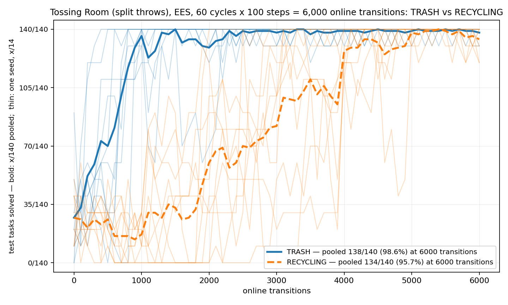

# The task-level crossover, at a budget whose raw data is committed: Tossing Room split throws at 60 cycles

> **Environment retired (2026-08-07).** The `--env tossingroomsplit` domain this page was
> measured on has been deleted from the tree. It froze the item `weight` into the task's initial state, which
> `--practice-reset-policy never` then never re-drew -- so a reset-free arm
> practised at a single point of the task distribution. That is a defect, not a
> variant, and `tossingroomsplitpickupweight` (which draws the weight at pickup) is
> the corrected domain. Every number below stands
> exactly as it was published and none has been edited, restated or recomputed;
> what has changed is only that the domain can no longer be instantiated from
> HEAD. **Re-runnable as a new measurement, not as a reproduction.** This page's own
> claim -- that its ten published numbers reproduced exactly at the time --
> remains true of the commit it was measured at, and is not withdrawn. It is
> simply no longer reproducible from HEAD, because the domain is gone.

**TL;DR.** Vanilla EES on `tossingroomsplit`, 10 fixed seeds, **60 cycles x 100 steps =
6,000 online transitions**, run to make PR #103's crossover region **re-analysable** — that
PR committed seven files and zero data, and the results root has since been cleaned up.
**Every published number the two runs share is reproduced exactly**: the continuity point
at 2,500 transitions (`TRASH 139/140`, `RECYCLING 70/140`) and all four threshold
crossings on both families, ten numbers in total. Nothing is stale, so **no staleness
note is needed** — and that is now checked against committed data rather than asserted.
The task-level picture at this budget: `TRASH` runs `27/140 -> 138/140` and `RECYCLING`
`27/140 -> 134/140`, so the **endpoint gap is no longer statistically detectable**
(paired Wilcoxon **p = 0.3125**, `5/10` seeds tied) while the **AUC gap is**
(**+32.67pp**, paired Wilcoxon **p = 0.0020**). The per-seed spread the figure exposes is
the thing no surviving data could show: at 2,500 transitions the ten seeds' `RECYCLING`
scores run from **`0/14` to `14/14`**.



## Question / goal

Two things, one run.

1. **Make the crossover region re-analysable.** PR #103 established that
   `ThrowRecycling`'s sampler is starved rather than broken, and that the task-level
   crossover is complete by roughly 4,000 online transitions. It committed **seven files
   and zero data** — no `stats.json`, no shards, no arms JSON — and the results root has
   since been cleaned up. A filesystem scan confirms nothing survives: every sweep
   directory on disk is `num_cycles=25`. So the finding cannot be re-analysed at all,
   which is what this run fixes.
2. **Draw the task-level training curve.** `TRASH` against `RECYCLING` over the whole
   budget, on one axes, with per-seed spread. The 250-cycle page has two figures and
   eleven tables, and **both figures are sampler-level**; its only task-level statements
   are a threshold list and an AUC in prose.

## Background

`tossingroomsplit` gives Tossing Room's two throws separate lifted skills (PR #70), so
`EesMethod` keys a `LearnedSkillSampler` per `skill_name` and each throw learns only from
its own attempts. The room then rations them unequally: trash is a retryable round trip
from the pile, while recycling sits behind a **one-way ledge**, and a throw always
releases the item — so reaching the recycling bin ends that period's chance of another
go. Recycling gets **0 or 1 attempts per practice period, never two**; PR #103 verified
that cap rather than assuming it (`0/2500` periods contained two).

At the old standard budget of **25 cycles x 100 steps = 2,500 transitions**, recycling's
endpoint was `70/140` against trash's `139/140`. That budget stops at the point recycling
is roughly halfway up its curve, which is why the original experiment read the asymmetry
as a property of the domain rather than of the budget.

**Why 60 cycles rather than 250.** From #103's own threshold crossings, recycling reaches
`126/140` at about 4,000 transitions. **60 cycles x 100 steps = 6,000 transitions** covers
that with margin for seeds slower than the pooled curve — and per-seed variance is
precisely what no surviving data can show. What this budget gives up is the final
`126/140 -> 140/140` tail, which happens somewhere between 4,000 and 25,000 and **cannot
be localised from committed data**. Nothing on this page speaks to that tail.

## Hypothesis

**Registered before any count was computed**, and committed first in `06b97b0`, with five
of ten runs already written to disk and no family number yet read from any of them. The
ordering is in the history rather than in the prose.

> **The overlap should reproduce exactly.** `num_cycles` enters `PracticeLoop.run` only
> as the loop bound, so the first 60 cycles of a longer run are the whole of a 60-cycle
> run. This run therefore ought to reproduce #103's published counts everywhere the two
> overlap (0-6,000 transitions): the continuity point at 2,500 (`TRASH 139/140`,
> `RECYCLING 70/140`), and the four threshold crossings — `35/140` at 200 vs 1,400,
> `70/140` at 400 vs 2,500, `105/140` at 800 vs 3,500, `126/140` at 900 vs 4,000.
>
> **But it may legitimately not**, and that is the interesting outcome. #103's runs were
> collected at `db2589f`; this one is at `d647749`, and four merged PRs (#100, #102,
> #106, #111) touched the run path in between. If any of them moved an action choice or
> a random draw, the numbers differ for a real reason and the published ones are stale
> rather than wrong.
>
> **The crossover should complete inside the budget.** I expect `RECYCLING` to reach at
> least `126/140` by 6,000 transitions, and I do **not** expect the endpoint gap to close
> to zero — #103 needed far more than 6,000 for that.

## Guidance given

- **Commit the raw data — a first-class requirement, not a nicety**, since #103's
  omission is what forced this re-run. `stats.json`, `config_snapshot.json` and
  `timing.json` for all ten seeds. **No trace shards**: the point of #111 is that they
  are no longer needed.
- Fixed seeds 0-9 via `scripts/run_sweep.py`, never drawn, never a hand-rolled loop.
- **The box is shared.** Check the load, size `--max-workers` to what is free, and wrap
  the sweep in a memory-capped `systemd-run` scope — a kernel OOM takes down the whole
  session here.
- **One figure, and one Josh asked for verbatim:** *"one graph that's just the training
  curve of trash vs recycling over the whole timestep."* Per-seed spread, not just a
  mean. Counts as `x/y` in every label, caption and annotation.
- **Do not compare across budgets.** This run is 6,000 transitions; the published page is
  25,000. Its own Recommendation 4 warns against exactly that.
- **A disagreement with #103's published counts is a finding, not an error to smooth
  over.** Report it and add a marked staleness note; never edit, restate or recompute a
  published number.
- One hazard, found the same day: **`torch.manual_seed` pins initial weights but not
  reduction order**, so the ambient intra-op thread count is a second input to every
  sampler result. `run_sweep.py` pins `OMP_NUM_THREADS=1` on children while a bare CLI
  run inherits the machine default. Everything here therefore goes through
  `run_sweep.py`, and nothing is compared against a bare CLI run.

## Methods

| | |
|---|---|
| domain | `tossingroomsplit`, unchanged |
| method | `ees`, vanilla. One condition, no arms — the contrast is between two goal families measured inside the same runs |
| seeds | 10, fixed at 0-9 |
| protocol | `--num-cycles 60 --max-steps-per-interaction 100` -> exactly **6,000** online transitions per seed |
| evaluation | `--num-test-tasks 30`, fixed **14 TRASH / 14 RECYCLING / 2 EMPTY**, 61 sweeps per seed |
| epsilon | `--exploration-epsilon 0.5` (the default) |
| commit | `d647749`; `src/` was untouched for the whole run, so this measured `main`'s code |

```bash
systemd-run --user --scope -p MemoryMax=8G -p MemorySwapMax=0 -p OOMPolicy=continue -- \
  scripts/with_env.sh python -m scripts.run_sweep --env tossingroomsplit --methods ees \
  --num-seeds 10 --results-root results/split60 --shared-args "--num-test-tasks 30" \
  --method-args "ees=--num-cycles 60 --max-steps-per-interaction 100 --exploration-epsilon 0.5" \
  --max-workers 5

python -m analysis.practice_makes_perfect.tossingroomsplit_family_overlay \
  --results-root results/split60 \
  --output docs/experiment-logs/2026-08-06-tossingroomsplit-60cyc-curves.png \
  --dump-json docs/experiment-logs/2026-08-06-tossingroomsplit-60cyc-curves.json

python -m analysis.practice_makes_perfect.practice_diagnostics --results-root results/split60
```

**Compute, measured.** `10/10` runs succeeded. Wall clock **1211.6 s (20 min 12 s)** at
**5 workers**, median run **596.6 s**. Five workers rather than the default 24 because the
box was shared: at launch the load average was **29** with another agent's five
`tossing3d` runs and one process holding ~15 cores. `timing.json` records the machine-wide
concurrency each run actually saw (8 to 11 concurrent `hitl_pmp.cli` processes), so the
wall clock is attributable rather than guessed.

**Rebased after the run finished, onto a commit that changes the sampler — and the
numbers are a replay, which was verified rather than assumed.** The runs were collected
at `d647749`; while they were in flight `main` moved to `24edeb1`, PR #112, *"Pin the
sampler's torch reductions so `--seed` alone determines a run"*. That is **not** one of
CLAUDE.md's safe rebase cases: it wraps `MlpBinaryClassifier`'s training and scoring in
`torch.set_num_threads(1)`, so it touches exactly the sampler this experiment measures,
and the in-flight-experiment exception would normally make the numbers stale and require
a **re-run** rather than a replay.

It does not here, and the reason is checkable: `run_sweep.py` already pins
`OMP_NUM_THREADS=1` on every child it spawns, so torch was already running at one
intra-op thread and #112's pin is a no-op for anything launched this way. #112 would
change a **bare CLI** run, which inherits the machine's 24 threads — precisely the hazard
it was written to close, and precisely why nothing here is compared against a bare CLI
run.

`main` then moved twice more before this branch was pushed: #117 (`CLAUDE.md` and
`core/README.md`) and **#118, which does touch the run path** — `planning/pddl.py` and
`core/method/types.py`, and EES plans through `PddlWriter` on every cycle. It is a pure
**tripwire**: `_reject_sigil` raises only for a name already carrying PDDL's `?`, and its
own docstring records that nothing raises today. No `tossingroomsplit` name does, which
this run demonstrates rather than assumes — it made `134310` planner calls without one.

**The verification is the byte comparison, not the reasoning above.** Seed 0 was re-run at
the fully rebased code with identical flags at each of the two rebases, and its
`stats.json` came back **byte-identical** to the committed one both times
(`sha256 b4d664b2...`). That is what licenses calling these numbers a replay; the argument
about `OMP_NUM_THREADS=1` and about tripwires is only the explanation for why the
comparison passed.

**A defect found on the way in, and fixed here.** `TossingRoomGoalFamilyCurves.family_of`
knew only Tossing Room's shared `ItemInBin` predicate, and **raised on every
`tossingroomsplit` run** — that domain splits the atom per item into `TrashInBin` and
`RecyclingInBin`, because there the item and bin *types* are split too. That is the
function behaving exactly as its docstring promises ("a domain change that adds a family
should break this loudly"), not a regression, and the fix teaches it rather than working
around it: the family now comes from the atom's **first object** rather than its predicate
name, which serves both domains with one rule. Keying on the predicate name would also
misfile the split domain's `TrashBinEmpty` atom — it contains the word Trash but is half
of an `EMPTY` goal.

## Results

### 1. Every published number the two runs share is reproduced exactly

The pre-registered check, and it is the one that makes the committed data worth having.

| quantity | PR #103, published | this run | |
|---|---|---|---|
| continuity, `TRASH` at 2,500 | `139/140` | **`139/140`** | reproduced |
| continuity, `RECYCLING` at 2,500 | `70/140` | **`70/140`** | reproduced |
| `TRASH` first reaches `35/140` | 200 | **200** | reproduced |
| `TRASH` first reaches `70/140` | 400 | **400** | reproduced |
| `TRASH` first reaches `105/140` | 800 | **800** | reproduced |
| `TRASH` first reaches `126/140` | 900 | **900** | reproduced |
| `RECYCLING` first reaches `35/140` | 1,400 | **1,400** | reproduced |
| `RECYCLING` first reaches `70/140` | 2,500 | **2,500** | reproduced |
| `RECYCLING` first reaches `105/140` | 3,500 | **3,500** | reproduced |
| `RECYCLING` first reaches `126/140` | 4,000 | **4,000** | reproduced |

**Ten of ten.** No published number is stale, so **no staleness note is warranted** — and
none of the figures above is a recomputation of a published number: they are this run's
own counts, printed beside #103's for comparison and never substituted for them.

That agreement was not a foregone conclusion. Four merged PRs (#100, #102, #106, #111)
touched the run path between `db2589f` and `d647749`, and two of them sound behavioural.
They are not: `Method.reset_environment` (#100) is **called by nothing** on this path, and
`Environment.noop_action` (#102) changed from `[0,0,0]` to `[-1,0,0]`, both of which this
domain's `take_action` treats as a no-op — the first because `_apply_pickup` guards
`arg in (1, 2)`, the second because an unknown `skill_id` falls through. That was checked
two ways: exhaustively over all 84 combinations of room x holding x bin counts (identical
successor states, `0` differing), and by an A/B of the same seed at both commits whose
`stats.json` was **byte-identical on every pre-existing field**, the three new
instrumentation keys being the only additions. #106 and #111 only append counters.

### 2. The task-level curve: the endpoint gap is gone, the AUC gap is not

| family | at 0 transitions | at 2,500 | at 4,000 | at 6,000 | AUC |
|---|---|---|---|---|---|
| `TRASH` | `27/140` | `139/140` | `139/140` | **`138/140`** | 91.20pp |
| `RECYCLING` | `27/140` | `70/140` | `127/140` | **`134/140`** | 58.53pp |

- **Endpoint, paired over the ten shared seeds: a null result.** `138/140` against
  `134/140`, paired Wilcoxon **p = 0.3125**, with `5/10` seeds tied. The families are
  scored inside the same runs, so they are paired data and the pairing is used.
- **AUC, paired over the same seeds: +32.67pp, Wilcoxon p = 0.0020.** Recycling still
  gets there *later*, which at this budget is the only task-level residue of the
  asymmetry — the same shape #103 reported at its own budget, though **the two AUC
  numbers are not comparable** and are not compared: an AUC is a mean rate over a span,
  and the spans differ.

**Both curves are non-monotone near the top**, which a mean alone would hide: `TRASH` goes
`139/140` at 2,500 to `138/140` at 6,000, and seed 3's `RECYCLING` goes `14/14` at 2,500
to `12/14` at 6,000. Learning here is not a ratchet.

### 3. The per-seed spread is the part no surviving data could show

Per-seed `RECYCLING`, at the old standard budget's endpoint and at this one's:

| seed | 0 | 1 | 2 | 3 | 4 | 5 | 6 | 7 | 8 | 9 |
|---|---|---|---|---|---|---|---|---|---|---|
| at 2,500 | `0/14` | `3/14` | `5/14` | `14/14` | `8/14` | `5/14` | `14/14` | `4/14` | `9/14` | `8/14` |
| at 6,000 | `12/14` | `14/14` | `14/14` | `12/14` | `14/14` | `13/14` | `14/14` | `14/14` | `13/14` | `14/14` |

At 2,500 the ten seeds run the **entire range from `0/14` to `14/14`** — two seeds
(3 and 6) are already finished while seed 0 has solved nothing at all. Seed 0's `0/14` is
the value the standard-budget page reported, and it reproduces here. By 6,000 the spread
has collapsed to `12/14`-`14/14`.

**The pooled `70/140` at 2,500 describes no seed that was run.** `70/140` is exactly
`7/14` per seed on average, and **`0/10` seeds scored `7/14`** — the closest are `5/14`
and `8/14`. Sorted, the ten seeds are `0, 3, 4, 5, 5, 8, 8, 9, 14, 14`: eight of them sit
between `0/14` and `9/14`, two are already finished at `14/14`, and the widest gap in the
whole set (5 tasks) falls between `9/14` and `14/14` — right where the mean's own family
lies. This is the sharpest demonstration available of why this project reports per-seed
spread rather than means: the mean is not a summary of these seeds, it is a number none of
them produced, sitting in a set that is still separating into "has found the recycling
throw" and "has not".

It also **retro-justifies the re-run**. #103's committed record contained no per-seed
numbers at all, so this was not merely unnoticed, it was **invisible** — and a reader
deciding "is 2,500 transitions enough for this domain" from the pooled curve would have
been reading a number that describes none of the runs behind it. The right question is
about the slowest seed, and only the committed per-seed data can answer it.

### 4. The sampler-level view, from the sweep alone

PR #111 records per-skill practice outcomes in `stats.json`, so this needs **no trace
shards** — the 9.2 MB #103 declined to commit is simply not required any more.

| skill | informed | its own epsilon-random | gap | noise floor | MDE | Fisher exact |
|---|---|---|---|---|---|---|
| `ThrowRecycling` | **134/206** | **34/180** | **+46.16pp** | 5.10pp | 14.28pp | **< 0.0001** |
| `ThrowTrash` | **325/421** | **95/436** | **+55.41pp** | 3.42pp | 9.57pp | **< 0.0001** |

Recycling's sampler is **decisively better than its own control well inside this budget**,
consistent with #103's account of a starved rather than broken sampler.

Head to head, the two informed rates are `325/421` against `134/206` — **+12.15pp against
an 11.90pp MDE, Fisher exact p = 0.0015**. **This is not a disagreement with #103**, which
reported the two indistinguishable (p = 0.5380) *pooled over 25,000 transitions*; this row
is pooled over 6,000, a different window. It says recycling's sampler has not yet caught
up with trash's by 6,000, which is what "gets there later" means at the sampler level.

**The uniform fallback, reported apart.** Recycling's fallback draws land **11/48** and
trash's **24/116** — *identical to #103's whole-run figures*, because essentially every
fallback draw happens inside the first 6,000 transitions. Once the classifier has data it
almost always discriminates, so the branch that dominated the original published
measurement is spent early and contributes nothing later.

For completeness: `98795/134310` planner calls found no plan, and `EMPTY` is outside this
contrast entirely — it contains no throw, so neither sampler can touch it.

### 5. A defect found in passing: the analysis could not read this domain at all

`TossingRoomGoalFamilyCurves.family_of` **raised on every `tossingroomsplit` run**, so the
goal-family view — the one this page is about — was unavailable for the split domain
outright. Not degraded, not subtly wrong: `ValueError`, every time.

The cause is a genuine domain difference rather than a regression. Tossing Room writes one
shared `ItemInBin(<item>, <bin>)` atom; `tossingroomsplit` splits it per item into
`TrashInBin` and `RecyclingInBin`, because there the item and bin *types* are split too
(`environments/tossingroomsplit/predicates.py`). `family_of` knew only the shared shape
and refused the rest — which is exactly what its docstring promises ("a domain change that
adds a family should break this loudly"), and the loud break is why this was found in
minutes rather than becoming a wrong denominator.

The fix teaches it rather than working around it: the family now comes from the atom's
**first object** rather than its predicate name, which covers both domains with one rule.
Keying on the predicate name would have been the tempting shortcut and is a trap — the
split domain's `TrashBinEmpty` atom contains the word Trash but is half of an `EMPTY`
goal, so that rule would have moved `EMPTY` tasks into the `TRASH` denominator, which on a
`14/14/2` composition is a finding-sized error. Every goal shape that parsed before still
parses to the same family, and a goal matching neither shape still raises.

### 6. Verdict on the pre-registration

| claim | verdict |
|---|---|
| the overlap reproduces #103 exactly | **held** — 10/10 shared numbers |
| the counts may legitimately differ (behaviour moved) | **did not arise** — the run path changed but not behaviourally |
| `RECYCLING` reaches at least `126/140` by 6,000 | **held** — `127/140` at 4,000, `134/140` at 6,000 |
| the endpoint gap does not close to zero | **held in the point estimate, but weaker than stated** — `138/140` against `134/140` is not zero, yet it is no longer statistically detectable (p = 0.3125). I predicted a surviving gap and got one that a paired test cannot resolve |

## Recommendation

1. **The crossover region is now re-analysable, and this is the record.** Ten seeds'
   `stats.json`, `config_snapshot.json` and `timing.json` are committed under
   `2026-08-06-tossingroomsplit-60cyc-data/` — **3.5 MB**, of which 3.4 MB is `stats.json`
   (61 sweeps x 30 per-task outcomes each). Both this page's figure and every count on it
   regenerate from that directory with the commands in Methods; no shard is needed.
2. **Do not read this page's numbers as properties of the domain either.** They are
   statements about a **6,000-transition** budget, exactly as the 250-cycle page's are
   about 25,000 and the standard run's about 2,500. The endpoint gap is undetectable here
   and exactly zero at 25,000; those are different claims at different budgets.
3. **The `126/140 -> 140/140` tail is still not localised**, and this budget cannot
   localise it. It happens somewhere between 4,000 and 25,000 transitions. If that
   matters, it needs its own run — and that run should commit its data.
4. **`family_of` now serves both domains.** Any future Tossing Room variant that renames
   its goal atoms will still break it loudly, which is the intended behaviour; teach it
   rather than defaulting the unknown family into someone else's denominator.
5. **Report the per-seed spread, not the pooled curve, whenever a budget is being
   chosen.** At 2,500 transitions the pooled `70/140` describes none of the ten seeds, and
   the decision "is this budget enough" is a question about the slowest seed, not the
   mean.

## Raw data

- [`2026-08-06-tossingroomsplit-60cyc-data/`](./2026-08-06-tossingroomsplit-60cyc-data/) —
  `stats.json`, `config_snapshot.json` and `timing.json` for all ten seeds (30 files,
  3.5 MB). **Trace shards are deliberately absent**: PR #111 made them unnecessary.
- [`2026-08-06-tossingroomsplit-60cyc-curves.json`](./2026-08-06-tossingroomsplit-60cyc-curves.json)
  — every count behind the figure and the tables, as `[solved, total]` pairs at every
  checkpoint, pooled and per seed, plus the threshold crossings.
- [`2026-08-06-tossingroomsplit-60cyc-curves.png`](./2026-08-06-tossingroomsplit-60cyc-curves.png)
  — the figure.
- The practice-diagnostics figure is **not committed** (1.6 MB, and six of its eight panels
  are skills this page does not discuss). It regenerates from the committed data with the
  third command in Methods.
