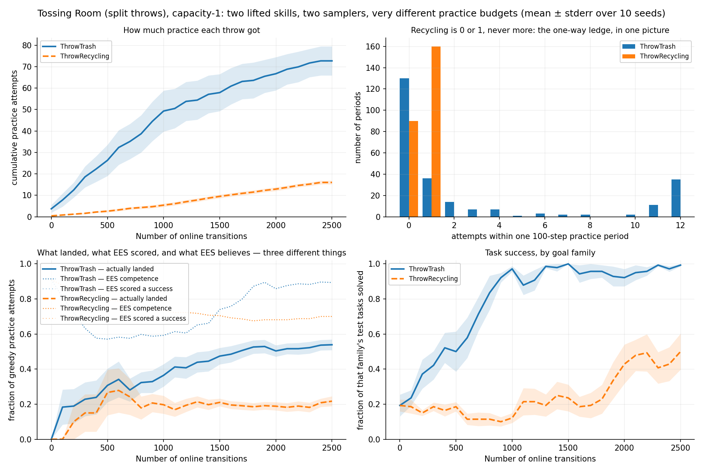
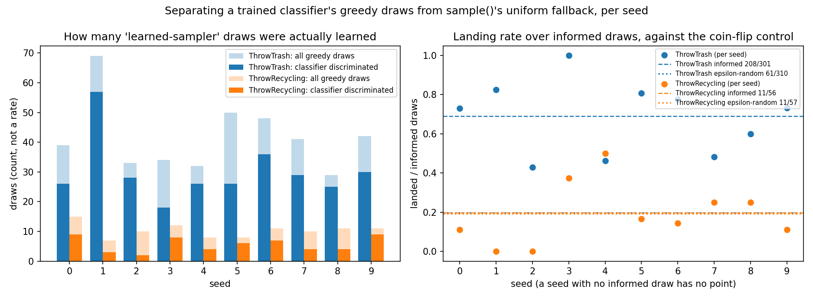
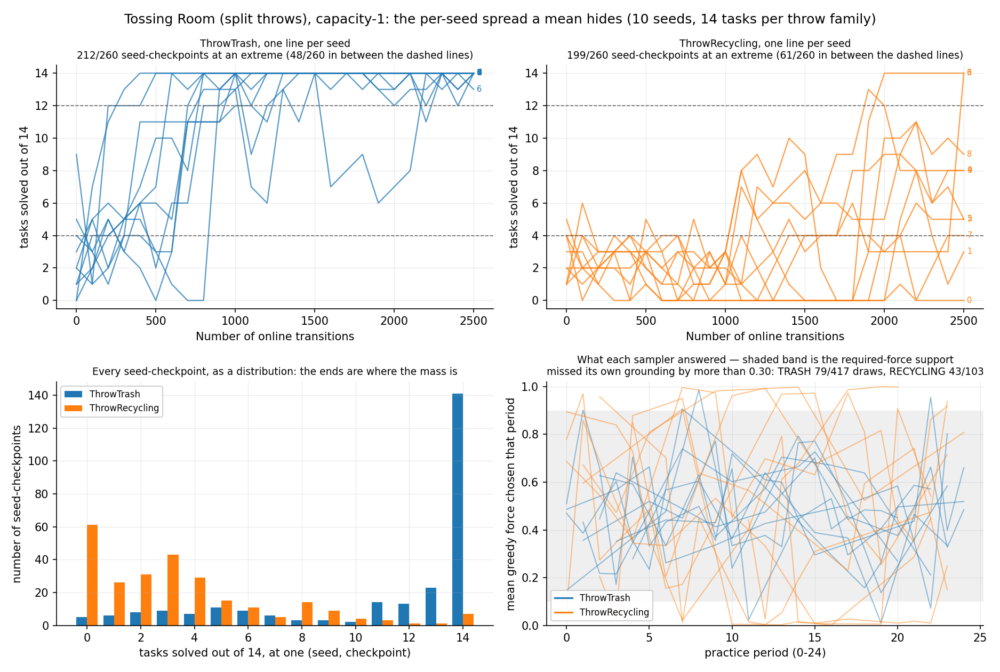

# The causal arm: what `tossingroomsplit`'s sampler is actually asked to learn, and how far it gets — 208/301 for trash, 11/56 against 11/57 for recycling

> **Environment retired (2026-08-07).** The `--env tossingroomsplit` domain this page was
> measured on has been deleted from the tree. It froze the item `weight` into the task's initial state, which
> `--practice-reset-policy never` then never re-drew -- so a reset-free arm
> practised at a single point of the task distribution. That is a defect, not a
> variant, and `tossingroomsplitpickupweight` (which draws the weight at pickup) is
> the corrected domain. Every number below stands
> exactly as it was published and none has been edited, restated or recomputed;
> what has changed is only that the domain can no longer be instantiated from
> HEAD. **This arm alone is re-runnable as a new measurement; the comparison it
> belongs to is not.** This page is the causal half of a representation A/B
> whose identity half ran on `tossingroomsplitidentity`. That domain is also
> deleted, so the A/B is **permanently unreproducible from HEAD** unless an
> identity throw representation is deliberately re-added. The MDE correction
> this page carries is unaffected and still stands.

**TL;DR.** The causal-representation arm of a two-domain comparison, run on the existing
`tossingroomsplit` at `main` (`db2589f`). Vanilla EES, 10 fixed seeds (0–9), 2500 online
transitions each, 30 test tasks at 14 TRASH / 14 RECYCLING / 2 EMPTY, horizon 12,
`--exploration-epsilon 0.5`. Three things this page establishes:

1. **This arm's landing invariant holds exactly.** A uniformly random force lands with
   probability **exactly 0.2** on every task, verified analytically, through the real
   dynamics (**4017/20000** trash, **3922/20000** recycling), and *in situ* from the run's
   own epsilon-random draws (**72/367**).
2. **`ThrowTrash` learns the causal relation; `ThrowRecycling` shows no learning
   detectable at its own MDE.** Trash's informed draws land **208/301** against their own
   coin flip **61/310** (+49.43pp, Fisher exact p < 0.0001). Recycling's land **11/56**
   against **11/57** — **+0.34pp, p = 1.0000**, a **null result** at a 26.36pp MDE.
3. **A correction to already-merged work.** PR #90 quoted a **20.19pp** MDE for that null
   result. That is the floor for a *different* comparison. The right figure for 56 vs 57
   is **26.36pp**, and the analysis script now prints every row's own floor beside it.

**A matching hazard the other arm must check.** The 0.2 invariant is what would make the
two arms equally hard to hit by luck — but it is a property of *this* arm, verified here
and **not** verifiable from here for the identity arm. The pre-#80 identity representation
this pair is modelled on drew `target_force ~ U[0.5, 1.0)` against the same `U(0, 1)` force
and 0.1 tolerance, which **clips for `target > 0.9`**: measured over 2,000,000 draws its
mean landing rate is **0.19** over a per-task range of **0.10 to 0.20**, with
**1/5** of tasks clipped. If the identity arm ships that range unchanged, the arms are
**not** matched on difficulty and the comparison is confounded — see "What would make the
two arms non-comparable".

The run reproduces PR #90's published numbers exactly — same seeds, same code, no code
change between `7f77c3b` and `db2589f` — so this page re-derives rather than re-measures.
What is new is the invariant check, the per-comparison MDEs, and the explicit statement of
the function being learned.

## Question / goal

Run the **causal-representation arm** of a two-domain comparison on the existing
`tossingroomsplit`: state, as an explicit transformation of the classifier's input row,
what its throw samplers are asked to learn, and measure how far each gets — separating
draws a discriminating classifier actually made from `sample`'s uniform fallback, each
against its **own** epsilon-random control. No new domain; the code already exists.

## Background

`tossingroomsplit` splits Tossing Room's single `Throw` into `ThrowTrash` and
`ThrowRecycling`, two lifted skills whose names key two independent `LearnedSkillSampler`
classifiers of identical architecture (PR #70, capacity-1 model in #71). PRs #80/#81 then
changed what a throw sampler must learn: the item used to carry `target_force` and the
landing rule was `|force - target_force| < 0.1`, so the MLP was asked to compare two of its
own inputs. Now a bin carries a per-task `throw_distance`, an item a per-task `weight`, and
the required force is an unobserved affine function of both.

PR #85 fixed `LearnedSkillSampler.sample` to fall back to a uniform draw when its
classifier cannot discriminate, recording `was_informed` separately from `was_random`; PR
#90 re-derived the results against it. The identity representation is being rebuilt in
parallel as a separate domain, `tossingroomsplitidentity`, so the two can be read side by
side. This page owns the causal side only.

## Hypothesis

`ThrowTrash`, with roughly 4.5x the practice attempts, learns the two-cause relation well
enough to beat its own coin flip; `ThrowRecycling`, at about one attempt per practice
period, does not accumulate enough positives for its classifier to discriminate, and its
informed draws land at its own random rate.

## Guidance given

- Method `ees`, seeds 0–9 fixed via `scripts/run_sweep.py`, 25 cycles x 100 steps, 30 test
  tasks at 14 TRASH / 14 RECYCLING / 2 EMPTY, horizon 12, `--exploration-epsilon 0.5` —
  matching the identity arm exactly or the comparison is worthless.
- Time one seed and report it before launching the sweep.
- Use the post-#85 sampler and split informed draws from fallback draws.
- **Carry a correction**: PR #90's 20.19pp MDE for the recycling null result is the floor
  for a 310-vs-57 comparison, not the 56-vs-57 one actually called null. Compute each MDE
  from its own two sample sizes.
- **Verify rather than assume** that a uniformly random force lands with probability 0.20
  on every task; if it does not, stop and say so.

## What the sampler is actually asked to learn

`EesMethod` hands each `LearnedSkillSampler` a row of
`[1.0 bias] + concat(state[obj] for obj in ground_skill.objects) + params`. For a throw
the bound objects are `(robot, item, bin, room)`, so the row is 12 wide:

| index | 0 | 1 | 2 | 3 | **4** | 5 | 6 | 7 | **8** | 9 | 10 | 11 |
|---|---|---|---|---|---|---|---|---|---|---|---|---|
| column | bias | robot.room | robot.holding | item.kind | **item.weight** | bin.count | bin.room | bin.kind | **bin.throw\_distance** | room.index | room.blocks\_right | force |

The force that lands is an **affine function of two of those columns**:

```text
force* = 0.5 + 0.2 * (x_8 - 2) + 0.4 * (x_4 - 1)
       = reference_force
       + distance_coefficient * (bin.throw_distance - reference_distance)
       + weight_coefficient   * (item.weight        - reference_weight)
```

and a throw lands iff `|force - force*| < 0.1`. **None of the five constants
(`0.5, 2, 0.2, 1, 0.4`) ever enters a `State`**, so the sampler cannot read them; it must
infer the relation from `x_4` and `x_8` alone.

**Contrast with the identity arm.** Before PRs #80/#81 the item carried `target_force`
instead of `weight` and the bin carried no `throw_distance`, making the row 11 wide and
the answer `force* = x_4` — a bare copy of one input column. That is the whole point of
the pair: **`force* = x_4` versus `force* = 0.5 + 0.2*(x_8 - 2) + 0.4*(x_4 - 1)`** — same
base sampler prior, same tolerance, same 100 candidates, same MLP architecture. **Not** the
same row width, and **not** automatically the same landing probability; both are treated as
caveats below rather than assumed.

Within one throw skill the bound bin, item and room never vary, so every kind-carrying
column is a flat constant: **3 of the 11 non-bias columns carry signal** here
(`item.weight`, `bin.throw_distance`, `force`), against **2 of 10** under the identity
representation — and under identity one of those two *was* the answer.

## The comparability invariant, verified three ways

Tasks draw `throw_distance ~ U[1, 3)` and `weight ~ U[0.5, 1.5)`, so

```text
force* in (0.5 - 0.2 - 0.2, 0.5 + 0.2 + 0.2) = (0.1, 0.9)
```

The winning window `(force* - 0.1, force* + 0.1)` therefore lies **wholly inside** the
`U(0, 1)` band `sample_params` draws from — never clipped — and its probability is its
width, **0.2, for every task rather than on average**.

| check | result |
|---|---|
| analytic, per task (400 tasks per family) | window width exactly 0.2 for **400/400** trash and **400/400** recycling |
| through the real dynamics, `env.take_action` | **4017/20000** trash, **3922/20000** recycling |
| in situ, this run's own epsilon-random draws | **72/367** (trash **61/310**, recycling **11/57**) |

The per-task rate over 200 tasks x 100 draws ranged **11/100 to 30/100**, ordinary binomial
noise at n = 100 (sd = 0.04).

All three checks are pinned by
`tests/environments/tossingroomsplit/test_throw_representation.py::TestTheCausesAreInTheState::test_a_uniformly_random_force_lands_with_probability_exactly_one_fifth`,
which asserts **both** halves of the probability — that the window has width
`2 * throw_tolerance` and is never clipped, *and* that `sample_params`'s draw band really
is `Uniform(0, 1)` — then measures the rate end to end through `env.take_action`. Either
half alone is vacuous: widening the band to `Uniform(0, 2)` halves the true landing rate
while leaving every window assertion true.

**This arm's invariant holds.** Whether the *comparison* is confounded depends on the
identity arm's landing rate, which is not measurable from this repo — see the caveats
section.

## Methods

| | |
|---|---|
| base | `main` at `db2589f`; this work is independent, not stacked |
| method | `ees` (vanilla), `--exploration-epsilon 0.5` |
| seeds | 10, fixed at 0–9 via `scripts/run_sweep.py`, never drawn |
| protocol | `--num-cycles 25 --max-steps-per-interaction 100` → exactly **2500** online transitions per seed |
| evaluation | `--num-test-tasks 30`, fixed composition **14 TRASH / 14 RECYCLING / 2 EMPTY**, horizon 12 |
| constants | `reference_force 0.5`, `reference_distance 2.0`, `reference_weight 1.0`, `distance_coefficient 0.2`, `weight_coefficient 0.4`, `throw_tolerance 0.1` — read back from `config_snapshot.json` |

```bash
python -m scripts.run_sweep \
  --env tossingroomsplit --methods ees --num-seeds 10 \
  --results-root results/causal-throws \
  --shared-args "--num-test-tasks 30" \
  --method-args "ees=--num-cycles 25 --max-steps-per-interaction 100 --exploration-epsilon 0.5" \
  --max-workers 10
```

Then one trace shard per seed (`scripts/tossingroomsplit_skill_traces.py`, `--seeds <k>`),
pooled by `analysis/practice_makes_perfect/tossingroomsplit_throw_rates.py`. The
consistency gate reports **all 10 traced seeds reproduce their swept `stats.json`
exactly**, so the two passes are the same experiment rather than assumed to be.

### Compute

| | wall clock |
|---|---|
| single seed, alone at 1 worker (timed and reported before launching) | **162.4 s** |
| sweep, 10 seeds at 10 workers | **200.7 s**, per-run mean 195.2 s |
| trace shards, 10 parallel processes | **~5 min** |

10/10 runs succeeded, no launch failures or retries. `--max-workers 10` rather than the
24-core default, because a second agent was running the identity arm on the same box.

## Results







All three are byte-identical to the figures committed with PR #90
(`2026-08-05-tossingroomsplit-throw-rates{,-per-seed}.png` and
`2026-08-06-tossingroomsplit-informed-split.png`) — which is the reproduction claim made
visible, since the same seeds and the same code produce the same plots. They are committed
again under this page's own names so that it remains readable if the earlier page's
artifacts are ever revised.

### 1. The endpoint gap

| | final sweep |
|---|---|
| TRASH | **139/140** |
| RECYCLING | **70/140** |
| gap | **+49.29pp** against a **16.74pp** MDE |
| paired Wilcoxon over seeds | n = 9, W = 44.0, **p = 0.0078** (one seed ties 14/14 vs 14/14) |

Whole curve, not just its endpoint: mean AUC **79.18** vs **24.67**, difference
**+54.51pp**, paired Wilcoxon n = 10, W = 55.0, **p = 0.0020**.

### 2. Informed draws against each skill's own control — with each comparison's own MDE

This is the decisive table. **Every MDE is computed from that row's own two
denominators**, `MDE = 2.801585 * sqrt(0.25/n_a + 0.25/n_b)`:

| skill | landed/informed | landed/random | gap | noise floor | MDE (80%) | Fisher p |
|---|---|---|---|---|---|---|
| `ThrowTrash` | **208/301** | 61/310 | **+49.43pp** | 4.05pp | **11.34pp** | **< 0.0001** |
| `ThrowRecycling` | **11/56** | 11/57 | **+0.34pp** | 9.41pp | **26.36pp** | **1.0000** |

`ThrowTrash`'s sampler learns the affine relation and beats its coin flip by four times
the MDE. `ThrowRecycling`'s is a **null result**: at 56 vs 57 the design can only exclude
an effect larger than 26.36pp, so what is established is that recycling's classifier
*cannot be distinguished from a coin flip* — not that it is worth exactly nothing.

Recycling's own random control lands 11/57, and its informed draws 11/56: both sit on the
0.2 line the invariant predicts. Of recycling's greedy draws, **47/103** were not informed
at all (`sample`'s uniform fallback), against **116/417** for trash.

### 3. Learning is a switch, and the practice budget is the asymmetry

| | |
|---|---|
| attempts | trash **727**, recycling **160** — ratio **4.54:1** |
| attempts per period | recycling is **0 or 1, never more** (160 periods at 1, 90 at 0); trash's ceiling is **12**, reached in 35/250 periods |
| at an extreme (>= 12/14 or <= 4/14) | trash **212/260** seed-checkpoints, recycling **199/260** |
| draws missing their grounding by > 0.30 | trash **79/417**, recycling **43/103** |

Per-seed endpoints show recycling is bimodal rather than uniformly weak: seeds 3 and 6
finish **14/14**, while seeds 0 and 1 finish **0/14** and **3/14**.

## The MDE correction

PR #90 and `docs/experiment-logs/2026-08-05-tossingroomsplit-throw-rates.md` quoted
**20.19pp** as the MDE for the recycling null result. That figure is correct — for a
**310 vs 57** comparison (trash's epsilon-random draws against recycling's), a row in a
neighbouring table. The comparison actually called null is recycling-informed against
recycling-random, **56 vs 57**:

```text
noise floor = sqrt(0.25/56 + 0.25/57) = 0.0941  ->  9.41pp
MDE         = 2.801585 * 0.0941       = 0.2636  ->  26.36pp
```

The published figure **understated the MDE by 6.17pp** — and the floor itself by 2.20pp,
7.21 → 9.41 — making the null result look better resolved than it was. The conclusion is
unchanged; the bound on what could have been missed is weaker.

The mechanism was that the informed-vs-random table printed a gap and a p-value but **no
MDE**, so the only MDE on the page belonged to a different comparison and got borrowed.
Each row now carries its own floor and MDE, pinned by
`test_each_informed_versus_random_row_carries_its_own_denominators_mde`. The 2026-08-05
page has been corrected in place with a dated note.

(26.36pp rather than the 26.34pp of a hand calculation: this repo's `_MDE_CONSTANT` is the
unrounded `z_0.025 + z_0.20` = 2.801585, and every other MDE on the page uses it.)

## What would make the two arms non-comparable

Stated plainly, because the pair is only worth as much as its matching:

- **Landing probability: verified here, UNVERIFIED there, and the historical range does
  not match.** This arm is 0.2 exactly on every task. The pre-#80 identity representation
  drew `target_force ~ U[0.5, 1.0)` against the same `U(0, 1)` force and 0.1 tolerance, so
  its window is clipped whenever `target > 0.9`. Over 2,000,000 draws: mean landing rate
  **0.19**, per-task range **0.10 to 0.20**, **1/5** of tasks clipped. A clipped task is up
  to twice as hard to hit by luck. **If `tossingroomsplitidentity` ships `target_low = 0.5,
  target_high = 1.0` unchanged, the two arms are not equally hard and the comparison is
  confounded.** The fix is a target range whose window is never clipped — e.g.
  `U[0.1, 0.9)`, which gives exactly 0.2 per task and matches this arm. This must be
  checked on the identity side before the pair is read.
- **Row width: NOT matched, unavoidably.** This arm's row is **12** columns; the identity
  arm's is **11**, because representing two causes needs one more observable than
  representing the answer. The MLP input dimension therefore differs by one. This does not
  change task difficulty, but it is not a perfectly matched architecture and should not be
  described as one.
- **Signal-carrying columns: 3 of 11 here, 2 of 10 there** — and under identity one of the
  two *was* the answer, which is the intended difference rather than a confound.
- **Everything else matched by construction:** same `U(0, 1)` base sampler, same
  `throw_tolerance = 0.1`, same 100 candidates, same epsilon 0.5, same 25x100 protocol,
  same 14/14/2 test composition at horizon 12, same fixed seeds 0–9.

## Recommendation

1. **Read the pair on the informed-vs-random table, not the endpoint.** The endpoint gap
   confounds representation with practice budget: recycling gets 160 attempts to trash's
   727 in *both* arms. The informed-vs-own-control rate is the representation-sensitive
   statistic, and it already has adequate resolution on the trash side (11.34pp MDE).
2. **Do not expect the recycling side to settle the question in either arm.** At 56
   informed draws its MDE is 26.36pp. If the identity arm's recycling sampler also lands
   near 0.2, that is two null results at a weak floor, not evidence of equivalence. The
   trash side, at 301 vs 310, is where a representation effect is detectable.
3. **Never quote an MDE computed from other denominators.** Compute every floor and MDE
   from its own two sample sizes, and print them beside the comparison so the next reader
   cannot borrow a neighbouring one.
