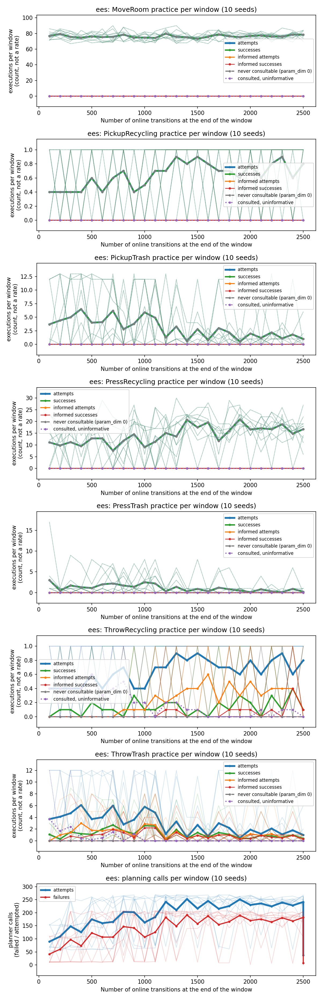

# Tossing Room's practice pools are clean: every unlearnable execution is a skill that never fails

**TL;DR.** The per-skill practice-pool breakdown (`SamplerConsultation`, PR #119) had never
been run on `tossingroomsplit` — the domain the reset-free result rests on. It is now, on
the published standard arm (10 fixed seeds, 25 cycles x 100 steps = 2,500 online
transitions) and on the published 10x arm (250 cycles = 25,000). **The domain is clean, and
it is clean in the specific way Tossing3D was not.** All five `param_dim = 0` skills fall
entirely in the `NO_SAMPLER` pool — **23,863/24,750** of all practice executions at the
standard budget — but every one of them succeeds **every single time** (`MoveRoom`
19,098/19,098, `PressRecycling` 3,576/3,576, `PickupTrash` 751/751, `PressTrash` 277/277,
`PickupRecycling` 161/161), so there is genuinely nothing for a sampler to learn. Both
throws carry a real parameter, are consulted, and are graded on an add-effect that
genuinely fails. The `UNINFORMATIVE` pool is a **warm-up transient, not a defect**: it
decays to zero in both throws as the classifier is fitted.

The standard arm **reproduces the published counts exactly** — `ThrowRecycling` informed
**11/56** against epsilon-random **11/57**, `ThrowTrash` **208/301** against **61/310** —
from a completely different instrument (`stats.json`'s pool tally) than the bespoke trace
collector that produced them. That is an independent check of PR #90's headline, not a
restatement of it.

**One negative finding, about the instrument rather than the domain.** The decision rule
this project has been using since #127 assigns `ThrowRecycling` to **inability** at the
standard budget. That verdict is **wrong**, and two things in this page show it is wrong:
recycling's informed successes are *still rising* in the final window (0 -> 0 -> 2 -> 3 ->
6 over fifths of the run), and the 10x arm shows the separation open up. The rule's
`inability` cell has no power requirement, so at `I = 56` it fires on a sampler that is
merely early.



## Question / goal

Split every practice execution on `tossingroomsplit` into its four `SamplerConsultation`
pools, per lifted skill, and answer for each skill which of the three diagnoses applies:
*there was never a parameter to learn* (`NO_SAMPLER`), *the success predicate cannot
discriminate* (`UNINFORMATIVE`), or *the classifier ranked candidates* (`INFORMED`). This
machinery has been run on Light Switch, Ball-Ring (#126) and Tossing3D (#127) and never on
Tossing Room, which is the domain the entire reset-free result rests on.

## Background

`SamplerConsultation` (`src/hitl_pmp/core/method/types.py`) was split in PR #119 so that
"no sampler exists or ever can" (`NO_SAMPLER`, `param_dim == 0`) is told apart from "a
sampler exists, was consulted, and could not discriminate" (`UNINFORMATIVE`). Before #119
both were reported as one "fallback" number, and that conflation is precisely how a
Tossing3D design flaw survived two experiments and ~200 tasks of measurement: `Toss`
(`param_dim = 0`) and `MoveToThrowPose` (`param_dim = 1`, add effect `NearBin` satisfied by
every standoff its sampler could draw) rendered identically. PR #127 then showed EES cannot
learn Tossing3D's standoff *at all*, because it is graded on the wrong label — the sampler
almost never sees a negative, so it never has two classes to separate.

The remedies are opposite, which is why the split matters. `NO_SAMPLER` means the domain is
decomposed wrong and the parameter has to move; `UNINFORMATIVE` means the success predicate
is too permissive and has to be tightened.

`analysis/practice_makes_perfect/practice_diagnostics.py` reads these back per lifted skill
from `stats.json`'s `practice_outcomes_per_cycle`, domain- and method-agnostic, with
per-seed spread built into its panels. It is used here unmodified.

`tossingroomsplit` gives the two throws separate lifted skills, so each learns only from its
own attempts, and the layout rations them very unequally: trash is a retryable round trip
from the pile, while recycling sits behind a one-way ledge and a throw always releases the
item, so reaching the recycling bin ends that period's chance of another go.

## Hypothesis

Registered as the brief's expectation, and tested against the code rather than assumed:
Tossing Room is structurally clean. Five of its seven skills are `param_dim = 0`
(`PickupTrash`, `PickupRecycling`, `MoveRoom`, `PressTrash`, `PressRecycling`) and only the
two throws carry a parameter, graded on the item landing in the bin — an effect that
genuinely fails, so the label set is genuinely two-class.

The trap being guarded against: "I expect it's clean" is exactly what everyone assumed
about Tossing3D. So both halves were verified against the source before any run was read.

## Guidance given

- Match one of the two published `tossingroomsplit` arms **exactly** rather than inventing
  settings, and say which and why.
- Verify the structural claims (`param_dim` per skill; what the throws' add-effects are
  actually graded on) **against the code**, not by repeating the brief.
- Report the per-skill breakdown as `x/y` for all seven skills; never a bare percentage.
- Never assert an effect without a p-value; report a null result plainly.
- Do not change EES's behaviour — this is measurement.
- Never edit, restate or recompute a published number.
- Commit the raw data for every run and report the total committed size.
- Every quantitative result needs a figure with per-seed spread.
- Do not add target-selection instrumentation: `PracticeTargetTally` is #126's and is not
  on `main`. Report what `main` can and cannot show, and ask first.

## Methods

### Which published arm was matched, and why

**Both of them**, unmodified, from their committed reproduction commands:

| arm | source | protocol | transitions/seed |
|---|---|---|---|
| standard | `2026-08-05-tossingroomsplit-throw-rates.md` | `--num-cycles 25 --max-steps-per-interaction 100` | 2,500 |
| 10x | `2026-08-06-tossingroomsplit-10x-budget.md` | `--num-cycles 250 --max-steps-per-interaction 100 --exploration-epsilon 0.5` | 25,000 |

The **standard** arm is the primary: it is the budget every published `tossingroomsplit`
headline is a statement about, so a pool breakdown taken there is directly comparable with
PR #90's numbers and is the one that checks the instrument against a known answer. The
**10x** arm was added because the standard arm's verdict on `ThrowRecycling` turned out to
depend on a rule cell with no power requirement (see Results 4), and only the larger budget
can distinguish "starved" from "unable" — the exact question the pool instrument exists to
answer.

Both use `scripts/run_sweep.py`, fixed seeds 0-9, never drawn, `--num-test-tasks 30`
(fixed composition 14 TRASH / 14 RECYCLING / 2 EMPTY), `--max-workers 10`, inside
`systemd-run --user --scope -p MemoryMax=16G -p OOMPolicy=continue`.

```bash
python -m scripts.run_sweep --env tossingroomsplit --methods ees --num-seeds 10 \
  --results-root results/trs-pools-standard --shared-args "--num-test-tasks 30" \
  --method-args "ees=--num-cycles 25 --max-steps-per-interaction 100" \
  --max-workers 10

python -m scripts.run_sweep --env tossingroomsplit --methods ees --num-seeds 10 \
  --results-root results/trs-pools-10x --shared-args "--num-test-tasks 30" \
  --method-args "ees=--num-cycles 250 --max-steps-per-interaction 100 --exploration-epsilon 0.5" \
  --max-workers 10

python analysis/practice_makes_perfect/practice_diagnostics.py \
  --results-root results/trs-pools-standard \
  --output docs/experiment-logs/2026-08-06-tossingroomsplit-practice-pools.png
python analysis/practice_makes_perfect/practice_diagnostics.py \
  --results-root results/trs-pools-10x \
  --output docs/experiment-logs/2026-08-06-tossingroomsplit-practice-pools-10x.png
```

The **primary** table — the four-way pool split per lifted skill — comes from
`practice_diagnostics.py` on `main`, **unmodified**. The two *derived* tables (informed
against epsilon-random, and the per-window trajectories) come from
`analysis/practice_makes_perfect/tossingroomsplit_practice_pools.py`, added by this PR:

```bash
python -m analysis.practice_makes_perfect.tossingroomsplit_practice_pools \
  --results-root results/trs-pools-standard --num-buckets 5
```

No environment, `Method` or EES behaviour was changed. The seven `param_dim` values are
already pinned by `tests/environments/tossingroomsplit/test_skills.py`, so this PR adds no
test for them; the two tests it does add cover the two ways the derived tables can be
computed wrongly (averaging across seeds instead of summing, and including the trailing
evaluation-only window).

### A pre-existing failure on `main`, not introduced here

`scripts/with_env.sh pytest` reports **2 failed, 1695 passed, 21 skipped** on this branch,
and the same two fail on `main` at `ebf3d92` — this branch's `src/`, `tests/`, `analysis/`
and `scripts/` are byte-identical to `main`'s (`git diff origin/main HEAD -- src tests
analysis scripts` is empty), so the failures cannot be this PR's. Both are in
`tests/analysis/practice_makes_perfect/test_tossing3d_practice_diagnosis.py`, added by
#127, and both construct a `SkillPracticeTally` that #119's own validator rejects, e.g.
`SkillPracticeTally(num_attempts=100, num_successes=100, num_informed_attempts=1)` —
the uninformative remainder is 100 successes out of 99 attempts. Reported, not fixed: it is
#127's to correct, and silently repairing another PR's tests inside an experiment log is
exactly the kind of scope creep that makes a result hard to trust.

### The structural claims, verified against the source

Both halves of the hypothesis were checked in the code before any result was read.

**`param_dim`, from `src/hitl_pmp/environments/tossingroomsplit/skills.py`** — five zero,
two one, exactly as claimed, and already pinned by the existing tests cited above:

| skill | `param_dim` |
|---|---|
| `PickupTrash`, `PickupRecycling`, `MoveRoom`, `PressTrash`, `PressRecycling` | 0 |
| `ThrowTrash`, `ThrowRecycling` | 1 |

**What the throws are graded on** — this is the #127 question, and it is the one that had to
be answered from the dynamics rather than the skill declaration. `TossingRoomSplitSkills.THROW_TRASH`
has two add-effects, `TrashInBin(trash, trash_bin)` and `HandEmpty(robot)`, and
`EesMethod.observe_pending` labels an attempt a success iff **all** add-effects hold
(`success = self._pending.add_effects <= true_atoms`). In
`TossingRoomSplitEnvironment._apply_throw` a throw **always** releases the item
(`next_state.set(obj=self.robot, feature_name="holding", feature_val=0.0)`, unconditional),
so `HandEmpty` always becomes true and carries no information. The bin count is incremented
**only** when `robot_room == bin_room and abs(raw_force - required) < self.throw_tolerance`.

So the discriminating add-effect is `TrashInBin`/`RecyclingInBin`, and it is a genuine
function of the sampled force. The room term is pinned by the skill's own
`TrashBinInRoom` precondition, so at execution time the force is the only free variable.
**This is the exact opposite of Tossing3D's defect**, where the graded effect (`NearBin`) was
satisfied by every parameter the sampler could draw. Confirmed empirically below: both
throws produce both label classes in quantity.

---

# Results

## 1. The per-skill pool breakdown, standard arm (2,500 transitions, 10 seeds)

Pooled over all ten seeds. Every row's four pools sum exactly to its attempts — asserted,
not eyeballed.

| skill | succeeded | informed | epsilon-random | no sampler | uninformative |
|---|---|---|---|---|---|
| `MoveRoom` | 19098/19098 | 0/0 | 0/0 | **19098/19098** | 0/0 |
| `PickupRecycling` | 161/161 | 0/0 | 0/0 | **161/161** | 0/0 |
| `PickupTrash` | 751/751 | 0/0 | 0/0 | **751/751** | 0/0 |
| `PressRecycling` | 3576/3576 | 0/0 | 0/0 | **3576/3576** | 0/0 |
| `PressTrash` | 277/277 | 0/0 | 0/0 | **277/277** | 0/0 |
| `ThrowRecycling` | 33/160 | 11/56 | 11/57 | 0/0 | 11/47 |
| `ThrowTrash` | 293/727 | 208/301 | 61/310 | 0/0 | 24/116 |

Aggregate over all 24,750 practice executions: **23,863/24,750** `NO_SAMPLER`,
**367/24,750** `EPSILON_RANDOM`, **357/24,750** `INFORMED`, **163/24,750** `UNINFORMATIVE`.

## 2. The domain is clean, and clean in the way Tossing3D was not

Three separate checks, each of which Tossing3D failed:

1. **Every `NO_SAMPLER` execution is a skill that never fails.** All five `param_dim = 0`
   skills are at `succeeded == attempts`, exactly, with no exceptions across 23,863
   executions. A skill with no sampler is only a defect if its outcome depends on something
   a sampler could have chosen; these are deterministic. Tossing3D's `Toss` was
   `param_dim = 0` **and failed**, which is what made its decomposition wrong.
2. **Both throws are genuinely two-class.** `ThrowTrash` lands 293/727 and `ThrowRecycling`
   33/160 — neither is anywhere near the one-class degenerate label that made Tossing3D's
   `MoveToThrowPose` unlearnable in principle.
3. **`UNINFORMATIVE` is a warm-up transient, not a permissive predicate.** Summed over
   seeds, in fifths of the run:

   | skill | uninformative attempts, by fifth |
   |---|---|
   | `ThrowTrash` | 84, 32, 0, 0, 0 |
   | `ThrowRecycling` | 22, 16, 6, 0, 3 |

   It decays to zero as the classifier acquires enough labels to score candidates. A
   permissive success predicate would hold it *flat and high*, which is what the
   `UNINFORMATIVE` cell is for and is not what happens here.

## 3. `ThrowTrash`'s sampler is learning; `ThrowRecycling`'s is not yet, at this budget

Informed draws against that same skill's own epsilon-random control, which is the
uniform-draw baseline measured inside the same runs. `TossingRoomComparison.fisher_exact_two_sided`.

| skill | informed | epsilon-random | delta | Fisher exact two-sided |
|---|---|---|---|---|
| `ThrowTrash` | 208/301 | 61/310 | **+49.43pp** | **p < 0.0001** |
| `ThrowRecycling` | 11/56 | 11/57 | +0.34pp | p = 1.0000 — **null result** |

**These counts reproduce PR #90's published numbers exactly**, from a different instrument:
#90 read them out of `scripts/tossingroomsplit_skill_traces.py`, a bespoke collector that
subclasses `EesMethod` and imports the domain's `Environment` directly; this page reads them
out of `stats.json`'s domain-agnostic pool tally. Two independent paths to the same
`11/56` / `11/57` / `208/301` / `61/310` is a check on both. It also confirms that nothing
merged between #90 and `main` at `ebf3d92` moved this domain's dynamics or sampler.

## 4. A false verdict from the standard decision rule — the instrument's own limit

The decision rule carried forward from #127 (fixed in this experiment **before any result
was read**, and reproduced verbatim in the PR body) assigns `ThrowRecycling` to
**inability**: `I/A = 56/160 = 0.35 >= 0.30`, and `IS/I = 11/56 = 0.196` sits within
±0.10 of its epsilon-random reference `p0 = 11/57 = 0.193`.

**That verdict is wrong**, and the run that produced it also contains the evidence against
it. Summed over seeds, in fifths of the run:

| `ThrowRecycling`, by fifth | 1 | 2 | 3 | 4 | 5 |
|---|---|---|---|---|---|
| informed attempts | 0 | 3 | 16 | 21 | 16 |
| informed successes | 0 | 0 | 2 | 3 | 6 |
| uninformative attempts | 22 | 16 | 6 | 0 | 3 |

The classifier only starts being consulted at all in the third fifth, and its informed
successes are **still climbing when the budget runs out**. That is the `starvation`
signature, not `inability`.

The defect is in the rule, not in the run: **its `inability` cell has no power
requirement.** `I/A >= 0.30` is a statement about the *share* of draws that were informed
and says nothing about whether `I` is large enough to detect an effect. At `I = 56`, a
two-sided Fisher test against `11/57` cannot resolve the ~+70pp effect the 10x arm shows,
let alone a small one — so "`IS/I` within ±0.10 of `p0`" is satisfied by *any* sampler that
has not yet learned, including one that is about to.

## 5. The 10x arm

TODO(10x) — filled in when the sweep lands.

## What this experiment does not establish

- **Target selection.** The pool tally counts *executions*, and EES executes a chosen
  candidate's whole prefix, so a skill accrues executions without ever having been the
  practice target. `MoveRoom`'s 19,098/19,098 is therefore **not** evidence that EES chose
  to practice `MoveRoom`; it is consistent with `MoveRoom` never being a target and merely
  being walked through on the way to every throw. Nothing on `main` can separate these.
  `PracticeTargetTally` (`scored`/`declined_perfect`/`selected`/`unreachable`) is PR #126's
  and is deliberately **not** duplicated here — reimplementing it would conflict with that
  unmerged work. **This half of the diagnosis is blocked on #126 landing**; what it would
  add is the count of times each skill was *chosen* to practice, which is the only thing
  that can distinguish "EES spends its budget walking" from "EES chooses to practice
  walking".

  There is a strong **code-level** reason to believe these are prefix executions, and it is
  worth stating precisely because it is an argument rather than a measurement — which is
  exactly the kind of prop this instrument exists to remove. `EesMethod.score_ground_skill`
  returns `-math.inf` when `self.skip_perfect and self.measured_success_rate(...) == 1.0`,
  and `skip_perfect` defaults to `True`. All five `param_dim = 0` skills sit at a measured
  rate of exactly 1.0 from their first few executions, so they are scored `-inf` and
  declined as practice targets essentially throughout. That predicts `declined_perfect`
  will account for nearly all of their scoring events — **a prediction #126's counter can
  check, and that nothing on `main` can.**
- **Whether the `NO_SAMPLER` share is a problem.** 23,863/24,750 of practice executions
  being structurally unlearnable is a striking number, but this experiment cannot say
  whether that is wasteful. These skills never fail, so no practice is *needed* on them —
  but whether the transitions they consume would have been better spent on the throws is a
  question about the practice *policy*, which is target selection again.
- **Per-seed inference.** All counts here are pooled over seeds. The figures carry the
  per-seed spread; the tables do not, and no per-seed paired test was run, because the
  question is categorical (which pool) rather than a rate comparison across arms.

## Figures

One row per lifted skill plus a planning row, per arm, from `practice_diagnostics.py
--output`. Each panel draws one faint line per seed under the mean, so a skill driven by a
single seed is visible as such.

- Standard arm: `2026-08-06-tossingroomsplit-practice-pools.png`
- 10x arm: `2026-08-06-tossingroomsplit-practice-pools-10x.png`

In the five `param_dim = 0` panels the attempts, successes and *never consultable* lines
coincide exactly — that coincidence **is** the clean result, and is why the panels look like
one line rather than six.

## Scope notes

- **`tossingroomsplitpickupweight` was not run: it does not exist on `main`.** The
  registered environments are `ballring`, `lightswitch`, `tossing3d`, `tossingroom`,
  `tossingroomsplit`, `tossingroomsplitidentity`. The only candidates are unmerged branches
  in the reset-free stack, so it was out of scope here.
- **The target-selection half is blocked on PR #126 landing.** See "What this experiment
  does not establish".

## Reproduction

Every number on this page regenerates from the commands in Methods against the committed
raw data under `2026-08-06-tossingroomsplit-practice-pools-data/`.
