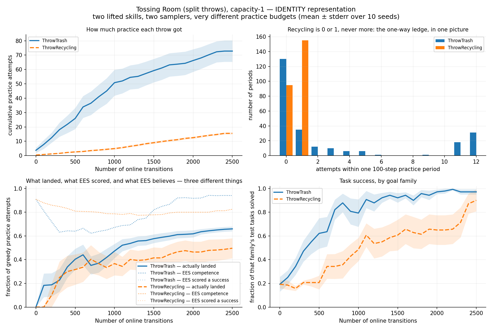
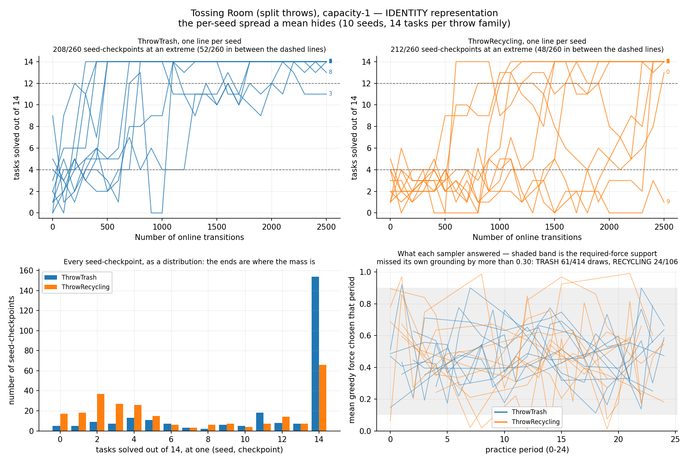
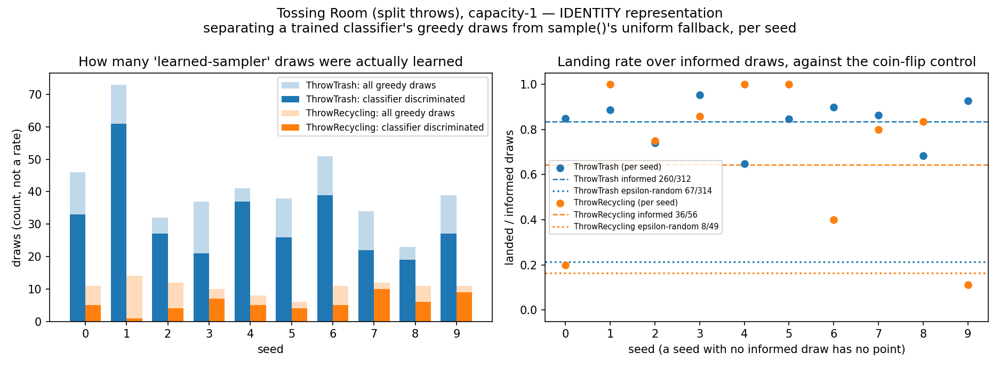

# The same fifty-six recycling draws: 36/56 when the answer is a column, 11/56 when it has to be inferred

> **Environment retired (2026-08-07).** The `--env tossingroomsplitidentity` domain this page was
> measured on has been deleted from the tree. It existed solely to restore the degenerate **identity** throw
> representation as the counterpart arm of a representation A/B, and it
> shared the frozen-weight defect described in the sibling logs. Every number below stands
> exactly as it was published and none has been edited, restated or recomputed;
> what has changed is only that the domain can no longer be instantiated from
> HEAD. **Not re-runnable, permanently, from HEAD.** The question this page asks --
> does the throw *representation* explain `ThrowRecycling`'s failure to
> learn? -- requires the identity representation as a condition, and no
> surviving domain provides one. Reproducing it would mean re-adding an
> identity representation (e.g. as a flag on the canonical domain), which is
> a deliberate decision, not a re-run.

**TL;DR.** A new domain, `tossingroomsplitidentity`, restores the degenerate **identity**
throw representation that PRs #80/#81 removed, as a counterpart arm to
`tossingroomsplit` rather than a replacement for it. The answer sits in each throw's own
classifier row as a literal column, so the optimal policy is the transformation
`force* = x₄` — copy input index 4.

1. **Both samplers learn, decisively.** Against its own epsilon-random control,
   `ThrowTrash`'s informed draws land **260/312** vs **67/314** (+62.00pp, MDE 11.20pp,
   Fisher exact p < 0.0001) and `ThrowRecycling`'s land **36/56** vs **8/49**
   (+47.96pp, MDE 27.40pp, Fisher exact p < 0.0001). Both gaps exceed their own MDE, so
   both are established rather than merely significant.
2. **That is the result the causal arm could not get.** At the committed causal numbers
   (PR #90), `ThrowRecycling`'s informed draws land **11/56** against a **11/57** coin
   flip — a null result. Here, at the *identical* 56 informed draws, they land **36/56**:
   **+44.64pp, MDE 26.47pp, Fisher exact p < 0.0001**.
3. **The endpoint gap is a null result.** TRASH **136/140**, RECYCLING **126/140**, gap
   +7.14pp against an MDE of 16.74pp, paired Wilcoxon n=4, p = 1.0000. Recycling
   effectively catches up; nine of ten seeds finish at 13/14 or 14/14.
4. **Trash still learns faster**, which is structural, not representational: AUC 78.98 vs
   50.00, +28.98pp, paired Wilcoxon n=10, W=52.0, **p = 0.0098**. The layout buys
   728 trash practice attempts against 155 recycling ones (4.70:1).







## Question / goal

Does the throw *representation* explain `ThrowRecycling`'s failure to learn on
`tossingroomsplit`, or does its small practice budget explain it? Build the identity arm
at a matched protocol and compare.

## Background

`tossingroomsplit` splits `Throw` into `ThrowTrash` and `ThrowRecycling`, two
`LearnedSkillSampler`s of identical architecture on very different practice budgets —
trash is an eight-step round trip that a practice period buys several of, recycling is
one-way across an irreversible ledge and a period buys exactly one.

Before PRs #80/#81 that domain used an **identity** throw representation: the item
carried `target_force`, and a throw landed iff `|force − target_force| < 0.1`. Since
`EesMethod`'s classifier row is
`[1.0] + concat(state[obj] for obj in ground_skill.objects) + [force]`, that value sat at
index 4 — the net was being asked to learn `|x₁₀ − x₄| < 0.1`, a comparison between two
of its own inputs. #80 replaced it with two observable *causes* (a per-bin
`throw_distance`, a per-item `weight`) combined by an unobserved affine relation, so a
sampler has to learn a relation instead of copying a column.

PR #85 then found that `LearnedSkillSampler.sample` had been pooling two very different
things under "greedy": genuine argmax draws, and a uniform fallback taken when the
classifier cannot discriminate. It now records `was_informed` separately. Re-derived
against that fix (PR #90), `ThrowRecycling`'s informed draws landed **11/56** against its
own **11/57** epsilon-random control — a null result, at denominators that could only
exclude an effect larger than 26.36pp.

This domain is the other arm of that comparison.

## Hypothesis

Registered before the run: if the representation is what `ThrowRecycling` failed on, then
restoring the identity representation should let it beat its own coin flip at the same
practice budget that taught it nothing in the causal arm. If the budget is what it failed
on, 56 informed draws should be too few either way and the null result should reproduce.

## Guidance given

- New domain `tossingroomsplitidentity`, registered in `cli.py`; a **verbatim fork** of
  `tossingroomsplit` with **exactly one delta**, the throw representation.
- Pin that one-delta claim with a test asserting layout, ledge direction, bin capacity,
  button wiring, lifted skill names and arities, test-task composition and horizon.
- Verify difficulty is matched — a uniformly random force must land with probability
  **0.20 on every task** — and stop rather than proceed if it does not.
- Method `ees`, seeds 0–9, 25 cycles × 100 steps = 2500 transitions, 30 test tasks at
  14 TRASH / 14 RECYCLING / 2 EMPTY, horizon 12, `--exploration-epsilon 0.5`.
- Time one seed before launching the sweep. Split informed from fallback draws; the
  pooled "greedy" number is the statistic that previously misled us.

## Methods

| | |
| --- | --- |
| domain | `tossingroomsplitidentity` (identity throw representation) |
| method | `ees`, `--exploration-epsilon 0.5` |
| seeds | 0–9, fixed, via `scripts/run_sweep.py` |
| protocol | 25 cycles × 100 steps per interaction = 2500 online transitions |
| evaluation | 30 test tasks, fixed composition 14 TRASH / 14 RECYCLING / 2 EMPTY |
| horizon | 12 (`longest_shortest_solve() + 2`) |

```bash
# 1. the sweep
python -m scripts.run_sweep --env tossingroomsplitidentity --methods ees --num-seeds 10 \
  --results-root <root> --shared-args "--num-test-tasks 30" \
  --method-args "ees=--num-cycles 25 --max-steps-per-interaction 100 --exploration-epsilon 0.5" \
  --max-workers 10

# 2. the per-skill traces, one process per seed (sharded)
python -m scripts.tossingroomsplit_skill_traces --label identity-representation \
  --env tossingroomsplitidentity --seeds <k> \
  --num-cycles 25 --max-steps-per-interaction 100 --num-test-tasks 30 \
  --output <root>/traces/shard-<k>.json

# 3. the analysis
python -m analysis.practice_makes_perfect.tossingroomsplit_throw_rates \
  --traces <each shard> --results-root <root> \
  --output ...-throw-rates.png --per-seed-output ...-per-seed.png \
  --informed-output ...-informed-split.png
```

### The answer as an explicit transformation of the input row

For `ThrowTrash(robot, trash, trash_bin, room)` the classifier row is **11 columns**:

| index | 0 | 1 | 2 | 3 | **4** | 5 | 6 | 7 | 8 | 9 | 10 |
| --- | --- | --- | --- | --- | --- | --- | --- | --- | --- | --- | --- |
| | 1.0 | `robot.room` | `robot.holding` | `trash.kind` | **`trash.target_force`** | `trash_bin.count` | `trash_bin.room` | `trash_bin.kind` | `room.index` | `room.blocks_right` | `force` |

The optimal policy is **`force* = x₄`**. The classifier's job is `|x₁₀ − x₄| < 0.1`.

The causal arm's row is **12 columns**, not 11 — two causes need one more observable than
the answer does, and its `force` therefore sits at index 11. The two rows are *not* the
same width; that difference is a consequence of the representation, not a difficulty
knob.

### Matched difficulty, and the two ranges that were rejected

This arm is **not a bit-faithful restoration** of the pre-#80 domain, and the difference
is deliberate. A reader who remembers the old domain should not read it as a mistake.

`sample_params` draws a force from U(0, 1), so a task's winning window
`[target − 0.1, target + 0.1]` only carries its full 0.2 of probability mass while it sits
wholly inside that band.

- **Rejected: the pre-#80 `target_force ~ U[0.5, 1.0)`.** Its top decile clips against the
  edge of the force band — landing probability 0.20 on only 8/10 of its range, falling to
  0.10 at target 1.0, averaging 0.19. That makes the identity arm *harder* than the causal
  arm and confounds representation with difficulty.
- **Rejected: `target_force ~ U[0.1, 0.9)`.** This fixes the per-task probability (0.20
  everywhere, and [0.1, 0.9] is exactly the span the causal arm's `required_force`
  occupies) but not the **marginal**: the causal arm's required force is a sum of two
  uniforms and so is *triangular*, concentrating mass near 0.5. Measured over 400
  groundings per family, the best single **fixed** force lands **119/400** under a uniform
  target against **185/400** in the causal arm — so a state-blind sampler would score very
  differently in the two arms.
- **Shipped: draw the causal arm's two causes and resolve them.** `Tasks` draws the same
  `throw_distance` and `weight`, from the same ranges, in the same order, and combines
  them with the same five constants — then puts the *result* in the State as
  `target_force` and discards the causes.

That last construction matches on both axes, and buys something stronger: because the two
arms consume their RNG in lockstep, **a given seed yields the same practice tasks and the
same test tasks in both, with the same required force for every throw.** The arms are
paired, not merely comparable. `test_fork_equivalence.py` asserts that task-for-task
agreement directly.

### The landing invariant, measured three ways

| | measurement | result |
| --- | --- | --- |
| analytic, per task | window coverage over 400 sampled tasks | **400/400** unclipped, coverage exactly 0.2000 |
| through the real dynamics | `env.take_action` with a U(0,1) force, `ThrowTrash` | **3995/20000** = 0.1998 |
| through the real dynamics | same, `ThrowRecycling` | **3996/20000** = 0.1998 |
| in situ | this run's own epsilon-random draws, `ThrowTrash` | **67/314** = 0.213 |
| in situ | same, `ThrowRecycling` | **8/49** = 0.163 |
| in situ | pooled | **75/363** = 0.207 |

The causal arm measured the same invariant at 400/400, 4017/20000 and 3922/20000, and
72/367 in situ. The two arms are matched.

### Compute, measured rather than guessed

| | wall clock | per-run mean |
| --- | --- | --- |
| single-seed calibration (alone, 1 worker) | **2 min 26 s** (146.2 s) | — |
| sweep, 10 seeds at 10 workers | **3 min 31 s** | — |
| traces, 10 parallel processes | **3 min 31 s** | — |

### Why step 2 exists, and how it is checked

`stats.json` is task-level only: it has no per-skill attempt counts and no
`was_informed` bit. Those never leave `EesMethod`'s internals, so
`scripts/tossingroomsplit_skill_traces.py` subclasses it to read them out. That script now
serves **both** arms via `--env`, so the shards are provably the same shape; `ThrowTarget`
is the only place the two representations differ in it.

The analysis refuses to report unless every traced run reproduces its swept `stats.json`
exactly. It printed `consistency gate: all 10 traced seeds reproduce their swept
stats.json exactly`.

## Results

### 1. The attempt budget: unchanged, as designed

| skill | observed practice attempts | attempts/seed |
| --- | --- | --- |
| `ThrowTrash` | 728 | 72.8 |
| `ThrowRecycling` | 155 | 15.5 |

Ratio **728:155 = 4.70** trash attempts per recycling attempt. `ThrowRecycling` gets 0 or
1 attempt per practice period (`{0: 95, 1: 155}`) — the structural asymmetry the domain
exists to expose, and it is untouched by the representation change.

### 2. Per practice attempt — the result the representation changes

| skill | greedy draws | of those, the classifier could not discriminate | informed draws | landed / informed |
| --- | --- | --- | --- | --- |
| `ThrowTrash` | 414 | 102/414 | 312 | **260/312** |
| `ThrowRecycling` | 106 | 50/106 | 56 | **36/56** |

**The decisive comparison is each skill against its own coin flip:**

| skill | informed draws | its own epsilon-random draws | gap | MDE | Fisher exact |
| --- | --- | --- | --- | --- | --- |
| `ThrowTrash` | **260/312** | 67/314 | **+62.00pp** | 11.20pp | **p < 0.0001** |
| `ThrowRecycling` | **36/56** | 8/49 | **+47.96pp** | 27.40pp | **p < 0.0001** |

Both gaps clear their own MDE, so both are established effects rather than significance
scraped off a large denominator.

The gap *between* the two skills' informed rates is +19.05pp against an MDE of 20.33pp
(Fisher exact p = 0.0018) — significant but **not** powered to that size, so treat "trash's
informed draws land better than recycling's" as suggestive rather than established.

### 3. The cross-arm comparison, at the identical denominator

| arm | `ThrowRecycling` informed draws | landed | verdict |
| --- | --- | --- | --- |
| causal (`tossingroomsplit`, PR #90) | 56 | **11/56** | null result vs its 11/57 control |
| identity (this run) | 56 | **36/56** | +47.96pp over its 8/49 control |

Identity against causal: **+44.64pp, MDE 26.47pp, Fisher exact p < 0.0001.**

Both arms give `ThrowRecycling` fifty-six informed draws. With the answer as a column it
learns from them; with the answer to be inferred from two causes it does not. **At this
practice budget, the representation is what decides whether the recycling sampler learns
at all.**

### 4. The endpoint: a null result, and one seed carrying the variance

| | final sweep |
| --- | --- |
| TRASH | **136/140** |
| RECYCLING | **126/140** |
| gap | +7.14pp |
| binomial noise floor | 5.98pp |
| MDE (80%) | 16.74pp |
| paired Wilcoxon (per seed) | n=4, W=5.5, **p = 1.0000** |

| seed | TRASH peak | TRASH final | RECYCLING peak | RECYCLING final |
| --- | --- | --- | --- | --- |
| 0 | 14/14 | 14/14 | 13/14 | 13/14 |
| 1 | 14/14 | 14/14 | 14/14 | 14/14 |
| 2 | 14/14 | 14/14 | 14/14 | 14/14 |
| 3 | 14/14 | 11/14 | 14/14 | 14/14 |
| 4 | 14/14 | 14/14 | 14/14 | 14/14 |
| 5 | 14/14 | 14/14 | 14/14 | 14/14 |
| 6 | 14/14 | 14/14 | 14/14 | 14/14 |
| 7 | 14/14 | 14/14 | 14/14 | 14/14 |
| 8 | 14/14 | 13/14 | 14/14 | 14/14 |
| 9 | 14/14 | 14/14 | **4/14** | **1/14** |

Nine of ten seeds finish recycling at 13/14 or 14/14. **Seed 9 alone** collapses, and it
is the reason the endpoint gap is non-zero at all — exactly why the per-seed figure is
committed alongside the pooled one.

### 5. The learning rate: still asymmetric, and that is structural

| | mean AUC |
| --- | --- |
| TRASH | 78.98 |
| RECYCLING | 50.00 |
| difference | **+28.98pp** |
| paired Wilcoxon | n=10, W=52.0, **p = 0.0098** |

| level | TRASH | RECYCLING | ratio |
| --- | --- | --- | --- |
| 0.25 | 100 | 600 | 6.0x |
| 0.50 | 400 | 1100 | 2.8x |
| 0.75 | 700 | 2400 | 3.4x |
| 0.90 | 1100 | 2500 | 2.3x |

Recycling gets there, but takes 2–6x the transitions. The representation changed *whether*
it learns; it did not change the 4.70:1 attempt budget that sets *how fast*.

### 6. Learning is still a switch

| skill | at an extreme (≥12/14 or ≤4/14) | anywhere in between | seed-checkpoints |
| --- | --- | --- | --- |
| `ThrowTrash` | 208/260 | 52/260 | 260 |
| `ThrowRecycling` | 212/260 | 48/260 | 260 |

Both families sit at one extreme or the other for the large majority of
(seed, checkpoint) pairs. The pooled curve is an average over seeds flipping at different
times, not a gradual per-seed climb.

### 7. The add-effect audit is clean

`prefilled` is **0/728** and **0/155**, and scored successes that missed are **0/346** and
**0/57** — so `landed` and `scored` coincide exactly, as the capacity-1 redesign requires.

## Recommendation

1. **Quote the informed column, never the greedy one.** 50/106 of recycling's greedy draws
   were the uniform fallback; a pooled "greedy" rate mixes a coin flip into a claim about
   learning. This is the standing lesson from PR #85 and it holds here.
2. **Treat the recycling result as a representation finding, not a budget finding.** The
   same 56 informed draws teach the sampler under one representation and not the other.
   Any future claim that a skill "has too little practice to learn" should say which
   representation it was measured under.
3. **Keep both arms.** Neither is the "right" domain: the causal arm is the honest learning
   problem, the identity arm is the upper bound that shows what the budget *could* buy.
   The pairing (same seeds, same tasks, same required forces) is what makes them worth
   having side by side, and `test_fork_equivalence.py` is what keeps it true.
4. **Re-run the cross-arm number against the causal re-run.** The 11/56 quoted here is the
   committed PR #90 figure. A matched-protocol causal re-run is in flight; when it lands,
   the cross-arm Fisher test should be recomputed against it rather than against the
   merged log.
5. **Do not widen the cause ranges.** They are what keep the arms matched on both the
   per-task landing probability and the marginal. `--distance-low/high` and
   `--weight-low/high` exist for parity with the causal arm's flag set; the five relation
   constants are deliberately not flags.

## Raw data

- `2026-08-06-tossingroomsplitidentity-throw-rates.json` — the pooled 10-seed trace set
  (per-period per-skill tallies, per-cycle competence, per-sweep goal-family breakdowns,
  and the `informed_*` split).
- `2026-08-06-tossingroomsplitidentity-throw-rates.png` — pooled 2×2.
- `2026-08-06-tossingroomsplitidentity-throw-rates-per-seed.png` — per-seed spread.
- `2026-08-06-tossingroomsplitidentity-informed-split.png` — informed vs fallback draws.
