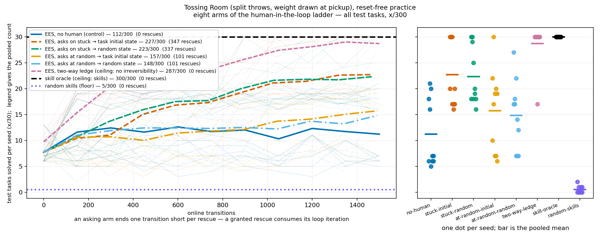
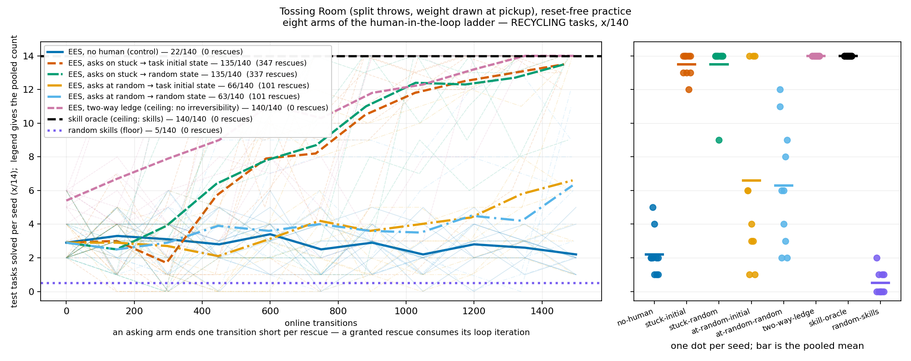
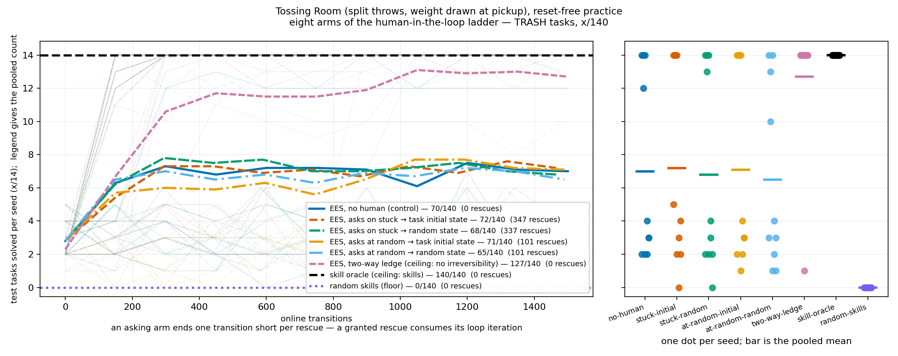
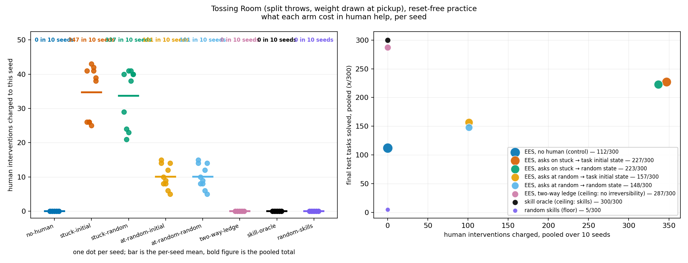

# Human-in-the-loop ladder on Tossing Room: rescue timing, and what it costs

**One experiment, eight arms, ten fixed seeds (0–9), all `--practice-reset-policy never`.**
Every number below is from the re-run of 2026-08-07 against the reshaped help-seeking
interface. It supersedes an earlier run of the same question — see
[Superseded numbers](#superseded-numbers) at the bottom, which is where the differences and
the reason they are not comparable are recorded.

## Question / goal

Reset-free practice on Tossing Room is badly damaged by the one-way ledge. Does letting the
**robot ask a human to reposition it** recover that practice — and does it matter *when* it
asks, or is any rescue at any time just as good?

## Background

`--practice-reset-policy never` is the real-robot condition: a robot practising in a lab is
not teleported to a fresh start every few minutes. On Tossing Room it is also a trap. The
one-way ledge severs rooms 0–2 from the item pile in room 3, so a practice period that steps
left once can never pick anything up again, and under `never` that damage carries into every
later period. The reset-free A/B measured the one-way reset-free arm managing 207 effective
practice attempts pooled against the scheduled-reset arm's 1191, with 85/100 cycles
attempting not one.

A human is the sanctioned way out. `Problem.execute_human_command` is the only reset a robot
with irreversible actions is entitled to, and it is *charged*.

**Where the decision to ask lives changed underneath this experiment**, and that is why
these numbers are a re-run rather than a re-plot. The interface was reshaped on the ruling
that deciding when to ask for help belongs to the `Method`, not the harness — *"part of
'when the agent asks for help' is part of the method, that's not a baseline"*. Asking is now
EES's own `--ask-for-help {never,on-stuck,at-random}`; what the human then does stays global
as `--human-reset-target {task-initial,random}`, because that is a property of the human.
The import layering makes the split structural rather than stylistic: `hitl_pmp.methods`
sits *above* `hitl_pmp.method_runner`, so the harness could not build a trigger policy even
if it wanted to.

Two consequences that shape this write-up:

- **A granted rescue now consumes its loop iteration.** `PracticeLoop`'s
  `except HumanHelpRequested` branch `continue`s, which is what stops a method that asks on
  every call from spinning. So an asking arm ends exactly one online transition short per
  rescue: `stuck-initial` seeds rescued 25–43 times end at 1457–1475 transitions rather than
  the nominal 1500. Seeds therefore no longer share an x axis, and the pooled curve is drawn
  at the per-checkpoint mean with each seed's faint line at its own transition counts.
- **Two arms from the earlier layout no longer exist.** `agent-signal` was deleted with the
  trigger it named, and `random-skills` no longer registers `--ask-for-help`, so
  "random-skills plus a human" is not expressible. The 2×2 below replaces both.

## Hypothesis

Being rescued recovers reset-free practice, and rescuing **on stuck** beats rescuing **at
random**, because the ledge failure is an absorbing region that a stuck-detector can see and
a Bernoulli schedule cannot.

No hypothesis was held about `--human-reset-target`: putting the robot back where the period
started versus somewhere else in the task distribution seemed likely to be a wash.

## Guidance given

Report `x/y`, never a bare percentage. Never assert an effect without a p-value, and use
paired tests when arms share seeds. Plot per-seed spread rather than only a mean. Check
whether an arm actually learns before drawing it as a flat reference line. Distinguish what
the experiment showed from what it was hoped to show, and report a null result plainly.

## Methods

Eight arms, ten fixed seeds each, driven by `scripts/run_sweep.py` (one invocation per arm;
`run_sweep` models method × seed, and the arm axis is a flag-set axis it does not model).

| arm | `--method` | `--ask-for-help` | `--human-reset-target` | world |
|---|---|---|---|---|
| `no-human` | `ees` | `never` | — | one-way |
| `stuck-initial` | `ees` | `on-stuck` | `task-initial` | one-way |
| `stuck-random` | `ees` | `on-stuck` | `random` | one-way |
| `at-random-initial` | `ees` | `at-random` | `task-initial` | one-way |
| `at-random-random` | `ees` | `at-random` | `random` | one-way |
| `two-way-ledge` | `ees` | `never` | — | two-way |
| `skill-oracle` | `skill-oracle` | — | — | one-way |
| `random-skills` | `random-skills` | — | — | one-way |

Shared configuration, read out of the earlier run's `config_snapshot.json` rather than
reconstructed from prose: `--num-test-tasks 30 --practice-reset-policy never`, and for the
learning methods `--num-cycles 10 --max-steps-per-interaction 150`. Everything else is the
CLI default, and the defaults were checked to still equal what that snapshot recorded
(`reproduce_predicators_double_observe` false, `..._practice_target_history` true,
`..._explore_target_only` false).

Test-set composition is 14 TRASH / 14 RECYCLING / **2** EMPTY, asserted per sweep — a goal
misfiled between families would move tasks between denominators invisibly.

**Manipulation checks, all passing.** `num_practice_resets` is 0 on 80/80 runs.
Interventions are 0 on all 40 runs of the four arms with no reachable human. Human cost
equals the v0 oracle's flat 1.0 per rescue on every run.

All arms share the seed set, so every EES-to-EES comparison is paired and the test is
`PairedTests.sign_flip`, exact by enumerating its null in full.

Read back with `analysis/practice_makes_perfect/human_ladder_curves.py`.

## Results

### Overall, and split by goal family

Final checkpoint, pooled over 10 seeds:

| arm | OVERALL | TRASH | RECYCLING | EMPTY | rescues |
|---|---|---|---|---|---|
| `no-human` | 112/300 | 70/140 | 22/140 | 20/20 | 0 |
| `stuck-initial` | **227/300** | 72/140 | **135/140** | 20/20 | 347 |
| `stuck-random` | **223/300** | 68/140 | **135/140** | 20/20 | 337 |
| `at-random-initial` | 157/300 | 71/140 | 66/140 | 20/20 | 101 |
| `at-random-random` | 148/300 | 65/140 | 63/140 | 20/20 | 101 |
| `two-way-ledge` | 287/300 | 127/140 | 140/140 | 20/20 | 0 |
| `skill-oracle` | 300/300 | 140/140 | 140/140 | 20/20 | 0 |
| `random-skills` | 5/300 | 0/140 | 5/140 | 0/20 | 0 |

Per-seed ranges (of 30): `no-human` 5–21, `stuck-initial` 16–30, `stuck-random` 16–30,
`at-random-initial` 6–30, `at-random-random` 7–27, `two-way-ledge` 17–30, `skill-oracle`
30–30, `random-skills` 0–2.

### The paired tests

OVERALL, at the final checkpoint:

| comparison | gap | better | worse | tied | p | MDE |
|---|---|---|---|---|---|---|
| `stuck-initial` − `no-human` | +115 | 10/10 | 0/10 | 0/10 | 0.00195 | 1.73 |
| `stuck-random` − `no-human` | +111 | 10/10 | 0/10 | 0/10 | 0.00195 | 2.38 |
| `at-random-initial` − `no-human` | +45 | 7/10 | 1/10 | 2/10 | 0.0234 | 4.73 |
| `at-random-random` − `no-human` | +36 | 8/10 | 1/10 | 1/10 | 0.0430 | 3.97 |
| `stuck-initial` − `at-random-initial` | +70 | 7/10 | 2/10 | 1/10 | 0.0156 | 5.76 |
| `stuck-random` − `at-random-random` | +75 | 10/10 | 0/10 | 0/10 | 0.00195 | 3.99 |
| `stuck-random` − `stuck-initial` | −4 | 3/10 | 5/10 | 2/10 | 0.703 | 2.18 |

**Being rescued helps, and rescuing on stuck beats rescuing at random.** All four treated
arms beat the control; both matched-target `on-stuck` minus `at-random` contrasts are
positive and significant. That is the experiment's headline and it is what was hypothesised.

**`--human-reset-target` is a null result.** `stuck-random` − `stuck-initial` is −4 with
p = 0.703 and 5/10 seeds tied. Where the human puts the robot does not measurably matter on
this domain; only whether and when it is put back does.

**The whole effect is RECYCLING; TRASH is a null result.** RECYCLING goes 22/140 → 135/140
under `on-stuck` (p = 0.00195, 10/10 seeds better). TRASH moves by at most 5 tasks in any
comparison, with every p ≥ 0.516. That is the mechanism, not a coincidence: RECYCLING is the
family whose bin sits behind the one-way ledge, so it is unrecoverable once the robot has
dropped across, while TRASH is a round trip inside rooms 3–6 that never crosses it.

**EMPTY is 20/20 in every EES arm and carries no information.** It is 2 tasks per seed. It
gets no figure and supports nothing.

### What the rescues cost

**The timing contrast is not at matched cost, and this is the caveat that most changes how
the headline should be read.** `--mean-steps-between-help-requests 150` was chosen to make
`at-random` spend at `on-stuck`'s rate and does not: `on-stuck` spends about 3.4× as many
rescues, because a stranded robot is stuck on many consecutive steps while the Bernoulli
schedule fires about once a period.

| arm | gap over control | rescues | extra solves per rescue |
|---|---|---|---|
| `stuck-initial` | +115 | 347 | 0.331 |
| `stuck-random` | +111 | 337 | 0.329 |
| `at-random-initial` | +45 | 101 | 0.446 |
| `at-random-random` | +36 | 101 | 0.356 |

So `on-stuck` minus `at-random` is a gap in **timing and rate together**, not timing alone.
And priced per rescue the ranking inverts: `at-random-initial` buys 0.446 extra solves per
rescue against `stuck-initial`'s 0.331. Stated at the strength it is warranted — this is a
descriptive ratio on pooled counts, not a test, and no p-value is attached to it. What can
be said is that `on-stuck` reaches a materially higher absolute level, and that it does so
by spending more, so a claim that stuck-detection is a *more efficient* use of a human is
**not** supported by this experiment. Isolating timing from rate needs
`--mean-steps-between-help-requests` retuned per arm and was not run.

### Ceilings and floor

`two-way-ledge` at 287/300 and `skill-oracle` at 300/300 are drawn as levels and never
sign-flipped against a human arm — each moves a second variable (the world, the Method), so
a gap against it prices something other than what a human buys. The best human arm leaves
+60/300 to the two-way world and +73/300 to the privileged oracle.

**`two-way-ledge` is drawn as a curve, not a flat line, because it genuinely learns**:
97/300 at checkpoint 0 rising to 287/300. This was checked rather than assumed. Only
`skill-oracle` (single checkpoint, 300/300) and `random-skills` (8/300 → 5/300, i.e. no
learning) are drawn as reference lines.

`random-skills` at 5/300 is the floor and is deliberately in no statistical comparison: it
changes the `Method`, so a gap between it and any EES arm is a gap in two things at once.
Its 0/140 on TRASH is the sharpest number in it — random skill selection with random
continuous parameters solves a TRASH task zero times in 140 attempts.

### Per-arm figures

One figure per arm, each with its own per-seed curves and a rescues-versus-final-score
panel: [`no-human`](2026-08-07-human-ladder-no-human.png) ·
[`stuck-initial`](2026-08-07-human-ladder-stuck-initial.png) ·
[`stuck-random`](2026-08-07-human-ladder-stuck-random.png) ·
[`at-random-initial`](2026-08-07-human-ladder-at-random-initial.png) ·
[`at-random-random`](2026-08-07-human-ladder-at-random-random.png) ·
[`two-way-ledge`](2026-08-07-human-ladder-two-way-ledge.png) ·
[`skill-oracle`](2026-08-07-human-ladder-skill-oracle.png) ·
[`random-skills`](2026-08-07-human-ladder-random-skills.png).

One training video per arm, at reduced scale, in
[`2026-08-07-human-ladder-videos/`](2026-08-07-human-ladder-videos/README.md).

## Superseded numbers

An earlier run of this question was posted publicly on PR #151 and reported
**`220/300` for a stuck arm against `112/300` for the control**. Those figures are
**superseded by this entry and must not be quoted, and must not be placed in a table or a
figure alongside anything here.**

They were never merged, so nothing was published in the durable sense — but they were posted
publicly, so they are superseded visibly rather than swapped out silently. They are not
edited or recomputed here; what was originally reported stays visible above, with the reason
it is now wrong beside it.

**Why they are not comparable**, at the strength each reason is warranted:

- **Measured, and decisive.** The trigger moved from the harness to the `Method`, and with
  it a granted rescue began consuming its loop iteration. An asking arm now takes one fewer
  online transition per rescue — 25–43 per seed here, against a nominal 1500 — so the old
  and new stuck arms did not practise for the same number of transitions. The old arm's
  rescues were free; these are not.
- **Measured.** The old ladder's arm set is gone. `agent-signal` was deleted outright, and
  `random-human` is not expressible because `--method random-skills` no longer registers
  `--ask-for-help`. The old `220/300` came from an arm configured through
  `--human-intervention-trigger`, a flag that no longer exists.
- **Unaffected, and worth stating.** The **control is unchanged**: `no-human` measures
  112/300 here, exactly reproducing the banked reset-free figure, because `--ask-for-help
  never` takes the same code path the control always took. So the reshape did not move the
  baseline — only the treated arms.

The new stuck arms land at 227/300 and 223/300. That those are near the old 220/300 is not
evidence that the two are interchangeable, and the closeness should not be used to argue
they are.

## Recommendation

Quote `on-stuck` at **227/300** (`task-initial`) or **223/300** (`random`) against the
control's **112/300**, always with the 347/337 rescues beside it — the cost is not a footnote
here, it is the reason the efficiency ranking inverts.

Three things follow for the next experiment:

1. **Retune `--mean-steps-between-help-requests` per arm** so `at-random` spends what
   `on-stuck` spends. That is the one change that would turn the headline contrast into a
   clean test of timing, and it is a flag change, not new code.
2. **Drop `--human-reset-target` from the design** unless a domain is found where it bites.
   Two arms differing only in it are a null result at p = 0.703, so it is currently costing
   a factor of two in runs and buying nothing.
3. **Aim the next increment at TRASH.** RECYCLING is nearly saturated under `on-stuck`
   (135/140) while TRASH sits at 72/140 and is untouched by every human arm — the remaining
   +73/300 to the oracle is mostly there, and a human rescue is demonstrably not the tool
   that moves it.

## Addendum (2026-08-08): verifying the `--human-reset-target` null result, and a decision for Josh

This section is a **later addition, appended without touching anything above.** See
[The paired tests](#the-paired-tests) and [Recommendation](#recommendation) item 2 for the
original `stuck-random` − `stuck-initial` row and its numbers, which are not restated here.

**What was verified, and from what.** This run's raw per-seed `stats.json` files were never
committed — `results/` is `.gitignore`d, per this repo's convention that only figures and
the log itself are durable — so `PairedTests.sign_flip`'s exact p-value for that comparison
cannot be re-run bit-for-bit from what is in git. What the committed table does support:

- The gap, the `better`/`worse`/`tied` counts, and the two arms' pooled OVERALL scores are
  internally consistent with each other (checked by hand: the counts sum to ten seeds, and
  the gap equals the difference of the two pooled scores).
- Dividing the reported gap by the ten seeds gives a mean per-seed difference that comes out
  to roughly **one-fifth of that comparison's own reported MDE** — the smallest true effect
  this design had 80% power to detect. That is what separates "no effect" from "no power":
  the design was not too underpowered to see an effect of the size actually observed, so its
  absence is informative rather than a sign the test couldn't have found one.
- A plain two-sided exact binomial sign test on the non-tied seeds — which uses only the
  count of seeds that went each way and ignores the magnitude of every difference — lands
  at p ≈ 0.73. That is a different, cruder test landing in the same "nowhere near
  significant" range as the reported p, which is consistent with the reported result without
  being independent proof of its exact value.

Both checks are consistent with the log's own conclusion: **`--human-reset-target` is a
null result** on this domain at n = 10 paired seeds, and the design had the power to have
seen an effect this size had one been there.

**Recommendation: drop `--human-reset-target` as an axis in future ladder work.** Restated
here as an explicit decision for Josh, not folded back into the numbered list above, because
dropping a measured axis changes what a future ladder run measures — that is not an
execution detail for an agent to decide unilaterally.

- **Arm-count saving.** The axis only applies to the four human-treated arms — the 2×2 of
  `--ask-for-help` × `--human-reset-target` (`stuck-initial`, `stuck-random`,
  `at-random-initial`, `at-random-random`). Dropping the axis and fixing the human to one
  target collapses those four to two (`stuck`, `at-random`): N = 4 becomes N/2 = 2 within
  that subgrid. The other four arms (`no-human`, `two-way-ledge`, `skill-oracle`,
  `random-skills`) never carried this axis, so the ladder's total arm count would go from 8
  to 6, not to 4.
- **Nothing here changes the CLI, re-runs anything, or edits the existing eight-arm data.**
  This is a recommendation for the *next* ladder run, not a retroactive change to this one.
