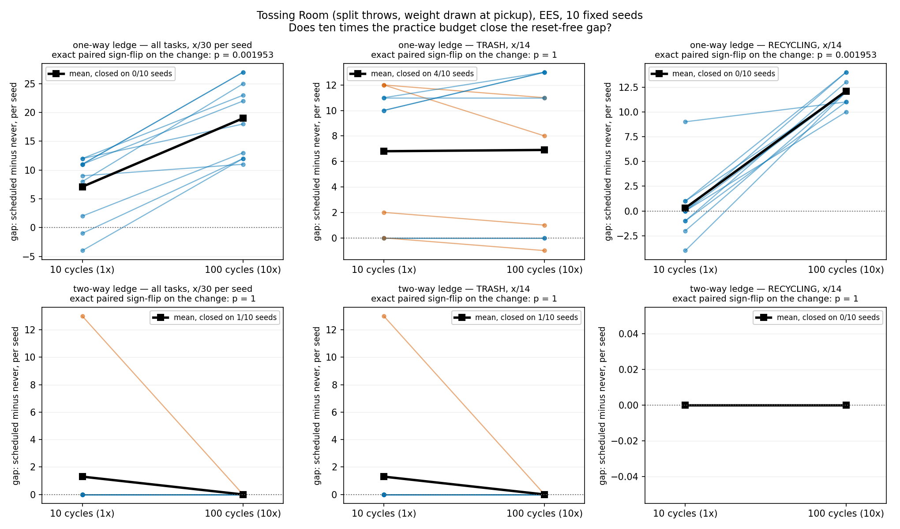
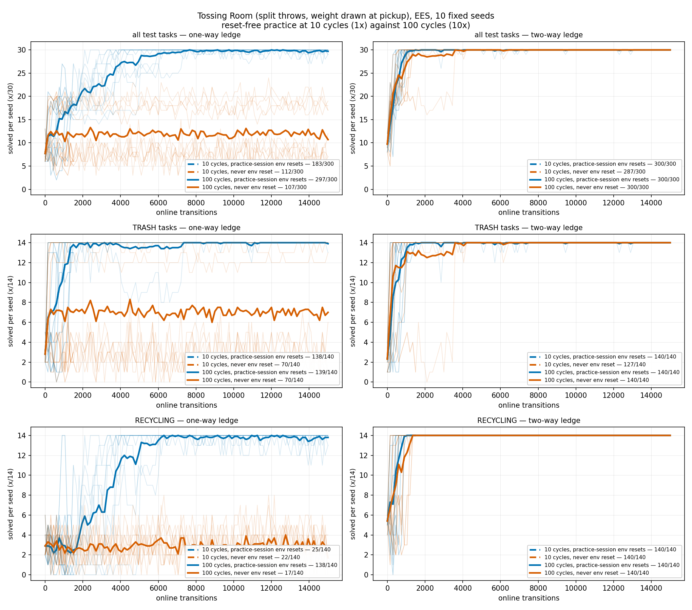

# Ten times the practice budget: is the reset-free arm starved, or stranded?

Domain `tossingroom` (split throws, weight drawn at pickup), method `ees`, 10 fixed seeds
(0-9), 30 test tasks (14 TRASH / 14 RECYCLING / 2 EMPTY). A cube of **cycle budget**
(`1x` = 10 cycles, `10x` = 100) x **ledge** (one-way / two-way) x **reset policy**
(`scheduled` / `never`), 80 runs in total: the 40 at `1x` are the merged sweeps, read back
from their committed artifacts rather than re-run; the 40 at `10x` are new and are
committed under `2026-08-07-pickup-weight-cycle-budget-10x-runs/<cell>/<seed>/`.

**Headline: the starvation hypothesis is falsified, and the mechanism is sharper than
"starved".** Ten times the budget did not close the one-way reset-free gap; it **widened**
it, from `71` to `190` tasks pooled (`scheduled - never`, exact paired sign-flip
p = 0.001953, widened on 10/10 seeds). The reason is visible in one number: the one-way
reset-free arm logs **207 effective practice attempts at 10x — the identical 207 it logged
at 1x**. The extra ninety cycles bought it exactly zero additional practice.

## Question / goal

The merged 1x A/B attributes the reset-free arm's deficit to *starvation* rather than to an
inability to learn. That is a testable claim with an obvious test: if the arm simply does
not get enough practice attempts, giving it ten times the cycles should buy back most of
the gap. If the gap survives at 10x, starvation is not a sufficient explanation.

## Background

`--practice-reset-policy scheduled` puts the environment back to a freshly-sampled train
task at the top of each practice period. `never` does not, so practice state runs
continuously across period boundaries — the real-robot condition, since a robot practising
in a lab is not teleported to a fresh start every few minutes.

Under the one-way ledge the merged 1x A/B measured `scheduled` **183/300** against `never`
**112/300**. Per family, 68 of the 71 tasks in that gap were TRASH; RECYCLING sat near the
floor in both arms (`25/140` against `22/140`, p = 0.9219 — a null result). The mechanism
proposed there was supply, not capability: the reset-free arm logged **207** effective
practice attempts against **1191**, with **85/100** cycles attempting not one. "Effective"
means a skill that needs the robot at the item pile (`Pickup*`, `Throw*`); a stranded robot
can still walk and press buttons for a whole period, so counting those would report a
starved arm as busy.

There is direct precedent for a budget increase rescuing an arm on this project: on an
earlier Tossing Room variant `ThrowRecycling` went from `11/56` to `901/982` at 10x, which
is what established starved-not-unable there.

**The one-way ledge is what makes stranding possible.** It blocks the *directed* edge from
room 2 to room 3, the only edge from rooms {0, 1, 2} into {3...6}, and the item pile — the
sole source of items — is in room 3. Rooms 0-2 are absorbing at any horizon, and no
recovery machinery exists. `--two-way-ledge` makes that edge traversable rightward too,
removing the domain's only irreversible action, which is why it is carried here as the
control condition.

## Hypothesis

**The reset-free arm is starved, not unable to learn, so the gap will largely close at
10x.** Concretely: the one-way `scheduled - never` gap shrinks substantially from its
1x value of 71 tasks, and the reset-free arm's effective-attempt count rises roughly in
proportion to the budget.

## Guidance given

- 10x the cycles on the same 2x2 the 1x result used, 10 fixed seeds per cell, 40 runs;
  change **only** the cycle count, reading the exact 1x conditions out of the committed
  `config_snapshot.json` files rather than reconstructing them from prose.
- Plot 1x against 10x directly, in one figure, with per-seed spread rather than only means.
- Keep the per-family TRASH / RECYCLING split, since the 1x gap was almost entirely TRASH
  and RECYCLING was a null result — whether RECYCLING moves at 10x is a separate question
  from whether the overall gap closes.
- Paired tests throughout (the arms share seeds); counts as `x/y` everywhere.

## Methods

**The only thing that differs between a `1x` cell and its `10x` twin is `--num-cycles`.**
The commands were built by reading the *resolved* argparse namespace out of the committed
`config_snapshot.json` files. The resulting 10x snapshots differ from the 1x ones in
exactly four keys: `num_cycles` (the manipulation), `env` (the domain was renamed
`tossingroomsplitpickupweight` -> `tossingroom` by #142, a rename #146 established is
byte-neutral), and `two_way_ledge` / `unsplit_skills` — two flags that did not exist when
the 1x runs were made, and whose defaults (`False`, `False`) are exactly the behaviour
those runs had.

Runs were driven by `scripts/run_sweep.py`, four sweeps of ten fixed seeds, inside a
memory-capped systemd unit.

### Checks, before any inference

**The 1x baseline is unchanged by the artifact regeneration.** #146 regenerated and #155
re-laid the pickup-weight artifacts this log reads its 1x column from. Re-deriving all four
1x cells after that rebase returns the published numbers to the digit — `183/300`,
`112/300`, `300/300`, `287/300`, effective attempts `1191` against `207`, starved cycles
`85/100`. Nothing in the 1x column moved.

**The 1x run is a strict prefix of its 10x twin, on 40/40 runs.** Same seed and same flags
but `--num-cycles`, so the first 1500 transitions should be the identical trajectory. They
are: the 10x arm's first 11 checkpoints reproduce the 1x arm's 11 checkpoints exactly, for
both the solved counts and the cumulative effective-attempt curve, in **10/10** seeds of
each of the four cells. This is the check that licenses putting the two budgets on one
axis at all.

**27/27 byte-identical on an accidental re-run.** Three cells lost their seed-9 run to an
external process kill and were re-run in full (there is no per-seed selection in
`run_sweep`). The 27 runs that completed twice produced byte-identical `stats.json` both
times, which is the reproducibility guarantee `--seed` is supposed to give.

**The rebase is a replay, not a re-run — checked by re-execution, not argued.** The 40 runs
were made at `2d69cf2`; the branch was then rebased forward. That delta touches `src/`,
including `ees_method.py` and `metrics.py`, which is exactly the case CLAUDE.md says makes a
rebase a *re-run* rather than a replay — so it was tested instead of reasoned about. The
changes add practice-*target* tallies: a new `stats.json` field plus counter calls placed
beside decisions the surrounding code had already made, with no branch, RNG draw or planner
call depending on them. Two seeds were therefore re-executed on the rebased code, one from
the cheap reset-free cell and one from the `scheduled` cell (which exercises far more of
`choose_practice_target`, where the counters were added). In both, **3/3** of the fields
this analysis reads — `breakdowns`, `num_practice_resets`, `practice_outcomes_per_cycle` —
are identical, and the only difference is the added
`practice_target_outcomes_per_cycle` key. The committed artifacts predate that key; no
number here depends on it. Later rebases moved only `analysis/` docstrings, a
`kinder_backend.py` docstring and `scripts/update_reference_repos.sh`, none of which any
Tossing Room run invokes.

**Manipulation.** `num_practice_resets` is measured out of each run's own `stats.json`
rather than restated from the flag, and is checked against the cell's budget: 100 in 20/20
10x `scheduled` runs, 0 in 20/20 10x `never` runs.

**Composition.** Every evaluation sweep of every run realises the domain's 14 TRASH /
14 RECYCLING / 2 EMPTY split; a goal misfiled between families would move tasks between
denominators invisibly, so it raises rather than being tolerated.

## Results

### The practice budget actually spent

| cell | effective attempts pooled | cycles attempting none |
| --- | --- | --- |
| 1x one-way `scheduled` | 1191 | 23/100 |
| 1x one-way `never` | 207 | 85/100 |
| 10x one-way `scheduled` | 4361 | 211/1000 |
| 10x one-way `never` | **207** | **985/1000** |
| 1x two-way `scheduled` | 4021 | 0/100 |
| 1x two-way `never` | 3982 | 0/100 |
| 10x two-way `scheduled` | 39212 | 0/1000 |
| 10x two-way `never` | 38992 | 0/1000 |

**This is the whole result.** Under the one-way ledge, the reset-free arm's effective
attempts are `207` at both budgets — not "fewer than the control", but *the same absolute
number*, because it takes its last effective attempt in cycle 1, 2 or 3 and then never
again. Per seed, the last effective practice attempt lands in cycle 1 for 6/10 seeds
(2 attempts each), cycle 2 for 3/10 (40 each) and cycle 3 for 1/10 (75). The remaining
97-or-so cycles of every seed are spent entirely walking. Under the two-way ledge, where
stranding is impossible, both arms scale with the budget as expected (roughly 10x the
attempts for 10x the cycles) and neither starves a single cycle.

### Final-checkpoint scores and the within-ledge gap

| ledge | budget | `scheduled` | `never` | gap | never worse on | exact paired sign-flip |
| --- | --- | --- | --- | --- | --- | --- |
| one-way | 1x | 183/300 | 112/300 | 71 | 8/10 seeds | p = 0.01172 |
| one-way | 10x | 297/300 | 107/300 | **190** | 10/10 seeds | p = 0.001953 |
| two-way | 1x | 300/300 | 287/300 | 13 | 1/10 seeds | p = 1 |
| two-way | 10x | 300/300 | 300/300 | 0 | 0/10 seeds | p = 1 |

The change in the one-way gap is `-119` pooled — it **widened** — and it widened on
**10/10** seeds (exact paired sign-flip p = 0.001953). The two-way gap moved from 13 to 0,
but that is **1/10** seeds moving with **9/10** tied, p = 1: a **null result** on the
change, and the minimum per-seed change this design had 80% power to detect is 3.64 tasks.
The two-way 10x cells are nonetheless a clean 300/300 in both arms.

### Per family, under the one-way ledge

| family | budget | `scheduled` | `never` | gap | exact paired sign-flip on the gap |
| --- | --- | --- | --- | --- | --- |
| TRASH | 1x | 138/140 | 70/140 | 68 | p = 0.01562 |
| TRASH | 10x | 139/140 | 70/140 | 69 | p = 0.02344 |
| RECYCLING | 1x | 25/140 | 22/140 | 3 | p = 0.9219 |
| RECYCLING | 10x | 138/140 | 17/140 | **121** | p = 0.001953 |
| EMPTY | 1x | 20/20 | 20/20 | 0 | p = 1 |
| EMPTY | 10x | 20/20 | 20/20 | 0 | p = 1 |

**TRASH is where the 1x gap lived, and it does not move at all**: 68 -> 69, a **null
result** on the change (p = 1, closed on 4/10 seeds, MDE 1.89 tasks per seed). Both arms
are already at their ceiling by 1x — `scheduled` at 138/140, `never` stuck at exactly
70/140 at both budgets.

**RECYCLING is where the extra budget went, and only for the arm that could use it.**
`scheduled` goes `25/140` -> `138/140`: the 1x RECYCLING null result was a *power* problem
after all, and the precedent shape (`11/56` -> `901/982`) reproduces — but for the
scheduled-reset arm. The reset-free arm goes `22/140` -> `17/140`, i.e. nowhere. So the
family that carried the 1x gap (TRASH) and the family that carries the 10x gap (RECYCLING)
are different families, which a pooled number alone would hide.

EMPTY is 20/20 in all four one-way cells at both budgets. It is 2 tasks per seed and its
denominator supports almost no inference; it is reported for completeness, not as a result.

### Figures



Per seed, the `scheduled - never` gap at 1x joined to the same seed's gap at 10x — one line
per seed, so a closing gap would be ten lines sloping toward zero. The one-way panels slope
the wrong way on 10/10 seeds. The two-way bottom row shows why per-seed plotting matters:
its entire mean movement is one seed going 13 -> 0 with nine tied at zero.



All four (budget x policy) curves per panel on a shared online-transitions axis, bold
pooled mean over faint per-seed lines. **The 1x curves lie exactly underneath the 10x ones
over their first tenth** — that is the strict-prefix property above, not a plotting
artifact, and it is why only two lines per panel are visually distinguishable. The one-way
RECYCLING panel is the one to read: `scheduled` climbs from ~3 to 14 between 2000 and 6000
transitions while `never` stays flat for all 15000.

## Recommendation

**Stop describing the reset-free failure as starvation, and describe it as stranding.** The
two make opposite predictions about budget, and this experiment separates them cleanly: a
starved arm gets more practice when given more cycles, and this arm gets *precisely none*.
"More practice attempts would fix it" is now falsified for this domain; "it cannot obtain
practice attempts at all after cycle ~2" is what the data support.

Three concrete follow-ups, in the order I would run them:

1. **The reset-free arm needs a recovery mechanism, not a bigger budget.** This is the
   `humans/` gap: `Metrics.num_human_interventions()` reports nothing because intervention
   is not *representable* yet, and all three `Method.reset_environment` implementations
   return `False` without writing. A `HumanOracle` that can rescue a stranded robot at a
   cost is the experiment this result argues for, and the cost accounting is the point —
   the interesting number is how much human intervention buys back how much of the 190.
2. **Do not spend more compute on one-way reset-free cycle budgets.** The effective-attempt
   trace shows the marginal return is exactly zero after cycle 3, so any budget between 10x
   and infinity gives the same answer.
3. **The 10x scheduled result is independently worth banking**: RECYCLING `25/140` ->
   `138/140` means the merged 1x number understates what EES reaches on this domain, and
   any future baseline compared against the 1x RECYCLING figure is being compared against a
   budget-limited one.

## Reproducing this

Every `stats.json`, `config_snapshot.json` and `timing.json` for the 40 new runs is
committed under `2026-08-07-pickup-weight-cycle-budget-10x-runs/<cell>/<seed>/`, so every
figure and number above regenerates without re-running anything.

```bash
# The four 10x cells (seeds 0-9 are fixed, never drawn). --max-workers 3 because the box
# was carrying other agents' sweeps; concurrency does not affect results.
WORLD="--num-test-tasks 30 --num-rooms 7 --start-room 3 --recycling-bin-room 1 \
  --trash-bin-room 6 --blocked-right-from 2"
for cell in "oneway-scheduled|--practice-reset-policy scheduled" \
            "oneway-never|--practice-reset-policy never" \
            "twoway-scheduled|--practice-reset-policy scheduled --two-way-ledge" \
            "twoway-never|--practice-reset-policy never --two-way-ledge"; do
  python -m scripts.run_sweep --env tossingroom --methods ees --num-seeds 10 \
    --max-workers 3 --results-root "results/rf10x/${cell%%|*}" \
    --shared-args "$WORLD ${cell#*|}" \
    --method-args "ees=--num-cycles 100 --max-steps-per-interaction 150"
done

# Read the cube back. The 1x cells are the committed merged sweeps.
D=docs/experiment-logs
python -m analysis.practice_makes_perfect.reset_free_cycle_budget \
  --cell "1x:one-way:scheduled=$D/2026-08-07-pickup-weight-reset-free-runs/scheduled/ees" \
  --cell "1x:one-way:never=$D/2026-08-07-pickup-weight-reset-free-runs/never/ees" \
  --cell "1x:two-way:scheduled=$D/2026-08-07-pickup-weight-two-way-ledge-runs/scheduled/ees" \
  --cell "1x:two-way:never=$D/2026-08-07-pickup-weight-two-way-ledge-runs/never/ees" \
  --cell "10x:one-way:scheduled=$D/2026-08-07-pickup-weight-cycle-budget-10x-runs/oneway-scheduled" \
  --cell "10x:one-way:never=$D/2026-08-07-pickup-weight-cycle-budget-10x-runs/oneway-never" \
  --cell "10x:two-way:scheduled=$D/2026-08-07-pickup-weight-cycle-budget-10x-runs/twoway-scheduled" \
  --cell "10x:two-way:never=$D/2026-08-07-pickup-weight-cycle-budget-10x-runs/twoway-never" \
  --gap-output "$D/2026-08-07-pickup-weight-cycle-budget-gap.png" \
  --curves-output "$D/2026-08-07-pickup-weight-cycle-budget-curves.png"
```

### Cost

40 runs, 12 concurrent, **69 minutes** of wall clock against a pre-run estimate of 72-90
minutes at 8-10 workers. A further 75 minutes went to re-running three cells in full after
an external process kill took out their seed-9 run mid-flight; that recovery changed no
number (27/27 byte-identical) and is not part of the experiment's cost. Per-run mean was
279 s for one-way `never` — the stranded, and therefore cheap, cell — against 955 s for
one-way `scheduled`. The pre-run estimate assumed a uniform 12.97x scaling from the 1x
grid; the real scaling is strongly cell-dependent, because a stranded run does almost no
work no matter how many cycles it is given, which is itself the result.
