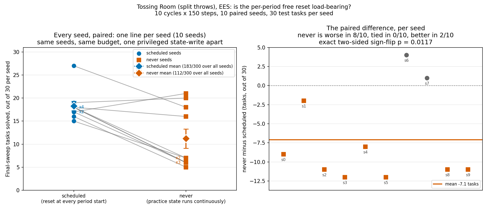
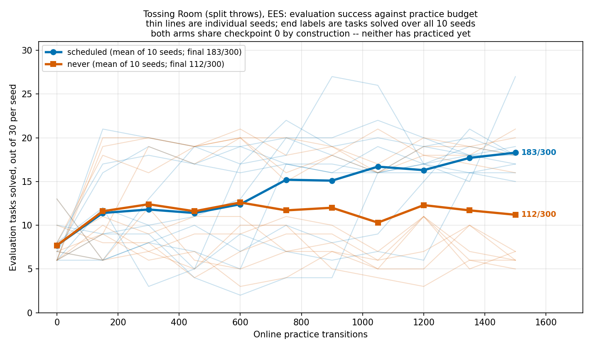
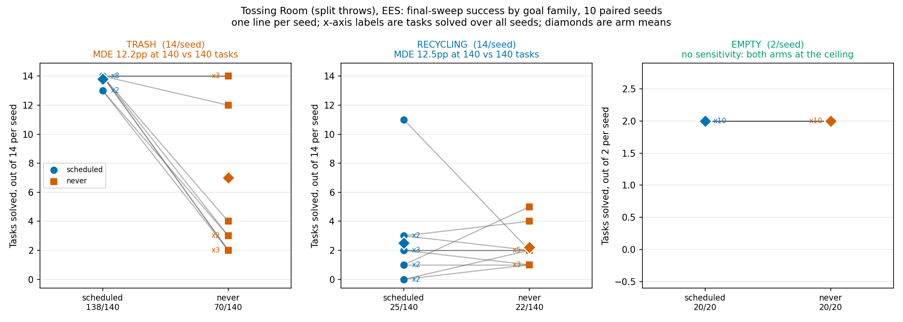
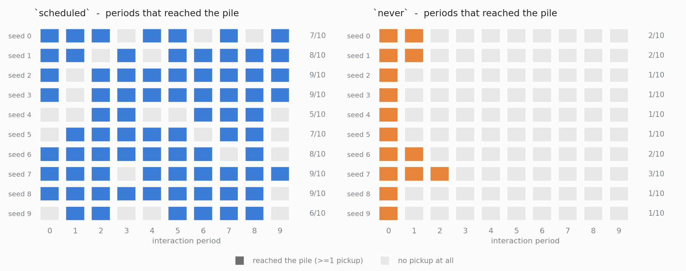

# Reset-free practice when the training distribution varies at pickup: `scheduled` vs `never`

> **Environment renamed (2026-08-07).** The domain these runs were made on was
> called `tossingroomsplitpickupweight` at the time, and every command below names
> it that way. It is now registered as **`tossingroom`**, having taken over the name
> of a retired fork; the three superseded forks were deleted in the same stack. The
> domain itself is unchanged, so **every number below still reproduces** -- but the
> commands need `--env tossingroom` to run against current code. Nothing here has
> been edited, restated or recomputed.

Domain `tossingroomsplitpickupweight`, method `ees`, 10 fixed seeds (0-9), 30 test tasks
(14 TRASH / 14 RECYCLING / 2 EMPTY), 10 cycles x 150 steps per interaction period. The
two arms are invoked with different `--practice-reset-policy` values and no other flag
difference.

**This is the same protocol as
[the 2026-08-06 reset-free A/B](./2026-08-06-reset-free-practice-ab.md), on a different
domain, and the numbers are not comparable across the two.** That experiment ran on
`tossingroomsplit`; this one runs on the new `tossingroomsplitpickupweight`, whose task
distribution genuinely differs. Nothing here may be pooled with those 80 banked runs.

## Pre-registration

**Written and committed before either sweep was run.** The commit that adds this section
contains no results; the numbers arrive in a later commit on the same branch.

### Background: what this follows from

The 2026-08-06 A/B measured `scheduled` **151/300** against `never` **85/300** on
`tossingroomsplit` (paired, p = 0.0078, `never` worse in 8/10 seeds and better in 0/10).
Its own published correction is that the comparison confounds **two** mechanisms, and
that no single-flag experiment on that domain can separate them:

1. **Stranding.** The one-way ledge blocks the *directed* edge 2 -> 3, the only edge from
   rooms {0, 1, 2} into {3...6}, and the pile -- the sole source of items -- is in room 3.
   Rooms 0-2 are absorbing at any horizon. A follow-up read out of run output found
   **9/10 `never` seeds strand permanently**, with onsets at period 1 for 6/10 seeds
   (2, 3, 4, 5, 8, 9), period 3 for 2/10 (6, 7), period 4 for 1/10 (seed 0), and never for
   seed 1. **0/9** stranded seeds recover: across 74 pooled post-onset periods the only
   skills executed in **74/74** are `MoveRoom` and `PressRecycling` -- zero pickups, zero
   throws, zero `PressTrash`. The apparent recovery visible under `scheduled` is
   `reset_to_task` rescuing the robot, not self-recovery. No recovery machinery exists:
   all three `Method.reset_environment` implementations return `False` without writing,
   and `TossingRoomSplitProblem` never sets `human`.
2. **A collapsed training distribution.** A `Task`'s continuous parameters live in its
   `initial_state`, and `reset_to_task` is the only thing that installs one. Under `never`
   it is never called, so every state feature no action writes stays frozen at its
   `hard_reset` value for the whole run -- and on that domain those features are the bin's
   `throw_distance` and the item's `weight`, which *are* the learned throw sampler's input
   row. Measured: 194 greedy throws at **1** distinct required-force target under `never`,
   against 86 distinct targets over 440 throws under `scheduled`.

   Those practice-side figures were **provisional when this experiment was designed and are
   not any more.** The collector they come from,
   `scripts/tossingroomsplit_skill_traces.py`, was modified by #103 and #111, and it runs as
   a bare script rather than through `scripts/run_sweep.py`, so it never received the
   `OMP_NUM_THREADS=1` pin that #112 exists to make unnecessary. It has since been re-run on
   the corrected base for both arms and all 10 seeds: pooled practice attempts 14900/14900
   in each arm, 440 against 194 greedy throws, and 86 against **1** distinct greedy target,
   with every per-skill count reproducing. So the premise this experiment is built on is
   measured, not inherited.

The PR below this one in the stack removes mechanism 2 by construction. In
`tossingroomsplitpickupweight` the item weight is drawn **at pickup**, off a per-task
pre-sampled array, so it is written by an action the robot takes rather than by a reset;
and the bin distance is fixed, so it cannot be frozen at an unrepresentative value
because it never varies for anyone. A reset-free arm there therefore practises across the
weight distribution as long as it keeps picking things up.

### What is being manipulated

Exactly what the 2026-08-06 A/B manipulated: `scheduled` (the default) puts the
environment back to the freshly-sampled train task's initial state at the top of every
interaction period; `never` does not, so practice state runs continuously across period
boundaries and across the train task changing underneath it. A train task is still drawn
per period and still handed to `get_practice_policy`.

What is *different* is the domain underneath, and therefore what "no reset" costs. It no
longer costs the variation in the sampler's input row. It still costs the rescue.

### Prediction

**Direction: `never` still loses, and by a lot.** The mechanism removed is not the one
doing the damage. A stranded robot cannot reach the pile, so it takes no pickups; taking
no pickups is exactly the condition under which drawing weights at pickup changes nothing.
Weight-at-pickup can only vary the training distribution of an agent that is still
practising.

**This is the point of the experiment rather than a defect in it.** Josh's framing:
*"this is sort of intentional -- the point is that practice makes perfect gets stuck when
it gets stuck -- that's the whole point -- showing that it doesn't work in the reset free
setting."* A negative result here is the result.

**Magnitude: large, comparable to the 2026-08-06 gap.** I expect the `scheduled - never`
difference to be within roughly 10pp of that experiment's 22.0pp, and I will treat
anything under 10pp as no meaningful difference regardless of what a test says.

**Sharpened, falsifiable secondary prediction.** Under weight-at-pickup, a run's weight
draws are exactly its pickups. If stranding reproduces at the onsets measured on
`tossingroomsplit`, then **6/10 `never` seeds should draw exactly 1 weight for the whole
run** -- each of them the `PickupRecycling` that strands the robot -- with seed 1
unstranded and seeds 0, 6 and 7 stranding later. That is an n=1 unidentifiability
problem, not a sparse or a biased sample: trash and recycling weights are drawn from one
law (`Uniform[0.5, 1.5)`) and one stream, so no weight region is systematically excluded;
what stranding biases is the **item type** (pooled `never` pickups on `tossingroomsplit`:
298/307 trash against 9/307 recycling) and what it destroys is the **sample size**.

**What would falsify the framing.** If `never` closes to within 10pp of `scheduled` here,
then mechanism 2 -- not stranding -- was carrying the 2026-08-06 result, and that log's
causal reading needs revisiting. If the two arms' pickup counts come out comparable, then
stranding did not reproduce on this domain and neither prediction above is being tested.

**Per-family prediction.** As before: damage on RECYCLING first (its bin sits behind the
ledge), TRASH second, EMPTY least (a walk-and-press with no throw). EMPTY's denominator is
2/seed = 20/arm and cannot carry an inference on its own.

### Analysis plan, fixed in advance

- **Primary test: paired.** The arms share the seed set, so the 10 seeds are 10 paired
  observations. A paired t-test on the per-seed final-sweep success count, plus a Wilcoxon
  signed-rank test as the distribution-free companion. An unpaired test discards the
  pairing and understates significance.
- **Reported as counts.** `x/y` everywhere, per arm and per family, never a bare
  percentage.
- **MDE, derived per comparison from its own two denominators**, using this repo's
  constant `2.801585` (two-sided alpha = 0.05, 80% power):

  ```text
  MDE = 2.801585 * sqrt( p1(1 - p1)/n1 + p2(1 - p2)/n2 )
  ```

  evaluated at the observed arm rates. Each family gets its own MDE from its own
  `n1`/`n2`; the overall comparison gets its own.
- **A null result will be written as "null result", in full, and reported as such.**
- **Checks run before any inference**, all read out of each run's own `stats.json` rather
  than inferred from the flag: `num_practice_resets` (10 per `scheduled` run, 0 per
  `never` run), matched online transitions across arms, and the realised 14/14/2 test
  composition per seed.

## Results

**Both pre-registered predictions held, including the sharpened one, to the count.**
`scheduled` **183/300**, `never` **112/300** at the final sweep. Reset-free practice
still fails when the training distribution varies at pickup, and it fails by stranding:
**10/10** `never` seeds stopped reaching the pile, **6/10** of them after exactly one
pickup, and across **85** pooled post-stranding periods the only skills that executed
were `MoveRoom` and `PressRecycling`.

### Figures









The same measurement on `tossingroomsplit`, from the 2026-08-06 runs, for comparison --
this is the figure the mechanism in this log's Background was established from:


### Reproducing this

Every `stats.json`, `config_snapshot.json` and `timing.json` for all 20 runs is committed
under `2026-08-07-pickup-weight-reset-free-runs/<arm>/<seed>/`, so both aggregates, every
figure and every number below regenerate without re-running anything.

```bash
# The two arms (seeds 0-9 are fixed, never drawn). --max-workers 5 because the box was
# already carrying another agent's sweep; concurrency does not affect results.
python -m scripts.run_sweep --env tossingroomsplitpickupweight --methods ees \
  --num-seeds 10 --max-workers 5 --results-root results/pw-ab/scheduled \
  --shared-args "--num-test-tasks 30 --practice-reset-policy scheduled" \
  --method-args "ees=--num-cycles 10 --max-steps-per-interaction 150"
python -m scripts.run_sweep --env tossingroomsplitpickupweight --methods ees \
  --num-seeds 10 --max-workers 5 --results-root results/pw-ab/never \
  --shared-args "--num-test-tasks 30 --practice-reset-policy never" \
  --method-args "ees=--num-cycles 10 --max-steps-per-interaction 150"

# Outcome side: condense, then render.
python -m analysis.practice_makes_perfect.tossingroomsplit_reset_policy \
  --arm scheduled=results/pw-ab/scheduled --arm never=results/pw-ab/never \
  --aggregate-output docs/experiment-logs/2026-08-07-pickup-weight-reset-free-ab.json
python -m analysis.practice_makes_perfect.tossingroomsplit_reset_policy \
  --arms-json docs/experiment-logs/2026-08-07-pickup-weight-reset-free-ab.json \
  --output docs/experiment-logs/2026-08-07-pickup-weight-per-seed.png \
  --curves-output docs/experiment-logs/2026-08-07-pickup-weight-curves.png \
  --families-output docs/experiment-logs/2026-08-07-pickup-weight-families.png

# Stranding side: straight off the same stats.json, no second set of runs.
python -m analysis.practice_makes_perfect.pickup_weight_stranding \
  --arm scheduled=results/pw-ab/scheduled --arm never=results/pw-ab/never \
  --aggregate-output docs/experiment-logs/2026-08-07-pickup-weight-stranding.json \
  --output docs/experiment-logs/2026-08-07-pickup-weight-stranding.png
```

The outcome analysis is `tossingroomsplit_reset_policy` **reused unchanged**. It asks
`TossingRoomSplitTasks.test_goal_type_counts` for the designed test composition, which is
this domain's rule too: both return `{trash: 14, recycling: 14, empty: 2}` at 30 test
tasks, verified rather than assumed. The stranding analysis is new, and reads only
`practice_outcomes_per_cycle` -- the field #111 added -- so it needed no bespoke collector
and no extra runs, which the 2026-08-06 equivalent did.

### Checks, before any inference

**Rebase check: re-executed, not argued.** These sweeps ran at `291da9a`. The branch was
then rebased onto `9581c61`, which inherits **PR #112's torch intra-op thread pin** — and
that pin lives in `methods/practice_makes_perfect/wrapped_sampler.py`, the sampler this
experiment measures. That is exactly the case CLAUDE.md says makes a rebase a *re-run*
rather than a replay, so all 20 runs were re-executed on the rebased code and their
`stats.json` byte-compared against the committed ones: **20/20 byte-identical, 0/20
differing.**

A second rebase followed, `9581c61` → `344b979`. That one **is** a replay, and it was
checked rather than assumed the same way: the whole base delta is a single markdown file
(`git diff --name-only` returns one `.md` and nothing else), so no run-path code moved.
`main` also advanced to `56101f4` via #120, which is *not* in this base and which touched
only `analysis/` — its `family_of` fix lives in `tossingroom_goal_family_curves.py`, a
module neither analysis path used here imports.

The mechanism agrees, and is worth recording so the next reader does not have to re-derive
it: `scripts/run_sweep.py` pins `OMP_NUM_THREADS=1` on every child it spawns, and
`torch.get_num_threads()` is already 1 under that pin (measured on this box: 24 unpinned,
1 pinned), so `SingleThreadedTorch.scope()` has nothing left to change for a swept run.
**#112 still matters** — it is what makes a *bare CLI* run comparable to a swept one — it
just cannot move a number that was produced under the sweep driver in the first place.

**Manipulation.** `num_practice_resets` is 10 in 10/10 `scheduled` runs and 0 in 10/10
`never` runs. Read out of each run's own `stats.json`, not inferred from the flag.

**Matched experience.** Every run of both arms ends at exactly 1500 online transitions,
in 10/10 runs of each arm. No arm bought its result with extra practice, and no period
ended early on `InteractionComplete`.

**Realised test composition.** 14 TRASH / 14 RECYCLING / 2 EMPTY per seed, asserted per
seed across both arms, 0 violations.

**Shared floor.** Checkpoint 0, before either arm has taken a practice step, is 77/300 in
both arms -- identical by construction, so it is the floor both curves rise from rather
than a result.

### Outcome

| comparison | `scheduled` | `never` | diff | MDE (own denominators) |
| --- | --- | --- | --- | --- |
| OVERALL | 183/300 (61.0%) | 112/300 (37.3%) | −23.7pp | 11.1pp |
| TRASH | 138/140 (98.6%) | 70/140 (50.0%) | **−48.6pp** | 12.2pp |
| RECYCLING | 25/140 (17.9%) | 22/140 (15.7%) | −2.1pp | 12.5pp |
| EMPTY | 20/20 | 20/20 | +0.0pp | degenerate, see below |

Per-seed final counts out of 30:

| seed | 0 | 1 | 2 | 3 | 4 | 5 | 6 | 7 | 8 | 9 |
| --- | --- | --- | --- | --- | --- | --- | --- | --- | --- | --- |
| `scheduled` | 27 | 18 | 16 | 18 | 15 | 18 | 17 | 19 | 18 | 17 |
| `never` | 18 | 16 | 5 | 6 | 7 | 6 | 21 | 20 | 7 | 6 |

`never` is worse in **8/10** seeds, tied in **0/10**, better in **2/10** (seeds 6 and 7).
Mean −7.1 tasks/seed out of 30 (sd 5.9). Exact two-sided sign-flip test on the paired
per-seed counts: **p = 12/1024 = 0.0117**. Exact Wilcoxon signed-rank, the pre-registered
distribution-free companion: **p = 0.0137**.

Per-family paired tests: TRASH −6.8 tasks/seed, worse in 7/10, tied in 3/10, better in
0/10, p = 0.0156. RECYCLING −0.3 tasks/seed, worse in 3/10, tied in 3/10, better in 4/10,
p = 0.9219. EMPTY identical in 10/10.

**RECYCLING is a null result** at this sample size: −2.1pp against its own 12.5pp MDE, so
the sign is unresolved. **EMPTY supports no inference** -- both arms are 20/20, so every
variance term in the MDE formula is exactly zero and it returns 0.0pp. That is the normal
approximation breaking down, not a sensitivity floor; at 2 tasks per seed (20 per arm)
this family could not have detected a moderate effect in either direction. It is reported
as a control that did not move, and nothing more.

### The pre-registered predictions, scored

| prediction | outcome |
| --- | --- |
| `never` loses | **held** — −23.7pp, above its own 11.1pp MDE, p = 0.0117 |
| gap within ~10pp of 2026-08-06's 22.0pp | **held** — 23.7pp, 1.7pp away |
| damage lands on TRASH first | **held** — −48.6pp TRASH against an unresolved RECYCLING |
| 6/10 `never` seeds draw exactly 1 weight | **held, exactly** — 6/10 (seeds 2, 3, 4, 5, 8, 9) |
| RECYCLING damaged, EMPTY least | **not supported as stated** — see below |

The per-family prediction is the one that did not survive as written. It said damage
should land on RECYCLING *first*, because the recycling bin sits behind the ledge. The
measurement says the opposite: RECYCLING is unmoved (and near the floor in both arms,
25/140 against 22/140) while TRASH collapses, 138/140 to 70/140. The mechanism explains
it and the prediction did not: stranding does not put the robot on the wrong side of the
recycling bin, it puts the robot on the wrong side of the **pile**, and the trash round
trip is the one that needs repeated pile access. This is the same signature the
2026-08-06 log recorded (TRASH −52.9pp, RECYCLING unresolved) and the same one PR #101
identified — the ledge damages families by removing access to rooms right of it.

### Stranding, measured

Per-period pile access, straight from each run's own `practice_outcomes_per_cycle`. A
period reached the pile iff it executed a `PickupTrash` or a `PickupRecycling`; both are
applicable only in the pile's room.

| | `scheduled` | `never` |
| --- | --- | --- |
| seeds stranded before the final period | **0/10** | **10/10** |
| stranding onset, per seed | none | 2, 2, 1, 1, 1, 1, 2, 3, 1, 1 |
| periods reaching the pile, per seed | 7, 8, 9, 9, 5, 7, 8, 9, 9, 6 (of 10) | 2, 2, 1, 1, 1, 1, 2, 3, 1, 1 (of 10) |
| weight draws (= pickups), per seed | 58, 65, 36, 98, 38, 47, 77, 95, 46, 43 | 20, 20, 1, 1, 1, 1, 20, 37, 1, 1 |
| seeds drawing exactly 1 weight | 0/10 | **6/10** |
| skills executed at or after onset | — | `MoveRoom`, `PressRecycling`, over 85 pooled periods |

**Terminal.** Across the 85 pooled post-onset periods in the `never` arm, **0** pickups,
**0** throws and **0** `PressTrash` executed. Nothing recovers. The apparent recovery
visible in the `scheduled` panel of the figure is `reset_to_task` doing it, not the robot.

**One measurement artefact, stated rather than hidden.** The stranding onset is defined
as the first period of the terminal run of no-access periods, which cannot distinguish
"stranded going into the last period" from "happened to take no pickup in the last
period" — there is no later period to fail to recover in. On the `scheduled` arm, where
the per-period reset makes stranding impossible by construction, 5/10 seeds still report
an onset at period 9 and **0/10** report one anywhere earlier. Every `never` onset is at
period 1, 2 or 3, so none of them is this artefact, and the defensible count
(`num_stranded_before_last_period`) is the one in the table.

**Recycling is spent exactly once per seed under `never`: 1 `PickupRecycling` in 10/10
seeds.** That is the ledge closing behind the robot — the recycling round trip is
one-way, so the first one ends practice's access to the pile forever.

### Weight-at-pickup did exactly what it was built to do, and it was not enough

The domain change worked. Under `scheduled` a run draws 36 to 98 weights; under
`never` the four seeds that survived past period 1 draw 20, 20, 20 and 37. On
`tossingroomsplit` the reset-free arm saw **1** distinct required-force target for the
whole run, in every seed, because the weight was frozen at its `hard_reset` value. Here it
is frozen for nobody: every arm's weights vary as long as it keeps picking things up.

And it does not rescue the result, for the reason pre-registered: **a run that takes one
pickup draws one weight.** 6/10 `never` seeds are in exactly that position, and the
remedy weight-at-pickup provides is unavailable to them by construction. This is n=1
unidentifiability, and it is worth being precise about which failure it is, because
"sparse" and "biased" imply different fixes and it is neither:

* it is **not biased**. Trash and recycling weights come off one law
  (`Uniform[0.5, 1.5)`) and one shared stream, so no weight region is excluded. What
  stranding biases is the item **type** — pooled `never` pickups here are 93/103 trash
  against 10/103 recycling, and in the 6 stranded-at-period-1 seeds the single pickup is a
  `PickupRecycling` every time.
* it is **not merely sparse**. One draw is not a small sample of a distribution; it is one
  point, and no sampler can identify a one-dimensional affine relation from one point
  regardless of how long it trains on it.

**A post-hoc observation, labelled as such because it was not pre-registered.** The four
`never` seeds that drew more than one weight (0, 1, 6, 7) have per-seed deficits of −9,
−2, **+4** and **+1** tasks; the six that drew exactly one have −11, −12, −8, −12, −11,
−11. The two seeds where `never` *beat* `scheduled` are both in the first group. That is
consistent with the mechanism and is not a test of it — n=4 against n=6, chosen after
seeing the data.

## Recommendation

**Take this as the result it is.** Reset-free practice makes perfect does not work on
Tossing Room, and the reason is structural rather than statistical: the domain has an
irreversible action, the agent has no way to undo it, and no amount of variation in the
training distribution helps an agent that has stopped generating training data. This
experiment removes the one alternative explanation the 2026-08-06 A/B could not rule out,
and the effect survives at −23.7pp against an 11.1pp MDE.

**Do not read this as a defect to engineer around.** The gap is the finding. What it
motivates is the *positive control* — showing that reset-free practice works once the
robot can get back — not a patch that hides the stranding.

**Two things this experiment does not establish**, and neither should be inferred from it:

- **It does not decompose the 2026-08-06 gap.** It shows that stranding alone reproduces a
  gap of similar size on a domain where the distribution mechanism is absent. It does not
  measure how much of *that* experiment's 22.0pp each mechanism contributed; those are two
  different domains and the numbers are not comparable run-for-run.
- **It says nothing about RECYCLING.** Both arms sit near the floor (25/140 and 22/140)
  and the difference is inside its own MDE. A recycling throw affords about one attempt
  per period by construction, so this domain may simply not give that sampler enough data
  under either policy — which is a separate question, and one the per-family denominators
  here cannot answer.

**One property of this domain worth carrying forward.** Fixing the throw distance makes
`item.weight` an exact affine predictor of the required force, so this is a strictly
easier learning problem than `tossingroomsplit` — the same shape as the paper's own Light
Switch, where the target is an unobserved function of one observable. It shows up in the
`scheduled` arm's TRASH score, 138/140 here against 113/140 there. That is why nothing in
this log may be pooled with that one, and it is pinned by a test rather than left as
prose (`tests/environments/tossingroomsplitpickupweight/test_throw_representation.py`).
