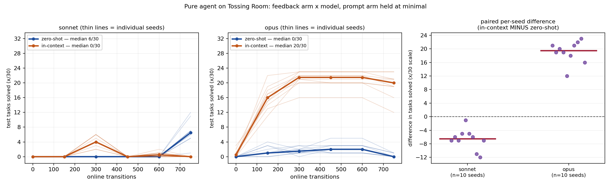

# Pure agent on Tossing Room: what the feedback carries × which model reads it

**2026-08-07.** `{zero-shot, in-context} × {sonnet, opus}`, prompt arm held at `minimal`,
Tossing Room, 30 test tasks (14 TRASH / 14 RECYCLING / **2** EMPTY), 10 replay seeds.

**TL;DR.** Giving the agent its own practice transitions instead of per-skill ratios took
Opus from **3/300** to **194/300** on the final sweep, pooled over ten seeds — and the
authored policy shows *why*: it fit `force ≈ 0.53 · weight` from the dumped
`(weight, force, landed)` triples. That proportional law covers **74.1%** of the weight
range against the environment's true affine law, and the arm scores **69.3%** on non-EMPTY
tasks, so the mechanism quantitatively predicts the result. On Sonnet the same feedback
made things **worse**, and a budget artifact is a large part of why. **The 2×2 is
confounded and should not be read as a clean main effect** — see "What this does not
establish".



## Question / goal

The 2026-08-07 pilot scored `0/30` and it was not a measurement of the agent's capability:
the revision prompt asks the agent to *"find the relationship between the observable state
and the parameter values that work"* while handing it only `ThrowTrash: 0/19`. Does giving
it the actual `(observation, params, outcome)` records let it recover the relation, and does
that depend on the model?

## Background

`PureAgentMethod` has the agent author a `policy.py`, evaluates it, and revises between
rounds. Until now the between-round feedback was two things only: practice goals reached,
and per **lifted** skill `num_successes/num_attempts`.

Tossing Room's unobserved law is
`required_force = reference_force + weight_coefficient · (weight − reference_weight)`,
which at this config is `0.5 + 0.8 · (w − 1.0) = 0.8w − 0.3`, with `w ~ Uniform[0.5, 1.5)`
and a tolerance of `0.1`. The distance term is identically zero here, so the relation is
one-dimensional in the weight. Only the two throws have `param_dim = 1`; every other skill
is `0`. Two landed throws identify the line.

A ratio carries neither coordinate of that line. That is the defect this experiment tests
the fix for. Two corrections to the pilot's own account, established by re-reading its
committed artifacts:

- Round 1's byte-identical `policy.py` was **not** the agent declining to revise. Round 1's
  query *failed* — exit 1, over its own `$1.00` cap — and the backend re-read round 0's file
  out of the persistent sandbox. Round 1 was never authored.
- Round 0 did not hardcode `2.0`; it read the bin's `throw_distance` **feature**, which is
  `2.0` at this config. Same effect, different mechanism.

## Hypothesis

Worked examples of `(observation, params, outcome)` let the agent recover a relation a
per-skill ratio cannot express, so the in-context arm should improve across rounds where the
zero-shot arm has nothing to improve on.

**Bounded by identifiability, and this was checked before the run rather than after.**
Rendering a real in-context prompt against the pilot's own round-0 policy gives 19 records
that are *all* at `force=2.0` and all failed, with only the weight varying. One policy tries
one force, so one round's dump cannot identify the line — two different parameters must be
tried, and those only come from two different rounds. The 40-record window was sized from
that observation, to span more than one practice period.

## Guidance given

Josh: *"it should be a json pydantic dump"*; *"it should rollout + add to context for the
practice time, DO NOT record to context the test time ones"*; *"these are two different
baselines - a zero shot one and an in context learning one"*. Hold the prompt arm at
`minimal` so the 2×2 is clean, raise the per-query budget cap above the pilot's `$1.00`, and
raise `--num-cycles`.

## Methods

`--num-cycles 5` (6 authoring rounds), `--max-steps-per-interaction 150`,
`--num-test-tasks 30`, `--pure-agent-max-budget-usd 4.0`, `--pure-agent-prompt-arm minimal`.

**Record-then-replay.** Each cell was authored **once** at seed 0 (authoring is
nondeterministic and paid), and that transcript replayed across seeds 0–9, which makes no API
call and is deterministic. Verified rather than assumed: each arm's seed-0 replay
`stats.json` is **byte-identical** (sha256) to its authoring run's.

**Paired tests**, because every arm is replayed on the same seed set. Exact Wilcoxon
signed-rank from `analysis/practice_makes_perfect/paired_tests.py`, enumerated rather than
approximated. `p = 0.001953` is the two-sided floor for n=10 when every pair has the same
sign, so it is the *smallest p this design can produce*, not a strength-of-effect reading.

## Results

Final sweep, pooled over 10 seeds. Best sweep is shown too because a revise loop is not
monotone; the final sweep stays the headline, since picking the best sweep post hoc is a
choice made with the test set in view.

| cell | final (pooled) | median | min–max | best sweep | TRASH | RECYCLING | EMPTY | spend | rounds cut off |
| --- | --- | --- | --- | --- | --- | --- | --- | --- | --- |
| zero-shot-sonnet | 67/300 | 6/30 | 1/30–12/30 | 67/300 | 36/140 | 31/140 | 0/20 | $5.83 | 0/6 |
| in-context-sonnet | **0/300** | 0/30 | 0/30–0/30 | 42/300 | 0/140 | 0/140 | 0/20 | $15.54 | **2/6** |
| zero-shot-opus | 3/300 | 0/30 | 0/30–1/30 | 28/300 | 1/140 | 2/140 | 0/20 | $16.98 | 1/6 |
| **in-context-opus** | **194/300** | 20/30 | 12/30–23/30 | 211/300 | 89/140 | 105/140 | 0/20 | $19.42 | 1/6 |

Paired per-seed differences on the final sweep:

| comparison | mean | wins | exact two-sided p |
| --- | --- | --- | --- |
| in-context − zero-shot, **opus** | +19.10 | 10/10 | 0.001953 |
| in-context − zero-shot, **sonnet** | −6.70 | 0/10 | 0.001953 |
| opus − sonnet, **in-context** | +19.40 | 10/10 | 0.001953 |
| opus − sonnet, **zero-shot** | −6.40 | 0/10 | 0.001953 |

**There is no main effect of either factor — there is an interaction.** In-context helps
Opus and hurts Sonnet; Opus beats Sonnet under in-context and loses under zero-shot.

### The mechanism, which is the real result

`in-context-opus`'s final `policy.py` reasons explicitly over the dumped triples. Verbatim
from its comments:

```text
# while 0.7071@1.045, 0.7456@0.509, 0.7594@1.154, 0.8561@0.733, 0.9578@1.090
# and 1.4233@0.847 all failed.  p = 0.53 * w reproduces the success exactly
#   p = 0.6424 at w = 1.2118   (p / w = 0.530)
#   p = 0.7688 at w = 1.3728   (p / w = 0.560)
# Failures bracket it from above: every miss was 21% or more over 0.545 * w.
```

Those are exactly the coordinates the zero-shot arm never sees. It fit a **proportional**
law, `p = θ·w` with `θ ≈ 0.53`, not the true **affine** `0.8w − 0.3`. That approximation is
inside the `0.1` tolerance precisely when `0.741 < w < 1.481`, which is **74.1%** of
`Uniform[0.5, 1.5)`. Observed non-EMPTY success is **194/280 (69.3%)**. The wrong-but-close
functional form predicts the score, and the residual gap is the extremes of the weight range
— exactly where a proportional fit must fail.

Corroborating practice signal: `in-context-opus` is the only arm whose practice throws land
(`ThrowTrash 1/7`, `ThrowRecycling 1/1`, `1/1`, `ThrowTrash 1/1` across cycles).
`zero-shot-sonnet` landed **0/39** practice throws over the whole run despite scoring 67/300
— its solves come from searching forces *within* an evaluation episode, which is a different
thing from having learned the law.

**EMPTY is 0/20 in every cell.** No arm ever presses a button. This reproduces the pilot's
goal-parsing gap and is untouched by anything varied here.

Recorded practice episodes, one per cell:
[zero-shot-sonnet](2026-08-07-pure-agent-feedback-2x2-zero-shot-sonnet.mp4) ·
[in-context-sonnet](2026-08-07-pure-agent-feedback-2x2-in-context-sonnet.mp4) ·
[zero-shot-opus](2026-08-07-pure-agent-feedback-2x2-zero-shot-opus.mp4) ·
[in-context-opus](2026-08-07-pure-agent-feedback-2x2-in-context-opus.mp4)

## What this does not establish

**The budget cap binds asymmetrically, against the arm that uses the feedback.** Per-round
cost, Sonnet: zero-shot `$0.70, $0.68, $0.45, $1.16, $2.05, $0.79` — never near the cap;
in-context `$0.75, $1.26, $2.10, $3.23, $4.07, $4.12` — cut off on rounds 4 **and** 5. This
is causal, not luck: the in-context prompt is ~52 KB and the arm runs 14–19 turns per round
*because* it is doing the arithmetic. Round 5 was cut mid-edit and left a file that raises
`TypeError: _throw_param_for() takes 1 positional argument but 2 were given` on every call,
so every decision becomes a no-op. **`in-context-sonnet`'s 0/300 is that crash, not a
measurement of in-context learning.** Its best sweep, 42/300, is the fairer read of it.

So I raised the cap 4× from the pilot's `$1.00` and the better-engaged arm cleared `$4.00`
anyway — the pilot's defect reproduced one notch up.

**Arm-level n = 1.** Each cell is one authored policy replayed across ten seeds. The seeds
vary the task draw, the item weights and the practice dynamics — **not the authoring**. So
every p-value above answers *"does this particular authored policy beat that one on this task
distribution"*, which is true and modest. It does **not** answer *"is the in-context arm
better than the zero-shot arm"*: authoring variance is entirely unmeasured, and a single
nondeterministic draw per cell cannot support a claim about the method.

**Sonnet-versus-Opus is not cleanly separable from truncation either**, since the two cells
that cleared the cap least often are also the two being compared.

**Not measured:** the `described` prompt arm (a separate axis), and whether the affine law
would be recovered given more rounds or a policy that deliberately explores the weight
extremes.

## Recommendation

1. **Re-run the two in-context cells at a cap that does not bind** — `$8` or higher, chosen
   from the observed `$4.12` maximum rather than guessed again. Until then the feedback axis
   is confounded with truncation frequency and the headline `0/300` for in-context-sonnet is
   an artifact worth deleting from anyone's mental model.
2. **Report `AuthoringRound.stop_reason`.** `recover_metadata` already extracts the CLI's
   `subtype` (`error_max_budget_usd`) and `AuthoringRound` drops it, which is why the pilot's
   committed artifacts could not evidence *why* a round died and the diagnosis had to be
   inferred from cost-versus-cap. One field would make budget stops self-evidencing.
3. **Treat `force ≈ 0.53·w` as the finding worth building on.** The agent recovered a
   wrong-but-useful functional form from six triples. Whether more rounds, or an explicit
   instruction to vary the parameter, gets it to the affine law is a sharper and cheaper
   question than the 2×2 was.
4. **The EMPTY 0/20 gap is orthogonal and untouched** by anything here; it needs its own fix.
