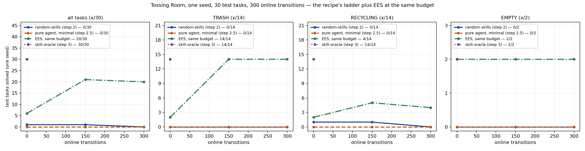

# Pure agent on Tossing Room — a one-seed debugging pilot

2026-08-07. `--method pure-agent`, step 2.5 of
[Tom Silver's recipe](https://tomsilver.github.io/blog/2026/now-whats-your-solution/).

**Read the caveat before the numbers.** One seed per arm. No per-seed spread is
established, no significance test is computed, and none is supported: with n=1 there is
no paired structure and no variance estimate. Everything below is a single run's count.
This was a debugging pilot, and it found bugs.

**And a second caveat added after the fact:** the headline `0/30` is substantially an
artifact of the authoring budget rather than a measurement of what the agent can do. See
the marked note beside the results table before quoting anything from this entry.

## Question / goal

Does a coding agent that **writes** the policy — rather than being it — solve Tossing
Room, and what does the writing cost? And, as a by-product Josh asked for: how many
decisions does a full run make, i.e. what would the *be-the-policy* variant the blog
proposes actually cost in API calls?

## Background

The recipe's step 2 is the stupidest thing that could work (`--method random-skills`) and
step 3 is a privileged oracle (`--method skill-oracle`); both were already here. Step 2.5
sits between them and was missing. Its vehicle,
[`prpl-agent-utils`](https://github.com/Princeton-Robot-Planning-and-Learning/prpl-mono/tree/main/prpl-agent-utils),
was built for exactly this, and its `examples/pendulum_pure_agent.ipynb` establishes the
move that makes it compatible with a step-counting harness: *"the pure agent writes the
policy instead of being the policy"*, so no API call happens at decision time.

**Tossing Room's hidden structure is thinner than it looks, which is why this domain was
chosen.** `throw_distance` is fixed at `reference_distance` (both 2.0), so the distance
term of `TossingRoomEnvironment.required_force` is identically zero and the relation
collapses to one dimension:

    required_force = 0.5 + 0.8 * (weight - 1.0)

`weight` is observable in the state, the tolerance is 0.1, and the relation is **identical
for trash and recycling**, so cross-skill transfer is free for anything reasoning about
the mechanism. Verified against `environments/tossingroom/environment.py`
(`reference_force`, `weight_coefficient`, `throw_distance`, `reference_distance`,
`throw_tolerance`, and `required_force` itself).

The prior expectation, stated in the brief, was therefore that **the pure agent might do
very well — possibly better than EES** — and that this would be a result about the domain
rather than a bug. That is not what happened.

## Hypothesis

The agent recovers the linear force relation from the practice feedback within a handful
of rounds and reaches a high task success rate, because the relation is one-dimensional,
its cause is observable, and it transfers across both throw skills for free.

## Guidance given

Josh settled every decision up front: Docker on; record-then-replay (author once, then
evaluate deterministically with a byte-stable `stats.json`); two prompt arms, minimal and
described; one seed, Tossing Room only; no human help in v0. He also asked explicitly for
the actual dollar spend and for the be-the-policy decision count, and stated that the two
arms at one seed **prove the plumbing handles both and are not a measurement of what the
hint is worth**.

## Methods

`--env tossingroom --seed 0 --num-test-tasks 30 --num-cycles 2
--max-steps-per-interaction 150`, everything else default. 30 test tasks is the fixed
14 TRASH / 14 RECYCLING / 2 EMPTY composition. Two cycles is three authoring rounds
(round 0 is authored before the first evaluation sweep) and matches the reference
notebook's own round count, which is what its cost figure is quoted at.

Four arms were run **at identical configuration and the identical transition budget**, so
they are directly comparable to each other:

- `random-skills` — step 2.
- `pure-agent` (minimal prompt) — step 2.5.
- `pure-agent` (described prompt) — step 2.5 with the domain named in words.
- `ees` — the paper's own method, at the same 300 online transitions.
- `skill-oracle` — step 3, privileged.

Every pure-agent number is from a **replay** of the recorded transcript, and every
transcript is committed beside this entry, per-round `policy.py` files included.

The described arm was run twice. The first attempt is preserved as
`author-described-v1-failed/` and measured nothing — see Results.

## Results

### Task success, one seed, at 300 online transitions

| arm | sweep 0 | final | TRASH | RECYCLING | EMPTY |
| --- | --- | --- | --- | --- | --- |
| `random-skills` | 1/30 | 0/30 | 0/14 | 0/14 | 0/2 |
| `pure-agent`, minimal | 0/30 | 0/30 | 0/14 | 0/14 | 0/2 |
| `pure-agent`, described | **no measurement** | **no measurement** | — | — | — |
| `ees` | 6/30 | 20/30 | 14/14 | 4/14 | 2/2 |
| `skill-oracle` | 30/30 | 30/30 | 14/14 | 14/14 | 2/2 |

Every arm ran the full 300 online transitions; `skill-oracle` is a single point because it
never practises (`--num-cycles 0`). The described arm is deliberately **absent from the
figure**: its `stats.json` reads 0/30 at every sweep, but that is the harness emitting
no-ops because no policy was ever authored, not a policy that scored nothing. Plotting it
beside the minimal arm would invite exactly the wrong reading.

> **⚠ 2026-08-08 — the `0/30` above is substantially a BUDGET artifact, not a capability
> result. Read the hypothesis verdict below as provisional.**
>
> Every number in this entry stands as measured, under the conditions stated: 3 authoring
> rounds at a `--pure-agent-max-budget-usd 1.0` cap, of which only 2 were productive. None
> of them is edited or recomputed here.
>
> What changed is the interpretation. A later run of **the same minimal arm at 6 rounds
> and a $4 cap reaches `7/30`** — so the `0/30` is measuring the authoring budget at least
> as much as it measures what the agent can do, and the recommendation below ("give it
> more throws", "raise the cap") turns out to have been the whole story rather than a
> caveat. **That 7/30 is reported to me by the agent that ran it; I did not run or verify
> it**, and it is recorded here as a pointer, not as a result of this pilot.
>
> Two specific claims below are therefore weaker than they read:
>
> - *"The hypothesis is not supported"* — not supported **at this budget**. Whether the
>   agent can recover the force law given enough rounds is not settled by this entry.
> - *"the pure agent … indistinguishable from the random baseline"* — true of this run's
>   numbers, and not a statement about the method.
>
> The second defect below ("a round that writes nothing is indistinguishable from one that
> rewrites identically") is the mechanism: minimal round 1 was a **failed query re-reading
> round 0's file from the persistent sandbox**, which this entry originally read as the
> agent declining to revise. It was not. Josh has removed the cap for a clean re-run.

**The hypothesis is not supported.** On the minimal arm the pure agent solved 0/30 at
every one of the three sweeps — indistinguishable from the random baseline, and well below
EES on the same 300 transitions.

**The described arm produced no measurement at all**, twice, and the cause is now fully
diagnosed — see "Two defects" below. Nothing in this entry compares the two prompt arms,
and nothing can.

### Why the robot scored nothing: it never landed a throw, and never pressed a button

(Agent and robot are different things throughout this entry, per the project's naming
rule, and this baseline is the one place both exist at once. The **agent** is Claude Code,
which wrote `policy.py` and was not running by the time anything moved. The **robot** is
what that file drove. "The agent did not recover the relation" and "the robot never landed
a throw" are two different claims, and both are true here.)

Practice tallies for the minimal arm, cumulative over both periods:

| skill | achieved its add effects |
| --- | --- |
| `MoveRoom` | 258/258 |
| `PickupTrash` | 19/19 |
| `PickupRecycling` | 1/1 |
| `ThrowTrash` | 0/19 |
| `ThrowRecycling` | 0/1 |
| `PressTrash` | never executed |
| `PressRecycling` | never executed |

Two separate failures, and only the first was expected:

1. **The force relation was never recovered.** 0/20 throws landed across the whole run.
2. **EMPTY is 0/2 because the authored policy never presses a button at all.** That is a
   coverage gap in the authored code, not a continuous-parameter problem — EMPTY needs no
   throw, and EES and the oracle both get 2/2.

### What the agent actually wrote

Round 0 (`round_000_policy.py`) is a competent symbolic policy: it parses the atom
strings, works out which goal atoms are missing, and drives pickup → move → throw. For
the throw's one continuous parameter it guessed the bin's `throw_distance` **feature**
(2.0) — a plausible reading of an undocumented parameter, and one that can never land,
since the required force spans `[0.1, 0.9)`.

Round 2 (`round_002_policy.py`) is the interesting one. Told that `ThrowTrash` had
achieved 0/19, the agent stopped guessing a formula and wrote an **online hypothesis
search**: a 21-candidate pool of constants and simple feature transforms
(`throw_distance`, `weight`, `throw_distance + weight`, …), cycled with module-level state
that persists across `policy()` calls, confirming a candidate the moment a throw lands.

That is the right idea and it still cannot work here. Nothing in that pool equals
`0.5 + 0.8 * (weight - 1.0)`; the closest, the bare constant `0.5`, lands only when the
drawn weight falls in `[0.875, 1.125]`, roughly 1/4 of the `Uniform[0.5, 1.5)` draw — and
the confirm-and-stick rule would then lock onto it and miss the rest. The agent searched
**constants and one-term transforms**, never an affine function of the weight, and had 20
throw attempts total in which to find one.

### Cost, in dollars and in decisions

| arm | rounds | spend | rounds with no usable policy | rounds cut off by the cap |
| --- | --- | --- | --- | --- |
| minimal | 3 | $2.4396 | 0/3 | 1/3 |
| described (v1, failed) | 3 | $1.9544 | 3/3 | 1/3 |
| described (v2, failed) | 3 | $3.2808 | 3/3 | **3/3** |

Per-round for the minimal arm: $0.6871, $1.0359, $0.7165. For described v2: $1.1474,
$1.1184, $1.0151 — **every one over its own $1.00 cap, and every one after a single
turn**. Total for the pilot, including a $0.8863 Light Switch smoke run that shook out the
backend: **$8.5601**. The brief anticipated order $1–3 per authoring run; the minimal arm
landed in that range and the described arm's two attempts did not, for a reason that is
now understood.

The cap is checked *between* turns, so a single long reasoning turn can overshoot it
outright. That is why every described round died at one turn having written nothing: the
described prompt is 8935 characters against the minimal arm's 5514, the agent reasons
longer with the extra context, and the first turn alone exceeds $1.00.

**The be-the-policy price: 1380 decisions for this run**, and the split is exact —
300 practice steps (2 × 150) plus 1080 evaluation steps (3 sweeps × 30 tasks × the
12-step horizon; no episode ended early, which follows from 0/30). A variant querying the
agent inside the policy would have made 1380 API calls for a two-cycle run. Scaling the
same arithmetic to the 10-cycle budget EES is normally charted at gives
`10 × 150 + 11 × 30 × 12 = 5460` calls as an **upper** bound, lower to the extent that
episodes terminate early by solving. At even $0.01 per call that is $55 for one seed of
one arm, against $2.44 for the write-the-policy design. **The notebook's refusal of the
be-the-policy design holds here with a wide margin.**

`0/1380` decisions were malformed on the minimal arm: whatever else the authored code got
wrong, it always returned a well-formed, legal choice.

### Determinism

`stats.json` is byte-identical across two independent replays **and** the original
authoring run — all three sha256
`7a5fcf0914b1de9ccffff99b51b4dd3c3402590122d6d985395189ebd1850a7c`. That is the stronger
form of the claim: the replay reproduces the run that authored it, not merely itself.

### Two defects the pilot found

**1. The recovery prompt was not self-contained.** The described arm's first attempt
burned all three rounds and $1.9544 and measured nothing. Round 0 was cut off mid-turn by
its own budget cap before writing any file; rounds 1 and 2 then received only *"Your
policy could not be evaluated: policy.py was not created. Fix `policy.py`."* The CLI's
`--continue` did not carry the original task across the cut-off, so the agent searched the
sandbox, found no file and no specification, and correctly reported that it had nothing to
go on. Its own words, from `author-described-v1-failed/transcript.json`:

> I checked the sandbox thoroughly — there's no `policy.py` anywhere in the repo, home
> directory, or session logs […] There's no prior version of the file to restore.

Fixed: the recovery branch now restates the entire task. The feedback branch is left short
deliberately — it is only reached after a round that ran to completion, where `--continue`
has been observed to work. The described arm was then re-run on the fixed code.

**That fix cannot have affected the minimal arm**, and this is checkable rather than
asserted: every round of `author-minimal/transcript.json` has `load_error: null`, so that
arm never entered the recovery branch at all. Its numbers are not re-run.

**The fix worked and was not sufficient.** In v2 rounds 1 and 2 did receive the full
self-contained prompt (9203 characters, up from the old one-line one) — and still wrote
nothing, because all three rounds were killed by the budget cap after a single turn. So
this defect was real and is closed; it was simply not the only one.

**3. The described arm is not runnable at a $1.00 per-query cap.** This is the reason
there is no described measurement, and it is a *budget* fact, not a fact about the prompt
arm. Every round of v2 died at `subtype: "error_max_budget_usd"` with `num_turns: 1` and
no file written. The fix is a higher `--pure-agent-max-budget-usd` — on this evidence at
least $2.50, since the observed overshoot is 15% above a $1.00 cap and the agent needs
several turns after the first to actually write and check the file. **Not attempted here:
the pilot had already spent $8.5601 against a brief anticipating order $1–3 per authoring
run, and raising the cap and re-running both arms is a spending decision rather than a
technical one.**

**2. A round that writes nothing is indistinguishable from one that rewrites identically.**
The backend reads `policy.py` out of a persistent sandbox, so a round that produced no
file yields the *previous* round's contents. Minimal round 1 was cut off by the cap and
wrote nothing; `round_001_policy.py` is byte-identical to `round_000_policy.py`, and the
transcript's `0/3 rounds produced no usable policy` is therefore misleading — the arm had
**2 productive rounds, not 3**. Not yet fixed; the fix is to hash the file before and after
each query and record "unchanged" explicitly.

### One thing that is not a defect but is a fairness caveat

The round-2 policy carries **module-level state across evaluation episodes**, because the
module is loaded once per authoring round and `AuthoredPolicy` holds the function. So the
authored policy adapts *during* the evaluation sweep, using its own action outcomes. It is
not training on test labels — it never sees one — but EES does not do this, and a
like-for-like comparison should probably reload the module per episode. It made no
difference here (nothing ever landed, so nothing was ever confirmed), but it would the
moment a candidate did.

## Recommendation

**Do not read this as "the pure agent is weak".** Three of the four things that went wrong
are fixable in the harness, and only one is about the agent:

1. **Give it more throws.** 20 throw attempts over the whole run is a starved signal for
   recovering a two-parameter affine relation, and most of the 300 steps went on walking
   (258 `MoveRoom`). Raising `--num-cycles` is the cheap fix — and it costs nothing extra
   in API calls, since authoring is per round, not per step.
2. **Tell it the parameter has a functional form to find.** The prompt says the parameter's
   meaning is unknown and to reason from feedback; it does not say the answer may be a
   *function of the state* rather than a constant. Round 2's search over constants and
   one-term transforms is a direct consequence. This is a one-sentence prompt change and it
   is the single highest-value next experiment.
3. **Report per-*ground*-skill outcomes with the weights that were tried.** The feedback
   today is `ThrowTrash: 0/19` — which says the throw is failing but carries no information
   about *which* forces were tried at *which* weights. That is precisely the data needed to
   fit the relation, it already exists in the run, and withholding it is what forces the
   agent to search blind.
4. **Fix the round-wrote-nothing ambiguity** before any further authoring run, so a
   transcript's round count means what it says.
5. **Raise `--pure-agent-max-budget-usd` to at least $2.50** before attempting the
   described arm again. At $1.00 it cannot complete a single round.

Then re-run at more cycles and more seeds. **The prompt-arm comparison remains
unavailable**: at one seed, and with both described attempts lost — the first to a
recovery-prompt bug, the second to the budget cap — nothing here measures what the hint is
worth, and no number in this entry should be quoted as if it did.

One number here *is* solid and is worth carrying forward on its own: **1380 decisions for
a two-cycle run, `10 × 150 + 11 × 30 × 12 = 5460` as an upper bound at the ten-cycle
budget.** That is the price of the be-the-policy variant, and it does not depend on any of
the failures above — it is counted from the harness, not from the agent.
