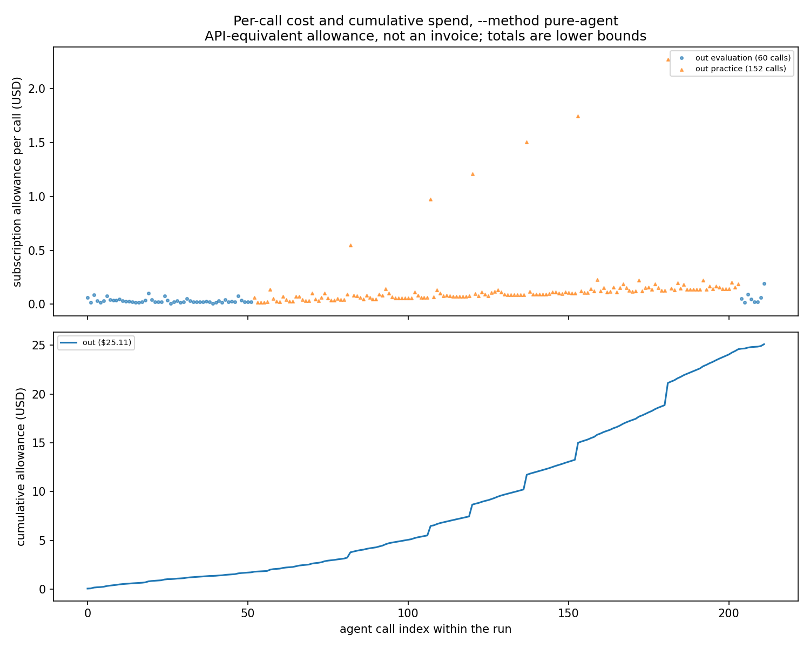
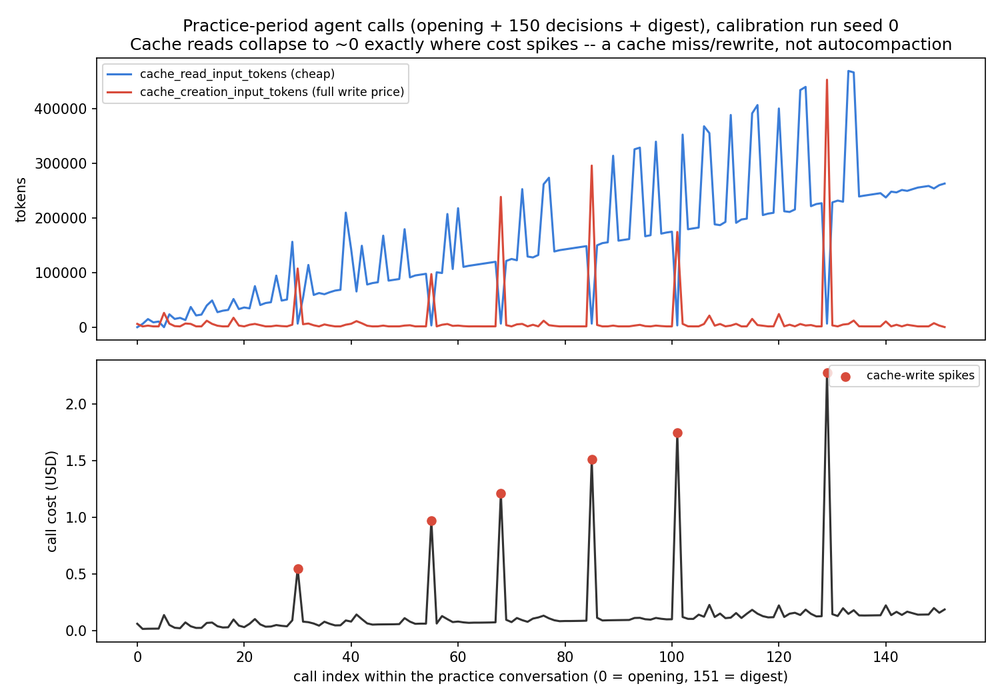

# The full-length practice tail, measured: a truncated calibration run, its cost mechanism, and a revised floor

**This run's task-success outcome (0/4) is not a measurement of anything.** It is
contaminated by no-ops after the spend ceiling stopped real agent calls. Do not read the
success rate below as evidence about the method's capability. The valid content of this
log is entirely on the cost side: 212 real agent calls, a complete full-length (150-step)
practice period, and a confirmed mechanism for the largest cost spikes.

## Question / goal

Measure the true cost of one full-length (150-step) `--method pure-agent` practice
period. Every projection published so far (#181, #182) was built from a **50-step**
pilot and labelled a floor for exactly that reason: a short practice period does not
measure the tail of a long one, because per-call cost climbs within a period. This run
exists to replace that floor with a real 150-step number.

## Background

#181 built the method and measured $0.03-0.07/decision against a 50-step practice
period, with per-decision cost climbing $0.017 -> $0.075 over that window and a single
call reaching $0.597 -- already past the original $0.50 per-query cap, which #181 raised
to $2.00 for exactly that reason. #182 built the ledger reader
(`analysis/pure_agent/spend.py`) that turns `agent_calls.jsonl` into the spend table and
figure this log uses unmodified. Both PRs' own recommendation was the same: run one seed
at the full `--max-steps-per-interaction 150` to measure the tail, at an estimated
$20-25, "well inside any envelope."

That run was launched Friday (2026-08-08) and its launching agent's session ended over
the weekend before the result could be analyzed. **The run itself completed** -- it did
not crash, error, or hang; it stopped because it hit its own spend ceiling and then
correctly finished the remaining steps as no-ops, exactly as designed. This log is the
analysis that was never written up.

## Hypothesis

Under review before this run finished, someone doing a partial mid-run check on this
same ledger noticed two isolated, single-turn cost spikes and guessed a mechanism:
**"autocompaction from `--continue` resuming a growing session."** That guess was never
checked against the full record or against token-level evidence. This log checks it.

## Guidance given

Analyze data that already exists; launch no new run. Confirm or refute the
autocompaction hypothesis with the full 212-call record rather than repeating it as
established fact. State clearly that the task-outcome measurement is invalid and why.
Give an updated per-call cost and a revised floor for a full run. Propose, but do not
launch, a concrete next step with a specific ceiling and reasoning for the number.

## Methods

**The launch config** (`launch.sh`, committed alongside this log):
`--env tossingroom --method pure-agent --seed 0 --num-cycles 1
--max-steps-per-interaction 150 --num-test-tasks 4 --pure-agent-model opus
--pure-agent-max-total-cost-usd 25 --pure-agent-max-cost-usd-per-query 2.0`. Four test
tasks and one cycle is a **reduced** calibration design, not the eventual production
grid -- it exists purely to measure per-call cost cheaply.

**Read the ledger with the existing tool, unmodified.** `agent_calls.jsonl` (212 lines)
and the raw Claude Code stream log the CLI itself wrote
(`sandbox/practice/.agent_logs/stream.jsonl`, 887 lines, one `session_id` for the whole
practice period) are both committed under
`2026-08-08-pure-agent-150step-calibration-runs/`, laid out as
`<results-root>/<method>/<seed>/` so `analysis/pure_agent/spend.py --results-root`
reads them with no changes:

```bash
python -m analysis.pure_agent.spend \
  --results-root docs/experiment-logs/2026-08-08-pure-agent-150step-calibration-runs \
  --figure docs/experiment-logs/2026-08-08-pure-agent-150step-calibration-spend.png
```

**Checking the autocompaction hypothesis needed one level lower than the ledger.**
`agent_calls.jsonl` records cost and duration per call but not token usage, so it cannot
distinguish "expensive because compacted" from "expensive for some other reason." The raw
`stream.jsonl` the underlying agent SDK writes carries per-call `usage` blocks
(`input_tokens`, `cache_creation_input_tokens`, `cache_read_input_tokens`,
`output_tokens`) and every `system`-typed event, including any compaction boundary. A
one-off script (not added to `analysis/` -- it reads the raw stream-log schema, not the
ledger schema `spend.py` reads, and this is a point-in-time check, not a reusable tool)
walked the 152 `system:init` boundaries in the practice stream (one per practice-phase
call: 1 opening + 150 decisions + 1 digest) and paired each with its `agent_calls.jsonl`
row in order, then plotted `cache_read_input_tokens` / `cache_creation_input_tokens`
against call index.

## Results

**Structure: far more of the run completed than the brief assumed.** The 212 real
calls are not a run that died mid-practice-period. They are:

| segment | target | completed | calls |
| --- | --- | --- | --- |
| pre-practice evaluation | 4 episodes | **4/4**, complete | 52 (4 openings + 48 decisions) |
| practice period | 150 steps | **150/150**, complete | 152 (1 opening + 150 decisions + 1 digest) |
| post-practice evaluation | 4 episodes | **1/4** episodes attempted, that one itself cut at step 7 of ~12 | 8 (1 opening + 7 decisions) |

The **entire full-length practice period ran to completion** before the ceiling stopped
anything. What did not complete is 3 of 4 post-practice evaluation episodes (0 real
calls each -- pure no-ops) plus the tail of the 4th (5 of its ~12 decisions never made).
That is why the reported success rate is 0/4: three of the four test tasks never got a
single real agent decision, and the fourth was cut before its episode ended. **The
outcome number is not a measurement of the method's post-practice capability and should
not be read as one.**

**Spend, by phase and kind** (`analysis/pure_agent/spend.py`'s own table, run against the
committed ledger):

| phase | kind | calls | total $ | mean $ | median $ | max $ | mean s |
| --- | --- | ---: | ---: | ---: | ---: | ---: | ---: |
| practice | opening | 1 | 0.063 | 0.0629 | 0.0629 | 0.0629 | 4.02 |
| practice | decision | 150 | 22.625 | 0.1508 | 0.0998 | 2.2734 | 7.20 |
| practice | digest | 1 | 0.189 | 0.1887 | 0.1887 | 0.1887 | 30.20 |
| evaluation | opening | 5 | 0.153 | 0.0307 | 0.0299 | 0.0626 | 2.56 |
| evaluation | decision | 55 | 2.083 | 0.0379 | 0.0249 | 0.1903 | 5.60 |

Run total **$25.113027** (subscription allowance, API-equivalent; not an invoice; 0/212
calls reported no cost, so this total is not padded by unpriced calls the way a lower
bound sometimes is). **The full practice period alone cost $22.877 -- 91% of the entire
run's spend, on 72% of its calls (152/212).** That single number is the one every prior
projection was a floor because of.



**The autocompaction hypothesis is refuted as literally stated, and replaced by a
mechanism with direct token-level evidence: prompt-cache misses on the `--continue`-resumed
session, not Claude Code's own context-summarization feature.**

No `compact_boundary` or any other compaction-type event appears anywhere in the 887-line
raw stream log for the practice period. (`grep -i compact` matches only the CLI's own
slash-command metadata, echoed verbatim in every `system:init` line -- not an event.) Each
of the 152 practice-phase calls is its own freshly-started CLI process (152 distinct
`system:init` boundaries, one per call, all sharing the same underlying `session_id`), so
every call reloads the entire prior transcript from the on-disk session file via
`--continue` and resends it. Ordinarily the previously-cached prefix is still live and gets
read back cheaply (`cache_read_input_tokens`, priced far below a fresh token). What the
token-level data shows is that **six times over the 150-step period, that cached prefix
had gone cold**, and the identical prefix had to be rewritten into the cache from scratch
at full write price:

| practice step | cost | cache_read (prior call) | cache_read (this call) | cache_creation (this call) |
| ---: | ---: | ---: | ---: | ---: |
| 29 | $0.5480 | 156,186 | 6,496 | 107,336 |
| 54 | $0.9732 | 97,633 | 3,248 | 97,114 |
| 67 | $1.2123 | 119,614 | 6,496 | 238,352 |
| 84 | $1.5079 | 148,243 | 6,496 | 295,606 |
| 100 | $1.7443 | 174,643 | 3,248 | 174,224 |
| 128 | $2.2734 | 226,709 | 6,496 | 452,596 |

In every row, `cache_creation_input_tokens` at the spike is on the same order as
`cache_read_input_tokens` at the immediately preceding call -- the whole growing
conversation, not just the fresh turn, was re-embedded and rewritten into the cache. Wall
time at these calls is **not** correspondingly elevated (step 100: 3.74s, cheaper than
several of its non-spike neighbors) and every one of the six is a single- or two-turn
call whose reply is an ordinary skill selection, not a summary -- both facts are
inconsistent with a content-summarizing compaction step and consistent with a cache
miss/rewrite, where prefill is fast but priced at the write rate rather than the read
rate.



**What this data does not establish:** why the cache goes cold when it does. The first
call's usage block shows this session using the 1-hour ephemeral cache
(`ephemeral_1h_input_tokens`), which is a plausible trigger if the wall-clock gap
*between* successive `--continue` invocations (harness/environment time, not captured by
the ledger's `seconds` field, which is only the LLM call's own duration) runs long
enough between some steps and not others. The six intervals between spikes (25, 13, 17,
16, 28 steps) are not perfectly regular, which is consistent with a time-based TTL
racing against a token-count-driven per-step cost rather than a fixed step-count
trigger, but this run alone cannot distinguish that from other explanations. Flagged as
open, not resolved.

**The six spikes are not noise -- they are more than a third of practice-decision
spend.** $8.26 of the $22.63 practice-decision total (36.5%) comes from just 6/150
(4.0%) of the decisions. The other 144 decisions show the previously-reported climbing
baseline (median $0.0998, well below the mean $0.1508, exactly because the mean is
pulled up by these six outliers) but no comparable spike among them.

**A second, smaller finding in the same direction: malformed replies cluster in the back
half of the period.** 5/205 total decisions were malformed across the whole run, all five
in the practice phase, all five at step_index >= 74 (5/76 decisions in the second half of
the period, 0/74 in the first half). All five have the identical failure mode -- the
reply echoes the observation's own schema keys (`atoms`, `goal`, `objects`, `skills`)
instead of returning a `skill_index`. This is a plausibility-consistent companion to the
cost-climb story (something about a long, `--continue`-resumed conversation degrades
reply quality as well as cost) but is reported here as an observed count, not as a proven
causal link to the same mechanism as the spikes.

**One thing that worked exactly as designed:** the call at step 128 hit the $2.00
per-query cap (`stop_reason: error_max_budget_usd`, recorded cost $2.2734) and #181's
budget-stop recovery still extracted a legal decision (`skill_index: 1`) from it rather
than discarding the call outright. The run continued for another 22 practice steps after
that recovery.

**Practice-phase behavior, real signal despite the truncation** (from the run's own
stderr summary, `log.txt`, committed alongside this log): `MoveRoom` 113/113,
`PickupTrash` 15/15, `PressTrash` 1/1, `ThrowTrash` 2/15, with those 2 `ThrowTrash`
successes both categorized **informed** (competence-based, not epsilon-random or
fallback). This reflects the practice period, which ran to completion and is not
touched by the truncation -- unlike the evaluation success rate, this number is valid.

**The revised floor.** Running `analysis/pure_agent/spend.py`'s own projection --
unmodified -- against this run's ledger, using its now-measured full-150-step practice
mean ($0.1508/decision over 150 calls, not extrapolated from a 50-step window) and its
post-practice evaluation mean ($0.0654/decision, but over only **7** calls from the one
truncated post-practice episode -- noisy, flagged below):

```text
projected 2-cycle run: 1380 decisions -> $116 (FLOOR)
projected 10-cycle run: 5460 decisions -> $485 (FLOOR)
```

**This raises both of #182's published floors: $103 -> $116 (2-cycle), $405 -> $485
(10-cycle).** The mechanism is exactly what was predicted: the 50-step pilot's per-decision
mean ($0.0726) mostly missed the cache-miss spikes because a 50-step window only gave the
prefix cache a few chances to go cold and grow large enough for a miss to be this
expensive; the 150-step run's mean ($0.1508, almost exactly double) did not, because it
captured six of them, and the two most expensive ones (steps 100 and 128) rewrote 174K
and 453K tokens respectively -- sizes a 50-step conversation never reaches.

**Both new numbers are still floors, and for reasons distinct from before:**

- **The projection assumes every cycle's practice conversation repeats this run's spike
  pattern.** Only one cycle ran. A practice period's conversation resets at its own
  boundary (per #181), so cycle 2 onward starts fresh rather than compounding cycle 1's
  length -- but whether the *same* roughly-six-spikes-per-150-steps pattern recurs
  identically, worsens (cycle 2's opening already carries the digest from cycle 1, a head
  start on context length that cycle 1 didn't have), or differs is not measured by a
  single cycle.
- **The evaluation-side term rests on 7 samples from one truncated episode.** The
  pre-practice mean here ($0.0339/decision, 48 samples) lines up closely with #181's
  original pre-practice figure ($0.0319), and this run's post/pre ratio (0.0654/0.0339 =
  1.93x) is in the same direction and rough range as #181's previously measured 2.3x --
  but n=7 is small enough that this run's post-practice figure should be read as
  consistent with, not an independent confirmation of, the earlier estimate.

## Recommendation

**Do not read the 0/4 success rate as a capability result, on any axis.** Three of four
post-practice test episodes made zero real agent decisions and the fourth stopped 5
decisions short of its own completion. There is no post-practice outcome signal in this
run at all.

**Treat $116 (2-cycle) and $485 (10-cycle) as the current floors**, superseding #182's
$103/$405, for the reasons stated above -- and keep calling them floors, not final
numbers, until a run exists with more than one practice period and a complete
post-practice evaluation sweep.

**The concrete next step I would propose, not launch: re-run this exact calibration
design (`--num-cycles 1 --num-test-tasks 4 --max-steps-per-interaction 150`, same seed)
with a higher total-cost ceiling, to let it finish.** Reasoning for the number:

- There is **no resume/checkpoint mechanism** in this design -- a bumped-cap run starts
  over from call 0, so it re-pays the full $22.88 practice cost, not just the ~$3
  increment that was actually missing.
- Point estimate for one complete run of this exact design: pre-practice eval $1.73
  (measured) + practice $22.88 (measured) + a full 4-episode post-practice eval sweep at
  the more robust of the two available post-practice rates (#181's $0.0748/decision,
  n=43, rather than this run's own noisy n=7) -> roughly 4 x (12 x $0.0748 + ~$0.04
  opening) ~= $3.7. Total ~= **$28.3**.
- **Propose a ceiling of $40.** That is ~40% headroom over the $28.3 point estimate,
  sized to absorb run-to-run variance in the spike pattern (this run's own six spikes
  ranged $0.55-$2.27 and grew over the period; a second draw could plausibly land one or
  two spikes higher) without being large enough to fund a run that has clearly gone
  wrong. The $2.00 per-query cap is doing its job already (it correctly recovered the
  step-128 call rather than losing it) and needs no change -- the total-budget margin
  only has to cover cumulative drift across ~215 calls, not a single blown-out call.
- This is **not** a proposal to run the production grid (multiple cycles, 10 or 30 test
  tasks). That is a much larger spend decision this log does not make.

## Reproducing this

Every artifact this log's numbers come from is committed:
`2026-08-08-pure-agent-150step-calibration-runs/launch.sh` (exact command),
`.../log.txt` (the run's own stderr summary, including the skill breakdown quoted
above), and `.../pure-agent/0/{agent_calls.jsonl,stats.json,config_snapshot.json}` in
the `<results-root>/<method>/<seed>/` layout `analysis/` globs for.

```bash
# The spend table and the top figure, unmodified from #182:
python -m analysis.pure_agent.spend \
  --results-root docs/experiment-logs/2026-08-08-pure-agent-150step-calibration-runs \
  --figure docs/experiment-logs/2026-08-08-pure-agent-150step-calibration-spend.png
```

The cache-mechanism figure reads the raw Claude Code stream log rather than the ledger
(the ledger has no token counts), and that raw log is large enough (887 lines for the
practice period alone) that it was not committed here -- it lived under this run's own
`sandbox/practice/.agent_logs/stream.jsonl` on the machine that ran it, and the
`cache_read`/`cache_creation`/cost table above is transcribed directly from it rather
than regenerated from a committed source. Anyone who needs to re-derive it should re-run
the calibration design above rather than expect this specific stream log to still exist.
