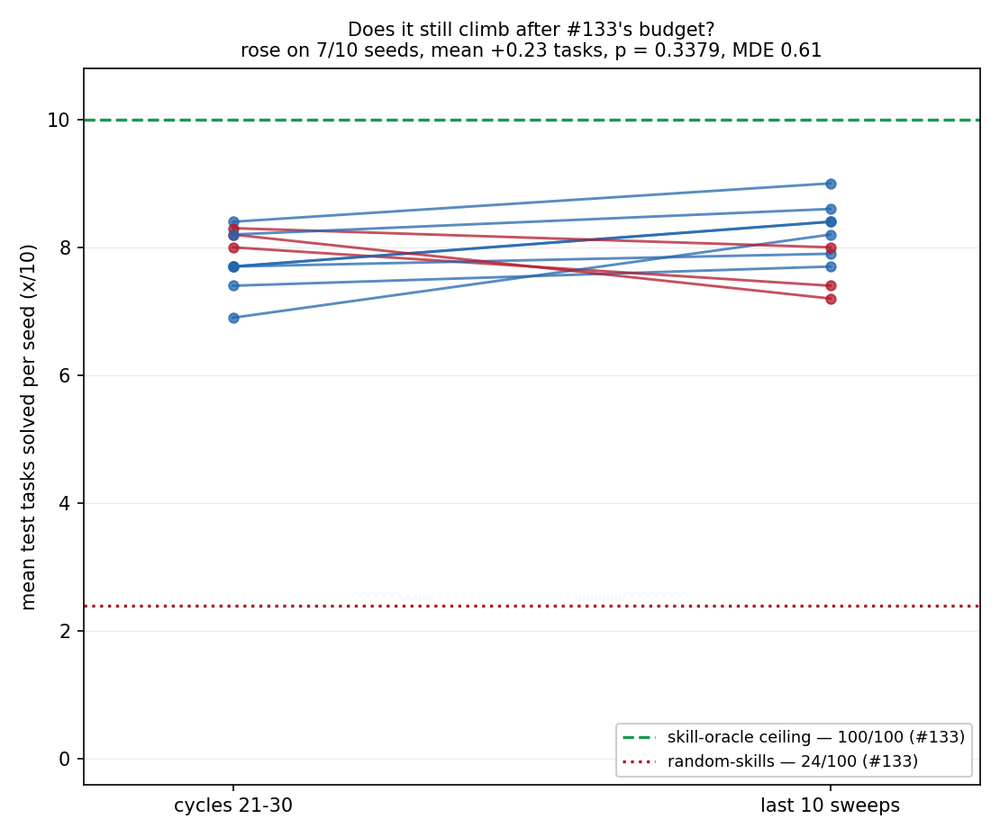

# Tossing3D at five times the budget: EES plateaus at 80/100, and it got there before #133's budget ran out

> **STALENESS NOTE (added 2026-08-16, at the two-skill migration).** Every Tossing3D
> number on this page was measured on the **three-skill** decomposition: `Pick`
> (sampling distance and rotation) -> `MoveToThrowPose` (sampling a standoff) -> `Toss`
> (sampling release speed and gripper release millisecond), over six predicates
> including `RobotAtSuccessfulThrowPose`. That domain no longer exists. Upstream replaced
> it with two skills -- a parameterless `pick_cube` and a composed
> `move_to_toss_location_and_toss` taking four parameters -- and this repo followed, so:
> the pick has **no** continuous parameters and therefore no sampler at all; the standoff
> is now the composed toss's first parameter, drawn from upstream's `(1.25, 1.45)` rather
> than this repo's `(1.10, 1.75)`; release speed is drawn from `(115, 140)` deg/s rather
> than `(60, 140)`; the gripper release millisecond from `(700, 840)` rather than
> `(300, 1400)`; `RobotAtSuccessfulThrowPose` and the whole `THROW_RANGE` calibration are
> deleted; and `OnGround` now accepts a cube resting on any face rather than only the one
> it started on. Two measured grasp fixes (centre grasp, approach settling) also reach the
> pick for the first time.
>
> **Nothing on this page is edited or recomputed.** It is a correct description of the
> domain that was actually in effect when these runs happened. It is simply not evidence
> about the two-skill domain, and no count here is directly comparable to a re-run on it.

> **SECOND STALENESS NOTE (added 2026-08-18, at the KINDER pin bump).** Every number on
> this page was also measured on a **different scene**. `environments/tossing3d/` selects
> no scene of its own, so the geometry moves with the `reference/kindergarden` pin, and
> the bump this note accompanies crosses upstream `270fdb6`, *"Decreased range of goal
> region to make tossing not get hit on the wall + made the goal region visible"*. That
> narrows `blocks_goal_region` from `[1.90, 2.10]` to `[2.00, 2.05]` on x, which inflates
> to a live scoring window of x ∈ [1.95, 2.10] where it used to be x ∈ [1.85, 2.15] --
> exactly the bin's own 0.30 m footprint. So the box that scores is now **strictly inside
> the bin** rather than coincident with it, and **"the cube is in the bin" and "the cube
> scores" have stopped being the same event**: a cube resting at x = 1.90 is in the bin
> and does not score.
>
> Any solved/unsolved count on this page is therefore a count against a **wider** target
> than the one in effect now, and is not comparable to a re-run. Landing positions in
> metres are unaffected as measurements; what changed is which of them score.
>
> **Nothing here is edited or recomputed**, for the same reason as the note above: the
> page correctly describes the conditions its runs actually happened under. Experiments on
> this domain are being re-run after this stack lands.

**Answer: it plateaus.** Late window `80.8/100` against a reference window of `78.5/100`
taken immediately after #133's entire budget — `+0.23` tasks per seed, rose on `7/10`
seeds, exact paired sign-flip **`p = 0.3379`**. That is a **null result** on continued
climbing, and a *powered* one: the minimum detectable effect at 80% power is `0.61` tasks
per seed, and the observed change is `0.23`. Five times the practice budget bought nothing
measurable, and the curve is flat from roughly cycle 12 onward — so #133's `80/100` was
never a budget-limited number.

**A second, unplanned finding that matters more than the first for anything built next:
`--practice-reset-policy never` is a no-op on this domain.** Both arms produced
`stats.json` files that differ in exactly one field — `num_practice_resets` — on `10/10`
seeds. See §6.4. The reset-free arm reported here is **not** a reset-free condition and
must not be cited as one.

> **Note added later, in #184.** That defect was fixed in #179, and the reset-free arm was
> measured for the first time in
> [`2026-08-08-tossing3d-reset-free-remeasured.md`](2026-08-08-tossing3d-reset-free-remeasured.md):
> it collapses to `24.9/100`, stranding on `10/10` seeds after a single cycle. **The
> plateau result on this page is unaffected** — it is a claim about the `scheduled` arm,
> and that arm's `stats.json` came back **byte-identical on `10/10` seeds** when the whole
> sweep was re-run against the fix. Nothing here has been recomputed or edited.

> **Staleness note (2026-08-10).** Every `MoveToThrowPose`/standoff count above and below —
> `117/206`, the uniform `48/275`, and the rest of this page's sampler-consultation
> figures — was measured with `THROW_STANDOFF_BOUNDS = (0.45, 1.75)`. That lower bound has
> since moved to `1.10` to fix a `cuboid_barrier`-collision defect (a short-enough
> `MoveToThrowPose` drove the base through a real dynamic MuJoCo body upstream's motion
> planner does not collision-check against). The sampler's range is now half as wide, and
> the derived acceptance band's share of it roughly doubled — see the staleness note atop
> `2026-08-06-tossing3d-ees-first-real.md` for the full accounting. The **task-success**
> plateau finding this page's TL;DR reports (`80.8/100` vs `78.5/100`) is a different
> quantity and is not directly affected by this note, but any reader using the
> sampler-consultation numbers as a baseline for a future run should not.

## Question / goal

PR #133 measured `80/100` task success for `ees` on Tossing3D after **20** cycles, and
explicitly declined to say whether that was a plateau or a budget limit:

> `--num-cycles 20` was not varied. Whether the curve has plateaued or would keep
> climbing is not answered; the middle panel suggests it flattens after roughly 40
> transitions, but that is a reading of a figure, not a measurement.

This measures it.

## Background

Tossing3D's only learnable quantity inside the throw is the **approach pose**:
`MoveToThrowPose` carries `param_dim = 1`, the standoff, and `Toss` carries
`param_dim = 0` — upstream's `TossFromWindupController.sample_parameters` opens
`del x, rng  # not used` and returns demonstrated constants. #133 established that EES
learns that standoff: informed draws `117/206` against uniform `48/275`, Fisher exact
`p = 1.968e-19`, on `10/10` seeds.

What #133 could not say is where the remaining `20/100` gap to the `skill-oracle` ceiling
goes. Two explanations make opposite predictions about budget: **the robot is still
learning and ran out of cycles**, or **it has converged and the gap is structural**. Five
times the budget separates them.

## Hypothesis

> **The robot is still climbing at 20 cycles, so a 100-cycle run ends materially above
> `80/100`.**

**Falsified.** The late window sits at `80.8/100`, statistically indistinguishable from
#133's `80/100`, and the curve is flat from about cycle 12.

## Guidance given

- 100 cycles, arms = reset policy (`scheduled` / `never`) × 10 fixed seeds, instrumented
  with `--record-sampler-draws`.
- Read the exact other conditions out of the committed `config_snapshot.json` under
  `2026-08-06-tossing3d-ees-first-real-data/` rather than reconstructing them from prose;
  change only what this experiment varies.
- **No early exit.** Josh, verbatim: *"actually no early exit, run all 100 cycles - just
  tell me what happens."*
- Per-seed spread, a paired test across the ten seeds, and a last-*k*-sweeps average
  rather than a single final sweep.
- Non-learners get **reference lines**, not curves.

## Methods

Two arms, `ees` only, 10 fixed seeds (`0-9`), driven by `scripts/run_sweep.py` inside a
memory-capped detached systemd unit. Conditions were read from #133's committed
`config_snapshot.json`; the only non-default flag it carries that is easy to miss is
`reproduce_predicators_explore_target_only = False`, so
`--no-reproduce-predicators-explore-target-only` is passed explicitly. Changed from #133:
`--num-cycles 20 → 100`, the reset policy, and `--record-sampler-draws`.

**`20/20` runs succeeded**, `10/10` per arm.

### The decision rule, fixed before any final number was read

The tempting rule — compare the final sweep at 100 cycles to the final sweep at 20 — is
unsound here, and measurably so. Per-seed score swings several tasks between *adjacent*
sweeps with no learning event: watched live on seed 0, `8/10` at sweep 10, `5/10` at sweep
13, `6/10` at sweep 15. A single sweep is one draw of a noisy variable.

So the rule scores a **window**, not a sweep:

- A seed's score in a window is its **mean solved count over 10 sweeps**.
- **`LATE`** is the last 10 sweeps.
- **`REFERENCE`** is the 10 sweeps starting at cycle 21 — immediately after #133's entire
  budget, so the comparison asks exactly *"did anything happen after the budget #133
  had?"*
- **Climb test:** exact paired sign-flip on per-seed `LATE − REFERENCE` over the ten
  seeds, paired because both windows come from the same run of the same seed.
- **The MDE is reported beside the result, always.** "Not significant" without a minimum
  detectable effect cannot distinguish a plateau from an underpowered test.

`LATE` understates the endpoint if the robot is genuinely still climbing, since it
averages over the climb. That bias is *conservative for a plateau claim*, which is the
direction this result goes, so it does not flatter the conclusion.

## Results

### The plateau: a null result on climbing

| measure | value |
| --- | --- |
| `REFERENCE` window (cycles 21-30) | `78.5/100` |
| **`LATE` window (last 10 sweeps)** | **`80.8/100`** |
| final sweep alone | `75/100` |
| best sweep per seed | `100/100` |
| per-seed change, `LATE − REFERENCE` | `+0.23` tasks, rose `7/10`, fell `3/10` |
| exact paired sign-flip | **`p = 0.3379`** |
| MDE at 80% power | **`0.61` tasks per seed** |

**This is a null result on continued climbing, not a demonstration that the robot is
identical at 30 and 100 cycles.** It is a powered null: the design could detect `0.61`
tasks per seed and observed `0.23`.

**Two rows need reading with care, and neither is a finding.**

`best sweep per seed` reads `100/100` — every seed touches `10/10` at some sweep. That is
**expected under noise and is upward-biased by selection**: the maximum of 101 volatile
sweeps reaches the ceiling even for a policy averaging `8/10`. It is *not* evidence the
robot can hold the ceiling.

`final sweep alone` reads `75/100`, **lower** than the `80.8` late-window average. That is
the volatility again, and it is exactly why the rule scores a window — reporting the single
final sweep would have understated the plateau by 5 tasks and invited a "it got worse"
reading that the data do not support.

**Figure 1. The plateau is reached before #133's budget expired.** Bold pooled mean over
faint per-seed lines. `skill-oracle` (`100/100`) and `random-skills` (`24/100`), both from
#133, are drawn as **reference lines rather than curves**: neither learns, so a curve would
invite a reader to look for a trend in a constant. The per-seed haze spanning 4 to 10 is
the point, not noise in the drawing — it is why the rule averages a window.

**Figure 2. Does it still climb after #133's budget?** One line per seed, plotted per seed
rather than as two bars because with ten seeds a bar chart of two means hides one seed
driving the whole movement. Seven rise, three fall, none approaches the ceiling.

### Per seed

| seed | `REFERENCE` | `LATE` | final sweep | best sweep |
| --- | --- | --- | --- | --- |
| 0 | 8.4 | 9.0 | 9/10 | 10/10 |
| 1 | 7.4 | 7.7 | 7/10 | 10/10 |
| 2 | 7.7 | 8.4 | 7/10 | 10/10 |
| 3 | 8.0 | 7.4 | 7/10 | 10/10 |
| 4 | 7.7 | 7.9 | 5/10 | 10/10 |
| 5 | 6.9 | 8.2 | 7/10 | 10/10 |
| 6 | 7.7 | 8.4 | 10/10 | 10/10 |
| 7 | 8.3 | 8.0 | 7/10 | 10/10 |
| 8 | 8.2 | 7.2 | 8/10 | 10/10 |
| 9 | 8.2 | 8.6 | 8/10 | 10/10 |

### Cost, and a scaling factor that is not comparable to #166's

`analysis/run_timing.py` over the `scheduled` arm's first 8 runs, the batch that ran at a
clean 8 workers: **median `5013.9 s` per run**, `5041.6 s` wall.

Against #133's 20-cycle baseline of `844.7 s` per run at the same `--max-workers 8`, that
is **`5.93×` for `5×` the cycles**. **Two confounds, both of which must travel with the
number:**

1. #133 ran **one** simulator per run; these runs carry **two**, because #160 gave this
   domain a separate evaluation `Problem`.
2. `timing.json` records machine-wide concurrency of 2-5 for these runs; #133's is not
   recorded in comparable form.

**It is therefore not comparable to the `12.97×` multiplier measured on Tossing Room in
#166**, which is a different domain with a different bottleneck (EES retraining rather than
MuJoCo). Quoting the two side by side would be wrong.

### The reset-free arm is a no-op on this domain, and that is a defect

> **Note added later, in #184.** Fixed in #179: `Tasks` gained
> `sample_train_task_in_place`, and Tossing3D now builds a reset-free training task from
> the environment's current state instead of rebuilding the scene. The last bullet of this
> section — "until then `--practice-reset-policy never` should be rejected for
> `tossing3d`" — is therefore **superseded**: the flag works, and `PracticeLoop` now
> refuses any domain that has not migrated rather than silently no-op'ing. What the arm
> actually costs, once real, is in
> [`2026-08-08-tossing3d-reset-free-remeasured.md`](2026-08-08-tossing3d-reset-free-remeasured.md).
> Everything below is left exactly as published.

The `never` arm was intended as a true reset-free condition. **It is not one.** Comparing
the two arms' `stats.json` field by field:

- **`10/10` seeds differ in exactly one field: `num_practice_resets`** (`100` against `0`).
- `evaluations`, `breakdowns` and `practice_outcomes_per_cycle` are **identical** on every
  seed. Both arms therefore report `LATE = 80.8/100` and `final = 75/100`.

The mechanism is in `Tossing3DTasks.build_task`, which calls
`self.env.reset_to_seed(seed=scene_seed)` — a full simulator rebuild — as part of *building
the task*. `Tossing3DEnvironment.reset_to_seed`'s own docstring states the consequence:

> task sampling is a simulator operation rather than an arithmetic one — and therefore one
> with a side effect. Sampling a task leaves the live simulator sitting at that task.

`PracticeLoop.run` calls `problem.sample_train_task()` at the top of every cycle, **before**
the reset-policy branch. So on Tossing3D the practice environment is reset every cycle
regardless of the flag; `NEVER` only skips the *additional* `reset_to_task` call, which by
then changes nothing.

**This is exactly the failure mode `--practice-reset-policy` exists to prevent**: an arm
that reports `num_practice_resets = 0` while its environment is in fact reset 100 times.
It is the same shape as the `resolve_render_fps` defect #160 fixed — a privileged state
write happening outside the loop's reset accounting — and #160 removed one instance
without removing this one.

**Consequences, stated so nothing downstream inherits the error:**

- **No reset-free claim about Tossing3D may cite this arm.** The condition was not
  realised.
- The `never` runs are committed anyway, because they are the evidence for the defect.
- Fixing it means task sampling must stop mutating the live environment — a real design
  change to this domain, not a flag. Until then `--practice-reset-policy never` should be
  rejected for `tossing3d` rather than silently accepted.

## Recommendation

**Stop treating the `20/100` gap to the oracle as a practice-budget problem.** Five times
the budget moved it by `+0.23` tasks per seed against an MDE of `0.61`, and the curve was
already flat at cycle 12. Whatever the gap is, more cycles do not buy it back, so the next
experiment should be about *what the robot cannot do* rather than *how long it practises*.

Three follow-ups, in the order the evidence argues for them:

1. **Fix the reset no-op before any reset-free work on this domain.** Task sampling
   resetting the simulator makes the flag unenforceable here, and the flag currently
   reports success while doing nothing.
2. **Diagnose the residual `20/100`.** `Toss` still has `param_dim = 0`: the skill whose
   add effect *is* the success criterion has no sampler at all, and what #133 improved is
   the standoff feeding it. That is the obvious suspect and it is untested.
3. **Do not spend more compute on Tossing3D cycle budgets.** The marginal return is
   measurably flat from cycle 12, so any budget between 100 and infinity returns this same
   answer.

## Example episodes: seed 7 at both ends of training, and one stuck practice period

**Seed 7 was chosen by a rule stated before the clips were watched:** the **median seed by
`LATE` score**, taking the lower of the two middle values. Sorted, the ten `LATE` scores are
`7.2, 7.4, 7.7, 7.9, 8.0, 8.2, 8.4, 8.4, 8.6, 9.0`, and seed 7 sits at `8.0`. Its final
sweep is `7/10` — not the best-looking seed available, which is the point of picking by rule.

**These clips are illustration, not measurement.** `--seed 7` fully determines a run, and
both recording flags are pure observers, so nothing here is new evidence and no number above
comes from a replay.

Before any practice — [`2026-08-08-tossing3d-seed7-before-practice.mp4`](2026-08-08-tossing3d-seed7-before-practice.mp4).
Recorded by a `--num-cycles 0` run at the same seed, whose single evaluation sweep *is*
sweep 0.

After 100 practice cycles — [`2026-08-08-tossing3d-seed7-after-practice.mp4`](2026-08-08-tossing3d-seed7-after-practice.mp4).
This is the sweep's own `episode.mp4`, which `--num-render-checkpoints 1` already records as
the final sweep, so it needed no re-run.

Both clips show **test task 0**, because the first test task of a rendered sweep is the one
the renderer records — again a rule, not a selection. The fixed test set is drawn once from
the seed-derived RNG, so the 0-cycle and 100-cycle runs draw the *same* task 0 and the pair
is a genuine before/after on one task rather than two unrelated episodes.

A few practice periods, with the scheduled reset visible between them —
[`2026-08-08-tossing3d-seed7-practice-and-reset.mp4`](2026-08-08-tossing3d-seed7-practice-and-reset.mp4).
Recorded with `--record-full-loop`, which is the only thing that renders practice periods at
all; six cycles, so the pattern is watchable. Its status bar names each phase and marks each
reset kind distinctly.

**Read the third clip with §6.4 in hand.** The reset it shows is real — this is the
`scheduled` arm — but the finding above means the environment would have been reset by task
sampling even in the `never` arm, so the clip illustrates the *intended* mechanism rather
than a manipulation that can currently be turned off.

## Artifacts

- **Raw run data**, all 20 runs' `stats.json`, `config_snapshot.json` and `timing.json`:
  [`2026-08-08-tossing3d-100cycle-plateau-runs/`](2026-08-08-tossing3d-100cycle-plateau-runs)
  — two arms × ten seeds, so every number here regenerates without re-running anything.
- **Analysis module:** `analysis/practice_makes_perfect/tossing3d_plateau.py`, which owns
  the window rule and both figures.
