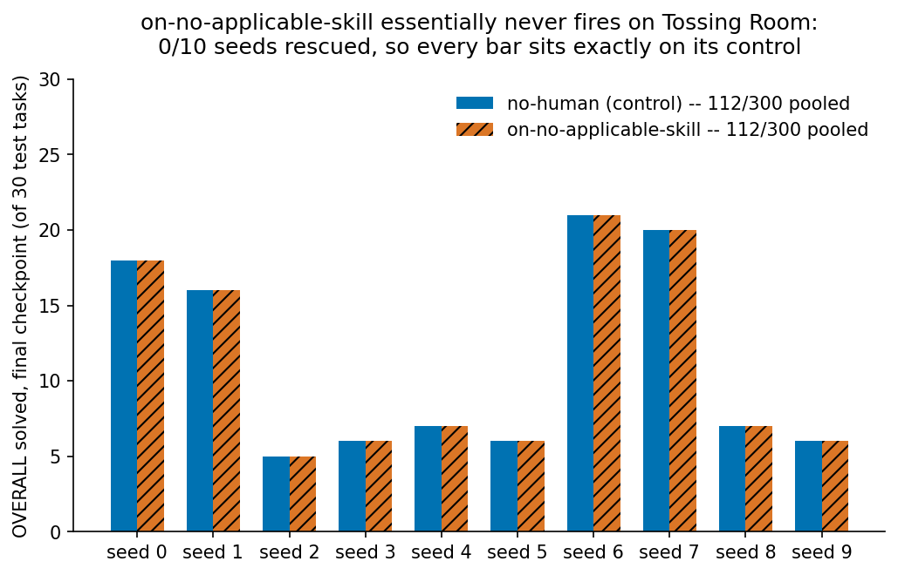
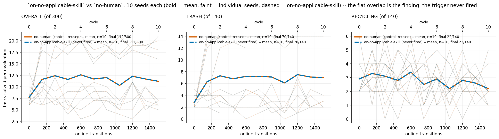

# The naive `on-no-applicable-skill` help-seeking trigger: 0/10 seeds ever ask

**STALE MECHANISM (later PR).** The harness-side `HelpSeekingPolicy`/`HelpSeekingTrigger`
machinery this log measures -- `methods/help_seeking.py`, `methods/stuck_detector.py`,
and the `--ask-for-help`/`--stuck-patience`/`--mean-steps-between-help-requests`/
`--human-reset-target` flags -- has been deleted. Asking for help is now a real ground
skill (`ask_for_reset_task_initial`/`ask_for_reset_random_task`) EES's own planner can
select, priced directly rather than triggered by a harness-side heuristic; see
`ees_method.py` and that PR's body. The measurements below describe a feature that no
longer exists in this form and are not evidence about the replacement.

**One arm, ten fixed seeds (0-9), `--env tossingroom --method ees --ask-for-help
on-no-applicable-skill --human-reset-target task-initial`, `--practice-reset-policy
never`, `--num-cycles 10 --max-steps-per-interaction 150 --num-test-tasks 30`.**

## Question / goal

`HelpSeekingTrigger` has two treated members already measured on Tossing Room:
`ON_STUCK` (novelty-based) and `AT_RANDOM` (Bernoulli per call) -- see
`2026-08-07-human-ladder.md`, which found both beat the `no-human` control (227/300 and
157/300 against 112/300). This adds a third, deliberately naive trigger and asks: does
it ever fire on Tossing Room, and if so, does it recover any of what `on-stuck` recovers?

## Background

The very first version of this project's help-seeking axis had an arm named
`agent-signal`, meant to ask a human exactly when EES's own `InteractionComplete`
condition holds -- zero ground skills applicable in the current state. That arm was
deleted along with the harness-side monitor it depended on, and CLAUDE.md's naming
section records why: "agent" here collided with the LLM sense the codebase reserves
that word for, and the fix that reshaped help-seeking into a `Method`-side
`HelpSeekingPolicy` (see `help_seeking.py`) is why the axis now lives on
`--ask-for-help {never,on-stuck,at-random}` and never got a fourth, `agent-signal`,
member.

`agent-signal`'s old implementation hooked `InteractionComplete` directly, which only
fires once a practice period is already ending -- so it measured 0 interventions on
0/10 Tossing Room seeds, byte-identical to no-human, before it was deleted. That number
was never a controlled measurement of "does checking applicability catch anything" --
it was a side effect of hooking the wrong signal. `ON_NO_APPLICABLE_SKILL` is what that
arm should have been: the same condition, but checked as a real `HelpSeekingPolicy`
trigger *before* the inner policy is consulted, the same place `ON_STUCK` and
`AT_RANDOM` already check it. A prior session (branch `agent-a3/help-seeking-on-no-
action`) implemented this and died mid-work over a weekend with the change uncommitted;
this entry is the first time it has actually been run.

Per Josh's instruction, the implementation stays deliberately unintelligent: a direct
boolean check every call via `SkillGrounder.applicable_ground_skills`, no RNG, no state
history, no patience counter, nothing reused from `StuckDetector`.

## Hypothesis

`MoveRoom`'s only preconditions are `RobotInRoom` and `CanMoveRoom`, and Tossing Room's
one-way ledge blocks only the single rightward step out of `--blocked-right-from` --
every other adjacent step, in either direction, is legal from every room. So some
ground skill (`MoveRoom`, if nothing else) should be applicable in essentially every
reachable state, and this trigger -- which fires only when *zero* skills are applicable
-- should ask almost never. That is the point: it is the naive baseline `on-stuck`'s
novelty detection is motivated by, not a competing rescue strategy. Expected result:
near-zero interventions, and a score indistinguishable from `no-human`.

## Guidance given

Report `x/y`, never a bare percentage. Never assert an effect without a p-value; use
paired tests when arms share seeds. Report the near-zero hypothesis before the result,
not after. State plainly what was found versus what was hoped for.

## Methods

Ten fixed seeds (0-9), one arm, driven by a `systemd-run --user --unit=` sweep (`ees`,
`--ask-for-help on-no-applicable-skill --human-reset-target task-initial`), sharing
every other flag with the `no-human` control already measured in
`2026-08-07-human-ladder.md` and, one commit further back, in
`docs/experiment-logs/2026-08-07-pickup-weight-reset-free-runs/never/ees/`
(`--env tossingroom`, `--num-test-tasks 30 --practice-reset-policy never --num-cycles
10 --max-steps-per-interaction 150`, everything else default). That committed run's
`config_snapshot.json` was read back as the ground truth for every shared flag rather
than reconstructed from prose, and its `stats.json` is the paired control below --
re-run nothing for it, since it is exactly the seed-matched `no-human` arm the
human-ladder entry already established is reproduced byte-for-byte by `--ask-for-help
never`. The new arm's own ten runs are committed under
`2026-08-10-help-seeking-naive-trigger-runs/on-no-applicable-skill/ees/<seed>/`; each
run's own `config_snapshot.json` records `git_dirty: true` against the commit the
implementation was built on, since it ran before that work was committed -- the
committed `src/hitl_pmp/methods/help_seeking.py` on this branch is verified
byte-for-byte identical to what actually ran.

Test-set composition is 14 TRASH / 14 RECYCLING / **2** EMPTY, matching every other
Tossing Room sweep in this project.

**Manipulation checks, both passing.** `num_practice_resets` is 0 on 10/10 seeds.
`num_human_interventions_recorded` is 0 on 10/10 seeds, and each ends its nominal 1500
online transitions exactly (a rescue would have shaved one transition per rescue, as
`2026-08-07-human-ladder.md` documents for the treated arms there -- none did).

New unit-level coverage: `tests/environments/tossingroom/test_help_seeking_trigger.py`
sweeps every room the robot can occupy and asserts the trigger fires in 0/7. This
sweep is the first time the claim is checked at the scale of an actual 10-seed,
150-step-per-cycle run rather than one state per room.

## Results

The per-seed bars above are the final checkpoint only. The training curve underneath
them, OVERALL/TRASH/RECYCLING across all 11 evaluation checkpoints
(`analysis/practice_makes_perfect/help_seeking_naive_trigger_curves.py`), is where the
flatness is actually visible rather than asserted: the two arms are not merely close at
the end, they are the same curve at every checkpoint, on every seed.

| arm | OVERALL | TRASH | RECYCLING | EMPTY | interventions |
|---|---|---|---|---|---|
| `no-human` (control, reused) | 112/300 | 70/140 | 22/140 | 20/20 | 0 |
| `on-no-applicable-skill` | 112/300 | 70/140 | 22/140 | 20/20 | 0 |

Per-seed OVERALL (of 30), both arms identical seed-for-seed:
`[18, 16, 5, 6, 7, 6, 21, 20, 7, 6]`.

**The trigger fired zero times across 10 seeds x 1500 online transitions.** This is not
merely "near-zero" -- every field the two arms' `stats.json` share (`breakdowns`,
`evaluations`, `practice_outcomes_per_cycle`, `planning_attempts_per_cycle`,
`planning_failures_per_cycle`, `num_practice_resets`, `task_name`) is byte-identical
between the two arms on every one of the 10 seeds. Because the paired difference is
exactly zero on every seed, the exact sign-flip test (`PairedTests.sign_flip`, imported
from `analysis/practice_makes_perfect/paired_tests.py`, the same primitive
`2026-08-07-human-ladder.md` uses) returns gap 0, 0/10 seeds better, 0/10 worse, 10/10
tied, p = 1, on OVERALL and on every goal family. This is a degenerate case rather than
an underpowered null: there is no variance in the paired differences to test, because
the two arms produced identical trajectories. A p-value is reported anyway, per the
standing guidance never to assert an effect (or its absence) without one.

The hypothesis is confirmed exactly, not just approximately: the trigger never fires on
Tossing Room across this sweep, so this arm is mechanistically indistinguishable from
`no-human` rather than merely close to it. It buys none of what `on-stuck` buys
(227/300) or what `at-random` buys (157/300), because it never gets the chance to ask.

## Recommendation

`ON_NO_APPLICABLE_SKILL` is confirmed as the naive-baseline role it was designed for:
proof that "ask when the method's own termination condition holds" is not, by itself,
a working rescue strategy on a domain where one skill (`MoveRoom`) is applicable almost
everywhere. It should be reported alongside `on-stuck`/`at-random` in any future ladder
write-up specifically as this floor, not omitted for scoring the same as `no-human` --
the *mechanism* (never fires) is the informative part, not the score. It is not worth
re-running at a different `--stuck-patience` or `--mean-steps-between-help-requests`,
since it draws no randomness and has no schedule to retune; the only way to make it ask
more is to change what "applicable" means (e.g. a domain where more actions have real
preconditions), which is a different experiment on a different domain, not a retuning
of this one.
