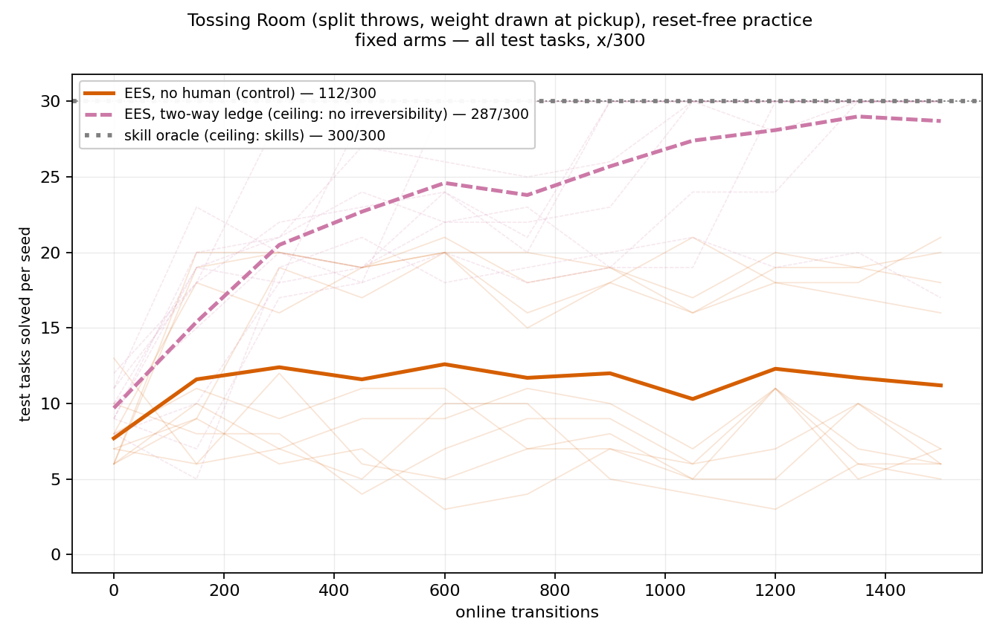
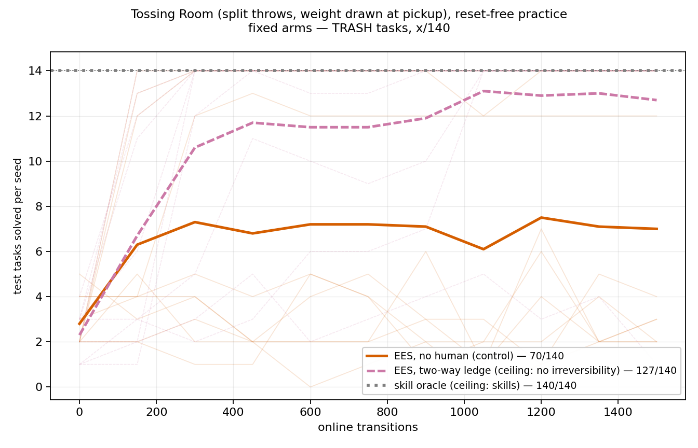
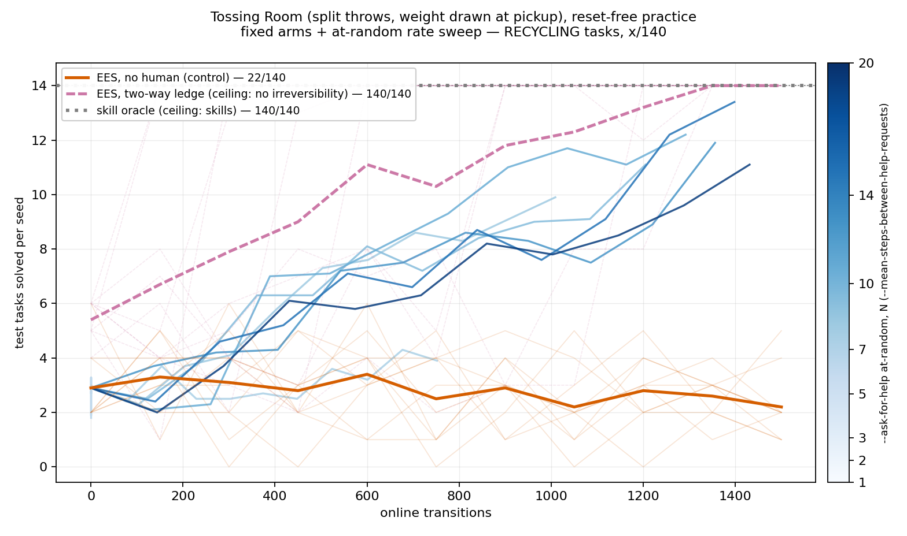
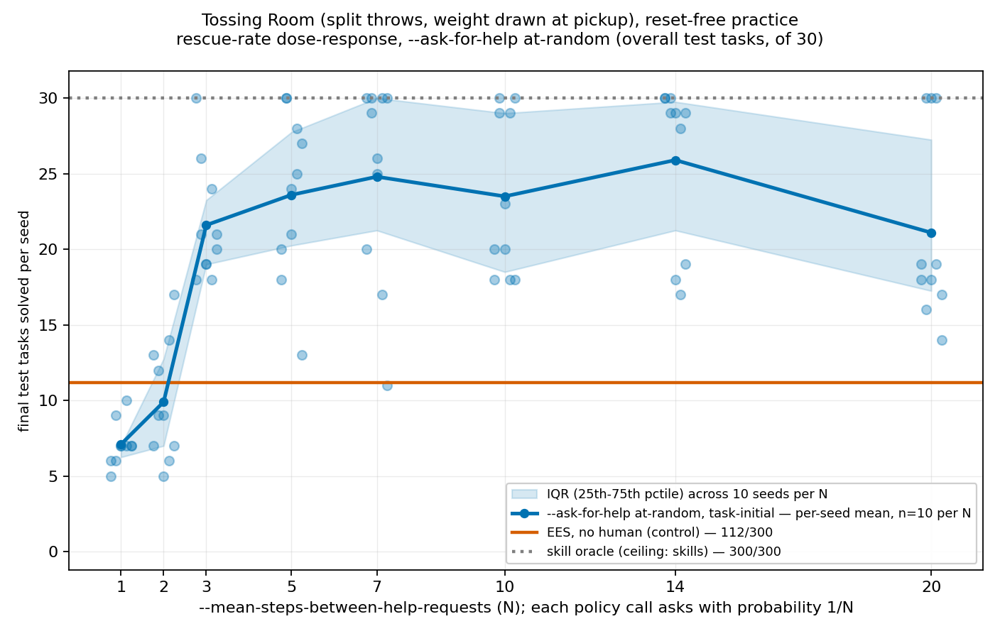
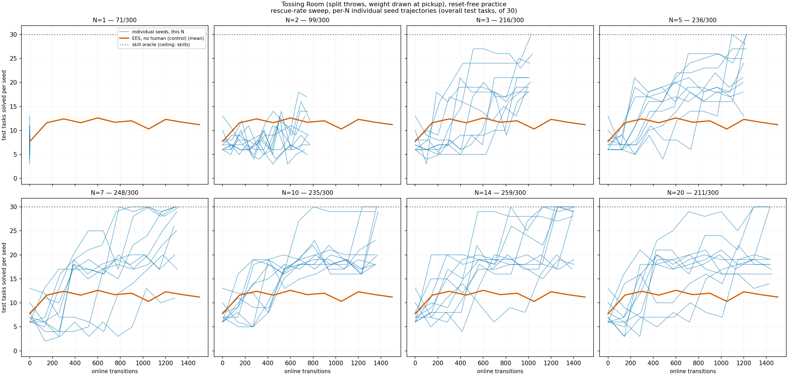

# Rescue-rate dose-response on Tossing Room: asking every call is worse than never asking, N=14 peaks at 259/300

**Three fixed arms plus an eight-point rescue-rate sweep, ten fixed seeds (0-9) each, all
`--env tossingroom --practice-reset-policy never --num-test-tasks 30 --num-cycles 10
--max-steps-per-interaction 150`.**

## Question / goal

Does letting a robot ask a human to reposition it recover reset-free practice on Tossing
Room, and — for the `--ask-for-help at-random` trigger specifically — how does the answer
depend on *how often* it asks? `--mean-steps-between-help-requests` (N) sets the per-call
ask probability to 1/N; this sweeps N from 1 (asks almost every call) to 20 (asks roughly
once every twenty calls) and reads the dose-response off it directly, rather than assuming
the relationship is monotonic.

## Background

`--practice-reset-policy never` is the real-robot condition: a robot practising in a lab is
not teleported to a fresh start every few minutes. On Tossing Room it is also a trap — the
one-way ledge severs rooms 0-2 from the item pile in room 3, so a practice period that steps
left once can never pick anything up again, and under `never` that damage carries into every
later period.

**This supersedes PR #151** ("Rescue on stuck recovers reset-free practice: 227/300 vs
112/300"), which Josh closed without merging: *"we're not pursuing that comparison right
now."* That PR measured an eight-arm ladder including `on-stuck` (novelty-triggered rescue)
and `random-skills`; both are deliberately excluded here, per Josh's explicit scoping call,
along with the `at-random` reset-target axis (`task-initial` vs `random`) and the single
`at-random` point #151 measured at N=150.

**The raw data behind #151's numbers could not be found.** `results/` is gitignored, and
nothing from that run was committed. What was found intact on disk (in other agents'
scratch worktrees) carried `--human-intervention-trigger`, a CLI flag deleted before the
help-seeking interface was reshaped onto `--ask-for-help`/`--human-reset-target` — exactly
the condition #151's own closed-PR precedent would have required flagging as superseded had
it been merged. So every number below is a **fresh measurement against the current
interface**, not a re-plot, verified by exactly reproducing the one number that could be
checked against a known-good source: `no-human` lands at 112/300 pooled here, matching
#151's control to the task.

(A note for anyone following a link from `2026-08-10-help-seeking-naive-trigger.md`: that
already-merged entry references a `2026-08-07-human-ladder.md` file. That file was never
actually merged to `main` — it existed only on the closed #151 branch — so the reference was
already dangling before this PR touched anything. This PR does not restore it: #151's
8-arm/on-stuck content isn't backed by recoverable data and is out of scope for the
comparison Josh asked for here.)

## Hypothesis

Being rescued recovers some of what reset-free practice loses to the one-way ledge, and the
relationship between rescue rate and performance is monotonic — more help is better help, up
to some point where it saturates. This turned out to be wrong in an interesting way (see
Results): performance is **non-monotonic**, with the *most* frequent rescuing (N=1)
underperforming the no-human control.

## Guidance given

Report `x/y`, never a bare percentage. Never assert an effect without a p-value, and use
paired tests when arms share seeds. Plot per-seed spread rather than only a mean. Distinguish
what the experiment showed from what it was hoped to show. Training curves
(OVERALL/TRASH/RECYCLING across checkpoints) for the three fixed arms; the standing
bar-chart-free convention doesn't directly apply to the rate sweep, since it's a
dose-response over a swept parameter rather than a reset-policy comparison, so its own figure
is final performance against N with per-seed spread shown, not a redundant bar chart
alongside it.

**Follow-up guidance, after the first version of this PR shipped only the dose-response
summary**: Josh wanted all eight rate-sweep arms plotted as training curves too, on the same
OVERALL/TRASH/RECYCLING panels the three fixed arms already have — not a separate figure.
Use judgement on keeping eleven lines per panel readable (a sequential colourmap, reduced
line weight/alpha, or a grid split were all offered as options); keep the dose-response
figure too, since training curves and the end-state summary answer different questions and
neither replaces the other.

**Second follow-up guidance**: the dose-response figure needed its spread shown, not just a
bare mean line — a shaded band (std or IQR, reader's call) across the 10 seeds per N. Given
this data is known to be genuinely bimodal at some N (not just noisy-unimodal), a plain
symmetric band risked implying a single-peaked distribution that isn't there; plot 1 didn't
need to fully resolve that, since a second figure — one small multiple per N, all 10 seed
trajectories plus the `no-human` mean curve and `skill-oracle` reference line overlaid — was
asked for specifically to show the real clustering directly rather than have a reader infer
it from a summary statistic. Both figures are additive to what was already in the PR.

## Methods

Four components, driven by `scripts/run_sweep.py` (one invocation per component; the N axis
is a flag-set axis it does not model, so each point is its own invocation):

| component | `--method` | `--ask-for-help` | `--human-reset-target` | world | seeds |
| --- | --- | --- | --- | --- | --- |
| `no-human` | `ees` | `never` | -- | one-way | 10 |
| `two-way-ledge` | `ees` | `never` | -- | two-way | 10 |
| `skill-oracle` | `skill-oracle` | -- | -- | one-way | 10 |
| rate sweep | `ees` | `at-random` | `task-initial` | one-way | 10 per N |

**Rate-sweep grid: N ∈ {1, 2, 3, 5, 7, 10, 14, 20}** — 8 points, deliberately non-uniform
rather than all 20 integers. Denser at low N, where the response was expected to move
fastest (and did — see Results), sparser toward N=20 where it was expected to have mostly
flattened.

CLI defaults reverified against current `main` before running: `--num-cycles`/
`--max-steps-per-interaction` default to 10/150 for `--method ees`; `--num-test-tasks`
defaults to 10 globally (passed explicitly as 30); `--practice-reset-policy` defaults to
`scheduled` (passed explicitly as `never`); `--human-reset-target` already defaults to
`task-initial`. Nothing has moved since #151 was written.

Test-set composition is 14 TRASH / 14 RECYCLING / **2** EMPTY, asserted per sweep — a goal
misfiled between families would move tasks between denominators invisibly.

**Manipulation checks, all passing.** `num_practice_resets` is 0 on all 110 runs. The three
fixed arms recorded exactly 0 interventions each. Every rate-sweep point recorded a strictly
positive intervention count — required by the loader here, unlike #151's `on-stuck`, since
at N <= 20 over 1500 policy calls a true zero would mean the trigger never wired rather than
a legitimate null. Human cost equals the v0 oracle's flat 1.0 per rescue on every run.

`no-human` and every rate-sweep point share `--method ees`, the one-way world and all ten
seeds, so `PairedTests.sign_flip` applies to each N against the control (exact, by
enumerating its null in full). `two-way-ledge` and `skill-oracle` each change a second
variable (the world, the Method) and are reported as ceiling levels only, never sign-flipped.

Read back with `analysis/practice_makes_perfect/human_ladder_curves.py`. Raw per-seed
`stats.json`/`config_snapshot.json`/`timing.json` for all 110 runs are committed under
`2026-08-10-human-ladder-rate-sweep-runs/`, specifically so this experiment cannot be lost
the way #151's was.

## Results

### Fixed arms, and all eight rate-sweep points, as training curves on the same panels

Each panel below carries all eleven arms: the three fixed arms (named legend entries, exact
pooled count) plus all eight rate-sweep points (a sequential `Blues` colourmap from light
N=1 to dark N=20, with a colourbar rather than eight more legend entries — the natural
encoding for one arm per value of an ordered sweep). The rate-sweep curves are thin and
partly transparent with no per-seed traces of their own, drawn first so the three fixed
arms' bold, per-seed-backed curves stay visually on top. Shape over practice is what these
panels are for; exact per-N numbers are the table and the dose-response figure below.

**Reading the merged panel against the dose-response table below**: the lightest
(low-N) rate-sweep curves visibly track close to, and at times below, the orange `no-human`
line on OVERALL — the N=1/N=2 underperformance is visible as shape, not just as the two
numbers in the table. The darker (high-N) curves climb well above the control without
reaching `two-way-ledge`, consistent with the table's best point landing at N=14, short of
either ceiling.

Final checkpoint, pooled over 10 seeds:

| arm | OVERALL | TRASH | RECYCLING | EMPTY |
| --- | --- | --- | --- | --- |
| `no-human` | 112/300 | 70/140 | 22/140 | 20/20 |
| `two-way-ledge` | 287/300 | 127/140 | 140/140 | 20/20 |
| `skill-oracle` | 300/300 | 140/140 | 140/140 | 20/20 |

Per-seed ranges (of 30): `no-human` 5-21, `two-way-ledge` 17-30, `skill-oracle` 30-30 (it
never practises — one evaluation, at 0 online transitions).

### The rate sweep: non-monotonic, and the low end is the headline

The shaded band is the 25th-75th percentile (IQR) across the 10 seeds at each N, not a
symmetric +-1 std band — this data is genuinely bimodal at several N (next section), and a
std band centred on the mean would visually assert a single-peaked distribution that isn't
there, while also having no reason to respect the [0, 30] physical range an IQR naturally
does.

| N | interventions (pooled) | interventions (per-seed) | OVERALL | gap vs no-human | better/worse/tied | p | MDE | extra solves/rescue |
| --- | --- | --- | --- | --- | --- | --- | --- | --- |
| 1 | 15000 | 1500-1500 | 71/300 | -41 | 3/10, 4/10, 3/10 | 0.125 | 6.16 | -0.003 |
| 2 | 7476 | 725-774 | 99/300 | -13 | 4/10, 5/10, 1/10 | 0.668 | 7.87 | -0.002 |
| 3 | 4908 | 464-508 | 216/300 | +104 | 9/10, 1/10, 0/10 | 0.00391 | 4.95 | 0.021 |
| 5 | 2950 | 272-309 | 236/300 | +124 | 9/10, 0/10, 1/10 | 0.00391 | 7.09 | 0.042 |
| 7 | 2080 | 181-225 | 248/300 | +136 | 10/10, 0/10, 0/10 | 0.00195 | 6.23 | 0.065 |
| 10 | 1436 | 126-157 | 235/300 | +123 | 10/10, 0/10, 0/10 | 0.00195 | 6.44 | 0.086 |
| 14 | 1025 | 84-123 | **259/300** | **+147** | 10/10, 0/10, 0/10 | 0.00195 | 5.25 | 0.143 |
| 20 | 693 | 55-85 | 211/300 | +99 | 8/10, 1/10, 1/10 | 0.00781 | 7.04 | 0.143 |

**At N=1, every single one of 1500 policy calls asked for help.** Per-seed intervention
counts are exactly 1500 on all ten seeds — the robot never took one real action during
practice. `PracticeLoop`'s `except HumanHelpRequested` branch `continue`s a granted rescue
rather than letting the robot act, so an N=1 period is not "mostly rescued", it is **entirely
rescued**: zero practice, by construction. That this scores below the no-human control
(71/300 vs 112/300, though not significant at p=0.125, MDE 6.16) is the mechanistic
explanation, not a surprising one in hindsight — a robot that never acts cannot get better at
anything the fixed 30-task evaluation set touches. N=2 (asks roughly every other call) is
milder but the same story: 99/300, still below control, still not significant.

**The response is non-monotonic and peaks at N=14, not at either end.** Score rises sharply
from N=1 to N=3 (71 → 216), continues up through N=7 (248), dips slightly at N=10 (235),
peaks at N=14 (259/300, the best point in the sweep, p=0.00195), then falls at N=20
(211/300). Every point from N=3 onward beats the control significantly (all p <= 0.00781).
The dip at N=10 sits within the noise both neighbors show (per-seed range 18-30, same as
N=3 and N=14) — nothing in this sweep supports treating it as a real local minimum rather
than seed variance at n=10.

### Several N are genuinely bimodal, not noisy-unimodal — the IQR band alone can't show this

Sorted final-checkpoint scores make the split explicit at three N:

| N | sorted final OVERALL (of 30), 10 seeds |
| --- | --- |
| 10 | 18, 18, 18, 20, 20, 23, 29, 29, 30, 30 |
| 14 | 17, 18, 19, 28, 29, 29, 29, 30, 30, 30 |
| 20 | 14, 16, 17, 18, 18, 19, 19, 30, 30, 30 |

**N=14 is the clearest case: 7 seeds land at 28-30 and 3 land at 17-19, with a real 9-point
gap between the clusters and nothing in between.** That is not what a wide-but-unimodal
distribution looks like, and it is exactly what the IQR band above cannot distinguish from
one — N=14's actual band (Q1=21.25, Q3=29.75) sits almost entirely inside the high cluster
and is silent on whether the three low seeds are a separate group or just its lower tail.
Reading the band alone would suggest a single spread-out distribution; the individual
trajectories show two distinct ones. The eight
per-N panels answer that directly: each of the ten seed lines is drawn individually, so the
28-30 cluster and the 17-19 cluster at N=14 are two visibly separate bundles of lines, not
an inference from a summary statistic. N=10 and N=20 show the same two-cluster shape, less
starkly separated. This is consistent with, though not proof of, an underlying discrete
"the rescue schedule did or didn't line up with the ledge" mechanism rather than continuous
per-seed variation in how well the policy learns — that mechanism is not established by
this sweep and would need its own follow-up.

**Cost-effectiveness rises monotonically with N even where absolute score does not.** Extra
solves per rescue goes from negative at N=1-2 to 0.143 at N=14 and N=20 — the same ratio at
both, despite N=20 scoring 48 tasks lower in absolute terms, because N=20 buys that lower
score far more cheaply (693 rescues against N=14's 1025). N=14 is therefore the best point on
*absolute* score; N=20 is arguably the better point if the question is *efficiency*, not
peak performance. This experiment does not adjudicate between those two objectives — it only
makes both readable from the same table.

**Ceilings, for context.** `two-way-ledge` (287/300) and `skill-oracle` (300/300) are drawn
as reference lines on the dose-response figure. The best rate-sweep point (N=14, 259/300)
still leaves +28/300 to the two-way world and +41/300 to the privileged oracle — a
meaningfully smaller remaining gap than `no-human`'s +175/300 and +188/300, but not closed.

## Recommendation

**Do not run `--ask-for-help at-random` at very low N (1-2) expecting more help to help
more — it doesn't, and the mechanism is legible: too-frequent asking crowds out practice
entirely.** If a future experiment wants a "ask constantly" ceiling for a different purpose,
it should be built and labelled as one on purpose, not swept past on the way to somewhere
else.

**N=14 is the recommended default for any experiment that reuses this rate-sweep result** as
a single operating point rather than the full sweep — it is the best absolute score measured
and lands closest to both ceilings. **N=20 is the better choice specifically when human time
is the binding constraint**, since it buys almost the same cost-effectiveness at roughly two
thirds the rescues.

**This is a new measurement, not a re-plot of #151.** Anyone citing a `227/300`-style
`on-stuck` number against anything in this table is citing data this PR could not verify and
does not reproduce; #151 stays closed, and its numbers stay unquoted per its own
superseded-numbers precedent.

**Committing the raw per-seed data (`2026-08-10-human-ladder-rate-sweep-runs/`) is
deliberate, not incidental.** #151's underlying `stats.json` files were never committed and
could not be recovered when this PR needed them three days later. The ~8.6 MB cost of
committing `config_snapshot.json`/`stats.json`/`timing.json` for all 110 runs here (following
the precedent `2026-08-10-help-seeking-naive-trigger-runs/` already set) is cheap insurance
against the same loss happening to this experiment.
