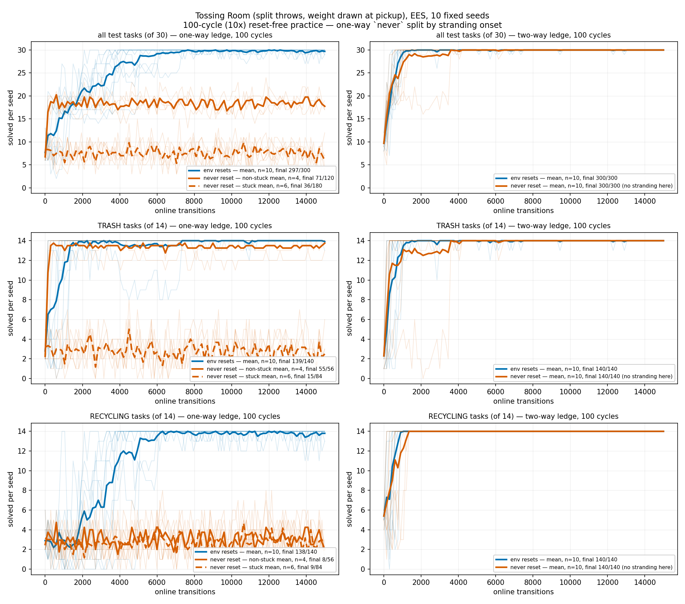

# The one-way reset-free arm's bimodal split, drawn directly

A redraw of the 10x-budget cells of
[`2026-08-07-pickup-weight-cycle-budget.md`](2026-08-07-pickup-weight-cycle-budget.md), no
new runs. It reads the same committed
[`2026-08-07-pickup-weight-cycle-budget-10x-runs/`](2026-08-07-pickup-weight-cycle-budget-10x-runs/)
that log already commits, through
[`analysis/practice_makes_perfect/reset_free_cycle_budget_bimodal.py`](../../analysis/practice_makes_perfect/reset_free_cycle_budget_bimodal.py).

## What changed, and why

The original curves,
[`2026-08-07-pickup-weight-cycle-budget-curves.png`](2026-08-07-pickup-weight-cycle-budget-curves.png),
put all four `(budget x policy)` arms on one panel per family, `1x` and `10x` together,
one bold mean per arm. That log's own later addendum, "Addendum: the one-way `never` cell
is a mixture of two populations," established that the one-way reset-free arm is not one
population: six seeds take their last effective (pile-reaching) practice attempt at
checkpoint 1 and never gain another, while four take theirs later and keep improving for
several more cycles. A single mean over all ten sits in the empty gap between the two
groups' final scores and describes neither.

This figure exists to make that visible directly, rather than only in prose and a
wall-clock scatter:

- **100-cycle (10x) cells only.** The `1x` arms are dropped entirely — this is a redraw of
  the 10x budget specifically, not a repeat of the original four-line-per-panel figure.
- **The one-way `never` arm's bold mean is split into stuck (dashed) and non-stuck (solid)
  subgroup means**, over the same ten faint per-seed traces the original figure already
  drew. The split reproduces the addendum's seed grouping exactly — stuck
  `[2, 3, 4, 5, 8, 9]`, non-stuck `[0, 1, 6, 7]` — from `effective_attempts` via
  `ResetFreeCycleBudgetBimodal.stuck_split`, not by re-typing the addendum's numbers.
- **The two-way `never` arm keeps one line**, since `--two-way-ledge` removes the domain's
  only irreversible action and stranding cannot occur there — but its legend says
  "(no stranding here)" explicitly, so it cannot read as a split that was never checked.
- **Style follows CLAUDE.md's "Training-curve style, fixed project-wide" section**
  (added in #188): blue `#0072B2` / orange `#D55E00` carry policy, linestyle carries the
  within-arm subgroup, the panel title carries the denominator instead of the y-axis
  label, and every legend entry carries both `n=` and the pooled final `x/y`.

Nothing in `2026-08-07-pickup-weight-cycle-budget.md` is edited, recomputed or
superseded — the underlying `183/300` / `112/300` -style figures there are unaffected,
since every comparison that log draws is paired within a seed. This is an additional view
of the same committed data, built to make the mixture the addendum already described
visually obvious rather than only statistically established.

## Figure



Three rows (all test tasks, TRASH, RECYCLING) x two columns (one-way / two-way ledge).
Faint per-seed traces under bold subgroup means throughout. The one-way panels show the
non-stuck mean (solid orange) tracking well above the stuck mean (dashed orange) on every
family; the two panels never converge because they are two different populations, not two
draws from one.

## Regenerate

```bash
python -m analysis.practice_makes_perfect.reset_free_cycle_budget_bimodal \
  --output docs/experiment-logs/2026-08-10-pickup-weight-cycle-budget-10x-bimodal.png
```

(`--runs-root` defaults to this repo's own committed
[`2026-08-07-pickup-weight-cycle-budget-10x-runs/`](2026-08-07-pickup-weight-cycle-budget-10x-runs/).)
