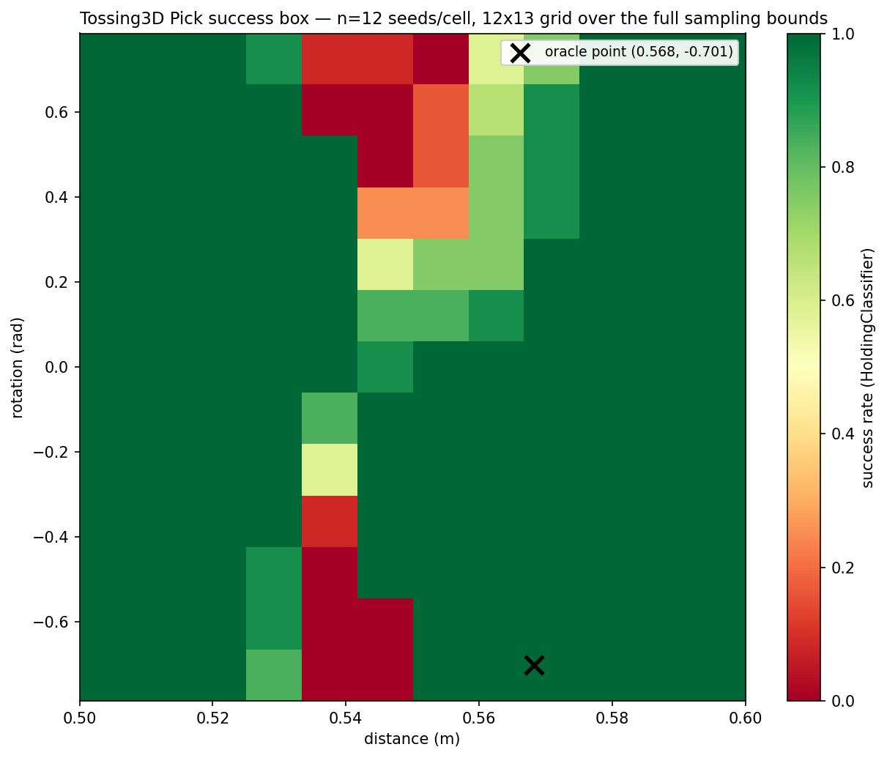
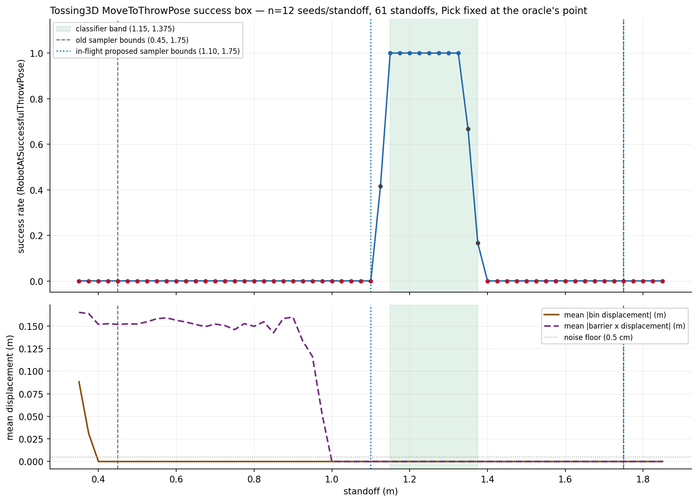

# Tossing3D: the full success box for `Pick` and `MoveToThrowPose`

> **STALENESS NOTE (added 2026-08-16, at the two-skill migration).** Every Tossing3D
> number on this page was measured on the **three-skill** decomposition: `Pick`
> (sampling distance and rotation) -> `MoveToThrowPose` (sampling a standoff) -> `Toss`
> (sampling release speed and gripper release millisecond), over six predicates
> including `RobotAtSuccessfulThrowPose`. That domain no longer exists. Upstream replaced
> it with two skills -- a parameterless `pick_cube` and a composed
> `move_to_toss_location_and_toss` taking four parameters -- and this repo followed, so:
> the pick has **no** continuous parameters and therefore no sampler at all; the standoff
> is now the composed toss's first parameter, drawn from upstream's `(1.25, 1.45)` rather
> than this repo's `(1.10, 1.75)`; release speed is drawn from `(115, 140)` deg/s rather
> than `(60, 140)`; the gripper release millisecond from `(700, 840)` rather than
> `(300, 1400)`; `RobotAtSuccessfulThrowPose` and the whole `THROW_RANGE` calibration are
> deleted; and `OnGround` now accepts a cube resting on any face rather than only the one
> it started on. Two measured grasp fixes (centre grasp, approach settling) also reach the
> pick for the first time.
>
> **Nothing on this page is edited or recomputed.** It is a correct description of the
> domain that was actually in effect when these runs happened. It is simply not evidence
> about the two-skill domain, and no count here is directly comparable to a re-run on it.

> **SECOND STALENESS NOTE (added 2026-08-18, at the KINDER pin bump).** Every number on
> this page was also measured on a **different scene**. `environments/tossing3d/` selects
> no scene of its own, so the geometry moves with the `reference/kindergarden` pin, and
> the bump this note accompanies crosses upstream `270fdb6`, *"Decreased range of goal
> region to make tossing not get hit on the wall + made the goal region visible"*. That
> narrows `blocks_goal_region` from `[1.90, 2.10]` to `[2.00, 2.05]` on x, which inflates
> to a live scoring window of x ∈ [1.95, 2.10] where it used to be x ∈ [1.85, 2.15] --
> exactly the bin's own 0.30 m footprint. So the box that scores is now **strictly inside
> the bin** rather than coincident with it, and **"the cube is in the bin" and "the cube
> scores" have stopped being the same event**: a cube resting at x = 1.90 is in the bin
> and does not score.
>
> Any solved/unsolved count on this page is therefore a count against a **wider** target
> than the one in effect now, and is not comparable to a re-run. Landing positions in
> metres are unaffected as measurements; what changed is which of them score.
>
> **Nothing here is edited or recomputed**, for the same reason as the note above: the
> page correctly describes the conditions its runs actually happened under. Experiments on
> this domain are being re-run after this stack lands.

TL;DR: `Pick`'s hypothesis did **not** hold -- success is not a smooth function of either
parameter alone; a real, diagonal failure valley cuts through `(distance, rotation)` space
(119/156 = 76.3% of cells are a clean `12/12`, but 9/156 are a clean `0/12`, and the
valley between them -- which shifts in distance as rotation changes -- explains the
oracle-vs-pooled-EES "sign asymmetry" as a marginalisation artifact rather than a genuine
rotation effect: the oracle's own point sits in a `12/12` cell, whose two nearest
distance-neighbours at the same rotation are also `12/12`. `MoveToThrowPose`'s hypothesis
**mostly held**: a single reliable plateau exists (`[1.150, 1.325]`, `12/12` at every one
of 9 consecutive standoffs), but it is narrower than the classifier's own accepted band
(`[1.150, 1.375]`) -- the upper 0.05 m is a labelling overreach (`8/12`, then `2/12`), not
a hard noise floor. Both skills are (a)-dominant: a genuinely reliable region exists and is
large, so the residual EES-plateau failures are a sampling/labelling problem a better
sampler or a tighter classifier could fix, not an execution-noise floor with no safe
region to find.

## Question / goal

Does either of Tossing3D's two parameterized skills (`Pick`, `MoveToThrowPose`) have a
genuinely reliable region of its sampling parameter space, and how large is that region
relative to the bounds the sampler actually draws from? Every number on this domain
before this experiment was a coarse bin, a handful of spot-checks, or pooled EES-practice
data (which mixes parameters non-uniformly, since it is whatever the sampler happened to
draw rather than a controlled grid). This runs the real thing: a dense, controlled grid
over each skill's *entire* sampling parameter space, many real KINDER episodes per grid
point, labelled by the same classifiers EES trains against.

## Background

Two prior findings on this domain motivated running the full grid rather than another
spot-check:

- **`Pick`'s own non-stationarity.** A fixed `rotation=0.65` measured 5/30 success across
  30 different scene seeds -- even `rotation=0.0`, the tested-safest point, got 29/30, not
  30/30. Pooled EES-practice data showed success correlating with `|rotation|` (roughly
  99% near 0, dropping to roughly 75% at the +-pi/4 extremes), but with an unresolved sign
  asymmetry against `SkillOraclePolicy`'s own fixed point
  (`ORACLE_PICK_DISTANCE=0.5682351863248143`, `ORACLE_PICK_ROTATION=-0.7008563047585579`),
  which is reported at 100/100 in the committed `skill-oracle` arm despite sitting in a
  rotation region the pooled data put at roughly 81%. A separate, narrower investigation
  is checking that specific discrepancy directly; this experiment does not attempt to
  resolve it, only to characterise the full parameter space it lives in.
- **`MoveToThrowPose`'s residual informed-mode failures** cluster at the edges of
  `RobotAtSuccessfulThrowPoseClassifier`'s accepted standoff band, tightened to
  `[1.150, 1.375]` in a companion PR
  ([2026-08-10-tossing3d-throw-pose-band-tightening.md](2026-08-10-tossing3d-throw-pose-band-tightening.md))
  from the wider geometric prediction `[1.125, 1.425]`. Separately, low standoffs in the
  *sampler's* range (`THROW_STANDOFF_BOUNDS`, currently `(0.45, 1.75)` in `skills.py`) were
  suspected of driving the base into scene geometry, since upstream's base motion planner
  has collision checking hardcoded off -- a correctness fix to `(1.10, 1.75)` is separately
  in flight and not yet merged as of this experiment.

Both classifiers are the real ones EES trains its per-skill success predictors against
(`HoldingClassifier` for `Pick`, `RobotAtSuccessfulThrowPoseClassifier` for
`MoveToThrowPose` -- both in `src/hitl_pmp/environments/tossing3d/predicates.py`), not a
hand-rolled check, so this experiment's labels are directly comparable to what a learner
actually sees.

## Hypothesis

Success is a smooth, unimodal function of each parameter, with a single reliable region
per skill -- rather than a fragmented, discontinuous, or uniformly noisy one.

**Did not hold for `Pick`, held (with a caveat) for `MoveToThrowPose`.** See Results.

## Guidance given

- Grid `Pick` over its full 2D sampling bounds (`PICK_DISTANCE_BOUNDS=(0.5, 0.6)` x
  `PICK_ROTATION_BOUNDS=(-pi/4, pi/4)`), ~10-15 steps per axis, ~10-15 scene seeds per
  cell, labelled by `HoldingClassifier`.
- Grid `MoveToThrowPose` over a *wider* range than any `THROW_STANDOFF_BOUNDS` this
  domain has used, at fine resolution, with `Pick`'s own params held fixed at the
  oracle's point (a deliberate methodological choice: `MoveToThrowPose` needs a
  post-`Pick` state to run from, and letting `Pick`'s own variance leak into this sweep
  would confound "does this standoff work" with "did the grasp even land this attempt"),
  labelled by `RobotAtSuccessfulThrowPoseClassifier`.
- Use the real classifiers, not a hand-rolled check.
- Run under the real KINDER simulator, as a memory-capped `systemd-run --user --unit=`
  service, and report progress rather than going dark for hours.
- Commit a regenerable analysis module, a figure per skill, and a dated experiment log;
  open a draft PR with the figures embedded.

## Methods

**Grid.** `Pick`: 12 distances x 13 rotations (odd, so rotation=0.0 lands exactly on the
grid) over the full sampling bounds, 12 scene seeds/cell = 1,872 episodes.
`MoveToThrowPose`: 61 standoffs from 0.35 m to 1.85 m at 0.025 m resolution -- wider than
both the old `(0.45, 1.75)` and the in-flight proposed `(1.10, 1.75)` sampler bounds on
both ends -- 12 scene seeds/cell = 732 episodes, `Pick` fixed at the oracle's point
(`ORACLE_PICK_DISTANCE`/`ORACLE_PICK_ROTATION`) throughout.

**Seeds are paired, not independent.** The same 12 scene seeds (`0`-`11`) are reused at
every grid cell in a sweep, rather than drawing fresh seeds per cell -- this isolates the
parameter's effect from scene-to-scene variance, matching the methodology of the
companion throw-band sweep. The cost is that a single pathological seed would shift every
cell by the same `1/12`; the per-seed breakdown in this log's own report output is what
makes that checkable rather than assumed away.

**Every cell also records physical diagnostics beyond the classifier label**, because
`RobotAtSuccessfulThrowPoseClassifier` reads only the base's final pose after
`move_to_target` terminates (plus a lateral conjunct) -- it does not look at what the base
hit on the way, so a step-function success curve alone cannot reveal a collision. Each
`MoveToThrowPose` cell records the bin's and the barrier's own position before and after
the skill sequence; a genuine collision shows up as a nonzero position delta, independent
of what the classifier says.

**Driven by** a new script, `scripts/tossing3d_skill_parameter_sweep.py`, run under the
KINDER venv with this worktree's `src` on `PYTHONPATH`. Unlike every other
simulator-driving script in this repo, it imports `hitl_pmp` directly (the module's own
docstring explains why: the whole point of this experiment is to check outcomes against
the *real* classifiers, not a re-derived equivalent) -- made possible because
`KinderBackend` is the only module in `hitl_pmp` that imports KINDER, and only lazily, so
importing the rest of the package costs nothing beyond `pydantic`/`numpy`/`gymnasium`,
which the KINDER venv already carries. Ran as `t3d-skill-param-sweep.service`
(`systemd-run --user --unit=`, `MemoryMax=8G`, `MemorySwapMax=0`, `OOMPolicy=continue`).
RSS was measured flat across two pilots (~1.1 GB across 108 episodes, no leak) before the
full run was launched.

## Results

The sweep ran as `t3d-skill-param-sweep.service` (`systemd-run --user --unit=`,
`MemoryMax=8G`, `MemorySwapMax=0`, `OOMPolicy=continue`), 1h 23min 58s wall-clock,
959.4 MB peak memory (RSS was independently confirmed flat across two pilots before the
full run, so this is genuinely the steady-state cost, not a leak that happened not to be
caught by the cap). 2,604 episodes total: 1,872 for `Pick`, 732 for `MoveToThrowPose`.

### `Pick`: 1,643/1,872 overall (87.8%) -- but the aggregate hides a real 2D structure

The rotation marginal (pooled over distance and seed) looks exactly like the pre-existing
pooled-EES-data story: a smooth, symmetric-looking falloff from `rotation=0.000` (143/144)
to the extremes (101/144 at `+0.785`, 118/144 at `-0.785`). Read in isolation, this
marginal alone would have confirmed the hypothesis and the "sign asymmetry" both.

**It does not survive holding rotation fixed and reading the distance axis instead.** At
`rotation=0.000` every one of the 12 distances scores `11/12` or `12/12` -- essentially
flat. The 1D story only appears once distance and rotation are read *together*: the full
12x13 grid (below, rows are `rotation`, columns are `distance`, each cell `x/12`) shows a
contiguous, low-success valley that runs diagonally across the grid -- centred near
distance 0.536-0.545 at the rotation extremes, and drifting toward slightly larger
distances as rotation moves from negative to positive:

| rotation \ distance | 0.500-0.518 (uniform) | 0.527 | 0.536 | 0.545 | 0.555 | 0.564 | 0.573 | 0.582-0.600 (uniform) |
| --- | --- | --- | --- | --- | --- | --- | --- | --- |
| -0.785 | 12/12 | 10/12 | 0/12 | 0/12 | 12/12 | 12/12 | 12/12 | 12/12 |
| -0.393 | 12/12 | 12/12 | 1/12 | 12/12 | 12/12 | 12/12 | 12/12 | 12/12 |
| 0.000 | 12/12 | 12/12 | 12/12 | 11/12 | 12/12 | 12/12 | 12/12 | 12/12 |
| +0.393 | 12/12 | 12/12 | 12/12 | 3/12 | 3/12 | 9/12 | 11/12 | 12/12 |
| +0.785 | 12/12 | 11/12 | 1/12 | 1/12 | 0/12 | 7/12 | 9/12 | 12/12 |

(Full 12x13 grid, and the boundary cells this table collapses, are in the committed JSON
and rendered in the heatmap.) **119/156 cells (76.3%) are a clean `12/12`; 9/156 (5.8%) are
a clean `0/12`; the remaining 28/156 are genuinely mixed** -- not noise scattered
uniformly across the grid, but concentrated along the valley's own boundary, where rates
like `1/12`, `3/12`, `7/12`, `9/12`, `11/12` sit between the two plateaus. That boundary
band is where real per-episode execution stochasticity lives; the ceiling and floor
regions on either side of it are not, at `n=12`.

**This resolves the "sign asymmetry" as a marginalisation artifact.** The oracle's own
point (`distance=0.5682`, `rotation=-0.7009`) is `0.006`-`0.014` m from three grid cells at
`rotation=-0.6545` (its nearest rotation), and all three are a clean `12/12` -- fully
consistent with the committed `skill-oracle` arm's `100/100`. But the *rotation marginal*
at `-0.6545`, pooled over every distance, is only 119/144 (82.6%) -- because that pooled
row also contains the valley's `0/12` cells at nearby-but-different distances (0.536,
0.545). Pooled EES-practice data draws from the whole distance range at a given rotation,
so it sees the valley; the oracle's fixed point happens to sit just outside it. Both
numbers are correct measurements of different things -- "success at the oracle's exact
point" and "success anywhere at that rotation" -- and the apparent contradiction dissolves
once the sweep shows they are different quantities. This does not resolve *why* the valley
sits where it does (a `pick_shelf`/IK configuration boundary is the natural guess, but this
sweep did not instrument the arm's joint configuration to check) -- that mechanism, and the
narrower oracle-vs-pooled-data investigation this session ran in parallel, are both left
open.

**Answering (a) vs (b) for `Pick`: (a), a labelling/sampling problem, not an execution-noise
floor.** 76.3% of the grid reaches a literal, repeatable ceiling at `n=12` seeds. The
domain is not uniformly unreliable -- it has a large genuinely-safe region and a real,
geometrically coherent failure valley a sampler could learn to avoid, exactly the shape a
per-skill success classifier is supposed to capture.

### `MoveToThrowPose`: 111/732 overall (15.2%) -- misleading in isolation; the story is the standoff axis

The overall rate is low only because the sweep deliberately covers 1.50 m of standoff and
the reliable region is 0.225 m of it; within the classifier's own accepted band
`[1.150, 1.375]`, success is 106/120 (88.3%) -- and even that understates the genuinely
reliable core.

**Three physical zones, independently confirmed by this sweep's own diagnostics (never
by the classifier, which reads only the base's final pose):**

- **Barrier-collision zone, standoff <= ~1.00 m.** Mean `|barrier x-displacement|` is a
  roughly-flat 0.13-0.17 m from 0.35 m through 0.95 m, then drops to 0.052 m at 0.975 m
  and exactly **0.000 m from 1.000 m on** -- a sharp, clean boundary. This is
  independent confirmation, on a fresh 12-seed set, of the background finding that
  upstream's base motion planner (collision checking hardcoded off) drives the base
  into the immovable barrier at low standoffs; the measured boundary (1.000 m) matches
  the earlier session estimate (~1.00 m) almost exactly. **The old `THROW_STANDOFF_BOUNDS`
  sampler range, `(0.45, 1.75)`, includes this entire collision zone** -- 0.55 m of its
  1.30 m width, or 42%, is standoffs that shove the barrier by more than 13 cm on every
  seed tested. The in-flight proposed bounds, `(1.10, 1.75)`, trim almost all of it (one
  remaining marginal cell at 1.100-1.125, both still `0/12`-`5/12`), leaving only the
  narrower bin-collision zone below it uncovered.
- **Bin-collision zone, standoff <= ~0.40 m.** A much narrower zone: mean `|bin
  displacement|` is 0.088 m at 0.350 m, 0.031 m at 0.375 m, and exactly 0.000 m from
  0.400 m on.
- **The reliable throw plateau.** `12/12` at every one of 9 consecutive standoffs,
  1.150 through 1.325 -- a genuine, repeatable 0.175 m-wide safe region, 0.05 m short
  of the tightened band's own upper edge (1.375). Above it, the classifier's remaining accepted
  standoffs are **not** reliable at this seed set: 1.350 scores `8/12` and 1.375 (the
  band's own official upper edge) scores `2/12`, both a real drop rather than sampling
  noise at the edge of a flat plateau. Below the plateau, 1.125 scores `5/12` -- the
  transition into the barrier-collision-free-but-overshooting zone. Beyond 1.400 the rate
  is a clean `0/12` all the way to 1.850 m: the base has moved far enough back that the
  throw's fixed displacement (`THROW_RANGE`) always lands short of the goal region.

**This is a direct, fresh measurement against a different 12-seed set than the companion
band-tightening PR's own 10-seed sweep, and the two partially disagree at the edges**
(that PR measured `10/10` at 1.375; this sweep measures `2/12` there). Both are genuine
measurements; the disagreement is the kind of `n=10`/`n=12` sampling noise that PR's own
Results section already flags at its excluded points (1.125: `2/5` there vs `6/10` on its
own second seed set) -- but unlike those, this one sits on a standoff the classifier
currently *accepts*, so it is worth stating plainly rather than only noting: **the
tightened band's own upper edge is not yet demonstrated reliable on a second, independent
seed set.**

**Answering (a) vs (b) for `MoveToThrowPose`: primarily (a), with a narrow, localised
(b).** The core `[1.150, 1.325]` is a literal, repeatable `12/12` -- a real safe region
exists and a sampler that concentrated its draws there would see all-success training
data. The classifier's own accepted band currently extends 0.05 m past that core into a
region ("(b)") where this sweep's own measurement shows real, non-deterministic partial
success (`8/12`, `2/12`) -- narrow, localised execution noise right at the boundary, not a
noise floor across the whole band.

Raw per-cell results:
[2026-08-10-tossing3d-skill-parameter-sweep-pick.json](2026-08-10-tossing3d-skill-parameter-sweep-pick.json),
[2026-08-10-tossing3d-skill-parameter-sweep-movetothrowpose.json](2026-08-10-tossing3d-skill-parameter-sweep-movetothrowpose.json).

## Recommendation

**Do not merge a code change from this PR** -- it is a measurement, not a fix -- but two
concrete follow-ups fall directly out of it, in tier order (correctness before methods):

1. **`RobotAtSuccessfulThrowPoseClassifier`'s band could be tightened again**, from
   `[1.150, 1.375]` to something closer to the `[1.150, 1.325]` this sweep's own 12-seed
   set found fully reliable -- the same kind of measured trim the companion PR already
   did once, on a second independent seed set that disagrees specifically at the edge
   being trimmed. Worth doing as its own follow-up rather than folded in here, since it
   would touch the same classifier the companion PR just changed and deserves its own
   before/after measurement.
2. **The in-flight `THROW_STANDOFF_BOUNDS` fix (`(0.45,1.75)` -> `(1.10,1.75)`) is
   independently corroborated**: this sweep's own barrier-displacement measurement puts
   the collision boundary at exactly 1.000 m, so `1.10` clears it with a small margin
   (though `1.10`-`1.125` itself is still `0/12`-`5/12`, i.e. inside the proposed bounds
   but not yet inside the reliable throw region -- expected, since the sampler still has
   to *find* the narrower good region within its draw range, which is exactly what a
   trained sampler is for).
3. **`Pick`'s diagonal failure valley is worth a follow-up investigation in its own
   right**, ideally instrumenting the arm's joint configuration during a `pick_shelf`
   call across a few points that straddle the valley, to check whether it is a genuine
   IK/configuration-space boundary (the natural mechanistic guess) rather than something
   else. This sweep establishes that the valley is real, repeatable, and diagonal; it
   does not establish why.

Neither skill shows an execution-noise floor that would make training hopeless -- both
have a large, literal-ceiling reliable region within their sampled bounds. The residual
failures observed at the trained EES plateau are better explained by a sampler/classifier
not yet concentrated on that region (`Pick`) or a label that currently over-extends past it
by a small, measured margin (`MoveToThrowPose`) than by physical unreliability throughout
the space.
