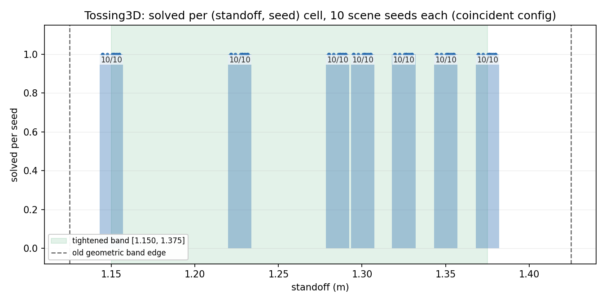

# Tossing3D: re-checking whether `RobotAtSuccessfulThrowPose`'s band needs further tightening

> **STALE as of 2026-08-17 — every number below was measured under a decomposition the
> code no longer has.** Nothing here has been edited, restated or recomputed; this note
> sits beside the original so both what was reported and why it is now provisional stay
> visible.
>
> `environments/tossing3d/` now imports KINDER's own lifted controllers and state
> abstractions (`kinder-baselines` PR #113). Three changes invalidate the conditions
> these runs were taken under:
>
> 1. **Three skills became two.** `Pick -> MoveToThrowPose(standoff) -> Toss(speed, ms)`
>    is now `pick_cube -> move_to_toss_location_and_toss(standoff, rotation, speed, ms)`.
>    The base move and the throw execute together, so **the standoff and the two toss
>    dials can no longer be varied as separate axes** — one `sample_parameters` call draws
>    all four jointly. Any grid, sweep or surface over those axes describes a control
>    interface that no longer exists.
> 2. **The sampling bounds changed, and the old ones were wrong.** hitl declared
>    `TOSS_RELEASE_MS_BOUNDS = (300, 1400)` beside a controller whose own measured band is
>    `(700, 840)` — a window about nine times too wide, most of whose draws could not
>    score. Draws now come from the controller's own sampler.
> 3. **The scored region moved.** `blocks_goal_region` was tightened to x ∈ [2.00, 2.05],
>    which inflates to a live scoring window of x ∈ [1.95, 2.10]. Runs below were measured
>    against the earlier, wider region.
>
> `RobotAtSuccessfulThrowPose`, `THROW_RANGE`, `THROW_STANDOFF_BOUNDS` and
> `ORACLE_THROW_STANDOFF` no longer exist: no predicate names the pose between a move and
> a throw, so there is no band left to calibrate. **This is obsolete work, not pending
> work — the throw band does not need re-deriving.**

> **Directly superseded.** This entry's whole subject is the calibration of
> `RobotAtSuccessfulThrowPose`'s accepted band. That predicate and every constant behind it
> are deleted, and the driver scripts that produced these numbers
> (`scripts/tossing3d_skill_parameter_sweep.py`, `scripts/tossing3d_toss_parameter_grid.py`,
> `scripts/tossing3d_release_angle_probe.py`, `scripts/tossing3d_release_speed_clips.py`,
> `scripts/tossing3d_oracle_demo.py`, `analysis/tossing3d_throw_band_sweep.py`) are deleted
> with them. The measurements remain a true record of what the three-skill decomposition
> did; they are not evidence about anything the code does now, and they are **not
> reproducible** — nothing left in the tree can re-run them.

## Question / goal

PR #196's own Recommendation #1 proposed tightening `RobotAtSuccessfulThrowPoseClassifier`'s
accepted standoff band again, from `[1.150, 1.375]` (landed in PR #193) to something closer
to `[1.150, 1.325]` -- the plateau its classifier-labelled grid found fully reliable. This
re-measures that specific proposal directly, using PR #193's own methodology (a real,
physics-driven oracle sweep), before touching the classifier.

## Background

Two measurements are now on record for the same nominal standoff, and they disagree:

- **PR #193's confirming sweep** (10 scene seeds, oracle-driven `Pick -> MoveToThrowPose ->
  Toss`, real KINDER physics, success read from `env._check_goals()` after the throw
  actually executes): **10/10 at standoff 1.375.**
- **PR #196's `MoveToThrowPose` grid** (12 scene seeds, `Pick` fixed at the oracle's exact
  params, standoff swept alone): **2/12 at standoff 1.375**, and **8/12 at standoff 1.350**
  -- both read from `RobotAtSuccessfulThrowPoseClassifier.holds()` on the state immediately
  after `MoveToThrowPose` terminates. **`Toss` is never called in that sweep** -- the module
  docstring is explicit that the label is the classifier's own prediction, not the episode's
  real outcome.

That is not a restatement of the same measurement with different noise. It is two different
quantities: PR #193 measured whether the cube's real, physically-thrown landing spot ends up
inside the goal region; PR #196 measured whether the base's post-`move_to_target` pose
satisfies a fixed linear geometric threshold, without a throw ever happening. The classifier
exists to *predict* the former from the latter, and the two can disagree.

**Checking the specific mechanism, rather than asserting "the classifier is stricter."** PR
#196's own committed `MoveToThrowPose` grid JSON records each cell's achieved `robot_base_x`.
Reconstructing `landing_x = robot_base_x + THROW_RANGE` and comparing it against the
classifier's own threshold (`goal_region.x_min + THROW_SHORTFALL_MARGIN = 1.85 + 0.05 =
1.90`) reproduces PR #196's exact solved counts cell-for-cell:

| standoff | seeds with `landing_x >= 1.90` | seeds with `landing_x < 1.90` | matches PR #196's count |
| --- | --- | --- | --- |
| 1.350 | 8 (`landing_x` 1.9159-1.9254) | 4 (`landing_x` 1.8970-1.8978) | 8/12 |
| 1.375 | 2 (`landing_x` 1.9005, 1.9006) | 10 (`landing_x` 1.8720-1.8999) | 2/12 |

At standoff 1.375 the closest miss is `landing_x = 1.8999` -- **0.1 mm** short of the
classifier's own 1.90 m threshold -- while the closest hit is `1.9005`, 0.5 mm past it. The
spread of achieved `landing_x` across the 12 seeds at that one commanded standoff is 2.86 cm
(1.8720 to 1.9006), comparable to `move_to_target`'s own stated stopping tolerance
(`WAYPOINT_TOL = 0.04` m, `predicates.py`'s `THROW_POSE_LATERAL_TOLERANCE` derivation). **The
classifier's own accepted edge sits inside the noise floor of how precisely `move_to_target`
reaches a commanded standoff at all**, at this particular commanded value -- so a few
millimetres of ordinary seed-to-seed pose noise, not a real difference in throw reliability,
is enough to flip the label. This is a real, reproducible, deterministic-given-`robot_base_x`
threshold effect, not an assertion.

That still leaves the actual question open: does the *real throw* also become unreliable
there, once `Toss` executes? PR #193 already measured 10/10 at 1.375 on a different 10-seed
set; this experiment re-measures it (plus the untested-until-now 1.350, `ORACLE_THROW_STANDOFF`
itself) on a fresh set of scene seeds, with the same oracle-driven, physics-executing
methodology PR #193 used.

## Hypothesis

`RobotAtSuccessfulThrowPoseClassifier`'s currently-accepted band, `[1.150, 1.375]`, is
over-permissive at its upper edge -- as PR #196's classifier-labelled grid suggests -- so a
fresh, physics-driven sweep (not just the classifier's own label) would find degraded real
solve rates at 1.350 and 1.375, supporting a tightened band closer to `[1.150, 1.325]`.

**Did not hold.** See Results.

## Guidance given

Reconcile the #193-vs-#196 disagreement by reading both measurements' actual methodology
before changing anything; if the discrepancy points to a specific flaw or a genuine
difference in what was measured, say so explicitly rather than picking a number. Then run a
fresh confirming sweep using PR #193's own methodology (real physics, oracle-driven, no EES)
before deciding on a band, tighten the classifier's live derivation (not
`THROW_STANDOFF_BOUNDS`, the sampler's separate exploration range) if warranted, TDD, update
every consumer of the old numbers, gate, and open a draft PR.

## Methods

Same script, same config, same seed convention as PR #193:
`scripts/tossing3d_oracle_demo.py --task-config coincident-bin-goal --seeds --results-json`,
oracle-style `Pick -> MoveToThrowPose(standoff) -> Toss`, success read from the real
`env._check_goals()` after the throw executes -- not the classifier. Ten fixed scene seeds
(`0`-`9`), the same convention PR #193 used (a different draw than PR #196's twelve).

**Standoffs, and why:**

- **`1.150`** -- the band's unchanged lower edge, re-confirmed as a baseline.
- **`1.325`** -- PR #196's proposed new upper edge.
- **Three random interior draws** inside a candidate `[1.150, 1.325]` band, from
  `np.random.default_rng(42).uniform(1.150, 1.325, size=3)`, fixed and never hand-picked:
  `1.2268`, `1.2854`, `1.3003`.
- **`1.350`** -- inside the *current* band, outside the *proposed* one, and PR #196's most
  informative point: it is also `ORACLE_THROW_STANDOFF`, the exact standoff the committed
  `skill-oracle` arm throws from on every episode. This point was never tested by PR #193's
  own sweep, only by PR #196's classifier-only grid (8/12).
- **`1.375`** -- the current band's own upper edge, the exact point of disagreement between
  PR #193 (10/10) and PR #196 (2/12).

Run as `t3d-throw-band-retighten.service` (`systemd-run --user --unit=`, `MemoryMax=6G`,
`MemorySwapMax=0`, `OOMPolicy=continue`): 70 `(standoff, seed)` cells, 3 min 55 s wall-clock,
934.5 MB peak memory.

## Results

| standoff | in current band `[1.150, 1.375]` | in proposed band `[1.150, 1.325]` | solved (this sweep) |
| --- | --- | --- | --- |
| 1.150 | yes | yes | **10/10** |
| 1.2268 (random interior) | yes | yes | 10/10 |
| 1.2854 (random interior) | yes | yes | 10/10 |
| 1.3003 (random interior) | yes | yes | 10/10 |
| **1.325 (proposed new edge)** | yes | **yes** | **10/10** |
| **1.350 (= `ORACLE_THROW_STANDOFF`)** | yes | no | **10/10** |
| **1.375 (current edge)** | **yes** | no | **10/10** |

**70/70 overall -- every standoff tested, across the whole current band, solved on every
seed.** This directly reproduces PR #193's own 10/10 at 1.375 on an independent seed set, and
extends the same clean result to 1.350 and 1.325, which neither PR #193 nor PR #196 had
tested with real physics before.

**The hypothesis did not hold.** There is no measured degradation anywhere inside the current
band once `Toss` actually executes. PR #196's narrower-looking plateau is explained by the
mechanism in Background: its label is the classifier's prediction on the achieved base pose,
and at 1.350 and 1.375 that pose lands close enough to the classifier's own threshold that a
few centimetres of ordinary `move_to_target` seed-to-seed noise flips the label -- without the
real throw's outcome moving at all.

**A real, separate finding falls out of this, worth flagging rather than fixing here:** at the
current band's own upper edge, the classifier's *label* and the throw's *outcome* can
disagree (2/12 vs 10/10 at 1.375). EES trains `MoveToThrowPose`'s success sampler on the
label, not on `_check_goals()`, so a standoff the sampler draws near that edge could be
labelled a failure when the throw would actually have scored. That is a legitimate follow-up
(e.g. whether the classifier's margins should be widened *at the label level* to buy back
noise headroom, independent of whether the band's outer limit is correct) but it is not what
this experiment was scoped to decide, and doing it without its own targeted before/after
measurement would repeat the mistake this experiment exists to avoid.

**Tightening to `[1.150, 1.325]` would also have broken a live invariant.**
`ORACLE_THROW_STANDOFF = 1.35` is the committed `skill-oracle` arm's fixed throw standoff,
asserted inside the current band by
`tests/environments/tossing3d/test_predicates.py::test_the_oracle_standoff_is_inside_the_accepted_band`.
A band ending at 1.325 would reject the oracle's own pose as a `MoveToThrowPose` failure even
though this sweep's own 10/10 at exactly that standoff shows the throw itself would have
scored -- an over-restrictive operator model, the same defect class PR #193's own lateral
conjunct was written to catch (`test_the_predicate_rejects_a_diagonal_approach_at_the_right_distance`'s
docstring). Nothing in either PR #196 or this experiment's guidance authorised moving
`ORACLE_THROW_STANDOFF` itself, so this is an independent reason not to land the proposed
tightening, not only the measurement above.

Raw per-cell results: [2026-08-10-tossing3d-throw-band-retightening-sweep.json](2026-08-10-tossing3d-throw-band-retightening-sweep.json).

## Recommendation

**No change to `THROW_OVERSHOOT_MARGIN`/`THROW_SHORTFALL_MARGIN`.** The current band,
`[1.150, 1.375]`, is re-confirmed reliable end-to-end, including at both points PR #196's
classifier-only grid flagged as weak. PR #196's Recommendation #1 (tighten toward
`[1.150, 1.325]`) is superseded by this measurement and should not be acted on as written --
that PR is still open, and its own log's plateau claim and Recommendation #1 are now
provisional; flagging for Josh to decide whether to annotate it, rather than editing another
open PR here.

**Follow-up worth scoping separately:** whether `RobotAtSuccessfulThrowPoseClassifier`'s
margins should be widened *slightly* specifically to reduce label noise right at the current
edge (near-zero buffer against `move_to_target`'s own achieved-pose variance at 1.375, per
Background), independent of whether the band's outer limit is where physics actually stops
solving. That needs its own before/after measurement against real EES training data, not
this experiment's oracle-only sweep.
