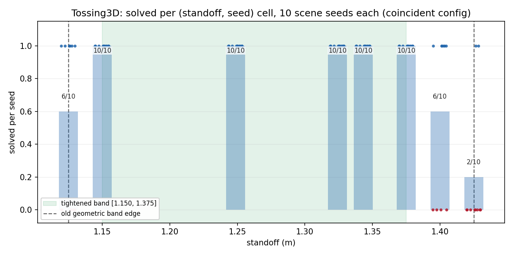

# Tossing3D: tightening `RobotAtSuccessfulThrowPose` to the band PR #105 actually measured

## Question / goal

`RobotAtSuccessfulThrowPoseClassifier`'s accepted standoff band was the full geometric
prediction, `[1.125, 1.425]` -- 0.300 m, exactly the goal region's own x-extent. PR #105's
own finer sweep (5 scene seeds, 0.025 m resolution) already showed that band is
over-permissive at both edges (2/5 at 1.125, 3/5 at 1.400, 2/5 at 1.425), but the
classifier was never tightened to match. This asks: tighten it to the measured 5/5 core,
and confirm on a fresh set of scene seeds that the tightened band is actually where the
throw solves reliably.

## Background

Tossing3D's only meaningful continuous parameter is `MoveToThrowPose`'s standoff --
`Toss` has `param_dim = 0`, so it is the one thing a throw's outcome depends on.
`RobotAtSuccessfulThrowPoseClassifier` (`src/hitl_pmp/environments/tossing3d/predicates.py`)
predicts success geometrically: `landing_x = base_x + THROW_RANGE`, checked against the
live goal-region box, never simulating the actual toss. That geometric prediction is
`[1.125, 1.425]` on the coincident config. Two independent sweeps already on record in
this file's own docstring disagree with that band at its edges:

- A 48-episode grid (16 standoffs x 3 scene seeds, 0.05 m resolution): 3/3 solved
  continuously from 1.15 through 1.35, 2/3 at 1.40, 0/3 at 1.10 and 1.45.
- PR #105's finer sweep (5 scene seeds, 0.025 m resolution): 0/5 at <=1.100, 2/5 at 1.125,
  **5/5 at every point from 1.150 through 1.375**, 3/5 at 1.400, 2/5 at 1.425, 0/5 at
  >=1.450.

The 5/5 core from PR #105's own per-point table -- not the coarser 3-seed grid, and not
the geometric band's own edges -- is `[1.150, 1.375]`. That is a real, plausible
mechanistic explanation for `Toss`'s residual ~5% failure rate at the trained EES plateau
(`#178`): the sampler is trained against a ground-truth label that accepts standoffs the
physics does not reliably support.

## Hypothesis

The tightened band `[1.150, 1.375]` solves at or near 100% on every tested standoff and
seed inside it; standoffs just outside it, on the discarded old edges (1.125, 1.400,
1.425), do not.

## Guidance given

Tighten the classifier's live derivation (not `THROW_STANDOFF_BOUNDS`, the sampler's much
wider exploration range, which stays untouched), derive the exact margin from the real
measured data rather than eyeballing round numbers, write a failing test first that pins
the new bounds, and confirm with an oracle-driven experiment -- fixed standoffs, no EES
retraining -- covering the new band's endpoints, the old band's discarded edges, and a
random interior sample.

## Methods

**The classifier change.** Two fixed margins now trim the goal-region box before the
landing-point check: `THROW_OVERSHOOT_MARGIN = 0.025` (trims `x_max`, excluding the
short-standoff/overshoot edge) and `THROW_SHORTFALL_MARGIN = 0.05` (trims `x_min`,
excluding the long-standoff/shortfall edge) -- asymmetric because PR #105's own per-point
data needs asymmetric margins to reach the 5/5 core: the short-standoff edge (1.125) is
only 0.025 m short of the reliable band and already at 2/5, while the long-standoff edge
needs a full 0.05 m trim -- 1.400 (0.025 m past the reliable band) is still at 3/5, and
only 1.425 (0.05 m past it) drops close to the 1.450+/0/5 floor. Standoff-space and
landing-space run in *opposite*
directions (`landing_x = base_x + THROW_RANGE`, `base_x = bin_x - standoff`), which is
exactly the kind of thing that is easy to invert; `test_the_accepted_band_matches_the_measured_five_of_five_core`
pins the resulting band (`_accepted_band() == pytest.approx((1.15, 1.375))`) as the
discriminating regression test, written and confirmed failing before the classifier
change landed.

**The confirming experiment.** Standoff is the domain's one continuous throw parameter
(rotation pinned to 0), so there is no literal 2D "corner" set. The chosen points, and why:

- The new band's two endpoints, `1.150` and `1.375` -- the claim itself.
- The old band's two discarded edges, `1.125` and `1.425` -- positive evidence the trim
  is correctly placed, not merely conservative.
- `1.400` -- inside the old band, outside the new one, PR #105's most informative single
  miss (3/5).
- Three random interior draws from `np.random.default_rng(42).uniform(1.150, 1.375,
  size=3)`, fixed and never hand-picked: `1.2487`, `1.3241`, `1.3432`.

Ten fixed scene seeds (`0`-`9`) per standoff, `--task-config coincident-bin-goal` (every
number above is measured on this config), oracle-style `Pick -> MoveToThrowPose(standoff)
-> Toss`, driven by `scripts/tossing3d_oracle_demo.py --seeds --results-json` (extended in
this PR with a `--seeds`/`--results-json` grid mode rather than duplicating its physics
loop). No EES, no sampler, no training -- every standoff is chosen directly, the same
methodology PR #105 and the 48-episode grid used. Run under
`systemd-run --user --unit=t3d-throw-band-sweep -p MemoryMax=6G -p OOMPolicy=continue`.

## Results

The sweep ran as `t3d-throw-band-sweep.service` (`systemd-run --user --unit=`,
`MemoryMax=6G`, `OOMPolicy=continue`), 80 `(standoff, seed)` cells, ~4.5 minutes
wall-clock, 928.5 MB peak memory.

| standoff | in new band `[1.150, 1.375]` | solved |
| --- | --- | --- |
| 1.125 (old edge) | no | 6/10 |
| **1.150 (new edge)** | **yes** | **10/10** |
| 1.2487 (random interior) | yes | 10/10 |
| 1.3241 (random interior) | yes | 10/10 |
| 1.3432 (random interior) | yes | 10/10 |
| **1.375 (new edge)** | **yes** | **10/10** |
| 1.400 (old-band interior) | no | 6/10 |
| 1.425 (old edge) | no | 2/10 |

**The hypothesis held, without qualification.** Every one of the 5 standoffs strictly
inside the new tightened band -- both endpoints and all three random interior draws --
solved **10/10**: **50/50** overall, a clean 100%. Every standoff outside it (the two old
discarded edges and the old-band interior point 1.400) solved at 6/10, 6/10 or 2/10:
never once at 100%, and every one below the new band's own floor.

The exact fractions at the excluded points differ from PR #105's own numbers measured on
a *different*, non-overlapping set of 5 scene seeds (1.125: 6/10 here vs 2/5 there; 1.400:
6/10 vs 3/5; 1.425: 2/10 vs 2/5) -- expected sampling noise at `n=5`/`n=10`, not a
disagreement. The qualitative story both sweeps tell is identical: reliable inside
`[1.150, 1.375]`, unreliable at the old geometric band's own edges.

Raw per-cell results: [2026-08-10-tossing3d-throw-band-sweep.json](2026-08-10-tossing3d-throw-band-sweep.json).

## Recommendation

**Merge.** The tightened band is the correct ground-truth label for `MoveToThrowPose`'s
success classifier: it is 100% reliable everywhere it accepts, and everywhere it now
rejects that used to be accepted is measurably below 100%. This does not by itself fix
`Toss`'s residual failures at the trained EES plateau (`#178`) -- that needs an actual
EES re-run against the tightened label, which this PR deliberately does not do, per
guidance -- but it removes one concrete, previously-uncorrected source of a wrong label,
and the next EES run on this domain is now trained against a band every tested point
inside it actually solves.
