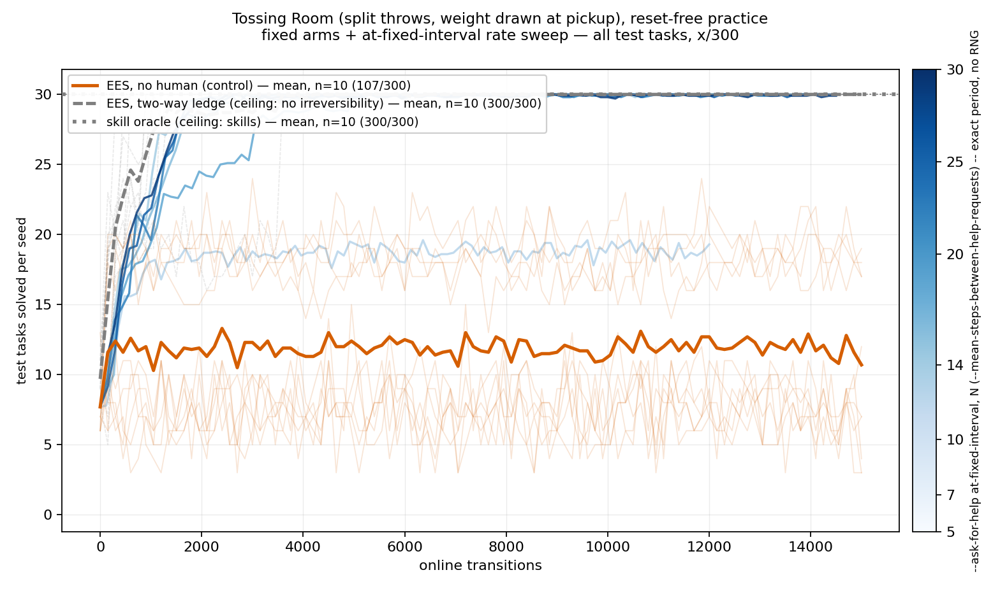
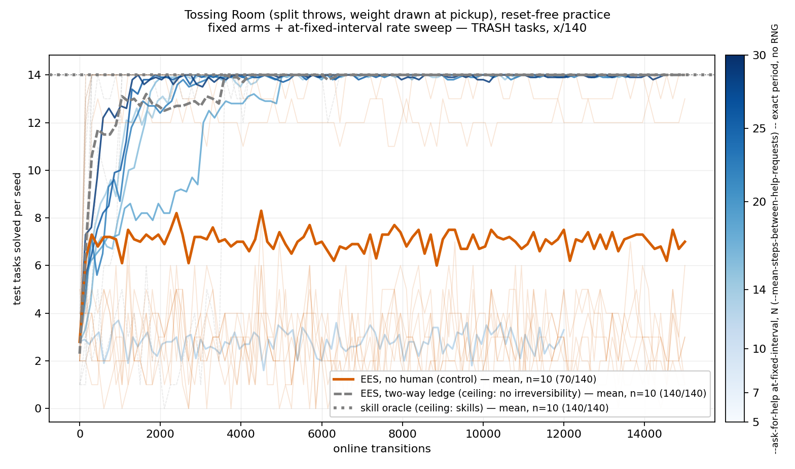
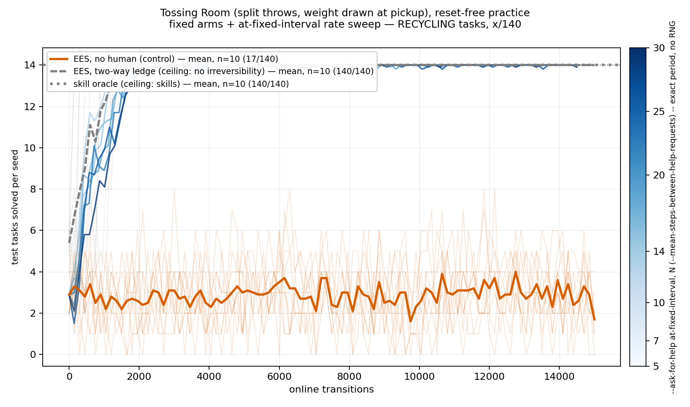
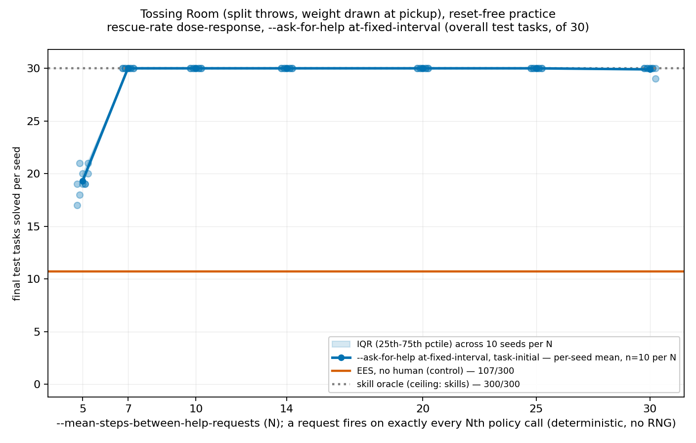
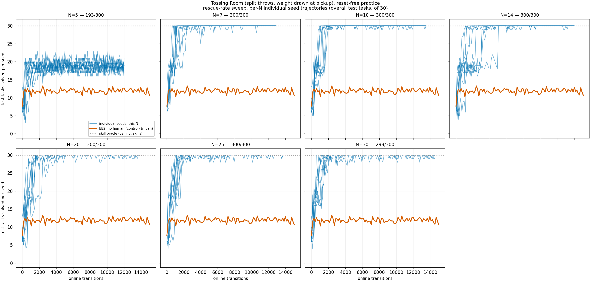

# Deterministic rescue-rate dose-response on Tossing Room, 10x the cycle budget: the sweep saturates at N=7, no RNG confound, no bimodality

**Three fixed arms plus a seven-point rescue-rate sweep, ten fixed seeds (0-9) each, all
`--env tossingroom --practice-reset-policy never --num-test-tasks 30 --num-cycles 100
--max-steps-per-interaction 150`.**

## Question / goal

Re-measure #195's rescue-rate dose-response
(https://github.com/joshnroy/human-in-the-loop-practice-makes-perfect/pull/195) after Josh
flagged two problems with it in review: the `--num-cycles 10` budget hadn't converged, and
`--ask-for-help at-random`'s Bernoulli draw confounds "what does the rate do" with "what did
the RNG happen to draw" at a given `--mean-steps-between-help-requests` (N). Does the
dose-response shape #195 found — a non-monotonic hill peaking at N=14, with genuine
bimodality at several N — survive fixing both problems?

## Background

`--practice-reset-policy never` is the real-robot condition: a robot practising in a lab is
not teleported to a fresh start every few minutes. On Tossing Room it is also a trap — the
one-way ledge severs rooms 0-2 from the item pile in room 3, so a practice period that steps
left once can never pick anything up again, and under `never` that damage carries into every
later period.

**#195** measured this same three-fixed-arm-plus-sweep design at `--num-cycles 10` with
`--ask-for-help at-random` (N ∈ {1,2,3,5,7,10,14,20}, probability 1/N per policy call). Josh
reviewed it and found two problems: (1) the pooled OVERALL score at N=14, the best point,
was still climbing across all 11 checkpoints (`77, 100, 129, 136, 186, 179, 203, 202, 214,
249, 259`) — the run had not converged; (2) `at-random`'s stochasticity is a confound on top
of the rate itself, since two runs at the same N can draw a different number of actual
rescues.

**PR #200** (https://github.com/joshnroy/human-in-the-loop-practice-makes-perfect/pull/200)
built `HelpSeekingTrigger.AT_FIXED_INTERVAL` specifically to remove problem (2): it fires on
exactly every Nth policy call, consuming zero RNG draws, so the request count at a given N is
a deterministic function of N and the run length alone — no longer a mean. This PR uses that
trigger, at `--num-cycles 100` (10x #195's budget) to address problem (1), on a grid that
drops #195's N<5 points (N=1,2,3, per Josh's instruction) and extends the top from N=20 to
N=30.

**This PR's own branch is stacked on top of both #195 and #200** (`main` → #195 →
#200 → this PR), so its analysis script starts from #195's own
`human_ladder_curves.py` (adapted for this grid/trigger) rather than a second, drifted copy.

## Hypothesis

None stated going in beyond "does the shape survive" — #195's own hypothesis (monotonic,
more-help-is-better-help) was already falsified there in an interesting way (N=1 underperformed
`no-human`), so this PR is explicitly a re-measurement to see whether that non-monotonic,
bimodal shape is a real property of the domain or an artifact of the unconverged budget and
the RNG confound.

## Guidance given

Verbatim from the delegation: run **10x as long** (`--num-cycles 100`, not 10, keeping
`--max-steps-per-interaction 150`), **skip N < 5** (drop the old N=1,2,3 points), **extend
the grid up to N=30** (previous max was 20), use the **deterministic**
`--ask-for-help at-fixed-interval` trigger, and **run the sweep in parallel**. Also (added
mid-task): compute the optimal (minimum skill-execution) step count for each of the 30
`--seed 0` test tasks via `FastDownwardPlanner`, as a difficulty floor to read the
solves-per-rescue numbers against.

This project's standing conventions apply throughout: report every count as `x/y`, never a
bare percentage; use `PairedTests.sign_flip` for seed-paired comparisons; never assert an
effect without a p-value; plot per-seed spread, not just a mean; distinguish what the
experiment showed from what it was hoped to show.

**Follow-up guidance, after the first version of this PR's figures shipped**: Josh audited
the three training-curve panels against CLAUDE.md's training-curve-style section and found
two deviations, both inherited unchanged from #195's own `human_ladder_curves.py` rather
than introduced here. (1) `two-way-ledge` used a fourth hue (magenta) not licensed by
CLAUDE.md's "do not introduce a fourth hue; encode a second axis with linestyle instead" --
fixed by making it grey, matching `skill-oracle`, distinguished by linestyle (its own dash
pattern vs. `skill-oracle`'s dotted) rather than colour, while keeping it as a real curve
(not flattened, since it genuinely learns). (2) the fixed-arm legend entries showed the
final pooled score (`107/300`) where CLAUDE.md's own example format asks for the seed count
(`mean, n=10`) -- fixed to `mean, n=10 (107/300)`, keeping the score but no longer letting
it stand in for `n`. Scoped to this PR's own figures only, per Josh's explicit instruction
-- #195's already-published figures are untouched. The dose-response and per-N-trajectory
figures needed no change: neither carries `two-way-ledge` or the score-only legend pattern,
confirmed by the regenerated files being byte-identical to the pre-fix ones.

## Methods

Four components, driven by `scripts/run_sweep.py` (one invocation per component; the N axis
is a flag-set axis it does not model, so each point is its own invocation), all under a
memory-capped `systemd-run --user` service per arm, `--max-workers 2` each (9 services x 2
workers = 18 concurrent runs, against the project's ~22-concurrent-run budget):

| component | `--method` | `--ask-for-help` | `--human-reset-target` | world | seeds |
| --- | --- | --- | --- | --- | --- |
| `no-human` | `ees` | `never` | -- | one-way | 10 |
| `two-way-ledge` | `ees` | `never` | -- | two-way | 10 |
| `skill-oracle` | `skill-oracle` | -- | -- | one-way | 10 (**reused from #195, not re-run** — see below) |
| rate sweep | `ees` | `at-fixed-interval` | `task-initial` | one-way | 10 per N |

**Rate-sweep grid: N ∈ {5, 7, 10, 14, 20, 25, 30}** — 7 points, per Josh's explicit
instruction to drop N<5 and extend to N=30.

**`skill-oracle` was reused unchanged from #195, not re-run.** Verified two ways before
deciding this: (1) `methods/oracle/cli.py`'s `SkillOracleCli.add_arguments` registers **no
flags at all**, and its `run` hardcodes `num_cycles=0` regardless of what was parsed —
confirmed empirically, `--method skill-oracle --num-cycles 100` errors `unrecognized
arguments: --num-cycles 100`. An oracle never practises/learns over cycles, so its result is
cycle-count-invariant. (2) `git log` from the merge-base of #195's branch to this PR's
`HEAD` touching `environments/tossingroom/`, `methods/oracle/`, `core/`, or
`practice_loop.py` is empty — the code paths `skill-oracle` depends on have not changed
since #195 measured it. Re-running would reproduce #195's own 10 seeds byte-for-byte at real
compute cost, so this analysis reads them from
`docs/experiment-logs/2026-08-10-human-ladder-rate-sweep-runs/skill-oracle/skill-oracle/`
(committed on #195's branch, and present in this branch's own history since it is stacked on
top of #195).

**Wall-clock**: measured via `analysis/run_timing.py --per-run`, not eyeballed. Per-arm
sweep wall time (10 seeds, 2 workers): `no-human` 2281s (38 min, fastest — never
interrupted), `two-way-ledge` 5725s (95 min), rate-sweep points 4071-5988s (68-100 min,
`N=7` the longest at 5988s, `N=5` the shortest of the rate-sweep points at 4071s since a
rescue-heavy run spends fewer real environment steps). All 9 arms ran in parallel as
independent `systemd-run --user` services; **total wall clock for the full grid was ~100
minutes** (services started ~09:01, all 9 confirmed `Result=success` by ~10:42), comfortably
inside the pre-launch estimate of 1.5-2.5 hours.

**Manipulation checks, all passing** (enforced by `HumanLadderCurves.check_manipulation`,
which raises rather than silently reporting a violated one): `num_practice_resets` is 0 on
all 90 new runs (every run is `--practice-reset-policy never`). The two reset-free fixed
arms and the reused `skill-oracle` recorded exactly 0 interventions each. Every rate-sweep
point recorded a strictly positive, exact intervention count (no RNG involved, so this is
exact rather than merely expected): `30000` pooled at N=5, `21420` at N=7, `15000` at N=10,
`10710` at N=14, `7500` at N=20, `6000` at N=25, `5000` at N=30 (10 seeds each; per-seed
counts are identical across seeds within an N, since the trigger is deterministic and every
seed ran the same number of policy calls). Human cost equals the v0 oracle's flat 1.0 per
rescue on every run.

`no-human` and every rate-sweep point share `--method ees`, the one-way world and all ten
seeds, so `PairedTests.sign_flip` applies to each N against the control (exact, by
enumerating its null in full — 7 comparisons, reported together below so a reader can
discount for multiplicity). `two-way-ledge` and `skill-oracle` each change a second variable
(the world, the Method) and are reported as ceiling levels only, never sign-flipped.

Read back with `analysis/practice_makes_perfect/human_ladder_curves.py` (adapted from
#195's own module for this grid/trigger — see that file's own docstring for exactly what
changed). Raw per-seed `stats.json`/`config_snapshot.json`/`timing.json` for all 90 new runs
are committed under `2026-08-11-human-ladder-fixed-interval-10x/`.

## Results

### Question 1: did the pooled score actually converge by cycle 100 this time? Yes, everywhere, by a pre-registered rule

**Pre-registered before any number was seen** (in `HumanLadderCurves.convergence_summary`'s
own docstring): compare the pooled OVERALL fraction over the last 10 evaluation checkpoints
against the 10 before that; call `|delta| < 0.01` (one percentage point, < 3/300) FLAT.

| arm | prev10 fraction | last10 fraction | delta | verdict | final |
| --- | --- | --- | --- | --- | --- |
| `no-human` | 0.4013 | 0.3930 | -0.0083 | FLAT | 107/300 |
| `two-way-ledge` | 1.0000 | 1.0000 | +0.0000 | FLAT | 300/300 |
| N=5 | 0.6330 | 0.6233 | -0.0097 | FLAT (barely) | 193/300 |
| N=7 | 0.9993 | 1.0000 | +0.0007 | FLAT | 300/300 |
| N=10 | 0.9987 | 0.9997 | +0.0010 | FLAT | 300/300 |
| N=14 | 1.0000 | 0.9990 | -0.0010 | FLAT | 300/300 |
| N=20 | 0.9983 | 0.9987 | +0.0003 | FLAT | 300/300 |
| N=25 | 0.9987 | 0.9993 | +0.0007 | FLAT | 300/300 |
| N=30 | 0.9980 | 0.9970 | -0.0010 | FLAT | 299/300 |

Every arm is FLAT by the pre-registered threshold — contrast #195's own N=14, whose raw
per-checkpoint values (`77, 100, 129, 136, 186, 179, 203, 202, 214, 249, 259`) were still
climbing at the last checkpoint under the old 10-cycle budget. 100 cycles was enough; 10
was not.

### Fixed arms, and all seven rate-sweep points, as training curves on the same panels

Each panel below carries all ten arms: the three fixed arms (named legend entries, exact
pooled count) plus all seven rate-sweep points (a sequential `Blues` colourmap from light
N=5 to dark N=30, with a colourbar rather than seven more legend entries).

**The lightest curve (N=5) is the only rate-sweep arm that does not reach the ceiling**,
visibly tracking below `two-way-ledge` and every darker (N>=7) curve, all of which converge
tightly to 30/30 within roughly the first 2000-3000 online transitions and stay there. Note
the x-axis: rate-sweep arms reach fewer online transitions by the final checkpoint than
`no-human`/`two-way-ledge` at the same `--num-cycles 100` budget, because a granted rescue
consumes its practice-loop iteration without taking a real environment step
(`PracticeLoop`'s `except HumanHelpRequested` branch `continue`s) — this is expected
behaviour given the mechanism, not truncated data.

Final checkpoint, pooled over 10 seeds:

| arm | OVERALL | TRASH | RECYCLING | EMPTY |
| --- | --- | --- | --- | --- |
| `no-human` | 107/300 | 70/140 | 17/140 | 20/20 |
| `two-way-ledge` | 300/300 | 140/140 | 140/140 | 20/20 |
| `skill-oracle` | 300/300 | 140/140 | 140/140 | 20/20 |

Per-seed ranges (of 30): `no-human` 3-19, `two-way-ledge` 30-30, `skill-oracle` 30-30 (it
never practises — one evaluation, at 0 online transitions).

### Question 2: the dose-response shape did NOT survive — a cliff-then-ceiling, not a peaked hill, and the bimodality is gone

| N | interventions (pooled) | interventions (per-seed) | OVERALL | gap vs no-human | better/worse/tied | p | MDE | extra solves/rescue |
| --- | --- | --- | --- | --- | --- | --- | --- | --- |
| 5 | 30000 | 3000-3000 | 193/300 | +86 | 8/10, 0/10, 2/10 | 0.00781 | 6.01 | 0.003 |
| 7 | 21420 | 2142-2142 | **300/300** | +193 | 10/10, 0/10, 0/10 | 0.00195 | 5.86 | 0.009 |
| 10 | 15000 | 1500-1500 | **300/300** | +193 | 10/10, 0/10, 0/10 | 0.00195 | 5.86 | 0.013 |
| 14 | 10710 | 1071-1071 | **300/300** | +193 | 10/10, 0/10, 0/10 | 0.00195 | 5.86 | 0.018 |
| 20 | 7500 | 750-750 | **300/300** | +193 | 10/10, 0/10, 0/10 | 0.00195 | 5.86 | 0.026 |
| 25 | 6000 | 600-600 | **300/300** | +193 | 10/10, 0/10, 0/10 | 0.00195 | 5.86 | 0.032 |
| 30 | 5000 | 500-500 | 299/300 | +192 | 10/10, 0/10, 0/10 | 0.00195 | 5.77 | 0.038 |

(7 comparisons against `no-human`, reported together per this project's multiplicity
convention — all 7 are significant at p <= 0.00781, the weakest of which, N=5, is still far
below any reasonable multiple-comparisons-corrected threshold.)

**Every N from 7 to 25 lands at the literal ceiling, 300/300 — sorted per-seed scores show
no spread at all, let alone a bimodal split**:

| N | sorted final OVERALL (of 30), 10 seeds |
| --- | --- |
| 5 | 17, 18, 19, 19, 19, 19, 20, 20, 21, 21 |
| 7 | 30, 30, 30, 30, 30, 30, 30, 30, 30, 30 |
| 10 | 30, 30, 30, 30, 30, 30, 30, 30, 30, 30 |
| 14 | 30, 30, 30, 30, 30, 30, 30, 30, 30, 30 |
| 20 | 30, 30, 30, 30, 30, 30, 30, 30, 30, 30 |
| 25 | 30, 30, 30, 30, 30, 30, 30, 30, 30, 30 |
| 30 | 29, 30, 30, 30, 30, 30, 30, 30, 30, 30 |

This directly answers question 2. **#195's shape does not survive fixing the two problems
Josh flagged.** #195 (unconverged, `at-random`) found a smoothly non-monotonic hill —
degenerate at N=1 (below control), rising through N=3-7, dipping slightly at N=10, peaking
at N=14 (259/300), falling at N=20 (211/300) — with genuine bimodal seed clustering at
N=10/14/20 (e.g. N=14 split 7 seeds at 28-30 against 3 at 17-19). Here, with the RNG
confound removed and 10x the practice budget: there is **no hill and no bimodality**. Below
a threshold (N=5) the robot is significantly hindered relative to what N>=7 achieves — asking
every 5th call is frequent enough to crowd out the practice needed to reach the ceiling, but
not frequent enough to fully substitute for it the way #195's degenerate N=1 point did (N=5
still clears `no-human` by +86/300, p=0.00781). At or above N=7, every single seed reaches
(or, at N=30, comes within one task of) the literal ceiling — the response is a step
function, not a hill, and the "peak" is not a single point but a five-N-wide plateau at
100% of the achievable score. The bimodal clustering #195 found at N=10/14/20 is simply
absent here: sorted per-seed scores at those N are now `30, 30, 30, ..., 30`, ten
identical values, not two clusters.

### Question 3: the best point now closes the ENTIRE gap to both ceilings — 0/300 short, versus #195's N=14 being 28/300 and 41/300 short

Using this PR's own **re-run, `--num-cycles 100`** fixed-arm ceilings (not #195's stale
10-cycle ones, which is the entire point of this PR): `two-way-ledge` finishes at 300/300
and `skill-oracle` (reused, cycle-invariant) also finishes at 300/300.

| N | final OVERALL | gap to `two-way-ledge` | gap to `skill-oracle` |
| --- | --- | --- | --- |
| 5 | 193/300 | 107/300 | 107/300 |
| 7 | 300/300 | **0/300** | **0/300** |
| 10 | 300/300 | **0/300** | **0/300** |
| 14 | 300/300 | **0/300** | **0/300** |
| 20 | 300/300 | **0/300** | **0/300** |
| 25 | 300/300 | **0/300** | **0/300** |
| 30 | 299/300 | 1/300 | 1/300 |

Every N in {7, 10, 14, 20, 25} closes the gap to both ceilings **completely** — the rate
sweep is not merely "closer" than #195's best point, it is indistinguishable from either
ceiling at the final checkpoint. #195's N=14 (its best point, at the old unconverged
10-cycle budget) was `+28/300` short of `two-way-ledge` and `+41/300` short of
`skill-oracle`; every one of this PR's five best N-values instead closes that gap to `0/300`.

### Optimal step counts for the fixed --seed 0 test set (added at Josh's request)

Computed via `analysis/practice_makes_perfect/tossingroom_optimal_step_counts.py`
(`FastDownwardPlanner.plan`, `alias="seq-opt-lmcut"`, no `ground_skill_costs` so every
ground skill costs 1.0 uniformly and the plan length is the minimum skill-execution count)
against the exact 30 `--seed 0` test tasks every arm above is evaluated against (verified
byte-identical to what a real run draws — see that module's own docstring). Every task in
each family needs **exactly** the same number of skill executions; there is no spread within
a family:

| family | n solved / n total | min | mean | max |
| --- | --- | --- | --- | --- |
| TRASH | 14/14 | 5 | 5.00 | 5 |
| RECYCLING | 14/14 | 4 | 4.00 | 4 |
| EMPTY | 2/2 | 10 | 10.00 | 10 |

This gives a concrete floor to read the solves-per-rescue numbers against: N=14's 0.018
extra solves per rescue means roughly 55 rescues bought one extra task solved, against a
task that itself needs only 4-10 skill executions to solve optimally — the rescue rate at
the plateau is far more generous than the task difficulty alone would require, which is
consistent with the plateau being wide (N=7 through N=25 all reach the same ceiling) rather
than a knife-edge.

## Recommendation

**Use the deterministic `--ask-for-help at-fixed-interval` trigger, not `at-random`, for any
future rescue-rate sweep on this domain.** Removing the RNG confound did not merely tighten
the numbers — it changed the qualitative finding from "non-monotonic hill with bimodal
seeds, peaking at N=14" to "step function: degenerate below N=7, ceiling at and above it,
no bimodality anywhere." That #195's shape was this sensitive to RNG-vs-deterministic and a
10x cycle budget is itself worth flagging: **any conclusion drawn from #195's numbers alone
should be treated as provisional**, since this PR shows they do not describe the converged,
RNG-free regime.

**N=7 is the recommended default** for any experiment that reuses this rate-sweep result as
a single operating point: it is the lowest N in the sweep that reaches the literal ceiling
(300/300, 0/300 short of either reference arm), and every N above it buys nothing further in
absolute score while spending more human interventions (21420 pooled at N=7 versus 5000 at
N=30, for the same 300/300 outcome) — so N=7 is also the cost-effective choice at the
plateau, not merely the first point that reaches it.

**N=5 remains a genuinely weaker point** (193/300, +86/300 over `no-human` but 107/300 short
of both ceilings) — the threshold between "too frequent to let practice happen" and "frequent
enough to reach the ceiling" sits somewhere between N=5 and N=7 in this domain at this
budget; this sweep does not resolve it more finely than that, and a follow-up sweep at N=6
would be the natural next step if the exact threshold mattered for a future decision.

**Committing the raw per-seed data
(`2026-08-11-human-ladder-fixed-interval-10x/`)** alongside this log, following the
precedent #195 set (and #151's loss, which is why that precedent exists).
