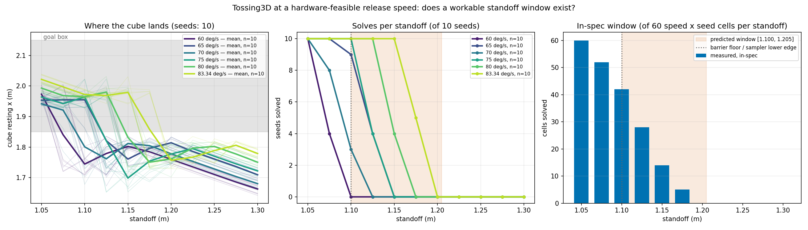

# In-spec speed x standoff gate: a workable window reproduces, displaced downward

**2026-08-12.** Does Tossing3D stay solvable when the throw is held to the arm's own
declared joint limits, and if so from where?

This is the gate the design doc
("Hardware-feasible throw: can an in-spec release speed still solve Tossing3D?", section 8
rung 3) makes conditional for everything above it: *"if the in-spec grid does not reproduce
a workable window, stop and re-scope rather than proceeding to rung 4."*

**Verdict: a window reproduces, but it is not the predicted one.** Measured
`[1.050, 1.175]` against a predicted `[1.100, 1.205]`. Inside the band the sampler may
actually draw from (`>= 1.100`) the usable width is **0.075 m, not 0.105 m**, and the
predicted window's top third is empty — standoff 1.200 is `0/60`.

## The constraint being enforced

The toss is a straight line in joint space from `TOSS_WINDUP_ARM_CONF` to
`TOSS_RELEASE_ARM_CONF`, so every joint moves `|toss_dir_j|` of one path rate and the
admissible rate is `min_j(limit_j / |toss_dir_j|)` — exactly what
`_compute_per_joint_profile` computes for `MoveArmToConfController`, and exactly what
`TossController` bypasses in favour of three inline literals.

Derived from `_ARM_MAX_VEL` / `_ARM_MAX_ACCEL`, never hardcoded:

| quantity | derived | upstream literal | over by |
| --- | --- | --- | --- |
| max path rate | **83.3441 deg/s** | `max_vel = 140` | 1.680x |
| max path accel | **178.5945 deg/s^2** | `max_accel = 300` | 1.680x |

Joint 6 binds: it carries 0.8399 of the toss direction against the arm's smallest velocity
limit. Upstream's `accel/vel` ratio is `2.142857`, which is **exactly** the derived
ceiling's ratio — so upstream's profile is the in-spec profile scaled by 1.68, and nothing
about its shape is wrong, only its magnitude.

The grid ran the new `in-spec` mode: `max_vel` clamped to the derived ceiling, and
`max_decel = max_accel = 178.5945` adopting `_compute_per_joint_profile`'s convention.

## Method

11 standoffs x 6 in-spec speeds x 10 fixed seeds = **660 cells, 0 errored**. `Pick` pinned
at the oracle grasp so grasp variance cannot be read as a speed effect; seeds shared across
every (standoff, speed) cell, so comparisons are paired on scene. Both KINDER submodules
verified at their pins (`3524010` / `4113237`) and clean in the tree that actually ran.

## Results

Seeds solved, out of 10 per cell:

| standoff | 60 | 65 | 70 | 75 | 80 | 83.34 | any |
| --- | --- | --- | --- | --- | --- | --- | --- |
| 1.050 | 10/10 | 10/10 | 10/10 | 10/10 | 10/10 | 10/10 | **60/60** |
| 1.075 | 4/10 | 10/10 | 8/10 | 10/10 | 10/10 | 10/10 | 52/60 |
| 1.100 | 0/10 | 9/10 | 3/10 | 10/10 | 10/10 | 10/10 | 42/60 |
| 1.125 | 0/10 | 4/10 | 0/10 | 4/10 | 10/10 | 10/10 | **28/60** |
| 1.150 | 0/10 | 0/10 | 0/10 | 0/10 | 4/10 | 10/10 | 14/60 |
| 1.175 | 0/10 | 0/10 | 0/10 | 0/10 | 0/10 | 5/10 | 5/60 |
| 1.200 | 0/10 | 0/10 | 0/10 | 0/10 | 0/10 | 0/10 | **0/60** |
| 1.225 – 1.300 | 0/10 | 0/10 | 0/10 | 0/10 | 0/10 | 0/10 | 0/60 |

The two best standoffs, 1.050 (`60/60`) and 1.075 (`52/60`), sit **below**
`THROW_STANDOFF_BOUNDS`'s lower edge of 1.100. The design doc's proposed learnability
target also moves: it suggested standoff 1.150 as the missable-but-reachable point; the
measured equivalent is **1.125 at `28/60`**, with 1.150 at `14/60`.

### The dial is non-monotone, and it is significant

Range does not rise with commanded speed. Paired on (standoff, seed), n = 110:

| step | mean range | paired t | p | Wilcoxon p |
| --- | --- | --- | --- | --- |
| 60 -> 65 | 0.9606 -> 1.0122 | -5.61 | 1.6e-07 | 1.1e-06 |
| **65 -> 70** | **1.0122 -> 0.9794 (-0.0329 m)** | **+4.51** | **1.6e-05** | **1.1e-06** |
| 70 -> 75 | 0.9794 -> 1.0037 | -2.65 | 9.3e-03 | 8.5e-03 |
| 75 -> 80 | 1.0037 -> 1.0422 | -4.82 | 4.6e-06 | 2.6e-07 |
| 80 -> 83.34 | 1.0422 -> 1.0711 | -3.70 | 3.4e-04 | 3.2e-04 |

The 65 -> 70 reversal is real, not seed noise. The cause is the release trigger: it fires
on the first control step past `fraction_covered >= 0.46`, once per `_CONTROL_DT = 0.1 s`,
so the *realised* release fraction sawtooths across the window (0.4616, 0.4918, 0.4771,
0.5015, 0.4734, 0.4887). A higher realised fraction means a larger Jacobian gain at
release, which fights the higher commanded speed. The achieved release speed is
non-monotone for the same reason: 75 deg/s commanded achieves 79.9, while 80 commanded
achieves 72.4.

### Clips

Each is captioned in-frame with its parameters, and **every one reproduces the grid cell it
illustrates to 0.000000 m, `7/7`**. Seed 1 carries all but the last, so what changes between
clips is the parameter and not the scene.

- [clean solve — standoff 1.050 @ 83.34 deg/s, cube rests at 2.0122](2026-08-12-tossing3d-inspec-gate-083deg-standoff1.050-seed1.mp4)
- **the non-monotone pair, and the reason this matters:**
  [65 deg/s at standoff 1.100 — lands in the bin at 1.9709](2026-08-12-tossing3d-inspec-gate-065deg-standoff1.100-seed1.mp4)
  versus
  [70 deg/s at the same standoff and seed — a *faster* command landing 0.24 m *shorter*, at 1.7300](2026-08-12-tossing3d-inspec-gate-070deg-standoff1.100-seed1.mp4).
  The captions carry both realised release fractions (0.491 versus 0.477), which is the
  whole explanation.
- [short-throw miss — 60 deg/s at standoff 1.150, rests at 1.7967](2026-08-12-tossing3d-inspec-gate-060deg-standoff1.150-seed1.mp4)
- [clean miss — standoff 1.200 @ 83.34 deg/s, the fastest in-spec throw still 0.08 m short at 1.7744](2026-08-12-tossing3d-inspec-gate-083deg-standoff1.200-seed1.mp4)
- the boundary, where the seed decides — standoff 1.175 @ 83.34 deg/s is `5/10`:
  [seed 1 misses at 1.7374](2026-08-12-tossing3d-inspec-gate-083deg-standoff1.175-seed1.mp4)
  and
  [seed 2 solves at 1.9818](2026-08-12-tossing3d-inspec-gate-083deg-standoff1.175-seed2.mp4).

### Three corrections to earlier claims from this task

Stated here rather than buried, because each reverses something previously reported:

1. **`_CONTROL_DT` is live, not latent.** It was previously reported as a latent bug —
   numerically `0.1 s` agrees with the env's default `control_frequency = 10 Hz`, and no
   committed measurement is corrupted. But under the in-spec profile the swing is only
   24-32 control steps, and that quantisation is precisely what makes the dial
   non-monotone. It does not corrupt existing numbers; it does threaten learnability.
2. **`g = 0.6108` is right after all.** An intermediate recommendation of ~0.622 came from
   evaluating the Jacobian gain at the *nominal* 0.46 fraction and correcting for
   overshoot. Measured at the *achieved* release configurations across all 660 cells,
   `g` averages **0.610** (range 0.60408-0.61989, spread 3.09%), because PD tracking lag
   pulls the achieved configuration back toward the nominal one. `0.6108` with a
   documented +/-1.3% bias is empirically justified.
3. **The base undershoot roughly holds.** It is 0.0175 m at standoff 1.050, falling
   smoothly to 0.0133 m at 1.300, against 0.0129 m previously measured at 1.35 — a drift
   of 0.004 m across the window, not the shrinkage an earlier single-cell reading of
   0.0026 m suggested. That single-cell figure was wrong and should be disregarded.

### Two things this does not settle

- **Barrier displacement below standoff 1.100.** `move_error` is `0/60` at every standoff
  including 1.050 and 1.075, with PR #103's base-motion collision checking live — so base
  planning *succeeds* there. But the probe records no barrier pose, so this cannot show the
  barrier stayed put. Lowering `WORST_BARRIER_COLLISION_STANDOFF` needs a separate
  measurement.
- **Elevation drift — the design doc's section 4 inference is refuted.** That section
  expected an in-spec window to drift "substantially less" than the 7.44 deg measured over
  60-220 deg/s, and marked the claim unverified. Measured over 60-83.34 deg/s the swing is
  **7.212 deg** — essentially unchanged, despite the window being about 7x narrower. What
  does survive is determinism: per-speed seed sd is 0.13-0.63 deg, so the drift is a
  repeatable function of the parameter rather than noise.

## What it means

The gate passes, so rung 4 is not blocked on feasibility. But it passes into a narrower and
lower window than the arithmetic predicted, and the non-monotonicity is a new finding that
the doc did not anticipate and that bears directly on whether a sampler can learn this
parameter.
