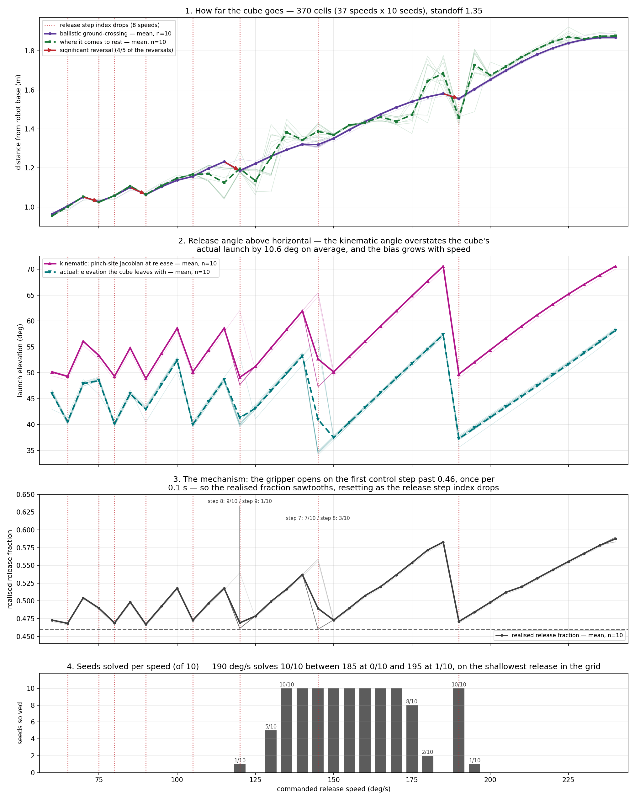

# Tossing3D: how far the cube goes, and the angle it is released at, across 60–240 deg/s

**2026-08-12.** Two views of one throw, plotted on one shared commanded-speed axis, because
they are one causal chain: **the release quantisation sawtooths the release angle, and the
release angle is what puts the reversals in the distance curve.**

Two grids, both committed beside this entry, both at `ORACLE_THROW_STANDOFF = 1.35`, both
370 cells — 37 speeds (60–240 deg/s, 5 deg/s steps) x the same 10 fixed seeds, 0 errored.
Seeds are shared across every speed, so comparisons across speeds are **paired on scene**.

| grid | file | what it measures |
| --- | --- | --- |
| distance | `2026-08-12-tossing3d-distance-grid.json` | where the cube lands and where it stops |
| release angle | `2026-08-12-tossing3d-release-angle.json` | the angle it is launched at, and the quantisation behind it |

> **Provenance, and why the data lives here.** The distance grid was measured in PR #226
> ("Measure Tossing3D's impact range across 60–240 deg/s"), which was **closed unmerged**
> along with the other experiment PRs, so nothing it committed reaches `main`. The grid
> itself is sound and is carried forward here byte-identical rather than re-measured; this
> entry is now its only record, so the findings that its write-up carried are summarised
> below rather than cited. The release-angle grid is new and was measured for this entry.

> **The two grids agree cell for cell.** They were run independently, months of tooling
> apart, on the same seeds. Their `solved` verdicts match on **`370/370` cells** — `0/370`
> mismatches, `107/370` solved in both. That is a stronger cross-check than either run gives
> alone, and it is why they are plotted against each other without hedging.

Reading down a vertical line is the point. Each red dotted line is a speed at which the
release step index drops by one; a drop puts a notch in panel 2, which puts a reversal in
panel 1, which moves panel 4.

## How the distance grid measures distance, and why not "first contact"

Carried forward from PR #226, because the choice is not obvious and the entry that argued
for it is going away.

The obvious instrument — step the physics and record the first substep the cube touches
something — does not measure what it appears to. On the coincident config the bin sits **on**
the goal region, and the bin is a catcher: 0.15 m half-extent walls whose tops reach z = 0.20.
A cube on a descending parabola whose ground-crossing lies *beyond* the bin's far wall still
hits that wall and drops in. Across the grid the cube's first contact is the bin in `176/370`
cells and open floor in `194/370` — and which of the two happens is itself a function of
speed, the independent variable. That is the worst available confound.

So the grid measures the **ballistic ground-crossing**: the cube is a free body between
release and first contact and MuJoCo integrates it without drag, so its flight is an exact
parabola. Fitting that parabola and solving for the height at which a resting cube's centre
sits (0.025 m) gives where the cube *would* first touch open floor — bin-independent by
construction. The fit is exact: max residual across all `370/370` cells is `3.7e-15` m. The
release-angle grid re-fits the same way and reaches the same residual.

## The mechanism, measured rather than assumed

`TossController` opens the gripper on the first control step at which
`fraction_covered >= self._release_fraction` (0.46), and control steps come once per
`_CONTROL_DT = 0.1` s. Raising the commanded speed shortens the swing, so the trapezoidal
profile is sampled at *coarser* fractions of the path and the step the release lands on
decrements — 14 steps into the swing at 60 deg/s, 6 at 240.

The realised fraction therefore ranges **0.4600–0.5898** against a 0.46 target, and resets
whenever the index drops. Measured, the index drops at **8 speeds: 65, 75, 80, 90, 105, 120,
145, 190**.

**This corrects a number that was in circulation.** The reset speeds had been reported
elsewhere as "90, 105, 125, 150 and 190", derived from a single path length `s_total =
2.5976` rad. The measured `s_total` is **2.5822–2.5960** across the 10 seeds — it is the norm
of the difference between the *tracked* windup configuration and the toss target, so it
carries the servo's own error and is not one constant. With the real values, `125` is
actually `120`, `150` is actually `145`, and three resets at the low end (`65`, `75`, `80`)
were missed entirely. The `90`, `105` and `190` resets are confirmed.

At two speeds the seed population **straddles two release step indices**, visible in the
faint per-seed traces and called out on panel 3:

| speed | split |
| --- | --- |
| 120 | step 8: `9/10`, step 9: `1/10` |
| 145 | step 7: `7/10`, step 8: `3/10` |

The knife-edge is real: at 145 deg/s, seed 7's realised fraction is `0.46000022` — a profile
sample landing essentially exactly on the threshold. **145 is also the step reported as a
null result** (140 → 145, below), which this makes legible: the population is split across
two different releases there, so its mean is a mixture rather than a throw anything actually
performs.

## The release angle is not one number, and the two candidates disagree

"The release angle" can mean two things, and they differ by more than the effect being
studied. Both are plotted:

- **kinematic** — `atan2(v_z, v_x)` of `J(q_r) · d`, the world-frame translational Jacobian
  at MuJoCo's `robot_pinch_site` (the point between the fingers), evaluated at the
  **realised** release configuration and driven along the toss path's unit direction. This
  is where the gripper is heading;
- **actual** — the elevation the cube's velocity actually has at the first contact-free
  physics substep, from the free-flight parabola.

**The kinematic angle overstates the actual launch by `10.6` deg on average (sd `2.9`, range
`3.5`–`14.4`), and the bias grows with speed:**

| speed band | mean kinematic − actual | n |
| --- | --- | --- |
| 60–100 | +6.89 deg | 90 |
| 105–145 | +9.24 deg | 90 |
| 150–190 | +12.87 deg | 90 |
| 195–240 | +13.18 deg | 100 |

Their *magnitudes* agree — mean relative error in launch speed is `−0.5%` — so this is a
direction disagreement, not a scale one. The controller tracks its profile through a kp/kv
servo with real lag, and the cube leaves with whatever the gripper hands it at the moment the
fingers clear. **So a Jacobian-only account of the release angle is a systematic
overestimate**, and anything calibrated against it would be calibrated against a throw the
robot does not make. Reporting only the kinematic curve was the original plan here; measuring
both is what showed it would have been wrong.

Both curves sawtooth in step, and their correlation across all 370 cells is `0.90` — the
kinematic angle is a good *shape* predictor and a poor *level* one.

**This is not the arrival angle.** The distance grid also records how steeply the cube comes
*down* (74.1 deg at 185, 64.7 deg at 190, after a whole parabola). These are the angles it
goes *up* at (57.4 and 37.3 deg actual). Different quantities, different behaviour;
conflating them is easy.

## Why 190 deg/s solves 10/10 and its neighbours do not

| speed | realised fraction | actual release angle | ballistic range | solved |
| --- | --- | --- | --- | --- |
| 185 | 0.5829 | 57.35 deg | 1.5809 m | **0/10** |
| **190** | **0.4710** | **37.27 deg** | 1.5551 m | **10/10** |
| 195 | 0.4843 | 39.34 deg | 1.6043 m | 1/10 |

190 sits immediately after the largest reset in the grid: the release step index drops 7 → 6
and the launch flattens by **20 deg**. A flatter launch arrives flatter, and the bin's far
wall (outer face x = 2.15, top z = 0.20) intercepts a flat arrival instead of being cleared
by a steep one. **190's ballistic ground-crossing is *shorter* than 185's while its outcome
is the opposite**, so no single-valued `range(speed)` can separate them — a predicate reading
only the landing point rejects all three identically and would be wrong on `10/10` seeds at
190. This is the finding PR #226 reached from the other side, and it is why "does a throw
from this base pose score" is not a function of the landing point alone once release speed is
free.

## The distance curve, and its reversals

Across all `36` consecutive 5 deg/s steps, the mean ballistic range **falls** on `5/36`.
Four are real; one is a null result.

| step | delta (m) | exact paired p | Holm-adjusted |
| --- | --- | --- | --- |
| 115 → 120 | **−0.0451** | 3.91e-03 | 7.03e-02 |
| 85 → 90 | **−0.0363** | 1.95e-03 (at floor) | 7.03e-02 |
| 185 → 190 | **−0.0258** | 1.95e-03 (at floor) | 7.03e-02 |
| 70 → 75 | **−0.0235** | 3.91e-03 | 7.03e-02 |
| 140 → 145 | −0.0015 | 0.754 | 0.754 |

Every one of the four significant reversals lands on a measured index-drop speed (75, 90,
120, 190). `140 → 145` is a **null result** and is reported as one — and panel 3 shows why it
is the odd one out. **A reversing relation cannot be inverted**, so asking "which speed lands
the cube at x?" has several answers at some targets and none at others; a lookup over a
measured grid is well-defined where an inversion is not.

**Why the Holm column never fires, and why that is not a null result.** `hitl-pmp` does not
ship scipy, so the test is an *exact* paired permutation test: with 10 seeds the 2^10 = 1024
sign-flips enumerate the entire null distribution, no normality assumption. That exactness
floors the two-sided p at 2/1024 = `1.95e-03`, while Holm across 36 steps needs the smallest
p below 0.05/36 = `1.39e-03` — *below the floor*. **No step can reach Holm-corrected
significance under this test regardless of how real its effect is.** That is a statement
about the test's resolution at n = 10, not about the data. PR #226 ran a parametric paired
t-test on five of these steps and reported p from `4.4e-05` down to `3.1e-07`, which would
survive Holm across all 36; the two tests agree on sign and on which four steps are real.

**No trend line is drawn over the measured points**, deliberately: a fit would smooth away
the reversals the figure exists to show.

## Two distances, not one

The ballistic ground-crossing and the resting position are different quantities. At 140 deg/s
they differ by **`+0.0226` m** (impact `1.3215`, resting `1.3441`), and PR #226 measured the
offset as genuinely **speed-dependent** over the `194/370` cells that landed on open floor —
OLS slope `+1.21e-04` m per deg/s, p = 1.6e-24, swinging `−0.0005` m at 60 to `+0.0213` m at
240. So plotting one and calling it "how far it goes" would hide a real effect.

**A read-the-figure warning.** The resting curve is a mean over all 10 seeds, bin-caught
cells included, so its large excursions are **not** roll. Where the gap goes strongly
negative — `−0.1076` m at 115, `−0.0980` at 190 — the cube is hitting the bin's near wall and
stopping short. Where strongly positive — `+0.1038` at 185, `+0.1240` at 195 — it is clearing
into or past the bin. Restricted to open-floor cells the offset is the small roll above.

## Deviations and limits

- **Palette.** Deliberately *not* the project's `#0072B2`/`#D55E00`. Those encode "assistance
  mechanism available" versus "nothing intervenes" in every reset-policy figure in this repo,
  and nothing here is an arm of any such comparison — these are all measurements of the same
  throw. Purple/green carry the two distances, magenta/teal the two release angles, grey
  stays reference.
- **Per-seed traces** are drawn faint (`alpha = 0.16`) underneath every bold mean. The
  ballistic distance and the release fraction both have genuinely tiny per-seed spread
  (distance sd `0.0065` m at 140; fraction sd `~0.0008` except at the two split speeds), so
  their faint traces sit almost under the mean — the measurement being tight, not traces
  missing.
- **One standoff only** (1.35). The near-wall failures at 115–130 deg/s would be better
  characterised by a standoff x speed grid, which neither run did.
- **`s_total` is not a constant** and any arithmetic that treats it as one will put the reset
  speeds in the wrong place, as above.
- **No claim about hardware.** The sawtooth is a property of the 10 Hz control rate; the real
  primitive runs at 1 kHz.
- **Provenance.** All `370/370` release-angle cells record the `kinder_models.__file__` and
  `kinder.__file__` they ran against. `kinder_models` resolves inside this worktree at the
  `1b564a1` pin — the probe now **refuses to start** otherwise, because the KINDER venv
  installs both submodules editable and a worktree would otherwise silently import the main
  checkout's copy, which sits on `3524010` where the release-speed parameter does not exist
  at all. `kinder` resolves to the main checkout, whose `HEAD` was verified equal to this
  repo's `4113237` gitlink before the run; the tree that ran is the pinned one, but it is not
  this worktree's copy, which is worth knowing rather than assuming.

Figure and tables: `analysis/tossing3d_range_and_release_angle.py`. Release-angle probe:
`scripts/tossing3d_release_angle_probe.py`, 10 workers inside a 16 G
`systemd-run --user --scope` with `OOMPolicy=continue`, 182.5 s wall-clock.
