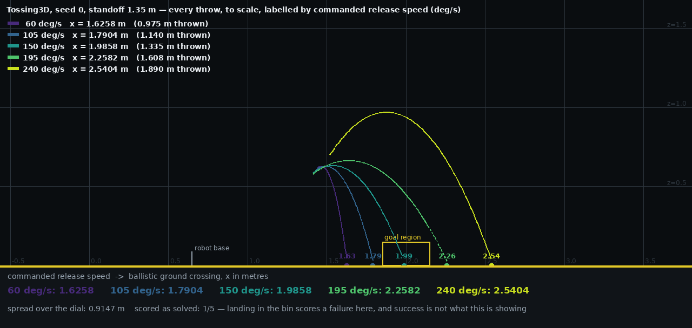

# Tossing3D: watching how far the cube goes as the release speed varies

**2026-08-12.** PR #227 charted the range-vs-speed relation. This is the same relation as
footage: **five throws, one seed, one standoff, and nothing varying but the commanded
release speed.** Whether a throw scores is deliberately *not* the criterion — one that
sails past the bin is exactly as interesting as one that drops in.

> **Where "PR #227" is now.** #227 was **closed unmerged** and consolidated into the single
> release-speed figures PR that carries this entry, so its chart, its two grids and its
> write-up are the sibling entry [how far the cube goes, and the angle it is released at,
> across 60–240 deg/s](2026-08-12-tossing3d-range-and-release-angle.md), committed beside
> this one. Every "PR #227" below names *that* entry's grids and figure — the same data byte
> for byte. The references are kept as written because #227 is where they were measured, so
> the cross-checks below remain checks against a real prior run rather than a re-derivation.

[the five throws, arcs accumulating (39 s)](2026-08-12-tossing3d-release-speed-throws.mp4)

The still above is the video's last frame. The video is the same panel built up one throw
at a time beside the simulator's own view, so each arc is watched being flown and then
stays, faint, under the next one.

| | |
| --- | --- |
| seed | `0` — one of PR #227's ten, so every cell below has a committed counterpart |
| standoff | `1.35` m (`ORACLE_THROW_STANDOFF`, the default) |
| speeds | `60`, `105`, `150`, `195`, `240` deg/s |
| grid cells | `5/5` completed, `0/5` errored on pick, base motion or toss |

## What the five throws measured

`x` is the world-frame forward axis; the robot's base sat at `x = 0.650361` for all
`5/5` throws, so "thrown" is that distance subtracted.

| speed (deg/s) | ground crossing x (m) | thrown from base (m) | resting x (m) | launch elevation (deg) | flight (s) | scores |
| --- | --- | --- | --- | --- | --- | --- |
| 60 | 1.6258 | 0.975 | 1.6172 | 42.94 | 0.3915 | no |
| 105 | 1.7904 | 1.140 | 1.7990 | 40.65 | 0.4250 | no |
| 150 | 1.9858 | 1.335 | 2.0021 | 37.90 | 0.4440 | **yes** |
| 195 | 2.2582 | 1.608 | 2.4612 | 37.73 | 0.4315 | no |
| 240 | 2.5404 | 1.890 | 2.5498 | 57.13 | 0.6755 | no |

**Spread across the dial: `0.9147` m** of ground crossing, from `1.6258` to `2.5404` — the
cube goes `1.9x` as far from the base at 240 deg/s as at 60. `1/5` throws scored, which is
not the point and is reported only so the figure's yellow goal-region box is not
misread: on the coincident config a cube landing **in** the bin is a scored *failure*.

### Two throws are not doing what the other three do

- **195 deg/s never reaches the floor.** Its arc stops in mid-air at `z ≈ 0.35` m, where
  the bin's far wall intercepts it, and its resting x (`2.4612`) is `0.203` m beyond its
  ground crossing (`2.2582`) because it is deflected rather than landing. The panel draws
  the fitted parabola on past that point as a dotted continuation, so the marker the
  distance is read off is visibly the extrapolation it actually is.
- **240 deg/s launches `19` deg steeper than 195**, and flies `0.24` s longer for it —
  the loftiest arc in the family by a wide margin. This is PR #227's release
  quantisation: the gripper opens on the first control step past a fixed path fraction, so
  a shorter swing is sampled more coarsely and the realised release jumps. It is visible
  here as a shape, not merely as a number in a table.

## The instrument

**The ballistic ground crossing**, exactly as PR #227's distance grid defines it: fit the
free-flight parabola and solve it for `z = 0.025` m, the height a resting cube's centre
sits at. Not first contact — the bin is a catcher standing on the goal region, so a cube
whose crossing lies past its far wall still hits that wall and drops in, making "where it
first touched something" a function of the independent variable. Max fit residual across
all `5/5` throws is `3.1e-15` m.

The resting position is recorded and tabulated too, since the two genuinely differ, but
the arcs and the markers are the crossing.

> **This agrees with PR #227's committed grid bit for bit.** All `5/5` of these speeds are
> multiples of 5 and so are cells of that grid's seed 0. `ballistic_impact_x` matches to
> every digit on `5/5`, and `solved` matches on `5/5`. Resting x matches exactly on `3/5`;
> it differs by `4e-6` m at 240 and `1.0e-3` m at 195 — both throws that bounce off the
> bin, where the settle is decided by contacts rather than by the release.

## Frame rate: the domain's existing recording is too slow for a throw, and here is the number

`KinderBackend.set_substep_recording` collects one frame per `env.step()`. Measured on
this scene, one `env.step` is **100 MuJoCo ticks at a `0.0005` s timestep = `0.05` s**, and
the environment's own `render_fps` metadata is `20`, consistent.

That is the right rate for an episode and the wrong one for a throw. At 20 Hz these five
flights would have been captured in `8`, `9`, `9`, `9` and `14` frames — a parabola of nine
samples reads on screen as a teleport, and a previous clip looked like a physics bug for
exactly this reason.

So this probe renders from inside `sim.step`, every 10th tick: **200 Hz**, giving `78`,
`85`, `89`, `86` and `135` frames of flight. A render measured `1.7` ms, so the whole
five-throw recording cost `20.9` s of wall clock — the rate is a legibility choice, not a
budget one. Playback is every second frame at 30 fps, i.e. `3.3x` slow motion.

**A note in circulation that this corrects.** The rate had been described as one frame per
*control* step, `0.1` s, giving `3.9` frames for a `0.390` s flight. The controller's own
trajectory step is indeed `_CONTROL_DT = 0.1` s, but the environment steps at `0.05` s, so
the recorded rate is 20 Hz and not 10. The conclusion — that the existing rate is far too
coarse to show a throw — is unchanged and if anything understated.

## Deviations and limits

- **Five speeds cannot see the reversals, and this figure is not evidence against them.**
  The five crossings here increase monotonically, but they are `45` deg/s apart. PR #227
  measured the relation at `5` deg/s and found `5/36` consecutive steps *fall*, four of
  them significant. A coarse grid stepping over a sawtooth reads as a ramp. Nothing here
  supports or contradicts monotonicity; it was not sampled finely enough to test it.
- **One seed.** `n = 1` per speed, so there is no spread to plot and no inference is
  supported by this run on its own. That is deliberate — the seed is held fixed precisely
  so the pick, the base plan and the initial cube pose are identical and the *only*
  varying quantity is the release speed. PR #227's grid carries the ten-seed statistics.
- **One standoff** (`1.35`).
- **Palette.** A sequential viridis ramp, dark = slow, deliberately outside the project's
  `#0072B2`/`#D55E00` convention for the reason PR #227's entry gives: those two encode
  "an assistance mechanism is available" versus "nothing intervenes", and nothing here is
  an arm of any such comparison. Speed is an *ordered* five-level variable, which neither
  the two role colours nor linestyle can carry.
- **The panel is isotropic** — one metre is the same number of pixels vertically and
  horizontally — so the arcs' shapes are the throws' and not the panel's aspect ratio's.
  The cost is visible empty space either side, which is the honest trade.
- **The annotation is not `recording.StatusBarOverlay`.** It follows that class's contract
  — compose around a frame a domain renderer already produced, never teach the renderer
  about it — but cannot be it: `LoopStatus` is frozen and its vocabulary is the practice
  loop's (baseline/practice/evaluation phase, cycle, sweep, test task, reset kind), and
  `compose` always paints a phase chip. Reusing it would have burned `PHASE EVALUATION`
  and `SWEEP 0/0` onto every frame of a video containing neither, with the commanded speed
  smuggled into a free-text field.
- **The five source clips are not committed** — 4.7 MB of intermediate footage that the
  probe reproduces from `--seed 0`. The measurements behind every number above *are*
  committed, in `2026-08-12-tossing3d-release-speed-throws.json`, including each throw's
  200 Hz trajectory.
- **No claim about hardware.** The quantisation the 240 deg/s arc shows is a property of
  the 10 Hz control rate; the real primitive runs at 1 kHz.
- **Provenance.** Every clip records the `kinder_models.__file__` and `kinder.__file__` it
  ran against, and both resolve inside this worktree — `kinder_models` at the `1b564a1`
  pin, whose `TossController.reset` takes `release_speed`. The probe refuses to start
  otherwise, reusing PR #227's guard: the KINDER venv installs both submodules editable
  against the main checkout's paths, so without it a worktree silently imports whatever
  commit that checkout sits on, and at the older `3524010` pin every throw would have run
  at the default 140 deg/s while looking entirely normal.

Probe: `scripts/tossing3d_release_speed_clips.py`, 4 workers inside an 8 G
`systemd-run --user --scope` with `OOMPolicy=continue`, `20.9` s wall-clock.
Composition: `analysis/tossing3d_release_speed_video.py`.
