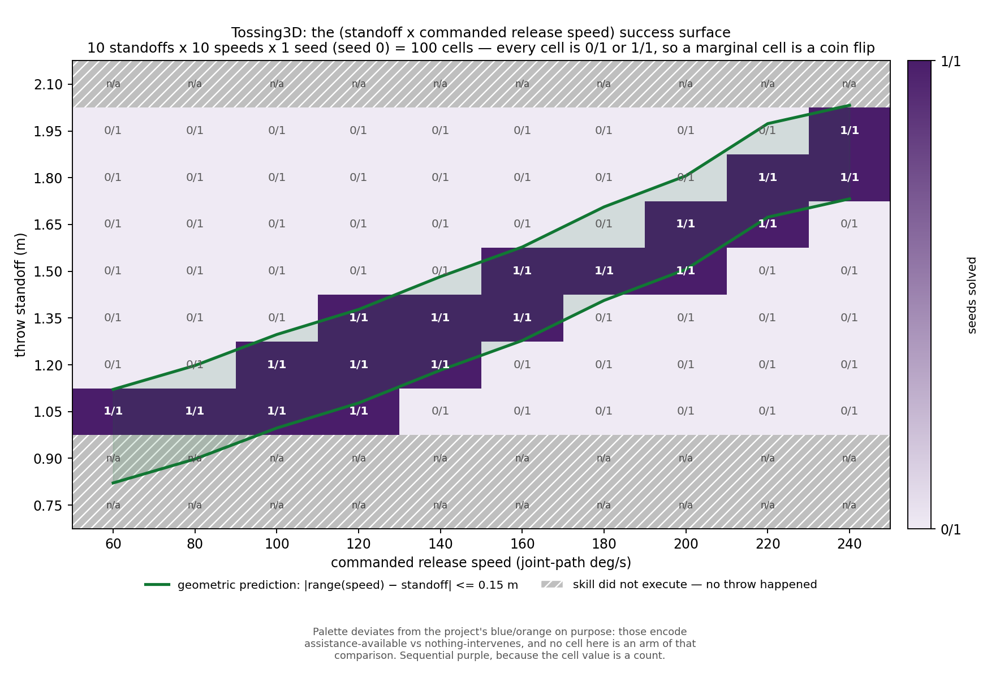

# Tossing3D: the 2-D (standoff x commanded release speed) success surface

**2026-08-12.** Every grid this domain had on record was a 1-D slice of this one. This is
the plane both of them live in, measured at coarse resolution on one seed.

## Question / goal

Does the solving window in **commanded release speed** slide with **throw standoff**, and
does it slide the way the geometry says it should?

## Background

`MoveToThrowPose(standoff)` parks the base at `base_x = bin_x - standoff`, and `Toss(speed)`
is a ballistic throw of some range, so the cube lands at
`landing_x = base_x + range(speed)`. With `bin_x ≈ 2.0` and a 0.300 m goal box in x, a throw
solves when

    |range(speed) − standoff| <= 0.15 m

That couples the two dials: raising the standoff should require a proportionally faster
throw, so the solving window in speed should slide roughly 1:1 with standoff. Nothing had
measured the plane.

Two prior slices, neither of which can answer it:

- **PR #221** — 11 standoffs (1.050–1.300, step 0.025) at **only 6 speeds**, all low-end
  (60–83.34 deg/s).
- **PR #226 / #227** — 37 speeds (60–240, step 5) at a **single fixed standoff** (1.35).
  #226 is closed; #227 carries its grid forward and is this entry's parent.

`Toss`'s release speed became a parameter only at kinder-baselines pin `1b564a1`
(`joshnroy/kinder-baselines` PR #8). **Every Tossing3D number measured before that pin ran
at a single release speed**, so none of them is evidence about this plane.

## Hypothesis

**The solving window slides 1:1 with standoff** — i.e. the surface is a function of the
single combination `range(speed) − standoff` rather than of the two dials separately, and
the solving band is one goal box wide.

## Guidance given

- Cover both axes; enclose the solving region with **empty margin on all sides**, so a
  boundary can be told from an edge of the grid. Check the span against data rather than
  taking a proposed one on trust.
- **10 speeds x 10 standoffs x 1 seed = 100 cells.** An earlier brief asked for 37 speeds at
  5 deg/s to avoid aliasing the release sawtooth; that was **withdrawn** — #227 already
  characterises the fine speed structure at one standoff, so this grid's budget goes to
  covering the plane. Say so rather than leaving a reader to wonder about the resolution
  difference.
- Heatmap, **sequential** colormap (the value is a count, so no meaningful midpoint), `0/1`
  visually distinct from `1/1`, cell counts annotated, geometric prediction overlaid.
- **Not** the project's reserved `#0072B2`/`#D55E00`; say on the figure that it deviates and
  why.
- Report `x/y`, never a bare percentage. State the one-seed limitation plainly, not as a
  footnote.
- Do not build the prefix-caching optimisation at 100 cells; note it as future work.

## Methods

**One cell is a full `Pick -> MoveToThrowPose(standoff) -> Toss(speed)` in the real
simulator.** `Pick` is held at the oracle's point throughout, for the reason
`tossing3d_skill_parameter_sweep.py` holds it there: letting grasp variance in would
confound "does this standoff and speed work" with "did the grasp land". `solved` is
`KinderBackend.check_goals()` — the environment's own verdict, not a re-derivation.

**This is not re-timeable.** #227's angle grid exploited the toss path's geometry being
speed-independent, so one execution re-timed to every speed. Nothing here is speed- or
standoff-independent: where the cube lands *is* the measurement, so all 100 cells are
executed.

**The grid.**

| axis | values | n |
| --- | --- | --- |
| standoff | 0.75 → 2.10, step 0.15 | 10 |
| commanded release speed | 60 → 240 deg/s, step 20 | 10 |
| scene seed | 0 | 1 |

The standoff span was **checked, not assumed**. #226's committed grid puts `range(speed)`
between 0.964 m (at 60 deg/s) and 1.869 m (at 240), so `range ± 0.15` confines the solving
region to `[0.814, 2.019]` and no wider. 0.75 → 2.10 clears both ends. A narrower axis —
1.05 to 1.75 was proposed — would have truncated the region at **both** ends and made an
edge of the grid look like a boundary of the domain.

**The ground crossing is extrapolated to a fixed height**, deliberately. `range(speed)` has
to be a property of the throw, so the free-flight parabola is fitted and solved for its
crossing of `z = cube_half_height` **whether or not the cube got that far**. A cube that
hits the bin's near wall stops being recorded well above the floor; its range is still the
range it would have flown. `first_contact_body` is recorded separately.

**Run.** 100 cells, 52.6 s wall-clock, 10 jobs on 14 workers, inside
`systemd-run --user --scope -p MemoryMax=16G -p OOMPolicy=continue`, `0/100` cells lost.

**One trap worth recording.** The first launch died with `assets.zip is not a zip file`.
`kinder.make` auto-downloads a ~2 GB asset archive on first use in a fresh worktree, and the
guard it skips on is "does `mimiclabs_scenes/meshes` exist" — false for all 14 workers at
once, so 14 downloads raced into one path and each corrupted the others. The probe now
fetches the assets **once in the parent** before forking.

**Provenance.** Every cell records the resolved `kinder_models.__file__` and
`kinder.__file__`; the probe refuses to start unless both resolve inside this checkout at a
pin whose `TossController.reset` accepts `release_speed` (reusing #227's guard). Without it
a worktree silently imports the main checkout's older pin and the speed axis becomes ten
copies of one throw while looking entirely normal.

## Results

### The surface

Rows are standoff, columns commanded speed; `n/a` marks a cell where the skill sequence
raised, so no throw happened.

| standoff (m) | 60 | 80 | 100 | 120 | 140 | 160 | 180 | 200 | 220 | 240 |
| --- | --- | --- | --- | --- | --- | --- | --- | --- | --- | --- |
| **2.10** | n/a | n/a | n/a | n/a | n/a | n/a | n/a | n/a | n/a | n/a |
| **1.95** | 0/1 | 0/1 | 0/1 | 0/1 | 0/1 | 0/1 | 0/1 | 0/1 | 0/1 | **1/1** |
| **1.80** | 0/1 | 0/1 | 0/1 | 0/1 | 0/1 | 0/1 | 0/1 | 0/1 | **1/1** | **1/1** |
| **1.65** | 0/1 | 0/1 | 0/1 | 0/1 | 0/1 | 0/1 | 0/1 | **1/1** | **1/1** | 0/1 |
| **1.50** | 0/1 | 0/1 | 0/1 | 0/1 | 0/1 | **1/1** | **1/1** | **1/1** | 0/1 | 0/1 |
| **1.35** | 0/1 | 0/1 | 0/1 | **1/1** | **1/1** | **1/1** | 0/1 | 0/1 | 0/1 | 0/1 |
| **1.20** | 0/1 | 0/1 | **1/1** | **1/1** | **1/1** | 0/1 | 0/1 | 0/1 | 0/1 | 0/1 |
| **1.05** | **1/1** | **1/1** | **1/1** | **1/1** | 0/1 | 0/1 | 0/1 | 0/1 | 0/1 | 0/1 |
| **0.90** | n/a | n/a | n/a | n/a | n/a | n/a | n/a | n/a | n/a | n/a |
| **0.75** | n/a | n/a | n/a | n/a | n/a | n/a | n/a | n/a | n/a | n/a |

`18/70` executable cells solve. The solving cells form a single connected diagonal band that
rises monotonically with speed — **the window does slide with standoff, in the predicted
direction, across the whole 60–240 deg/s range**, and the region is enclosed with empty
margin above and below.

### Three standoff rows never threw

| standoff | what raised | base_x reached |
| --- | --- | --- |
| 0.75 | `MoveToThrowPose`, `AssertionError` | 0.596 (never moved; commanded 1.251) |
| 0.90 | `MoveToThrowPose`, `AssertionError` | 0.596 (never moved; commanded 1.101) |
| 2.10 | `Toss`, `Motion planning failed; windup did not terminate` | −0.095 (commanded −0.099) |

`30/100` cells are therefore not measurements of a throw and are hatched rather than drawn
as failures. The two low rows are consistent with the documented barrier-collision floor
(`WORST_BARRIER_COLLISION_STANDOFF = 1.00`, `BARRIER_COLLISION_MARGIN = 0.10`); at 2.10 the
base arrives but the arm cannot plan its windup from there. **So the empty margin at both
ends of the standoff axis is a skill limit, not a throw that missed** — a different fact
from the one the margin was there to establish.

### Base placement follows the geometry exactly

Across the seven executable rows, the achieved `base_x` matches `bin_x − standoff` to within
**3 mm** (`bin_x` measured 2.001). The first half of the geometry is not in question.

### `range(speed)`, and its spread across standoff rows

| speed (deg/s) | 60 | 80 | 100 | 120 | 140 | 160 | 180 | 200 | 220 | 240 |
| --- | --- | --- | --- | --- | --- | --- | --- | --- | --- | --- |
| range (m) | 0.971 | 1.048 | 1.147 | 1.228 | 1.333 | 1.428 | 1.557 | 1.656 | 1.824 | 1.882 |
| spread across the 7 rows (m) | 0.013 | 0.019 | 0.018 | 0.068 | 0.022 | 0.018 | 0.013 | 0.007 | 0.018 | 0.029 |

The range is close to a function of speed alone — worst spread 0.068 m at 120 deg/s, median
0.018 m — which is what makes the prediction band on the figure meaningful at all.

### Six cells where the nominal ±0.15 m band and the measurement disagree

The band drawn on the figure classifies `64/70` executable cells. The six it misses, with
where the cube actually came to rest (goal box is x in [1.85, 2.15]):

| standoff | speed | range − standoff | nominal band says | measured | ballistic crossing | resting x |
| --- | --- | --- | --- | --- | --- | --- |
| 1.05 | 120 | +0.178 | fail | **solve** | 2.129 | 2.092 |
| 1.65 | 180 | −0.093 | solve | **fail** | 1.906 | 1.786 |
| 1.50 | 200 | +0.156 | fail | **solve** | 2.160 | 2.103 |
| 1.80 | 200 | −0.144 | solve | **fail** | 1.862 | 1.811 |
| 1.65 | 220 | +0.174 | fail | **solve** | 2.182 | 2.103 |
| 1.95 | 220 | −0.126 | solve | **fail** | 1.882 | 1.810 |

All six separate the **ballistic crossing** from the **resting position**, and the goal test
reads the resting position. The three that fail despite being predicted to solve come to
rest at 1.79–1.81, short of the box's 1.85 edge; the three that solve despite being
predicted to fail overshoot ballistically to 2.13–2.18 but settle back to 2.09–2.10. Every
one of the 70 executable cells records `first_contact_body = bin_0`. No inference is drawn
from this here beyond the observation.

### Cross-check against #226/#227

The standoff = 1.35 row of this grid is the same scene as #226's seed-0 column. On the 10
shared speeds:

- solved/failed verdicts agree on **`10/10`** cells;
- `ballistic_impact_x` agrees to **4.4e-16 m** — floating-point identical, from a different
  probe on a different branch;
- `base_x_before_toss` agrees to **0.0 m**;
- `cube_x_final` differs by up to **0.011 m**, which is the one place the two probes differ:
  this one reads the cube body straight off MuJoCo, #226 read a devectorized observation.

## Limitations

- **One seed. Every cell is `0/1` or `1/1`, so a marginal cell is a coin flip.** The
  structure that mattered most in the 1-D grids lived exactly in the partial cells — band
  edges at `4/10` and `9/10`, and the `185: 0/10 → 190: 10/10 → 195: 1/10` reversal. This
  surface therefore supports claims about the **shape and rough location** of the solving
  region and **not** about where its edges fall. The six disagreements above are each a
  single throw.
- **The speed axis is 20 deg/s, so it cannot see the release sawtooth**, whose resets are
  ~5 deg/s apart. Deliberate — #227 resolves it at one standoff — but it means a single
  anomalous speed can fall between two columns and simply not appear.
- **The 185/190/195 anomaly is not addressed.** Those speeds are not on this grid (the
  columns are 180 and 200), so whether it persists at other standoffs remains open. It was
  in the original brief and this grid cannot answer it.
- The standoff axis is 0.15 m, which is exactly the nominal band half-width, so the band is
  about one cell thick and the edges are resolved to no better than 0.15 m.
- The measured `range(speed)` used for the prediction band is averaged over the seven
  executable rows of this same grid, not from an independent source.

## Recommendation

Take this as the map of where the two dials interact, not as a measurement of the boundary.
Three follow-ups, in the order they would pay off:

1. **Re-measure the band edges with more seeds at fewer cells.** A 3-cell-wide strip
   following the diagonal, at 10 seeds, would cost about the same as this grid and would
   turn every `0/1`/`1/1` on the boundary into a real proportion.
2. **Build the prefix-caching optimisation before any larger sweep.** `Pick` and
   `MoveToThrowPose` are re-executed for every speed at a given standoff, and they do not
   depend on the speed. Snapshotting after `MoveToThrowPose` and restoring it per speed
   would cut a standoff row's cost by roughly the share those two skills take. Not worth
   writing for 100 cells; worth it before a few thousand.
3. **The high-speed corner of the solving region sits outside
   `THROW_STANDOFF_BOUNDS = (1.10, 1.75)`** — at 240 deg/s the only cells that solved are
   1.80 and 1.95, and at 60/80 the only one is 1.05. The sampler cannot draw those. Whether
   that is a real gap or an artifact of the 0.15 m standoff resolution is exactly what
   follow-up 1 would settle; at this resolution it is suggestive and no more.
