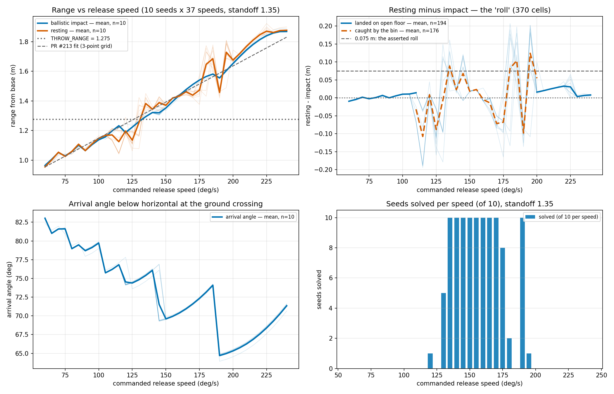

# Tossing3D: impact range across the full release-speed range

**2026-08-12.** 370 cells, 0 errored: 37 speeds (60–240 deg/s, 5 deg/s steps) x 10 fixed
seeds, at `ORACLE_THROW_STANDOFF = 1.35`, with `Pick` pinned at the oracle grasp so grasp
variance cannot be read as a speed effect. Seeds are shared across every speed, so
comparisons across speeds are **paired on scene**.

> **Read this first.** This grid was commissioned to unblock the union-over-speeds
> reformulation of `RobotAtSuccessfulThrowPose` by measuring impact range as a function of
> release speed. **It did not unblock it — it falsified the premise the reformulation was
> to be built on**, in three independent ways. The measurement itself is sound and stands;
> the plan it was serving does not. `RobotAtSuccessfulThrowPose` is **unchanged** by this
> entry, and deliberately so: nothing here licenses a new band, and two of the findings say
> a landing-point band cannot be correct at all once speed varies.

## What was measured, and why not "first contact"

The obvious instrument — step the physics and record the first substep the cube touches
something — does not measure what it appears to. On the coincident config the bin sits
**on** the goal region, and the bin is a catcher: 0.15 m half-extent walls whose tops reach
z = 0.20. A cube on a descending parabola whose ground-crossing lies *beyond* the bin's far
wall still hits that wall and drops in.

Measured directly at 140 deg/s, seed 0: first contact is with a `bin_0` geom at x = 1.9818,
z = 0.0549, and the cube comes to rest at x = 2.0125 **inside the bin, never touching the
floor at all**. Across the whole grid the cube's first contact is the bin in `176/370` cells
and open floor in `194/370` — and which of the two happens is itself a function of speed,
the independent variable. That is the worst available confound.

So this probe measures the **ballistic ground-crossing** instead: the cube is a free body
between release and first contact, MuJoCo integrates it without drag, so its flight is an
exact parabola. Fitting that parabola over the contact-free window (740–1370 substeps at the
0.0005 s physics timestep) and solving for the height at which a resting cube's centre sits
(0.025 m) gives where the cube *would* first touch open floor. **That quantity is
bin-independent by construction.** The fit is exact: max residual across all `370/370` cells
is `3.7e-15` m.

## Finding 1: `THROW_RANGE = 1.275` is neither the impact range nor the resting range

`predicates.THROW_RANGE`'s docstring states that 1.275 is the **impact** range, that the
resting measurement of 1.3499 m is "wrong for this purpose", and that "the two differ by the
~0.075 m of roll". Measured at 140 deg/s, n = 10 seeds:

| quantity | mean | sd | vs `THROW_RANGE = 1.275` |
| --- | --- | --- | --- |
| ballistic impact range | **1.3215** | 0.0065 | t = 22.68, p = 3.0e-09 |
| resting range | **1.3441** | 0.0099 | t = 21.99, p = 3.9e-09 |
| paired resting − impact | **+0.0226** | 0.0085 | t = 8.40, p = 1.5e-05 |

Both reject 1.275 overwhelmingly. The resting figure independently reproduces PR #213's
1.344 at the same speed, so the two grids agree about resting range and the disagreement is
specifically about what 1.275 is.

**The decomposition in the docstring does not survive measurement.** Impact and resting
differ by `0.0226` m, not `~0.075` m, and 1.275 sits `0.047` m *below* the measured impact
range rather than being it.

**What 1.275 actually is.** It was calibrated end-to-end against where solving breaks across
standoffs, not measured in flight — its own docstring says so. It therefore absorbs the bin's
catching geometry, and is best read as an **effective catch-centre** constant for a 140 deg/s
throw, not as a prediction of where the cube lands. It is not wrong at what it does; it is
wrong as a landing-point model, which is exactly the role the union predicate needed from it.

## Finding 2: the impact-to-rest offset is not constant in speed

This was the brief's explicit gate. Restricted to the `194/370` cells that landed on open
floor (a cube caught by the bin has no roll to measure):

| | value |
| --- | --- |
| OLS slope of offset on speed | **+1.21e-04 m per deg/s**, p = 1.6e-24, R² = 0.4204 |
| fitted offset at 60 / at 240 | −0.0005 m / +0.0213 m (swing **0.0218 m**) |
| observed min / max | −0.0101 m / +0.0652 m |
| vs the asserted 0.075 m | t = −69.97, p = 4.3e-139 |

The offset **is** speed-dependent, at p = 1.6e-24. It is also an order of magnitude smaller
than the 0.075 m the docstring assumes. Both halves of the assumption fail: it is neither
constant nor that size.

In fairness to its magnitude, the drift is only ~2 cm across the whole dial, which is small
against the 0.300 m acceptance band. Had this been the only finding, option 2 from PR #224
("assume the offset is speed-independent and anchor it at 140") would have been defensible
with the assumption labelled. Finding 3 is what makes that moot.

## Finding 3: the landing point does not determine success once speed varies

This is the one that stops the reformulation, and it was not anticipated by any of PR #224's
three options.

Seeds solved per speed, out of 10, at standoff 1.35:

| speed | 130 | 135 | 140 | … | 170 | 175 | 180 | 185 | **190** | 195 | 200 |
| --- | --- | --- | --- | --- | --- | --- | --- | --- | --- | --- | --- |
| solved | 5/10 | 10/10 | 10/10 | 10/10 | 10/10 | 8/10 | 2/10 | **0/10** | **10/10** | 1/10 | 0/10 |

**190 deg/s solves `10/10` sitting between 185 at `0/10` and 195 at `1/10`** — and its
ballistic ground-crossing is *shorter* than 185's, at 2.1927 against 2.2185, both beyond the
goal region's far edge of 2.150. A predicate that tests the landing point against the goal
box rejects all three identically, and would be wrong on `10/10` seeds at 190.

The mechanism is the arrival angle, which sawtooths for the same release-quantisation reason
the range does — 76.1 deg at 140, **64.7 deg at 190**, 74.1 deg at 185. Taking the bin's far
wall (outer face x = 2.15, top z = 0.20) and computing the cube's height as it passes:

| speed | crossing x | arrival | height at the far wall | outcome |
| --- | --- | --- | --- | --- |
| 185 | 2.2185 | 74.1 deg | 0.274 m — clears the wall | 0/10 |
| **190** | 2.1927 | **64.7 deg** | **0.112 m — intercepted, drops in** | **10/10** |
| 195 | 2.2419 | 65.0 deg | 0.219 m — just clears | 1/10 |

A purely geometric catch model built from those two numbers — crossing inside the footprint,
or intercepted by the far wall below its top — agrees with the measured verdict on
**`340/370` cells, with `0/370` false negatives** and `30/370` false positives, the errors
clustering at the near-wall edge (115–130 deg/s) where cubes clip the near wall's top and
bounce out. So the two-variable account is substantially right and a one-variable account is
not available.

**Consequence.** "Does a throw from this base pose land the cube in the goal region" is not a
function of the landing point alone once the release speed is free. It depends on at least
(ground-crossing, arrival angle), **both of which are non-monotone in speed**, so it cannot
be written as "∃ speed such that `base_x + range(speed)` is in the box" for any single-valued
`range(·)`.

## Finding 4: the dial is significantly non-monotone across the whole range

PR #221 found this at the dial's low end and flagged that "whether the dial is monotone near
140 is unmeasured", because PR #213's R² = 0.99997 linear fit came from a **three-point** grid
(60/100/140) that could not resolve a sawtooth. This grid stepped 5 deg/s across the full
range specifically so as not to repeat that. Paired on seed, n = 10 per step:

| step | mean impact range | delta | paired t | p | Wilcoxon p |
| --- | --- | --- | --- | --- | --- |
| 70 → 75 | 1.0514 → 1.0279 | **−0.0235** | −7.33 | 4.4e-05 | 3.9e-03 |
| 85 → 90 | 1.1006 → 1.0643 | **−0.0363** | −11.61 | 1.0e-06 | 2.0e-03 |
| 115 → 120 | 1.2321 → 1.1870 | **−0.0451** | −5.52 | 3.7e-04 | 3.9e-03 |
| 140 → 145 | 1.3215 → 1.3199 | −0.0015 | −0.29 | 0.78 | 1.00 | 
| 185 → 190 | 1.5809 → 1.5551 | **−0.0258** | −13.37 | 3.1e-07 | 2.0e-03 |

`4/5` tested steps are significant reversals; 140 → 145 is a **null result** and is reported
as one. So the sawtooth is not confined to the low end — it is present right through the
operating range, with the largest single reversal (−0.0451 m) at 115 → 120.

**This makes an inverted fit unusable as an oracle's speed selector.** A relation that
reverses cannot be inverted; asking "which speed lands the cube at x?" has several answers at
some targets and none at others. A *lookup* over this measured grid — take the grid speed
whose measured range is nearest the target — is well-defined where an inversion is not, and
is the only form of speed selection this data supports.

Per-seed traces are drawn faint underneath the bold means throughout. Panel 1 shows both
range curves against `THROW_RANGE` and PR #213's three-point fit; panel 2 the roll, split by
what the cube actually hit; panel 3 the arrival-angle sawtooth; panel 4 the solve counts,
where the isolated `10/10` bar at 190 between two near-zero neighbours is finding 3.

## Provenance

Every row records the `kinder_models.__file__` and `kinder.__file__` it actually ran against;
all `370/370` resolve inside this worktree's `reference/`, at the branch pins `1b564a1` and
`4113237`. This matters here more than usual: the shared KINDER venv's editable install
points at the **main checkout**, which is on `3524010` — a tree where `release_speed` does
not exist as a parameter at all (`grep -c release_speed` is 6 in one tree and 0 in the
other). A run that picked up the main checkout's copy would have silently measured the
unparameterised toss at a single speed. `scripts/with_kinder_env.sh` exists to close that,
and the recorded paths are what verify it closed.

**The grid was run twice and is byte-identical.** The first run predated a fix to
`scripts/with_kinder_env.sh` (below), so it ran without that wrapper's `OMP_NUM_THREADS` /
`MKL_NUM_THREADS` pins; the second ran under the committed tooling exactly as this entry
documents it. Comparing all `370/370` cells on `ballistic_impact_x`, `cube_x_final`,
`base_x_before_toss` and `solved`: **0 differing values, worst float delta 0.0**, and
`107/370` solved in both. The committed JSON is the second run, so the artifact was
produced by the tooling in this diff.

**One tooling defect was found and fixed here rather than worked around.**
`scripts/with_kinder_env.sh` (PR #162) already forced `src/` onto `PYTHONPATH` so a
worktree imports its own library, but it never did the same for `reference/`. The KINDER
venv installs both submodules **editable**, so their `.pth` files carry the main
checkout's absolute paths and `import kinder_models` in a worktree silently resolved
there. Its own comment said "`kinder` must resolve inside reference/" without pinning
*which* one. The fix adds both submodule source roots to `PYTHONPATH` and makes the
no-argument form print `kinder_models` alongside `kinder`, so the check the wrapper
advertises actually covers the module whose pin moves most often.

Raw grid: `2026-08-12-tossing3d-toss-impact-range.json`. Probe:
`scripts/tossing3d_toss_impact_probe.py`. Figure:
`analysis/tossing3d_toss_impact_probe.py`. 12 workers inside a 16G
`systemd-run --user --scope` with `OOMPolicy=continue`, 161 s wall-clock, on an otherwise
idle box.

## What this does not settle

- **Only one standoff.** Everything here is at 1.35. The catch model's near-wall failures
  (115–130 deg/s) would be better characterised by a standoff x speed grid, which this was
  not.
- **The 30/370 false positives are not modelled.** The geometric catch model is a
  first-order account, not a fitted classifier; its near-edge errors are described but not
  corrected.
- **No claim about hardware.** The sawtooth is a property of our 10 Hz control rate, as
  PR #221 established; the real primitive runs at 1 kHz. Nothing here is evidence about the
  physical robot.
