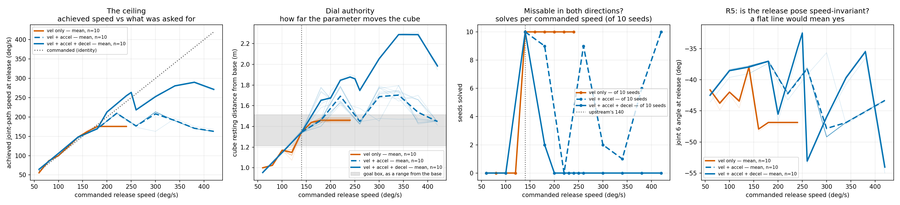

# Tossing3D: how far a speed dial on `Toss` can actually reach

**2026-08-12.** Rung-0 feasibility probe for the velocity-controller task. 320 cells:
three profile-scaling modes x a commanded-speed grid x 10 scene seeds, all at standoff
`ORACLE_THROW_STANDOFF = 1.35` with `Pick` held at the oracle grasp. 280 of those are the
main grid; a further 40 refine the upper end of the recommended window, where the main
grid's 40 deg/s step was too coarse to locate an edge.

Measured at `reference/kinder-baselines` pin **`3524010`**, which contains upstream
PR #103 (base-motion collision-checking switched **on**). Verified at run time rather
than assumed: every result JSON records the `kinder_models.__file__` it ran against, and
the tree it names was checked to contain the uncommented `obstacle_geoms` lines.



## Four clips, one per thing worth seeing

All on scene seed 0, so the commanded speed and the scaling mode are the only things that
differ between them. Each clip starts at the windup -- `Pick` and `MoveToThrowPose` are
held at fixed parameters and are identical in every clip -- and is captioned in-frame with
the mode, the commanded speed, the cube's resting position and the `InGoalRegion` verdict.

| clip | mode | commanded | cube rests at x | goal box x | outcome |
| --- | --- | --- | --- | --- | --- |
| [short -- falls well short of the box](2026-08-12-tossing3d-toss-speed-probe-vel-accel-decel-060deg-seed0.mp4) | `vel-accel-decel` | 60 deg/s | 1.6172 | [1.850, 2.150] | missed, `0/10` seeds solve |
| [solving -- upstream's own throw](2026-08-12-tossing3d-toss-speed-probe-vel-accel-decel-140deg-seed0.mp4) | `vel-accel-decel` | 140 deg/s | 2.0126 | [1.850, 2.150] | **in the box**, `10/10` seeds solve |
| [over-throw -- sails past the box](2026-08-12-tossing3d-toss-speed-probe-vel-accel-decel-220deg-seed0.mp4) | `vel-accel-decel` | 220 deg/s | 2.5107 | [1.850, 2.150] | missed **long**, `0/10` seeds solve |
| [the folded dial -- 3x the parameter, same verdict](2026-08-12-tossing3d-toss-speed-probe-vel-accel-420deg-seed0.mp4) | `vel-accel` | 420 deg/s | 2.1018 | [1.850, 2.150] | in the box, `10/10` seeds solve |

The third clip is the one nothing before this could produce: no setting of `vel` or
`vel-accel` throws far enough to miss long, so the over-throw is the visual form of "the
label is now missable in both directions". The cube leaves the frame before it lands --
the fixed `task_view` camera stops at roughly x = 2.35 -- but it is plainly visible in
flight clearing the bin, and the caption carries the resting position.

The fourth is the failure worth watching rather than reading. At 420 deg/s the two-limit
dial is commanded three times upstream's default and still scores `10/10`, exactly as
140 deg/s does, while **220 deg/s in between scores `0/10`**. Its landing point, 2.1018,
is 0.09 m beyond 140's 2.0126 -- and within 2 mm of where the same mode lands at
260 deg/s (`1.449` m vs `1.447` m of range). "Indistinguishable from 140" is the right
verdict but not the right *landing*: the two are 0.09 m apart and both simply fall inside
a 0.30 m box. It is the outcome that folds back, not the trajectory.

**Every clip was checked against the grid cell it illustrates**, and reproduces its
landing position to 0.000000 m with the same `solved` verdict -- a real check rather than
a tautology, since the clip is produced by the public `env.take_action` path and the grid
by the hand-driven instrumented swing.

## What was asked

`Toss` has `param_dim=0`, so nothing about the throw can be practised. The proposal is to
make the throw's energy a parameter by scaling the three limits `TossController.reset`
passes inline to `_trapezoidal_motion_profile` (`max_vel=140`, `max_accel=300`,
`max_decel=200` deg/s). Four questions had to be answered before anything was built:

1. Does scaling more than `max_vel` lift the release-speed ceiling?
2. What is the dial's authority, in metres of cube displacement?
3. Does the release pose stay speed-invariant (design-doc risk **R5**)?
4. Is there an **upper** failure edge, so the success label is missable in both
   directions rather than only from below?

A fifth question came from the pin: every earlier Tossing3D number was measured with
base-motion collision-checking off, so the probe was re-run rather than replayed.

## Modes

| mode | scales | what it is |
| --- | --- | --- |
| `vel` | `max_vel` | the design doc's option A |
| `vel-accel` | `max_vel`, `max_accel` | **the design doc's option D, as worded** |
| `vel-accel-decel` | all three | option D extended to the third limit |

At 140 deg/s all three are upstream's literals exactly, so that column is upstream's own
toss and every mode agrees there to the last digit (achieved 147.58 deg/s, range 1.344 m,
`10/10` solved in all three).

A solve needs the cube to rest with `range` in **[1.212, 1.512] m** — the goal region's
x extent `[1.850, 2.150]` minus the base's mean x at release, `0.638`.

## Result 1 — the pin changed nothing. Null result.

`vel` repeats the pre-pin grid exactly (60-240 deg/s by 20, seeds 0-4 among the 10), so
the two runs pair cell for cell.

| quantity | pre-pin `11eace5` | post-pin `3524010` | paired difference |
| --- | --- | --- | --- |
| range (m), mean over 50 paired cells | 1.2957 | 1.2958 | +0.0001, sd 0.0004, max abs 0.0017 |
| achieved release speed (deg/s) | 137.849 | 137.849 | 0.0000 |
| solved | 30/50 | 30/50 | **0/50 verdicts flipped** |

Paired t-test on range `t = 1.759, p = 0.085` (n = 50); Wilcoxon signed-rank
`W = 167.5, p = 0.274`. Nothing significant, and the effect size is 1.7 mm at worst —
smaller than the 6-42 mm seed-to-seed spread within a single cell.

**Turning base-motion collision-checking on does not perturb the throw at standoff 1.35.**
The pre-pin rung-0 numbers therefore stand. That could not have been known without
re-running, and it is the reason the re-run was worth its wall-clock.

## Result 2 — option D as the design doc words it does not work

`vel-accel` neither lifts the ceiling nor gives a usable dial. Its outcome **folds back on
itself**: 420 deg/s is indistinguishable from 140 deg/s.

| commanded | 140 | 180 | 220 | 260 | 300 | 340 | 380 | 420 |
| --- | --- | --- | --- | --- | --- | --- | --- | --- |
| achieved at release (deg/s) | 147.6 | 169.4 | 209.5 | 176.6 | 208.0 | 190.7 | 170.7 | 162.8 |
| range (m) | 1.344 | 1.460 | 1.692 | 1.449 | 1.688 | 1.703 | 1.537 | 1.447 |
| solved | 10/10 | 9/10 | 0/10 | 9/10 | 2/10 | 1/10 | 6/10 | 10/10 |

The mechanism is in the profile arithmetic and needs no physics: with `max_decel` fixed,
the deceleration phase grows as the **square** of the scale factor while the acceleration
phase grows only linearly. The profile crosses into its triangular branch, the release
point — which fires at a fixed fraction of *distance* — walks in and out of the cruise
phase as the scale factor rises, and the commanded release speed oscillates instead of
climbing. Total authority is **0.359 m**, *less* than option A's 0.460 m.

A sampler cannot learn a parameter that maps two far-apart values onto the same outcome.
**This variant should not be shipped**, and it is the one the design doc names.

## Result 3 — scaling all three limits does lift the ceiling, and buys an upper edge

| commanded | 60 | 100 | 140 | 180 | 220 | 260 | 300 | 340 | 380 | 420 |
| --- | --- | --- | --- | --- | --- | --- | --- | --- | --- | --- |
| achieved at release (deg/s) | 64.6 | 105.7 | 147.6 | 169.4 | 233.8 | 218.2 | 252.6 | 280.5 | 289.8 | 271.3 |
| range (m) | 0.954 | 1.147 | 1.344 | 1.652 | 1.846 | 1.748 | 2.055 | 2.288 | 2.288 | 1.984 |
| solved | 0/10 | 0/10 | 10/10 | 2/10 | 0/10 | 0/10 | 0/10 | 0/10 | 0/10 | 0/10 |
| peak torque fraction | 0.284 | 0.436 | 0.586 | 0.738 | 0.875 | 0.998 | 1.000 | 1.000 | 1.000 | 1.000 |

- **Ceiling lifted.** Achieved release speed reaches 289.8 deg/s against `vel`'s hard
  saturation at 175.4 — a factor of 1.65.
- **Authority nearly tripled**: 0.954-2.288 m, a span of **1.334 m**, against `vel`'s
  0.460 m.
- **An upper failure edge exists for the first time.** Solves go `0/10` at 60 and 100,
  `10/10` at 140, `2/10` at 180, then `0/10` from 220 upward. The label is genuinely
  missable in *both* directions, which is the property the design doc's requirement 2
  asks for and which `MoveToThrowPose`'s old `NearBin` lacked.

## Result 4 — R4 is now true at the top, which is new

The pre-pin probe found **zero** torque saturation anywhere (peak fraction 0.725), and
recorded R4 as false in the good direction. That was measured over a range option A could
reach. Push harder and it stops holding:

| mode | saturated control steps | peak torque fraction | first saturating speed |
| --- | --- | --- | --- |
| `vel` | 0/1941 | 0.725 | none |
| `vel-accel` | 0/1270 | 0.884 | none |
| `vel-accel-decel` | **88/1610** | **1.000** | 260 deg/s |

Above 260 deg/s commanded the arm is torque-limited, and it shows in the data: range stops
tracking the dial (2.288 m at both 340 and 380, then *falling* to 1.984 m at 420) and
achieved release speed peaks at 380 and drops. **The dial is only trustworthy below the
saturation onset.**

Over the monotone, unsaturated window, `vel-accel-decel` gives roughly 0.9 m of authority,
strictly increasing, straddling the [1.212, 1.512] m solve band with room on both sides.
The window's exact upper edge needed a finer grid than the main pass had; the next section
locates it.

## Where the bounds actually are: 60-240 deg/s

The main grid stepped 180 → 220 → 260, so it could only say the edge lay somewhere in
(220, 260]. A refinement pass at 200/230/240/250 deg/s, same 10 seeds, resolves it to
10 deg/s:

| commanded | 180 | 200 | 220 | 230 | **240** | 250 | 260 |
| --- | --- | --- | --- | --- | --- | --- | --- |
| range (m) | 1.652 | 1.676 | 1.846 | 1.862 | **1.878** | 1.861 | 1.748 |
| sd (m) | 0.113 | 0.023 | 0.005 | 0.006 | **0.008** | 0.009 | 0.006 |
| peak torque fraction | 0.743 | 0.800 | 0.875 | 0.921 | **0.956** | 0.988 | 1.000 |
| saturated control steps | 0/160 | 0/150 | 0/140 | 0/140 | **0/137** | 0/130 | 9/130 |
| solved | 2/10 | 0/10 | 0/10 | 0/10 | **0/10** | 0/10 | 0/10 |

Two criteria, applied to the combined grid rather than assumed:

- **monotone** — range must rise with the parameter, or two settings map to one outcome
  and the sampler is given contradictory training data. This first fails at **250 deg/s**
  (1.861 m, below 240's 1.878 m).
- **unsaturated** — the arm must be able to deliver what the dial asks. The first
  saturated control step appears at **260 deg/s**.

Monotonicity binds first, so the highest speed satisfying both is **240 deg/s**:

```text
=> TOSS_SPEED_BOUNDS = (60, 240) deg/s
   range spanned: 0.954 -> 1.878 m  = 0.924 m of authority
```

**This is the window Josh chose — "monotone and unsaturated" — with its endpoint measured
rather than eyeballed off a coarse grid.** It is 20 deg/s wider than the 60-220 the coarse
pass suggested, and worth 0.032 m more authority (0.924 m against 0.892 m).

**The upper failure edge sits well inside it.** Solves within the window run
`0/10, 0/10, 10/10, 2/10, 0/10, 0/10, 0/10, 0/10` across 60/100/140/180/200/220/230/240.
The last speed that ever solves is 180 deg/s; the label is `0/10` from 200 deg/s upward,
which is **40 deg/s below the upper bound**. So the parameter can genuinely overshoot
*inside* its own sampling range, which is the entire argument for scaling all three limits.

**One judgement call left open rather than made here.** 240 deg/s has a peak torque
fraction of 0.956 — it is one grid step from where the arm starts saturating, and the
0.032 m it buys over 220 deg/s (peak 0.875) is 3.6% more authority for most of the
remaining headroom. A bound at 220 would be the conservative reading of the same data.
Both satisfy every criterion above; 240 is reported because it is what the measurement
supports, and the margin argument is a preference rather than a finding.

## Result 5 — R5 fails, and option D makes it worse, as predicted

The release configuration is not speed-invariant. Peak-to-peak spread of the achieved
release configuration over each whole grid, worst joint (joint 6 in all three modes):

| mode | joint 6 spread | joint 4 | joint 2 | over |
| --- | --- | --- | --- | --- |
| `vel` | 10.53 deg | 5.61 | 3.36 | 10 speeds x 10 seeds |
| `vel-accel` | 13.58 deg | 8.76 | 3.83 | 8 speeds x 10 seeds |
| `vel-accel-decel` | **19.72 deg** | 14.48 | 5.88 | 10 speeds x 10 seeds (main grid) |
| `vel-accel-decel` | **22.70 deg** | 14.48 | 6.12 | 14 speeds x 10 seeds (with refinement) |

The last row is the same quantity over a denser grid, not a re-measurement of the row
above it: peak-to-peak can only widen as speeds are added, and the four refinement speeds
add 2.98 deg of it. Both are stated so neither the comparison across modes (which needs
matched grids) nor the worst case is hidden.

Two causes, both structural. Release is checked once per `_CONTROL_DT = 0.1 s` step, so the
release fraction lands wherever the discrete grid allows — measured 0.467 to 0.625 against
the nominal 0.46 — and the profile shortens as speed rises (14 control steps at 60 deg/s,
4 at 420), which coarsens that quantisation. On top of that the PD loop lags more at speed.

This was flagged in advance as the cost of option D and it is confirmed: scaling all three
limits roughly **doubles** the spread relative to option A. It does not block the design —
the dial still moves the cube monotonically over the usable window — but "the trajectory
otherwise stays the same" is false in fact, not merely at the margins, and the fix (a
smaller control timestep for the toss specifically) is a real follow-up rather than a
nicety.

## Result 6 — the ballistic range model is wrong, again

The design doc proposes `range = k * v^2`, fitted through the origin. Fitted to this data
it is **worse than predicting the mean** in every mode and every subsetting:

| fit | `vel` | `vel-accel` | `vel-accel-decel` |
| --- | --- | --- | --- |
| ballistic `k*v^2`, vs commanded, whole grid | R^2 = -9.97 | -26.66 | -2.56 |
| ballistic `k*v^2`, vs achieved, whole grid | R^2 = -4.38 | -1.87 | -0.40 |
| affine `a + b*v`, vs commanded, whole grid | R^2 = 0.853 | 0.064 | 0.843 |
| affine `a + b*v`, vs achieved, whole grid | R^2 = 0.941 | 0.674 | **0.960** |
| affine `a + b*v`, vs commanded, <= 220 only | R^2 = 0.890 | 0.856 | **0.969** |

The affine fit carries a large speed-independent intercept — `a = 0.588 m` for
`vel-accel-decel` over the usable window — which is what a ballistic-from-the-base model
cannot represent. The cube is released well forward of the base and then rolls, so a
constant offset dominates at low speed. Any symbolic replacement for `THROW_RANGE` should
use the affine form or a monotone interpolation, not `k*v^2`.

## What this does not answer

- **One standoff only** (1.35 m). Whether the dial's authority holds at other standoffs, and
  whether a *state-conditional* sampler could exploit that, is the sweep's job, not this
  probe's.
- **One bearing only** (`rotation=0.0`). The design doc's `RobotOnBinAxis` vs
  `BinWithinThrowRange` question needs a bearing axis and does not have one here.
- **Nothing about learning.** No `Method` was run. That the label is missable in both
  directions is necessary for a sampler to learn, not sufficient.
- **`solved` is `_check_goals()` after a fixed settle budget** (25 control steps, then 35
  more). Both readings are in the JSON; the tables quote the longer one.

## Reproducing

```text
scripts/with_kinder_env.sh python scripts/tossing3d_toss_speed_probe.py \
    --mode vel-accel-decel \
    --output docs/experiment-logs/2026-08-12-tossing3d-toss-speed-probe-vel-accel-decel.json \
    --seeds 0 1 2 3 4 5 6 7 8 9 \
    --speeds-deg 60 100 140 180 220 260 300 340 380 420

# the refinement pass that locates the upper bound
scripts/with_kinder_env.sh python scripts/tossing3d_toss_speed_probe.py \
    --mode vel-accel-decel \
    --output docs/experiment-logs/2026-08-12-tossing3d-toss-speed-probe-vel-accel-decel-refine.json \
    --seeds 0 1 2 3 4 5 6 7 8 9 --speeds-deg 200 230 240 250

# the four clips
scripts/with_kinder_env.sh python scripts/tossing3d_toss_speed_probe.py \
    --mode vel-accel-decel --output /tmp/clips-vad.json \
    --seeds 0 --speeds-deg 60 140 220 --record-video-dir docs/experiment-logs

# a mode given twice is merged, so the refinement lands on the same curve
python analysis/tossing3d_toss_speed_probe.py \
    --probe vel=docs/experiment-logs/2026-08-12-tossing3d-toss-speed-probe-vel.json \
    --probe vel-accel=docs/experiment-logs/2026-08-12-tossing3d-toss-speed-probe-vel-accel.json \
    --probe vel-accel-decel=docs/experiment-logs/2026-08-12-tossing3d-toss-speed-probe-vel-accel-decel.json \
    --probe vel-accel-decel=docs/experiment-logs/2026-08-12-tossing3d-toss-speed-probe-vel-accel-decel-refine.json \
    --output-png docs/experiment-logs/2026-08-12-tossing3d-toss-speed-probe.png
```

Each probe process ran inside
`systemd-run --user --scope -p MemoryMax=8G -p MemorySwapMax=0 -p OOMPolicy=continue`.
Three processes concurrently, against a machine already carrying 22 `hitl_pmp.cli` runs
from another agent and a load average near 26 — deliberately far below the core count,
since concurrency has been measured not to perturb results.

## Recommendation

Ship the parameter as an **effort scale on all three profile limits, scaled linearly
together**, defaulting to upstream's literals. Set
**`TOSS_SPEED_BOUNDS = (60, 240)` deg/s** — the measured monotone, torque-unsaturated
window, not the whole reachable range. Do not ship the two-limit variant the design doc
names. Treat R5's doubled spread and the torque ceiling above 250 deg/s as known,
measured, and open.
