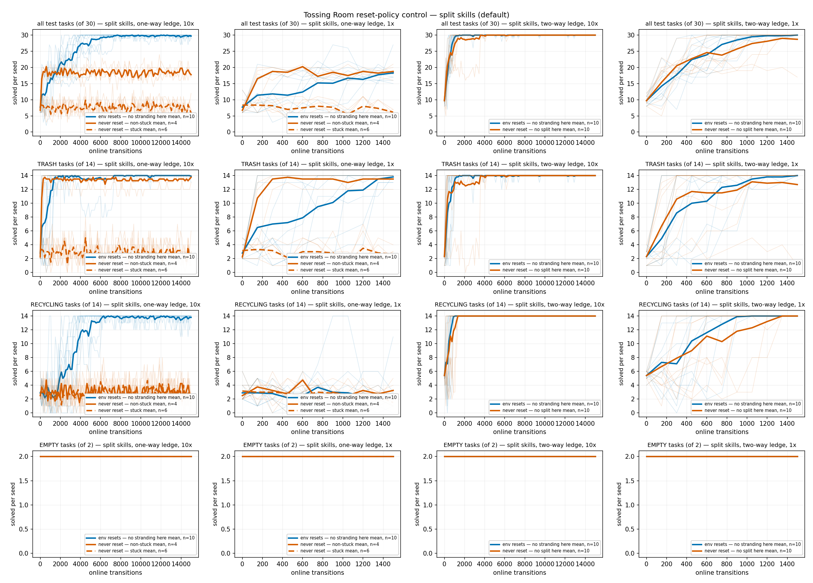
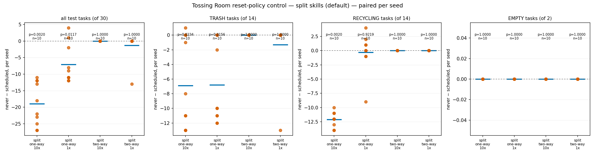
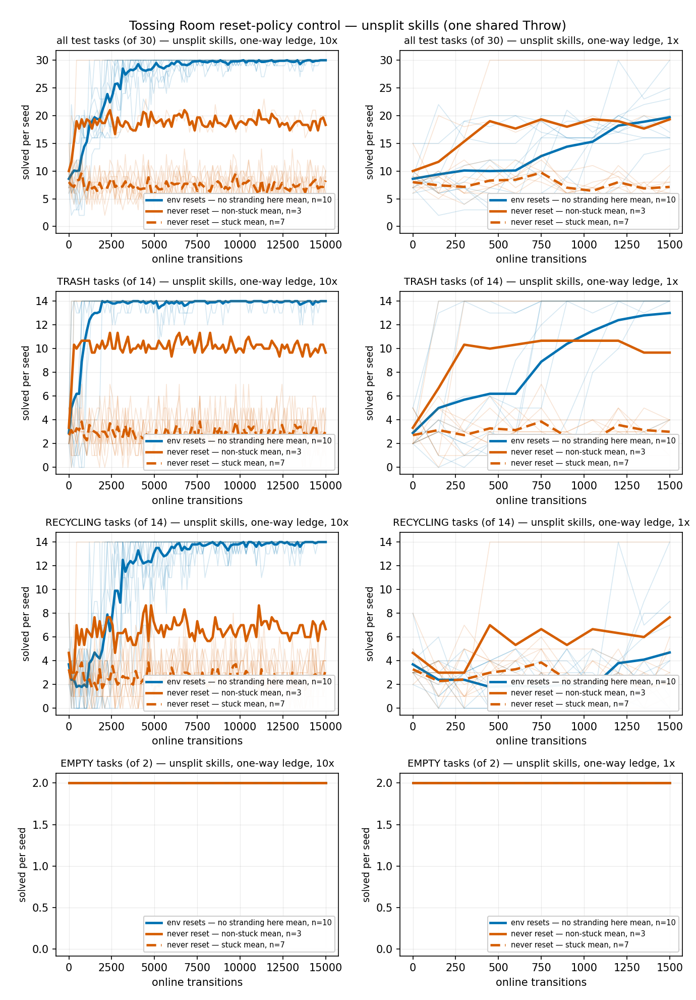
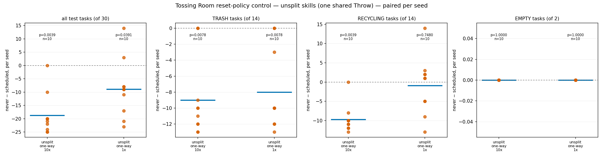

# The reset-policy control on Tossing Room, every goal family plotted separately

`--method ees` (PMP) under `--practice-reset-policy scheduled` against
`--practice-reset-policy never`, on `--env tossingroom` in **both** of its skill
configurations, at two cycle budgets and both ledge variants. Ten fixed seeds (0-9) per
cell, 30 test tasks per seed in the domain's fixed 14 TRASH / 14 RECYCLING / 2 EMPTY
composition.

Two things were being measured at once: the scientific control, and the first end-to-end
validation of the `--record-wandb` results writer (#208) against a real Weights & Biases
backend rather than a unit test. Every run on this page carried `--record-wandb` in
**online** mode.

## Why only Tossing Room, when five environments were asked for

The task that produced this page named five environments: `lightswitch`, `ballring`,
`tossingroom`, `tossingroomsplit` and `tossingroomsplitidentity`. Only one of them can run
this experiment, and that is worth recording explicitly so a reader six months out does not
assume the other four were forgotten.

- **`tossingroomsplit` and `tossingroomsplitidentity` no longer exist.** Both were deleted
  by #141 ("Retire the three superseded Tossing Room environments"), and #142 renamed
  `tossingroomsplitpickupweight` to plain `tossingroom`. `python -m hitl_pmp.cli --env
  tossingroomsplit` now fails at argparse: `invalid choice: 'tossingroomsplit' (choose from
  'ballring', 'lightswitch', 'tossing3d', 'tossingroom')`. The identity variant's own log,
  [`2026-08-06-tossingroomsplitidentity-throw-rates.md`](2026-08-06-tossingroomsplitidentity-throw-rates.md),
  already records that it is "**Not re-runnable, permanently, from HEAD.**" Today's
  `tossingroom` *is* the successor of `tossingroomsplit`, so the split-skill half of this
  page is the closest thing to a re-run of that domain that exists.
- **`lightswitch` and `ballring` cannot express the manipulation.** Both raise
  immediately:

  ```text
  ValueError: practice_reset_policy=never requires its own evaluation_problem: without one,
  every evaluation episode's reset_to_task writes into the practice environment, so the arm
  is reset num_test_tasks times per sweep while num_practice_resets still reports 0.
  ```

  Only `tossingroom` and `tossing3d` build a separate evaluation `Problem`, which
  `PracticeLoop` requires before it will honour `never`. The CLI help says as much:
  `never` "is only meaningful on an environment whose evaluation runs on its own instance
  (tossingroom and tossing3d today)".
- **They also have no goal families to separate.** `lightswitch`'s goal is a single
  `LightOn` atom and `ballring`'s a single `BallOnTable(ball, target_table)`, so "plot all
  tasks separately" has no content on either — there is one family and it is the whole test
  set. `lightswitch` is additionally fully reversible (the robot moves in both directions
  and the dial clamps to `[0, 1]`), so a reset-free arm there would be close to a
  guaranteed null result by construction rather than by measurement.
- **`tossing3d` was deliberately excluded.** Its `reference/kinder-baselines` submodule pin
  was being moved while this ran, so any number taken from it today would have been
  measured against a tree that was mid-change; it is also far slower than the others. It
  already has its own reset-policy measurement in
  [`2026-08-08-tossing3d-reset-free-remeasured.md`](2026-08-08-tossing3d-reset-free-remeasured.md),
  and re-measuring it once the pin lands is the natural follow-up.

No code was written to close the `lightswitch`/`ballring` gap. Wiring a second
`Environment`/`Tasks`/`Problem` into those two CLIs is a real change with its own design
question, and doing it as a side effect of an experiment would have meant shipping an
untested capability inside a results PR.

## Reproduction: the published numbers come back exactly

The 1x one-way cell repeats the protocol of
[`2026-08-07-pickup-weight-reset-free-ab.md`](2026-08-07-pickup-weight-reset-free-ab.md)
and the 1x/10x cells repeat
[`2026-08-07-pickup-weight-cycle-budget.md`](2026-08-07-pickup-weight-cycle-budget.md).
Every figure those pages published came back identical, per seed, not merely in aggregate:

| cell | measure | published | here |
| --- | --- | --- | --- |
| 1x one-way | scheduled per seed | `[27,18,16,18,15,18,17,19,18,17]` | `[27,18,16,18,15,18,17,19,18,17]` |
| 1x one-way | never per seed | `[18,16,5,6,7,6,21,20,7,6]` | `[18,16,5,6,7,6,21,20,7,6]` |
| 1x one-way | overall | 183/300 vs 112/300 | 183/300 vs 112/300 |
| 1x one-way | TRASH | 138/140 vs 70/140 | 138/140 vs 70/140 |
| 1x one-way | RECYCLING | 25/140 vs 22/140 | 25/140 vs 22/140 |
| 1x one-way | sign-flip p | 12/1024 = 0.0117 | 0.011719 |
| 10x one-way | overall | 297/300 vs 107/300 | 297/300 vs 107/300 |
| 10x one-way | TRASH | 139/140 vs 70/140, p = 0.02344 | 139/140 vs 70/140, p = 0.023438 |
| 10x one-way | RECYCLING | 138/140 vs 17/140, p = 0.001953 | 138/140 vs 17/140, p = 0.001953 |
| 1x two-way | overall | 300/300 vs 287/300, p = 1 | 300/300 vs 287/300, p = 1.000000 |
| 1x two-way | TRASH | 140/140 vs 127/140 | 140/140 vs 127/140 |

The stuck/non-stuck partition of the one-way `never` arm also reproduces: six stuck seeds
against four non-stuck, the same split
[`2026-08-10-pickup-weight-cycle-budget-10x-bimodal.md`](2026-08-10-pickup-weight-cycle-budget-10x-bimodal.md)
reports, re-derived here from `effective_attempts` via
`ResetFreeCycleBudgetBimodal.stuck_split` rather than copied.

**This reproduction was obtained with `--record-wandb` active in online mode, on a sweep
running 20 runs concurrently against the live W&B backend.** That is the strongest
available evidence for #208's central claim that the writer is a pure observer: the unit
test asserts a byte-identical `stats.json` for one run in offline mode, whereas this is 120
runs at real network load reproducing a published per-seed result exactly.

## Methods

```bash
python -m scripts.run_sweep --env tossingroom --methods ees --num-seeds 10 \
  --max-workers 10 --results-root results/reset-cube/<cell> \
  --shared-args "--num-test-tasks 30 --record-wandb --practice-reset-policy <policy> [--two-way-ledge] [--unsplit-skills]" \
  --method-args "ees=--num-cycles <10|100> --max-steps-per-interaction 150"
```

with `WANDB_MODE=online`, `WANDB_ENTITY=josh-princeton`, `WANDB_PROJECT=hitl-pmp` and a
per-cell `WANDB_RUN_GROUP` exported into the sweep's environment. The world flags the
earlier cycle-budget log passed explicitly (`--num-rooms 7 --start-room 3
--recycling-bin-room 1 --trash-bin-room 6 --blocked-right-from 2`) are today's CLI
defaults, so they are omitted here and the two protocols are the same protocol.

**Budget, and why.** Ten seeds and the published `1x = 10 cycles` / `10x = 100 cycles`
pair, at 150 steps per interaction. The budget was taken from the prior work rather than
chosen fresh, precisely so the reproduction check above means something — and the 10x arm
is included because that log established the one-way gap *widens* from 71/300 to 190/300
between the two budgets, so 10 cycles alone would understate the effect. Convergence was
pre-registered as "the scheduled arm's pooled overall count is flat across the last ten
checkpoints"; on the one-way 10x cell it finishes 297/300 having been at ceiling for most
of the run, so the budget is adequate for the scheduled arm and the reset-free arm's
failure is not a budget artefact.

Both sweeps ran under `systemd-run --user` as **services, not scopes** (a scope dies with
the shell that launched it), memory-capped at 16G with `OOMPolicy=continue`, at
`--max-workers 10` per sweep with two sweeps in flight, for ~20 concurrent runs against the
box-wide budget of ~22.

### What is committed, and what deliberately is not

**The raw sweeps are not committed.** A 100-cycle run's `stats.json` is ~750 KB, because it
carries all 30 per-task outcomes at each of 101 checkpoints, and there are sixty such runs
here — about 45 MB, against roughly 5 MB for the 10-cycle cells. Committing all of it would
have roughly tripled what `docs/experiment-logs/` currently carries, for figures that need
only a projection of it.

What is committed instead is
[`2026-08-12-tossingroom-reset-policy-control.json`](2026-08-12-tossingroom-reset-policy-control.json),
written by the same module's `--dump-json`, holding **for every cell, every seed: the
transition grid, the pooled `(solved, total)` per checkpoint, and the per-family
`(solved, total)` per checkpoint** for TRASH, RECYCLING and EMPTY. That is exactly the
input `render_curves` and `report` consume, so **every number and every figure on this page
is re-derivable from committed data alone**, without the raw sweeps. This follows the
`*-arms.json` precedent (e.g. `2026-08-04-tossingroom-arms.json`) rather than the
`*-runs/` one.

The raw runs were **omitted, not lost**: they are a projection away, and re-running the
commands above reproduces them, but any byte-level reproducibility claim would have to be
made against `stats.json` rather than against this aggregate. No such claim is made here.

## Results: split skills (the default configuration)



Four rows (all test tasks, TRASH, RECYCLING, EMPTY) x four columns (one-way / two-way
ledge, at each budget). Faint per-seed traces under bold subgroup means throughout; the
reset-free arm's stuck and non-stuck subgroups are separated by linestyle wherever the
population actually splits, and the legend says so where it does not.

Final-checkpoint counts, pooled over ten seeds, with the exact paired sign-flip test on
per-seed `never - scheduled` differences:

| ledge | budget | family | scheduled | never | never worse on | p |
| --- | --- | --- | --- | --- | --- | --- |
| one-way | 1x | all | 183/300 | 112/300 | 8/10 | **0.011719** |
| one-way | 1x | TRASH | 138/140 | 70/140 | 7/10 | **0.015625** |
| one-way | 1x | RECYCLING | 25/140 | 22/140 | 3/10 | 0.921875 |
| one-way | 1x | EMPTY | 20/20 | 20/20 | 0/10 | 1.000000 |
| one-way | 10x | all | 297/300 | 107/300 | 10/10 | **0.001953** |
| one-way | 10x | TRASH | 139/140 | 70/140 | 7/10 | **0.023438** |
| one-way | 10x | RECYCLING | 138/140 | 17/140 | 10/10 | **0.001953** |
| one-way | 10x | EMPTY | 20/20 | 20/20 | 0/10 | 1.000000 |
| two-way | 1x | all | 300/300 | 287/300 | 1/10 | 1.000000 |
| two-way | 1x | TRASH | 140/140 | 127/140 | 1/10 | 1.000000 |
| two-way | 1x | RECYCLING | 140/140 | 140/140 | 0/10 | 1.000000 |
| two-way | 1x | EMPTY | 20/20 | 20/20 | 0/10 | 1.000000 |
| two-way | 10x | all | 300/300 | 300/300 | 0/10 | 1.000000 |
| two-way | 10x | TRASH | 140/140 | 140/140 | 0/10 | 1.000000 |
| two-way | 10x | RECYCLING | 140/140 | 140/140 | 0/10 | 1.000000 |
| two-way | 10x | EMPTY | 20/20 | 20/20 | 0/10 | 1.000000 |



**The per-family split is the finding, and pooling hides it.** At the 1x budget the
one-way penalty looks like a single effect of about seven tasks a seed, but it is almost
entirely TRASH: 138/140 against 70/140 (p = 0.0156) while RECYCLING is 25/140 against
22/140, a **null result** (p = 0.9219, and this design had 80% power to detect only a 3.01
tasks-per-seed difference, so it is underpowered rather than reassuring). At 10x the
picture inverts: TRASH's gap is unchanged (139/140 against 70/140) while RECYCLING opens
from 3 tasks to 121 — 138/140 against 17/140, p = 0.0020. A reader given only the pooled
`297/300` against `107/300` would see a large effect and have no way to know that the
extra budget changed one family completely and the other not at all.

**Nothing survives the two-way ledge.** With `--two-way-ledge` making the domain's one
irreversible action reversible, the reset-free arm is 287/300 at 1x and **300/300** at
10x — identical to the scheduled arm on every seed and every family at the larger budget.
This is the positive control: the manipulation has a large effect where the robot can
strand itself and no detectable effect where it cannot.

**EMPTY supports no inference anywhere.** It is 20/20 in both arms of all four cells. That
is two tasks per seed, both trivially solved by both arms, so every per-seed difference is
exactly zero. This is an absence of resolution, not evidence that the reset policy does not
matter for EMPTY.

### Cross-check against the published pipeline

The same eight cells were also read by the pre-existing
[`reset_free_cycle_budget.py`](../../analysis/practice_makes_perfect/reset_free_cycle_budget.py),
which is what produced
[`2026-08-07-pickup-weight-cycle-budget.md`](2026-08-07-pickup-weight-cycle-budget.md).
It reproduces that log exactly — the one-way gap change of **-119 pooled** at
p = 0.001953, the two-way change as a null result at p = 1 with an MDE of 3.64 tasks, and
even the pooled effective-attempt counts for the 10x two-way cells, **39212** and
**38992**, to the digit. Two independent readers agreeing on the same sweeps is a weaker
check than a reproduction, but a disagreement would have been decisive, and there was none.

## Results: unsplit skills (`--unsplit-skills`, one shared lifted Throw)

The same control in Tossing Room's other skill configuration, where `ThrowTrash` and
`ThrowRecycling` collapse into a single lifted `Throw` whose sampler sees both item kinds.
One-way ledge only, at both budgets.



| budget | family | scheduled | never | never worse on | p |
| --- | --- | --- | --- | --- | --- |
| 1x | all | 197/300 | 108/300 | 8/10 | **0.039062** |
| 1x | TRASH | 130/140 | 50/140 | 8/10 | **0.007812** |
| 1x | RECYCLING | 47/140 | 38/140 | 4/10 | 0.748047 |
| 1x | EMPTY | 20/20 | 20/20 | 0/10 | 1.000000 |
| 10x | all | 300/300 | 113/300 | 9/10 | **0.003906** |
| 10x | TRASH | 140/140 | 50/140 | 8/10 | **0.007812** |
| 10x | RECYCLING | 140/140 | 43/140 | 9/10 | **0.003906** |
| 10x | EMPTY | 20/20 | 20/20 | 0/10 | 1.000000 |



**The reset penalty survives the skill decomposition.** It is significant in both
configurations, at both budgets, with the same shape: TRASH carries the 1x effect
(130/140 against 50/140, p = 0.0078) while RECYCLING is a **null result** at 1x
(47/140 against 38/140, p = 0.7480, MDE 6.65 tasks per seed — underpowered), and RECYCLING
opens dramatically at 10x (140/140 against 43/140, p = 0.0039). Whatever the reset is
doing, it is not an artefact of how the throw skill is carved up.

**The one place the configurations genuinely differ is the scheduled arm's RECYCLING at
1x**: 47/140 unsplit against 25/140 split. A single shared `Throw` sampler sees every
throw attempt regardless of item kind, so RECYCLING benefits from TRASH's much larger
attempt count early on; the split domain has to learn `ThrowRecycling` from its own sparse
attempts. By 10x the scheduled arm is at ceiling in both (300/300 unsplit, 297/300 split)
and the difference is gone. This is a **descriptive comparison across two domains, not a
test** — no paired statistic is computed between the configurations, and none should be.

## A defect this experiment surfaced in the analysis layer

Running the control in the second skill configuration required fixing
`GoalFamilies.classify`, which **raised `ValueError` on every throw goal of an
`--unsplit-skills` run**. That flag renders the throw goal as `ItemInBin(trash, trash_bin)`
and the EMPTY goal as two shared `BinEmpty` atoms, while the rule list knew only the split
domain's `TrashInBin` / `RecyclingInBin`. Per-family analysis was therefore impossible on
that configuration for the whole time the flag has existed — `--unsplit-skills` arrived in
#143 and `GoalFamilies` was extracted one PR later in #144.

**No committed result is affected, and that was checked rather than assumed.** Three
committed logs do report per-family numbers measured on the *retired* `tossingroom` domain,
which used the same `ItemInBin`/`BinEmpty` rendering —
[`2026-08-05-tossingroom-cap1-ees.md`](2026-08-05-tossingroom-cap1-ees.md),
[`2026-08-03-tossingroom-reset-frequency.md`](2026-08-03-tossingroom-reset-frequency.md)
and
[`2026-08-04-tossingroom-reset-interval.md`](2026-08-04-tossingroom-reset-interval.md).
All three were produced by per-domain modules that #141 deleted *before* `GoalFamilies`
existed, and — read back out of git history at `3501026~1` — each classified correctly:

- `tossingroom_reset_frequency.py` and `tossingroom_reset_interval.py` both used an
  explicit full-string dict, `_FAMILY_BY_GOAL`, whose three keys are exactly the unsplit
  renderings (`ItemInBin(recycling, recycling_bin)`, `ItemInBin(trash, trash_bin)`,
  `BinEmpty(recycling_bin) & BinEmpty(trash_bin)`), raising on anything else. Its own
  comment gives the reason: "Explicit rather than pattern-matched: an unrecognised goal is
  a bug … and silently bucketing it as 'other' would quietly shrink a denominator."
- `tossingroom_goal_family_curves.py` used a `BinEmpty`-first membership test followed by
  the regex `\w*InBin\(\s*(\w+)\s*,\s*[^)]*\)`, taking the family from the captured first
  object — which matches `ItemInBin` and `TrashInBin` alike — and raising otherwise.

None matched a bare lowercase `"trash"`, which is the mistake that would have folded
EMPTY's two tasks into a throw family and corrupted a denominator. The committed
[`2026-08-05-tossingroom-cap1-arms.json`](2026-08-05-tossingroom-cap1-arms.json) confirms
it from the data side: its per-seed family entries are `EMPTY [2, 2]` and `[x, 14]` for
both throw families, not the `/16` and `/0` a swallowed EMPTY would have produced.

And no committed run ever set the flag. Measured against the committed tree at `04717d6`,
naming the tree because the answer depends on it:

```console
$ git ls-tree -r origin/main --name-only | grep -c 'config_snapshot.json$'
463
$ git grep -l '"unsplit_skills"' origin/main -- '*config_snapshot.json' | wc -l
290
$ git grep -h '"unsplit_skills"' origin/main -- '*config_snapshot.json' | grep -ci true
0
```

**0 of 463** tracked `config_snapshot.json` files record `unsplit_skills: True`; 290 carry
the key at all and every one of them reads `False`. Measure this in a stale checkout and
the totals differ — a checkout nine commits behind gives 263 and 90, because 200 of these
files arrived with logs merged in between — but the `0` is invariant, and the `0` is the
load-bearing part.

So **no published number is suspect and no provisional note is warranted.** The gap was a
latent hazard for future unsplit analysis, not a defect that ever ran against published
data. `classify`'s deliberate choice to raise on an unrecognised goal rather than bucket it
as "other" is what bounds the damage: the failure mode was always a crash, never a
plausible wrong answer.

## What Weights & Biases actually did

Project: `josh-princeton/hitl-pmp`. Every run rendered; nothing was lost and no run failed
because of the writer.

- **Online mode works.** `WANDB_MODE=online` overrides the writer's offline default exactly
  as its module docstring describes, and 20 concurrent runs streaming to the backend caused
  no failures, retries or stalls.
- **Grouping needed no code change.** `scripts/run_sweep.py` builds `child_env` as
  `{**os.environ, ...}`, so `WANDB_RUN_GROUP` set before the sweep propagates to every
  child. One group per cell was enough to make the arms comparable in the UI. An earlier
  reading of #208 suggested grouping would need `sweep_id` forwarding; it does not, because
  W&B reads its own environment variables and the sweep already forwards them.
- **Run naming is the one real wart.** `WandbResultsWriter` names a run
  `f"{method}-seed{seed}"`, so every run in this study is called `ees-seed0` … `ees-seed9`
  regardless of environment, ledge, budget or reset policy. Group and config disambiguate
  them, but an ungrouped run list is unreadable. Folding the environment and the arm into
  the name would fix it.
- **Overhead is small but was not cleanly measured.** The 1x one-way scheduled cell ran a
  median 76 s per run (n=10) with W&B online at 20 concurrent, against 73 s and 80 s (n=2)
  for the same cell without W&B at 4 concurrent. Different concurrency and different
  denominators, so this bounds the cost as small rather than measuring it. The writer's own
  docstring already declines to claim `timing.json` is comparable across the flag, and that
  caution is correct.

## What this does not show

- **It does not decompose the mechanism.** The reset-free arm loses both the rescue and the
  breadth of its training distribution at once, and this design separates neither. That
  caveat is inherited from the earlier logs and is not weakened here.
- **EMPTY supports no inference.** It is 2 tasks per seed, 20 per arm, and both arms score
  20/20 in every cell measured. Two flat overlapping lines is the honest rendering; it is
  not a null result, it is an absence of resolution.
- **It says nothing about `lightswitch` or `ballring`**, for the reasons in the first
  section — not because they were measured and found uninteresting.
- **The two-way ledge is a different domain from the one-way ledge**, so only the
  within-ledge gap travels between them. Comparing a two-way count against a one-way count
  directly would be an error, and no comparison here does.
