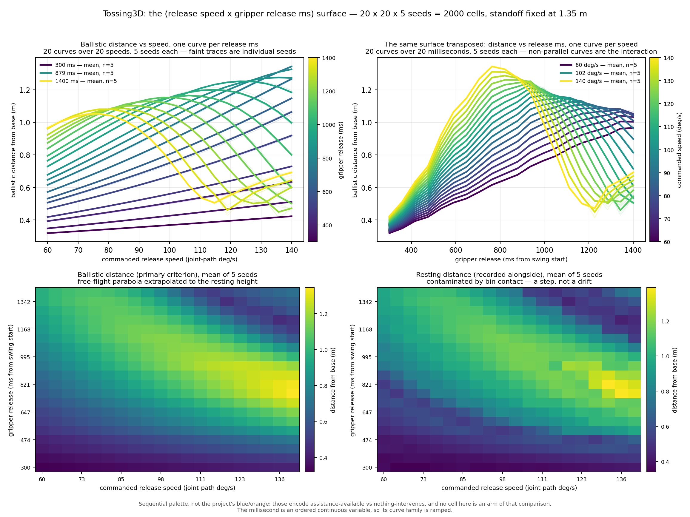
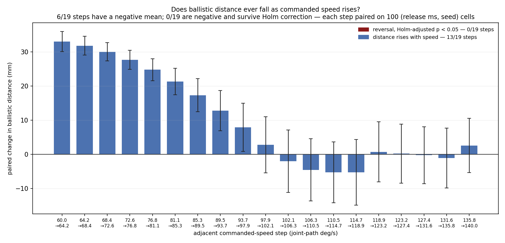
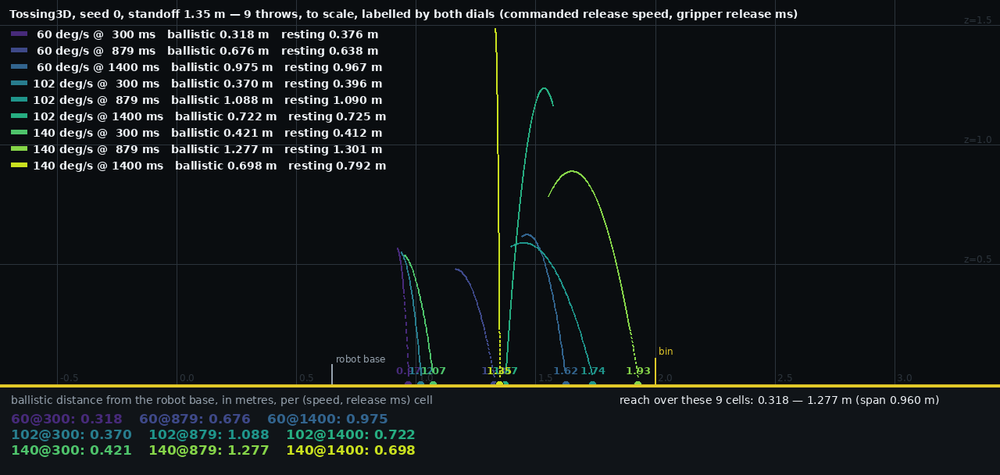

# Tossing3D's `(release_speed, gripper_release_ms)` surface — 20 x 20 x 5 seeds

**2026-08-13.** 2000 cells. Standoff fixed at 1.35 m. Primary criterion: **ballistic
distance** (the free-flight parabola extrapolated to a resting cube's centre height),
reported from the robot base. Resting position recorded alongside.

**TL;DR.** The surface is **not** degenerate — the two dials together reach a 1.0248 m span
of ballistic distance against 0.6947 m for the speed dial alone at the default millisecond,
a **1.48x** widening. Over the intervals the sampler draws from, the millisecond accounts for
**0.5903** of the seed-mean surface's variance, the interaction **0.3578**, and the
commanded speed **0.0519** — shares that are conditional on those intervals, not intrinsic
to the dials. The 100 → 105 deg/s reversal does **not** survive: `6/19`
adjacent speed steps have a negative mean, `0/19` survive Holm correction, and the step
bracketing the original claim is `+2.76 mm, p = 0.508`. **`0/2000` dead cells** — every cell
of `TOSS_RELEASE_MS_BOUNDS` threw, as predicted.

## Question / goal

`Toss` carries `param_dim=2`. Two questions decide whether that is right and whether a
published anomaly was real:

1. **Is the reachable set degenerate?** Do many `(speed, ms)` pairs give the same ballistic
   distance — meaning the second knob buys nothing over the first?
2. **Does the `100 → 105 deg/s` reversal survive?** kb#11 measured `1/16` reversals at
   3.3 mm on one seed and explicitly did not establish whether it was real.

## Background

Every prior grid on this domain is a 1-D slice. PR #221 swept 11 standoffs at 6 low-end
speeds; PR #226/#227 swept 37 speeds at one standoff; PR #234's surface swept
`(standoff x speed)` at a **single seed**, so every cell there was `0/1` or `1/1`.

None of them could see this plane at all, because `gripper_release_ms` did not exist as a
parameter until `joshnroy/kinder-baselines` PR #12 replaced the retired `_release_fraction`
rule with a release scheduled on an absolute millisecond. PR #239 then set the two intervals
this grid sweeps — `TOSS_SPEED_BOUNDS = (60, 140)` and
`TOSS_RELEASE_MS_BOUNDS = (300, 1400)` — and corrected two constants that earlier
measurements had been taken against: a `240 deg/s` ceiling that was a *measurement* range
rather than a command range, and a `723 ms` default that was nominal arithmetic rather than
the motion-planned crossing, worth 52 mm of landing distance.

The two dials are **coupled by construction**: the swing's duration is itself a function of
the speed (3100 ms at 60 deg/s down to 1700 ms at 140), so the same absolute millisecond is a
different point in the swing at each end of the speed range. An interaction term was
therefore predicted rather than discovered.

## Hypothesis

That the millisecond would add reach over the speed dial alone (so `param_dim=2` is
justified), with a substantial speed x millisecond interaction; and that the reported
reversal would prove to be seed noise rather than a real non-monotonicity.

## Guidance given

Ballistic distance primary, resting position recorded alongside but never used for a
statistic — resting x is contaminated by bin contact, and the contamination is a **step**:
scanning the ms axis at 140 deg/s gave `690 → 1.7175`, `705 → 1.7428`, then a jump of
244 mm to `710 → 1.9870`. Fixed seeds, never drawn. Paired tests, since arms share their
seed set. No effect asserted without a p-value. Counts as `x/y`, never a bare percentage.
Show degenerate regions rather than hiding them. No standoff axis, no goal box. Consider a
family of curves alongside a heatmap, since parallel curves answer the redundancy question
instantly.

## Methods

**Grid.** `release_speed` x `gripper_release_ms`, 20 x 20, 5 seeds (`0..4`) = 2000 cells.
Both axes span exactly the sampler's own intervals, **imported from
`predicates.py` rather than retyped**, so the sweep cannot silently disagree with the
interval the sampler draws from. The 20-point axes step by `80/19 = 4.21 deg/s` and
`1100/19 = 57.89 ms`; both endpoints are pinned exactly.

**One cell** is a full `Pick → MoveToThrowPose(1.35) → Toss(speed, ms)` in the real
simulator, with `Pick` held at the oracle's point so the grasp's own variance cannot
confound the measurement. The cube is recorded at every MuJoCo tick; the free-flight window
is the longest contact-free run, and the parabola is solved for the crossing of a resting
cube's centre height **whether or not the cube got that far**, so a cell stopped by the bin
wall stays comparable with one that reached open floor.

**The fit is exact, and that was verified rather than assumed.** Across `2000/2000` cells the
maximum deviation from the fitted parabola is **3.98e-15 m** (median 7.77e-16), and every
cell has at least 338 free-flight samples. A free body under MuJoCo's gravity with no drag
*is* an exact parabola, so this is the check that the window being fitted is really free
flight and not the cube still being carried.

**Statistics.** Arms share their seed set, so every test is paired. Each adjacent speed step
is paired on the `(release_ms, seed)` cells the two speeds share, `n = 100` per step.
Holm-Bonferroni across the 19 steps, because asking 19 questions at `alpha = 0.05` expects
about one false positive and "was a single reported reversal a false positive" is precisely
the question.

**The reversal question is answered by bracketing, not by re-running the exact pair.** A
20-point axis over `(60, 140)` contains neither 100 nor 105; the step spanning them is
`97.89 → 102.11 deg/s`. That is the honest resolution available at the specified grid shape,
and it is stated rather than papered over.

## Results

### `0/2000` dead cells

Every cell threw. `gripper_release_ms` is not clamped upstream, so a value at or past the end
of the swing would mean the gripper never opens — but the shortest swing in the speed range
is 1700 ms and the bounds stop at 1400, so no cell can land there. The prediction held
exactly, and the driver would have marked such a cell `threw=False` and hatched it rather
than reporting a throw of zero distance.

### Q1 — the reachable set is not degenerate, and the second dial is the dominant one

| quantity | value |
| --- | --- |
| 2-D reach, both dials | `[0.3184, 1.3432]` m, span **1.0248** m |
| 1-D reach, speed only at 705.3 ms | `[0.5716, 1.2663]` m, span **0.6947** m |
| widening factor | **1.48x** |
| paired `300 ms → 1400 ms` at matched (speed, seed) | `n=100`, **+427.7 mm**, t = 18.84, **p = 1.65e-34** |

Variance shares of the seed-mean surface (they sum to 1 by construction):

| term | share |
| --- | --- |
| `release_ms` | **0.5903** |
| interaction | **0.3578** |
| `release_speed` | **0.0519** |

**These shares are conditional on the sampling intervals, and both intervals are design
choices rather than properties of the dials.** The question they answer is "over
`(300, 1400)` ms and `(60, 140)` deg/s, which axis moves the throw more" — not "which dial
is intrinsically more powerful". The millisecond interval is 1100 ms wide and deliberately
spans from a very early, weak release, through the peak, and past it; the speed interval is
capped at what the real primitive commands and, by this grid's own Q2 result, **saturates
above about 100 deg/s**, so its top stretch contributes almost nothing to the share. Widen
or narrow either interval and the ratio moves. What makes the shares decision-relevant
anyway is that these *are* the ranges the sampler actually draws from.

The 705.3 ms row is the grid point nearest upstream's shipped 720 ms default; 720 itself is
not on a 20-point axis over `(300, 1400)`.

**Read the top-right panel of the figure for the mechanism.** Every speed's
distance-vs-millisecond curve rises to a peak and falls, and the peak moves *earlier* as
speed rises — exactly what a speed-dependent swing duration predicts. The curves are
emphatically **not** parallel, which is the interaction being visible rather than asserted.

So `param_dim=2` is justified, and **over the intervals the sampler draws from** the
millisecond is where the reach is: the commanded speed's share of this surface is small, and
on its own the speed dial does nothing measurable above ~100 deg/s (see Q2). That is a
statement about these bounds, not a ranking of the dials in general.

### Q2 — the reversal does not survive

`6/19` adjacent speed steps have a negative mean change; **`0/19`** are negative and survive
Holm correction. The most negative step is `114.74 → 118.95 deg/s` at **−5.28 mm**, raw
`p = 0.278`. The step bracketing the original `100 → 105` claim is `97.89 → 102.11 deg/s` at
**+2.76 mm**, raw `p = 0.508` — a null result in both directions.

What the figure shows instead is more useful than a verdict on one pair: **the speed effect
saturates.** It is large and unambiguous at the bottom of the range (+33.03 mm per 4.21 deg/s
step at `60 → 64.21`, t = +22.27, `p = 2.46e-40`) and decays monotonically to noise by about
100 deg/s, after which every step's 95% interval straddles zero. `8/19` steps survive Holm
correction as positive, and all eight are below 94 deg/s.

That is the honest explanation of kb#11's `1/16`: above ~100 deg/s the true step effect is
within a few millimetres of zero, so on a single seed the *sign* of any given step is a coin
flip. The reversal was neither a real non-monotonicity nor a mistake — it was a measurement
taken inside the saturated region.

### Resting position, recorded alongside

Over all `2000/2000` thrown cells, resting minus ballistic distance has mean **−4.6 mm** but
standard deviation **48.9 mm**, ranging from **−223.1 mm** to **+216.4 mm**. The bottom-right
heatmap shows why: the resting surface carries blocky discontinuities the ballistic surface
does not, where the bin catches a cube instead of letting it pass. This is the contamination
the primary criterion was chosen to avoid, and it is recorded rather than corrected.

### The nine throws

[Nine throws, seed 0, 200 Hz, arcs accumulating](2026-08-13-tossing3d-toss-parameter-throws.mp4)

Speeds `60 / 102.105263 / 140` deg/s x milliseconds `300 / 878.947368 / 1400`, seed 0 —
indices `0 / 10 / 19` on each axis, so **every one of the nine is a cell of the grid above**
rather than a lookalike measured separately. Checked: all `9/9` reproduce their grid cell's
ballistic distance to **2.2e-16 m**.

Rendered from inside `sim.step` every 10th physics tick (200 Hz), which gives these flights
34–124 frames each; at the environment's native 20 Hz they would get 8–14 and read as a
teleport rather than a throw.

**The far corner is worth watching.** At `140 deg/s @ 1400 ms` the release comes near the end
of a 1700 ms swing, so the cube leaves the gripper at z = 1.49 m with a launch speed of
**0.072 m/s** and is simply **dropped** — it travels 17 mm horizontally while falling 1.25 m.
Its fitted trajectory has `2a = −9.810 m/s²` with residual 1.55e-15 m and `0/100` contact
frames, so this is a measurement rather than an artifact. It is why the surface folds back
down at high speed and late release, and it is the clearest single illustration of why the
two dials are not separable.

## Recommendation

- **Keep `param_dim=2`.** The second dial adds 1.48x of reach and carries `0.5903` of the
  surface's variance. A 1-D parameterisation would lose most of the reachable set.
- **Do not treat `release_speed` as the primary dial.** It carries `0.0519` of the variance
  and its effect is statistically indistinguishable from zero above about 100 deg/s. Any
  sampler or learned model that spends its resolution on speed is spending it in the wrong
  place.
- **Treat the reversal as closed.** `0/19` steps survive correction; the phenomenon was a
  single-seed measurement inside the saturated region of the speed axis.
- **A speed-relative release parameter is worth reconsidering — on *decoupling* grounds
  only, which is a different argument from the reachability one and does not disturb it.**
  Two separate questions have to stay separate here, because they point opposite ways and
  are easy to read as one:

  - **Reachability — settled, and settled in favour of absolute milliseconds.** An earlier
    revision of `TOSS_RELEASE_MS_BOUNDS` asserted that no absolute interval could be both
    live at every speed and reach mid-swing at every speed, and recommended a speed-relative
    parameter on that basis. **That claim was retracted on PR #239**, and this grid's
    `0/2000` dead cells is the direct confirmation: over `(300, 1400)` ms every speed in
    `(60, 140)` is still swinging when the gripper opens, and the canonical fraction-0.46
    release point is inside the interval at every speed. Absolute bounds reach everything
    they need to, with no dead draws. **Nothing below reopens this.**
  - **Decoupling — open.** Separately from reachability, the two dials are not *separable*:
    the interaction is `0.3578` and it is structured rather than noisy, because the optimum's
    position slides with speed as the swing shortens. A parameterisation in fraction of swing
    would plausibly remove that structure and give a learner two dials it can move
    independently. That is a claim about how easy the space is to search, not about what it
    can reach.

  So both are true at once: absolute bounds reach fraction 0.46 at every speed with no dead
  draws, *and* they leave a structured interaction. **This is an open design decision, not a
  finding of this experiment** — these 2000 cells do not settle it, and it has been escalated
  to Josh by the `hitl-experiment` agent coordinating this stack rather than taken by either
  of us.

## Limitations

- **One standoff (1.35 m) and one scene family.** The ballistic distance is a property of the
  swing and the standoff only translates where it lands, so this should generalise — but that
  is an argument, not a measurement here. The driver takes `--standoff-points` and needs no
  change to test it.
- **Five seeds.** Enough to make each cell an `x/5` and to give `n = 100` per paired speed
  step, but the per-seed spread is small relative to the parameter effects, so this grid has
  much more power for the dials than for scene variation.
- **The `100 → 105` pair is bracketed, not measured.** Neither value is on a 20-point axis
  over `(60, 140)`; the containing step is `97.89 → 102.11`.
- **Solve rate is not reported.** The criterion here is distance; `--standoff-points` and a
  goal criterion would be a different experiment.
