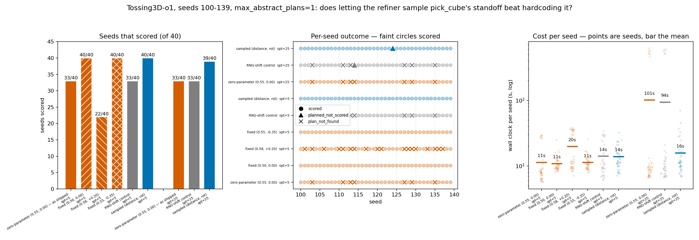

# Giving `pick_cube` back its standoff parameters

**2026-08-16.** Experiment, not a landing. Nothing here is proposed for merge.

## TL;DR

Letting the refiner sample `pick_cube`'s `(distance, rot)` takes Tossing3D-o1 from
**33/40 to 40/40 scored** on seeds 100-139 at `samples_per_step=5`, recovering all
seven residual seeds and losing none, for **+22% wall clock** and *fewer* total
sampler calls than the baseline. An RNG-shift control rules out the random stream:
consuming the same two draws while still standing at the hardcoded standoff gives
back exactly 33/40 and exactly the same seven seeds.

But the reason is not that search is finding something rare. **Where the robot stands
matters enormously, and the shipped point is a mediocre one.** Two arbitrary
*different* fixed standoffs also score 40/40, at lower cost than sampling; a third
scores **22/40**, worse than shipped, and loses eleven seeds the baseline solved. So
the honest claim is not "search beats a constant" but "the constant is load-bearing,
nobody knows which constant, and sampling is the way to stop having to know".

## Question / goal

Does letting the bilevel refiner sample `pick_cube`'s continuous parameters beat the
current zero-parameter hardcoded grasp, and at what cost?

## Background

`PickCubeController` (kinder-baselines,
`kinder-models/.../dynamic3d/tossing/parameterized_skills.py`) was deliberately made
zero-parameter earlier in this project. `sample_parameters` returned
`np.zeros(0)`; the standoff was one class attribute `STANDOFF = (0.55, 0.0)` — 0.55 m
head-on, no rotation offset. The stated reasoning: `run_sesame`'s
`ParameterizedControllerTrajectorySampler` is uniform rejection sampling with zero
feedback, a failed draw teaches it nothing, each attempt costs a full simulated
rollout, and pick feasibility is a crisp binary.

What changed is the failure mode. At `kindergarden` `f3c05a2` + `kinder-baselines`
`c0a4d83`, seeds 100-139 leave a residual **7/40 `plan_not_found`** —
`{103, 111, 113, 114, 127, 129, 135}` — and raising `samples_per_step` 5 → 25 does
not move it. The toss's parameters are not the bottleneck; the grasp handed to it is.

The mechanism that makes this reachable at all: `Holding(robot, cube)` is true of an
edge grasp and a face grasp alike, so refinement cannot see a bad grasp. It only
finds out when the downstream toss drops the cube — and at that point backtracking
re-ran the *identical* pick, because the pick had nothing to redraw.

## Hypothesis

If the pick could sample its standoff, backtracking would find a place to stand from
which the same seed's cube is grasped well enough to survive the throw.

## Guidance given

Restore at least `(distance, rot)` as `PickShelfController` has; consider exposing the
grasp yaw; declare the matching `params_space`; say whether the internal
grasp-rotation retry was kept; measure at `samples_per_step` 5 and 25 against the
same baseline; report per-seed deltas in both directions and the cost; never state an
unmeasured number.

## Methods

### What was exposed, and why

**`(distance, rot)`, and nothing else.** `sample_parameters` is now *inherited* from
`PickShelfController` rather than overridden — a uniform draw over
`MOVE_TO_TARGET_DISTANCE_BOUNDS = (0.5, 0.6)` and
`MOVE_TO_TARGET_ROT_BOUNDS = (-pi/4, pi/4)`, whose only rejection is standing too
close to a *different* cube. Tossing3D-o1 has no second cube (`cuboid_barrier` does
not match its `"cube" in name` test), so here it is a plain uniform draw over the
box; inheriting rather than reimplementing keeps the guard for a scene that grows one.

**Bounds unchanged from the shelf pick's.** The shipped `STANDOFF = (0.55, 0.0)` is
exactly the midpoint of that box, so the baseline is the box's centre and neither
widening nor narrowing was needed to make the comparison fair.

**The grasp yaw was *not* exposed.** It is chosen by walking `upright_grasp_rotations`
inside `reset`, nearest-reachable-first, and that internal retry was **kept**. Sampling
externally while also retrying internally does muddy attribution, and the two-arm
version of this experiment was not run — see Followup.

**`params_space` was declared** on the lifted controller, as
`Box([0.5, -pi/4], [0.6, pi/4])`. Worth recording: `params_space` is read **nowhere**
in `bilevel_planning` except `LiftedParameterizedController.__repr__`. It is
documentation, not behaviour, so declaring it cannot have moved any number here.

### Arms

Every arm is 40 seeds, 100-139, `max_abstract_plans=1`, `planning_timeout=1800 s`,
`max_skill_horizon=400`, driven through kinder-bilevel-planning's own
`BilevelPlanningAgent` on `kinder/Tossing3D-o1-v0`.

| arm | what it does |
| --- | --- |
| **zero-parameter (baseline)** | the shipped `STANDOFF = (0.55, 0.00)`, drawing nothing |
| **sampled `(distance, rot)`** | the change under test |
| **RNG-shift control** | hardcoded `(0.55, 0.00)`, but consuming the *same two draws* and discarding them |
| **fixed `(0.50, 0.00)`** | an arbitrary different fixed point, drawing nothing |
| **fixed `(0.58, +0.20)`** | ditto |
| **fixed `(0.55, -0.35)`** | ditto |

The **RNG-shift control** exists because making the pick sample shifts the single
refiner RNG stream, so the *toss's* draws change on every seed too. Without it, a
recovered seed cannot be attributed to the standoff. The three **fixed** arms exist to
tell "sampling helps" apart from "`(0.55, 0.00)` specifically is a bad place to stand";
they consume no draws, so their toss stream is identical to the baseline's.

Outcomes are `scored` (`sim._check_goals()` after executing the refined plan),
`planned_not_scored` (refinement succeeded, execution did not score), and
`plan_not_found` (refinement returned no plan). `TrajectorySamplingFailure` is caught
as `BaseException` throughout — it does not subclass `Exception`.

### Provenance

Resolved by `__file__` to a git HEAD, in this worktree's own `reference/`:

| package | tree | HEAD |
| --- | --- | --- |
| `kinder` | `reference/kindergarden` | `f3c05a2` (`josh/fix/set-state-restores-gripper-joints`), clean |
| `kinder_models`, `kinder_bilevel_planning` | `reference/kinder-baselines` | `7c898ca`, clean — one commit on top of `c0a4d83` |
| `bilevel_planning` | conda `hitl-pmp` site-packages | not a checkout |

`7c898ca` is the change under test. Every non-`sampled` arm runs that same tree with
the standoff pinned from outside, which was verified to be behaviour-neutral:
`zero-param` mode reproduces the true `c0a4d83` baseline **attempt-for-attempt** on
seeds 100, 101, 102 and 103 (including the failing seed's full 30-attempt trace), and
the fixed probe pinned to `(0.55, 0.0)` likewise on seeds 100 and 101.

`planning_timeout` never bound: the largest `planning_seconds` observed across all
arms is 87.0 s against 1800 s.

## Results

### Headline table, `samples_per_step=5`

| arm | scored | planned_not_scored | plan_not_found | honest |
| --- | --- | --- | --- | --- |
| zero-parameter, `(0.55, 0.00)` — as shipped | 33/40 | 0/40 | 7/40 | 33/33 |
| **sampled `(distance, rot)`** | **40/40** | 0/40 | 0/40 | 40/40 |
| RNG-shift control | 33/40 | 0/40 | 7/40 | 33/33 |
| fixed `(0.50, 0.00)` | 40/40 | 0/40 | 0/40 | 40/40 |
| fixed `(0.55, -0.35)` | 40/40 | 0/40 | 0/40 | 40/40 |
| fixed `(0.58, +0.20)` | 22/40 | 0/40 | 18/40 | 22/22 |

### Same table, `samples_per_step=25`

| arm | scored | planned_not_scored | plan_not_found | honest |
| --- | --- | --- | --- | --- |
| zero-parameter, `(0.55, 0.00)` — as shipped | 33/40 | 0/40 | 7/40 | 33/33 |
| **sampled `(distance, rot)`** | **39/40** | 1/40 | 0/40 | 39/40 |
| RNG-shift control | 33/40 | 1/40 | 6/40 | 33/34 |

The baseline at `spt=25` leaves the **same seven seeds**,
`{103, 111, 113, 114, 127, 129, 135}` — independently reproducing the prior result
that more toss budget does not move the residual.

### 1. Do any of the 7 become solvable?

**All seven.** `{103, 111, 113, 114, 127, 129, 135}` all move `plan_not_found` →
`scored`, at both sampling budgets.

### 2. Is anything lost?

**At `samples_per_step=5`, nothing:** 7 gained, 0 lost, 33 unchanged.

At `samples_per_step=25`, one seed is lost — **124, `scored` →
`planned_not_scored`**. It is not a standoff failure: refinement accepted a plan on
its *first* pick draw `(0.579, 0.449)` and that plan did not reproduce on execution,
i.e. a refiner-simulation/execution mismatch, not a bad grasp. The same seed at
`samples_per_step=5` needed five pick draws and scored.

### 3. What does it cost?

All 40 seeds of an arm, wall clock summed across seeds (they ran 4-8 at a time, so
this is CPU-work, not elapsed):

| arm | total wall | median/seed | sampler calls | pick calls | toss calls | pick draws rejected |
| --- | --- | --- | --- | --- | --- | --- |
| zero-parameter, `spt=5` | 456 s | 8.1 s | 339 | 72 | 267 | 0 |
| **sampled, `spt=5`** | 558 s | 11.9 s | 319 | 78 | 241 | 9 |
| RNG-shift control, `spt=5` | 566 s | 10.3 s | 391 | 79 | 312 | 0 |
| fixed `(0.50, 0.00)`, `spt=5` | 436 s | 9.9 s | 163 | 45 | 118 | 0 |
| fixed `(0.55, -0.35)`, `spt=5` | 453 s | 10.6 s | 163 | 45 | 118 | 0 |
| fixed `(0.58, +0.20)`, `spt=5` | 792 s | 11.7 s | 568 | 113 | 455 | 10 |
| zero-parameter, `spt=25` | 4049 s | 8.9 s | 4675 | 208 | 4467 | 0 |
| **sampled, `spt=25`** | 634 s | 11.2 s | 488 | 55 | 433 | 5 |
| RNG-shift control, `spt=25` | 3767 s | 9.8 s | 4174 | 188 | 3986 | 0 |

At `spt=5` sampling costs **+22% wall clock** (456 → 558 s) while making *fewer*
sampler calls than the baseline (319 vs 339): the extra work of drawing is more than
repaid by no longer burning 25 doomed toss attempts on each of seven seeds. Wall clock
rises anyway because a rejected pick draw is not free — the median rejected draw costs
**1.51 s**, about the same as a successful one (1.64 s), since `reset` motion-plans
through up to four grasp rotations before giving up. 9/78 pick draws were rejected
that way.

**At `spt=25` sampling is 6.4x cheaper, not more expensive** — 634 s against 4049 s,
488 sampler calls against 4675. A seed the baseline cannot solve costs it the full
25 x 25 backtracking budget; sampling solves those seeds instead of paying for them.
So the original "blind sampling is expensive" rationale is only true where sampling
does not change the answer.

The two *good* fixed standoffs are cheaper than sampling on every axis — 436-453 s
and 163 calls — because they never draw and never backtrack. The *bad* one costs more
than either (792 s, 568 calls).

### 4. Does more budget help?

**No, and it slightly hurts.** Sampled at `samples_per_step=25` scores 39/40 against
40/40 at 5, the one difference being seed 124 above. All seven originally-residual
seeds are recovered at both budgets. The parameter space is not somewhere the search
has to hunt: **20/40 seeds were solved by the very first pick draw**, and the
distribution of draws needed is 1: 20/40, 2: 11/40, 3: 3/40, 4: 3/40, 5: 3/40.

### The finding that reframes the verdict

The three fixed-standoff arms say the effect is **not** a search effect:

* `(0.50, 0.00)` — 40/40, no sampling, 163 calls.
* `(0.55, -0.35)` — 40/40, no sampling, 163 calls.
* `(0.58, +0.20)` — **22/40**, losing eleven seeds the baseline solves
  (`101, 106, 110, 117, 120, 121, 128, 130, 133, 136, 137`) and gaining none, with
  10 picks rejected outright as having no reachable pose at all.

So the standoff is strongly load-bearing and the box contains both excellent and poor
points. The shipped `(0.55, 0.00)` is neither. Sampling reaches the best observed
outcome without anyone having to know in advance which point is good — which is a
real argument for sampling, just a different one than "the refiner searched and found
something".

## Recommendation

**Restore the parameters, but do not present this as search paying off.**

1. **Sampling is the right default** on the evidence here: 40/40 versus 33/40, no
   losses at `spt=5`, +22% wall clock, and — unlike a constant — it does not depend on
   picking the right constant, which the `(0.58, +0.20)` arm shows is easy to get
   badly wrong.
2. **`samples_per_step=5` is enough.** 25 buys nothing and costs one seed.
3. **The interesting follow-up is not more sampling, it is why the standoff matters
   this much.** A 40/40-versus-22/40 swing between two points 0.08 m and 0.2 rad apart
   is a large sensitivity for a pick with no obstacles to route around, and it was
   invisible while the value was a constant.
4. **Do not read this as validating the `params_space` addition**; that field is inert.

## Followup

* The internal grasp-rotation retry was **kept**, and the two-arm comparison the brief
  suggested (sampled-with-retry vs sampled-without) was **not run**. Which of the four
  rotation candidates actually succeeds, and how often the loop falls past the first,
  is **unmeasured**.
* The grasp yaw was not exposed as a parameter.
* The lateral-grasp-offset mechanism from the brief was **not re-measured here**. This
  experiment shows the standoff decides the outcome; it does not show that it does so
  *through* lateral centring.
* Seed 124's `planned_not_scored` at `spt=25` is a refiner-simulation/execution
  divergence and is not explained.
